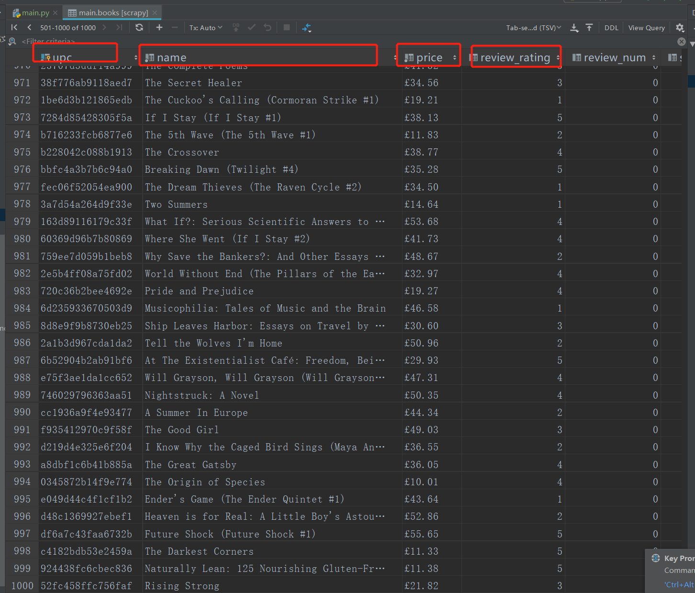

# 数据库：SQLite篇

①创建scrapy 爬虫项目
```
scrapy startproject books
cd books

#利用模板生成spider文件
scrapy genspider booksspider booksspider.toscrape.com
``` 


②创建SQLite数据库

`createDB.py`

``` 
#!/usr/bin/env python
#-*- coding:utf8 -*-
# auther; 18793
# Date：2019/8/13 9:43
# filename: createDB.py

# -*- coding: utf-8 -*-
import sqlite3

#连接数据库，得到Connection对象
conn = sqlite3.connect('scrapy.db')
#print(type(conn))

#创建Cursor对象，用于执行SQL语句
cur = conn.cursor()
#print(type(cur))

#创建数据表
cur.execute(''' CREATE TABLE books(
 upc CHAR(16) NOT NULL PRIMARY KEY,
 name VARCHAR(256) NOT NULL,
 price VARCHAR(16) NOT NULL,
 review_rating INT,
 review_num INT,
 stock INT
 );''')

#插入一条数据
# cur.execute('INSERT INTO person VALUES(?,?,?)',('李小龙',23,'M'))

#保存变更，commit后数据才会实际写入数据库
conn.commit()

#关闭连接
conn.close()
```


`booksspider.py` 蜘蛛文件内容如下：

``` 
# -*- coding: utf-8 -*-
import scrapy
from books.items import BooksItem
from scrapy.linkextractors import LinkExtractor


class BooksspiderSpider(scrapy.Spider):
    name = 'booksspider'
    allowed_domains = ['books.toscrape.com']
    start_urls = ['http://books.toscrape.com/']

    def parse(self, response):
        ##提取每本书的链接
        le = LinkExtractor(restrict_xpaths='//article[@class="product_pod"]')  ##具体位置在//article/div/a的标签中
        detail_urls = le.extract_links(response)
        for detail_url in detail_urls:
            yield scrapy.Request(detail_url.url, callback=self.parse_book)  ##记得使用.url提取出extract_links里面的链接。

        ##提取下一页的链接
        le2 = LinkExtractor(restrict_xpaths='//li[@class="next"]')
        next_url = le2.extract_links(response)[0].url
        yield scrapy.Request(next_url, callback=self.parse)

    def parse_book(self, response):
        ##提取每本书的具体信息
        item = BooksItem()
        info = response.xpath('//div[contains(@class,"product_main")]')
        item['name'] = info.xpath('h1/text()').extract()[0]
        item['price'] = info.xpath('p/text()').extract()[0]
        item['review_rating'] = info.xpath('p[3]/@class').re('star-rating (\w+)')[0]

        info2 = response.xpath('//table[contains(@class,"table")]')
        item['upc'] = info2.xpath('//tr[1]/td/text()').extract_first()
        item['stock'] = info2.xpath('//tr[6]/td/text()').re_first('\d+')
        item['review_num'] = info2.xpath('//tr[7]/td/text()').extract_first()
        yield item

```


`pipelines.py`
``` 
# 爬取到的数据写入到SQLite数据库
import sqlite3

class SQLitePipeline(object):

    # 打开数据库
    def open_spider(self,spider):
        db_name = spider.settings.get('SQLITE_DB_NAME','scrapy.db')

        self.db_conn = sqlite3.connect(db_name)
        self.db_cur = self.db_conn.cursor()
        
    # 关闭数据库
    def close_spider(self,spider):
        self.db_conn.commit()
        self.db_conn.close()
        
    # 对数据进行处理
    def process_item(self,item,spider):
        self.insert_db(item)
        
        return item

    # 插入数据
    def insert_db(self, item):
        values = (
            item['upc'],
            item['name'],
            item['price'],
            item['review_rating'],
            item['review_num'],
            item['stock']
        )

        sql = 'INSERT INTO books VALUES(?,?,?,?,?,?)'
        self.db_cur.execute(sql,values)

##处理review_rating的pipeline
class BooksPipeline(object):

    review_rating_map = {
        'One':1,
        'Two':2,
        'Three':3,
        'Four':4,
        'Five':5
    }


    def process_item(self, item, spider):
        # rating = item.get('review_rating')  #获取review_rating的数据
        rating = item['review_rating']  #与上面的语句等价
        item['review_rating'] = self.review_rating_map[rating]

        return item

```


`settings.py: 启用SQLitePipeline`
``` 
SQLITE_DB_NAME = 'scrapy.db'

ITEM_PIPELINES = {
   'books.pipelines.BooksPipeline': 300,    #原有的pipeline
    'books.pipelines.SQLitePipeline': 400,  #SQL的pipeline
}
```


`items.py`
``` 
import scrapy

class BooksItem(scrapy.Item):
    name = scrapy.Field()            #书名
    price = scrapy.Field()           #价格
    review_rating = scrapy.Field()   #评价等级（1-5星）
    review_num = scrapy.Field()      #评价数量
    upc = scrapy.Field()             #产品编码
    stock = scrapy.Field()           #库存量

```

运行cmd命令：scrapy crawl booksspider


或者写成`main.py`入口程序，如下：
``` 
#!/usr/bin/env python
#-*- coding:utf8 -*-
# auther; 18793
# Date：2019/8/13 10:17
# filename: main.py

from scrapy import cmdline
cmdline.execute("scrapy crawl booksspider".split())
```

执行爬虫程序后，查看结果如下：





