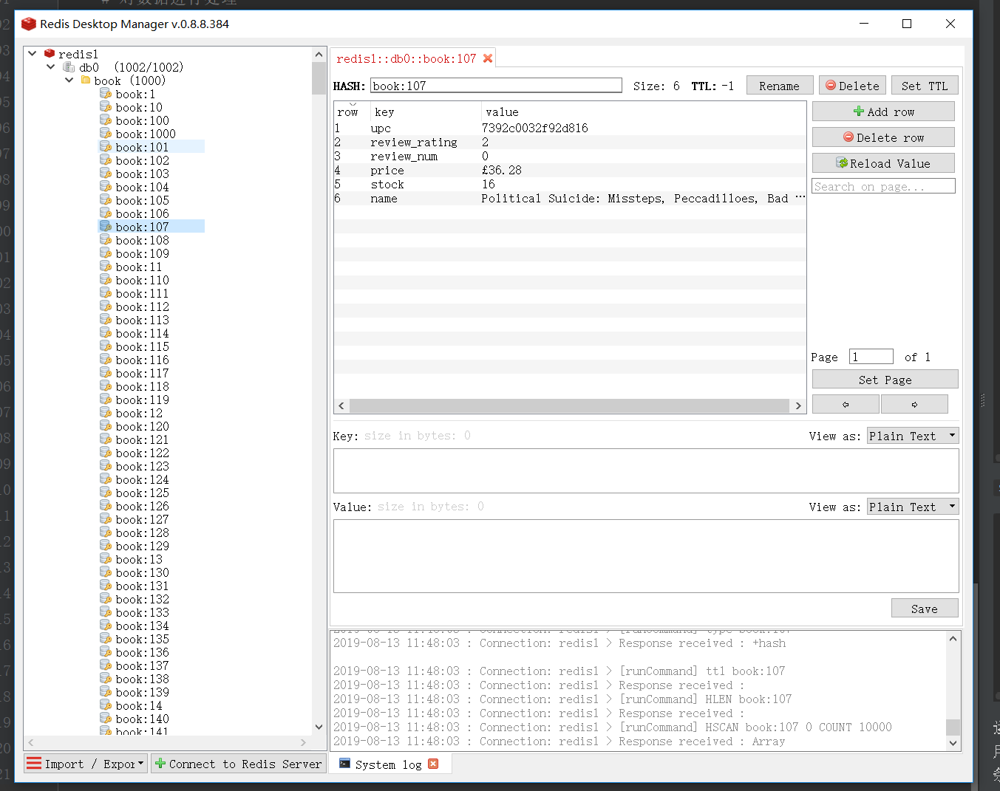

# 数据库：Redis篇
```
1.安装：https://github.com/MicrosoftArchive/redis/releases

2.Redis可视化工具：https://redisdesktop.com/download


3.第三方库采用redis
py -3 -m pip install redis

```

4.简单的测试小脚本

`conn_Redis.py`

``` 
#!/usr/bin/env python
# -*- coding:utf8 -*-
# auther; 18793
# Date：2019/8/13 10:41
# filename: conn_Redis.py

import redis

# 连接Redis，得到一个客户端对象
r = redis.StrictRedis(host='localhost', port=6379, db=0)

p1 = {
    'name': '李小龙',
    'age': 23,
    'sex': 'M',
}

p2 = {
    'name': '乔丹',
    'age': 23,
    'sex': 'M',
}

# 将数据保存到Redis中
r.hmset('person:1', p1)
r.hmset('person:2', p2)

# 关闭链接
r.connection_pool.disconnect()


```

在redis文件夹下以管理员身份直接打开“redis-cli.exe”，输入

KEYS person:* :可以查看到有两条数据。


使用Redis Desktop Manager更直观，


`连接Redis Server时Host为“127.0.0.1”，port为“6379”，name自己按照喜好填写即可。`


`如图所示`


5.实现1000条数据的导入，与前面设置相似。

`pipelines.py`

``` 
import redis
from scrapy import Item

class RedisPipeline(object):

    # 打开数据库
    def open_spider(self, spider):
        db_host = spider.settings.get('REDIS_HOST','localhost')
        db_port = spider.settings.get('REDIS_PORT',6379)
        db_index = spider.settings.get('REDIS_DB_INDEX',0)
        
        self.db_conn = redis.StrictRedis(host=db_host,port=db_port,db=db_index)
        self.item_i = 0

    # 关闭数据库
    def close_spider(self, spider):
        self.db_conn.connection_pool.disconnect()

    # 对数据进行处理
    def process_item(self, item, spider):
        self.insert_db(item)
        return item

    # 插入数据
    def insert_db(self, item):
        if isinstance(item,Item):
            info = dict(item)
            
        self.item_i += 1
        self.db_conn.hmset('book:{}'.format(self.item_i),info)

```

`setting.py`

``` 
REDIS_HOST = 'localhost'
REDIS_PORT = 6379
REDIS_DB_INDEX = 0

ITEM_PIPELINES = {
   'books.pipelines.BooksPipeline': 300,
    'books.pipelines.RedisPipeline': 404,
}
```

运行cmd命令：`scrapy crawl books`，用Redis Desktop Manager显示了1000条结果

`如下图所示`



也可以打开redis_cli.exe来进行查询
```
keys book:*
keys book:1
hgetall book:1
hgetall book:2
```