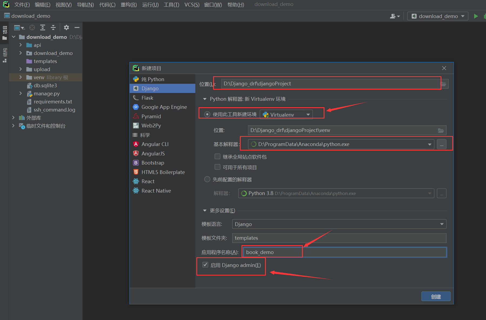

# 安装DjangoWeb框架

## 1.开发环境准备

> Python有两种安装组件的方法，分别是easy_install安装和pip安装。

### 1.1 easy_install和pip的使用


- 用easy_install管理其他组件

```
#安装组件
easy_install flask

#升级组件
easy_install upgrate flask

#用本地egg安装组件
easy_install  /my_download/flask-0.9.1-py2.7.egg


#通过-m卸载组件
easy_install -m flask
```

> 注意：安装前需要管理员权限运行

- 用pip管理其他组件


```
"""
1、采用国内源，加速下载模块的速度
2、常用pip源：
	-- 豆瓣：https://pypi.douban.com/simple
	-- 阿里：https://mirrors.aliyun.com/pypi/simple
3、加速安装的命令：
	-- >: pip install -i https://pypi.douban.com/simple 模块名
"""
```


```
# 安装组件
pip install tornado
pip install tornado=1.0.8

#升级组件
pip install -U tornado

#升级到指定的版本
pip install -U tornado=1.0.9

# 找到Pypi网站中与某关键字有关系的组件
pip search framework		//查找与 framework关键字相关的组件

#卸载组件
pip uninstall tornado

#查看所有选项
pip help
```


#### 永久配置PIP安装源

##### Windows

```
"""
1、文件管理器文件路径地址栏敲：%APPDATA% 回车，快速进入 C:\Users\电脑用户\AppData\Roaming 文件夹中
2、新建 pip 文件夹并在文件夹中新建 pip.ini 配置文件
3、新增 pip.ini 配置文件内容
"""
```

##### MacOS、Linux

```
"""
1、在用户根目录下 ~ 下创建 .pip 隐藏文件夹，如果已经有了可以跳过
	-- mkdir ~/.pip
2、进入 .pip 隐藏文件夹并创建 pip.conf 配置文件
	-- cd ~/.pip && touch pip.conf
3、启动 Finder(访达) 按 cmd+shift+g 来的进入，输入 ~/.pip 回车进入
4、新增 pip.conf 配置文件内容
"""
```

##### 配置文件内容

```
"""
[global]
index-url = http://pypi.douban.com/simple
[install]
use-mirrors =true
mirrors =http://pypi.douban.com/simple/
trusted-host =pypi.douban.com
"""
```


### 1.2 使用Python虚环境virtualenv

Python虚环境是一套由Ian Bicking编写的管理独立Python运行环境的系统。这样，开发者或系统管理者可以让每个项目运行在独立的虚环境中，从而避免了不同项目之间组件配置的冲突。

#### 1.虚环境的安装

```
# pip install virtualenv
```

#### 2 虚环境的使用

```
# 通过如下命令为一个已有的项目建立虚环境：

cd [项目所在目录]
virtualenv venv


#如果系统安装了多个python2/python3的环境，可以使用-p指定从哪个python版本复制虚拟环境
virtualenv venv -p /Library/Frameworks/Python.framework/Versions/3.7/bin/python
```

在当前虚环境下安装Tornado组件：

```
./venv/bin/pip install tornado
```

则该组件将被安装在venv/lib目录中，而不会影响系统的Python环境。

再比如，用该虚环境运行Python程序：

```
./venv/bin/python xxxx.py
```

也可以用activate命令启动虚环境，之后不必再显式地调用虚环境bin文件夹中的命令，如下命令与之前的/venv/bin/python命令的效果相同：

```
#source ./venv/bin/activate
(venv)#python xxxx.py
```

用deactivate命令可以退出用activate进入的虚环境，比如：

```
#./venv/bin/activate
(venv)#  /＊此处执行的命令在虚环境中运行＊/

#deactivate
#   /＊此处已退出虚环境＊/
```


#### 3. python3.3之后版本自带的venv模块

```
#创建虚拟环境
python -m venv project-env
cd  project-env

# 激活虚拟环境
source bin/activite
此时就可以在虚拟环境中使用pip install <package_name>来安装python包了

# 退出虚拟环境
deactivate
```


> 参考文献
>
> *虚拟环境的搭建*
>
> https://cuiqingcai.com/9212.html

## 2.安装django并创建项目

- 安装方式

```
- 1.使用pip安装

    pip install django==2.0.2
    
    
- 2. 使用virtualenv安装
    
    
    (venv)pip install django==2.0.2
    
    
- 3.使用anacoda安装
    
   
    conda install django==2.0.2
```


### 2.1 创建项目和app

```
django-admin startproject mysite_login

python manage.py startapp login
```


### 2.2 设置时区和语言

Django默认使用美国时间和英语，在项目的settings文件中

```
LANGUAGE_CODE = 'zh-hans'

TIME_ZONE = 'Asia/Shanghai'

USE_I18N = True

USE_L10N = True

USE_TZ = False
```

### 2.3 启动

```shell
$ python manage.py runserver 0.0.0.0:8001
```

其中runserver是启动网站的关键字，后面的参数指定网站绑定的IP地址与端口号。用0.0.0.0表示绑定本机的所有IP。


## 3.pychrm创建项目


