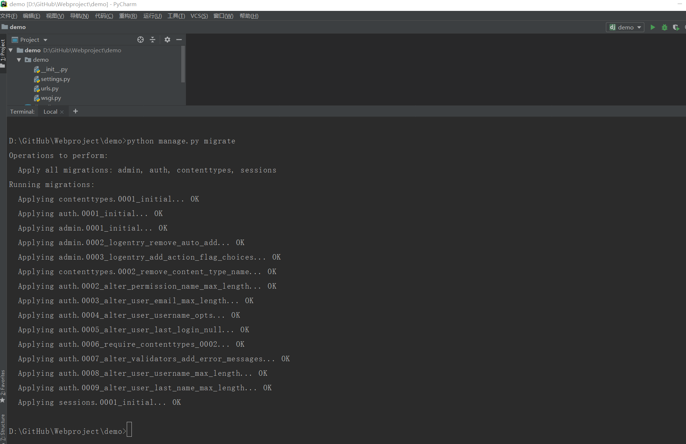

# Django框架的使用
## 创建一个Django项目

* 项目存放目录为：`D:\GitHub\Webproject`

* 1.创建environments目录用于放置虚拟环境
``` 
virtualenv  D:\GitHub\Webproject\venv
```

* 2.使用如下命令激活环境
```
D:\GitHub\Webproject\venv>d:\GitHub\Webproject\venv\Scripts\activate

(venv) D:\GitHub\Webproject>
```
* 3.使用"django-admin"命令创建一个项目
``` 
django-admin startproject demo
cd demo

#进入虚拟环境安装django2.0
(venv) D:\GitHub\Webproject\demo>pip install django==2.0
```

* 4.使用pychrm打开demo项目，查看目录结构


```
#运行项目
python manage.py runserver


#为Django项目生成数据表，创建账户名和密码
python manage.py migrate			#执行数据库迁移生成数据库
python manage.py createsuperuser	#按照提示输入账户和密码，强度复合一定的规则要求
```



    D:\GitHub\Webproject\demo>python manage.py createsuperuser
    Username (leave blank to use '18793'): hujianli
    Email address: 1879324764@qq.com
    Password:
    Password (again):
    Superuser created successfully.


```
运行项目,并访问
http://127.0.0.1:8000/admin/
```
### 总结
```

创建一个Django 项目
创建项目：
django-admin startproject demo   
或者
python manage.py startapp blog


运行程序：python manage.py runserver
生成迁移文件: python manage.py makemigrations
数据迁移,创建新表：python manage.py migrate
创建管理员：python manage.py createsuperuser

```


## 创建App


    D:\GitHub\Webproject\demo>python manage.py startapp app1
    此时根目录下又多了一个"app1"的目录，如图：


* 将app1应用加入到项目中

```
修改setting文件
INSTALLED_APPS = [
    'django.contrib.admin',
    'django.contrib.auth',
    'django.contrib.contenttypes',
    'django.contrib.sessions',
    'django.contrib.messages',
    'django.contrib.staticfiles',
    'app1',
]


#设置在app1的__init__文件中
import pymysql         # 一定要添加这两行！通过pip install pymysql  设置在app1的__init__文件中
pymysql.install_as_MySQLdb()


DATABASES = {
    'default': {
        'ENGINE': 'django.db.backends.mysql',
        'NAME': 'mysite',
        'HOST': '192.168.1.1',
        'USER': 'root',
        'PASSWORD': 'pwd',
        'PORT': '3306',
    }
}
	

#生成迁移文件
python manage.py makemigrations

#迁移数据库，创建新表
python manage.py migrate


#了解Django命令的API
python manage.py shell	
	
	
#### 启用交互命令
python manage.py shell	

#创建数据 方式1
>>> from app1.models import Person,Order
>>> p = Person(first_name="hujianli",last_name="胡")
>>> p.save()

方式2
p  = Person.objects.create(first_name="kebi",last_name="hu")
     
     
## 查询数据
>>> Person.objects.all()
<QuerySet [<Person: Person object (1)>, <Person: Person object (2)>]>
>>> Person.objects.get(first_name="hujianli")
<Person: Person object (1)>
 
 
## 查询指定条件的数据
>>> Person.objects.filter(first_name__exact="hujianli")
<QuerySet [<Person: Person object (1)>]>
>>> Person.objects.filter(first_name__exact="kebi")
<QuerySet [<Person: Person object (2)>]>
>>> Person.objects.filter(id__gt=1)
<QuerySet [<Person: Person object (2)>]>
>>> Person.objects.filter(id__lt=100)
<QuerySet [<Person: Person object (1)>, <Person: Person object (2)>]>

## 修改查询到的数据
>>> p = Person.objects.get(first_name="hujianli")
>>> p.first_name = "huxiaojian"
>>> p.last_name = "xiaojian"
>>> p.save()

## 删除数据
>>> Person.objects.get(id=1).delete()
(1, {'app1.Person': 1})
```

## 数据模型（models）
在app1的models.py中添加如下代码
``` python
from django.db import models  # 引入django.db.models模块


class CreateUpdate(models.Model):  # 创建抽象数据模型，同样要继承于models.Model
    # 创建时间，使用models.DateTimeField
    created_at = models.DateTimeField(auto_now_add=True)
    # 修改时间，使用models.DateTimeField
    updated_at = models.DateTimeField(auto_now=True)

    class Meta:  # 元数据，除了字段以外的所有属性
        # 设置model为抽象类。指定该表不应该在数据库中创建
        abstract = True


class Person(CreateUpdate):  # 继承CreateUpdate基类
    first_name = models.CharField(max_length=30)
    last_name = models.CharField(max_length=30)


    
class Order(CreateUpdate):  # 继承CreateUpdate基类
    order_id = models.CharField(max_length=30, db_index=True)
    order_desc = models.CharField(max_length=120)

```

python manage.py makemigrations

python manage.py migrate


## Python项目的组织结构

项目结构为统一的组织原则。

组织原则可以总结为一句话：*让一切更简单更轻松*

我们来看一个通用的结构

```
download_demo
├── LICENSE
├── MANIFEST.in
├── README.md
├── conf
├── fabfile
├── others
├── src
├── setup.py
└── .gitignore
├── requirements.txt
└── venv
└── img
```

这是python项目最外层的一个结构：

-  LICENSE: 表示开源协议
-  README.md：项目介绍
-  conf：存放项目的配置文件，如部署时用到的Nginx的配置、Supervisor的配置或者其他配置
-  fabfile：针对Fabric的配置，可以是一个fabfile.py文件。如果功能较多，可以拆分多个模块，放到fabfile包下，用\_\_init\_\_.py进行暴露
-  src：项目源码目录
-  requirements.txt：项目依赖模块，通过`pip install -r requirements.txt`就可以安装好项目的所有依赖
-  setup.py：用来打包项目
-  others：其他一些有必要放到源码管理的文件。
-  .gitignore: 忽略一些不需要被纳管的管理文件，如pyc和log、env、\*.swp等文件或目录，常用过滤掉的还有dist/和 build/等目录，如加入常见的build、dist、.so、\*.pyc。
-  MANIFEST.in：跟setup.py配合使用
-  venv：虚拟环境目录。
- img：README.md说明文档中引用图片图标的放置目录


## Django项目的组织结构

```
project(src)
├── app1
│   ├── __init__.py
│   ├── admin.py
│   ├── apps.py
│   ├── migrations
│   ├── models.py
│   ├── script
│   ├── serializers.py
│   ├── tests.py
│   └── views.py
├── app2
├── db.sqlite3
├── project
│   ├── asgi.py
│   ├── settings.py
│   ├── urls.py
│   └── wsgi.py
├── manage.py
├── requirements.txt
├── templates
├── upload
└── venv
    ├── Lib
    ├── pyvenv.cfg
    └── Scripts
```


### settings的拆分

正常情况下Django会为我们创建一个settings.py文件，我们需要区分开发环境和线上环境。


具体的做法是在之前 settings目录中新建settings包，把之前settings.py的内容放置到settings/base.py中，删除原来的settings.py文件，同时新增\_\_init\_\_.py、develop.py、product.py文件。

目录结构如下：

```
project(src)
├── app1
├── app2
├── db.sqlite3
├── project
├── __init__.py
├── asgi.py
├── settings
│   ├── base.py
│   ├── develop.py
│   └── product.py
├── urls.py
└── wsgi.py
├── manage.py
├── requirements.txt
├── templates
```


**base.py的内容和之前settings.py的内容一致。**

**develop.py（开发）环境配置**

```python
from .base import *

SECRET_KEY = '这里是你pycharm自己生成的秘钥'

# 开发环境数据库
DATABASES = {
    'default': {
        'ENGINE': 'django.db.backends.mysql',
        'NAME': 'mytest',
        'USER': 'root',
        'PASSWORD': 'OSChina@2020',
        'HOST': '127.0.0.1',
        # 第三方登录功能必须加上
        "OPTIONS": {"init_command": "SET default_storage_engine=INNODB;"}
    }
}

# 线下开发模式是True
DEBUG = True

ALLOWED_HOSTS = ["*"]
```

**product.py（开发）环境配置**

```python
from .base import *

SECRET_KEY = '这里是你pycharm自己生成的秘钥'

# 线上数据库
DATABASES = {
    'default': {
        'ENGINE': 'django.db.backends.mysql',
        'NAME': 'openvpndb',
        'USER': 'root',
        'PASSWORD': 'OSChina@2020',
        'HOST': '192.168.1.132',
        # 第三方登录功能必须加上
        'CONN_MAX_AGE': 5*60,
        "OPTIONS": {"init_command": "SET default_storage_engine=INNODB;"}
    }
}

# 线上调试模式是False
DEBUG = False

ALLOWED_HOSTS = [www.hujianlirunjs.com]
```


拆分完settings.py后，我们需要修改两个文件：manage.py、wsgi.py

manage.py和wsgi.py都更改为

```
profile = os.environ.get('PROJECT_PROFILE', 'develop')
os.environ.setdefault('DJANGO_SETTINGS_MODULE', 'download_demo.settings.{}'.format(profile))
```


pychrm中修改运行按钮为：

```
PYTHONUNBUFFERED=1;DJANGO_SETTINGS_MODULE=project.settings.develop
```


>  拆分settings.py的作用是保证开发的组织合理性，降低后期开发维护的成本

