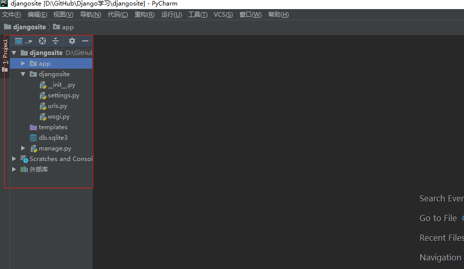
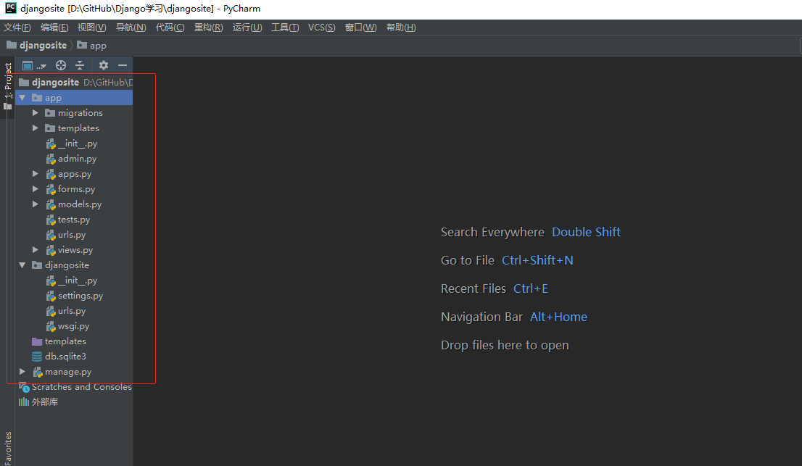
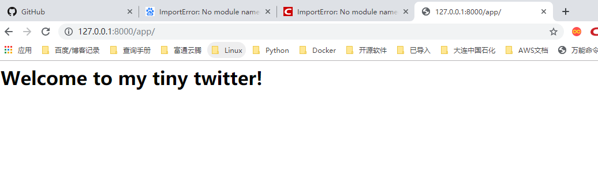
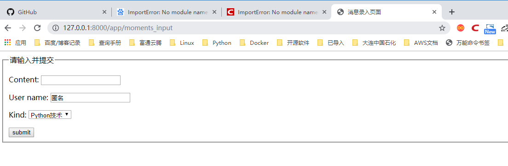

# 实战演练-开发Django站点

## 建立项目
``` 
django-admin startproject djangosite
```
## 建立应用

```
cd djangosite
python manage.py start app
```

完成后，会在项目目录中建立如下的目录及文件结构




```
对其中的文件功能解析如下。
* __init__.py ： 其中暂无内容,该文件的存在使得app 成为一个python 包。
* admin.py ： 管理站点模型的声明文件， 默认为空。
* apps.py： 应用信息定义文件.在其中生成了类AppConfig 该类用于定义应用名等Meta等数据。
* migrations 包： 用于在之后定义引用迁移功能。
* models.py ： 添加模型层数据类的文件。
* tests.py ： 测试代码文件。
* views.py ： 定义URL 响应函数。
```


设置中文settings.py

```
LANGUAGE_CODE = 'zh-hans'
TIME_ZONE = 'Asia/Shanghai'
USE_I18N = True
USE_L10N = True
USE_TZ = False
```


(1) 首先在django/app/views.py中建立一个路由响应函数

```python
 # Create your views here.
from django.http import HttpResponse


def welcome(request):
    return HttpResponse("<h1>Welcome to my tiny twitter!</h1>")
```


(2) 通过URL映射将用户的HTTP访问与该函数绑定起来
在django/app目录中新建一个urls.py文件。管理app的索引URL映射，文件内容如下

``` python
from django.conf.urls import url

from . import views

urlpatterns = [
    url(r'', views.welcome),        #把索引路由映射到view.py中的welcome函数

```

（3）在项目URL文件djangosite/urls.py的urlpatterns中新建一项，声明对应用app中urls.py文件的引用，代码如下：

``` python
from django.contrib import admin
from django.conf.urls import url
from django.conf.urls import include  # 本行新增

urlpatterns = [
    url(r'^app/', include('app.urls')),  # 本行新增，url()函数的第1个参数用正则表达式表达URL路由
    url(r'^admin/', admin.site.urls),
]

```

## 访问应用
内置Web服务器
``` 
cd djangosite
python manage,py runserver 0.0.0.0 8001
```



## 模型类

### 1.配置项目 INSTALLEN_APPS

app.apps.AppConfig声明的是djangosite/app/apps.py中指定生成的AppConfig类
``` 
INSTALLED_APPS = [
    'app.apps.AppConfig',           # 新增此行
    'django.contrib.admin',
    'django.contrib.auth',
    'django.contrib.contenttypes',
    'django.contrib.sessions',
    'django.contrib.messages',
    'django.contrib.staticfiles',
]
```

### 2.模型定义

djangosite/app/models.py 在其中新建一个模型类Moment用来定义信息发布表。代码如下：

``` python
# -*- coding: utf-8 -*-
from __future__ import unicode_literals

from django.db import models

# Create your models here.  

# Create your models here.
class Moment(models.Model):
    content = models.CharField(max_length=300)
    user_name = models.CharField(max_length=20)

    kind = models.CharField(max_length=20)
```

### 3.生成数据移植文件
``` 
cd djangosite
python manage.py makemigrations app
```

## 4.移植到数据库
``` 
python manage.py migrate
```
每次修改模型类后，都需要生成移植文件，然后将移植的文件同步到数据库中。

## 表单视图

### 1.定义表单类
djangosite/app/forms.py,定义表单类MomnetForm，代码如下：
``` python
from django.forms import ModelForm  # 导入django.forms.ModelForm类，该类时所用Django表单类的基类
from app.models import Moment

class MomentForm(ModelForm):
    class Meta:
        model = Moment  # 定义MomentForm在其子类定义Meta，在Meta中声明与本表单关联的模型类及其字段
        fields = '__all__'  # 导入所有字段
```

### 2.修改模型类。
为了用户能够以单选的方式设置消息类型，需要在modules.py文件中定义单选枚举值，
并与模型类Moment相关联。修改djangosite/app/models.py如下：

``` python
# -*- coding: utf-8 -*-
from __future__ import unicode_literals

from django.db import models

# Create your models here.  
KIND_CHOICES = (
    ('Python技术', 'Python技术'),
    ('数据库技术', '数据库技术'),
    ('经济学', '经济学'),
    ('文体资讯', '文体资讯'),
    ('个人心情', '个人心情'),
    ('其他', '其他'),
)


# Create your models here.
class Moment(models.Model):
    content = models.CharField(max_length=300, null=False)
    # 为user_name和kind字段用default属性增加了默认值
    user_name = models.CharField(max_length=20, default='匿名')
    # 修改kind定义，加入choices参数
    kind = models.CharField(max_length=20, choices=KIND_CHOICES, default=KIND_CHOICES[0])
```

### 3.再次生成移植文件，并将移植的数据同步到数据库
``` 
cd djangosite
python manage.py makemigrations 
python manage.py migrate
```

### 4.开发模板文件
建立目录djangosite/app/templates，在其中新建模板文件moments_input.html.文件内容如下：
``` 
<!DOCTYPE html>  
</html>      
    <head>  
        <title>消息录入页面</title>  
    </head>  
    <body>
        <form action="?" method="post">   
          
            <fieldset>  
                <legend>请输入并提交</legend>  
                        {{ form.as_p }}  

                        <input type="submit" value="submit" />  
            </fieldset>  
        </form>  
    </body>  
</html>  

```
### 5.开发视图
开发视图函数，是表单类和页面模板衔接起来。打开djangosite/app/views.py文件。
在其中加入如下函数：
``` python
# -*- coding: utf-8 -*-
from django.shortcuts import render

# Create your views here.
from django.http import HttpResponse
from app.forms import MomentForm
from django.http import HttpResponseRedirect
from django.urls import reverse


def welcome(request):
    return HttpResponse("<h1>Welcome to my tiny twitter!</h1>")


def moments_input(request):
    data = {'content': '请填写内容', 'user_name': '匿名'}
    if request.method == 'POST':
        form = MomentForm(request.POST, initial=data)
        if form.is_valid():
            moment = form.save()
            moment.save()
            return HttpResponseRedirect(reverse("app.views.welcome"))
    else:
        form = MomentForm()
    import os
    PROJECT_ROOT = os.path.dirname(os.path.dirname(os.path.abspath(__file__)))
    print(PROJECT_ROOT)
    return render(request, os.path.join(PROJECT_ROOT, 'app/templates', 'moments_input.html'), {'form': form})

```

在djangosite/app/urls.py文件中增加该视图函数的路由映射,内容如下：
``` python
from django.conf.urls import url

from . import views

urlpatterns = [
    url(r'moments_input', views.moments_input),
    url(r'', views.welcome),
    # url(r'^myadmin/',admin_site.url),
]
```

### 访问界面



### 使用管理界面
Django管理界面是一个通过嘉安达的配置就可以实现的数据模型后台的Web控制台，
管理界面退出时给系统管理员使用的，以完成元数据的输入、删除、查询等工作。

djangosite/app/admin.py文件中
```python
from django.contrib import admin
from .models import Moment

# Register your models here.
admin.site.register(Moment)
```

通过manage.py工具的createsuperuser命令建立管理员用户

`python manage.py createsuperuser`

之后就可以访问：
``` 
http://127.0.0.1:8000/admin
```