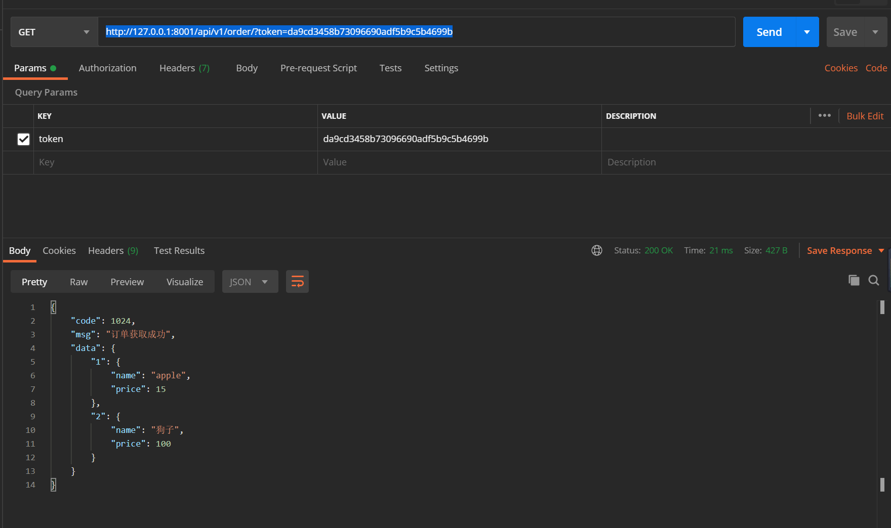

# drf-认证

## 1.项目案例

### 1.1 生成项目

(1）新建Django项目并命名为django_app1，同时新建App，命名为app1。


(2) 在PyCharm中打开项目终端，安装相关依赖包：

```bash
pip install Djangorestframework markdown Django-filter pillow Django-guardian coreapi -i "https://pypi.doubanio.com/simple/"
```


(3) 然后将`django rest framework`作为第三方包放入django项目中

```
INSTALLED_APPS = [
    'django.contrib.admin',
    'django.contrib.auth',
    'django.contrib.contenttypes',
    'django.contrib.sessions',
    'django.contrib.messages',
    'django.contrib.staticfiles',
    'app1.apps.App1Config',
    'rest_framework'
]


MIDDLEWARE = [
    'django.middleware.security.SecurityMiddleware',
    'django.contrib.sessions.middleware.SessionMiddleware',
    'django.middleware.common.CommonMiddleware',
    # 'django.middleware.csrf.CsrfViewMiddleware',
    'django.contrib.auth.middleware.AuthenticationMiddleware',
    'django.contrib.messages.middleware.MessageMiddleware',
    'django.middleware.clickjacking.XFrameOptionsMiddleware',
]
```


### 1.2 数据库设计

先来看一下如果不使用`drf`怎么进行用户认证，通常是用字段验证的方式，来生成相应的数据库，在用户登录时候，对数据库查询，简单的数据库设计如下

```
from django.db import models


class UserInfo(models.Model):
    USER_TYPE = (
        (1,'普通用户'),
        (2,'VIP'),
        (3,'SVIP')
    )

    user_type = models.IntegerField(choices=USER_TYPE， default=1)
    username = models.CharField(max_length=32)
    password = models.CharField(max_length=64)

class UserToken(models.Model):
    user = models.OneToOneField(UserInfo,on_delete=models.CASCADE)
    token = models.CharField(max_length=64)
```


简单的用户信息，每个用户关联一个一对一的usertoken做为验证
然后在项目目录下执行生成数据库命令

```
python manage.py makemigrations
python manage.py migrate
```


### 1.3 路由系统

```
from django.contrib import admin
from django.urls import path
from django.conf.urls import url

from app1.views import AuthView

urlpatterns = [
    path('admin/', admin.site.urls),
    url(r'^api/v1/auth/$', AuthView.as_view())
]
```

api/v1/auth/中的api分别代表接口和版本号，后面会说到


### 1.4 视图函数

- md5函数根据用户名和用户的访问时间进行加密
- 当用户第一次访问时，数据库创建用户，并将token``字符串，存储到数据库
- 当用户下次访问的时候，需要带着这个字符串与数据库比对，并返回相应的提示信息
  这里的token``暂时没有放回浏览器端，真正项目中可以写入到浏览器cookie``中

```
from django.shortcuts import render
from rest_framework.views import APIView
from app1 import models
import json
from django.shortcuts import render, HttpResponse
from django.http import JsonResponse
from django.views import View

def md5(user):
    import hashlib
    import time

    # 当前时间，相当于生成一个随机的字符串
    ctime = str(time.time())

    # token加密
    m = hashlib.md5(bytes(user, encoding='utf-8'))
    m.update(bytes(ctime, encoding='utf-8'))
    return m.hexdigest()


class AuthView(View):

    def get(self, request, *args, **kwargs):
        ret = {'code': 1000, 'msg': 'success', 'name': '偷偷'}
        ret = json.dumps(ret, ensure_ascii=False)

        return HttpResponse(ret)

    def post(self, request, *args, **kwargs):
        ret = {'code': 1000, 'msg': None}
        try:
            user = request.POST.get('username')
            pwd = request.POST.get('password')
            obj = models.UserInfo.objects.filter(username=user).first()

            if not obj:
                # 如果用户第一次登陆则创建用户
                obj = models.UserInfo.objects.create(username=user, password=pwd)
                ret['code'] = 1001
                ret['msg'] = '创建用户成功'

            # 为用户创建token
            token = md5(user)
            # 存在就更新，不存在就创建
            models.UserToken.objects.update_or_create(user=obj, defaults={'token': token})
            ret['token'] = token
        except Exception as e:
            ret['code'] = 1002
            ret['msg'] = '请求异常'
        return JsonResponse(ret)
```


第一次发送请求,返回请求信息

```
{
    "code": 1001,
    "msg": "创建用户成功",
    "token": "25464d68d74d9128d830ca3cf1af248a"
}
```

第二次发送请求,返回请求信息

```
{
    "code": 1000,
    "msg": null,
    "token": "68faf304a9a8f8af14ec549d12969880"
}
```

这里没有使用drf的认证组件


## 2. 使用Django rest framewok 认证组件

 基于上面的例子，添加一个认证的类

### 2.1 url

```
    path('api/v1/order/', OrderView.as_view()),
```

### 2.1 实例

假如用户想获取自己的订单信息，发送请求之后返回订单信息以`json`格式的数据返回。

```
from rest_framework.views import APIView
from django.http import JsonResponse
from rest_framework.authentication import BaseAuthentication
from rest_framework import exceptions

from app1 import models

# 这里直接表示订单
ORDER_DICT = {
    1: {
        'name': 'apple',
        'price': 15
    },
    2: {
        'name': '狗子',
        'price': 100
    }
}


class FirstAuthenticate(BaseAuthentication):
    # 添加自己的认证逻辑，基类BaseAuthentication中有一个必须要重写的接口

    def authenticate(self, request):
        pass

    def authenticate_header(self, request):
        pass


class MyAuthenticate(BaseAuthentication):
    # 添加自己的认证逻辑，基类BaseAuthentication中有两个必须要重写的接口

    def authenticate(self, request):
        token = request._request.GET.get('token')  # 获取token参数
        token_obj = models.UserToken.objects.filter(token=token).first()  # 在数据库UserToken查找是否有相应的对象
        if not token_obj:  # 如果没有，则报错
            raise exceptions.AuthenticationFailed('用户认证失败')
        return (token_obj.user, token_obj)  # 这里需要返回两个对象，分别是UserInfo对象和UserToken对象

    def authenticate_header(self, request):  # 返回相应头信息
        pass


class OrderView(APIView):
    # 用户想要获取订单，就要先通过身份认证、
    # 这里的authentication_classes 就是用户的认证类
    authentication_classes = [FirstAuthenticate, MyAuthenticate]

    def get(self, request, *args, **kwargs):
        ret = {
            'code': 1024,
            'msg': '订单获取成功',
        }
        try:
            ret['data'] = ORDER_DICT
        except Exception as e:
            pass
        return JsonResponse(ret)

```

这里继承了`rest framek`中的`APIView`，在`APIView`中将原生的`request`进行了封装，封装了一些用于认证，权限的类，

在请求来的时候，会依次通过`FirestAuthenticate`，`MyAuthenticate`两个类，并调用`authenticate`进行认证。


发送正确请求



发送错误请求

```
{
    "detail": "用户认证失败"
}
```


### 2.3 源码分析

略..后续补充


## 3.理论参考文献


https://www.cnblogs.com/derek1184405959/p/8712206.html

https://www.cnblogs.com/welan/p/10100563.html