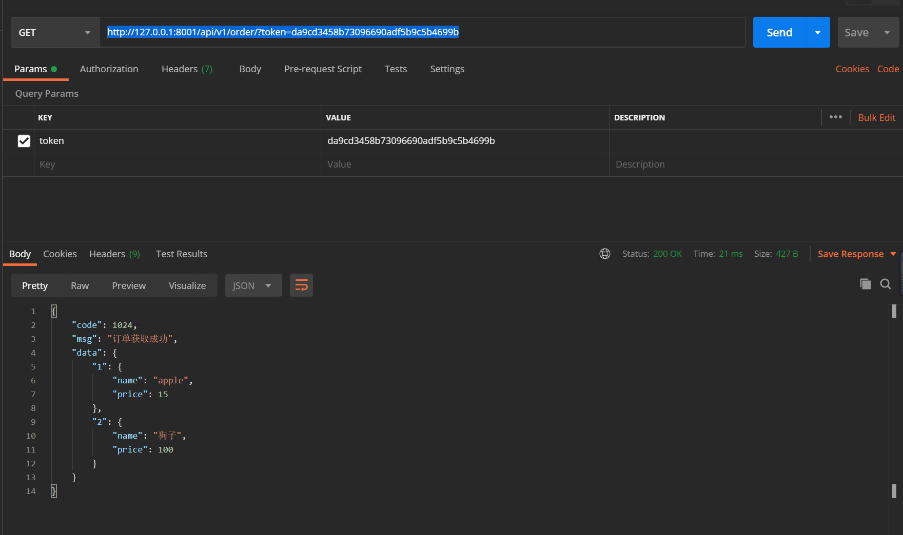

.. contents::
   :depth: 3
..

drf-认证
========

1.项目案例
----------

1.1 生成项目
~~~~~~~~~~~~

(1）新建Django项目并命名为django_app1，同时新建App，命名为app1。

(2) 在PyCharm中打开项目终端，安装相关依赖包：

.. code:: bash

   pip install Djangorestframework markdown Django-filter pillow Django-guardian coreapi -i "https://pypi.doubanio.com/simple/"

(3) 然后将\ ``django rest framework``\ 作为第三方包放入django项目中

::

   INSTALLED_APPS = [
       'django.contrib.admin',
       'django.contrib.auth',
       'django.contrib.contenttypes',
       'django.contrib.sessions',
       'django.contrib.messages',
       'django.contrib.staticfiles',
       'app1.apps.App1Config',
       'rest_framework'
   ]

   MIDDLEWARE = [
       'django.middleware.security.SecurityMiddleware',
       'django.contrib.sessions.middleware.SessionMiddleware',
       'django.middleware.common.CommonMiddleware',
       # 'django.middleware.csrf.CsrfViewMiddleware',
       'django.contrib.auth.middleware.AuthenticationMiddleware',
       'django.contrib.messages.middleware.MessageMiddleware',
       'django.middleware.clickjacking.XFrameOptionsMiddleware',
   ]

1.2 数据库设计
~~~~~~~~~~~~~~

先来看一下如果不使用\ ``drf``\ 怎么进行用户认证，通常是用字段验证的方式，来生成相应的数据库，在用户登录时候，对数据库查询，简单的数据库设计如下

::

   from django.db import models

   class UserInfo(models.Model):
       USER_TYPE = (
           (1,'普通用户'),
           (2,'VIP'),
           (3,'SVIP')
       )

       user_type = models.IntegerField(choices=USER_TYPE， default=1)
       username = models.CharField(max_length=32)
       password = models.CharField(max_length=64)

   class UserToken(models.Model):
       user = models.OneToOneField(UserInfo,on_delete=models.CASCADE)
       token = models.CharField(max_length=64)

简单的用户信息，每个用户关联一个一对一的usertoken做为验证
然后在项目目录下执行生成数据库命令

::

   python manage.py makemigrations
   python manage.py migrate

1.3 路由系统
~~~~~~~~~~~~

::

   from django.contrib import admin
   from django.urls import path
   from django.conf.urls import url

   from app1.views import AuthView

   urlpatterns = [
       path('admin/', admin.site.urls),
       url(r'^api/v1/auth/$', AuthView.as_view())
   ]

api/v1/auth/中的api分别代表接口和版本号，后面会说到

1.4 视图函数
~~~~~~~~~~~~

-  md5函数根据用户名和用户的访问时间进行加密
-  当用户第一次访问时，数据库创建用户，并将token``字符串，存储到数据库
-  当用户下次访问的时候，需要带着这个字符串与数据库比对，并返回相应的提示信息
   这里的token\ ``暂时没有放回浏览器端，真正项目中可以写入到浏览器cookie``\ 中

::

   from django.shortcuts import render
   from rest_framework.views import APIView
   from app1 import models
   import json
   from django.shortcuts import render, HttpResponse
   from django.http import JsonResponse
   from django.views import View

   def md5(user):
       import hashlib
       import time

       # 当前时间，相当于生成一个随机的字符串
       ctime = str(time.time())

       # token加密
       m = hashlib.md5(bytes(user, encoding='utf-8'))
       m.update(bytes(ctime, encoding='utf-8'))
       return m.hexdigest()

   class AuthView(View):

       def get(self, request, *args, **kwargs):
           ret = {'code': 1000, 'msg': 'success', 'name': '偷偷'}
           ret = json.dumps(ret, ensure_ascii=False)

           return HttpResponse(ret)

       def post(self, request, *args, **kwargs):
           ret = {'code': 1000, 'msg': None}
           try:
               user = request.POST.get('username')
               pwd = request.POST.get('password')
               obj = models.UserInfo.objects.filter(username=user).first()

               if not obj:
                   # 如果用户第一次登陆则创建用户
                   obj = models.UserInfo.objects.create(username=user, password=pwd)
                   ret['code'] = 1001
                   ret['msg'] = '创建用户成功'

               # 为用户创建token
               token = md5(user)
               # 存在就更新，不存在就创建
               models.UserToken.objects.update_or_create(user=obj, defaults={'token': token})
               ret['token'] = token
           except Exception as e:
               ret['code'] = 1002
               ret['msg'] = '请求异常'
           return JsonResponse(ret)

第一次发送请求,返回请求信息

::

   {
       "code": 1001,
       "msg": "创建用户成功",
       "token": "25464d68d74d9128d830ca3cf1af248a"
   }

第二次发送请求,返回请求信息

::

   {
       "code": 1000,
       "msg": null,
       "token": "68faf304a9a8f8af14ec549d12969880"
   }

这里没有使用drf的认证组件

2. 使用Django rest framewok 认证组件
------------------------------------

基于上面的例子，添加一个认证的类

2.1 url
~~~~~~~

::

       path('api/v1/order/', OrderView.as_view()),

2.1 实例
~~~~~~~~

假如用户想获取自己的订单信息，发送请求之后返回订单信息以\ ``json``\ 格式的数据返回。

::

   from rest_framework.views import APIView
   from django.http import JsonResponse
   from rest_framework.authentication import BaseAuthentication
   from rest_framework import exceptions

   from app1 import models

   # 这里直接表示订单
   ORDER_DICT = {
       1: {
           'name': 'apple',
           'price': 15
       },
       2: {
           'name': '狗子',
           'price': 100
       }
   }

   class FirstAuthenticate(BaseAuthentication):
       # 添加自己的认证逻辑，基类BaseAuthentication中有一个必须要重写的接口

       def authenticate(self, request):
           pass

       def authenticate_header(self, request):
           pass

   class MyAuthenticate(BaseAuthentication):
       # 添加自己的认证逻辑，基类BaseAuthentication中有两个必须要重写的接口

       def authenticate(self, request):
           token = request._request.GET.get('token')  # 获取token参数
           token_obj = models.UserToken.objects.filter(token=token).first()  # 在数据库UserToken查找是否有相应的对象
           if not token_obj:  # 如果没有，则报错
               raise exceptions.AuthenticationFailed('用户认证失败')
           return (token_obj.user, token_obj)  # 这里需要返回两个对象，分别是UserInfo对象和UserToken对象

       def authenticate_header(self, request):  # 返回相应头信息
           pass

   class OrderView(APIView):
       # 用户想要获取订单，就要先通过身份认证、
       # 这里的authentication_classes 就是用户的认证类
       authentication_classes = [FirstAuthenticate, MyAuthenticate]

       def get(self, request, *args, **kwargs):
           ret = {
               'code': 1024,
               'msg': '订单获取成功',
           }
           try:
               ret['data'] = ORDER_DICT
           except Exception as e:
               pass
           return JsonResponse(ret)

这里继承了\ ``rest framek``\ 中的\ ``APIView``\ ，在\ ``APIView``\ 中将原生的\ ``request``\ 进行了封装，封装了一些用于认证，权限的类，

在请求来的时候，会依次通过\ ``FirestAuthenticate``\ ，\ ``MyAuthenticate``\ 两个类，并调用\ ``authenticate``\ 进行认证。

发送正确请求

发送错误请求

::

   {
       "detail": "用户认证失败"
   }

2.3 源码分析
~~~~~~~~~~~~

略..后续补充

3.理论参考文献
--------------

https://www.cnblogs.com/derek1184405959/p/8712206.html

https://www.cnblogs.com/welan/p/10100563.html
