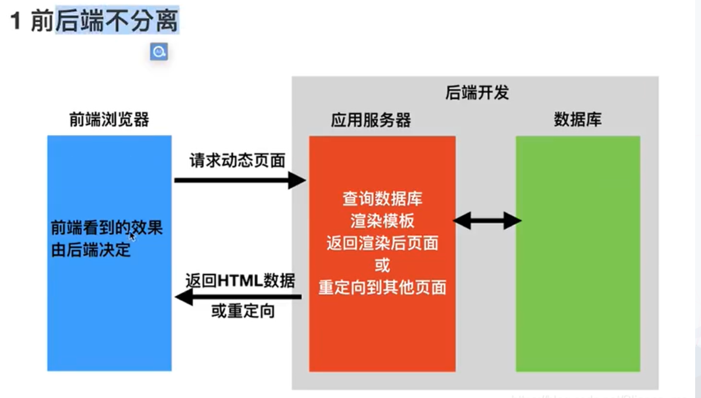
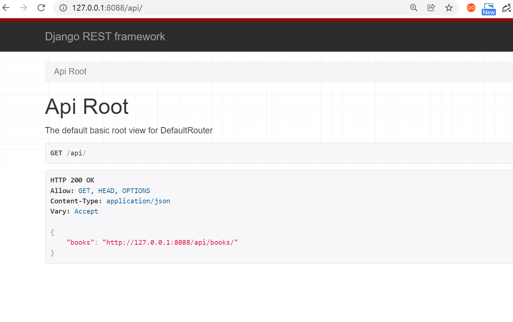
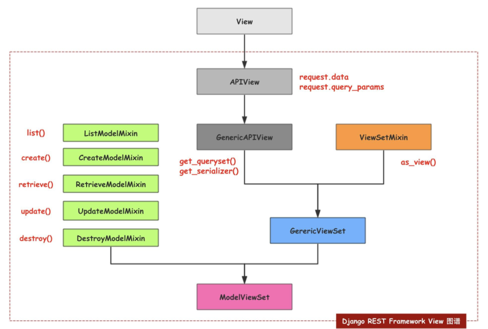
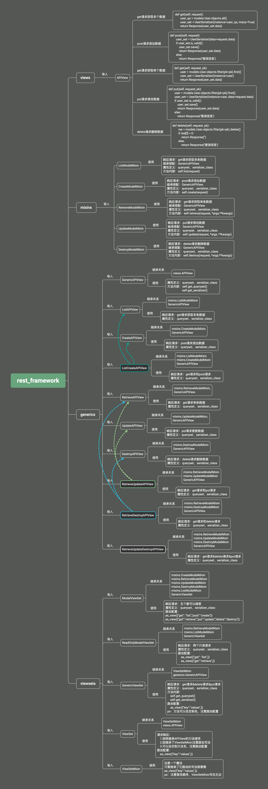

.. contents::
   :depth: 3
..

django-rest-framework学习
=========================

1. 引入DjangoRESTframework
--------------------------

1.1 Web应用模式
~~~~~~~~~~~~~~~

前后端不分离
^^^^^^^^^^^^

前后端分离
^^^^^^^^^^

.. image:: ../../../_static/image-20220314143051095.png

在前后端分离的应用模式中，后端仅返回前端所需的数据，不在渲染HTML页面，不再控制前端的效果，至于前端用户看到什么效果，从后端的数据如何加载到前端，都由前端自己决定，

网页有网页的处理方式，APP有app的处理方式，但无论那种前端，所需的数据基本相同，后端仅需开发一套逻辑对外提供数据即可。

在前后端分离项目中，前端与后端的耦合度相对较低。

在前后端分离模式中，我们通常将后端开发的每个视图称为一个接口，或者API，前端通过访问接口对数据进行CURD（增删改查）

1.2 认识RESTful
~~~~~~~~~~~~~~~

**在前后端分离的应用模式里，API接口如何定义？**

参考：

`RESTful 规范 <https://www.cnblogs.com/welan/p/9875103.html>`__

1.3 RESTful设计方法
~~~~~~~~~~~~~~~~~~~

(1）如果是对同一个表进行数据操作（增、删、改、查），应该使用一条API，然后根据method的不同，进行不同的操作。

::

   GET/POST/PUT/DELETE/PATCH

（2）面向资源编程，通过API提交的参数最好是名词，比如name，尽量少用动词。

::

   http://www.abc.com/name

（3）体现版本，在API中加入像v1、v2这样的版本代号：

::

   http://www.abc.com/v1/name
   http://www.abc.com/v2/name

（4）体现API，让使用者一眼能看出这是API而不是URL，应该在API中加入提示：

::

   http://www.abc.com/api/v1/name
   http://www.abc.com/api/v2/name

（5）使用HTTPS，这一项原本是为了安全考虑，但是随着国内外互联网环境对安全性越来越重视，谷歌浏览器对所有不是HTTPS请求的链接全都会提示用户此链接为不安全链接，腾讯等平台也对小程序等产品强制要求使用HTTPS协议。不过，好在国内许多提供云服务的公司，像腾讯云、阿里云等，都提供免费的SSL证书，供开发者去申请。

::

   https://www.abc.com/api/v1/name
   https://www.abc.com/api/v2/name

（6）响应式设置状态码，例如，200和201代表操作成功，403代表权限不够，404代表没有指定资源，500代表运行时发现代码逻辑错误等。

::

   return HttpResponse('adgbag',status=300)

（7）API的参数中加入筛选条件参数，也可以理解为获取资源优先选择GET的方式。

::

   https://www.abc.com/api/v2/name?page=1&size=10

（8）返回值的规范，不同的method操作成功后，后端应该响应的返回值如下：

不同的提交方式代表对数据进行不同的操作：

-  GET：所有列表。

-  POST：新增的数据。

-  GET：单条数据。

-  PUT：更新，返回更新的数据。

-  PATCH：局部更新，返回更新的数据。

-  DELETE：删除，返回空文档。

::

   https://www.abc.com/api/v1/name/1

（9）返回错误信息，应该加入错误代号code，让用户能直接看出是哪种类型的错误。

::

   ret {
       code:1000，
       data:{
           {'id':1,'title':'lala'}
       }
   }

（10）返回的详细信息，应该以字典的形式放在data中。

::

   ret {   code:1000，
           data:{
               {   'id':1,
                   'title':'lala',
                   'detail':http://www.……
               }
           }
    }

(11) 服务器返回的数据格式，应该尽量使用JSON，避免使用XML。

1.4 使用Django开发REST 接口
~~~~~~~~~~~~~~~~~~~~~~~~~~~

我们以在Django框架中使用的图书英雄案例来写一套支持图书数据增删改查的REST
API接口，来理解REST API的开发。

在此案例中，前后端均发送JSON格式数据。

``models.py``

.. code:: python

   from django.db import models

   # Create your models here.
   # 定义英雄模型类HeroInfo

   class BookInfo(models.Model):
       btitle = models.CharField(max_length=20, verbose_name='名称')
       bpub_date = models.DateField(verbose_name='发布日期')
       bread = models.IntegerField(default=0, verbose_name='阅读量')
       bcomment = models.IntegerField(default=0, verbose_name='评论量')
       image = models.ImageField(upload_to='booktest', verbose_name='图片', null=True)

``view.py``

.. code:: python

   from datetime import datetime
   from django.http import JsonResponse, HttpResponse
   from django.views import View
   from .models import BookInfo
   import json

   class BooksAPIVIew(View):
       """
       查询所有图书、增加图书
       """
       def get(self, request):
           """
           查询所有图书
           路由：GET /books/
           """
           queryset = BookInfo.objects.all()
           book_list = []
           for book in queryset:
               book_list.append({
                   'id': book.id,
                   'btitle': book.btitle,
                   'bpub_date': book.bpub_date,
                   'bread': book.bread,
                   'bcomment': book.bcomment,
                   'image': book.image.url if book.image else ''
               })
           return JsonResponse(book_list, safe=False)

       def post(self, request):
           """
           新增图书
           路由：POST /books/
           """
           json_bytes = request.body
           json_str = json_bytes.decode()
           book_dict = json.loads(json_str)

           # 此处详细的校验参数省略

           book = BookInfo.objects.create(
               btitle=book_dict.get('btitle'),
               bpub_date=datetime.strptime(book_dict.get('bpub_date'), '%Y-%m-%d').date()
           )

           return JsonResponse({
               'id': book.id,
               'btitle': book.btitle,
               'bpub_date': book.bpub_date,
               'bread': book.bread,
               'bcomment': book.bcomment,
               'image': book.image.url if book.image else ''
           }, status=201)

   class BookAPIView(View):
       def get(self, request, pk):
           """
           获取单个图书信息
           路由： GET  /books/<pk>/
           """
           try:
               book = BookInfo.objects.get(pk=pk)
           except BookInfo.DoesNotExist:
               return HttpResponse(status=404)

           return JsonResponse({
               'id': book.id,
               'btitle': book.btitle,
               'bpub_date': book.bpub_date,
               'bread': book.bread,
               'bcomment': book.bcomment,
               'image': book.image.url if book.image else ''
           })

       def put(self, request, pk):
           """
           修改图书信息
           路由： PUT  /books/<pk>
           """
           try:
               book = BookInfo.objects.get(pk=pk)
           except BookInfo.DoesNotExist:
               return HttpResponse(status=404)

           json_bytes = request.body
           json_str = json_bytes.decode()
           book_dict = json.loads(json_str)

           # 此处详细的校验参数省略

           book.btitle = book_dict.get('btitle')
           book.bpub_date = datetime.strptime(book_dict.get('bpub_date'), '%Y-%m-%d').date()
           book.save()

           return JsonResponse({
               'id': book.id,
               'btitle': book.btitle,
               'bpub_date': book.bpub_date,
               'bread': book.bread,
               'bcomment': book.bcomment,
               'image': book.image.url if book.image else ''
           })

       def delete(self, request, pk):
           """
           删除图书
           路由： DELETE /books/<pk>/
           """
           try:
               book = BookInfo.objects.get(pk=pk)
           except BookInfo.DoesNotExist:
               return HttpResponse(status=404)

           book.delete()

           return HttpResponse(status=204)

``urls.py``

.. code:: python

   #!/usr/bin/env python
   # -*- coding:utf8 -*-
   # auther; 18793
   # Date：2022/3/14 12:22
   # filename: urls.py
   from django.urls import path
   from django.urls import re_path
   from . import views

   urlpatterns = [
       re_path(r'^books/$', views.BooksAPIVIew.as_view()),
       re_path(r'^books/(?P<pk>\d+)/$', views.BookAPIView.as_view())
   ]

**测试** 使用Postman测试上述接口

1） 获取所有图书数据
^^^^^^^^^^^^^^^^^^^^

GET 方式访问 http://127.0.0.1:8000/books/， 返回状态码200，数据如下

::

   [
       {
           "id": 1,
           "btitle": "雪山飞狐",
           "bpub_date": "2022-03-14",
           "bread": 100,
           "bcomment": 100,
           "image": "/home"
       },
       {
           "id": 2,
           "btitle": "笑傲江湖",
           "bpub_date": "2022-03-14",
           "bread": 10,
           "bcomment": 10,
           "image": "/"
       },
       {
           "id": 3,
           "btitle": "天龙八部",
           "bpub_date": "2022-03-14",
           "bread": 20,
           "bcomment": 20,
           "image": "/"
       },
       {
           "id": 4,
           "btitle": "连城诀",
           "bpub_date": "2022-03-14",
           "bread": 200,
           "bcomment": 200,
           "image": "/"
       }
   ]

2）获取单一图书数据
^^^^^^^^^^^^^^^^^^^

GET 访问 http://127.0.0.1:8000/books/1/ ，返回状态码200， 数据如下

::

   {
       "id": 1,
       "btitle": "雪山飞狐",
       "bpub_date": "2022-03-14",
       "bread": 100,
       "bcomment": 100,
       "image": "/home"
   }

GET 访问http://127.0.0.1:8000/books/100/，返回状态码404

3）新增图书数据
^^^^^^^^^^^^^^^

POST 访问http://127.0.0.1:8000/books/，发送JSON数据：

::

   {
       "btitle": "三国演义",
       "bpub_date": "1990-02-03"
   }

返回状态码201，数据如下

::

   {
       "id": 5,
       "btitle": "三国演义",
       "bpub_date": "1990-02-03",
       "bread": 0,
       "bcomment": 0,
       "image": ""
   }

4）修改图书数据
^^^^^^^^^^^^^^^

PUT 访问http://127.0.0.1:8000/books/5/，发送JSON数据：

::

   {
       "btitle": "射雕英雄传",
       "bpub_date": "1990-02-03"
   }

返回状态码200，数据如下

::

   {
       "id": 5,
       "btitle": "射雕英雄传",
       "bpub_date": "1990-02-03",
       "bread": 0,
       "bcomment": 0,
       "image": ""
   }

5）删除图书数据
^^^^^^^^^^^^^^^

DELETE 访问http://127.0.0.1:8000/books/5/，返回204状态码

**源码**

``view.py``

.. code:: python

   import json

   from django.http import JsonResponse, HttpResponse
   from django.shortcuts import render

   """
   GET         /books/
   POST        /books/
   GET         /books/<pk>/
   PUT         /books/<pk>/
   DELETE      /books/<pk>/

   响应数据  JSON
   # 列表视图: 路由后边没有pk/ID
   # 详情视图: 路由后面   pk/ID
   """
   from django.views import View

   from .models import BookInfo

   class BookListView(View):

       def get(self, request):
           """查询所有图书接口"""
           # 1. 查询出所有图书模型
           books = BookInfo.objects.all()
           # 2. 遍历查询集，去除里边的每个书籍模型对象，把模型对象转换成字典
           # 定义一个列表保存所有字典
           book_list = []
           for book in books:
               book_dict = {
                   'id': book.id,
                   'btitle': book.btitle,
                   'bput_date': book.bpub_date,
                   'bread': book.bcomment,
                   'image': book.image.url if book.image else '',
               }
               book_list.append(book_dict)  # 将转换好的字典添加到列表中
           # 3. 响应给前端
           # 如果book_;list 不是一个字典的话就需要将safe设置成False.
           return JsonResponse(book_list, safe=False)

       def post(self, request):
           """新增图书接口"""
           # 获取前端传入的请求体数据(json) request.body
           json_str_bytes = request.body
           # 把bytes类型的json字符串转换成json_str
           json_str = json_str_bytes.decode()
           # 利用json.loads将json字符串扎UN干哈UN从json（字典/列表）
           book_dict = json.loads(json_str)
           # 创建模型对象并保存（把字典转换成模型并储存）
           book = BookInfo(
               btitle=book_dict['btitle'],
               bpub_date=book_dict['bpub_date'],

           )
           book.save()

           # 把新增的模型转换成字典
           json_dict = {
               'id': book.id,
               'btitle': book.btitle,
               'bput_date': book.bpub_date,
               'bread': book.bread,
               'bcomment':book.bcomment,
               'image': book.image.url if book.image else '',
           }
           # 响应（把新增的数据再响应回去，201）
           return JsonResponse(json_dict,status=201)

   class BookDetailView(View):
       """详情视图"""

       def get(self, request, pk):
           """查询指定某个图书馆接口"""
           # 1. 获取出指定pk的那个模型对象
           try:
               book = BookInfo.objects.get(id=pk)
           except BookInfo.DoesNotExist:
               return HttpResponse({'message': '查询的数据不存在'}, status=404)
           # 2. 模型对象转字典
           book_dict = {
               'id': book.id,
               'btitle': book.btitle,
               'bput_date': book.bpub_date,
               'bread': book.bread,
               'bcomment':book.bcomment,
               'image': book.image.url if book.image else '',
           }
           # 3. 响应
           return JsonResponse(book_dict)

       def put(self, request, pk):
           """修改指定图书馆接口"""
           # 先查询要修改的模型对象
           try:
               book = BookInfo.objects.get(pk=pk)
           except BookInfo.DoesNotExist:
               return HttpResponse({'message': '查询的数据不存在'}, status=404)
           # 获取前端传入的新数据（把数据转换成字典）
           # json_str_bytes = request.body
           # json_str = json_str_bytes.decode()
           # book_dict = json.loads(json_str)

           book_dict = json.loads(request.body.decode())
           # 重新给模型指定的属性赋值
           book.btitle = book_dict['btitle']
           book.bpub_date = book_dict['bpub_date']

           # 调用save方法进行修改操作
           book.save()
           # 把修改后的模型再转换成字典
           json_dict = {
               'id': book.id,
               'btitle': book.btitle,
               'bput_date': book.bpub_date,
               'bread': book.bread,
               'bcomment': book.bcomment,
               'image': book.image.url if book.image else '',
           }
           # 响应
           return JsonResponse(json_dict)

       def delete(self, request, pk):
           """删除指定图书接口"""
           # 获取要删除的模型对象
           try:
               book = BookInfo.objects.get(id=pk)
           except BookInfo.DoesNotExist:
               return HttpResponse({'message':'查询的数据不存在'},status=404)
           # 删除指定模型对象
           book.delete()  # 物理删除（真正从数据库删除）
           # book.is_delete = True
           # book.save()  # （逻辑删除）
           # 响应：删除时不需要有响应体但要指定状态码为 204
           return HttpResponse(status=204)

``models.py``

.. code:: python

   from django.db import models

   # Create your models here.
   # 定义图书模型类BookInfo
   class BookInfo(models.Model):
       btitle = models.CharField(max_length=20, verbose_name='名称')
       bpub_date = models.DateField(verbose_name='发布日期')
       bread = models.IntegerField(default=0, verbose_name='阅读量')
       bcomment = models.IntegerField(default=0, verbose_name='评论量')
       is_delete = models.BooleanField(default=False, verbose_name='逻辑删除')
       # 注意,如果模型已经迁移建表并且表中如果已经有数据了,那么后新增的字段,必须给默认值或可以为空,不然迁移就报错
       # upload_to 指定上传到media_root配置项的目录中再创建booktest里面
       image = models.ImageField(upload_to='booktest', verbose_name='图片', null=True)

       class Meta:
           db_table = 'tb_books'  # 指明数据库表名
           verbose_name = '图书'  # 在admin站点中显示的名称
           verbose_name_plural = verbose_name  # 显示的复数名称

       def __str__(self):
           """定义每个数据对象的显示信息"""
           return self.btitle

       def pub_date_format(self):
           return self.bpub_date.strftime('%Y-%m-%d')
       # 修改方法名在列表界面的展示
       pub_date_format.short_description = '发布日期'
       # 指定自定义方法的排序依据
       pub_date_format.admin_order_field = 'bpub_date'

   # 定义英雄模型类HeroInfo
   class HeroInfo(models.Model):
       GENDER_CHOICES = (
           (0, 'female'),
           (1, 'male')
       )
       hname = models.CharField(max_length=20, verbose_name='名称')
       hgender = models.SmallIntegerField(choices=GENDER_CHOICES, default=0, verbose_name='性别')
       hcomment = models.CharField(max_length=200, null=True, verbose_name='描述信息')
       hbook = models.ForeignKey(BookInfo, on_delete=models.CASCADE, verbose_name='图书')  # 外键
       is_delete = models.BooleanField(default=False, verbose_name='逻辑删除')

       class Meta:
           db_table = 'tb_heros'
           verbose_name = '英雄'
           verbose_name_plural = verbose_name

       def __str__(self):
           return self.hname

       def read(self):
           return self.hbook.bread
       read.short_description = '阅读量'
       read.admin_order_field = 'hbook__bread'
       # HeroInfo.objects.filter(hbook__bread=xx)

``urls.py``

.. code:: python

   from django.conf.urls import url
   from django.urls import path
   from . import views

   urlpatterns = [
       # 列表视图的路由
       url(r'^books/$', views.BookListView.as_view()),
       # 详情视图的路由
       url(r'^books/(?P<pk>\d+)/$', views.BookDetailView.as_view()),
   ]

``settings.py``

.. code:: python

   # 配置项目中静态文件存放/读取目录
   STATICFILES_DIRS = [
       # http://127.0.0.1:8000/static/index.html
       # http://127.0.0.1:8000/static/mm03.jpg
       os.path.join(BASE_DIR, 'static_files'),
       os.path.join(BASE_DIR, 'static_files/good'),
   ]

   # 指定上传文件存储目录
   MEDIA_ROOT=os.path.join(BASE_DIR,"static_files/media")

   DATABASES = {
       'default': {
           'ENGINE': 'django.db.backends.mysql',
           'NAME': 'book',  # 数据库名称
           'HOST': '127.0.0.1',  # 服务器
           'PORT': '3306',
           'USER': 'root',
           'PASSWORD': 'OSChina@2020',  # 密码
           "OPTIONS": {"init_command": "SET default_storage_engine=INNODB;"}
       }
   }

1.5 明确REST接口开发的核心任务
~~~~~~~~~~~~~~~~~~~~~~~~~~~~~~

分析一下上节的案例，可以发现，在开发REST
API接口时，视图中做的最主要有三件事：

-  1.将请求的数据（如JSON格式）转换为模型类对象
-  2.操作数据库
-  3.将模型类对象转换为响应的数据（如JSON格式）

序列化Serialization
^^^^^^^^^^^^^^^^^^^

简而言之，我们可以将序列化理解为：

将程序中的一个数据结构类型转换为其他格式（字典、JSON、XML等），例如将Django中的模型类对象装换为JSON字符串，这个转换过程我们称为序列化。

.. code:: python

   queryset = BookInfo.objects.all()
   book_list = []
   # 序列化
   for book in queryset:
       book_list.append({
           'id': book.id,
           'btitle': book.btitle,
           'bpub_date': book.bpub_date,
           'bread': book.bread,
           'bcomment': book.bcomment,
           'image': book.image.url if book.image else ''
       })
   return JsonResponse(book_list, safe=False)

反之，将其他格式（字典、JSON、XML等）转换为程序中的数据，例如将JSON字符串转换为Django中的模型类对象，这个过程我们称为反序列化。

.. code:: python

   json_bytes = request.body
   json_str = json_bytes.decode()

   # 反序列化
   book_dict = json.loads(json_str)
   book = BookInfo.objects.create(
       btitle=book_dict.get('btitle'),
       bpub_date=datetime.strptime(book_dict.get('bpub_date'), '%Y-%m-%d').date()
   )

我们可以看到，在开发REST
API时，视图中要频繁的进行序列化与反序列化的编写。

总结 在开发REST API接口时，我们在视图中需要做的最核心的事是：

-  将数据库数据序列化为前端所需要的格式，并返回；
-  将前端发送的数据反序列化为模型类对象，并保存到数据库中

1.6 Django REST framework 简介
~~~~~~~~~~~~~~~~~~~~~~~~~~~~~~

1. 在序列化与反序列化时，虽然操作的数据不尽相同，但是执行的过程却是相似的，也就是说这部分代码是可以复用简化编写的。
2. 在开发RESTAPI的视图中，虽然每个视图具体操作的数据不同，但增、删、改、查的实现流程基本套路化，所以这部分代码也是可以复用简化编写的：

-  增：校验请求数据 -> 执行反序列化过程 -> 保存数据库 ->
   将保存的对象序列化并返回
-  删：判断要删除的数据是否存在 ->执行数据库删除
-  改：判断要修改的数据是否存在 -> 校验请求的数据 -> 执行反序列化过程 ->
   保存数据库 -> 将保存的对象序列化并返回
-  查：查询数据库 -> 将数据序列化并返回

..

   Django REST
   framework可以帮助我们简化上述两部分的代码编写，大大提高REST
   API的开发速度。

**认识Django REST framework**

   Django REST framework 框架是一个用于构建Web API
   的强大而又灵活的工具。

   通常简称为DRF框架 或 REST framework。

   DRF框架是建立在Django框架基础之上，由Tom
   Christie大牛二次开发的开源项目。

特点

   -  提供了定义序列化器Serializer的方法，可以快速根据 Django ORM
      或者其它库自动序列化/反序列化；
   -  提供了丰富的类视图、Mixin扩展类，简化视图的编写；
   -  丰富的定制层级：函数视图、类视图、视图集合到自动生成 API，
      满足各种需要；
   -  多种身份认证和权限认证方式的支持；
   -  内置了限流系统；
   -  直观的 API web 界面；
   -  可扩展性，插件丰富

2. DRF工程搭建
--------------

2.1 环境安装与配置
~~~~~~~~~~~~~~~~~~

   DRF需要以下依赖：

-  Python (2.7, 3.4, 3.5, 3.6, 3.7)
-  Django (1.11, 2.0, 2.1)

1.安装DRF, 建议安装如下组合套装

::

   pip install Djangorestframework markdown Django-filter pillow Django-guardian coreapi -i "https://pypi.doubanio.com/simple/"

2.添加rest_framework应用

::

   INSTALLED_APPS = [
       'django.contrib.admin',
       'django.contrib.auth',
       'django.contrib.contenttypes',
       'django.contrib.sessions',
       'django.contrib.messages',
       'django.contrib.staticfiles',
       'app01.apps.App01Config',
       'rest_framework'
   ]

2.2 见识DRF的魅力
~~~~~~~~~~~~~~~~~

2.2.1 创建序列化器
^^^^^^^^^^^^^^^^^^

在booktest应用中新建serializers.py用于保存该应用的序列化器。
创建一个BookInfoSerializer用于序列化与反序列化。

::

   #!/usr/bin/env python
   # -*- coding:utf8 -*-
   # auther; 18793
   # Date：2022/3/14 12:18
   # filename: serializer.py
   from rest_framework import serializers
   from .models import BookInfo

   class BookInfoSerializer(serializers.ModelSerializer):
       """图书数据序列化器"""

       class Meta:
           model = BookInfo
           fields = '__all__'

-  model 指明该序列化器处理的数据字段从模型类BookInfo参考生成
-  fields
   指明该序列化器包含模型类中的哪些字段，’\ **all**\ ’指明包含所有字段

2.2.2 编写视图
^^^^^^^^^^^^^^

   在booktest应用的views.py中创建视图BookInfoViewSet，这是一个视图集合。

.. code:: python

   from rest_framework.viewsets import ModelViewSet
   from .serializer import BookInfoSerializer
   from .models import BookInfo

   class BookInfoViewSet(ModelViewSet):
       queryset = BookInfo.objects.all()
       serializer_class = BookInfoSerializer

-  queryset 指明该视图集在查询数据时使用的查询集
-  serializer_class 指明该视图在进行序列化或反序列化时使用的序列化器

2.2.3 定义路由
^^^^^^^^^^^^^^

在app01应用的urls.py中定义路由信息。

.. code:: python

   #!/usr/bin/env python
   # -*- coding:utf8 -*-
   # auther; 18793
   # Date：2022/3/14 12:22
   # filename: urls.py
   from django.urls import path
   from django.urls import re_path
   from . import views
   from rest_framework.routers import DefaultRouter

   router = DefaultRouter()
   router.register('books', views.BookInfoViewSet)

   urlpatterns = []
   urlpatterns += router.urls

2.2.4 运行测试
^^^^^^^^^^^^^^

   运行当前程序（与运行Django一样）

.. code:: python

   python manage.py runserver

..

   在浏览器中输入网址127.0.0.1:8000，可以看到DRF提供的API Web浏览页面：

1）点击链接127.0.0.1:8000/api/books/ 可以访问获取所有数据的接口—（get
查所有）

2）在页面底下表单部分填写图书信息，可以访问添加新图书的接口，保存新书—（post
新建）

3）在浏览器中输入网址127.0.0.1:8000/books/1/，可以访问获取单一图书信息的接口（id为1的图书）—（get
查单个）

4）在页面底部表单中填写图书信息，可以访问修改图书的接口—（put –更新）

5） 在浏览器中输入网址127.0.0.1:8000/books/6/，可以删除单个图书信息
—-（delete 删单个）

至此，是不是发现Django REST framework很好用！

3. Serializer序列化器
---------------------

**序列化器的作用：**

1. 进行数据的校验
2. 对数据对象进行转换

3.1 定义Serializer
~~~~~~~~~~~~~~~~~~

1. 定义方法
^^^^^^^^^^^

   Django REST
   framework中的Serializer使用类来定义，须继承自rest_framework.serializers.Serializer。

   例如，我们已有了一个数据库模型类BookInfo

.. code:: python

   class BookInfo(models.Model):
       btitle = models.CharField(max_length=20, verbose_name='名称')
       bpub_date = models.DateField(verbose_name='发布日期')
       bread = models.IntegerField(default=0, verbose_name='阅读量')
       bcomment = models.IntegerField(default=0, verbose_name='评论量')
       image = models.ImageField(upload_to='booktest', verbose_name='图片', null=True)

我们想为这个模型类提供一个序列化器，可以定义如下：

.. code:: python

   class BookInfoSerializer(serializers.Serializer):
       """图书数据序列化器"""
       id = serializers.IntegerField(label='ID', read_only=True)
       btitle = serializers.CharField(label='名称', max_length=20)
       bpub_date = serializers.DateField(label='发布日期', required=True)
       bread = serializers.IntegerField(label='阅读量', required=False)
       bcomment = serializers.IntegerField(label='评论量', required=False)
       image = serializers.ImageField(label='图片', required=False)

注意：serializer不是只能为数据库模型类定义，也可以为非数据库模型类的数据定义。serializer是独立于数据库之外的存在。

3.2 字段与选项
~~~~~~~~~~~~~~

参考

https://q1mi.github.io/Django-REST-framework-documentation/api-guide/fields_zh/

3.3 创建Serializer对象
~~~~~~~~~~~~~~~~~~~~~~

   定义好Serializer类后，就可以创建Serializer对象了。

Serializer的构造方法为：

.. code:: python

   Serializer(instance=None, data=empty, **kwarg)

..

   说明：

   1）用于序列化时，将模型类对象传入instance参数

   2）用于反序列化时，将要被反序列化的数据传入data参数

   3）除了instance和data参数外，在构造Serializer对象时，还可通过context参数额外添加数据，如

.. code:: python

   serializer = AccountSerializer(account, context={'request': request})

..

   通过context参数附加的数据，可以通过Serializer对象的context属性获取。

3.4 序列化使用
~~~~~~~~~~~~~~

   我们在django shell中来学习序列化器的使用。

.. code:: python

   python manage.py shell

1 基本使用
^^^^^^^^^^

   1） 先查询出一个图书对象

.. code:: python

   from booktest.models import BookInfo

   book = BookInfo.objects.get(id=2)

..

   2） 构造序列化器对象

.. code:: python

   from booktest.serializers import BookInfoSerializer

   serializer = BookInfoSerializer(book)

..

   3）获取序列化数据 通过data属性可以获取序列化后的数据

.. code:: python

   serializer.data
   # {'id': 2, 'btitle': '天龙八部', 'bpub_date': '1986-07-24', 'bread': 36, 'bcomment': 40, 'image': None}

..

   4）如果要被序列化的是包含多条数据的查询集QuerySet，可以通过添加many=True参数补充说明

.. code:: python

   book_qs = BookInfo.objects.all()
   serializer = BookInfoSerializer(book_qs, many=True)
   serializer.data
   # [OrderedDict([('id', 2), ('btitle', '天龙八部'), ('bpub_date', '1986-07-24'), ('bread', 36), ('bcomment', 40), ('image', N]), OrderedDict([('id', 3), ('btitle', '笑傲江湖'), ('bpub_date', '1995-12-24'), ('bread', 20), ('bcomment', 80), ('image'ne)]), OrderedDict([('id', 4), ('btitle', '雪山飞狐'), ('bpub_date', '1987-11-11'), ('bread', 58), ('bcomment', 24), ('ima None)]), OrderedDict([('id', 5), ('btitle', '西游记'), ('bpub_date', '1988-01-01'), ('bread', 10), ('bcomment', 10), ('im', 'booktest/xiyouji.png')])]

2.序列化的方式
^^^^^^^^^^^^^^

2.1 serializers.Serializer
''''''''''''''''''''''''''

示例

``serializers.py``

.. code:: python

   from rest_framework import serializers
   from .models import UserProfile,Book

   class BookSerializer(serializers.Serializer):
       title=serializers.CharField(required=True,max_length=100)
       isbn=serializers.CharField(required=True,max_length=100)
       author=serializers.CharField(required=True,max_length=100)
       publish=serializers.CharField(required=True,max_length=100)
       rate=serializers.FloatField(default=0)

2.2 serializers.ModelSerializer
'''''''''''''''''''''''''''''''

   ModelSerializer与常规的Serializer相同，但提供了：

-  基于模型类自动生成一系列字段
-  包含默认的create()和update()的实现

1.定义
''''''

``serializers.py``

.. code:: python

   from rest_framework import serializers
   from .models import UserProfile,Book

   class BookModelSerializer(serializers.ModelSerializer):

       class Meta:
           model = Book
           fields="__all__"                                #将整个表的所有字段都序列化

-  model 指明参照哪个模型类
-  fields 指明为模型类的哪些字段生成

2.指定字段
''''''''''

::

   1. 使用fields来明确字段，__all__表名包含所有字段，也可以写明具体哪些字段
   fields = __all__

   2. 使用exclude可以明确排除掉哪些字段
   exclude = ('image',)

   3.显示指明字段
   fields = ('id', 'hname', 'hgender', 'hcomment', 'hbook')

   4.指明只读字段
           fields = ('id', 'btitle', 'bpub_date'， 'bread', 'bcomment')
           read_only_fields = ('id', 'bread', 'bcomment')

::

   class BookInfoSerializer(serializers.ModelSerializer):
       """图书数据序列化器"""
       class Meta:
           model = BookInfo
           fields = ('id', 'btitle', 'bpub_date')

::

   class BookInfoSerializer(serializers.ModelSerializer):
       """图书数据序列化器"""
       class Meta:
           model = BookInfo
           fields = ('id', 'btitle', 'bpub_date','bread', 'bcomment')
           read_only_fields = ('id', 'bread', 'bcomment')

3.添加额外参数
''''''''''''''

我们可以使用extra_kwargs参数为ModelSerializer添加或修改原有的选项参数

.. code:: python

   class BookInfoSerializer(serializers.ModelSerializer):
       """图书数据序列化器"""
       class Meta:
           model = BookInfo
           fields = ('id', 'btitle', 'bpub_date', 'bread', 'bcomment')
           extra_kwargs = {
               'bread': {'min_value': 0, 'required': True},
               'bcomment': {'min_value': 0, 'required': True},
           }

   # BookInfoSerializer():
   #    id = IntegerField(label='ID', read_only=True)
   #    btitle = CharField(label='名称', max_length=20)
   #    bpub_date = DateField(allow_null=True, label='发布日期', required=False)
   #    bread = IntegerField(label='阅读量', max_value=2147483647, min_value=0, required=True)
   #    bcomment = IntegerField(label='评论量', max_value=2147483647, min_value=0, required=True)

4.总结
''''''

Serializer和ModelSerializer两种序列化方式中，前者比较容易理解，适用于新手；后者则在商业项目中被使用的更多，在实际开发中建议大家多使用后者。

许多教材中都将Django REST
framework的Serializer和ModelSerializer，与Django的Form和ModelForm做对比，虽然二者相似，在优劣选择上却是不同的

ModelSerializer有Serializer所有的优点，同时并没有比Serializer明显的不足之外，\ **所以ModelSerializer比Serializer更优。**

4. 视图
-------

4.1 Request 与 Response
~~~~~~~~~~~~~~~~~~~~~~~

1. Request
^^^^^^^^^^

   REST framework
   传入视图的request对象不再是Django默认的HttpRequest对象，而是REST
   framework提供的扩展了HttpRequest类的Request类的对象。

..

   REST
   framework提供了Parser解析器，在接收到请求后会自动根据Content-Type指明的请求数据类型（如JSON、表单等）将请求数据进行parse解析，解析为类字典对象保存到Request对象中。

   Request对象的数据是自动根据前端发送数据的格式进行解析之后的结果。

..

   无论前端发送的哪种格式的数据，我们都可以以统一的方式读取数据。

常用属性
''''''''

1）.data
''''''''

   request.data
   返回解析之后的请求体数据。类似于Django中标准的request.POST和
   request.FILES属性，但提供如下特性：

   -  包含了解析之后的文件和非文件数据
   -  包含了对POST、PUT、PATCH请求方式解析后的数据
   -  利用了REST
      framework的parsers解析器，不仅支持表单类型数据，也支持JSON数据

2）.query_params
''''''''''''''''

   request.query_params与Django标准的request.GET相同，只是更换了更正确的名称而已。

2. Response
^^^^^^^^^^^

   rest_framework.response.Response

..

   REST
   framework提供了一个响应类Response，使用该类构造响应对象时，响应的具体数据内容会被转换（render渲染）成符合前端需求的类型。

   REST
   framework提供了Renderer渲染器，用来根据请求头中的Accept（接收数据类型声明）来自动转换响应数据到对应格式。如果前端请求中未进行Accept声明，则会采用默认方式处理响应数据，我们可以通过配置来修改默认响应格式。

.. code:: python

   REST_FRAMEWORK = {
       'DEFAULT_RENDERER_CLASSES': (  # 默认响应渲染类
           'rest_framework.renderers.JSONRenderer',  # json渲染器
           'rest_framework.renderers.BrowsableAPIRenderer',  # 浏览API渲染器
       )
   }

构造方式
''''''''

.. code:: python

   Response(data, status=None, template_name=None, headers=None, content_type=None)

..

   data数据不要是render处理之后的数据，只需传递python的内建类型数据即可，REST
   framework会使用renderer渲染器处理data。

   data不能是复杂结构的数据，如Django的模型类对象，对于这样的数据我们可以使用Serializer序列化器序列化处理后（转为了Python字典类型）再传递给data参数。
   参数说明：

   -  data: 为响应准备的序列化处理后的数据；
   -  status: 状态码，默认200；
   -  template_name: 模板名称，如果使用HTMLRenderer 时需指明；
   -  headers: 用于存放响应头信息的字典；
   -  content_type: 响应数据的Content-Type，通常此参数无需传递，REST
      framework会根据前端所需类型数据来设置该参数。

.. _常用属性-1:

常用属性：
''''''''''

**1）.data**

   传给response对象的序列化后，但尚未render处理的数据

**2）.status_code**

   状态码的数字

**3）.content**

   经过render处理后的响应数据

3. 状态码
^^^^^^^^^

   为了方便设置状态码，REST
   framewrok在rest_framework.status模块中提供了常用状态码常量。

**1）信息告知 - 1xx**

   HTTP_100_CONTINUE HTTP_101_SWITCHING_PROTOCOLS

**2）成功 - 2xx**

   HTTP_200_OK HTTP_201_CREATED HTTP_202_ACCEPTED
   HTTP_203_NON_AUTHORITATIVE_INFORMATION HTTP_204_NO_CONTENT
   HTTP_205_RESET_CONTENT HTTP_206_PARTIAL_CONTENT HTTP_207_MULTI_STATUS

**3）重定向 - 3xx**

   HTTP_300_MULTIPLE_CHOICES HTTP_301_MOVED_PERMANENTLY HTTP_302_FOUND
   HTTP_303_SEE_OTHER HTTP_304_NOT_MODIFIED HTTP_305_USE_PROXY
   HTTP_306_RESERVED HTTP_307_TEMPORARY_REDIRECT

**4）客户端错误 - 4xx**

   HTTP_400_BAD_REQUEST HTTP_401_UNAUTHORIZED HTTP_402_PAYMENT_REQUIRED
   HTTP_403_FORBIDDEN HTTP_404_NOT_FOUND HTTP_405_METHOD_NOT_ALLOWED
   HTTP_406_NOT_ACCEPTABLE HTTP_407_PROXY_AUTHENTICATION_REQUIRED
   HTTP_408_REQUEST_TIMEOUT HTTP_409_CONFLICT HTTP_410_GONE
   HTTP_411_LENGTH_REQUIRED HTTP_412_PRECONDITION_FAILED
   HTTP_413_REQUEST_ENTITY_TOO_LARGE HTTP_414_REQUEST_URI_TOO_LONG
   HTTP_415_UNSUPPORTED_MEDIA_TYPE
   HTTP_416_REQUESTED_RANGE_NOT_SATISFIABLE HTTP_417_EXPECTATION_FAILED
   HTTP_422_UNPROCESSABLE_ENTITY HTTP_423_LOCKED
   HTTP_424_FAILED_DEPENDENCY HTTP_428_PRECONDITION_REQUIRED
   HTTP_429_TOO_MANY_REQUESTS HTTP_431_REQUEST_HEADER_FIELDS_TOO_LARGE
   HTTP_451_UNAVAILABLE_FOR_LEGAL_REASONS

**5）服务器错误 - 5xx**

   HTTP_500_INTERNAL_SERVER_ERROR HTTP_501_NOT_IMPLEMENTED
   HTTP_502_BAD_GATEWAY HTTP_503_SERVICE_UNAVAILABLE
   HTTP_504_GATEWAY_TIMEOUT HTTP_505_HTTP_VERSION_NOT_SUPPORTED
   HTTP_507_INSUFFICIENT_STORAGE
   HTTP_511_NETWORK_AUTHENTICATION_REQUIRED

4.2 视图概览
~~~~~~~~~~~~

   REST framework 提供了众多的通用视图基类与扩展类，以简化视图的编写。

视图的继承关系：

4.2.1 2个视图基类
~~~~~~~~~~~~~~~~~

APIView
^^^^^^^

APIView 是REST framework提供的所有视图的基类，继承自Django的View父类。

::

   from rest_framework.views import APIView

   APIView与View的不同之处在于：

   传入到视图方法中的是REST framework的Request对象，而不是Django的HttpRequeset对象；
   视图方法可以返回REST framework的Response对象，视图会为响应数据设置（render）符合前端要求的格式；
   任何APIException异常都会被捕获到，并且处理成合适的响应信息；
   在进行dispatch()分发前，会对请求进行身份认证、权限检查、流量控制。
   支持定义的类属性

   authentication_classes 列表或元祖，身份认证类
   permissoin_classes 列表或元祖，权限检查类
   throttle_classes 列表或元祖，流量控制类

   在APIView中仍以常规的类视图定义方法来实现get() 、post() 或者其他请求方式的方法

GenericAPIView[通用视图类]
^^^^^^^^^^^^^^^^^^^^^^^^^^

继承自\ ``APIVIew``\ ，主要增加了操作序列化器和数据库查询的方法，作用是为下面Mixin扩展类的执行提供方法支持。通常在使用时，可搭配一个或多个Mixin扩展类。

::

   from rest_framework.generics import GenericAPIView
       
   GenericAPIView(APIView):做了一些封装
       -属性：
            queryset  # 要序列化的数据
            serializer_class  # 指明视图使用的序列化器
       -方法：
             get_queryset：获取qs数据(返回视图使用的查询集，主要用来提供给Mixin扩展类使用，
                   是列表视图与详情视图获取数据的基础，默认返回queryset属性)
           
           get_object：获取一条数据的对象(返回详情视图所需的模型类数据对象，主要用来
                提供给Mixin扩展类使用。在试图中可以调用该方法获取详情信息的模型类对象)
           
           get_serializer：以后使用它来实例化得到ser对象(返回序列化器对象，主要用来
                     提供给Mixin扩展类使用，如果我们在视图中想要获取序列化器对象，也可以直接调用此方法)
           
           get_serializer_class：获取序列化类，注意跟上面区分

4.2.2 5个视图扩展类
~~~~~~~~~~~~~~~~~~~

作用：

提供了几种后端视图（对数据资源进行曾删改查）处理流程的实现，如果需要编写的视图属于这五种，则视图可以通过继承相应的扩展类来复用代码，减少自己编写的代码量。

这五个扩展类需要搭配GenericAPIView父类，因为五个扩展类的实现需要调用GenericAPIView提供的序列化器与数据库查询的方法。

::

   1 查所有：ListModelMixin
       列表视图扩展类，提供list(request, *args, **kwargs)方法快速实现列表视图，返回200状态码。
        该Mixin的list方法会对数据进行过滤和分页。
       
   2 查一个：RetrieveModelMixin
       创建视图扩展类，提供create(request, *args, **kwargs)方法快速实现创建资源的视图，成功返回201状态码。
        如果序列化器对前端发送的数据验证失败，返回400错误。
           
   3 增一个：CreateModelMixin
       详情视图扩展类，提供retrieve(request, *args, **kwargs)方法，可以快速实现返回一个存在的数据对象。
        如果存在，返回200， 否则返回404

   4 改一个：UpdateModelMixin
       更新视图扩展类，提供update(request, *args, **kwargs)方法，可以快速实现更新一个存在的数据对象。
       同时也提供partial_update(request, *args, **kwargs)方法，可以实现局部更新。
        成功返回200，序列化器校验数据失败时，返回400错误。

   5 删一个：DestroyModelMixin
       删除视图扩展类，提供destroy(request, *args, **kwargs)方法，可以快速实现删除一个存在的数据对象
       成功返回204，不存在返回404。

4.2.3 9个视图子类
~~~~~~~~~~~~~~~~~

::

   1）查所有：ListAPIView
   提供 get 方法
   继承自：GenericAPIView、ListModelMixin

   2）增一个：CreateAPIView
   提供 post 方法
   继承自： GenericAPIView、CreateModelMixin

   3）查所有+增一个：ListCreateAPIView
   提供 get 和 post 方法
   继承自： GenericAPIView、ListModelMixin、CreateModelMixin

   4）查一个：RetrieveAPIView
   提供 get 方法
   继承自: GenericAPIView、RetrieveModelMixin
      

   5）改一个：UpdateAPIView
   提供 put 和 patch 方法
   继承自：GenericAPIView、UpdateModelMixin

   6）删一个：DestoryAPIView
   提供 delete 方法
   继承自：GenericAPIView、DestoryModelMixin

   7）查一个+改一个：RetrieveUpdateAPIView
   提供 get、put、patch方法
   继承自： GenericAPIView、RetrieveModelMixin、UpdateModelMixin

   8）查一个+删一个：RetrieveDestroyAPIView
   提供 get 和 delete 方法
   继承自： GenericAPIView、RetrieveModelMixin、DestoryModelMixin

   9） 查一个+改一个+删一个：RetrieveUpdateDestoryAPIView
   提供 get、put、patch、delete方法
   继承自：GenericAPIView、RetrieveModelMixin、UpdateModelMixin、DestoryModelMixin

4.2.4 视图类的使用
~~~~~~~~~~~~~~~~~~

下面把APIView 、GenericAPIView、5个视图扩展类、9个视图子类分四层来做演示

模型层
^^^^^^

``models.py``

.. code:: python

   from django.db import models

   class Book(models.Model):
       nid = models.AutoField(primary_key=True)
       name = models.CharField(max_length=32, verbose_name='书名')
       price = models.DecimalField(max_digits=5, decimal_places=2, verbose_name='价格')
       publish_date = models.DateField(verbose_name='出版时间')

       publish = models.ForeignKey(to='Publish',to_field='nid',on_delete=models.CASCADE)
       authors=models.ManyToManyField(to='Author')
       class Meta:
           verbose_name_plural = '书籍表'

       def __str__(self):
           return self.name

   class Author(models.Model):
       nid = models.AutoField(primary_key=True)
       name = models.CharField(max_length=32, verbose_name='名字')
       age = models.IntegerField(verbose_name='年龄')
       author_detail = models.OneToOneField(to='AuthorDetail',to_field='nid',unique=True,on_delete=models.CASCADE)
       class Meta:
           verbose_name_plural = '作者表'

       def __str__(self):
           return self.name

   class AuthorDetail(models.Model):
       nid = models.AutoField(primary_key=True)
       telephone = models.BigIntegerField(verbose_name='电话')
       birthday = models.DateField(verbose_name='生日')
       addr = models.CharField(max_length=64, verbose_name='地址')
       class Meta:
           verbose_name_plural = '作者详情表'

   class Publish(models.Model):
       nid = models.AutoField(primary_key=True)
       name = models.CharField(max_length=32, verbose_name='社名')
       city = models.CharField(max_length=32, verbose_name='地址')
       email = models.EmailField(verbose_name='邮箱')
       class Meta:
           verbose_name_plural = '出版社表'

       def __str__(self):
           return self.name

路由层
^^^^^^

``urls.py``

.. code:: python

   from django.contrib import admin
   from django.urls import path
   from app01 import views

   urlpatterns = [
       path('admin/', admin.site.urls),
       
       # 查询所有书籍，新增一本书籍
       path('book/', views.BookView.as_view()),
       
       # 查询，修改，删除单本书籍
       path('book/<int:pk>/', views.BookSingleView.as_view()),
       
       # 查询所有作者，增加一个作者
       path('author/', views.AuthorView.as_view()),
       
       # 查询，修改，删除单个作者
       path('author/<int:pk>/', views.AuthorSingleView.as_view()),
       
       # 查询所有作者详情，新增一个作者详情
       path('authordetail/', views.AuthorDetailView.as_view()),
       
       # 查询，修改，删除单个作者详情
       path('authordetail/<int:pk>/', views.AuthorDetailSingleView.as_view()),
       
       # 查询所有出版社，新增一个出版社
       path('publish/', views.PublishView.as_view()),
       
       # 查询，修改，删除单个出版社
       path('publish/<int:pk>/', views.PublishSingleView.as_view()),
   ]

视图层
^^^^^^

``views.py``

::

   from rest_framework.response import Response
   from app01 import serializer
   from app01 import models

   ************************** 第一层：继承APIview **************************
   from rest_framework.views import APIView

   # 查询所有书籍，增加书籍
   class BookView(APIView):
       def get(self, request):
           books = models.Book.objects.all()
           ser = serializer.BookModelSerializer(instance=books, many=True)
           return Response(ser.data)

       def post(self, request):
           ser = serializer.BookModelSerializer(data=request.data)
           if ser.is_valid():
               # 直接保存，保存到哪个表里？需要重写save
               ser.save()
               return Response(ser.data)

           return Response(ser.errors)

   # 查询，修改，删除单本书籍
   class BookSingleView(APIView):
       def get(self, request, *args, **kwargs):
           book = models.Book.objects.filter(pk=kwargs.get('pk')).first()
           ser = serializer.BookModelSerializer(instance=book)
           print(ser.instance)
           return Response(ser.data)

       def put(self, request, *args, **kwargs):
           book = models.Book.objects.filter(pk=kwargs.get('pk')).first()
           ser = serializer.BookModelSerializer(instance=book, data=request.data)
           if ser.is_valid():
               ser.save()
               return Response(ser.data)
           else:
               return Response('数据校验有误')

       def delete(self, request, *args, **kwargs):
           book = models.Book.objects.filter(pk=kwargs.get('pk')).delete()
           print(book)
           if book[0] > 0:
               return Response('')
           else:
               return Response('要删的不存在')

   # 查询所有作者，增加作者
   class AuthorView(APIView):
       def get(self,request):
           author = models.Author.objects.all()
           ser = serializer.AuthorModelSerializer(instance=author,many=True)
           return Response(ser.data)

       def post(self,request):
           ser = serializer.AuthorModelSerializer(data=request.data)
           if ser.is_valid():
               ser.save()
               return Response(ser.data)
           return Response(ser.errors)

   # 查询，修改，删除单个作者
   class AuthorSingleView(APIView):
       def get(self,request, *args, **kwargs):
           author = models.Author.objects.filter(pk=kwargs.get('pk')).first()
           ser = serializer.AuthorModelSerializer(instance=author)
           return Response(ser.data)

       def put(self, request, *args, **kwargs):
           author = models.Author.objects.filter(pk=kwargs.get('pk')).first()

           ser = serializer.AuthorModelSerializer(instance=author, data=request.data)

           if ser.is_valid():
               ser.save()
               return Response(ser.data)
           return Response(ser.errors)

       def delete(self, request, *args, **kwargs):
           author = models.Author.objects.filter(pk=kwargs.get('pk')).delete()
           if author[0] > 0:
               return Response('')

           return Response('要删的不存在')

   # 查询所有作者详情，增加作者详情
   class AuthorDetailView(APIView):
       def get(self, request):
           author_detail = models.AuthorDetail.objects.all()
           ser = serializer.AuthorDatailModelserializer(instance=author_detail, many=True)
           return Response(ser.data)

       def post(self,request):
           ser = serializer.AuthorDatailModelserializer(data=request.data)
           if ser.is_valid():
               ser.save()
               return Response(ser.data)
           return Response(ser.errors)

   # 查询，修改，删除，单个作者详情
   class AuthorDetailSingleView(APIView):
       def get(self, request, *args, **kwargs):
           author_detail = models.AuthorDetail.objects.filter(pk=kwargs.get('pk')).first()
           ser = serializer.AuthorDatailModelserializer(instance=author_detail)
           return Response(ser.data)

       def put(self, request, *args, **kwargs):
           author_detail = models.AuthorDetail.objects.filter(pk=kwargs.get('pk')).first()
           ser = serializer.AuthorDatailModelserializer(instance=author_detail, data=request.data)
           if ser.is_valid():
               ser.save()
               return Response(ser.data)
           return Response('数据校验有误')

       def delete(self, request,*args,**kwargs):
           author_detail = models.AuthorDetail.objects.filter(pk=kwargs.get('pk')).delete()
           if author_detail[0] > 0:
               return Response('')
           return Response('要删的数据不存在')

   # 查询所有出版社，增加出版社
   class PublishView(APIView):
       def get(self, request):
           publish = models.Publish.objects.all()
           ser = serializer.PublishModelSerializer(instance=publish, many=True)
           return Response(ser.data)

       def post(self, request):
           ser = serializer.PublishModelSerializer(data=request.data)
           if ser.is_valid():
               # 直接保存，保存到哪个表里？需要重写save
               ser.save()
               return Response(ser.data)

           return Response(ser.errors)

   # 查询，修改，删除单个出版社
   class PublishSingleView(APIView):
       def get(self, request, *args, **kwargs):
           publish = models.Publish.objects.filter(pk=kwargs.get('pk')).first()
           ser = serializer.PublishModelSerializer(instance=publish)
           print(ser.instance)
           return Response(ser.data)

       def put(self, request, *args, **kwargs):
           publish = models.Publish.objects.filter(pk=kwargs.get('pk')).first()
           ser = serializer.PublishModelSerializer(instance=publish, data=request.data)
           if ser.is_valid():
               ser.save()
               return Response(ser.data)
           else:
               return Response('数据校验有误')

       def delete(self, request, *args, **kwargs):
           publish = models.Publish.objects.filter(pk=kwargs.get('pk')).delete()
           if publish[0] > 0:
               return Response('')
           else:
               return Response('要删的不存在')

           

           

   *************************  第二层：继承GenericAPIView **************************

   from rest_framework.generics import GenericAPIView
   # 查询所有书籍，增加书籍
   class BookView(GenericAPIView):
       queryset = models.Book.objects.all()  # 要序列化的数据
       serializer_class = serializer.BookModelSerializer  # 要序列化的类
       def get(self, request):
           qs = self.get_queryset() # 推荐用self.get_queryset来获取要序列化的数据
           ser = self.get_serializer(qs, many=True) # 推荐使用self.get_serializer获取实例化后并且传入数据的对象
           return Response(ser.data)

       def post(self, request):
           ser = self.get_serializer(data=request.data)
           if ser.is_valid():
               ser.save()
               return Response(ser.data)

           return Response(ser.errors)

   # 查询，修改，删除单本书籍
   class BookSingleView(GenericAPIView):
       queryset = models.Book.objects.all()  # 要序列化的数据
       serializer_class = serializer.BookModelSerializer  # 要序列化的类
       def get(self, request, *args, **kwargs):
           obj = self.get_object()   # 获取单条self.get_object要序列化的数据
           ser = self.get_serializer(obj) # 第一个参数是instance=obj，可以直接写obj
           return Response(ser.data)

       def put(self, request, *args, **kwargs):
           obj = self.get_object()
           ser = self.get_serializer(instance=obj, data=request.data)
           if ser.is_valid():
               ser.save()
               return Response(ser.data)
           else:
               return Response(ser.errors)

       def delete(self, request, *args, **kwargs):
           res = self.get_object().delete()  # get_object()拿到对象直接删除了
           if res[0] > 0:
               return Response('')
           else:
               return Response('要删的不存在')

   # 查询所有作者，新增作者
   class AuthorView(GenericAPIView):
       queryset = models.Author.objects.all()  # 要序列化的数据
       serializer_class = serializer.AuthorModelSerializer # 要序列化的类
       def get(self, request):
           qs = self.get_queryset() # 推荐用self.get_queryset来获取要序列化的数据
           ser = self.get_serializer(qs, many=True) # 推荐使用self.get_serializer获取实例化后并且传入数据的对象
           return Response(ser.data)

       def post(self, request):
           ser = self.get_serializer(data=request.data)
           if ser.is_valid():
               ser.save()
               return Response(ser.data)

           return Response(ser.errors)

   # 查询，修改，删除单个作者
   class AuthorSingleView(GenericAPIView):
       queryset = models.Author.objects.all()  # 要序列化的数据
       serializer_class = serializer.AuthorModelSerializer  # 要序列化的类
       def get(self, request, *args, **kwargs):
           obj = self.get_object()   # 获取单条self.get_object要序列化的数据
           ser = self.get_serializer(obj) # 第一个参数是instance=obj，可以直接写obj
           return Response(ser.data)

       def put(self, request, *args, **kwargs):
           obj = self.get_object()
           ser = self.get_serializer(instance=obj, data=request.data)
           if ser.is_valid():
               ser.save()
               return Response(ser.data)
           else:
               return Response(ser.errors)

       def delete(self, request, *args, **kwargs):
           res = self.get_object().delete()  # get_object()拿到对象直接删除了
           if res[0] > 0:
               return Response('')
           else:
               return Response('要删的不存在')

   # 查询所有作者详情，增加作者详情
   class AuthorDetailView(GenericAPIView):
       queryset = models.AuthorDetail.objects.all()  # 要序列化的数据
       serializer_class = serializer.AuthorDatailModelserializer  # 要序列化的类

       def get(self, request) :
           qs = self.get_queryset()  # 推荐用self.get_queryset来获取要序列化的数据
           ser = self.get_serializer(qs, many=True)  # 推荐使用self.get_serializer获取实例化后并且传入数据的对象
           return Response(ser.data)

       def post(self, request) :
           ser = self.get_serializer(data=request.data)
           if ser.is_valid() :
               ser.save()
               return Response(ser.data)

           return Response(ser.errors)

   # 查询，修改，删除，单个作者详情
   class AuthorDetailSingleView(GenericAPIView):
       queryset = models.AuthorDetail.objects.all()  # 要序列化的数据
       serializer_class = serializer.AuthorDatailModelserializer  # 要序列化的类

       def get(self, request, *args, **kwargs) :
           obj = self.get_object()  # 获取单条self.get_object要序列化的数据
           ser = self.get_serializer(obj)  # 第一个参数是instance=obj，可以直接写obj
           return Response(ser.data)

       def put(self, request, *args, **kwargs) :
           obj = self.get_object()
           ser = self.get_serializer(instance=obj, data=request.data)
           if ser.is_valid():
               ser.save()
               return Response(ser.data)
           else :
               return Response(ser.errors)

       def delete(self, request, *args, **kwargs) :
           res = self.get_object().delete()  # get_object()拿到对象直接删除了
           if res[0] > 0 :
               return Response('')
           else :
               return Response('要删的不存在')

   # 查询所有出版社，增加出版社
   class PublishView(GenericAPIView) :
       queryset = models.Publish.objects.all()  # 要序列化的数据
       serializer_class = serializer.PublishModelSerializer  # 要序列化的类

       def get(self, request):
           qs = self.get_queryset()  # 推荐用self.get_queryset来获取要序列化的数据
           ser = self.get_serializer(qs, many=True)  # 推荐使用self.get_serializer获取实例化后并且传入数据的对象
           return Response(ser.data)

       def post(self, request):
           ser = self.get_serializer(data=request.data)
           if ser.is_valid():
               ser.save()
               return Response(ser.data)

           return Response(ser.errors)

   # 查询，修改，删除，单个作者详情
   class PublishSingleView(GenericAPIView):
       queryset = models.Publish.objects.all()  # 要序列化的数据
       serializer_class = serializer.PublishModelSerializer  # 要序列化的类

       def get(self, request, *args, **kwargs) :
           obj = self.get_object()  # 获取单条self.get_object要序列化的数据
           ser = self.get_serializer(obj)  # 第一个参数是instance=obj，可以直接写obj
           return Response(ser.data)

       def put(self, request, *args, **kwargs) :
           obj = self.get_object()
           ser = self.get_serializer(instance=obj, data=request.data)
           if ser.is_valid():
               ser.save()
               return Response(ser.data)
           else :
               return Response(ser.errors)

       def delete(self, request, *args, **kwargs) :
           res = self.get_object().delete()  # get_object()拿到对象直接删除了
           if res[0] > 0 :
               return Response('')
           else :
               return Response('要删的不存在')

           
           
           
           
           
           
           
           
           
           
           

   ******************* 第三层：继承GenericAPIView+5个视图扩展类 ******************* 
   #  5个视图扩展类：每个类内部只有一个方法，一个类只完成一个事

   from rest_framework.generics import GenericAPIView
   from rest_framework.mixins import CreateModelMixin,RetrieveModelMixin,UpdateModelMixin,DestroyModelMixin,ListModelMixin

   # 查询所有书籍，增加一本书籍
   class BookView(GenericAPIView, ListModelMixin, CreateModelMixin):
       queryset = models.Book.objects.all()  # 要序列化的数据
       serializer_class = serializer.BookModelSerializer  # 要序列化的类

       def get(self, request, *args, **kwargs):  # 不管有值无值最好都把 *args, **kwargs传过来
           return self.list(request, *args, **kwargs)

       def post(self, request):
           return self.create(request)

   # 查询，修改，删除单本书籍
   class BookSingleView(GenericAPIView, RetrieveModelMixin, UpdateModelMixin, DestroyModelMixin):
       queryset = models.Book.objects.all()  # 要序列化的数据
       serializer_class = serializer.BookModelSerializer  # 要序列化的类

       def get(self, request, *args, **kwargs):
           return self.retrieve(request, *args, **kwargs)

       def put(self, request, *args, **kwargs):
           return self.update(request, *args, **kwargs)

       def delete(self, request, *args, **kwargs):
           return self.destroy(request, *args, **kwargs)

   # 查询所有作者，新增作者
   class AuthorView(GenericAPIView, ListModelMixin, CreateModelMixin):
       queryset = models.Author.objects.all()  # 要序列化的数据
       serializer_class = serializer.AuthorModelSerializer # 要序列化的类

       def get(self, request, *args, **kwargs):
           return self.list(request, *args, **kwargs)

       def post(self, request):
           return self.create(request)

   # 查询，修改，删除单个作者
   class AuthorSingleView(GenericAPIView, RetrieveModelMixin, UpdateModelMixin, DestroyModelMixin):
       queryset = models.Author.objects.all()  # 要序列化的数据
       serializer_class = serializer.AuthorModelSerializer  # 要序列化的类

       def get(self, request, *args, **kwargs):
           return self.retrieve(request, *args, **kwargs)

       def put(self, request, *args, **kwargs):
           return self.update(request, *args, **kwargs)

       def delete(self, request, *args, **kwargs):
           return self.destroy(request, *args, **kwargs)

   # 查询所有作者详情，增加作者详情
   class AuthorDetailView(GenericAPIView, ListModelMixin, CreateModelMixin):
       queryset = models.AuthorDetail.objects.all()  # 要序列化的数据
       serializer_class = serializer.AuthorDatailModelserializer  # 要序列化的类

       def get(self, request, *args, **kwargs):
           return self.list(request, *args, **kwargs)

       def post(self, request):
           return self.create(request)

   # 查询，修改，删除，单个作者详情
   class AuthorDetailSingleView(GenericAPIView, RetrieveModelMixin, UpdateModelMixin, DestroyModelMixin):
       queryset = models.AuthorDetail.objects.all()  # 要序列化的数据
       serializer_class = serializer.AuthorDatailModelserializer  # 要序列化的类

       def get(self, request, *args, **kwargs):
           return self.retrieve(request, *args, **kwargs)

       def put(self, request, *args, **kwargs):
           return self.update(request, *args, **kwargs)

       def delete(self, request, *args, **kwargs):
           return self.destroy(request, *args, **kwargs)

   # 查询所有出版社，增加出版社
   class PublishView(GenericAPIView, ListModelMixin, CreateModelMixin):
       queryset = models.Publish.objects.all()  # 要序列化的数据
       serializer_class = serializer.PublishModelSerializer  # 要序列化的类

       def get(self, request, *args, **kwargs):
           return self.list(request, *args, **kwargs)

       def post(self, request):
           return self.create(request)

   # 查询，修改，删除，单个作者详情
   class PublishSingleView(GenericAPIView, RetrieveModelMixin, UpdateModelMixin, DestroyModelMixin):
       queryset = models.Publish.objects.all()  # 要序列化的数据
       serializer_class = serializer.PublishModelSerializer  # 要序列化的类

       def get(self, request, *args, **kwargs):
           return self.retrieve(request, *args, **kwargs)

       def put(self, request, *args, **kwargs):
           return self.update(request, *args, **kwargs)

       def delete(self, request, *args, **kwargs):
           return self.destroy(request, *args, **kwargs)

   *************** 第四层：9个视图子类 GenericAPIView+5个视图扩展类之一，之二，或之三 ****************
   from rest_framework.generics import CreateAPIView, ListAPIView, ListCreateAPIView
   from rest_framework.generics import RetrieveAPIView, UpdateAPIView, DestroyAPIView, RetrieveUpdateAPIView, RetrieveDestroyAPIView, RetrieveUpdateDestroyAPIView

   # 查询所有书籍，增加一本书籍
   class BookView(ListCreateAPIView):
       queryset = models.Book.objects.all()  # 要序列化的数据
       serializer_class = serializer.BookModelSerializer  # 要序列化的类

   # 查询，修改，删除单本书籍
   class BookSingleView(RetrieveUpdateDestroyAPIView):
       queryset = models.Book.objects.all()  # 要序列化的数据
       serializer_class = serializer.BookModelSerializer  # 要序列化的类

   # 查询所有作者，新增一个作者
   class AuthorView(ListAPIView, CreateAPIView):
       queryset = models.Author.objects.all()  # 要序列化的数据
       serializer_class = serializer.AuthorModelSerializer # 要序列化的类

   # 查询，修改，删除单个作者
   class AuthorSingleView(RetrieveAPIView, UpdateAPIView, DestroyAPIView):
       queryset = models.Author.objects.all()  # 要序列化的数据
       serializer_class = serializer.AuthorModelSerializer  # 要序列化的类

   # 查询所有作者详情，增加作者详情
   class AuthorDetailView(ListCreateAPIView):
       queryset = models.AuthorDetail.objects.all()  # 要序列化的数据
       serializer_class = serializer.AuthorDatailModelserializer  # 要序列化的类

   # 查询，修改，删除，单个作者详情
   class AuthorDetailSingleView(RetrieveUpdateAPIView, DestroyAPIView):
       queryset = models.AuthorDetail.objects.all()  # 要序列化的数据
       serializer_class = serializer.AuthorDatailModelserializer  # 要序列化的类

   # 查询所有出版社，增加一个出版社
   class PublishView(ListAPIView, CreateAPIView):
       queryset = models.Publish.objects.all()  # 要序列化的数据
       serializer_class = serializer.PublishModelSerializer  # 要序列化的类

   # 查询，删除，修改单个作者详情
   class PublishSingleView(RetrieveDestroyAPIView, UpdateAPIView):
       queryset = models.Publish.objects.all()  # 要序列化的数据
       serializer_class = serializer.PublishModelSerializer  # 要序列化的类

4.2.5 视图集ViewSet
~~~~~~~~~~~~~~~~~~~

使用视图集ViewSet，可以将一系列逻辑相关的动作放到一个类中：

-  list() 提供一组数据
-  retrieve() 提供单个数据
-  create() 创建数据
-  update() 保存数据
-  destory() 删除数据

ViewSet视图集类不再实现get()、post()等方法，而是实现动作 **action** 如
list() 、create() 等。

视图集只在使用as_view()方法的时候，才会将\ **action**\ 动作与具体请求方式对应上。

常用的视图集父类
^^^^^^^^^^^^^^^^

::

   1） ViewSet
   继承自APIView与ViewSetMixin，作用也与APIView基本类似，提供了身份认证、权限校验、流量管理等。

   ViewSet主要通过继承ViewSetMixin来实现在调用as_view()时传入字典（如{‘get’:’list’}）的映射处理工作。

   在ViewSet中，没有提供任何动作action方法，需要我们自己实现action方法。

   2）GenericViewSet
   使用ViewSet通常并不方便，因为list、retrieve、create、update、destory等方法都需要自己编写，而这些方法与前面讲过的Mixin扩展类提供的方法同名，
   所以我们可以通过继承Mixin扩展类来复用这些方法而无需自己编写。但是Mixin扩展类依赖与GenericAPIView，所以还需要继承GenericAPIView。

   GenericViewSet就帮助我们完成了这样的继承工作，继承自GenericAPIView与ViewSetMixin，在实现了调用as_view()时传入字典（如{'get':'list'}）
   的映射处理工作的同时，还提供了GenericAPIView提供的基础方法，可以直接搭配Mixin扩展类使用。

   3）ModelViewSet
   继承自GenericViewSet，同时包括了ListModelMixin、RetrieveModelMixin、CreateModelMixin、UpdateModelMixin、DestoryModelMixin。

   4）ReadOnlyModelViewSet
   继承自GenericViewSet，同时包括了ListModelMixin、RetrieveModelMixin。

视图集演示
^^^^^^^^^^

   模型层models.py 和序列化类层 serializer.py参照上面即可

.. _路由层-1:

路由层
''''''

``urls.py``

.. code:: python

   # 路由层 urls.py
   from django.contrib import admin
   from django.urls import path
   from app01 import views

   urlpatterns = [
       path('admin/', admin.site.urls),
       
       # 查询所有书籍，增加书籍
       path('book/', views.BookView.as_view({'get': 'list', 'post': 'create'})),
       
       # 查询，修改，删除单本书籍
       path('book/<int:pk>/', views.BookView.as_view({'get': 'retrieve', 'put': 'update', 'delete': 'destroy'})),

       path('publish/', views.PublishView.as_view({'get': 'lqz'})),
   ]

.. _视图层-1:

视图层
''''''

``views.py``

::

   # 视图层 views.py
   ###目标：只写一个视图类，实现5个接口，最大的问题是，俩接口，都是get

   ####第五层：视图集
   # ModelViewSet 5个接口都有

   # ModelViewSet 继承了GenericViewSet和五个视图扩展类
   # ReadOnlyModelViewSet：只有读的两个接口

   from rest_framework.viewsets import ModelViewSet, ReadOnlyModelViewSet
   from rest_framework.viewsets import ViewSet, GenericViewSet, ViewSetMixin
   #ViewSet是：ViewSetMixin, views.APIView
   #GenericViewSet是：ViewSetMixin, GenericAPIView
   # ViewSetMixin:魔法

   ### 如果视图类继承了ViewSetMixin这个类，路由写法就需要path('book/', views.BookView.as_view({'get': 'list', 'post': 'create'})
   '''
   源码映射关系
   {'get': 'list', 'post': 'create'}
         'get'    'list'
   for method, action in actions.items():
       handler = getattr(self, action)
       setattr(self, method, handler)
   '''

   ###如果视图类继承了ViewSetMixin这个类，路由的as_view执行的是ViewSetMixin的as_view

   # 查询所有书籍，增加一本书籍,查询、修改、删除单本书籍
   class BookView(ModelViewSet):
       queryset = models.Book.objects.all()  # 要序列化的数据
       serializer_class = serializer.BookModelSerializer  # 要序列化的类

   class PublishView(GenericViewSet): # 路由变了，其它都没变（注意继承的类，不要混淆了）
       queryset = models.Publish.objects.all()  # 要序列化的数据
       serializer_class = serializer.PublishModelSerializer  # 要序列化的类
       def lqz(self,request):   # 自定义lqz就是获取所有
           qs = self.get_queryset()  
           ser = self.get_serializer(qs, many=True)  
           return Response(ser.data)

4.3 视图集和路由器
~~~~~~~~~~~~~~~~~~

https://q1mi.github.io/Django-REST-framework-documentation/tutorial/6-viewsets-and-routers_zh/#tutorial-6

.. _总结-1:

5.总结
------

两个基类
~~~~~~~~

::

   APIView
   GenericAPIView：     有关数据库操作，queryset 和serializer_class

5个视图扩展类(rest_framework.mixins)
~~~~~~~~~~~~~~~~~~~~~~~~~~~~~~~~~~~~

::

   CreateModelMixin：create方法创建一条
   DestroyModelMixin：destory方法删除一条
   ListModelMixin：list方法获取所有
   RetrieveModelMixin：retrieve获取一条
   UpdateModelMixin：update修改一条

9个子类视图(rest_framework.generics)
~~~~~~~~~~~~~~~~~~~~~~~~~~~~~~~~~~~~

::

   CreateAPIView:继承CreateModelMixin,GenericAPIView，有post方法，新增数据
   DestroyAPIView：继承DestroyModelMixin,GenericAPIView，有delete方法，删除数据
   ListAPIView：继承ListModelMixin,GenericAPIView,有get方法获取所有
   UpdateAPIView：继承UpdateModelMixin,GenericAPIView，有put和patch方法，修改数据
   RetrieveAPIView：继承RetrieveModelMixin,GenericAPIView，有get方法，获取一条

   ListCreateAPIView：继承ListModelMixin,CreateModelMixin,GenericAPIView，有get获取所有，post方法新增
   RetrieveDestroyAPIView：继承RetrieveModelMixin,DestroyModelMixin,GenericAPIView，有get方法获取一条，delete方法删除
   RetrieveUpdateAPIView：继承RetrieveModelMixin,UpdateModelMixin,GenericAPIView，有get获取一条，put，patch修改
   RetrieveUpdateDestroyAPIView：继承RetrieveModelMixin,UpdateModelMixin,DestroyModelMixin,GenericAPIView，有get获取一条，put，patch修改，delete删除

视图集
~~~~~~

::

   ViewSetMixin：           重写了as_view 

   ViewSet：                 继承ViewSetMixin和APIView

   GenericViewSet：         继承ViewSetMixin, generics.GenericAPIView

   ModelViewSet：继承mixins.CreateModelMixin,mixins.RetrieveModelMixin,mixins.UpdateModelMixin,mixins.DestroyModelMixin,mixins.ListModelMixin,GenericViewSet

   源码：
   class ModelViewSet(mixins.CreateModelMixin,
                      mixins.RetrieveModelMixin,
                      mixins.UpdateModelMixin,
                      mixins.DestroyModelMixin,
                      mixins.ListModelMixin,
                      GenericViewSet):
       """
       A viewset that provides default `create()`, `retrieve()`, `update()`,
       `partial_update()`, `destroy()` and `list()` actions.
       """
       pass
       
       

   ReadOnlyModelViewSet：继承mixins.RetrieveModelMixin,mixins.ListModelMixin,GenericViewSet

APIView和viewsets应该怎样选择呢？

   当视图要实现的功能中，存在数据运算、拼接的业务逻辑时，可以一律选择APIView的方式来写视图类，除此以外，

   优先使用viewsets的方式来写视图类，毕竟使用viewsets+Router在常规功能上效率极高。

6. 视图继承关系图
-----------------

7. 深度解析Django REST Framework 批量操作
-----------------------------------------

参考文献

https://www.freeaihub.com/post/108964.html

8.Django（drf）配合 Vue Element 实现文件上传下载功能
----------------------------------------------------

参考文献

https://www.freeaihub.com/post/103776.html

9. django知识查询
-----------------

参考文献

https://www.freeaihub.com/django/topic-3.html#
