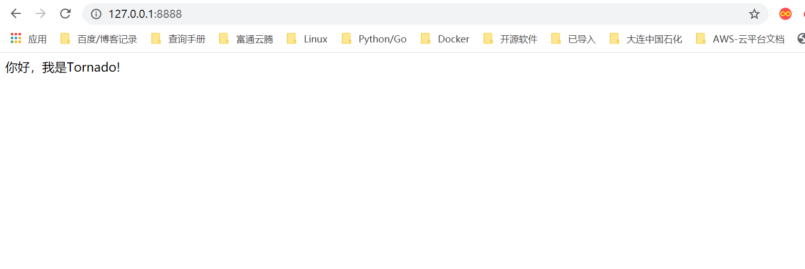

# Tornado框架初识

要使用Tornado这个Web框架，也必须先安装它。其安装方法与本书前面所述的各种第三方库的安装方法相同。

```
　　pip install tornado
```

到https://pypi.python.org/packages/source/t/tornado/tornado-4.1.tar.gz网址下载tornado的源码，解压缩后，在命令提示符下对该子目录执行以下命令：

```
　　python setup.py install
```

Tornado框架来编写Web服务器端程序就是通过继承tornado.Web.RequestHandler类，并编写get()、post()业务方法，以实现对客户端指定URL的GET请求和POST请求的回应。然后启动框架中提供的服务器以等待客户端连接、处理相关数据并返回请求信息。

用Tornado框架编写Web服务器的基本代码框架如下：

```
　　import tornado.ioloop                         #导入相关模块
　　import tornado.Web

　　class MainHdl (tornado.Web.RequestHandler):   #定义类（继承RequestHandler）

　　   def get (sefl):                            #定义GET请求业务方法
　　      pass

　　   def post (self):                           #定义POST请求业务方法
　　      pass

　　app = tornado.Web.Application([               #调用tornado初始化应用
　　      (r'/',MainHdl),
　　      ......
　　if __name__ == '__main__':
　　   app.listen (8888)                         #服务器监听服务端口8888
　　   tornado.ioloop.IOLoop.instance().start()  #启动服务器，等待客户端连接
```

通过以上框架可以看出，用Tornado框架编写服务器端程序的代码结构是非常清晰的。其基本工作就是编写相关的业务处理类，并将它们和某一特定的URL映射起来，Tornado框架服务器收到对应的请求后进行调用。

一般来说简单的网站项目可以把所有的代码放入同一个模块之中，但为了维护方便，可按照功能将其划分到不同的模块中，其一般模块结构（目录结构）如下：

```
　　proj\
　　         manage.py                      #服务器启动入口
　　         settings.py                    #服务器配置文件
　　         url.py                         #服务器URL配置文件
　　         handler\
　　                  login.py              #相关URL业务请求处理类
　　         db\                            #数据库操作模块目录
　　         static\                        #静态文件存放目录
　　                  js\                   #JS文件存放目录
　　                  css                   #CSS样式表文件目录
　　                  img\                  #图片资源文件目录
　　         templates\                     #网页模板文件目录
```

这种目录结构也正符合了目前流行的网站设计风格——MVC模式，即模板、视图、控制器模式。


## 代码演示1

演示了一个使用Tornado框架编写的最基本服务器程序，代码如下：

```
#!/usr/bin/env python
# -*- coding:utf8 -*-
# auther; 18793
# Date：2020/5/6 16:07
# filename: sample01.py
import tornado.ioloop
import tornado.web


class MainHdl(tornado.web.RequestHandler):
    # 自定义类
    def get(self):  # 回应GET请求方法
        self.write('你好，我是Tornado!')


app = tornado.web.Application([
    (r'/', MainHdl),  ##URL映射列表（可有多条）
], debug=True)

if __name__ == '__main__':
    app.listen(8888)  ##服务器监听8888端口
    tornado.ioloop.IOLoop.instance().start()  ##启动服务器
```

```
【代码说明】 由以上代码可以看出，用Tornado框架写一个基本的Web服务器端程序也不过十行代码且代码结构清晰。首先要导入Tornado相关模块，然后自定义URL的响应业务方法（GET、POST等），其次是实例化Tornado模块中提供的Application类，并传URL映射列表及有关参数，最后启动服务器即可。


```

在浏览器地址栏中输入`http://localhost:8888`，就可以访问服务器，看到默认主页页面了。本例页面如图



