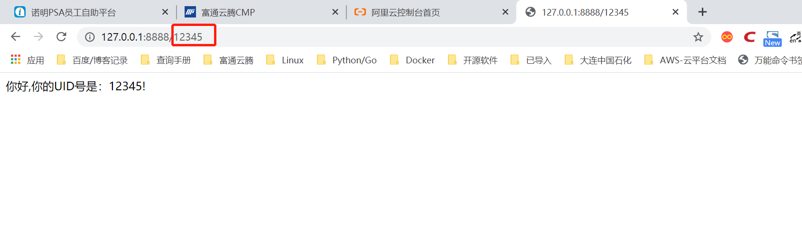
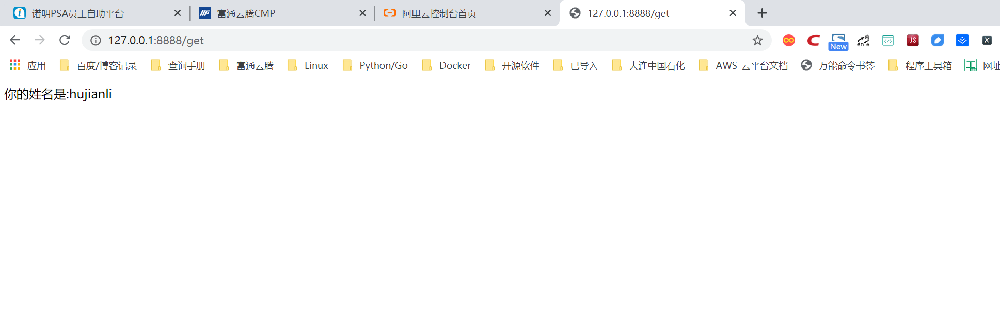

.. contents::
   :depth: 3
..

请求参数的获取
==============

客户端请求的参数有URL中的参数、GET请求中的参数和POST请求中的参数。

在Tornado框架中，要获取URL中包含的参数，与Flask框架有相似之处，它们都是在URL定义中定义获取参数，并在对应的业务方法中给出相应的参数名进行获取。

Tornado框架URL定义字符串中，使用正则表达式来匹配URL及URL中的参数，比如：

::

   　　(r"uid/([0-9]+)",UserHdl)

这种形式的URL字符串定义可以接受形如“uid/”后跟一位或多位数字的客户端URL请求。

对应以上URL定义，可以以如下方式定义get()方法：

::

   　　def get(self,uid)：
   　　   pass

这样，当匹配的URL请求到来时，会截取属于正则组匹配的部分，传递给get()方法，从而把数据传递给uid变量，在get()方法中得到使用。

代码演示1
---------

演示了在GET方法中获取URL中参数的基本实例，代码如下：

::

   # -*- encoding:utf-8 -*-
   import tornado.ioloop
   import tornado.web

   """
   代码中使用了上述正则表达式的URL字符串定义及带有uid参数的get()方法。
   """

   class MainHdl(tornado.web.RequestHandler):
       def get(self, uid):  ##方法中有uid参数，获取URL参数
           self.write('你好,你的UID号是：%s!' % uid)

   app = tornado.web.Application([
       (r'/([0-9]+)', MainHdl),            ##正则表达式URL，捕获参数
   ], debug=True)

   if __name__ == '__main__':
       app.listen(8888)
       tornado.ioloop.IOLoop.instance().start()

::

   【代码说明】 代码中使用了上述正则表达式的URL字符串定义及带有uid参数的get()方法。

**【运行效果】** 服务器运行后，浏览器访问结果如图

而如果要获取GET或POST请求参数，则更加简单。只需要调用从RequestHandler类中继承来的get_argument()方法即可，其原型如下：

::

   　　get_argument('name',default='',strip=False)

其中参数意义是：

-  name　请求中的参数名称；
-  default　指定没有获取参数时给定一个默认值；
-  strip　指定是否对获取的参数进行两头去空格处理。

代码演示2
---------

::

   # -*- encoding:utf-8 -*-
   import tornado.ioloop
   import tornado.web

   html_txt = """
   <!DOCTYPE html>
   <html>
       <body>
           <h2>收到GET请求</h2>
           <form method='post'>
           <input type='text' name='name' placeholder='请输入你的姓名' />
           <input type='submit' value='发送POST请求' />
           </form>
       </body>
   </html>
   """

   class MainHdl(tornado.web.RequestHandler):
       def get(self):
           self.write(html_txt)

       def post(self):
           name = self.get_argument('name', default='匿名', strip=True)
           self.write("你的姓名是:%s" % name)

   app = tornado.web.Application([
       (r'/get', MainHdl),
   ], debug=True)

   if __name__ == '__main__':
       app.listen(8888)
       tornado.ioloop.IOLoop.instance().start()

::

   【代码说明】 在上述代码中，服务器收到GET请求时，返回一个带有表单的页面内容；当用户填写自己的姓名，并单击“发送POST请求”时，将用户输入的姓名以POST参数形式发送到服务器端。最后服务器端调用get_argument()方法来获取和处理它。

发送“localhost:8888/get”的GET请求时，\ ``返回页面如图1所示，而当用户提交时显示的页面如图2所示。``

图1

.. image:: ../../../_static/tornado003-1.png

图2

