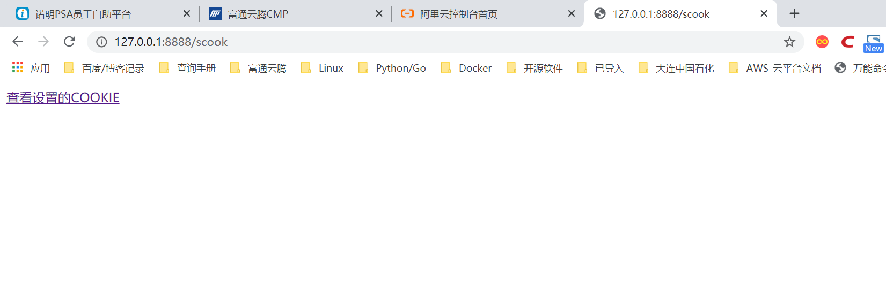

# 用cookie与安全cookie跟踪客户

Tornado框架提供了直接操纵cookie和安全cookie的方法。安全的cookie就是存储在客户端的cookie是经过加密的，客户端只能查看到加密后的数据。使用cookie和安全cookie的基本原型方法如下：

```
　　set_cookie ('name', value)          #设置cookie
　　get_cookie ('name')                 #获取cookie值
　　set_secure__cookie ('name', value)  #设置安全cookie值
　　get_secure__cookie ('name')         #获取安全cookie值
　　clear_cookie ('name')               #清除名为name的cookie值
　　clear_all_cookies()                 #清除所有cookie
```


---

注意

要使用安全cookie，必须为Application类提供cookie_secret参数，以给出加密的密钥。

---


## 代码演示1

演示了一个在不同页面设置与获取cookie值的实例，代码如下：

```
#!/usr/bin/env python
# -*- coding:utf8 -*-
# auther; 18793
# Date：2020/5/6 16:25
# filename: sample01.py
import tornado.ioloop
import tornado.web
import tornado.escape


class ScookHdl(tornado.web.RequestHandler):
    def get(self):
        self.set_cookie('odn_cookie', tornado.escape.url_escape("未加密COOKIE串"))
        self.set_secure_cookie('scr_cookie', "加密SCURE_COOKIE串")
        self.write("<a href='/gcook'>查看设置的COOKIE</a>")


class GcookHdl(tornado.web.RequestHandler):
    def get(self):
        odn_cookie = tornado.escape.url_unescape(self.get_cookie('odn_cookie'))
        scr_cookie = self.get_secure_cookie('scr_cookie').decode('utf-8')
        self.write("普通COOKIE:%s,<br/>安全COOKIE:%s" % (odn_cookie, scr_cookie))


app = tornado.web.Application([
    (r'/scook', ScookHdl),
    (r'/gcook', GcookHdl),
], cookie_secret='abcddddkdk##$$34323sdDsdfdsf#23')


if __name__ == '__main__':
    app.listen(8888)
    tornado.ioloop.IOLoop.instance().start()

```

**【代码说明】** 代码中共定义了两个类，分别用来设置cookie和获取cookie，就是应用前面介绍的方法。

**【运行效果】** 当用户访问“/scook”时会设置cookie，其页面如图1所示，当用户单击页面中的“查看设置的COOKIE”链接时，会访问“/gcook”，从而显示出cookie中设置的值，如图2所示。


设置cookie页面




显示设置的cookie页面

  

---

#### **注意**

因字符串编码的问题，在设置cookie字符串中有中文字符时，要使用tornado.escape模块中的URL编码与解码，否则会出现乱码的现象。

---

此外，Tornado框架中并不提供session功能，你要使用就必须自己实现功能。

