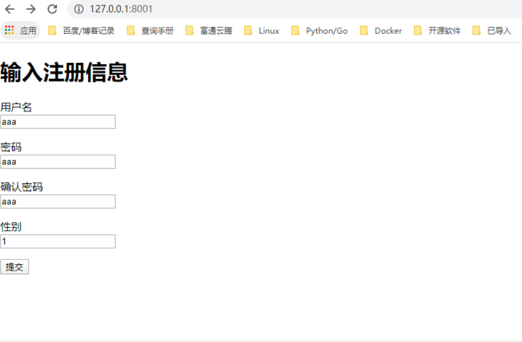

# 表单和模板操作

在Tornado框架中可以灵活地使用表单和模板技术，通过使用这些技术可以实现动态Web功能。

## 一个基本的注册表单

在下面的实例文件001.py中，首先实现一个让用户填写注册信息的HTML表单，然后显示表单处理结果。

```
001.py
templates/
```

001.py

```python
#!/usr/bin/env python
# -*- coding:utf8 -*-
# @auther:   18793
# @Date：    2020/7/16 16:59
# @filename: 001.py
# @Email:    1879324764@qq.com
# @Software: PyCharm
import os.path
import tornado.httpserver
import tornado.ioloop
import tornado.options
import tornado.web
from tornado.options import define, options

define("port", default=8001, help="运行在指定端口", type=int)


class IndexHandler(tornado.web.RequestHandler):
    def get(self):
        self.render("index.html")


class PoemPageHandler(tornado.web.RequestHandler):
    def post(self):
        noun1 = self.get_argument("noun1")
        noun2 = self.get_argument("noun2")
        noun3 = self.get_argument("noun3")
        verb = self.get_argument("verb")
        self.render("poem.html", roads=noun1, wood=noun2, made=verb, difference=noun3)


if __name__ == '__main__':
    tornado.options.parse_command_line()
    app = tornado.web.Application(
        handlers=[(r'/', IndexHandler), (r"/poem", PoemPageHandler)],
        template_path=os.path.join(os.path.dirname(__file__), "templates")
    )
    http_server = tornado.httpserver.HTTPServer(app)
    http_server.listen(options.port)
    tornado.ioloop.IOLoop.instance().start()
```

为了突出Web程序界面的美观性，接下来我们将使用模板技术。框架Tornado自身提供了一个轻量级的模板模块tornado.template，用于快速并且灵活地实现模板功能。我们将模板文件保存在“templates”文件夹中，其中文件index.html作为注册表单。具体实现代码如下。

index.html

```html
<!DOCTYPE html>
<html lang="en">
<head>
    <meta charset="UTF-8">
    <title>会员登录</title>
</head>
<body>
<h1>输入注册信息</h1>
<form method="post" action="/poem">
    <p>用户名<br><input type="text" name="noun1"></p>
    <p>密码<br><input type="text" name="noun2"></p>
    <p>确认密码<br><input type="text" name="verb"></p>
    <p>性别<br><input type="text" name="noun3"></p>
    <input type="submit">
</form>
</body>
</html>
```

poem.html

```html
<!DOCTYPE html>
<html lang="en">
<head>
    <meta charset="UTF-8">
    <title>注册结果</title>
</head>
<body>
<h1>下面是你的注册信息</h1>
<p>用户名：{{ roads }} <br>密码：{{ wood }}<br> 确认密码:{{ made }}<br>性别：{{ difference }}.</p>
</body>
</html>
```

开始调试本实例。首先运行前面的Python文件001.py，然后在浏览器中输入

http://localhost:8001/，接下来会显示注册表单，这是由模板文件index.html实现的。执行效果如图1-10所示。在表单中输入注册信息，并单击“提交查询内容”按钮后显示注册结果，这是由模板文件poem.html实现的。





在上面的实例文件001.py中，定义了RequestHandler子类，并把它们传给tornado.web.Application对象。通过如下代码向Application对象中的init()方法传递一个template_path参数。

``` 
template_path=os.path.join(os.path.dirname(__file__), "templates")

```

参数template_path的功能是告诉Tornado模板文件的具体位置，模板是一个允许你嵌入Python代码片段的HTML文件。通过上述代码告诉Python，

在`Tornado应用文件相同目录下`的templates文件夹中寻找模板文件。当告诉Tornado在哪里可以找到模板文件后，就可以使用类`RequestHandler`中的`render()函数`告诉Tornado读入模板文件，插入其中的模板代码，并返回结果给浏览器。例如，在IndexHandler中通过如下代码告诉Tornado在文件夹“templates”下找到一个名为index.html的文件，读取其中的内容，并发送给浏览器。

```
self.render("index.html")
```

## 在模板中使用函数

在框架Tornado中，为模板功能提供了如下内置函数。

```
•escape(s)：替换字符串s中的&、<、>为它们对应的HTML字符。

•url_escape(s)：使用urllib.quote_plus替换字符串s中的字符为URL编码形式。

•json_encode(val)：将val编码成JSON格式。（在系统底层，这是一个对JSON库的dumps函数的调用。）

•squeeze(s)：过滤字符串s，把连续的多个空白字符替换成一个空格。
```


在模板中可以使用一个自己编写的函数，这时只需要将函数名作为模板的参数传递即可，就像使用其他变量一样。例如：

```python
from tornado.template import Template


def disemovwel(s):
    return ''.join(x for x in s if x not in 'aeiou')


print(disemovwel('georgehujianli'))     #grghjnl
print(Template("my name is {{d('mortimer')}}").generate(d=disemovwel))  #b'my name is mrtmr'
```


