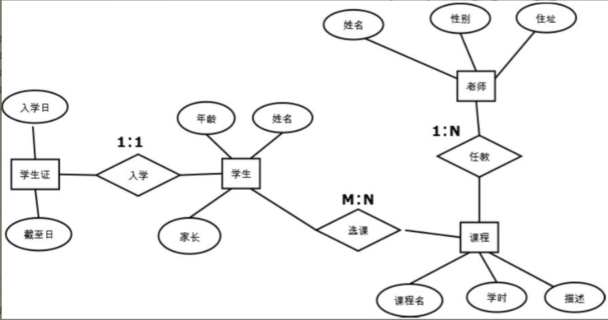

.. contents::
   :depth: 3
..

数据库及ORM
===========

主要学习内容如下:

-  数据库的概念：了解数据库的常用术语和Web开发中数据库的角色，介绍常见的商用及开源数据库，掌握用E-R图进行数据库建模的方法和流程。
-  关系数据库编程：掌握常用的SQL语句如Select、Insert、Delete、Update，并使用Python进行关系数据库编程。
-  ORM编程：掌握ORM的概念及特点，了解Python中的ORM组件。

作为网站开发者的读者，需要具备数据库建模（E-R
图）和开发数据访问代码（SQL或ORM）的能力。

常见的数据库介绍：

1. PostgreSQL：为始于1986年的著名开源数据库，它在灵活的BSD-风格许可证下发行。PostgreSQL的特性覆盖了SQL-2/SQL-92和SQL-3/SQL-99，它包括了几乎世界上最丰富的数据类型的支持，“IP
   类型”等数据类型连商业数据库都不具备。但它在数据集群及管理工具上不如一些商业数据库。

2. MySQL：为由瑞典MySQL
   AB公司开发的开源数据库，目前为Oracle旗下的公司，是一个快速、多线程、多用户的SQL数据库服务器，在Web开发领域比较常见，可以轻易地支持上千万条数据的数据量。其缺点是由于缺乏官方资料而比较难学，开发者在开发中遇到问题时需要自己钻研，对存储过程的支持也比较有限。

3. Oracle：是很长时间以来最著名、市场占有率最高的商业数据库。Oracle以其极强的数据一致性能力而著称，因而常见于金融、通信、政府等大型项目中。对几乎所有操作系统都有良好的支持。其缺点是价格昂贵，一般小项目较少选择Oracle。

4. MS SQL
   Server：是微软发布的商业数据库。其图形化的用户界面，使系统管理和数据库管理更加直观、简单；而且与Windows完全集成，可以利用Windows的许多功能，例如管理登录安全性、Office报表展现等。其在Windows平台下是极其优秀的关系数据库，缺点是尚无Linux平台版本。

5. SQLite:SQLite是一个轻量级、跨平台的关系型数据库，支持SQL
   92中的大部分功能。与以上所有数据库不同的是，SQLite不是C/S模式的数据库，它是进程内的数据库引擎，因此不存在数据库的客户端和服务器。由于其轻量级的特点，SQLite常用于嵌入式设备或并发可能性很低的场合。

1.关系数据库建模
----------------

数据库建模（Database
Modeling）是指针对一个给定的应用环境构造数据库模式，建立数据库及其应用系统，使之能够有效地存储数据，满足用户的应用需求。在现代敏捷开发方法的指导下，明确Web系统的业务需求后，关系数据库建模通常由以下两步完成。

-  设计E-R图：构造一个反映现实世界实体之间联系的模型。

-  关系表设计：将E-R图转换为关系表，并定义列类型，建立主键、外键等各种约束。

1.1 设计E-R图
~~~~~~~~~~~~~

E-R图，即实体-关系（Entity-Relationship）图，是P.P.S.Chen于1976年提出的数据建模方法，由于其简单实用，得到了普遍应用，是目前描述信息结构最常用的方法。E-R
图通过以下3种概念描述信息结构。

-  实体：客观存在的事物、事件、角色等，比如采购员、老师、课程、订单等。

-  实体属性：用于描述实体的特性，每个实体可以有多个属性，比如老师的性别、名字、住址等。

-  关系：反映两个实体之间客观存在的关系。

设计E-R图就是围绕着识别系统中的实体和明确实体之间关系而进行的。E-R图中两个实体（假设分别为实体A、实体B）的关系被分为以下3类。

-  一对一关系：实体A的任意一个实例至多只有一个实体B的实例与之关联；而实体B的任意一个实例也至多只有一个实体A的实例与之关联。\ **典型的一对一关系包括人与身份证、丈夫与妻子等**\ 。一对一关系在E-R图中被记为1∶1。
-  一对多关系：实体A的任意实例可以有零个、一个或多个实体B的实例与之关联；而实体B的任意实例至多只与一个实体A的实例关联。\ **典型的一对多关系包括班级与学生、人与银行卡等。**\ 一对多关系在E-R图中被记为1∶N。
-  多对多关系：实体A的任意一个实例可以与实体B中的任意多个实例关联；而实体B中的任意一个实例也可以与实体A中的任意多个实例关联。\ **典型的多对多关系包括老师和班级、学生与课程等。**\ 多对多关系在E-R图中被记为M∶N。

在E-R图的绘制中，通常用方块表示实体，用实体周围的圆圈表示属性，用实体之间的菱形表示关系，图4.2是一个学校系统的E-R图示例。

图4.2中定义了4个实体和3个关系，分别是实体“老师”“课程”“学生”“学生证”。

实体的各个属性如图4.2中的圆圈部分所示。3个关系分别是：

课程与老师之间的一对多任教关系（假设学校只允许一个老师教一门课程，但一个课程可以有多个老师任教）；

课程与学生之间的多对多选课关系（每个课程可以有多个学生学习，每个学生可以选择多门课程）；

学生与学生证的一对一入学关系（每个学生在入学时办理唯一的学生证）。

1.2 关系表设计
~~~~~~~~~~~~~~

在完成了数据需求分析和E-R图设计后，就可以进行关系表的具体设计了。将E-R图设计转变为关系表设计可按照如下步骤进行。

-  数据库选型，例如MySQL、SQL
   Server、Oracle、PostgreSQL等。因为各种数据库支持的列类型略有不同，所以需要在物理表设计之前完成选型。

-  将每个实体转换为一个数据表，将实体的属性转换为该表中的列，为每个列定义相应的数据类型。

-  对于有1∶1关系的两个表，为两个表设置相同的主键列。

-  对于1∶N关系的两个表，在N表中添加一个外键列，该列与1表的主键相关联。

-  对于M∶N关系，生成一个单独的表表示该关系，该关系的列由两个表的主键组成。

-  重新审核所有的表，对需要的地方添加约束，对常用的条件字段设置索引。

通过上述步骤，可以将图4.2中的实体关系模型转换为具体的关系表。该图一共生成了5个表：4个实体表和1个关系表。假设数据库采用PostgreSQL，则转换后的表定义见表4.1、表4.2、表4.3、表4.4、表4.5。

表4.1　表定义——课程

=========== ====== ========== ==============
表名        course 表的作用   定义实体“课程”
=========== ====== ========== ==============
列名        类型   索引、约束 作用及备注
id          INT    PK         唯一标识
title       TEXT   NOT NULL   课程名
period      INT    Index      学时
description TEXT              课程描述
=========== ====== ========== ==============

表4.2　表定义——老师

========= ======= ============= =======================
表名      teacher 表的作用      定义实体“老师”
========= ======= ============= =======================
列名      类型    索引、约束    作用及备注
id        INT     PK            唯一标识
name      TEXT    NOT NULL      姓名
gender    BOOL    Index         性别True：男False：女
address   TEXT                  住址
course_id INT     FK: course.id 由于1:N关系所添加的外键
========= ======= ============= =======================

表4.3　表定义——学生

========== ======= ========== ==============
表名       Student 表的作用   定义实体“学生”
========== ======= ========== ==============
列名       类型    索引、约束 作用及备注
student_id INT     PK         学号，唯一标识
name       TEXT    NOT NULL   姓名
age        INT     Index      年龄
parent     TEXT               家长
========== ======= ========== ==============

表4.4　表定义——学生证

========== ========= ========== ======================
表名       card      表的作用   定义实体“学生证”
========== ========= ========== ======================
列名       类型      索引、约束 作用及备注
student_id INT       PK         学号，唯一标识
startFrom  TIMESTAMP            注册日期、入学日期
endTo      TIMESTAMP            本学生证有效期的截止日
========== ========= ========== ======================

表4.5　表定义——选课

========== ====== ========================== ====================
表名       enroll 表的作用                   定义关系“学生：课程”
========== ====== ========================== ====================
列名       类型   索引、约束                 作用及备注
student_id INT    PK, FK: student.student_id 学生标识
course_id  INT    PK, FK:course_id           课程标识
========== ====== ========================== ====================

在以上表定义中，读者尤其应该注意关系的表达方法。

-  表student和表card通过设置相同的主键（即student_id）实现了1∶1关系。

-  表teacher中通过设置外键course_id实现了与课程的1∶N关系。

-  表enroll实现了“学生”与“课程”的M∶N关系。

考虑到不熟悉数据库理论的读者，这里将表4.1～表4.5中的键型、索引、约束解释如下。

-  Index：索引，是对数据库表中一列或多列的值进行排序的一种结构。对常用的查询条件字段添加索引可显著提高SQL语句的性能。

-  Constraint：约束，是对列数据取值的某种限定。常见的约束有主键、外键、非空、唯一等。

-  PK：主键（primary
   key），唯一标识一条记录，不允许为空。在大多数数据库中主键列也是一个索引列。

-  FK：外键（foreign
   key），是另一个表的主键，表示关联关系，可以是空字段。

-  NOT NULL：非空约束，即不允许列值为空。

2.关系数据库编程
----------------

2.1 常用SQL语句
~~~~~~~~~~~~~~~

SQL的英文全称是Structured Query
Language，即结构化查询语言，该语言于1986年经过美国国家标准协会（ANSI）的规范成为关系数据的标准语言，其后ANSI又进行了若干次更新，但至今该查询语言的主体结构未发生变化。SQL由以下6类内容组成。

-  数据定义语言（DDL）：创建、删除表结构的语言，包括Create、Drop。

-  数据控制语言（DCL）：为定义数据访问及修改权限而实现的语句，包括Grant、Revoke。

-  数据查询语言（DQL）：定义从数据表中查询已有数据的方法，例如Select。

-  数据操作语言（DML）：定义对数据表中的数据进行增、删、改的方法，包括Insert、Delete、Update。

-  事务处理语言（TPL）：为保证多条SQL语句的数据一致性而定义的语句，比如Commit、Rollback。

-  指针控制语言（CCL）：定义对查询到的多条记录进行逐行控制的方法及与Cursor相关的语句。

在以上6类语句中，DDL和DCL是数据库管理员常用的语句；CCL是数据库存储过程中开发者需要的技能，所以本节重点讲解其他3类语句。

1.Insert语句
^^^^^^^^^^^^

Insert语句用于向数据表中插入数据，其语法为：

::

   INSERT INTO table_name (列名1, 列名2, ...) VALUES (值1, 值2, ....)

如果Insert语句中的列名序列与表定义中的位置相同，则可以省略不写。比如对于表4.1所定义的“课程”表，在其中插入数据的SQL例子为：

::

   INSERT INTO course(id, title, period, description)
   VALUES(1, ’经济学基础’,320, ’经济系学生必修课，建议一年级学习’)

   INSERT INTO course
   VALUES(1, ’经济学基础’,320, ’经济系学生必修课，建议一年级学习’)

   INSERT INTO course(period, description, id, title)
   VALUES(320, ’经济系学生必修课，建议一年级学习’, 1, ’经济学基础’)

上述3条语句的效果完全相同。第1条语句按正规语法编写；第2条语句省略了列名；第3条语句颠倒了列名的顺序，相应值的顺序也要颠倒。

如果在Insert语句中不指明某列的值且在表定义时没有指定默认值，则数据库将其设置为默认值Null：

::

   INSERT INTO course(id, title, period) VALUES(1, ’高等数学’,380, )

上述Insert语句中省略了对description列的赋值，在新插入的记录中该列将被置为Null。

**注意：** SQL语句本身的关键字不区分大小写，例如INSERT INTO、DELETE等。

2.Delete语句
^^^^^^^^^^^^

Delete语句用于从数据表中删除已有的行，其语法为：

::

   DELETE FROM table_name WHERE 条件表达式

该语义为删除table_name中所有满足条件表达式（即条件表达式结果为True）的记录。条件表达式由条件操作符和操作数组成，常用的SQL条件表达式如表4.6所示。

======= ============ ===============================================
操作符  描述         针对表course的举例
======= ============ ===============================================
=       等于         title=’高等数学’
<>      不等于       Period <> 320
>       大于         Period > 300
<       小于         Period < 400
>=      大于等于     Period >= 280
<=      小于等于     Period <= 380
Between 在两个数之间 Period between 200 and 400
Like    模糊匹配     title like ’大学%’
In      是否在集合中 title in （’经济学基础’, ’大学英语’, ’心理学’）
IS NULL 判断是否为空 Description IS NULL
AND     并           Period >300 and description like ‘%必修课%’
OR      或           Title = ’心理学’ or title = ’电路基础’
======= ============ ===============================================

应用多条件表达式时，应注意AND和OR操作符同时出现时的优先顺序：AND运算的优先级高于OR，即先运算AND再运算OR。如果需要指定不按照该优先级执行，则可以通过小括号表示先后顺序。DELETE及WHERE条件表达式的应用举例如下：

::

   //删除id为1的课程
   DELETE FROM course WHERE id = 1

   //删除名字以"经济学"开头并且学时小于200的课程，同时删除学时大于600的课程
   DELETE FROM course
   WHERE title like ’经济学%' AND period < 200 or period > 600

   // 删除名字以"经济学"开头并且学时小于200或大于600的课程
   DELETE FROM course WHERE title like ’经济学%' AND (period < 200 or period > 600)

3.Update语句
^^^^^^^^^^^^

Update语句用于修改数据表中已有记录的列数据，其语法为：

::

   UPDATE table_name SET 列名1 = 新值，列名2 = 新值，列名3 = 新值… WHERE 条件表达式

该语义为将table_name表中所有满足条件表达式的记录的指定列设置为新值。其中的条件表达式已经在表4.6中总结过，对表4.3定义的student表应用update语句的示例如下：

::

   //将所有学生的年龄设为18
   UPDATE student SET age = 18

   //将所有parent为NULL的学生年龄加一，并且parent设置为"未知"
   UPDATE student SET age = age + 1, parent = ’未知’ WHERE parent IS NULL

4.Selecd语句
^^^^^^^^^^^^

Select用于从数据表中选取数据，是SQL中最常用的语句，语法结构如下：

::

   SELETE [distinct|top] 列名1，列名2…. FROM table_name [WHERE 条件表达式]
   [GROUP BY 分组列
   [HAVING 分组筛选条件表达式]
   ]
   [ORDER BY 列名1 [ASC|DESC], 列名 2[ASC|DESC]…]

其中方括号中的内容为可选项目。语法中的第1行用于指定查询结果所需要返回的列：可以逐个列出所有列名，也可以用通配符星号“*”表示返回所有列。

而可选项top用于指定返回的最大行数；distinct
只用于在只返回一列时指明排除重复项。WHERE
条件表达式的用法同UPDATE/DELETE语句相同。对于表4.1定义的course表举例如下：

::

   //查询表course中的所有记录的所有列
   SELECT ＊ FROM course

   //查询所有课时，并且排除掉重复的数字
   SELECT distinct period FROM course

   //查询课时大于200的课程，最多返回10个课程
   SELECT top 10 ＊ FROM course
   WHERE period > 200

GROUP BY用于对数据进行分组以便于汇总计算；HAVING是GROUP
BY的可选项，用于对汇总结果进行筛选。汇总计算是指统计记录的个数、计算某列的平均值等。比如：

::

   //统计所有课程的平均课时数（即所有记录在一个分组中）
   SELECT AVG(period) FROM course

   //按课时period进行分组，统计每个课时的课程个数，并且只返回课程个数大于3的课时
   SELECT period, COUNT(＊) FROM course GROUP BY period HAVING count(＊) > 3

技巧： GROUP BY语句可以同时指定多个列进行分组。

上例中的AVG（period）、COUNT（*）是SQL的汇总计算聚集函数。常用的聚集函数如表4.7所示。

表4.7　常用的SQL聚集函数

=============== ===================
聚集函数        描述
=============== ===================
COUNT（*）      统计记录个数
AVG（column）   计算某列的平均值
MAX（column）   找出某列的最大值
MIN（column）   找出某列的最小值
VAR（column）   计算某列方差
FIRST（column） 返回某列的第1个值
LAST（column）  返回某列的最后1个值
=============== ===================

ORDER
BY用于指定返回结果的记录按某个或某几列的大小排序，ASC用于指定从小到大排列（ASC是默认值）,
DESC用于指定从大到小排列。比如：

::

   //查询所有课程，并将结果按id倒序排列
   SELECT ＊ FROM course ORDER BY id desc

5.多表连接的Select语句
^^^^^^^^^^^^^^^^^^^^^^

因为整个系统的数据分布在不同的表中，所以很多时候为了得到完整的结果，开发者需要从两个或更多的表中查询数据，这时需要在FROM子语句中用JOIN关键字连接多个表。JOIN相关的语法为：

::

   SELECT 列名1，列名2…. FROM table_name1 JOIN table_name2 ON 连接条件表达式 WHERE …

其语义为按照连接条件表达式连接两个表，使两个表的列都可以被用于SELECT、WHERE、ORDER
BY等子语句。JOIN关键字本身有多种类型，如表4.8所示。

表4.8　JOIN类型表

========== ===========================================================
关键字     含义
========== ===========================================================
INNER JOIN 获取两个表中满足查询关键字的连接记录
LEFT JOIN  在INNER JOIN 返回记录的基础上，返回所有左表未被连接到的记录
RIGHT JOIN 在INNER JOIN 返回记录的基础上，返回所有右表未被连接到的记录
FULL JOIN  返回INNER JOIN、LEFT JOIN、RIGHT JOIN结果的合集
========== ===========================================================

虽然一个JOIN关键字只能连接两个表，但可以同时使用多个JOIN关键字以达到连接多个表的目的，对于表4.1～表4.5的数据库进行连接查询，举例如下：

::

   //查询所有教"大学英语"的男老师
   SELECT teacher.＊ FROM teacher INNER JOIN course on teacher.course_id = course.id WHERE teacher.gender = True

   //查询所有有18岁的学生选择的课程
   SELECT distinct course.title FROM course INNER JOIN enroll ON course.id = enroll.course_id
       INNER JOIN student ON enroll.student_id = student.student_id
   WHERE student.age = 18

上面的代码分别演示了一次连接查询和两次连接查询，其中都用了关键字INNER
JOIN。INNER
JOIN是最常用的一种JOIN类型，其含义为只获取两个表中满足查询关键字的连接记录。其他可用的JOIN类型如表4.8所示。

6.事务控制语句
^^^^^^^^^^^^^^

SQL中的事务控制语句能确保被DML语句影响的表的所有行及时得以更新，当必须以原子方式执行的多条语句中一旦有一条失败时，能够Undo之前成功的语句。事务是SQL中将一组DML语句赋予原子执行方式的方法。

**注意：**
原子方式执行是指在一组语句中，要么所有语句都执行成功，要么所有语句都不执行。

事务控制语句包含以下3条不可分割的语句。

-  BEGIN
   TRANSACTION：启动一个新事务，即其后的所有语句被封装为一个原子性事务，直到有ROLLBACK或COMMIT被执行。
-  ROLLBACK：回滚事务，结束当前事务，并取消（Undo）在本次事务中已经执行成功的语句。
-  COMMIT：提交事务，当前事务正式完成，其中DML语句对数据库做的更新正式生效。

2.2 实战演练:在Python中应用SQL
~~~~~~~~~~~~~~~~~~~~~~~~~~~~~~

虽然SQL标准统一了数据库语言，但是通过Python、Java、C++等高级语言操作数据库时需要连接每个数据库独特的数据库引擎，之后才能用SQL语言对数据库进行操作。

所以，在Python中操作不同的数据库需要引入不同的数据库包，常用数据库的Python包如表4.9所示。

表4.9　常用数据库引擎的Python包

============= ===========================
数据库        Python包
============= ===========================
MySQL         MySQLdb
SQLite        SQLite3
Oracle        cx_Oracle
PostgreSQL    PsyCopg2或PyPgSQL或PyGreSQL
MS SQL Server pymssql
Excel         pyExcelerator
============= ===========================

下面演示用SQLite3包操作SQLite数据库的代码：

.. code:: python

   #!/usr/bin/env python
   # -*- coding: utf-8 -*-

   # import MySQLdb                #引入Python引擎包

   # 连接本机数据库testDB
   # conn = MySQLdb.connect(database="testDB", user="user1", password="password123",
   #                         host="127.0.0.1", port=3306)

   import os
   if os.path.exists('test.db'):
       os.remove('test.db')

   import sqlite3
   conn = sqlite3.connect('test.db')

   # 获取游标对象
   cur = conn.cursor()

   # 执行一系列SQL语句
   # 建立一个表
   cur.execute("CREATE TABLE demo(num int,str varchar(20));")
   # 插入一些记录
   cur.execute("INSERT INTO demo VALUES (%d, '%s')" % (1, 'aaa'))
   cur.execute("INSERT INTO demo VALUES (%d, '%s')" % (2, 'bbb'))
   cur.execute("INSERT INTO demo VALUES (%d, '%s')" % (3, 'ccc'))

   # 更新一条记录
   cur.execute("UPDATE demo SET str='%s' WHERE num = %d" % ('ddd', 3))

   # 查询
   cur.execute("SELECT * FROM demo;")
   rows = cur.fetchall()
   print("number of records: ", len(rows))
   for i in rows:
       print(i)

   # 提交事务
   conn.commit()

   # 关闭游标对象
   cur.close()

   # 关闭数据库连接
   conn.close()

本例中演示了连接数据库、新增数据、修改数据、读取数据、关闭数据连接的一系列操作。将代码保存为db.py，执行效果如下：

::

   C:\>python db.py
   记录数：3
   (1, 'aaa')
   (2, 'bbb')
   (3, 'ddd')

2.3 ORM编程
~~~~~~~~~~~

1.ORM理论基础
^^^^^^^^^^^^^

ORM（Object-Relational
Mapping，对象关系映射）的作用是在关系型数据库和业务实体对象之间做一个映射，这样开发者在操作数据库的数据时，就不需要再去和复杂的SQL语句打交道，只需简单地操作对象的属性和方法。所有的ORM必须具备3方面的基本能力：映射技术、CRUD操作和缓存优化。

2.映射技术
^^^^^^^^^^

面向对象是从软件工程的基本原则（如耦合、聚合、封装）的基础上发展而来的，而关系数据库是从数学理论的基础上发展而来的，两套理论存在显著的区别，ORM通过映射机制将两种技术联系起来。每种编程语言都有自己的ORM库，比如Java的Hibernate、Ibatis;
C#的Grove、LinQ; Python的SQLAlchemy等，

所有这些ORM库都必须解决如下3个映射问题。

-  数据类型映射：将数据库的类型映射为编程语言自身的类型。数据类型映射解决了由数据表列（Column）类型向编程语言类型转换的问题。比如SQLAlchemy中定义了一系列的数据类型（SmallInteger、Float、Time等）用于对应数据库中的类型。

-  类映射：将数据表定义映射为编程语言自身的类，这样，数据表中的每一条记录就可以映射为一个编程语言自身的对象。因为数据表的定义本身在每个业务场景中各不一样，所以需要开发者通过配置文件或代码文件的方式明确类映射。在SQLAlchemy中开发者通过定义继承自declarative_base（）返回的类型来实现类映射。

-  关系映射：将数据库中基于外键的关系连接转换为编程语言中基于对象引用的关系连接。在SQLAlchemy中通过在数据表类中定义relationship（）字段，使开发者能够指定数据表之间的连接关系。

3.CRUD操作
^^^^^^^^^^

CRUD是做数据库处理时的增加（Create）、读取（Retrieve，重新得到数据）、更新（Update）和删除（Delete）几个单词的首字母简写。

在SQL中通过Insert、Select、Update、Delete四种语句实现CRUD。而由于ORM对开发者屏蔽了SQL，所以所有的ORM库必须提供自己的一套CRUD方案。

大多数库会为数据对象提供insert、update、delete、query等函数实现CRUD，并提供beginTransaction、commit、rollback等函数管理事务。

当开发者调用这些函数时，ORM自动执行下列操作。

-  将这些调用转换为SQL语句。
-  通过数据库引擎发送给数据库执行。
-  将数据库返回的结果记录用ORM映射技术转换为类对象。

4.缓存优化
^^^^^^^^^^

由于数据库操作通常比较耗时，所以大多数ORM提供数据缓存优化的功能，最基本的缓存优化能力如下。

-  将从数据库中查询到的数据以类对象的形式保存在内存中，以便之后再用时随时提取。

-  在真正需要读取查询结果时才执行数据库的select操作，而不是在ORM查询命令执行时查询数据库。

5.为什么使用ORM
^^^^^^^^^^^^^^^

在学习了ORM的基本原理后，我们总结ORM的优点如下。

-  向开发者屏蔽了数据库的细节，使开发者无须与SQL语句打交道，提高了开发效率。

-  便于数据库迁移。由于每种数据库的SQL语法有细微差别，所以基于SQL的数据访问层在更换数据库时通常需要花费大量的时间调试SQL语句。而ORM提供了独立于SQL的接口，ORM引擎会处理不同数据库之间的差异，所以迁移数据库时无须更改代码。

-  应用缓存优化等技术有时可以提高数据库操作的效率。

2.4 Python ORM库介绍
~~~~~~~~~~~~~~~~~~~~

下面对比较著名的Python数据库的ORM框架介绍如下。

-  SQLAlchemy：是Python中最成熟的ORM框架，资源和文档都很丰富。大多数Python
   Web框架对其都有很好的支持，能够胜任大多数应用场合。SQLAlchemy被认为是Python事实上的ORM标准。

-  Django ORM：是Python世界中大名鼎鼎的Django
   Web框架独用的ORM技术。Django是一个大而全的框架，这使得其灵活性大大降低。其他Python
   Web框架可以随意更换ORM，但在Django中不能这样做，因为Django内置的很多model是用Django内置ORM实现的。

-  Peewee：小巧灵活，是一个轻量级ORM。Peewee是基于SQLAlchemy内核开发的，整个框架只由一个文件构成。Peewee提供了对多种数据库的访问方式，如SQLite、MySQL、PostgreSQL，适用于功能简单的小型网站。

-  Storm：是一个中型的ORM库，比SQLAlchem和Django等轻量，比Peewee的功能1更丰富。Storm要求开发者编写数据表的DDL代码，而不能直接从数据表类定义中自生成表定义。

-  SQLObject：与SQLAlchemy相似，也是一套大而全的ORM。SQLObject的特点是其设计借鉴了Ruby
   on Rails的ActiveRecord模型，使得熟悉Ruby的开发者上手非常容易。

2.5 实战演练:Peewee库编程
~~~~~~~~~~~~~~~~~~~~~~~~~

本书中篇的Django框架和Flask框架部分将会详细介绍Django
ORM和SQLAlchemy的使用方法，此处对轻量级框架Peewee的使用方法进行介绍，以便读者能够迅速掌握ORM的编程思路。

由于在一般情况下ORM库自身的缓存优化机制可以满足大多数场景的需要，所以使用ORM的编程通常由两部分组成：定义数据表到Python
ORM类的映射关系；连接数据库并进行CRUD等操作。

【示例4-2】以表4.1和表4.2定义的course和teacher数据表为例，用Peewee定义Python
ORM类的代码示例如下：

.. code:: python

   #!/usr/bin/env python
   # -*- coding: utf-8 -*-

   import sys
   from importlib import reload

   reload(sys)

   import os
   if os.path.exists('sampleDB.db'):
       os.remove('sampleDB.db')

   # 引入peewee包的所有内容
   from peewee import *

   # 建立一个Sqlite数据库引擎对象，该引擎打开数据库文件sampleDB.db
   # 用SqliteDatabase（）类定义了SQLite的数据库实例。
   # 对于其他数据库类型，可以使用相似的MySQLDatabase（）及PostgresqlDatabase（）等。
   db = SqliteDatabase("sampleDB.db")

   # 定义一个ORM的基类，在基类中指定本ORM所使用的数据库，
   # 这样在之后所有的子类中就不用重复声明数据库
   class BaseModel(Model):
       class Meta:
           database = db

   #  定义course表，继承自BaseModel
   #  表映射：定义了两个对象类Course和Teacher，用于映射数据表course和teacher
   class Course(BaseModel):
       # 类型映射，Peewee 中预定义了一系列的数据类型，用于定义数据表中的列
       id = PrimaryKeyField()
       title = CharField(null=False)
       period = IntegerField()
       description = CharField()

       class Meta:
           order_by = ('title', )
           db_table = 'course'  # 定义数据库中的表名

   # 定义 teacher 表，继承自BaseModel
   class Teacher(BaseModel):
       id = PrimaryKeyField()
       name = CharField(null=False)
       gender = BooleanField()
       address = CharField()
       # 关系映射：在Teacher中通过ForeignKeyField设置了其与Course的连接关系
       # ForeignKeyField的参数to_field用于指定被连接的字段名，related_name参数对该关系赋予了一个名字。
       course_id = ForeignKeyField(Course, to_field="id", related_name="course")

       class Meta:
           order_by = ('name', )
           db_table = "teacher"

   # 建表，仅需创建一次
   Course.create_table()
   Teacher.create_table()

下面的代码演示了使用如上ORM映射对数据内容进行增、删、改、查的方法：

.. code:: python

   # 新增行
   Course.create(id=1, title='经济学', period=320, description='文理科学生均可选修')
   Course.create(id=2, title='大学英语', period=300, description='大一学生必修课')
   Course.create(id=3, title='哲学', period=100, description='必修课')
   Course.create(id=104, title='编译原理', period=100, description='计算机系选修')
   Teacher.create(name='白阵君', gender=True, address='..', course_id=1)
   Teacher.create(name='李森', gender=True, address='..', course_id=3)
   Teacher.create(name='张雯雯', gender=False, address='..', course_id=2)

   # 查询一行
   record = Course.get(Course.title == '大学英语')
   print("课程：%s, 学时：%d" % (record.title, record.period))

   # 更新
   record.period = 200
   record.save()

   # 删除
   record.delete_instance()

   # 查询所有记录
   courses = Course.select()
   for i in courses:
       print(i.id, i.title, i.period, i.description)

   # 带条件查询，并将结果按period字段倒序排序
   courses = Course.select().where(Course.id < 10).order_by(Course.period.desc())
   for i in courses:
       print(i.id, i.title, i.period, i.description)

   # 统计所有课程的平均学时
   total = Course.select(fn.Avg(Course.period).alias('avg_period'))
   for i in total:
       print(u"平均学时：", i.avg_period)

   # 更新多个记录
   Course.update(period=300).where(Course.id > 100).execute()

   # 多表连接操作，Peewee会自动根据ForeignKeyField的外键定义进行连接：
   Record = Course.select().join(Teacher).where(Teacher.gender == True)
   for i in Record:
       print(i.id, i.title, i.period, i.description)
