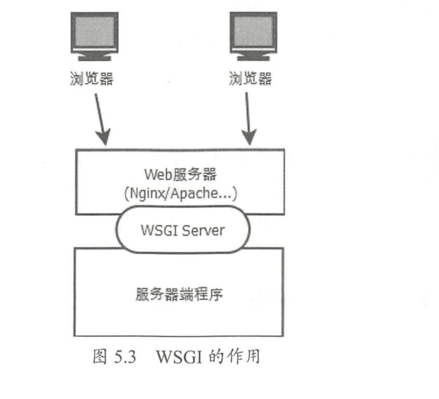

# 开发环境准备

在Python中进行网络框架开发的第1步是安装所使用的组件。Python有两种安装组件的方法，分别是easy_install安装和pip安装。

easy_install出现较早，而pip是easy_install的改进版，提供了更好的提示信息。在一般情况下，比较老（2000年之前）的Python库需要用easy_install进行安装，比较新的Python库适合用pip进行安装。在使用Python做大项目开发之前，开发者应该同时安装easy_install和pip。


## 1.用pip管理其他组件

需要使用pip时，可以直接运行pip命令进行软件的安装和卸载。pip比easy_install的命令更丰富。以Tornado框架组件的安装和管理为例演示pip的使用方法如下。

从Pypi网站自动下载并安装组件：

```
$ pip install tornado
$ pip install tornado= 1.0.8                            //可以在安装时指定版本
```

自动升级组件：

```
$ pip install –U tornado
```

升级组件到指定的版本：

```
$ pip install –U tornado=1.0.9
```

找到Pypi网站中所有与某关键字有关系的组件：

```
$ pip search framework                      //查看所有与"framework"关键字相关的组件
```

卸载组件：

```
$ pip uninstall tornado
```

查看所有选项：

```
$ pip help
```

在Windows中，pip的调用方式与Linux略有不同，需要通过python –m pip的方式调用。比如下面是Windows中用pip安装Tornado的命令：

```
C:\Python2\Scripts\>python –m pip install tornado
```


## 2.使用Python虚环境

1．虚环境的安装使用

因为pip命令在不同的操作系统中的使用方式一致，所以下面以Linux系统为例演示虚环境的安装及使用。可以通过如下命令一步完成对虚环境的安装：

python2.7中

```
# 虚环境的安装
$ pip install virtualenv

# 虚环境的使用
$ cd [项目所在目录]
$ virtualenv venv
$ source ./venv/bin/activate
(venv)#python xxxx.py

$ ./venv/bin/activate
(venv)#  /＊此处执行的命令在虚环境中运行＊/

$ deactivate
#   /＊此处已退出虚环境＊/
```


 python3.3之后版本自带的venv模块

```
#创建虚拟环境
python -m venv project-env
cd  project-env

# 激活虚拟环境
source bin/activite
此时就可以在虚拟环境中使用pip install <package_name>来安装python包了

# 退出虚拟环境
deactivate
```


## 3.Web服务器

Web服务器是连接用户浏览器与Python服务器端程序的中间节点，在网站建立的过程中起着重要的作用。目前最主流的Web服务器包括Nginx、Apache、lighthttpd、IIS等。

Python服务器端程序在Linux平台下使用最广泛的是Nginx。本节学习Python程序与Web服务器连接的WSGI接口、Nginx的安装和配置方法，以及搭建SSL网站的技术。

### 3.1 实战演练1:WSGI接口

WSGI是将Python服务器端程序连接到Web服务器的通用协议。由于WSGI的通用性，出现了独立的WSGI程序，

例如uWSGI和Apache的mod_wsgi。

WSGI的全称为Web Server Gateway Interface，也可称作Python Web Server Gateway Interface，开始于2003年，为Python语言定义Web服务器和服务器端程序的通用接口规范。

因为WSGI在Python中的成功，所以其他语言诸如Perl和Ruby也定义了类似WSGI作用的接口规范。WSGI的作用如图5.9所示。



从图5.9中可见WSGI的接口分为两个：一个是与Web服务器的接口，另一个是与服务器端程序的接口。

WSGI Server与Web服务器的接口包括uwsgi、fast cgi等，服务器端程序的开发者无须学习这部分的详细内容。

服务器端的开发者需要关注的是WSGI与服务器程序的接口。

WSGI 的服务器程序的接口非常简单，以下是一个服务器端程序的例子，将该文件保存为`webapp.py`：

```
def application(environ, start_response):
    start_response('200 OK', [('Content-Type', 'text/html')])
    return (b'<b>Hello, world!</b>', )
```

该代码只定义了一个函数app，所有来自Web服务器的HTTP请求都会由WSGI服务转换为对该函数的调用。该示例的app函数中没有复杂的处理，只是通过start_response返回了状态码，并通过return返回了一个固定的HTTP消息体。与该服务器端程序相对应的是下面的WSGI Server程序：

` wsgi_server.py`

```
#引入Python的WSGI包
from wsgiref.simple_server import make_server

#引入服务器端程序的代码
from webapp import application

#实例化一个监听8080端口的服务器
server = make_server('', 8080, application)

# 开始监听HTTP请求：
server.serve_forever()
```

将该WSGI Server的程序保存为wsgi_server.py，通过下面的命令即可启动一个Web服务器，该服务器对所有的请求都返回Hello World页面：

```
$ python wsgi_server.py
```

> 注意： 虽然WSGI的设计目标是连接标准的Web服务器（Nginx、Apache等）与服务器端程序，但WSGI Server本身也可以作为Web服务器运行。由于性能方面的原因，该服务器一般只做测试使用，不能用于正式运行。


### 3.2 实战演练2:Linux+Nginx+uWSGI配置

Nginx是由俄罗斯工程师开发的一个高性能HTT和反向代理服务器，其第1个公开版本0.1.0于2004年以开源形式发布。自发布后，它以运行稳定、配置简单、资源消耗低而闻名。许多知名网站（百度、新浪、腾讯等）均采用Nginx作为Web服务器。

因为Nginx是Python在Linux环境下的首选Web服务器之一，所以本节以Ubuntu Linux为例演示Nginx的安装及配置方法。

#### 1.安装Nginx

在Ubuntu Linux中可以通过如下命令安装Nginx：

```
$ sudo apt-get install nginx
```

安装程序把Nginx以服务的形式安装在系统中，相关的程序及文件路径如下。

- 程序文件：放在/usr/sbin/nginx目录中。
- 全局配置文件：/etc/nginx/nginx.conf。
- 访问日志文件：/var/log/nginx/access.log。
- 错误日志文件：/var/log/nginx/error.log。
- 站点配置文件：/etc/nginx/sites-enabled/default。

安装好后，可以通过如下命令启动Nginx服务器：

```
$ sudo service nginx start
```

停止Nginx服务器：

```
$ sudo service nginx stop
```

查看Nginx服务的状态：

```
$ sudo service nginx status
```

重启Nginx服务器：

```
$ sudo service nginx restart

```

#### 2.Nginx配置文件

Nginx安装后以默认方式启动，在开发调试的过程中可能需要调整Nginx的运行参数，
这些运行参数通过全局配置文件（nginx.conf）和站点配置文件`(sites-enabled/*)`进行设置。

对全局配置文件（/etc/nginx/nginx.conf）中的关键可设置参数解析如下：

```
user www-data;                        ## 定义运行Nginx的用户
worker_processes 4;                   ## Nginx进程数，应设置与系统CPU数量相等的数值
worker_rlimit_nofile 65535;            ## 每个Nginx进程可以打开的最大文件数

events {
    worker_connections 768;            ##每个Nginx进程允许的最大客户端连接数
    #在Nginx接到一个新连接通知后调用accept()来接受尽量多的连接
    multi_accept off;
}

http {
    ##
    # Basic Settings
    ##
  sendfile on;                       ##是否允许文件上传
  client_header_buffer_size 32k;       ##上传文件大小限制
  tcp_nopush on;                     ##防止网络阻塞
  tcp_nodelay on;                    ##防止网络阻塞
  keepalive_timeout 65;               ##允许的客户端长连接最大秒数
  ##Nginx散列表大小。本值越大，占用的内存空间越大，但路由速度越快
  types_hash_max_size 2048;

  access_log /var/log/nginx/access.log;    ##访问日志文件路径名
  error_log /var/log/nginx/error.log;      ##错误日志文件路径名

  ## 如下两条用include命令加载站点配置文件
  include /etc/nginx/conf.d/＊.conf;
  include /etc/nginx/sites-enabled/＊;
}
```

在每个Nginx服务器中可以运行多个Web站点，每个站点的配置通过站点配置文件设置。

每个站点应该以一个单独的配置文件存放在/etc/nginx/sites-enabled 目录中，默认站点的配置文件名为/etc/nginx/sites-enabled/default，对其中关键内容的解析如下：

```
server {

    ##配置站点监听的端口
    listen 80;

    root /usr/share/nginx/html;            ##配置HTTP根页面目录
    index index.html index.htm;            ##配置HTTP根目录中的默认页面

    #站点监听的IP地址，默认的localhost只可用于本机访问，一般需要将其更改为真实IP
    server_name localhost;
    
 	##location用于配置URL的转发接口
    location /user/ {
        ##此处配置http://server_name/user/的转发地址
        proxy_pass http://127.0.0.1:8080;
    }

    ##错误页面配置，如下配置定义HTTP 404错误的显示页面为/404.html
    error_page 404 /404.html;
}
```


#### 3.安装uWSGI及配置

uWSGI是WSGI在Linux中的一种实现，这样开发者就无须自己编写WSGI Server了。

使用pip命令可以直接安装uWSGI：

```
$ pip install uwsgi
```

安装完成后即可运行uwsgi命令启动WSGI服务器，uwsgi命令通过启动参数的方式配置可选的运行方式。比如，如下命令可以运行uWSGI，用于加载之前编写的服务器端程序webapp.py：

```
$ uwsgi --http:9090 --wsgi-file webapp.py
＊＊＊ Starting uWSGI 2.0.12 (64bit) on [Wed Feb 17 15:27:21 2016] ＊＊＊
compiled with version: 4.8.2 on 17 February 2016 15:21:40
os: Linux-3.13.0-32-generic #57-Ubuntu SMP Tue Jul 15 03:51:08 UTC 2014
nodename: iZ28e3m2w7rZ
machine: x86_64
.....
```

启动时用--http参数指定了监听端口，用--wsgi-file指定了服务器端的程序名。如上所示，uWSGI在启动的过程中会输出系统的一些环境信息：服务器名、进程数限制、服务器硬件配置、最大文件句柄数等。

除了在uWSGI启动命令行中提供配置参数，uWSGI还允许通过一个配置文件设置这些配置参数，比如可以编写如下配置文件，保存在文件名uwsgi.ini中：

```
[uwsgi]
socket = 127.0.0.1:3011
wsgi-file = webapp.py
```

启动uWSGI时直接指定配置文件即可：

```
$ uwsgi uwsgi.ini
```

此时用浏览器访问服务器的3011端口。

除了http和wsgi-file参数，uWSGI还有很多其他参数，常用的如下。

- socket：以WSGI的Socket方式运行，并指定连接地址和端口。该Socket接口是uWSGI与其他Web服务器（Nginx/Apache）等进行对接的方式。

- chdir：指定uWSGI启动后的当前目录。

- processes：指定启动服务器端程序的进程数。

- threads：指定每个服务器端程序的线程数。即服务器端的总线程数为precesses× threads。

- uid：指定运行uWSGI的Linux用户id。

比如，如下配置文件用于用Socket方式启动一个uWSGI服务器，并配置了进程和线程数：

```
[uwsgi]
socket = 127.0.0.1:3011
wsgi-file = webapp.py
processes = 4
threads = 3
```


#### 4.集成Nginx与uWSGI

直接通过在站点配置文件中为location配置uwsgi_pass，即可将Nginx与uWSGI集成，建立一个基于Nginx+Python的正式站点。针对如下uWSGI接口有：

```
[uwsgi]
socket = 127.0.0.1:3011
wsgi-file = webapp.py
```

Nginx的站点配置文件为：

```
server {
    listen 80;

	##此处改为服务器的真实IP
    server_name 121.12.134.11;

    location /{
        ##此处IP与Port配置必须与uwsgi接口中参数相同
        uwsgi_pass http://127.0.0.1:3011;
    }
}
```

> 技巧：可以为一个uWSGI配置多个Nginx Server和location,这样就轻松实现了以多域名访问同一个Python程序。


### 3.3 实战演练3:建立安全的HTTPS网站

普通HTTP站点的协议与数据以明文方式在网络上传输，而HTTPS（Hypertext Transfer Protocol over Secure Socket Layer）是以安全为目标的HTTP通道，即在HTTP下加入SSL层，通过SSL达到数据加密及身份认证的功能。

目前几乎所有的银行、证券、公共交通的网站均以HTTPS方式搭建。

OpenSSL 是一个强大的免费Socket 层密码库，蕴含了主要的密码算法、常用的密钥和证书封装管理功能及SSL协议。目前大多数网站通过OpenSSL工具包搭建HTTPS站点，其步骤如下。

- 在服务器中安装OpenSSL工具包。

- 生成SSL密钥和证书。

- 将证书配置到Web服务器。

- 在客户端安装CA证书。

本节演示在Linux Ubuntu下OpenSSL的使用方法，以及Nginx在Linux下的证书配置方式。Windows中OpenSSL的使用方式与Linux中的完全一致，读者可以自行尝试。

#### 1.在服务器中安装OpenSSL工具包

通过如下两条命令安装OpenSSL：

```
$ sudo apt-get install openssl
$ sudo apt-get install libssl-dev
```

命令运行成功后，OpenSSL命令和配置文件将被安装到Linux系统目录中。

- OpenSSL命令: `/usr/bin/openssl`。
- 配置文件：`/usr/lib/ssl/*`。

#### 2.生成SSL密钥和证书

通过如下步骤生成CA证书ca.crt、服务器密钥文件server.key和服务器证书server.crt：

```
#生成CA 密钥
openssl genrsa -out ca.key 2048

#生成CA证书，days参数以天为单位设置证书的有效期。在本过程中会要求输入证书的所在地、公司名、站点名等
openssl req -x509 -new -nodes -key ca.key -days 365 -out ca.crt

#生成服务器证书RSA的密钥对
openssl genrsa -out server.key 2048

#生成服务器端证书CSR，本过程中会要求输入证书所在地、公司名、站点名等。
openssl req -new -key server.key -out server.csr

#生成服务器端证书 ca.crt
openssl x509 -req -in server.csr -CA ca.crt -CAkey ca.key -CAcreateserial -out server.crt
-days 365
```

上述命令生成服务器端证书时，必须在Common Nanme （CN） 字段中如实输入站点的访问地址。

即如果站点通过www.mysite.com访问，则必须定义CN=www.mysite.com；如果通过IP地址访问，则需设置CN为具体的IP地址。


#### 3.配置Nginx HTTPS服务器

在站点配置文件/etc/nginx/sites-enabled/default中添加如下server段，可以定义一个基于HTTPS的接口，该接口的服务器端程序仍旧为uWSGI接口127.0.0.1:3011。

```
server {
    listen     443;                           #HTTPS服务端口
    server_name 0.0.0.0;                       #本机上的所有IP地址
    ssl             on;
    ssl_certificate   /etc/nginx/ssl/server.crt;
    ssl_certificate_key   /etc/nginx/ssl/server.key;

    location \ {
        uwsgi_pass http://127.0.0.1:3011;
}
```

其中需要注意的是参数ssl_certificate和ssl_certificate_key需要分别指定生成的服务器证书和服务器密钥的全路径文件名。

至此，我们已经可以使用浏览器访问服务器的443端口进行HTTPS加密通信了。


