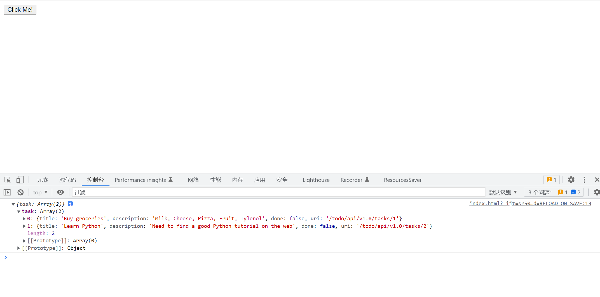

.. contents::
   :depth: 3
..

Flask
=====

1.Flask综述
-----------

相对于其他Python语言的Web框架而言，Flask的特点可以归结如下。

1．内置开发服务器和调试器

2．与Python单元测试功能无缝衔接

3．使用Jinja2模板

4．完全兼容WSGI 1.0标准

5．基于Unicode编码

2.实战演练:开发Flask API视图
----------------------------

1.Hello World程序
~~~~~~~~~~~~~~~~~

现在可以开始写第1个Flask程序了，一个最简单的Flask程序应该包括如下内容：

.. code:: python

   from flask import Flask

   app = Flask(__name__)

   @app.route('/')
   def hello_world():  # put application's code here
       return 'Hello World!'

   if __name__ == '__main__':
       app.run()

当确定系统可以接受来自外部的访问时，可以通过给run（）方法设置参数的方式来实现。同时，在run参数中可以传入要监听的端口，并且设置是否处于调试模式运行。如果将helloworld.py文件中的app.run()改为如下命令，则系统将会监听所有地址的80端口，并关闭调试模式：

::

   app.run(host='0.0.0.0', port=5000, debug=True)

2.模板渲染
~~~~~~~~~~

1.用render_template实现模板渲染
^^^^^^^^^^^^^^^^^^^^^^^^^^^^^^^

使用模板渲染的代码如下：

.. code:: python

   from flask import Flask
   from flask import render_template

   app = Flask(__name__)

   @app.route('/')
   def hello_world():  # put application's code here
       return 'Hello World!'

   @app.route('/hello')
   @app.route('/hello/<name>')
   def hello(name=None):
       return render_template('hello.html', name=name)

   if __name__ == '__main__':
       app.run(host='0.0.0.0', port=5000, debug=True)

假设本例的Python代码被保存在app.py中，则本例的网站目录结构如下：

::

   /app.py
   /templates
     /hello.html

下面是hello.html文件的内容：

::

   <! doctype html>
   <title>Hello from Flask</title>
                                <! -判断name参数是否为空 →
       <h1>Hello {{ name }}! </h1>                <! -当name参数不为空时，本行生效 →
   
       <h1>Hello World! </h1>                    <! -当name参数为空时，本行生效 →
   

2.用Markup转换变量中的特殊字符
^^^^^^^^^^^^^^^^^^^^^^^^^^^^^^

向render_template传入的参数，不仅可以是单纯的字符串，还可以包含HTML特殊字符（比如<、>、空格、/等），这给模板参数提供了更好的灵活性。同时，因为这些特殊字符会被HTML客户端解释成特殊含义，所以会给网站程序带来一定程度的安全隐患。Flask允许程序员自己控制Jinja2是否需要解释这些特殊字符。

如果这些字符应该被解释成特殊含义，则将这些参数直接传给render_template即可；如果这些字符仅应该被解释成字符串，则应该通过Markup()函数将这些字符串做转义处理，然后传给render_template()函数。

::

   @app.route('/hello')
   @app.route('/hello/<name>')
   def hello(name=None):
       from flask import Markup
       print(Markup('<strong>Hi %s! </strong>') % '<blink>David</blink>')
       return render_template('hello.html', name=name)

这段代码显示在浏览器中将会是一段粗体的“Hi
David!”。如果不进行Markup转义，则将会在浏览器上显示成闪烁着的粗体字“Hi
David!”。

3.重定向和错误处理
^^^^^^^^^^^^^^^^^^

重定向（Redirect）是指将一个网络请求重新指定URL并转到其他地址的技术。Flask的redirect()函数提供了这个功能。此外，如果仅仅想中止一个请求并返回错误，而不是重定向到其他地址，则可以使用abort()函数。

例如：

.. code:: python

   from flask import Flask
   from flask import abort, redirect

   app = Flask(__name__)

   @app.route('/')
   def index():
       return redirect('/check')  # 重定向到/login页面

   @app.route('/check')
   def f_check():
       abort(400)  # 立即向客户端返回400错误
       # dont_coding_here()                         #这里的代码不会被执行

   if __name__ == '__main__':
       app.run(host='0.0.0.0', port=5000, debug=True)

本例中，当客户端访问根页面时，处理函数index()通过redirect()函数将请求重定向到了check页面。而check页面中目前没有实现其他逻辑，仅仅向客户端返回了400错误。

**说明：** 400是一个HTTP的标准错误定义，其含义为请求无效。

HTTP 定义了标准的返回码错误代码表，其中大于等于400的代码被认为错误。

客户端的浏览器遇到错误返回时会显示默认的错误页面。如果网站程序需要定义自己的错误页面，则可以通过添加错误处理器来实现。

例如可以在程序中添加如下代码段：

.. code:: python

   from flask import Flask
   from flask import abort, redirect
   from flask import render_template

   app = Flask(__name__)

   @app.route('/')
   def index():
       return redirect('/check')  # 重定向到/login页面

   @app.route('/check')
   def f_check():
       abort(400)  # 立即向客户端返回400错误
       # dont_coding_here()                         #这里的代码不会被执行

   @app.errorhandler(400)
   def bad_request(error):
       return render_template('bad_request.html'), 400

   if __name__ == '__main__':
       app.run(host='0.0.0.0', port=5000, debug=True)

本例中用Flask的errorhandler装饰器添加了自定义的错误处理器。当程序中返回400错误时，系统会执行bad_request()函数。在该函数中向客户端返回400错误的同时，还传送了自定义的错误页面bad_request.html。

4. FBV与CBV
~~~~~~~~~~~

1.FBV
^^^^^

FBV的定义、路由映射方法、装饰器添加方法，Flask中通常会用FBV；Flask框架中不常用CBV；更多的是用FBV

.. code:: python

   from flask import Flask,views

   app = Flask(__name__)
   def wrapper(func):
       def inner(*args,**kwargs):
           print('beforeFunc')
           ret = func(*args,**kwargs)
           return ret
       return inner
   # FBV
   @app.route('/index1',methods=['GET','POST'])
   @wrapper
   def index1():
       return "index1"

   if __name__ == '__main__':
       app.run()

2.CBV
^^^^^

在CBV中，路由信息只能通过\ ``add_url_rule()``\ 方法添加

.. code:: python

   from flask import Flask, views

   app = Flask(__name__)
   class Login(views.MethodView):
       methods = ['POST', 'GET']
       # 如果需要在CBV中加装饰器的话,括号里就是装饰器的内存地址，可以传多个
       decorators = ()
       def get(self):
           print('get 请求')
           return 'login get'
       def post(self):
           print('post 请求')
           return 'login post'
       
   app.add_url_rule('/login', view_func=Login.as_view(name='login'))
   if __name__ == "__main__":
       app.run(debug=True)

3.路由详解
~~~~~~~~~~

1.在路径中添加变量
^^^^^^^^^^^^^^^^^^

::

   @app.route('/login/<username>')
   def show_welcome(username):
       return f'Hi {username}'  # show welcome

被添加的参数需要两次被声明：第1次是在route()装饰器的参数中，在需要使用变量的URL部分用方式声明变量；第2次是在所映射的函数（本例中为show_welcome）的参数中声明变量名，这样被声明的变量就可以在映射函数内使用了。

本例中username变量被作为欢迎语句的一部分回传给客户端。

   注意： 两次变量声明的变量名一定要一致。

2.为变量指定类型
^^^^^^^^^^^^^^^^

可以在声明变量时指定变量被映射的类型，比如：

::

   @app.route('/add/<int:number>')
   def add_one(number):
       return f"{number + 1}"

Flask中允许有3种类型的变量映射，如表8.1所示。

表8.1　路由变量映射类型表

======== ========================
映射类型 说明
======== ========================
Int      接受整型数值变量
Float    接受浮点型数值变量
Path     默认方式，接受路径字符串
======== ========================

**3．路径最后的分隔符的作用**

在URL路径中，斜杠“/”被用作路径分隔符。当斜杠被写在URL路径的开头时，则表明本路径是一个绝对路径；当斜杠被写在路径中间时，它被用作隔离路径的层级。

那么，当它被写在最后时，它的作用是什么呢？

通过下面的例子可以理解斜杠分隔符被写在路径最后时的作用。

::

   @app.route('/school/')
   def schools():
       return 'The school page'

   @app.route('/school')
   def schools():
       return 'The school page'

是否带斜杠结尾的路径声明效果分析

.. image:: ../../../_static/image-20220905114643362.png

3.HTTP方法绑定
^^^^^^^^^^^^^^

网站通过HTTP与浏览器或其他客户端进行交互，而HTTP访问一个URL时可以使用几种不同的访问方式，包括GET、POST、HEAD、DELETE等。在Flask中，路由默认设置使用GET方式进行路径访问。

**1.指定HTTP访问方式的方法**

通过修改route中的参数，可以配置其他访问方式。举例说明：

::

   @app.route('/SendMessage', methods=['GET', 'POST'])
   def Messaging():
       if request.method == 'POST':
           do_send()
       else:
           show_the_send_form()

本例中，在route装饰器中显式地声明了两种HTTP访问方式：GET和POST。无论客户端使用哪种方式访问地址/SendMessage,
Flask都会定位到Messaging（）函数并执行。可以在函数中通过request.method属性获得本次HTTP请求的访问方式。

   **注意：**
   request是Flask框架的一个全局对象，可以获得很多HTTP请求的客户端相关的信息。

**2.将同一个URL根据访问方式映射到不同的函数**

可以灵活地运用URL、访问方法、被映射函数的绑定关系。通过把不同的访问方式赋予相同的URL，可以对其绑定不同的映射函数。

【示例8-8】比如：

::

   @app.route('/Message', methods=[ 'POST'])
   def do_send():
       return "This is for POST methods"

   @app.route('/Message', methods=['GET'])
   def show_the_send_form():
       return "This is for GET methods"

4.路由地址反向生成
^^^^^^^^^^^^^^^^^^

通过前面的学习，读者已经掌握了将URL绑定到映射函数的方法。但有时，程序中需要通过函数名称获得与其绑定的URL地址。Flask通过url_for（）函数实现了这个功能。在使用前，需要先从Flask包中导入对url_for（）函数的引用。函数的第1个参数是需要获取URL的函数名，URL中如果有变量，则可以在url_for（）中添加参数来实现对变量的赋值。

::

   from flask import Flask, url_for
   app = Flask(__name__)
   @app.route('/')
   def f_root():pass

   @app.route('/industry')
   def f_industry():pass

   @app.route('/book/<book_name>')
   def f_book(book_name):pass

   with app.test_request_context():
     print url_for('f_root')                               #例1，输出：/
     print url_for('f_industry')                           #例2，输出：/industry
     print url_for('f_industry', name='web')               #例3，输出：/industry? name=web
     print url_for('f_book', book_name='Python Book')      #例4，输出：/book/Python%20Book

..

   技巧：
   Flask中test_request_context（）方法用于告诉解释器为在其作用域中的代码模拟一个HTTP请求上下文，使其好像被一个HTTP请求所调用。HTTP请求上下文是调用url_for所必需的环境。

在程序中需要使用url_for（）函数的原因如下。

-  反向解析比硬编码有更好的可读性和可维护性。比如，当需要更换路由函数中URL的地址时，无须再更改和调用url_for处的代码。
-  url_for会自动处理必需的特殊字符转换和Unicode编码转换。本节代码段中例4的空格就被自动解析为%20。

5.路由系统
^^^^^^^^^^

-  @app.route(‘/user/’)
-  @app.route(‘/post/’)
-  @app.route(‘/post/’)
-  @app.route(‘/post/’)
-  @app.route(‘/login’, methods=[‘GET’, ‘POST’])

常用路由系统有以上五种，所有的路由系统都是基于一下对应关系来处理：

.. code:: python

   DEFAULT_CONVERTERS = {
       'default':          UnicodeConverter,
       'string':           UnicodeConverter,
       'any':              AnyConverter,
       'path':             PathConverter,
       'int':              IntegerConverter,
       'float':            FloatConverter,
       'uuid':             UUIDConverter,
   }

4.静态文件
~~~~~~~~~~

静态文件，顾名思义，就是那些不会被改变的文件，比如图片，CSS 文件和
JavaScript 源码文件。默认情况下，Flask 在程序根目录中名为 static
的子目录中寻找静态文件。因此，我们一般在应用的包中创建一个叫 static
的文件夹，并在里面放置我们的静态文件。比如，我们可以按下面的结构组织我们的
app：

::

   app/
       __init__.py
       static/
           css/
               style.css
               home.css
               admin.css
           js/
               home.js
               admin.js
           img/
               favicon.co
               logo.svg
       templates/
           index.html
           home.html
           admin.html
       views/
       models/
   run.py

但是，我们有时还会应用到第三方库，比如 jQuery, Bootstrap
等，这时我们为了不跟自己的 Javascript 和 CSS
文件混起来，我们可以将这些第三方库放到 lib 文件夹或者 vendor
文件夹，比如下面这种：

::

   static/
       css/
           lib/
               bootstrap.css
           style.css
           home.css
           admin.css
       js/
           lib/
               jquery.js
               chart.js
           home.js
           admin.js
       img/
           logo.svg
           favicon.ico

1. 提供一个 favicon 图标
^^^^^^^^^^^^^^^^^^^^^^^^

favicon 是 favorites icon 的缩写，也被称为 website
icon（网页图标）、page icon（页面图标）等。通常而言，定义一个 favicon
的方法是将一个名为『favicon.ico』的文件置于 Web
服务器的根目录下。但是，正如我们在上面指出，我们一般将图片等静态资源放在一个单独的
static 文件夹中。为了解决这种不一致，我们可以在站点模板的 部分添加两个
link 组件，比如我们可以在 template/base.html 中定义 favicon 图标：

::

   
   {{ super() }}
   <link rel="shortcut icon" href="{{ url_for('static', filename = 'favicon.ico') }}" type="image/x-icon">
   <link rel="icon" href="{{ url_for('static', filename = 'favicon.ico') }}" type="image/x-icon">
   

在上面的代码中，我们使用了 ``super()``
来保留基模板中定义的块的原始内容，并添加了两个 link
组件声明图标位置，这两个 link 组件声明会插入到 head 块的末尾。

5.使用 Jinja2 模板引擎
~~~~~~~~~~~~~~~~~~~~~~

了解即可，不用深入

目前flask主要用来写接口前后端分离，Jinja2多用于前后端不分离场景，暂时接触不多，部分可以阅读如下文章

https://www.bookstack.cn/read/head-first-flask/chapter02-section2.04.md

6.请求、重定向及会话
~~~~~~~~~~~~~~~~~~~~

Web 开发中经常需要处理 HTTP 请求、重定向和会话等诸多事务，相应地，Flask
也内建了一些常见的对象如 request, session, redirect 等对它们进行处理。

1.请求对象 request
^^^^^^^^^^^^^^^^^^

HTTP 请求方法有 GET、POST、PUT 等，request 对象也相应地提供了支持。

举个例子，假设现在我们开发一个功能：用户注册。如果 HTTP 请求方法是
POST，我们就注册该用户，如果是 GET
请求，我们就显示注册的字样。代码示例如下（注意，下面代码并不能直接运行，文末提供了完整的代码）：

.. code:: python

   from flask import Flask, request
   app = Flask(__name__)
   @app.route('/register', methods=['POST', 'GET']):
   def register():
       if request.method == 'GET':
           return 'please register!'
       elif request.method == 'POST':
           user = request.form['user']
           return 'hello', user

2.重定向对象 redirect
^^^^^^^^^^^^^^^^^^^^^

当用户访问某些网页时，如果他还没登录，我们往往会把网页\ **重定向**\ 到登录页面，Flask
提供了 redirect
对象对其进行处理，我们对上面的代码做一点简单的改造，如果用户注册了，我们将网页重定向到首页。代码示例如下：

.. code:: python

   from flask import Flask, request, redirect
   app = Flask(__name__)

   @app.route('/home', methods=['GET']):
   def index():
       return 'hello world!'
       
   @app.route('/register', methods=['POST', 'GET']):
   def register():
       if request.method == 'GET':
           return 'please register!'
       elif request.method == 'POST':
           user = request.form['user']
           return redirect('/home')

3.会话对象session
^^^^^^^^^^^^^^^^^

程序可以把数据存储在\ **用户会话**\ 中，用户会话是一种私有存储，默认情况下，它会保存在客户端
cookie 中。Flask 提供了 session 对象来操作用户会话，下面看一个示例：

.. code:: python

   from flask import Flask, request, session, redirect, url_for, render_template
   app = Flask(__name__)
   @app.route('/home', methods=['GET'])
   def index():
       return 'hello world!'
       
   @app.route('/register', methods=['GET', 'POST'])
   def register():
       if request.method == 'POST':
           user_name = request.form['user']
           session['user'] = user_name
           return 'hello, ' + session['user']
       elif request.method == 'GET':
           if 'user' in session:
               return redirect(url_for('index'))
           else:
               return render_template('login.html')
               
   app.secret_key = '123456'

   if __name__ == '__main__':
       app.run(host='127.0.0.1', port=5632, debug=True)

操作 ``session`` 就像操作 python 中的字典一样，我们可以使用
``session['user']`` 获取值，也可以使用 ``session.get('user')``
获取值。注意到，我们使用了 ``url_for`` 生成 URL，比如 ``/home`` 写成了
``url_for('index')``\ 。

``url_for()``
函数的第一个且唯一必须指定的参数是端点名，即路由的内部名字。默认情况下，路由的端点是相应视图函数的名字，因此
``/home`` 应该写成 ``url_for('index')``\ 。

还有一点，使用\ ``session`` 时要设置一个密钥 ``app.secret_key``\ 。

4.附录
^^^^^^

本节完整的代码如下：

::

   $ tree .
   .
   ├── flask-session.py
   └── templates
       ├── layout.html
       └── login.html
       
   $ cat flask-session.py
   from flask import Flask, request, session, redirect, url_for, render_template
   app = Flask(__name__)
   @app.route('/')
   def head():
       return redirect(url_for('register'))
   @app.route('/home', methods=['GET'])
   def index():
       return 'hello world!'
   @app.route('/register', methods=['GET', 'POST'])
   def register():
       if request.method == 'POST':
           user_name = request.form['user']
           session['user'] = user_name
           return 'hello, ' + session['user']
       elif request.method == 'GET':
           if 'user' in session:
               return redirect(url_for('index'))
           else:
               return render_template('login.html')
   app.secret_key = '123456'
   if __name__ == '__main__':
       app.run(host='127.0.0.1', port=5632, debug=True)
       
       
   $ cat layout.html
   <!doctype html>
   <title>Hello Sample</title>
   <link rel="stylesheet" type="text/css" href="{{ url_for('static', filename='style.css') }}">
   

       
       
   

   $ cat login.html
   
   
   <form name="register" action="{{ url_for('register') }}" method="post">
       Hello {{ title }}, please login by:
       <input type="text" name="user" />
   </form>
   

7.蓝图
~~~~~~

了解即可，不用深入

https://www.bookstack.cn/read/head-first-flask/chapter02-section2.06.md

8.cookie
~~~~~~~~

了解即可，不用深入

https://www.yuque.com/keep_running/python/uoq7e4

9.session
~~~~~~~~~

了解即可，不用深入

https://www.yuque.com/keep_running/python/ziysy6

3.使用Python和 Flask设计RESTful APIs
------------------------------------

近些年来 REST (REpresentational State Transfer) 已经变成了 web services
和 web APIs 的标配。

在本文中我将向你展示如何简单地使用 Python 和 Flask 框架来创建一个
RESTful 的 web service。

**什么是 REST？**

六条设计规范定义了一个 REST 系统的特点:

-  **客户端-服务器**:
   客户端和服务器之间隔离，服务器提供服务，客户端进行消费。
-  **无状态**:
   从客户端到服务器的每个请求都必须包含理解请求所必需的信息。换句话说，
   服务器不会存储客户端上一次请求的信息用来给下一次使用。
-  **可缓存**: 服务器必须明示客户端请求能否缓存。
-  **分层系统**:
   客户端和服务器之间的通信应该以一种标准的方式，就是中间层代替服务器做出响应的时候，客户端不需要做任何变动。
-  **统一的接口**: 服务器和客户端的通信方法必须是统一的。
-  **按需编码**:
   服务器可以提供可执行代码或脚本，为客户端在它们的环境中执行。这个约束是唯一一个是可选的。

1.什么是一个 RESTful 的 web service？
~~~~~~~~~~~~~~~~~~~~~~~~~~~~~~~~~~~~~

REST 架构的最初目的是适应万维网的 HTTP 协议。

RESTful web services 概念的核心就是“资源”。 资源可以用
`URI <https://en.wikipedia.org/wiki/Uniform_resource_identifier>`__
来表示。客户端使用 HTTP 协议定义的方法来发送请求到这些
URIs，当然可能会导致这些被访问的”资源“状态的改变。

HTTP 标准的方法有如下:

::

   ==========  =====================  ==================================
   HTTP 方法   行为                   示例
   ==========  =====================  ==================================
   GET         获取资源的信息         http://example.com/api/orders
   GET         获取某个特定资源的信息 http://example.com/api/orders/123
   POST        创建新资源             http://example.com/api/orders
   PUT         更新资源               http://example.com/api/orders/123
   DELETE      删除资源               http://example.com/api/orders/123
   ==========  ====================== ==================================

REST 设计不需要特定的数据格式。在请求中数据可以以
`JSON <http://en.wikipedia.org/wiki/JSON>`__ 形式, 或者有时候作为 url
中查询参数项。

2.设计一个简单的 web service
~~~~~~~~~~~~~~~~~~~~~~~~~~~~

坚持 REST 的准则设计一个 web service 或者 API
的任务就变成一个标识资源被展示出来以及它们是怎样受不同的请求方法影响的练习。

比如说，我们要编写一个待办事项应用程序而且我们想要为它设计一个 web
service。要做的第一件事情就是决定用什么样的根 URL
来访问该服务。例如，我们可以通过这个来访问:

``http://[hostname]/todo/api/v1.0/``

在这里我已经决定在 URL 中包含应用的名称以及 API 的版本号。在 URL
中包含应用名称有助于提供一个命名空间以便区分同一系统上的其它服务。在 URL
中包含版本号能够帮助以后的更新，如果新版本中存在新的和潜在不兼容的功能，可以不影响依赖于较旧的功能的应用程序。

下一步骤就是选择将由该服务暴露(展示)的资源。这是一个十分简单地应用，我们只有任务，因此在我们待办事项中唯一的资源就是任务。

我们的任务资源将要使用 HTTP 方法如下:

::

   ==========  ===============================================  =============================
   HTTP 方法   URL                                              动作
   ==========  ===============================================  ==============================
   GET         http://[hostname]/todo/api/v1.0/tasks            检索任务列表
   GET         http://[hostname]/todo/api/v1.0/tasks/[task_id]  检索某个任务
   POST        http://[hostname]/todo/api/v1.0/tasks            创建新任务
   PUT         http://[hostname]/todo/api/v1.0/tasks/[task_id]  更新任务
   DELETE      http://[hostname]/todo/api/v1.0/tasks/[task_id]  删除任务
   ==========  ================================================ =============================

我们定义的任务有如下一些属性:

-  **id**: 任务的唯一标识符。数字类型。
-  **title**: 简短的任务描述。字符串类型。
-  **description**: 具体的任务描述。文本类型。
-  **done**: 任务完成的状态。布尔值。

目前为止关于我们的 web service 的设计基本完成。剩下的事情就是实现它！

创建flask项目，\ ``flaskapp1``

使用pychrm创建

.. image:: ../../../_static/image-20220905111439111.png

使用命令行创建

.. code:: bash

   $ mkdir flaskapp1
   $ cd flaskapp1
   $ virtualenv flask
   New python executable in flask/bin/python
   Installing setuptools............................done.
   Installing pip...................done.

   $ flask/bin/pip install flask

既然已经安装了 Flask，现在开始创建一个简单地网页应用，我们把它放在一个叫
app.py 的文件中:

.. code:: python

   #!flask/bin/python
   from flask import Flask
    
   app = Flask(__name__)
    
   @app.route('/')
   def index():
       return "Hello, World!"
    
   if __name__ == '__main__':
       app.run(debug=True)

为了运行这个程序我们必须执行 app.py:

::

   $ chmod a+x app.py
   $ ./app.py
    * Running on http://127.0.0.1:5000/
    * Restarting with reloader

现在你可以启动你的网页浏览器，输入
`http://localhost:5000 <http://localhost:5000/>`__
看看这个小应用程序的效果。

简单吧？现在我们将这个应用程序转换成我们的 RESTful service！

3.使用Python和 Flask实现RESTful services
~~~~~~~~~~~~~~~~~~~~~~~~~~~~~~~~~~~~~~~~

在 Flask 中有许多扩展来帮助我们构建 RESTful
services，但是在我看来这个任务十分简单，没有必要使用 Flask 扩展。

1.Get
^^^^^

我们现在来实现 web service 的第一个入口:

.. code:: python

   #!flask/bin/python
   from flask import Flask, jsonify

   app = Flask(__name__)

   tasks = [
       {
           'id': 1,
           'title': u'Buy groceries',
           'description': u'Milk, Cheese, Pizza, Fruit, Tylenol',
           'done': False
       },
       {
           'id': 2,
           'title': u'Learn Python',
           'description': u'Need to find a good Python tutorial on the web',
           'done': False
       }
   ]

   @app.route('/todo/api/v1.0/tasks', methods=['GET'])
   def get_tasks():
       return jsonify({'tasks': tasks})

   if __name__ == '__main__':
       app.run(debug=True)

正如你所见，没有多大的变化。我们创建一个任务的内存数据库，这里无非就是一个字典和数组。数组中的每一个元素都具有上述定义的任务的属性。

取代了首页，我们现在拥有一个 get_tasks 的函数，访问的 URI 为
/todo/api/v1.0/tasks，并且只允许 GET 的 HTTP 方法。

这个函数的响应不是文本，我们使用 JSON 数据格式来响应，Flask 的 jsonify
函数从我们的数据结构中生成。

使用网页浏览器来测试我们的 web service
不是一个最好的注意，因为网页浏览器上不能轻易地模拟所有的 HTTP
请求的方法。相反，我们会使用 curl。如果你还没有安装 curl
的话，请立即安装它。

通过执行 app.py，启动 web
service。接着打开一个新的控制台窗口，运行以下命令:

::

   $ curl -i http://localhost:5000/todo/api/v1.0/tasks
   HTTP/1.1 200 OK
   Server: Werkzeug/2.2.2 Python/3.8.8
   Date: Mon, 05 Sep 2022 06:51:12 GMT
   Content-Type: application/json
   Content-Length: 310
   Connection: close

   {
     "tasks": [
       {
         "description": "Milk, Cheese, Pizza, Fruit, Tylenol",
         "done": false,
         "id": 1,
         "title": "Buy groceries"
       },
       {
         "description": "Need to find a good Python tutorial on the web",
         "done": false,
         "id": 2,
         "title": "Learn Python"
       }
     ]
   }

我们已经成功地调用我们的 RESTful service 的一个函数！

现在我们开始编写 GET
方法请求我们的任务资源的第二个版本。这是一个用来返回单独一个任务的函数:

.. code:: python

   from flask import abort
    
   @app.route('/todo/api/v1.0/tasks/<int:task_id>', methods=['GET'])
   def get_task(task_id):
       task = [task for task in tasks if task['id'] == task_id]
       # task = list(filter(lambda t: t['id'] == task_id, tasks))
       if len(task) == 0:
           abort(404)
       return jsonify({'task': task[0]})

第二个函数有些意思。这里我们得到了 URL 中任务的 id，接着 Flask
把它转换成 函数中的 task_id 的参数。

我们用这个参数来搜索我们的任务数组。如果我们的数据库中不存在搜索的
id，我们将会返回一个类似 404 的错误，根据 HTTP 规范的意思是
“资源未找到”。

如果我们找到相应的任务，那么我们只需将它用 jsonify 打包成 JSON
格式并将其发送作为响应，就像我们以前那样处理整个任务集合。

调用 curl 请求的结果如下:

::

   $ curl -i http://localhost:5000/todo/api/v1.0/tasks/1
   HTTP/1.1 200 OK
   Server: Werkzeug/2.2.2 Python/3.8.8
   Date: Mon, 05 Sep 2022 06:53:30 GMT
   Content-Type: application/json
   Content-Length: 139
   Connection: close

   {
     "task": {
       "description": "Milk, Cheese, Pizza, Fruit, Tylenol",
       "done": false,
       "id": 1,
       "title": "Buy groceries"
     }
   }

   18793@DESKTOP-8LI950S ~
   $ curl -i http://localhost:5000/todo/api/v1.0/tasks/2
   HTTP/1.1 200 OK
   Server: Werkzeug/2.2.2 Python/3.8.8
   Date: Mon, 05 Sep 2022 06:53:36 GMT
   Content-Type: application/json
   Content-Length: 149
   Connection: close

   {
     "task": {
       "description": "Need to find a good Python tutorial on the web",
       "done": false,
       "id": 2,
       "title": "Learn Python"
     }
   }

   18793@DESKTOP-8LI950S ~
   $ curl -i http://localhost:5000/todo/api/v1.0/tasks/3
   HTTP/1.1 404 NOT FOUND
   Server: Werkzeug/2.2.2 Python/3.8.8
   Date: Mon, 05 Sep 2022 06:53:38 GMT
   Content-Type: text/html; charset=utf-8
   Content-Length: 207
   Connection: close

   <!doctype html>
   <html lang=en>
   <title>404 Not Found</title>
   <h1>Not Found</h1>
   
The requested URL was not found on the server. If you entered the URL manually please check your spelling and try again.

当我们请求 id #2 的资源时候，我们获取到了，但是当我们请求 #3
的时候返回了 404 错误。有关错误奇怪的是返回的是 HTML 信息而不是
JSON，这是因为 Flask 按照默认方式生成 404 响应。

由于这是一个 Web service 客户端希望我们总是以 JSON
格式回应，所以我们需要改善我们的 404 错误处理程序:

.. code:: python

   from flask import make_response
    
   @app.errorhandler(404)
   def not_found(error):
       return make_response(jsonify({'error': 'Not found'}), 404)

我们会得到一个友好的错误提示:

::

   $ curl -i http://localhost:5000/todo/api/v1.0/tasks/3
   HTTP/1.1 404 NOT FOUND
   Server: Werkzeug/2.2.2 Python/3.8.8
   Date: Mon, 05 Sep 2022 06:57:35 GMT
   Content-Type: application/json
   Content-Length: 27
   Connection: close

   {
     "error": "Not found"
   }

2.Post
^^^^^^

接下来就是 POST 方法，我们用来在我们的任务数据库中插入一个新的任务:

.. code:: python

   from flask import request
    
   @app.route('/todo/api/v1.0/tasks', methods=['POST'])
   def create_task():
       if not request.json or not 'title' in request.json:
           abort(400)
       task = {
           'id': tasks[-1]['id'] + 1,
           'title': request.json['title'],
           'description': request.json.get('description', ""),
           'done': False
       }
       tasks.append(task)
       return jsonify({'task': task}), 201

添加一个新的任务也是相当容易地。只有当请求以 JSON 格式形式，request.json
才会有请求的数据。如果没有数据，或者存在数据但是缺少 title
项，我们将会返回 400，这是表示请求无效。

接着我们会创建一个新的任务字典，使用最后一个任务的 id + 1 作为该任务的
id。我们允许 description 字段缺失，并且假设 done 字段设置成 False。

我们把新的任务添加到我们的任务数组中，并且把新添加的任务和状态 201
响应给客户端。

使用如下的 curl 命令来测试这个新的函数:

.. code:: bash

   $ curl -i -H "Content-Type: application/json" -X POST -d '{"title":"Read a book"}' http://localhost:5000/todo/api/v1.0/tasks
   HTTP/1.1 201 CREATED
   Server: Werkzeug/2.2.2 Python/3.8.8
   Date: Mon, 05 Sep 2022 06:59:27 GMT
   Content-Type: application/json
   Content-Length: 102
   Connection: close

   {
     "task": {
       "description": "",
       "done": false,
       "id": 3,
       "title": "Read a book"
     }
   }

   18793@DESKTOP-8LI950S ~
   $ curl -i http://localhost:5000/todo/api/v1.0/tasks/3
   HTTP/1.1 200 OK
   Server: Werkzeug/2.2.2 Python/3.8.8
   Date: Mon, 05 Sep 2022 06:59:33 GMT
   Content-Type: application/json
   Content-Length: 102
   Connection: close

   {
     "task": {
       "description": "",
       "done": false,
       "id": 3,
       "title": "Read a book"
     }
   }

注意：如果你在 Windows 上并且运行 Cygwin 版本的
curl，上面的命令不会有任何问题。然而，如果你使用原生的
curl，命令会有些不同:

.. code:: bash

   $ curl -i -H "Content-Type: application/json" -X POST -d "{"""title""":"""Read a book"""}" http://localhost:5000/todo/api/v1.0/tasks

当然在完成这个请求后，我们可以得到任务的更新列表:

.. code:: bash

   $ curl -i http://localhost:5000/todo/api/v1.0/tasks
   HTTP/1.1 200 OK
   Server: Werkzeug/2.2.2 Python/3.8.8
   Date: Mon, 05 Sep 2022 07:02:22 GMT
   Content-Type: application/json
   Content-Length: 516
   Connection: close

   {
     "tasks": [
       {
         "description": "Milk, Cheese, Pizza, Fruit, Tylenol",
         "done": false,
         "id": 1,
         "title": "Buy groceries"
       },
       {
         "description": "Need to find a good Python tutorial on the web",
         "done": false,
         "id": 2,
         "title": "Learn Python"
       },
       {
         "description": "",
         "done": false,
         "id": 3,
         "title": "Read a book"
       },
       {
         "description": "",
         "done": false,
         "id": 4,
         "title": "Read a book"
       }
     ]
   }

3.PUT、Delete
^^^^^^^^^^^^^

剩下的两个函数如下所示:

.. code:: python

   @app.route('/todo/api/v1.0/tasks/<int:task_id>', methods=['PUT'])
   def update_task(task_id):
       task = [task for task in tasks if task['id'] == task_id]
       # task = list(filter(lambda t: t['id'] == task_id, tasks))
       if len(task) == 0:
           abort(404)
       if not request.json:
           abort(400)
       if 'title' in request.json and type(request.json['title']) != "unicode":
           abort(400)
       if 'description' in request.json and type(request.json['description']) != "unicode":
           abort(400)
       if 'done' in request.json and type(request.json['done']) is not bool:
           abort(400)
       task[0]['title'] = request.json.get('title', task[0]['title'])
       task[0]['description'] = request.json.get('description', task[0]['description'])
       task[0]['done'] = request.json.get('done', task[0]['done'])
       return jsonify({'task': task[0]})

   @app.route('/todo/api/v1.0/tasks/<int:task_id>', methods=['DELETE'])
   def delete_task(task_id):
       task = [task for task in tasks if task['id'] == task_id]
       # task = list(filter(lambda t: t['id'] == task_id, tasks))
       if len(task) == 0:
           abort(404)
       tasks.remove(task[0])
       return jsonify({'result': True})

delete_task 函数没有什么特别的。

对于 update_task 函数，我们需要严格地检查输入的参数以防止可能的问题。

我们需要确保在我们把它更新到数据库之前，任何客户端提供我们的是预期的格式。

更新任务 #2 的函数调用如下所示:

.. code:: bash

   $ curl -i -H "Content-Type: application/json" -X PUT -d '{"done":true}' http://localhost:5000/todo/api/v1.0/tasks/2
   HTTP/1.0 200 OK
   Content-Type: application/json
   Content-Length: 170
   Server: Werkzeug/0.8.3 Python/2.7.3
   Date: Mon, 20 May 2013 07:10:16 GMT
    
   {
     "task": [
       {
         "description": "Need to find a good Python tutorial on the web",
         "done": true,
         "id": 2,
         "title": "Learn Python"
       }
     ]
   }

4.优化web service接口
^^^^^^^^^^^^^^^^^^^^^

当前我们还有一个问题，客户端有可能需要从返回的JSON中重新构造URI，如果将来加入新的特性时，可能需要修改客户端。（例如新增版本。）

我们可以返回整个URI的路径给客户端，而不是任务的id。为了这个功能，创建一个小函数生成一个“public”版本的任务URI返回：

.. code:: python

   from flask import url_for

   def make_public_task(task):
       new_task = {}
       for field in task:
           if field == 'id':
               new_task['uri'] = url_for('get_task', task_id=task['id'], _external=True)
           else:
               new_task[field] = task[field]
       return new_task

这里所有做的事情就是从我们数据库中取出任务并且创建一个新的任务，这个任务的
id 字段被替换成通过 Flask 的 url_for 生成的 uri 字段。

当我们返回所有的任务列表的时候，在发送到客户端之前通过这个函数进行处理:

.. code:: python

   @app.route('/todo/api/v1.0/tasks', methods=['GET'])
   def get_tasks():
       # return jsonify({'tasks': list(map(make_public_task, tasks))})
       return jsonify({'tasks': [make_public_task(task) for task in tasks]})

这里就是客户端获取任务列表的时候得到的数据:

.. code:: bash

   $ curl -i http://localhost:5000/todo/api/v1.0/tasks
   HTTP/1.1 200 OK
   Server: Werkzeug/2.2.2 Python/3.8.8
   Date: Mon, 05 Sep 2022 07:26:33 GMT
   Content-Type: application/json
   Content-Length: 400
   Connection: close

   {
     "tasks": [
       {
         "description": "Milk, Cheese, Pizza, Fruit, Tylenol",
         "done": false,
         "title": "Buy groceries",
         "uri": "http://localhost:5000/todo/api/v1.0/tasks/1"
       },
       {
         "description": "Need to find a good Python tutorial on the web",
         "done": false,
         "title": "Learn Python",
         "uri": "http://localhost:5000/todo/api/v1.0/tasks/2"
       }
     ]
   }

这种办法避免了与其它功能的兼容，拿到的是完整uri而不是一个id。

5.加强 RESTful web service 的安全性
^^^^^^^^^^^^^^^^^^^^^^^^^^^^^^^^^^^

我们已经完成了我们 web service 的大部分功能，但是仍然有一个问题。我们的
web service 对任何人都是公开的，这并不是一个好主意。

我们有一个可以管理我们的待办事项完整的 web service，但在当前状态下的 web
service 是开放给所有的客户端。 如果一个陌生人弄清我们的 API
是如何工作的，他或她可以编写一个客户端访问我们的 web service
并且毁坏我们的数据。

大部分初级的教程会忽略这个问题并且到此为止。在我看来这是一个很严重的问题，我必须指出。

确保我们的 web service
安全服务的最简单的方法是要求客户端提供一个用户名和密码。在常规的 web
应用程序会提供一个登录的表单用来认证，并且服务器会创建一个会话为登录的用户以后的操作使用，会话的
id 以 cookie 形式存储在客户端浏览器中。然而 REST 的规则之一就是
“无状态”， 因此我们必须要求客户端在每一次请求中提供认证的信息。

我们一直试着尽可能地坚持 HTTP 标准协议。既然我们需要实现认证我们需要在
HTTP 上下文中去完成，HTTP 协议提供了两种认证机制: `Basic 和
Digest <http://www.ietf.org/rfc/rfc2617.txt>`__\ 。

有一个小的 Flask 扩展能够帮助我们，我们可以先安装 Flask-HTTPAuth:

::

   $ flask/bin/pip install flask-httpauth

比方说，我们希望我们的 web service 只让访问用户名 miguel 和密码 python
的客户端访问。 我们可以设置一个基本的 HTTP 验证如下:

.. code:: python

   from flask_httpauth import HTTPBasicAuth
   auth = HTTPBasicAuth()

   @auth.get_password
   def get_password(username):
       if username == 'admin':
           return 'python'
       return None

   @auth.error_handler
   def unauthorized():
       return make_response(jsonify({'error': 'Unauthorized access'}), 401)

get_password 函数是一个回调函数，Flask-HTTPAuth
使用它来获取给定用户的密码。在一个更复杂的系统中，这个函数是需要检查一个用户数据库，但是在我们的例子中只有单一的用户因此没有必要。

error_handler
回调函数是用于给客户端发送未授权错误代码。像我们处理其它的错误代码，这里我们定制一个包含
JSON 数据格式而不是 HTML 的响应。

随着认证系统的建立，所剩下的就是把需要认证的函数添加
@auth.login_required 装饰器。例如:

.. code:: python

   @app.route('/todo/api/v1.0/tasks', methods=['GET'])
   @auth.login_required
   def get_tasks():
       # return jsonify({'tasks': list(map(make_public_task, tasks))})
       return jsonify({'tasks': [make_public_task(task) for task in tasks]})

如果现在要尝试使用 curl 调用这个函数我们会得到:

.. code:: bash

   $ curl -i http://localhost:5000/todo/api/v1.0/tasks
   HTTP/1.1 401 UNAUTHORIZED
   Server: Werkzeug/2.2.2 Python/3.8.8
   Date: Mon, 05 Sep 2022 07:33:51 GMT
   Content-Type: application/json
   Content-Length: 37
   WWW-Authenticate: Basic realm="Authentication Required"
   Connection: close

   {
     "error": "Unauthorized access"
   }

为了能够调用这个函数我们必须发送我们的认证凭据:

.. code:: bash

   $ curl -u admin:python -i http://localhost:5000/todo/api/v1.0/tasks
   HTTP/1.1 200 OK
   Server: Werkzeug/2.2.2 Python/3.8.8
   Date: Mon, 05 Sep 2022 07:34:16 GMT
   Content-Type: application/json
   Content-Length: 400
   Connection: close

   {
     "tasks": [
       {
         "description": "Milk, Cheese, Pizza, Fruit, Tylenol",
         "done": false,
         "title": "Buy groceries",
         "uri": "http://localhost:5000/todo/api/v1.0/tasks/1"
       },
       {
         "description": "Need to find a good Python tutorial on the web",
         "done": false,
         "title": "Learn Python",
         "uri": "http://localhost:5000/todo/api/v1.0/tasks/2"
       }
     ]
   }

认证扩展给予我们很大的自由选择哪些函数需要保护，哪些函数需要公开。

为了确保登录信息的安全应该使用 HTTP 安全服务器(例如:
`https:// <https:>`__\ …)，这样客户端和服务器之间的通信都是加密的，以防止传输过程中第三方看到认证的凭据。

让人不舒服的是当请求收到一个 401
的错误，网页浏览都会跳出一个丑陋的登录框，即使请求是在后台发生的。因此如果我们要实现一个完美的
web
服务器的话，我们就需要禁止跳转到浏览器显示身份验证对话框，让我们的客户端应用程序自己处理登录。

一个简单的方式就是不返回 401 错误。403 错误是一个令人青睐的替代，403
错误表示 “禁止” 的错误:

::

   @auth.error_handler
   def unauthorized():
       return make_response(jsonify({'error': 'Unauthorized access'}), 403)

6.可能的改进
^^^^^^^^^^^^

我们编写的小型的 web service 还可以在不少的方面进行改进。

对于初学者来说，一个真正的 web service
需要一个真实的数据库进行支撑。我们现在使用的内存数据结构会有很多限制不应该被用于真正的应用。

另外一个可以提高的领域就是处理多用户。如果系统支持多用户的话，不同的客户端可以发送不同的认证凭证获取相应用户的任务列表。在这样一个系统中的话，我们需要第二个资源就是用户。

在用户资源上的 POST 的请求代表注册换一个新用户。

一个 GET 请求表示客户端获取一个用户的信息。

一个 PUT 请求表示更新用户信息，比如可能是更新邮箱地址。

一个 DELETE 请求表示删除用户账号。

GET
检索任务列表请求可以在几个方面进行扩展。首先可以携带一个可选的页的参数，以便客户端请求任务的一部分。另外，这种扩展更加有用：允许按照一定的标准筛选。

比如，用户只想要看到完成的任务，或者只想看到任务的标题以 A
字母开头。所有的这些都可以作为 URL 的一个参数项。

参考文献：

`Designing a RESTful API with Python and
Flask <https://blog.miguelgrinberg.com/post/designing-a-restful-api-with-python-and-flask>`__

https://www.cnblogs.com/vovlie/p/4178077.html

http://www.pythondoc.com/flask-restful/first.html

https://www.bookstack.cn/read/flask-restful/spilt.8.3b3bb30c584b4b80.md

4.使用Flask-RESTful设计RESTful API
----------------------------------

前面我已经用 Flask 实现了一个 RESTful 服务器。今天我们将会使用
Flask-RESTful 来实现同一个 RESTful 服务器，Flask-RESTful 是一个可以简化
APIs 的构建的 Flask 扩展。

1.RESTful 服务器
~~~~~~~~~~~~~~~~

作为一个提醒， 这里就是待完成事项列表 web service 所提供的方法的定义:

::

   ==========  ===============================================  =============================
   HTTP 方法   URL                                              动作
   ==========  ===============================================  ==============================
   GET         http://[hostname]/todo/api/v1.0/tasks            检索任务列表
   GET         http://[hostname]/todo/api/v1.0/tasks/[task_id]  检索某个任务
   POST        http://[hostname]/todo/api/v1.0/tasks            创建新任务
   PUT         http://[hostname]/todo/api/v1.0/tasks/[task_id]  更新任务
   DELETE      http://[hostname]/todo/api/v1.0/tasks/[task_id]  删除任务
   ==========  ================================================ =============================

这个服务唯一的资源叫做“任务”，它有如下一些属性:

-  **id**: 任务的唯一标识符。数字类型。
-  **title**: 简短的任务描述。字符串类型。
-  **description**: 具体的任务描述。文本类型。
-  **done**: 任务完成的状态。布尔值。

1. 安装flask-restful
^^^^^^^^^^^^^^^^^^^^

.. code:: bash

   $ pip install flask_restful

安装完成后就可以引入

::

   from flask_restful import Api, Resource, reqparse, abort

2.路由
~~~~~~

在上一遍文章中，我使用了 Flask 的视图函数来定义所有的路由。

Flask-RESTful 提供了一个 Resource 基础类，它能够定义一个给定 URL
的一个或者多个 HTTP 方法。

例如，定义一个可以使用 HTTP 的 GET, PUT 以及 DELETE 方法的 User
资源，你的代码可以如下:

.. code:: python

   from flask import Flask
   from flask_restful import Api, Resource

   app = Flask(__name__)
   api = Api(app)

   class UserAPI(Resource):
       def get(self, id):
           pass

       def put(self, id):
           pass

       def delete(self, id):
           pass

   api.add_resource(UserAPI, '/users/<int:id>', endpoint='user')

add_resource 函数使用指定的 endpoint 注册路由到框架上。

如果没有指定 endpoint，Flask-RESTful
会根据类名生成一个，但是有时候有些函数比如 url_for 需要
endpoint，因此我会明确给 endpoint 赋值。

我的待办事项 API 定义两个 URLs：

-  /todo/api/v1.0/tasks（获取所有任务列表）
-  /todo/api/v1.0/tasks/（获取单个任务）。

我们现在需要两个资源:

.. code:: python

   from flask import Flask
   from flask_restful import Api, Resource

   app = Flask(__name__)
   api = Api(app)

   class TaskListAPI(Resource):
       def get(self):
           pass

       def post(self):
           pass

   class TaskAPI(Resource):
       def get(self, id):
           pass

       def put(self, id):
           pass

       def delete(self, id):
           pass

   api.add_resource(TaskListAPI, '/todo/api/v1.0/tasks', endpoint='tasks')
   api.add_resource(TaskAPI, '/todo/api/v1.0/tasks/<int:id>', endpoint='task')

3.解析以及验证请求
~~~~~~~~~~~~~~~~~~

当我在以前的文章中实现此服务器的时候，我自己对请求的数据进行验证。例如，在之前版本中如何处理
PUT 的:

.. code:: python

   @app.route('/todo/api/v1.0/tasks/<int:task_id>', methods=['PUT'])
   def update_task(task_id):
       task = [task for task in tasks if task['id'] == task_id]
       # task = list(filter(lambda t: t['id'] == task_id, tasks))
       if len(task) == 0:
           abort(404)
       if not request.json:
           abort(400)
       if 'title' in request.json and type(request.json['title']) != "unicode":
           abort(400)
       if 'description' in request.json and type(request.json['description']) != "unicode":
           abort(400)
       if 'done' in request.json and type(request.json['done']) is not bool:
           abort(400)
       task[0]['title'] = request.json.get('title', task[0]['title'])
       task[0]['description'] = request.json.get('description', task[0]['description'])
       task[0]['done'] = request.json.get('done', task[0]['done'])
       return jsonify({'task': task[0]})

在这里,
我必须确保请求中给出的数据在使用之前是有效，这样使得函数变得又臭又长。

Flask-RESTful 提供了一个更好的方式来处理数据验证，它叫做 RequestParser
类。

这个类工作方式类似命令行解析工具 argparse。

首先，对于每一个资源需要定义参数以及怎样验证它们:

.. code:: python

   from flask import Flask, request, jsonify, abort
   from flask_restful import Api, Resource, reqparse

   app = Flask(__name__)
   api = Api(app)

   tasks = [
       {
           'id': 1,
           'title': u'Buy groceries',
           'description': u'Milk, Cheese, Pizza, Fruit, Tylenol',
           'done': False
       },
       {
           'id': 2,
           'title': u'Learn Python',
           'description': u'Need to find a good Python tutorial on the web',
           'done': False
       }
   ]

   from flask import url_for

   def make_public_task(task):
       new_task = {}
       for field in task:
           if field == 'id':
               new_task['uri'] = url_for('get_task', task_id=task['id'], _external=True)
           else:
               new_task[field] = task[field]
       return new_task

   class TaskListAPI(Resource):
       def __init__(self):
           self.reqparse = reqparse.RequestParser()
           self.reqparse.add_argument('title', type=str, required=True,
                                      help='No task title provided', location='json')
           self.reqparse.add_argument('description', type=str, default="", location='json')
           super(TaskListAPI, self).__init__()

       # 检索任务列表
       def get(self):
           pass

       # 创建新任务
       def post(self):
           pass

   class TaskAPI(Resource):
       def __init__(self):
           self.reqparse = reqparse.RequestParser()
           self.reqparse.add_argument('title', type=str, location='json')
           self.reqparse.add_argument('description', type=str, location='json')
           self.reqparse.add_argument('done', type=bool, location='json')
           super(TaskAPI, self).__init__()

       # 检索某个任务
       def get(self, id):
           pass

       # 更新任务
       def put(self, id):
           pass

       # 删除任务
       def delete(self, id):
           pass

   api.add_resource(TaskListAPI, '/todo/api/v1.0/tasks', endpoint='tasks')
   api.add_resource(TaskAPI, '/todo/api/v1.0/tasks/<int:id>', endpoint='task')

   if __name__ == '__main__':
       app.run(host="0.0.0.0", debug=True)

在 TaskListAPI 资源中，POST
方法是唯一接收参数的。参数“标题”是必须的，因此我定义一个缺少“标题”的错误信息。当客户端缺少这个参数的时候，Flask-RESTful
将会把这个错误信息作为响应发送给客户端。

“描述”字段是可选的，当缺少这个字段的时候，默认的空字符串将会被使用。

一个有趣的方面就是 RequestParser 类默认情况下在 request.values
中查找参数，因此 location 可选参数必须被设置以表明请求过来的参数是
request.json 格式的。

TaskAPI 资源的参数处理是同样的方式，但是有少许不同。PUT
方法需要解析参数，并且这个方法的所有参数都是可选的。

使用 Flask-RESTful 来处理验证的另一个好处就是没有必要单独地处理类似 HTTP
400 错误，Flask-RESTful 会来处理这些。

4.生成响应
~~~~~~~~~~

原来设计的 REST 服务器使用 Flask 的 jsonify 函数来生成响应。

Flask-RESTful 会自动地处理转换成 JSON 数据格式，因此下面的代码需要替换:

::

   return jsonify({'tasks': [make_public_task(task) for task in tasks]})

现在需要写成这样:

::

   return {'task': [make_public_task(task) for task in tasks]}

Flask-RESTful 也支持自定义状态码，如果有必要的话:

::

   return {'task': [make_public_task(task) for task in tasks]}, 201

Flask-RESTful 还有更多的功能。make_public_task
能够把来自原始服务器上的任务从内部形式包装成客户端想要的外部形式。

最典型的就是把任务的 id 转成 uri。

Flask-RESTful 就提供一个辅助函数能够很优雅地做到这样的转换，不仅仅能够把
id 转成 uri 并且能够转换其他的参数:

::

   from flask.ext.restful import fields, marshal
    
   task_fields = {
       'title': fields.String,
       'description': fields.String,
       'done': fields.Boolean,
       'uri': fields.Url('task')
   }
    
   class TaskAPI(Resource):
       # ...
    
       def put(self, id):
           # ...
           return { 'task': marshal(task, task_fields) }

task_fields 结构用于作为 marshal 函数的模板。fields.Uri
是一个用于生成一个 URL 的特定的参数。

它需要的参数是 endpoint。

完整代码如下：

.. code:: python

   from flask import Flask, request, abort
   from flask_restful import Api, Resource, reqparse, fields, marshal
   from flask_httpauth import HTTPBasicAuth

   auth = HTTPBasicAuth()

   app = Flask(__name__)
   api = Api(app)

   task_fields = {
       'title': fields.String,
       'description': fields.String,
       'done': fields.Boolean,
       'uri': fields.Url('task')
   }

   tasks = [
       {
           'id': 1,
           'title': u'Buy groceries',
           'description': u'Milk, Cheese, Pizza, Fruit, Tylenol',
           'done': False
       },
       {
           'id': 2,
           'title': u'Learn Python',
           'description': u'Need to find a good Python tutorial on the web',
           'done': False
       }
   ]

   class TaskListAPI(Resource):
       # HTTP 基本身份验
       # decorators = [auth.login_required]

       def __init__(self):
           self.reqparse = reqparse.RequestParser()
           self.reqparse.add_argument('title', type=str, required=True,
                                      help='No task title provided', location='json')
           self.reqparse.add_argument('description', type=str, default="", location='json')
           super(TaskListAPI, self).__init__()

       # 检索任务列表
       def get(self):
           # return jsonify({'tasks': [make_public_task(task) for task in tasks]})

           # 自定义状态码
           # return {'task': marshal(tasks, task_fields)}, 201
           return {'task': marshal(tasks, task_fields)}

       # 创建新任务
       def post(self):
           if not request.json or not 'title' in request.json:
               abort(400)
           task = {
               'id': tasks[-1]['id'] + 1,
               'title': request.json['title'],
               'description': request.json.get('description', ""),
               'done': False
           }
           tasks.append(task)
           return {'task': marshal(task, task_fields)}

   class TaskAPI(Resource):
       # HTTP 基本身份验
       # decorators = [auth.login_required]

       def __init__(self):
           self.reqparse = reqparse.RequestParser()
           self.reqparse.add_argument('title', type=str, location='json')
           self.reqparse.add_argument('description', type=str, location='json')
           self.reqparse.add_argument('done', type=bool, location='json')
           super(TaskAPI, self).__init__()

       # 检索某个任务
       def get(self, id):
           task = [task for task in tasks if task['id'] == id]
           # task = list(filter(lambda t: t['id'] == task_id, tasks))
           if len(task) == 0:
               abort(404)
           return {'task': marshal(task, task_fields)}

       # 更新任务
       def put(self, id):
           task = [task for task in tasks if task['id'] == id]
           # task = list(filter(lambda t: t['id'] == id, tasks))
           if len(task) == 0:
               abort(404)
           task = task[0]
           # print(task)
           args = self.reqparse.parse_args()
           for k, v in list(args.items()):
               if v is not None:
                   task[k] = v
           return {'task': marshal(task, task_fields)}
           # return jsonify({'task': make_public_task(task)})

       # 删除任务
       def delete(self, id):
           task = [task for task in tasks if task['id'] == id]
           # task = list(filter(lambda t: t['id'] == id, tasks))
           if len(task) == 0:
               abort(404)
           tasks.remove(task[0])
           return {'result': True}

   api.add_resource(TaskListAPI, '/todo/api/v1.0/tasks', endpoint='tasks')
   api.add_resource(TaskAPI, '/todo/api/v1.0/tasks/<int:id>', endpoint='task')

   if __name__ == '__main__':
       app.run(host="0.0.0.0", debug=True)

调用 curl 请求的结果如下:

.. code:: bash

   # 检索任务列表
   $ curl -i http://localhost:5000/todo/api/v1.0/tasks
   HTTP/1.1 200 OK
   Server: Werkzeug/2.2.2 Python/3.8.8
   Date: Mon, 05 Sep 2022 08:56:25 GMT
   Content-Type: application/json
   Content-Length: 425
   Connection: close

   {
       "task": [
           {
               "title": "Buy groceries",
               "description": "Milk, Cheese, Pizza, Fruit, Tylenol",
               "done": false,
               "uri": "/todo/api/v1.0/tasks/1"
           },
           {
               "title": "Learn Python",
               "description": "Need to find a good Python tutorial on the web",
               "done": false,
               "uri": "/todo/api/v1.0/tasks/2"
           }
       ]
   }

   # 创建新任务
   $ curl -i -H "Content-Type: application/json" -X POST -d '{"title":"Read a book"}' http://localhost:5000/todo/api/v1.0/tasks
   HTTP/1.1 200 OK
   Server: Werkzeug/2.2.2 Python/3.8.8
   Date: Mon, 05 Sep 2022 08:56:44 GMT
   Content-Type: application/json
   Content-Length: 146
   Connection: close

   {
       "task": {
           "title": "Read a book",
           "description": "",
           "done": false,
           "uri": "/todo/api/v1.0/tasks/3"
       }
   }

   # 检索某个任务
   $ curl -i http://localhost:5000/todo/api/v1.0/tasks/1
   HTTP/1.1 200 OK
   Server: Werkzeug/2.2.2 Python/3.8.8
   Date: Mon, 05 Sep 2022 08:57:03 GMT
   Content-Type: application/json
   Content-Length: 219
   Connection: close

   {
       "task": [
           {
               "title": "Buy groceries",
               "description": "Milk, Cheese, Pizza, Fruit, Tylenol",
               "done": false,
               "uri": "/todo/api/v1.0/tasks/1"
           }
       ]
   }

   # 更新任务
   $ curl -i -H "Content-Type: application/json" -X PUT -d '{"done":true}' http://localhost:5000/todo/api/v1.0/tasks/2
   HTTP/1.1 200 OK
   Server: Werkzeug/2.2.2 Python/3.8.8
   Date: Mon, 05 Sep 2022 09:15:12 GMT
   Content-Type: application/json
   Content-Length: 192
   Connection: close

   {
       "task": {
           "title": "Learn Python",
           "description": "Need to find a good Python tutorial on the web",
           "done": true,
           "uri": "/todo/api/v1.0/tasks/2"
       }
   }

   # 删除任务
   $ curl -i -X DELETE http://localhost:5000/todo/api/v1.0/tasks/3
   HTTP/1.1 200 OK
   Server: Werkzeug/2.2.2 Python/3.8.8
   Date: Mon, 05 Sep 2022 09:17:30 GMT
   Content-Type: application/json
   Content-Length: 23
   Connection: close

   {
       "result": true
   }

5.认证
~~~~~~

在 REST 服务器中的路由都是由 HTTP
基本身份验证保护着。在最初的那个服务器是通过使用 Flask-HTTPAuth
扩展来实现的。

因为 Resouce 类是继承自 Flask 的 MethodView，它能够通过定义 decorators
变量并且把装饰器赋予给它:

::

   from flask.ext.httpauth import HTTPBasicAuth
   # ...
   auth = HTTPBasicAuth()
   # ...
    
   class TaskAPI(Resource):
       # HTTP 基本身份验
       decorators = [auth.login_required]
       # ...
    
   class TaskAPI(Resource):
       # HTTP 基本身份验
       decorators = [auth.login_required]
       # ...

6.在flask-restful中添加日志
~~~~~~~~~~~~~~~~~~~~~~~~~~~

在\ ``flask-restful``\ 中，\ ``logger``\ 的使用有更优雅的方式，来看示例

.. code:: python

   from flask import Flask, request, abort
   from flask_restful import Api, Resource, reqparse, fields, marshal
   from flask_httpauth import HTTPBasicAuth
   import logging.config

   logging.config.dictConfig(
       {
           "version": 1,
           "disable_existing_loggers": False,
           "formatters": {
               "simple": {"format": "%(asctime)s - %(name)s - %(levelname)s - %(message)s"}
           },
           "handlers": {
               "console": {
                   "class": "logging.StreamHandler",
                   "level": "DEBUG",
                   "formatter": "simple",
                   "stream": "ext://sys.stdout",
               },
               "info_file_handler": {
                   "class": "logging.handlers.RotatingFileHandler",
                   "level": "INFO",
                   "formatter": "simple",
                   "filename": "info.log",
                   "maxBytes": 10485760,
                   "backupCount": 50,
                   "encoding": "utf8",
               },
               "error_file_handler": {
                   "class": "logging.handlers.RotatingFileHandler",
                   "level": "ERROR",
                   "formatter": "simple",
                   "filename": "errors.log",
                   "maxBytes": 10485760,
                   "backupCount": 20,
                   "encoding": "utf8",
               },
               "debug_file_handler": {
                   "class": "logging.handlers.RotatingFileHandler",
                   "level": "DEBUG",
                   "formatter": "simple",
                   "filename": "debug.log",
                   "maxBytes": 10485760,
                   "backupCount": 50,
                   "encoding": "utf8",
               },
           },
           "loggers": {
               "my_module": {"level": "ERROR", "handlers": ["console"], "propagate": "no"}
           },
           "root": {
               "level": "DEBUG",
               "handlers": ["error_file_handler", "debug_file_handler"],
           },
       }
   )

   auth = HTTPBasicAuth()

   app = Flask(__name__)
   api = Api(app, default_mediatype="application/json")

   task_fields = {
       'title': fields.String,
       'description': fields.String,
       'done': fields.Boolean,
       'uri': fields.Url('task')
   }

   tasks = [
       {
           'id': 1,
           'title': u'Buy groceries',
           'description': u'Milk, Cheese, Pizza, Fruit, Tylenol',
           'done': False
       },
       {
           'id': 2,
           'title': u'Learn Python',
           'description': u'Need to find a good Python tutorial on the web',
           'done': False
       }
   ]

   class TaskListAPI(Resource):
       # HTTP 基本身份验
       # decorators = [auth.login_required]

       def __init__(self, **kargs):
           self.logger = kargs.get('logger')
           self.reqparse = reqparse.RequestParser()
           self.reqparse.add_argument('title', type=str, required=True, help='No task title provided', location='json')
           self.reqparse.add_argument('description', type=str, default="", location='json')
           self.logger.debug(self.reqparse)
           super(TaskListAPI, self).__init__()

       # 检索任务列表
       def get(self):
           # return jsonify({'tasks': [make_public_task(task) for task in tasks]})

           # 自定义状态码
           # return {'task': marshal(tasks, task_fields)}, 201
           return {'task': marshal(tasks, task_fields)}

       # 创建新任务
       def post(self):
           if not request.json or not 'title' in request.json:
               abort(400)
           task = {
               'id': tasks[-1]['id'] + 1,
               'title': request.json['title'],
               'description': request.json.get('description', ""),
               'done': False
           }
           tasks.append(task)
           return {'task': marshal(task, task_fields)}

   class TaskAPI(Resource):
       # HTTP 基本身份验
       # decorators = [auth.login_required]

       def __init__(self, **kargs):
           self.logger = kargs.get('logger')
           self.reqparse = reqparse.RequestParser()
           self.reqparse.add_argument('title', type=str, location='json')
           self.reqparse.add_argument('description', type=str, location='json')
           self.reqparse.add_argument('done', type=bool, location='json')
           self.logger.debug(self.reqparse)
           super(TaskAPI, self).__init__()

       # 检索某个任务
       def get(self, id):
           task = [task for task in tasks if task['id'] == id]
           # task = list(filter(lambda t: t['id'] == task_id, tasks))
           if len(task) == 0:
               abort(404)
           return {'task': marshal(task, task_fields)}

       # 更新任务
       def put(self, id):
           task = [task for task in tasks if task['id'] == id]
           # task = list(filter(lambda t: t['id'] == id, tasks))
           if len(task) == 0:
               abort(404)
           task = task[0]
           # print(task)
           args = self.reqparse.parse_args()
           for k, v in list(args.items()):
               if v is not None:
                   task[k] = v
           return {'task': marshal(task, task_fields)}
           # return jsonify({'task': make_public_task(task)})

       # 删除任务
       def delete(self, id):
           task = [task for task in tasks if task['id'] == id]
           # task = list(filter(lambda t: t['id'] == id, tasks))
           if len(task) == 0:
               abort(404)
           tasks.remove(task[0])
           return {'result': True}

   api.add_resource(TaskListAPI, '/todo/api/v1.0/tasks', endpoint='tasks',
                    resource_class_kwargs={"logger": logging.getLogger('/TaskListAPI')})

   api.add_resource(TaskAPI, '/todo/api/v1.0/tasks/<int:id>', endpoint='task',
                    resource_class_kwargs={"logger": logging.getLogger('/TaskAPI')})

   if __name__ == '__main__':
       app.run(host='0.0.0.0', port=5000, use_reloader=True,debug=True)

我们使用上次用到的\ ``dictConfig``\ ，

主要的区别在于\ ``api.add_resource()``\ 方法中，使用了参数\ ``resource_class_kwargs``\ ，然后在\ ``Resource``\ 子类中的构造函数\ ``__init__``\ ，将日志记录器获取到，后面就可以在各个处理方法中使用了。

再次使用\ ``postman``\ 发起\ ``POST``\ 请求，可以看到\ ``debug.log``\ 是这个样子的

.. image:: ../../../_static/image-20220905175349613.png

参考文献：

https://www.yuque.com/keep_running/python/hyegx6#iiVXa

https://blog.csdn.net/djstavaV/article/details/112261872

5. 跨域访问
-----------

什么是跨域？
~~~~~~~~~~~~

跨域是指，浏览器从服务器\ ``A``\ 获取的静态资源，包括\ ``html``\ 、\ ``css``\ 、\ ``javascript``\ ，然后在\ ``javascript``\ 中通过\ ``ajax``\ 访问服务器\ ``B``\ 的静态资源或请求。

CORS
~~~~

``w3c``\ 组织制定了
``[Cross Origin Resource Sharing](https://www.w3.org/TR/cors/)``
的规范，简写为\ ``CORS``\ ，现在这个规范已经被大多数浏览器支持。

使用上面的示例

前端页面\ ``index.html``

::

   <html>
   <body>
   <button type="button" onclick="jump()">Click Me!</button>
   
   </body>
   </html>

我们将\ ``index.html``\ 部署在一台机器上(172.16.3.134)，\ ``flask``\ 应用部署在另一台机器上(172.16.3.134)，然后在浏览器中访问\ ``index.html``\ ，点击页面中的按钮，这时候就会报错了

.. image:: ../../../_static/image-20220905175806809.png

Flask配置cors
~~~~~~~~~~~~~

``CORS``\ 需要在后端应用中进行配置。在\ ``flask``\ 中，可以使用扩展\ ``flask-cors``\ ，首先安装

.. code:: bash

   $ pip install flask-cors

接下来来到\ ``app.py``\ ，导入模块，并将\ ``flask``\ 应用包括起来就可以了，如下

::

   from flask_cors import CORS
   app = Flask(__name__)
   CORS(app)

重新启动应用，再次访问\ ``index.html``\ ，这时候，返回的结果就正常了

6.模型 Model
------------

在Flask Web应用程序中使用原始SQL对数据库执行CRUD操作可能很繁琐。

相反， **SQLAlchemy** ，Python工具包是一个强大的\ **OR
Mapper**\ ，它为应用程序开发人员提供了SQL的全部功能和灵活性。

Flask-SQLAlchemy是Flask扩展，它将对SQLAlchemy的支持添加到Flask应用程序中。

使用 Flask设计RESTful 的认证
----------------------------

1. flask-jwt-extended
~~~~~~~~~~~~~~~~~~~~~

https://www.yuque.com/keep_running/python/fnlswf

使用Flask设计带认证token的RESTful API接口

https://www.cnblogs.com/vovlie/p/4182814.html
