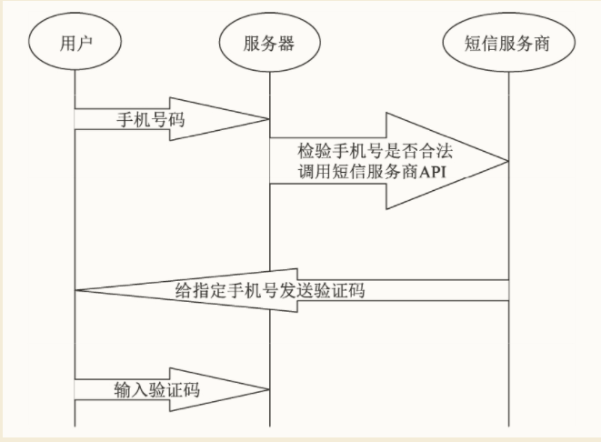
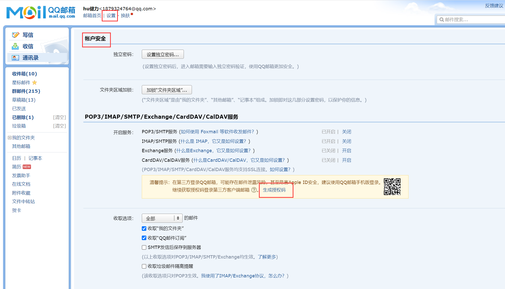
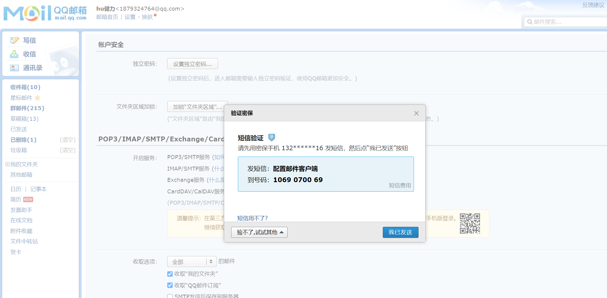

# 用Django实现百度开发者认证业务模型


## 1.内容生产者认证业务模型是基础


### 1.1内容生产者认证的原理

用户从初次打开平台，到完成内容生产者认证的原理流程图。


### 1.2 业界主流的两种认证方式

1. 通过邮箱激活的方式进行认证
2. 通过向网站平台上传个人信息的方式进行认证

从实现技术上来说，这反而比用邮箱激活链接的认证方式要简单一些，因为上传这些个人信息完成认证与注册时上传用户名等信息的实现原理是一样的，都是通过从客户端到服务器端的一次post请求。


注意： 由于权限认证的业务涉及的隐密信息很多，因此做好数据安全非常重要，请大家将权限认证配合后面与网络安全相关的章节内容一起使用


## 2.  Django实现通过手机号注册功能

用户在认证之前，首先要完成注册。目前，在中国大陆地区，注册一个用户必须要绑定手机号码，并且平台方要为此而承担成本支出。

我们将开发一套使用Django实现的通过手机号注册的功能

### 2.1 初始化一个项目为功能演示做准备

### 2.2 前端逻辑

使用vue-cli脚手架搭建vue演示项目demo3

使用编辑器打开demo3，将demo3/src/App.vue中的代码替换如下：

```
<template>
  <div id="app">
    <h1>{{title}}</h1>
  </div>
</template>

<script>
export default {

  name: 'app',
  data () {
    return {
      title: '首页'
    }
  }
}
</script>

<style>

</style>

```


### 2.3 后端逻辑

新建Django项目demo4，同时新建App，命名为App01。


**1.安装相关依赖包**

```
pip install djangorestframework markdown Django-filter pillow Django-guardian coreapi
```


**2.在demo4/settings.py中注册**

```
INSTALLED_APPS = [
    'django.contrib.admin',
    'django.contrib.auth',
    'django.contrib.contenttypes',
    'django.contrib.sessions',
    'django.contrib.messages',
    'django.contrib.staticfiles',
    'app01.apps.App01Config',
    'rest_framework'
]


DATABASES = {
    'default': {
        'ENGINE': 'django.db.backends.mysql',
        'NAME': 'sendcode',
        'USER': 'root',
        'PASSWORD': 'OSChina@xxxx',
        'HOST': '192.168.1.107',
        'PORT': '3308',
        "OPTIONS": {"init_command": "SET default_storage_engine=INNODB;"}
    }
}
```

安装mysqlclient驱动

```
pip install PyMYSQL
```


在项目的\_\_init\_\_py文件下添加mysql的驱动程序

```
import pymysql

pymysql.install_as_MySQLdb()
```


**3.在app01/models.py中重建用户表类，新建key值表类：**

```
from django.db import models
from datetime import datetime
from django.contrib.auth.models import AbstractUser


# Create your models here.

class UserProfile(AbstractUser):
    """
    用户
    """
    is_auther = models.BooleanField(default=False, verbose_name='是否认证')
    phone = models.CharField(max_length=11, verbose_name='电话')
    email = models.CharField(max_length=100, null=True, blank=True, verbose_name='; 邮箱')
    add_time = models.DateTimeField(default=datetime.now, verbose_name='; 添加时间')

    class Meta:
        verbose_name = '用户'
        verbose_name_plural = verbose_name

    def __str__(self):
        return self.username


class Key(models.Model):
    """
    key表
    """
    author = models.ForeignKey(UserProfile, verbose_name='开发者', on_delete=models.CASCADE)
    app_name = models.CharField(max_length=10, verbose_name='应用名称')
    key = models.CharField(max_length=32, verbose_name='应用key值')
    add_time = models.DateTimeField(default=datetime.now, verbose_name='; 添加时间 ')

    class Meta:
        verbose_name = 'key表'
        verbose_name_plural = verbose_name

    def __str__(self):
        return self.key
```


**4.在demo4/settings.py中加入重建用户表的配置代码，**

```
AUTH_USER_MODEL='app01.UserProfile'
```

**5.执行数据更新命令：**

```
python manage.py makemigrations
python manage.py migrate
```


### 2.4 Django实现通过手机号注册功能



#### 1.注册功能的业务逻辑


（1）用户需要一个输入手机号的输入框和一个获取验证码的按钮（前端需求）。

（2）在客户端要对用户输入的手机号做格式上的合法验证（前端需求）。

（3）检验用户输入的手机号是否已经被注册过（后端需求）。

（4）如果用户输入的手机号已经被占用，则给用户提示（前端需求）。

（5）如果用户输入的手机号合法且没有被注册过，那么将手机号通过API发送给短信服务商（后端需求）。

（6）如果用户没有收到短信验证码，可重新获取验证码（前端需求）。

（7）如果用户收到了短信验证码，就发送到服务器端，服务器端判断其是否正确、是否超时，如果验证码错误或者验证码超时了，则返回错误信息；如果正确，则返回注册成功信息（后端需求）。

（8）如果用户提交的验证码超时或者错误，则提示用户进行重新操作（前端信息）。


#### 2.前端中开发注册用户的静态页面

```
<template>
  <div id="app">
    <h1>{{ title }}</h1>
    <div class="registerwindow">
      <div class="title">用户注册</div>
      <div class="item">
        <div class="text">用户名:</div>
        <input type="text">
      </div>
      <div class="item">
        <div class="text">密码:</div>
        <input type="text">
      </div>
      <div class="item">
        <div class="text">手机号:</div>
        <input type="text">
        <button>获取验证码</button>
      </div>
      <div class="item">
        <div class="text">验证码:</div>
        <input type="text">
        <button>确认注册</button>
      </div>
    </div>
  </div>
</template>

<script>
export default {
  name: 'app',
  data () {
    return {
      title: '首页',
      codebtn: '获取验证码'
    }
  }
}
</script>

<style>
* {
  margin: 0;
  padding: 0;
  box-sizing: border-box;
}

.registerwindow {
  margin: 0 auto;
  width: 350px;
  height: 200px;
  background: rgba(5, 55, 148, 0.5);
}

.title {
  margin: 0 auto;
  font-size: 30px;
  text-align: center
}

.item {
  margin-top: 10px;
  display: flex;
  flex-direction: row;
}

.text{
  text-align: center;
  width: 80px;
}

input{
  width: 140px;
}

button{
  width: 80px;
  margin-left: 5px;
}

</style>
```


注意： 本节中所编写的静态页面代码具有一定的普遍可复用性，可以方便大家在实际项目中使用，使大家将精力主要用于Django后端的学习 前端知识相对薄弱的读者，可以直接拿到自己的项目中使用。


编写前端验证用户信息的逻辑代码

```
<template>
  <div id="app">
    <h1>{{ title }}</h1>
    <div class="registerwindow">
      <div class="title">用户注册</div>
      <div class="item">
        <div class="text">用户名:</div>
        <input type="text" v-model="username">
      </div>
      <div class="item">
        <div class="text">密码:</div>
        <input type="text" v-model="pwd">
      </div>
      <div class="item">
        <div class="text">邮箱:</div>
        <input type="text" v-model="email">
      </div>
      <div class="item">
        <div class="text">手机号:</div>
        <input type="text" v-model="phone">
        <button :disabled="disabled" @click="authPhone">{{ codebtn }}</button>
      </div>
      <div class="item">
        <div class="text">验证码:</div>
        <input type="text" v-model="code">
        <button @click="authUserinfo">确认注册</button>
      </div>
    </div>
  </div>
</template>

<script>
export default {
  name: 'app',
  data () {
    return {
      title: '首页',
      disabled: false,
      time: 0,
      codebtn: '获取验证码',
      phone: '',
      username: '',
      pwd: '',
      email: '',
      code: ''
    }
  },
  methods: {
    // 用来向后台发送请求，获取验证码
    getCode () {
    },
    // 提交完整的注册信息
    goRegister () {
    },
    // 号码验证
    authPhone () {
      const reg = 11 && /^((13|14|15|17|18)[0-9]{1}\d{8})$/
      if (this.phone === '') {
        alert('请输入手机号码')
      } else if (!reg.test(this.phone)) {
        alert('手机格式不正确')
      } else {
        this.time = 60
        this.disabled = true
        this.timer()
        this.getCode()
      }
    },
    // 倒计时显示
    timer () {
      if (this.time > 0) {
        this.time--
        this.codebtn = this.time + 's'
        setTimeout(this.timer, 1000)
      } else {
        this.time = 0
        this.codebtn = '获取验证码'
        this.disabled = false
      }
    },
    // 注册验证
    authUserinfo () {
      if (this.username === '') {
        alert('用户名不能为空')
      } else if (this.pwd === '') {
        alert('密码不能为空')
      } else if (this.phone === '') {
        alert('手机号码不能为空')
      } else if (this.code === '') {
        alert('验证码不能为空')
      } else {
        this.goRegister()
      }
    }
  }
}
</script>

<style>
* {
  margin: 0;
  padding: 0;
  box-sizing: border-box;
}

.registerwindow {
  margin: 0 auto;
  width: 350px;
  height: 200px;
  background: rgba(5, 55, 148, 0.5);
}

.title {
  margin: 0 auto;
  font-size: 30px;
  text-align: center
}

.item {
  margin-top: 10px;
  display: flex;
  flex-direction: row;
}

.text {
  text-align: center;
  width: 80px;
}

input {
  width: 140px;
}

button {
  width: 80px;
  margin-left: 5px;
}

</style>

```

至此，实现了前端用户输入信息的验证，效果如图4-16所示。当用户获取到一条验证码后，限定用户一分钟之内不能再次获取（每条短信验证码的发送都是有成本的），防止有人不停地重新获取验证码。


注意： 前端对于获取验证码的频率限制，只能防止一些技术“小白”用户的“捣乱”，如果有一定技术的攻击者想要恶意重新获取验证码，前端的限制是没有意义的，需要在后端进行限制。


#### 3.短信服务商的对接

一般一些相对“小而专”的短信服务商所提供的短信服务，跟阿里云、腾讯云这些云计算服务提供的短信服务相比，服务质量并没有什么大的差别。但是从议价空间上，相对比较小的短信服务商，则可以根据所需短信服务的量级，给出更大的优惠。

所有的短信服务商的对接原理都是大同小异，这里以云片网为例来介绍对接的流程。

（1）注册云片网。在云片网首页（地址为 [https://www.yunpian.com/ ](https://www.yunpian.com/)）

本次不使用云片，因为需要实名认证，等待审核，我们使用打印输出的方式进行测试。


（2）在后端项目demo4中写发送短信的脚本。在项目目录下新建utils目录，新建`yunpian.py`：

```python
#!/usr/bin/env python
# -*- coding:utf8 -*-
import requests


class YunPian(object):
    def __init__(self, api_key):
        self.api_key = api_key
        self.single_send_url = 'HTTPS://sms.yunpian.com/v2/sms/single_send.json; '

    def send_sms(self, code, mobile):
        parmas = {
            'apikey': self.api_key,
            'mobile': mobile,
            'text': '“**网”您的验证码是{code}。如非本人操作，请忽略本短信'.format(code=code)
        }
        # text必须要跟云片后台的模板内容保持一致，不然发送不出去！
        r = requests.post(self.single_send_url, data=parmas)
        print(r)


if __name__ == '__main__':
    yun_pian = YunPian('***************（你的apikey）')
    yun_pian.send_sms('***（验证码）', '*******（手机号）')
```


#### 4.后端编写验证码相关逻辑

**（1）在app01/models.py中新建验证码的表类：**

```

class Code(models.Model):
    """
    验证码
    """
    phone = models.CharField(max_length=11, verbose_name='手机号')
    code = models.CharField(max_length=4, verbose_name='验证码')
    add_time = models.DateTimeField(default=datetime.now, verbose_name='添加时间')
    end_time = models.DateTimeField(default=datetime.now, verbose_name='过期时间')

    class Meta:
        verbose_name = '验证码表'
        verbose_name_plural = verbose_name

    def __str__(self):
        return self.phone
```


**（2）在终端执行数据更新命令：**

```
python manage.py makemigrations
python manage.py migrate
```

**（3）在settings.py中添加代码：**

```
# 云片网apikey
APIKEY = '你云片网的apikey'
```


**（4）在app01/views.py内写入发送验证码的逻辑类：**

```python
class SendCodeView(APIView):
    """
    获取手机验证码
    """

    def promptMessage(self, status_code=None, msg=""):
        result = {"status": status_code, "data": {"msg": msg}}

        # 3中django response的方式
        # # json返回为中文
        # return HttpResponse(json.dumps(result, ensure_ascii=False),
        #                     content_type="application/json,charset=utf-8")
        return JsonResponse(result)
        # return HttpResponse(json.dumps(result))

    def get(self, request):
        phone = request.GET.get('phone')
        if phone:
            # 验证是否为有效手机号
            mobile_pat = re.compile('^(13\d|14[5|7]|15\d|166|17\d|18\d)\d{8}$')
            res = re.search(mobile_pat, phone)
            if res:
                # 如果手机号合法，检查是否被注册过
                had_register = UserProfile.objects.filter(phone=phone)
                if had_register:
                    msg = "手机号已经被注册！"
                    return self.promptMessage(status_code=402, msg=msg)
                else:
                    # 检测是否发送过验证码，如果没发送过则发送验证码，如果发送过则另做处理
                    had_send = Code.objects.filter(phone=phone).last()
                    if had_send:
                        # 如果这个号码发送过验证码，查看距离上次发送时间间隔是否达到一分钟
                        if had_send.add_time.replace(tzinfo=None) > (
                                datetime.datetime.now() - datetime.timedelta(minutes=1)):
                            msg = '距离上次发送验证码不足1分钟！'
                            return self.promptMessage(status_code=403, msg=msg)
                        else:
                            # 发送验证码
                            code = Code()
                            code.phone = phone
                            # 生成验证码
                            c = random.randint(1000, 9999)
                            code.code = str(c)
                            # 设定验证码的过期时间为20分钟以后
                            code.end_time = datetime.datetime.now() + datetime.timedelta(minutes=20)
                            code.save()
                            # 调用发送模块
                            # TODO
                            # code = Code.objects.filter(phone=phone).last().code
                            # yunpian = YunPian(APIKEY)
                            # sms_status = yunpian.send_sms(code=code, mobile=phone)
                            # msg = sms_status
                            print('“**网”您的验证码是{code}。如非本人操作，请忽略本短信'.format(code=code))
                            msg = '“**网”您的验证码是{code}。如非本人操作，请忽略本短信'
                            return self.promptMessage(status_code=200, msg=msg)
                    else:
                        # 发送验证码
                        code = Code()
                        code.phone = phone
                        # 生成验证码
                        c = random.randint(1000, 9999)
                        code.code = str(c)
                        # 设定验证码的过期时间为20分钟以后
                        code.end_time = datetime.datetime.now() + datetime.timedelta(minutes=20)
                        code.save()
                        # 调用发送模块
                        # TODO
                        # code = Code.objects.filter(phone=phone).last().code
                        # yunpian = YunPian(APIKEY)
                        # sms_status = yunpian.send_sms(code=code, mobile=phone)
                        # msg = sms_status
                        print('“**网”您的验证码是{}。如非本人操作，请忽略本短信'.format(str(c)))
                        msg = '“**网”您的验证码是{}。如非本人操作，请忽略本短信'.format(str(c))
                        return self.promptMessage(status_code=200, msg=msg)

            else:
                msg = '手机号不合法！'
                return self.promptMessage(status_code=403, msg=msg)

        else:
            msg = '手机号为空！'
            return self.promptMessage(status_code=403, msg=msg)
```

在以上代码中，我们比较了两个时间，使用了replace(tzinfo=None)方法，将两个时间类型设置为相同的类型，如果直接进行比较，将会报错：

```
TypeError: can't compare offset-naive and offset-aware datetimes
```

（5）在urls.py中增加路由：

```
from django.contrib import admin
from django.urls import path
from django.urls import path
from app01.views import SendCodeView

urlpatterns = [
    path('admin/', admin.site.urls),
    path('sendcode/', SendCodeView.as_view(), name='sendcode')
]
```

（6）简单地解决一下跨域问题：

```
pip install django-cors-headers
```

在settings.py中：

```
INSTALLED_APPS = [
    'django.contrib.admin',
    'django.contrib.auth',
    'django.contrib.contenttypes',
    'django.contrib.sessions',
    'django.contrib.messages',
    'django.contrib.staticfiles',
    'app01.apps.App01Config',
    'rest_framework',
    'corsheaders'
]

MIDDLEWARE = [
    # 放到中间件顶部
    'corsheaders.middleware.CorsMiddleware',
    ......
    ]
    
    CORS_ORIGIN_ALLOW_ALL = True
```

#### 5.前端编写发送验证码的逻辑代码

（1）在demo3中，按Shift键并右击，在弹出的快捷菜单中，选择“在此处打开命令窗口”命令，打开cmd操作界面，安装axios，

```
cnpm install axios --save
```

（2）在demo3/src/App.vue中引入axios并完善getCode()方法：

```
<script>
import axios from 'axios'

export default {
  name: 'app',
  data () {
    return {
      title: '首页',
      disabled: false,
      time: 0,
      codebtn: '获取验证码',
      phone: '',
      username: '',
      pwd: '',
      email: '',
      code: ''
    }
  },
  methods: {
    // 用来向后台发送请求，获取验证码
    getCode () {
      const api = 'http://127.0.0.1:8080/sendcode/'
      console.log(api)
      axios.get(api, {
        params: {
          phone: this.phone
        }
      })
        .then((Response) => {
          console.log(Response.data)
          alert(JSON.stringify(Response.data))
          // 根据返回的信息，做出响应的提示
        })
        .catch((error) => {
          console.log(error)
        })
    },
    // 提交完整的注册信息
    goRegister () {
      // 提交完整的注册信息
      const api = 'http://127.0.0.1:8080/register/'
      axios.get(api, {
        params: {
          phone: this.phone,
          username: this.username,
          pwd: this.pwd,
          code: this.code,
          email: this.email
        }
      }
      )
        .then((Response) => {
          console.log(Response.data)
          alert(JSON.stringify(Response.data))
          // 根据返回的信息，做出响应的提示
        })
        .catch((error) => {
          console.log(error)
        })
    },
    // 号码验证
    authPhone () {
      const reg = 11 && /^((13|14|15|17|18)[0-9]{1}\d{8})$/
      if (this.username === '') {
        alert('用户名不能为空')
      } else if (this.pwd === '') {
        alert('密码不能为空')
      } else if (this.phone === '') {
        alert('手机号码不能为空')
      } else if (this.phone === '') {
        alert('请输入手机号码')
      } else if (!reg.test(this.phone)) {
        alert('手机格式不正确')
      } else {
        this.time = 60
        this.disabled = true
        this.timer()
        this.getCode()
      }
    },

    // 倒计时显示
    timer () {
      if (this.time > 0) {
        this.time--
        this.codebtn = this.time + 's'
        setTimeout(this.timer, 1000)
      } else {
        this.time = 0
        this.codebtn = '获取验证码'
        this.disabled = false
      }
    },
    // 注册验证
    authUserinfo () {
      if (this.username === '') {
        alert('用户名不能为空')
      } else if (this.pwd === '') {
        alert('密码不能为空')
      } else if (this.phone === '') {
        alert('手机号码不能为空')
      } else if (this.code === '') {
        alert('验证码不能为空')
      } else {
        this.goRegister()
      }
    }
  }
}
</script>
```

> 注意： 因篇幅所限，这里只给出了关键代码，我们可以根据从后端返回的状态码，在前端做进一步的业务提示代码。


#### 6.完成确认注册功能

（1）在后端demo4/app01/views.py内写入注册新用户类：

```python
class RegisterView(APIView):
    """
    注册类
    """

    def promptMessage(self, status_code=None, msg=""):
        result = {"status": status_code, "data": {"msg": msg}}

        # 3中django response的方式
        # # json返回为中文
        # return HttpResponse(json.dumps(result, ensure_ascii=False),
        #                     content_type="application/json,charset=utf-8")
        return JsonResponse(result)
        # return HttpResponse(json.dumps(result))

    def get(self, request):
        username = request.GET.get('username')
        pwd = request.GET.get('pwd')
        phone = request.GET.get('phone')
        email = request.GET.get('email')
        code = request.GET.get('code')
        if not username:
            msg = '用户名不能为空！'
            return self.promptMessage(status_code=404, msg=msg)
        if not pwd:
            msg = '密码不能为空！'
            result = {"status": "404", "data": {'msg': msg}}
            return self.promptMessage(status_code=404, msg=msg)

        if not phone:
            msg = '手机号不能为空！'
            result = {"status": "404", "data": {'msg': msg}}
            return self.promptMessage(status_code=404, msg=msg)

        if not email:
            msg = '邮箱不能为空！'
            result = {"status": "404", "data": {'msg': msg}}
            return self.promptMessage(status_code=404, msg=msg)

        if not code:
            msg = '验证码不能为空！'
            result = {"status": "404", "data": {'msg': msg}}
            return self.promptMessage(status_code=404, msg=msg)

        # 查找对比验证码
        code1 = Code.objects.filter(phone=phone).last()
        if code == code1.code:
            # 验证验证码是否已经过期
            end_time = code1.end_time
            end_time = end_time.replace(tzinfo=None)
            if end_time > datetime.datetime.now():
                user = UserProfile()
                user.username = username
                user.password = pwd
                user.phone = phone
                user.email = email
                user.save()
                msg = '注册成功！'
                result = {"status": "200", "data": {'msg': msg}}
                return self.promptMessage(status_code=200, msg=msg)

            else:
                msg = '验证码已过期！'
                result = {"status": "403", "data": {'msg': msg}}
                return self.promptMessage(status_code=403, msg=msg)

        else:
            msg = '验证码错误！'
            result = {"status": "403", "data": {'msg': msg}}
            return self.promptMessage(status_code=403, msg=msg)
```

（2）在urls.py中配置路由代码：

```
from django.contrib import admin
from django.urls import path
from django.urls import path
from app01.views import SendCodeView, RegisterView

urlpatterns = [
    path('admin/', admin.site.urls),
    path('sendcode/', SendCodeView.as_view(), name='sendcode'),
    path('register/', RegisterView.as_view(), name='register')
]
```

（3）在demo3/src/App.vue中的methods里编写注册方法goRegister()：

```
    // 提交完整的注册信息
    goRegister () {
      // 提交完整的注册信息
      const api = 'http://127.0.0.1:8080/register/'
      axios.get(api, {
        params: {
          phone: this.phone,
          username: this.username,
          pwd: this.pwd,
          code: this.code,
          email: this.email
        }
      }
      )
        .then((Response) => {
          console.log(Response.data)
          // 根据返回的信息，做出响应的提示
        })
        .catch((error) => {
          console.log(error)
        })
    },
```


## 3. Django实现邮箱激活功能

在真实的百度开发者认证业务中，认证这一步，是通过向百度提供更多的资质信息，然后发送一次短信验证来完成认证的，从技术实现上来说，这与注册功能是一样的。


### 3.1 什么是POP3、SMTP和IMAP

（1）POP3（Post Office Protocol - Version 3，邮局协议版本3），它可以做的是，让用户将邮件服务器上的邮件下载到本地客户端，然后邮件服务器中的邮件并不保存，随之删除，就好像现实中的邮局将信件送到了用户的手里，这封信也不再存在于邮局中一样。

根据我国相关规定，网络服务提供者必须要记录网民的上网时间、地点、域名和信息记录等信息，保存至少60天。虽然许多社交软件上都有“阅后即焚”的功能，但是根据我国相关规定，并不允许真正的“阅后即焚”，如果你的朋友通过QQ使用“阅后即焚”功能发送隐私文件给你，那么你要做好心理准备，这个文件也许你只能看5秒钟，但是却会在腾讯的服务器中存在很长很长的时间，至于会不会被其他人看到，就不得而知了。当然，这一切都是为了互联网的安全，我们要做的是知法、懂法并守法，文明上网。


（2）IMAP（Internet Mail Access Protocol, Internet邮件访问协议），以前称做交互邮件访问协议（Interactive Mail Access Protocol）。

对于POP3与IMAP的关系，我们可以用HTTP/HTTPS协议知识体系下一个非常形象的例子来阐释，POP3就相当于传统的软件，需要将软件下载到本地，安装之后才可以使用软件的功能；而IMAP相当于SAAS模式，就是可以将软件安装到服务器端，用户可以直接通过浏览器在线使用，免下载和安装，可以直接操作。


（3）SMTP（Simple Mail Transfer Protocol，简单邮件传输协议），其作用很关键，只有开通了SMTP的邮箱，我们才可以同时向多个邮箱发送简单的邮件。


### 3.2 开启邮箱的SMTP服务



生成授权码，生成的授权码为三方登录的密码，三方软件登录邮箱必须使用此授权码，请牢记。



邮箱激活功能，与手机验证码功能类似，只不过它是通过邮箱代替短信服务商。邮箱激活功能的开发流程和手机验证码的流程相似，步骤介绍如下：


### 3.3 后端实现

（1）在demo4/settings.py中增加邮箱配置代码：

```
# 邮件客户端
EMAIL_HOST = 'smtp.qq.com'
EMAIL_PORT = 25
# 你的邮箱
EMAIL_HOST_USER = '1879324764@qq.com'
EMAIL_HOST_PASSWORD = 'xxxxxxxx'
EMAIL_USE_TLS = False
# 同样是你的邮箱，和上面的邮箱一样，都是发信者的邮箱
EMAIL_FROM = '1879324764@qq.com'
```


（2）在app01/models.py中创建邮箱激活码表类：

```
class EmailVerifyRecord(models.Model):
    """
    邮箱激活码
    """
    code = models.CharField(max_length=20, verbose_name='激活码')
    email = models.EmailField(max_length=50, verbose_name='邮箱')
    send_time = models.DateTimeField(verbose_name='发送时间', default=datetime.now)
    
    class Meta:
        verbose_name = '邮箱验证码'
        verbose_name_plural = verbose_name

    def __str__(self):
        return '{0}({1})'.format(self.code, self.email)
```

（3）打开终端，执行数据更新命令：

```
python manage.py makemigrations
python manage.py migrate
```

（4）在utils目录下新建发送邮件脚本email_send.py:

```python
#!/usr/bin/env python
# -*- coding:utf8 -*-
from random import Random
from app01.models import EmailVerifyRecord
from django.core.mail import send_mail
from demo4.settings import EMAIL_FROM


def random_str(randomlength=8):
    """ 生成随机验证码 """
    str = ''
    chars = 'AaBbCcDdEeFfGgHhIiJjKkLlMmNnOoPpQqRrSsTtUuVvWwXxYyZz0123456789'
    length = len(chars) - 1
    random = Random()
    for i in range(randomlength):
        str += chars[random.randint(0, length)]
    return str


def send_register_email(email):
    """ 发送邮件 """
    email_record = EmailVerifyRecord()
    code = random_str(16)
    email_record.code = code
    email_record.email = email
    email_record.save()
    email_title = '**网注册激活链接'
    email_body = '请点击下面的链接激活你的账号：http://127.0.0.1:8080/active/{0}'.format(code)
    send_mail(email_title, email_body, EMAIL_FROM, [email])
```

（5）在app01/views.py中新增代码：

```python
from utils import email_send


class SendActiveCodeView(APIView):
    """
    发送激活链接类
    """

    def get(self, request):
        email = request.GET.get('email')
        if email:
            email_send.send_register_email(email)
            msg = '激活链接已发送都您的邮箱，请前往邮箱完成激活！'
            result = {"status": "200", "data": {'msg': msg}}
            return HttpResponse(json.dumps(result, ensure_ascii=False),
                                content_type="application/json,charset=utf-8")
        else:
            msg = '未收到邮箱！'
            result = {"status": "404", "data": {'msg': msg}}
            return HttpResponse(json.dumps(result, ensure_ascii=False),
                                content_type="application/json,charset=utf-8")


from .models import EmailVerifyRecord


class ActiveView(APIView):
    """
    激活认证用户类
    """

    def get(self, request, code):
        item = EmailVerifyRecord.objects.filter(code=code).last()
        if item:
            email = item.email
            user = UserProfile.objects.filter(email=email).first()
            user.is_auther = True
            user.save()
            msg = '已认证为开发者，可以创建应用啦。'
            result = {"status": "200", "data": {'msg': msg}}
            return HttpResponse(json.dumps(result, ensure_ascii=False), content_type="application/json,charset=utf-8")
        else:
            msg = '认证失败'
            result = {"status": "403", "data": {'msg': msg}}
            return HttpResponse(json.dumps(result, ensure_ascii=False), content_type="application/json,charset=utf-8")
```


注意：在激活类ActiveView中，默认是不会出现在短时间之内，不同的用户恰好生成并发送了相同激活码的情况。这种情况发生的可能性非常小，但是也并非完全不存在这种可能。想要解决这个问题，需要用到下一章关于登录的知识，等我们学完下一章的内容，再来完善这个类的代码逻辑。当然，大家不妨开动脑筋思考一下，不涉及登录的知识，是否可以通过其他的方式修改代码，以达到消除这种错误呢？

（6）在urls.py中增加路由代码：

```
from django.contrib import admin
from django.urls import path
from django.urls import path
from app01.views import SendCodeView, RegisterView
from app01.views import SendActiveCodeView, ActiveView

urlpatterns = [
    path('admin/', admin.site.urls),
    path('sendcode/', SendCodeView.as_view(), name='sendcode'),
    path('register/', RegisterView.as_view(), name='register'),
    path('sendactivecode/', SendActiveCodeView.as_view(), name='sendactivecode'),
    path('active/<str:code>', ActiveView.as_view(), name='active')
]

```


### 3.4 前端实现

（1）在demo3/src目录下新建目录components，新建ActiveSendmail.vue组件。

（2）父子组件传值，在App.vue中将用户的电子邮箱传到子组件ActiveSendmail.vue中。

```
<template>
  <div id="app">
    <h1>{{ title }}</h1>
    <div class="registerwindow">
      <div class="title">用户注册</div>
      <div class="item">
        <div class="text">用户名:</div>
        <input type="text" v-model="username">
      </div>
      <div class="item">
        <div class="text">密码:</div>
        <input type="text" v-model="pwd">
      </div>
      <div class="item">
        <div class="text">邮箱:</div>
        <input type="text" v-model="email">
      </div>
      <div class="item">
        <div class="text">手机号:</div>
        <input type="text" v-model="phone">
        <button :disabled="disabled" @click="authPhone">{{ codebtn }}</button>
      </div>
      <div class="item">
        <div class="text">验证码:</div>
        <input type="text" v-model="code">
        <button @click="authUserinfo">确认注册</button>
      </div>
      <br>
      <v-active :email='email'></v-active>
    </div>
  </div>
</template>

<script>
import axios from 'axios'
import ActiveSendmail from '@/components/ActiveSendmail'

export default {
  name: 'app',
  data () {
    return {
      title: '首页',
      disabled: false,
      time: 0,
      codebtn: '获取验证码',
      phone: '',
      username: '',
      pwd: '',
      email: '',
      code: ''
    }
  },
  components: {
    'v-active': ActiveSendmail
  },
  methods: {
    // 用来向后台发送请求，获取验证码
    getCode () {
      const api = 'http://127.0.0.1:8080/sendcode/'
      console.log(api)
      axios.get(api, {
        params: {
          phone: this.phone
        }
      })
        .then((Response) => {
          console.log(Response.data)
          alert(JSON.stringify(Response.data))
          // 根据返回的信息，做出响应的提示
        })
        .catch((error) => {
          console.log(error)
        })
    },
    // 提交完整的注册信息
    goRegister: function () {
      // 提交完整的注册信息
      const api = 'http://127.0.0.1:8080/register/'
      axios.get(api, {
        params: {
          phone: this.phone,
          username: this.username,
          pwd: this.pwd,
          code: this.code,
          email: this.email
        }
      })
        .then((Response) => {
          console.log(Response.data)
          alert(JSON.stringify(Response.data))
          // 根据返回的信息，做出响应的提示
        })
        .catch((error) => {
          console.log(error)
        })
    },
    // 号码验证
    authPhone () {
      const reg = 11 && /^((13|14|15|17|18)[0-9]{1}\d{8})$/
      if (this.username === '') {
        alert('用户名不能为空')
      } else if (this.pwd === '') {
        alert('密码不能为空')
      } else if (this.phone === '') {
        alert('手机号码不能为空')
      } else if (this.phone === '') {
        alert('请输入手机号码')
      } else if (!reg.test(this.phone)) {
        alert('手机格式不正确')
      } else {
        this.time = 60
        this.disabled = true
        this.timer()
        this.getCode()
      }
    },

    // 倒计时显示
    timer () {
      if (this.time > 0) {
        this.time--
        this.codebtn = this.time + 's'
        setTimeout(this.timer, 1000)
      } else {
        this.time = 0
        this.codebtn = '获取验证码'
        this.disabled = false
      }
    },
    // 注册验证
    authUserinfo () {
      if (this.username === '') {
        alert('用户名不能为空')
      } else if (this.pwd === '') {
        alert('密码不能为空')
      } else if (this.phone === '') {
        alert('手机号码不能为空')
      } else if (this.code === '') {
        alert('验证码不能为空')
      } else {
        this.goRegister()
      }
    }
  }
}
</script>

<style>
* {
  margin: 0;
  padding: 0;
  box-sizing: border-box;
}

.registerwindow {
  margin: 0 auto;
  width: 350px;
  height: 200px;
  background: rgba(5, 55, 148, 0.5);
}

.title {
  margin: 0 auto;
  font-size: 30px;
  text-align: center
}

.item {
  margin-top: 10px;
  display: flex;
  flex-direction: row;
}

.text {
  text-align: center;
  width: 80px;
}

input {
  width: 140px;
}

button {
  width: 80px;
  margin-left: 5px;
}

</style>

```

（3）在激活认证的组件ActiveSendmail.vue中编写代码：

```
<template>
  <div>
    <button @click="sendcode">认证激活</button>
  </div>
</template>

<script>
import axios from 'axios'
export default {
  name: 'ActiveSendmail.vue',
  data () {
    return { }
  },
  props: ['email'],
  methods: {
    sendcode () {
      //   alert(this.email)
      const api = 'http://127.0.0.1:8080/sendactivecode/'
      axios.get(api, {
        params: {
          email: this.email
        }
      }
      )
        .then((Response) => {
          console.log(Response.data)
          // 根据返回的信息，做出响应的提示
        })
        .catch((error) => {
          console.log(error)
        })
    }
  }
}
</script>

<style scoped>

</style>
```

- 小结及进一步的设计思路在本节中，我们完成了通过邮件激活的方式对用户是否为开发者进行了认证。但是功能并不完善。

因篇幅所限，我们没有开发注册成功和认证成功以后的前端响应代码，这一部分的工作，就交给各位读者来完善。对开发者的身份验证功能开发完毕后，想要进一步完善功能，可以参考百度开发者认证平台，在新建一个应用项目的同时，自动生成一个字符串格式的Key值。我们在刚开始建立demo4的时候，在app01/models.py中建立了一张Key值表，可以用这张表，记录已经通过认证的开发者所新建的应用项目和与之对应的Key值。这个Key值非常关键，开发者每一次通过API向平台请求服务时，Key值都要随着数据请求被提交到平台的服务端。


