# 实现优酷和爱奇艺会员的VIP模式

Django的权限管理。首先从技术和产品角度分析权限管理在目前的互联网市场中的重要程度；然后新建一个Django项目实例，通过实例将权限管理细致入微地为大家讲解；

最后使用Django REST framework的权限管理组件，介绍前后端分离的项目中如何使用权限管理。

## 1.内容付费是趋势

目前，内容付费市场如烈火烹油一般的繁荣，与各大互联网企业布局内容产业，并投入大量资本有关。


### 1.1 网速提升对产品设计的影响

当用户听说某款应用程序，只要在自己的终端设备上单击一下即可打开并使用，而无需下载和安装，所见即所得，使用所有的应用程序都像打开网页一样简单。

到了那个时候，设计一款应用程序所秉持的理念、思路将更加聚焦，从“流量为王”向“内容为王”转变，如开发两款同类型应用A和B，在功能没有巨大差距的前提下，A应用大小为30MB，B应用大小为300MB，B应用就会被A应用碾压，这样的论点将一去不复返。开发人员可以将他们的聪明才智从思考怎样把自己的应用程序写得更小，转移到怎样创造更多独具匠心的细节，让用户可以会心一笑上。


### 1.2 内容付费模式介绍

VIP会员收费模式，是目前经过市场检验相对成功的一种内容收费模式。假如用户在一个视频网站追看一部电视剧，购买了一个月VIP会员，那么很有可能他追的电视剧在半个月内就完结了；

剩下的半个月VIP会员时长，用户为了自己的利益最大化，就有可能追一部新的电视剧，而这部新的电视剧半个月之内没有播完，这时，用户为了追这部新的电视剧会继续购买一个月的VIP会员。


##  2.Django权限管理的实现

### 2.1  什么是权限

说到权限管理，首先要了解，在网站中权限到底是什么？如图所示，这是一个简单的网站后端访问的生命周期。

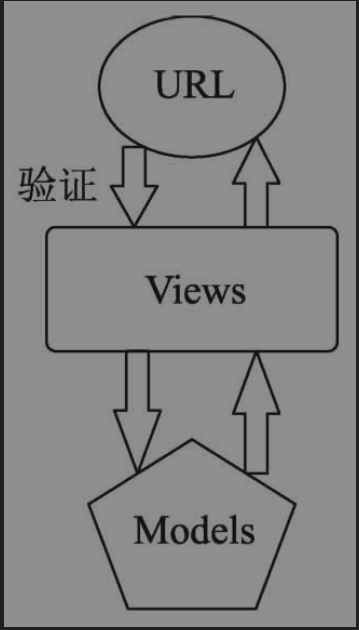

用户通过URL地址，进入网站的后端逻辑，从而对网站的数据库进行操作管理（增、删、改、查）。如果想要让拥有操作管理权限的用户来完成这个生命周期，而没有权限的用户无法完成这个生命周期，应该在哪一步进行设置呢？

很显然，这一步应该在进入Views之前完成，也就是说，权限管理与Views和Models阶段无关。


我们可以得出一个结论，**权限管理发生在用户请求进入Views之前**，那么我们判断用户是否有某种权限，只能通过URL来判断了。我们可以理解为，**所谓网站的权限，就是指用户是否能访问特定的URL。**

为验证权限的流程图。从图中我们可以直观的看出一个权限管理的前提，那就是用户的登录。可以说没有登录成功，就不存在所谓的权限管理。

验证权限流程图

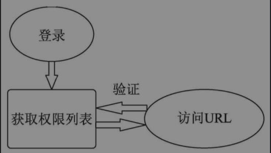

新建项目来完成权限管理雏形演示


### 2.2 新建项目来完成权限管理雏形演示

建立项目demo6，新建用户表和权限表备用，以及手动插入一些用来演示权限验证的数据

（1）新建Django项目demo6，同时新建App并命名为app01。


（2）在app01/models.py中建立权限表和用户表类：

```python
from django.db import models


# Create your models here.
class Permission(models.Model):
    """
    权限表
    """
    url = models.CharField(max_length=64)
    title = models.CharField(max_length=10)

    class Meta:
        verbose_name = "权限表"
        verbose_name_plural = verbose_name

    def __str__(self):
        return self.title


class Userinfor(models.Model):
    """
    用户表
    """
    name = models.CharField(max_length=32)
    pwd = models.CharField(max_length=32)
    permission = models.ManyToManyField(Permission, null=True, blank=True)

    class Meta:
        verbose_name = "用户表"
        verbose_name_plural = verbose_name

    def __str__(self):
        return self.name
```

（3）执行数据更新命令：

```
python manage.py makemigrations
python manage.py migrate
```

> 注意： 这里为了演示的简单，新建立了一个用户表，而不是使用Django自带的用户表。

这里数据库里面生成两张表，分别是app01_permission、app01_userinfor


（4）执行新建超级用户的命令，新建超级用户root，密码设置为root1234。

```
python manage.py createsuperuser
```

（5）在app01/admin.py中注册这两个表，Permission和Userinfor：

```
from django.contrib import admin

from .models import Permission, Userinfor

# Register your models here.

admin.site.register(Permission)

admin.site.register(Userinfor)
```

（6）运行demo6项目，然后访问http://127.0.0.1:8000/admin 

> 注意： 登录界面的URL并不是我们开始访问的/admin，而是进行了一次重定向。

（7）如图所示，增加权限记录：

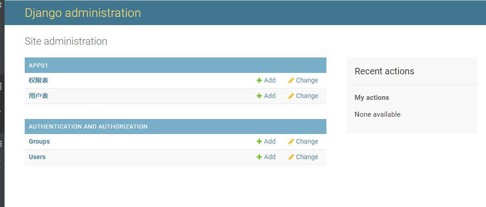

Url字段添加/userinfo01/，Title字段添加“查看用户1”。因为只做演示用，所以在权限表中，我们暂时只添加这一条记录。在实际的项目生产中，权限表中的记录一般有很多条，大家要对权限记录的数量级别做好一个心理准备。

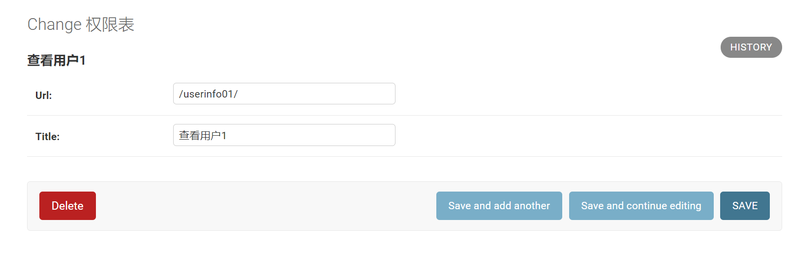

（8）在用户表中新建两个用户记录user1和user2，其中给user1绑定查看用户1的权限，user2不绑定任何权限。

账号 user1/pwd1		user2/pwd2


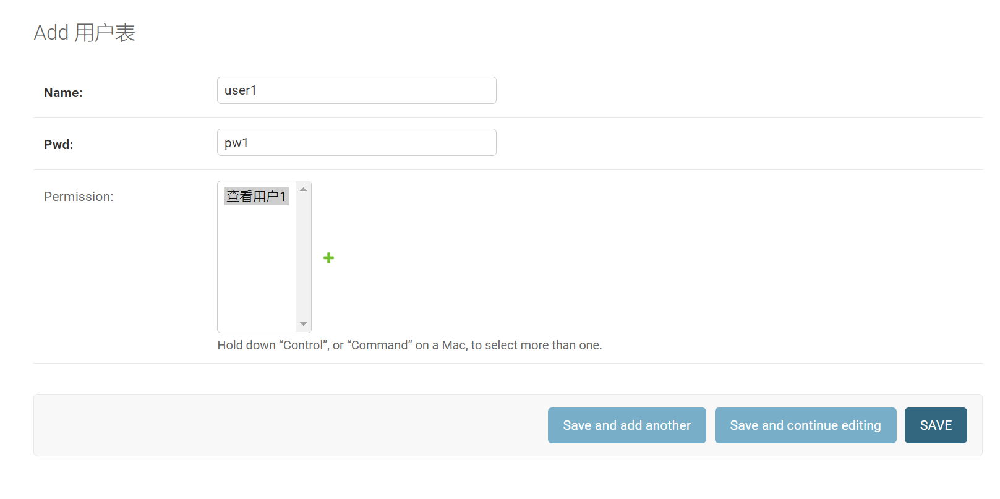

（9）在app01/views.py内编写登录逻辑和访问、查看用户逻辑：

```
from django.shortcuts import render, HttpResponse, redirect
from .models import Userinfor, Permission


# Create your views here.
def login(request):
    if request.method == "POST":
        username = request.POST.get('username')
        pwd = request.POST.get('pwd')
        user = Userinfor.objects.filter(name=username, pwd=pwd).first()
        if user:
            # 验证身份
            request.session["user_id"] = user.pk
            return HttpResponse('登录成功')
    return render(request, "login.html")


def userinfo(request):
    # 首先进行身份验证
    pk = request.session.get('user_id')
    if not pk:
        return redirect("/login/")
    # 然后进行权限验证
    user = Userinfor.objects.filter(id=pk).first()
    p_list = []
    p_queryset = user.permission.all()
    # 获取用户的权限列表
    for p in p_queryset:
        p_list.append(p.url)
    # 去重
    p_list = list(set(p_list))
    # print(p_list)
    # 获取URL
    c = request.path_info
    if c in p_list:
        u_queryset = Userinfor.objects.all()
        return render(request, "userinfo.html", {"u_queryset": u_queryset})
    else:
        return HttpResponse('没有权限访问该页面')
```

（10）在demo6/urls.py内配置路由代码：

```
from django.contrib import admin
from django.urls import path
from app01.views import login, userinfo

urlpatterns = [
    path('admin/', admin.site.urls),
    path('login/', login),
    path('userinfo01/', userinfo),
]

```

（11）在templates目录下新建html文件login.html：

```
<!DOCTYPE html>
<html lang="en">
<head>
    <meta charset="UTF-8">
    <title>Title</title>
</head>
<body>
<h4>用户登录</h4>
<form action="/login/" method="post">
    
    用户名：<input type="text" name="username">
    密码：<input type="password" name="pwd">
    <input type="submit">
</form>
</body>
</html>
```

运行demo6，访问：http://127.0.0.1:8000/login/

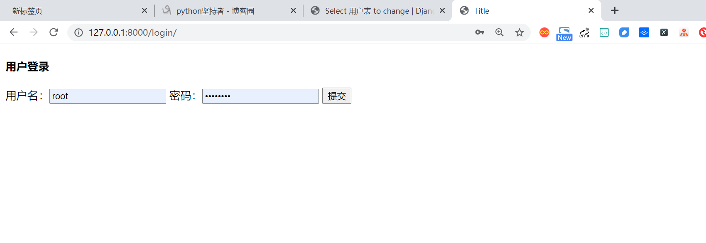

输入用户名：user1，密码：pwd1进行登录，显示登录成功

（12）在templates目录下新建userinfo.html文件

```
<!DOCTYPE html>
<html lang="en">
<head>
    <meta charset="UTF-8">
    <title>Title</title>
</head>
<body>
<h4>用户</h4>

    <li>{{ user.name }}</li>

</body>
</html>
```

第(8)步在新建user1时，给user1访问“查看用户1”的权限，所以，当重启demo6以后，再访问http://127.0.0.1:8000/userinfo01/ 


（13）user1可以成功访问/userinfo01/路由，这还不能完全证明我们的权限管理项目设计成功了，这只证明了有权限的用户可以通过权限验证，还没有证明没有权限的用户无法通过权限验证

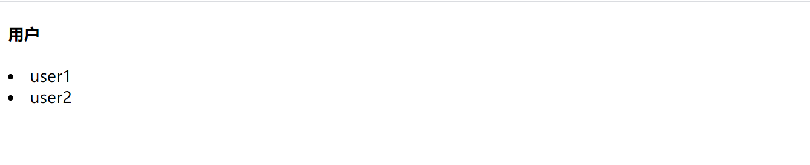

我们再次访问[http://127.0.0.1:8000/login/ ](http://127.0.0.1:8000/login/)，然后输入用户名user2，密码pwd2进行登录。


至此，我们根据权限管理的原理，建立了demo6，不论有多少种权限管理方案，都是基于这个原理设计的。


### 2.3 什么是RBAC

其实在互联网行业中，解决权限管理的方案有一个很有名的模式叫RBAC。RBAC模式之于权限管理就如同JWT之于登录验证，无论是使用Java、PHP、C#还是Python开发网站，RBAC模式都被广泛应用。


RBAC（Role-Based Access Control，基于角色的访问控制），如图所示，与我们在之前所介绍的权限管理的生命周期不同，在RBAC模式的生命周期中，增加了“角色”这个概念。

RBAC生命周期

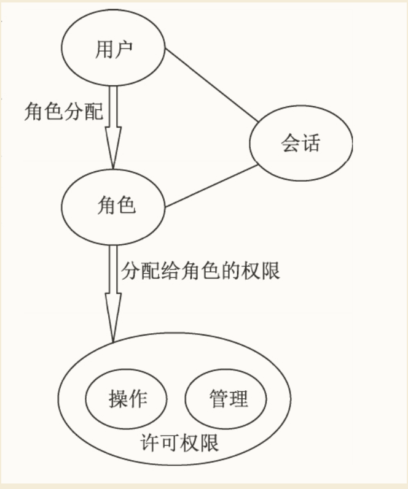

RBAC生命周期介绍如下：

（1）用户登录验证。

（2）根据用户身份验证信息，获取用户的角色。

（3）通过用户所绑定的角色（有可能不止一个），获取这个角色绑定的所有权限，并去重。

（4）查询用户所访问的URL是否在角色的权限内，如果在，则继续访问，如果不在，则拒绝访问。


### 2.4 Django项目中使用RBAC

在这一节中对demo6进行改造，给demo6增加RBAC的功能，实现角色权限管理的业务需求，具体步骤如下所述。

（1）在demo6中执行新建App命令，将其命名为rbac：

```
python manage.py startapp rbac
```

（2）在settings.py中添加RBAC的注册代码：

```
INSTALLED_APPS = [
    'django.contrib.admin',
    'django.contrib.auth',
    'django.contrib.contenttypes',
    'django.contrib.sessions',
    'django.contrib.messages',
    'django.contrib.staticfiles',
    'app01.apps.App01Config',
    'rbac.apps.RbacConfig',
]
```

> 注意： 如果不在settings.py中注册新建的App，新建的App数据将无法更新。


( 3）在rbac/model.py中新建权限管理所需的表类：

```
from django.db import models


# Create your models here.
class Permission(models.Model):
    """
    权限表
    """
    url = models.CharField(max_length=64)
    title = models.CharField(max_length=10)

    class Meta:
        verbose_name = '权限表'
        verbose_name_plural = verbose_name

    def __str__(self):
        return self.title


class Role(models.Model):
    """
    角色表
    """
    title = models.CharField(max_length=10)
    permission = models.ManyToManyField(Permission, null=True, blank=True)

    class Meta:
        verbose_name = '角色表'
        verbose_name_plural = verbose_name

    def __str__(self):
        return self.title


class User(models.Model):
    """
    用户表
    """
    name = models.CharField(max_length=32)
    pwd = models.CharField(max_length=32)
    role = models.ManyToManyField(Role, null=True, blank=True)

    class Meta:
        verbose_name = '用户表'
        verbose_name_plural = verbose_name

    def __str__(self):
        return self.name

```

（4）在rbac/admin.py中写入注册用户表、权限表、角色表的代码：

```
from django.contrib import admin
from .models import User,Role,Permission

# Register your models here.

# Register your models here.

admin.site.register(Permission)
admin.site.register(Role)
admin.site.register(User)
```

（5）执行数据更新命令：

```
python manage.py makemigrations

python manage.py migrate
```

更新完数据，生成了5张表。

`rbac_permission`、`rbac_role`、`rbac_role_permission`、`rbac_user`、`rbac_user_role`

（6）运行demo6项目，访问：[http://127.0.0.1:8000/admin/ ](http://127.0.0.1:8000/admin/)，如图6-20所示，在Django自带的admin后台，已经可以查看到RBAC下的3个表。


（7）如图所示，在Rbac下的权限表内增加权限记录。

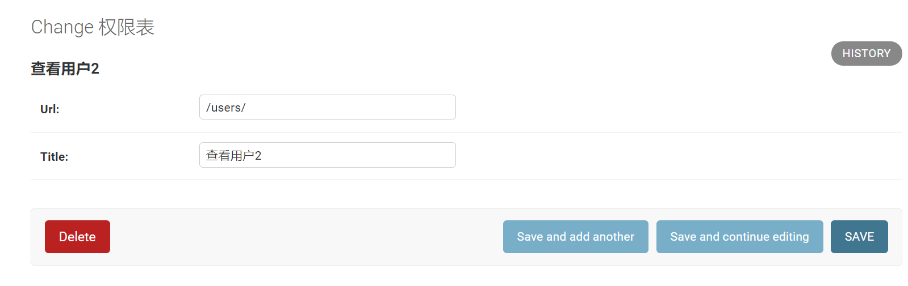

（8）如图所示，在Rbac下的角色表里增加一条角色记录，角色：人力资源总监，权限：查看用户2。

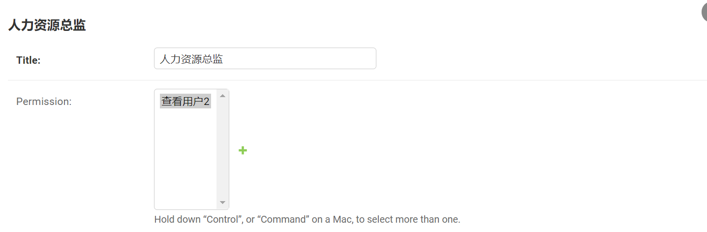

（9）如图所示，在Rbac下的用户表里新增两条记录，user11给角色设定为“人力资源总监”，user22不设定任何角色。

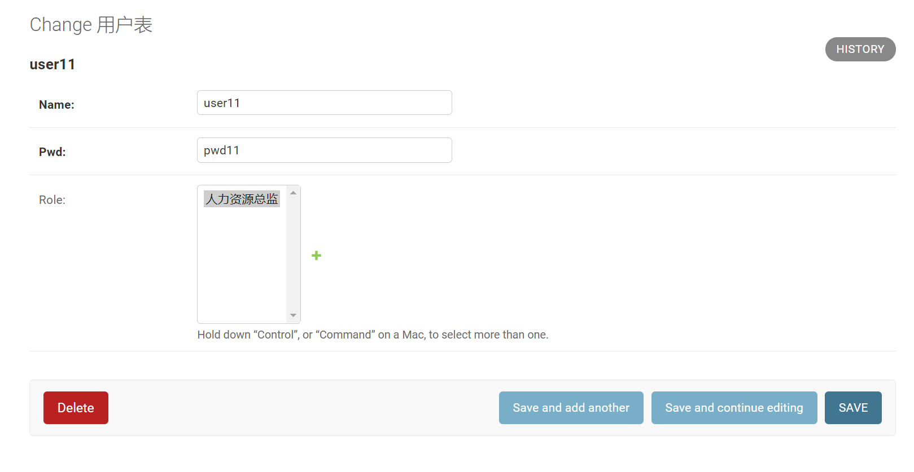

（10）重写登录验证逻辑：将demo6/urls.py中与userinfo相关的路由配置代码删除。

```
from django.contrib import admin
from django.urls import path
from app01.views import login, userinfo

urlpatterns = [
    path('admin/', admin.site.urls),
    path('login/', login),
]
```

然后重写app01/views.py中的login函数，login函数在“查询角色所对应的权限”环节，有两种写法。

写法1：

```
from django.shortcuts import render, HttpResponse, redirect
from rbac.models import User, Permission, Role


# Create your views here.
def login(request):
    if request.method == "POST":
        username = request.POST.get('username')
        pwd = request.POST.get('pwd')
        user = User.objects.filter(name=username, pwd=pwd).first()
        if user:
            # 验证身份
            request.session["user_id"] = user.pk

            # 查询角色
            ret = user.role.all()
            print(ret)  # <QuerySet [<Role: 人力资源总监>]>

            # 查询角色所对应的权限
            re = user.role.all().values('permission__url')
            print(re)  # <QuerySet [{'permission__url': '/users/'}]>
            permission_list = []
            for item in re:
                permission_list.append(item["permission__url"])
            print(permission_list)  # ['/users/']
            
            request.session["permission_list"] = permission_list
            return HttpResponse('登录成功')
        return render(request, "login.html")
```

写法2

```
from django.shortcuts import render, HttpResponse, redirect
from rbac.models import User, Permission, Role


# Create your views here.
def login(request):
    if request.method == "POST":
        username = request.POST.get('username')
        pwd = request.POST.get('pwd')
        user = User.objects.filter(name=username, pwd=pwd).first()

        if user:
            # 验证身份
            request.session["user_id"] = user.pk

            # 查询角色
            ret = user.role.all()
            # print(ret)#<QuerySet [<Role: 人力资源总监>]>

            # 查询角色所对应的权限
            permission_list = []
            for item1 in ret:
                # 多对多连表查询
                rep = Permission.objects.filter(role__title=item1)

                for item2 in rep:
                    # print(item2.url)#/users/
                    permission_list.append(item2.url)
            print(permission_list)
            request.session["permission_list"] = permission_list
        return HttpResponse('登录成功')

    return render(request, "login.html")
```

第一种写法并不是经常使用，程序员长时间不使用，容易遗忘相关的知识点。所以，第一种写法偏“炫技”，第二种写法比较朴实。笔者的编程哲学：“代码写成什么样机器都看得懂，最重要的是代码也要能让人看得懂”，所以推荐使用第二种写法。


（11）权限验证：在app01/views.py中，编写查看用户函数，内含权限验证代码。

```
import re

def user(request):
    # 获取session键值，如果不存在不报错，返回None
    permission_list = request.session.get('permission_list', [])
    # print(permission_list)
    path = request.path_info
    # print(path)
    flag = False

    for permission in permission_list:
        permission = "^%s$" % permission
        ret = re.match(permission, path)

        if ret:
            flag = True
            break

    # print(flag)
    if not flag:
        return HttpResponse('无访问权限！')
    return HttpResponse('查看用户')
```

在urls.py内配置路径： 

```
from django.contrib import admin
from django.urls import path
from app01.views import login, user

urlpatterns = [
    path('admin/', admin.site.urls),
    path('login/', login),
    path('users/', user),
]

```

（12）验证user11可以通过权限验证。如图所示，访问[http://127.0.0.1:8000/login/ ](http://127.0.0.1:8000/login/)，然后登录user11，用户名：user11，密码：pwd11。

验证权限控制效果。

user11能访问http://127.0.0.1:8000/users/ 

user22没有权限访问http://127.0.0.1:8000/users/ 


## 3. Django基于中间件的权限验证

权限验证几乎是每个用户的数据请求都需要经历的过程。如果给每一个视图函数都加一遍权限验证代码，或者写一个装饰器的封装权限验证逻辑，然后给每一个视图函数添加装饰器，都会大大地增加工作量，而将权限验证设置为中间件，就可以在权限验证这个业务下一劳永逸啦！


（1）如图所示，在rbac目录下新建包service，然后在service目录下新建rbac.py模块文件。

```
#!/usr/bin/env python
import re
from django.shortcuts import HttpResponse
from django.utils.deprecation import MiddlewareMixin


class ValidPermission(MiddlewareMixin):
    """
      权限验证中间件类
    """

    def process_request(self, request):
        ######################中间件内容start###############
        # 获取session键值，如果不存在，不报错，返回[]
        permission_list = request.session.get('permission_list', [])
        # print(permission_list)
        path = request.path_info
        print(path)

        flag = False

        for permission in permission_list:
            permission = "^%s$" % permission
            ret = re.match(permission, path)
            if ret:
                flag = True
                break
        print(flag)
        if not flag:
            return HttpResponse("无访问权限!")

        ##################中间件内容end###################
        return None
```

（2）在settings.py内配置中间件：

```

MIDDLEWARE = [
    'django.middleware.security.SecurityMiddleware',
    'django.contrib.sessions.middleware.SessionMiddleware',
    'django.middleware.common.CommonMiddleware',
    'django.middleware.csrf.CsrfViewMiddleware',
    'django.contrib.auth.middleware.AuthenticationMiddleware',
    'django.contrib.messages.middleware.MessageMiddleware',
    'django.middleware.clickjacking.XFrameOptionsMiddleware',
    'rbac.service.rbac.ValidPermission',
]
```

注意： 新建的中间件应该加在编写中间件所使用的中间件的后面。比如我们编写的权限验证中间件中使用到了Session，那么新建的中间件应该加在Session中间件的后面，这样可以确保不会出现错误。

（3）设置白名单。当我们想要换一个用户名登录时，访问： [http://127.0.0.1:8000/login/ ](http://127.0.0.1:8000/login/)，会发现在登录之前被要求权限验证。


从逻辑上来说，应该先进行身份验证，再进行权限验证，如果没有身份验证，权限验证将无从谈起。所以，所有与身份验证相关的权限（URL），都不应该受到权限验证中间件的影响。我们将中间件代码加以优化，将登录、注册、后台管理相关的URL都加入白名单中。将rbac/service/rbac.py中的代码改写为：

```
#!/usr/bin/env python
import re
from django.shortcuts import HttpResponse
from django.utils.deprecation import MiddlewareMixin


class ValidPermission(MiddlewareMixin):
    """
      权限验证中间件类
    """

    def process_request(self, request):
        ######################中间件内容start###############
        # 获取session键值，如果不存在，不报错，返回[]
        path = request.path_info
        # print(path)

        # 查看是否属于白名单
        # valid_url_list=['/login/','/register/','/admin/.*']
        #for valid_url in valid_url_list:
        #     ret=re.match(valid_url,path)
        #     if ret:
        #         return None

        # 获取session键值，如果不存在，不报错，返回None
        permission_list = request.session.get('permission_list', [])
        # print(permission_list)
        path = request.path_info
        print(path)

        flag = False

        for permission in permission_list:
            permission = "^%s$" % permission
            ret = re.match(permission, path)
            if ret:
                flag = True
                break
        print(flag)
        if not flag:
            return HttpResponse("无访问权限!")

        ##################中间件内容end###################
        return None
```

（4）解耦。我们再回来看app01/views.py中的login函数：

```
from django.shortcuts import render, HttpResponse, redirect
from rbac.models import User, Permission, Role
from rbac.service.permission import initial_permission


# Create your views here.
def login(request):
    if request.method == "POST":
        username = request.POST.get('username')
        pwd = request.POST.get('pwd')
        user = User.objects.filter(name=username, pwd=pwd).first()

        if user:
            # 验证身份
            request.session["user_id"] = user.pk
            # 查询角色
            ret = user.role.all()
            # print(ret)#<QuerySet [<Role: 人力资源总监>]>

            # 查询角色所对应的权限
            permission_list = []
            for item1 in ret:
                # 多对多连表查询
                rep = Permission.objects.filter(role__title=item1)

                for item2 in rep:
                    # print(item2.url)#/users/
                    permission_list.append(item2.url)
            print(permission_list)
            request.session["permission_list"] = permission_list
        return HttpResponse('登录成功')

    return render(request, "login.html")
```

在函数体中，查询角色和查询角色所对应的权限，应该属于权限校验，而非身份校验，这显然是存在耦合性过高的情况，应该将权限校验进行解耦。

在rbac/service下新建permission.py模块文件：

```
from rbac.models import User, Permission, Role


def initial_permission(user, request):
    # 查询角色
    ret = user.role.all()
    # print(ret)#<QuerySet [<Role: 人力资源总监>]>

    # 查询角色所对应的权限
    permission_list = []
    for item1 in ret:
        # 多对多连表查询
        rep = Permission.objects.filter(role__title=item1)
        for item2 in rep:
            print(item2.url)  # /users/
            permission_list.append(item2.url)
    print(permission_list)

    request.session["permission_list"] = permission_list

```

然后，我们将app01/views.py中的login函数，改写为

```
from django.shortcuts import render, HttpResponse, redirect
from rbac.models import User, Permission, Role
from rbac.service.permission import initial_permission


# Create your views here.
def login(request):
    if request.method == "POST":
        username = request.POST.get('username')
        pwd = request.POST.get('pwd')
        user = User.objects.filter(name=username, pwd=pwd).first()

        if user:
            # 验证身份
            request.session["user_id"] = user.pk
            initial_permission(user, request)
            return HttpResponse("登录成功")
    return render(request, "login.html")
```

### 3.1 Django REST framework实现权限管理

准备演示权限管理的初始代码

根据权限的定义我们知道，权限的基础是身份验证，身份验证的基础是登录验证。所以我们要搭建权限管理系统就要先搭建一个具备登录功能的项目。

（1）如图所示，新建项目demo6_drf，新建App，命名为app01。

（2）在app01/models.py内新建相关表类：

```
from django.db import models
from datetime import datetime


# Create your models here.
class UserInfo(models.Model):
    """
    用户表
    """
    user_type_chioces = ((1, "普通用户"),
                         (2, "VIP"),
                         (3, "SVIP"),
                         )
    user_type = models.IntegerField(choices=user_type_chioces)
    username = models.CharField(max_length=32)
    password = models.CharField(max_length=64)
    add_time = models.DateTimeField(default=datetime.now, verbose_name='添加时间')

    class Meta:
        verbose_name = '用户表'
        verbose_name_plural = verbose_name

    def __str__(self):
        return self.username


class UserToken(models.Model):
    """
    Token表
    """
    user = models.ForeignKey(UserInfo, on_delete=models.CASCADE)
    token = models.CharField(max_length=64)
    add_time = models.DateTimeField(default=datetime.now, verbose_name='添加时间')

    class Meta:
        verbose_name = 'token表'
        verbose_name_plural = verbose_name

    def __str__(self):
        return self.user.username


class CommonVideo(models.Model):
    """
    普通视频
    """
    title = models.CharField(max_length=32)
    url = models.CharField(max_length=200, verbose_name='资源地址')
    add_time = models.DateTimeField(default=datetime.now, verbose_name='添加时间')

    class Meta:
        verbose_name = '普通视频表'
        verbose_name_plural = verbose_name

    def __str__(self):
        return self.title


class VIPVideo(models.Model):
    """
    会员视频
    """
    title = models.CharField(max_length=32)
    url = models.CharField(max_length=200, verbose_name='资源地址')
    add_time = models.DateTimeField(default=datetime.now, verbose_name='添加时间')

    class Meta:
        verbose_name = '会员视频表'
        verbose_name_plural = verbose_name

    def __str__(self):
        return self.title


class SVIPVideo(models.Model):
    """
    超级会员视频
    """
    title = models.CharField(max_length=32)
    url = models.CharField(max_length=200, verbose_name='资源地址')
    add_time = models.DateTimeField(default=datetime.now, verbose_name='添加时间')

    class Meta:
        verbose_name = '超级会员视频表'
        verbose_name_plural = verbose_name

    def __str__(self):
        return self.title

```

（3）执行数据更新命令：

```
python manage.py makemigrations

python manage.py migrate
```

在app01下，生成5张表格以备后面使用.

（4）手动向自定义的用户表内添加3个用户

（5）在普通视频表、会员视频表、超级会员视频表中，分别手动加入一条记录

（6）安装Django REST framework相关依赖：

```
pip install djangorestframework markdown django-filter
```

（7）在settings.py中添加注册配置代码：

```
INSTALLED_APPS = [
    'django.contrib.admin',
    'django.contrib.auth',
    'django.contrib.contenttypes',
    'django.contrib.sessions',
    'django.contrib.messages',
    'django.contrib.staticfiles',
    'app01.apps.App01Config',
    'rest_framework',
]
```

（8）在app01/views.py内编写用户登录逻辑代码：

```
from django.shortcuts import render
from django.http import JsonResponse
from rest_framework.views import APIView
from .models import *


# Create your views here.
def md5(user):
    import hashlib
    import time
    ctime = str(time.time())
    m = hashlib.md5(bytes(user, encoding='utf-8'))
    m.update(bytes(ctime, encoding='utf-8'))
    return m.hexdigest()


class AuthView(APIView):
    """
    登录
    """
    def post(self, request):
        ret = {'code': 1000, 'msg': '登录成功！'}
        try:
            user = self.request.POST.get('username')
            pwd = self.request.POST.get('password')
            obj = UserInfo.objects.filter(username=user, password=pwd).first()
            if not obj:
                ret['code'] = 1001
                ret['msg'] = '用户名或密码错误'
                return JsonResponse(ret)
            # 为登录用户创建token
            token = md5(user)
            # 存在则更新，不存在的创建
            UserToken.objects.update_or_create(user=obj, defaults={'token': token})
            ret['token'] = token
        except Exception as e:
            ret['code'] = 1002
            ret['msg'] = '请求异常'
        return JsonResponse(ret)
```

（9）在urls.py中配置路由： 

```
from django.contrib import admin
from django.urls import path
from app01.views import AuthView

urlpatterns = [
    path('admin/', admin.site.urls),
    path('auth/', AuthView.as_view(), name='auth'),
]
```

（10）如图所示，使用Postman以post的方式，向：http://127.0.0.1:8000/auth/ ，提交数据：

```
{

  "username":"user1",

  "password":’111"

}
```

得到返回数据：

```
{
    "code": 1000,
    "msg": "登录成功！",
    "token": "101c55385a0c502ea6440806fdda8af2"
}
```

至此，成功获取了登录令牌Token。如图所示，可以通过Database直接查看Usertoken表，印证这里已经产生了一条Token记录，并且与我们通过Postman获取的Token相同。

### 3.2 为demo6_drf添加身份验证功能

我们已经成功实现了通过Token的方式进行登录的业务模型。接下来将开发身份验证的功能，步骤如下：

（1）在app01目录下新建序列化模块文件serializers.py：

```
#!/usr/bin/env python
# -*- coding: utf-8 -*-
from rest_framework import serializers

# 引入数据表类
from .models import CommonVideo, VIPVideo, SVIPVideo


# 将3个数据库类进行序列化
class CommonVideoSerializer(serializers.ModelSerializer):
    class Meta:
        model = CommonVideo
        fields = "__all__"


class VIPVideoSerializer(serializers.ModelSerializer):
    class Meta:
        model = VIPVideo
        fields = "__all__"


class SVIPVideoSerializer(serializers.ModelSerializer):
    class Meta:
        model = SVIPVideo
        fields = "__all__"

```

（2）在app01/views.py中编写身份认证类Authtication和登录后即可访问的内容资源类CommonVideoView：

```
from django.shortcuts import render, HttpResponse
from django.http import JsonResponse
from rest_framework.views import APIView
# 引入所有数据表
from .models import *

# 引入所有序列化类
from .serializers import *
# 引入drf相关模块
from rest_framework.response import Response
from rest_framework.renderers import JSONRenderer, BrowsableAPIRenderer
from rest_framework import exceptions


# Create your views here.
def md5(user):
    import hashlib
    import time
    ctime = str(time.time())
    m = hashlib.md5(bytes(user, encoding='utf-8'))
    m.update(bytes(ctime, encoding='utf-8'))
    return m.hexdigest()


class AuthView(APIView):
    """
    登录
    """

    def post(self, request):
        ret = {'code': 1000, 'msg': '登录成功！'}
        try:
            user = self.request.POST.get('username')
            pwd = self.request.POST.get('password')
            obj = UserInfo.objects.filter(username=user, password=pwd).first()
            if not obj:
                ret['code'] = 1001
                ret['msg'] = '用户名或密码错误'
                return JsonResponse(ret)
            # 为登录用户创建token
            token = md5(user)
            # 存在则更新，不存在的创建
            UserToken.objects.update_or_create(user=obj, defaults={'token': token})
            ret['token'] = token
        except Exception as e:
            ret['code'] = 1002
            ret['msg'] = '请求异常'
        return JsonResponse(ret)


# Create your views here.
class Authtication(object):
    def authenticate(self, request):
        # 验证是否已经登录,函数名必须为：authenticate
        token = request._request.GET.get('token')
        token_obj = UserToken.objects.filter(token=token).first()
        if not token_obj:
            raise exceptions.AuthenticationFailed('用户认证失败。')
        # 在rest_framework内部会将以下两个元素赋值到request，以供后续使用
        return (token_obj.user, token_obj)

    def authenticate_header(self, request):
        # 这个函数可以没内容，但是必须要有
        pass


class CommonVideoView(APIView):
    """
    登录后即可访问的内容资源
    """
    renderer_classes = [JSONRenderer]  # 渲染器
    authentication_classes = [Authtication, ]

    def get(self, request):
        # print(request.user,request.auth)#user1 user1
        video_list = CommonVideo.objects.all()
        re = CommonVideoSerializer(video_list, many=True)
        return Response(re.data)

```

（3）在urls.py中配置路由： 

```
from django.contrib import admin
from django.urls import path
from app01.views import AuthView, CommonVideoView

urlpatterns = [
    path('admin/', admin.site.urls),
    path('auth/', AuthView.as_view(), name='auth'),
    path('common/', CommonVideoView.as_view(), name='common'),
]
```

（4）运行项目，如图6-43所示，使用Postman以get的方式携带Token，向http://127.0.0.1:8000/common/?token=5dabaf29e3559be4526e16041a1a9fe6 发送网络请求，成功获取到了数据

```
[
    {
        "id": 1,
        "title": "红楼梦预告",
        "url": "http1",
        "add_time": null
    }
]
```

如果不携带Token，则会提示“用户认证失败”。

说明我们的身份认证功能已经实现了。


（5）解耦。应该把认证类和视图逻辑类分开。在app01下新建目录utils，在utils目录下新建auth.py，然后将身份认证类Authtication及其相关代码迁移到auth.py中：

```
# 引入所有数据表
from ..models import *

# 引入drf相关模块
from rest_framework import exceptions


# Create your views here.
class Authtication(object):
    def authenticate(self, request):
        # 验证是否已经登录,函数名必须为：authenticate
        token = request._request.GET.get('token')
        token_obj = UserToken.objects.filter(token=token).first()
        if not token_obj:
            raise exceptions.AuthenticationFailed('用户认证失败。')
        # 在rest_framework内部会将以下两个元素赋值到request，以供后续使用
        return (token_obj.user, token_obj)

    def authenticate_header(self, request):
        #这个函数可以没有内容，但是必须要有这个函数
        pass
```

在app01/views.py中加入引入代码：

```
from .utils.auth import Authtication
```

（6）全局身份验证配置。如果所有的视图函数，都需要身份验证才可以访问，那么首先在settings.py里追加配置代码：

```
REST_FRAMEWORK = {

    'DEFAULT_AUTHENTICATION_CLASSES': (

        'app01.utils.auth.Authtication',

    )

}
```

然后在views.py中的登录类中设置代码，令其不受全局身份验证的影响：

```
class AuthView(APIView):
    """
    登录
    """
    authentication_classes = []
    def post(self, request):
        ret = {'code': 1000, 'msg': '登录成功！'}
        .....
```

为demo6_drf添加权限管理功能

以上一节全局身份验证为基础，本节将添加权限管理功能。

（1）在app01/utils/auth.py内新增VIP和SVIP权限验证代码：

```
class VIP(object):
    """
    验证VIP权限
    """

    def has_permission(self, request, view):
        if request.user.user_type < 2:
            return False
        return True


class SVIP(object):
    """
    验证SVIP权限
    """

    def has_permission(self, request, view):
        if request.user.user_type < 3:
            return False
        return True
```

（2）在app01/views.py内新增获取VIP资源和SVIP资源的视图函数：

```

class VIPVideoView(APIView):
    """
    VIP可访问的资源
    """
    renderer_classes = [JSONRenderer]  # 渲染器
    permission_classes = [VIP]

    def get(self, request):
        video_list = VIPVideo.objects.all()
        re = VIPVideoSerializer(video_list, many=True)
        return Response(re.data)


class SVIPVideoView(APIView):
    """
    SVIP可访问的资源
    """
    renderer_classes = [JSONRenderer]  # 渲染器
    permission_classes = [SVIP]

    def get(self, request):
        video_list = SVIPVideo.objects.all()
        re = SVIPVideoSerializer(video_list, many=True)
        return Response(re.data)

```

（3）在urls.py内新增路由代码：

```
from django.contrib import admin
from django.urls import path
from app01.views import AuthView, CommonVideoView, VIPVideoView, SVIPVideoView

urlpatterns = [
    path('admin/', admin.site.urls),
    # 登录验证
    path('auth/', AuthView.as_view(), name='auth'),
    # 获取普通资源
    path('common/', CommonVideoView.as_view(), name='common'),
    # 获取VIP资源
    path('vip/', VIPVideoView.as_view(), name='vip'),
    # 获取SVIP资源
    path('svip/', SVIPVideoView.as_view(), name='svip'),

]

```

### 3.3 验证demo6_drf权限管理的功能

现在运行demo6_drf，让我们来测试一下普通用户user1，VIP用户user2和SVIP用户user3在权限管理系统下是否能够达到预期效果。

（1）登录user1。如图所示，使用Postman，以post的方式向：http://127.0.0.1:8000/auth/ 提交数据：

```
{
    "code": 1000,
    "msg": "登录成功！",
    "token": "882130f89bed2f9f99372745ee831c9d"
}
```

（2）测试user1获取普通数据。如图所示，携带user1用户的Token，http://127.0.0.1:8000/common/?token=882130f89bed2f9f99372745ee831c9d以get的方式访问：

```
[
    {
        "id": 1,
        "title": "红楼梦预告",
        "url": "http1",
        "add_time": null
    }
]
```

（3）测试user1获取VIP数据资源。如图6-47所示，使用user1的Token访问：http://127.0.0.1:8000/vip/?token=882130f89bed2f9f99372745ee831c9d ，将返回没有通过权限验证的提示信息。

```
{
    "detail": "You do not have permission to perform this action."
}
```

（4）测试user1获取SVIP数据资源。如图所示，使用user1的Token获取SVIP的资源，返回了与获取VIP的资源一样的结果，提示没有通过权限验证。

```
{
    "detail": "You do not have permission to perform this action."
}
```

使用user2的token访问http://127.0.0.1:8000/vip/?token=ca6ad66339faab2d5cf7f93f042e0caa vip资源，返回如下信息：

```
[
    {
        "id": 1,
        "title": "红楼梦-会员完整版",
        "url": "http2",
        "add_time": null
    }
]
```

使用user3的token访问http://127.0.0.1:8000/svip/?token=1cb102142157d2ab83547a9980381113 vip资源，返回如下信息：

```
[
    {
        "id": 1,
        "title": "红楼梦-会员-未删减版",
        "url": "http3",
        "add_time": null
    }
]
```