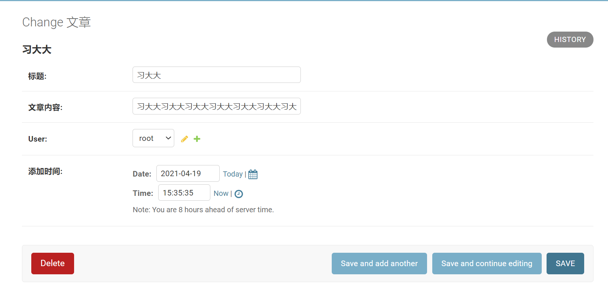
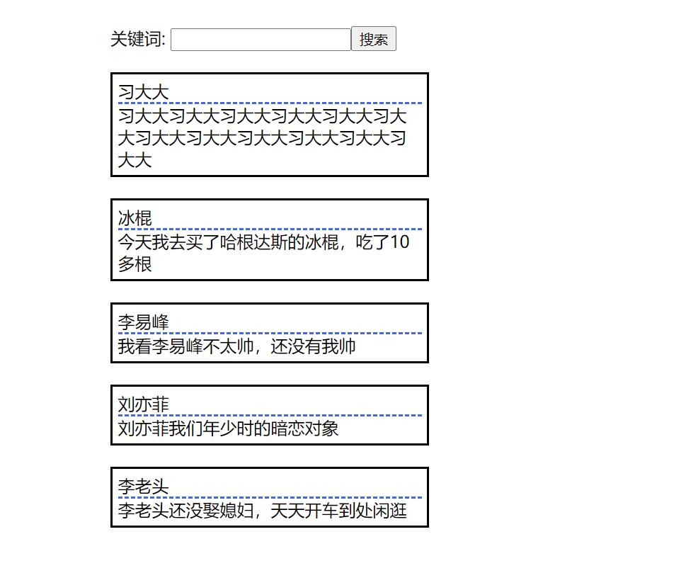

# 违禁词自审查功能


常见的违禁词自审查功能分为两种：

- 一种是用户提交发表的内容，在经过网站的违禁词自审查检验时，发现内容中包含了一些违禁词之后，提示用户发表失败，并且提示用户内容中有哪些违禁词，要求用户修改内容，或者放弃发表。这种违禁词自审查功能大多用于长篇博客、影评、网络小说等篇幅较大的内容审查中。
- 另外一种则是比较适合评论、发帖子、公屏交流等内容篇幅比较小的应用场景，这种违禁词自审查功能会将检测到的违禁词自动替换为*号。


## 1. 违禁词自审查功能的重要性

### 1.1 违禁词的影响

从产品角度上看，一个互联网平台一旦没有违禁词自审查功能，用户之间很容易因为一点口角，演变成性质非常恶劣的骂战，从而令整个平台的内容质量下降。内容质量降低，必将导致大批用户的流失。


而违禁词自审查功能，将用户之间因为口角而发出的一些过激词汇隐藏，可以有效地减弱用户的负面情绪，也消除了个别用户之间的矛盾对其他用户的影响。


### 1.2 可以避免法律风险

 众所周知，《广告法》是为了保护广大消费者不被黑心商家蒙骗的一部法律，而且《广告法》不但保护消费者，也保护守法商家不被恶意竞争所攻击。《广告法》规定，广告中不得出现有可能对消费者产生误导的词汇。互联网本身也具有媒体属性，很多文章看起来是一篇博客，其实是一篇软文广告，如果没有违禁词自审查功能，经过辛苦经营获取大量用户的网络，可就要成为某些商家打广告的地方。而广告的内容泛滥，质量参差不齐，身为平台的搭建方，如果不做好内容审查的工作，将面临巨大的法律风险。


## 2. Django REST framework实现模糊搜索功能

模糊搜索，顾名思义是用于网站内部的搜索。

### 2.1 演示实现模糊搜索的后端逻辑


我们先建立一个Django项目负责实现模糊搜索功能的后端逻辑。新建Django项目，并且安装相关依赖包，编写相关基础代码，步骤如下所述。

（1）新建Django项目，命名为demo7，新建App并命名为app01。


（2）安装Django REST framework及其依赖包markdown和Django-filter。

```
pip install djangorestframework markdown Django-filter
```

（3）在settings.py中添加注册代码：

```
INSTALLED_APPS = [
    'django.contrib.admin',
    'django.contrib.auth',
    'django.contrib.contenttypes',
    'django.contrib.sessions',
    'django.contrib.messages',
    'django.contrib.staticfiles',
    'app01.apps.App01Config',
    'rest_framework',
]
```

（4）执行数据更新命令：

```
python manage.py makemigrations

python manage.py migrate
```

（5）在app01/models.py内新建表类代码

```
from django.db import models
from django.contrib.auth.models import AbstractUser
from datetime import datetime


# Create your models here.

class UserProfile(AbstractUser):
    """
    用户表
    """

    user_type_chioces = (
        (1, "普通用户"),
        (2, "版主"),
        (3, "管理员"),
    )

    level = models.IntegerField(choices=user_type_chioces, default=1)
    add_time = models.DateTimeField(default=datetime.now, verbose_name='添加时间')

    class Meta:
        verbose_name = '用户'
        verbose_name_plural = verbose_name

        def __str__(self):
            return self.username


class Article(models.Model):
    """
    文章表
    """

    title = models.CharField(max_length=30, verbose_name='标题')
    content = models.CharField(max_length=5000, verbose_name='文章内容')
    user = models.ForeignKey(UserProfile, on_delete=models.CASCADE)
    add_time = models.DateTimeField(default=datetime.now, verbose_name='添加时间')

    class Meta:
        verbose_name = '文章'
        verbose_name_plural = verbose_name

    def __str__(self):
        return self.title

```

（6）在settings中配置用户表的继承代码：

```
AUTH_USER_MODEL='app01.UserProfile'
```

（7）再次执行数据更新命令：

```
python manage.py makemigrations

python manage.py migrate
```

（8）建立一个超级用户，用户名：root，密码：root1234

```
python manage.py createsuperuser
```

（9）在app01/admin.py中注册表：

```
from django.contrib import admin
from .models import UserProfile, Article

# Register your models here.
admin.site.register(UserProfile)
admin.site.register(Article)
```

（10）运行demo7项目，然后通过浏览器访问： http://127.0.0.1:8080/admin/，输入用户名root，密码root1234，然后单击登录按钮，进入demo7的后台管理页面，

（11）在后台管理页面添加文章数据。在此处可多添加几篇文章记录如图




### 2.2 演示实现模糊搜索的前端逻辑

接下来建立demo7_1来负责演示实现模糊搜索项目的前端部分。这部分同样需要安装一些依赖库，我们使用基于Vue前端框架来新建demo7_1，具体的步骤如下所述。

（1） 安装淘宝镜像：

```
npm install –g cnpm –registry=HTTPS://registry.npm.taobao.org
```

> 注意： 在这里我们默认电脑中已经安装了Node.js。淘宝镜像是为了让下载依赖包的速度更快一些，如果网络状况好，可以忽略这一步。

 (2) 使用cnpm搭建Vue框架，安装Vue的脚手架工具：

```
cnpm install –-global vue-cli
```

（3）创建项目demo7_1，并安装依赖

```
vue init webpack-simple demo7_1
cd demo7_1
cnpm install
```

（4）在demo7_1/src/App.vue内修改原本的代码，进行初始化

```
<template>
  <div id="app">
    <div class="search">
      关键词: <input type="text" v-model="keyword">
      <button @click="GetList()">搜索</button>
    </div>
    <div class="list">
      <div class="article" v-for="(item,index) in article" :key=index>
        <div class="title">{{ item.title }}</div>
        <div class="content">{{ item.content }}</div>
      </div>
    </div>
  </div>
</template>

<script>
import axios from 'axios';

export default {
  name: 'app',
  data() {
    return {
      keyword: '',
      article: []
    }
  },
  methods: {
    //向后端提交关键词
    GetList() {
      var api = 'http://127.0.0.1:8080/getlist/?keyword=' + this.keyword
      console.log(api)
      axios.get(api)
          .then((response) => {
            console.log(response);
            this.article = response.data
          })
          .catch((error) => {
            console.log(error)
          })
    }
  }
}
</script>
<style>
* {
  box-sizing: border-box;
}

.search {
  margin: 0 auto;
  margin-top: 100px;
  width: 300px;
}

.article {
  width: 300px;
  margin: 0 auto;
  margin-top: 20px;
  border: 2px solid;
  padding: 5px;
}

.title {
  border-bottom: 2px dashed royalblue;
}
</style>
```

（8）运行demo7_1，然后浏览器访问： http://localhost:8080/网页初始页面只有搜索关键词的输入框。


- 此时关键词输入框内容为空，单击“搜索”按钮，返回了所有文章

- 搜索关键词“冰棍”，返回了文章中包含关键词“冰棍”的文章。





## 3.Django REST framework开发违禁词自审查功能

### 3.1 开发违禁词自审查功能后端逻辑

(1）新建Django项目demo7_2，新建App，命名为app01。

注意： 这里新建demo7_2的流程与上一节中新建demo7的流程是一样的。

(2）安装Django REST framework及其依赖包markdown和Django-filter。

``` 
pip install djangorestframework markdown Django-filter
```

（3）在settings.py中添加注册代码

```
INSTALLED_APPS = [
    'django.contrib.admin',
    'django.contrib.auth',
    'django.contrib.contenttypes',
    'django.contrib.sessions',
    'django.contrib.messages',
    'django.contrib.staticfiles',
    'app01.apps.App01Config',
    'rest_framework',
    ]
```


（4）在demo7_2/app01/models.py中新建表类：

```
from django.db import models
from django.contrib.auth.models import AbstractUser
from datetime import datetime


# Create your models here.
class UserProfile(AbstractUser):
    """
    用户表
    """

    user_type_chioces = (
        (1, "普通用户"),
        (2, "版主"),
        (3, "管理员"),
    )

    level = models.IntegerField(choices=user_type_chioces, default=1)
    is_frozen = models.BooleanField(default=False, verbose_name='是否被冻结')
    add_time = models.DateTimeField(default=datetime.now, verbose_name='添加时间')

    class Meta:
        verbose_name = '用户'
        verbose_name_plural = verbose_name

    def __str__(self):
        return self.username


class Article(models.Model):
    """
    文章表
    """
    title = models.CharField(max_length=30, verbose_name='标题')
    content = models.CharField(max_length=5000, verbose_name='文章内容')
    user = models.ForeignKey(UserProfile, on_delete=models.CASCADE)
    add_time = models.DateTimeField(default=datetime.now, verbose_name='添加时间')

    class Meta:
        verbose_name = '文章'
        verbose_name_plural = verbose_name

    def __str__(self):
        return self.title


class Comment(models.Model):
    """
    评论表
    """

    user = models.ForeignKey(UserProfile, on_delete=models.CASCADE)
    article = models.ForeignKey(Article, on_delete=models.CASCADE)
    content = models.CharField(max_length=150, verbose_name='评论内容')
    add_time = models.DateTimeField(default=datetime.now, verbose_name=' 添加时间')

    class Meta:
        verbose_name = "评论"
        verbose_name_plural = verbose_name

    def __str__(self):
        return self.content


class Card(models.Model):
    """
    违禁词库
    """
    word = models.CharField(max_length=150, verbose_name="违禁词")
    add_time = models.DateTimeField(default=datetime.now, verbose_name="添加时间")

    class Meta:
        verbose_name = "违禁词"
        verbose_name_plural = verbose_name

    def __str__(self):
        return self.word
```

（5）在settings中配置用户表的继承代码：

```
# 配置用户表的继承
AUTH_USER_MODEL = 'app01.UserProfile'
```

（6）再次执行数据更新命令：

``` 
python manage.py makemigrations
python manage.py migrate
```

（7）建立一个超级用户，用户名：root，密码：root1234。

```
python manage.py createsuperuser

Username: root
...
```

（8）在app01/admin.py中注册表：

```
from django.contrib import admin
from .models import UserProfile, Article, Comment, Card

# Register your models here.
admin.site.register(UserProfile)
admin.site.register(Article)
admin.site.register(Comment)
admin.site.register(Card)
```


### 3.2 创建新用户

我们在上一节创建了超级用户root，下面运行demo7_2项目，然后使用浏览器访问http://127.0.0.1:8080/admin，在登录页面输入用户名root，密码root1234

新建超级用户，用户名：admin，密码：root4321。

这时，重启demo7_2项目，在浏览器端访问： http://127.0.0.1:8080/admin,使用我们新注册的用户名和密码进行登录。显示登录成功

```
python manage.py createsuperuser
Username: admin
```


### 3.3 开发违禁词自审查功能前端逻辑

接下来新建一个前端项目demo7_3，负责违禁词自审查功能的前端逻辑部分。使用Vue框架作为前端项目的开发环境，并且开发从前端向后端提交文章和提交文章评论两个功能，步骤如下所述。

（1）搭建Vue开发环境，安装Vue的脚手架工具：

```
# 安装淘宝npm
npm install -g cnpm --registry=https://registry.npm.taobao.org
# vue-cli 安装依赖包
cnpm install --g vue-cli
```

（2）创建项目demo7_3：

```
vue init webpack-simple demo7_3cd demo7_3cnpm install
```

（3）在demo7_3/src/App.vue中初始化代码：

```
<template>
  <div id="app">
    <div class="userinfo">
      用户名：{{ username }}
    </div>
    <div class="login" v-if="flag">
      <input type="text" v-model.lazy="username">
      <button @click="Login()">登录</button>
    </div>
    <div class="article" v-for="(item,index) in article" :key=index>
      <div class="title">{{ item.title }}</div>
      <div class="content">{{ item.content }}</div>
    </div>
    <div class="commentlist" v-for="item in comment" :key=item.content>
      <div class="commentcontent">{{ item.content }}</div>
    </div>
    <div class="makecomment">
      评论内容:<input type="text" v-model="pushcommet">
      <button @click="PushComment()">提交评论</button>
    </div>
    <div class="makearticle">
      <div class="title">文章标题 <input type="text" v-model="title"></div>
      <div class="content">文章内容 <input type="text" v-model="content"></div>
      <button @click="PushArticle()">提交文章</button>
    </div>
  </div>
</template>
<script>
import Axios from 'axios';

export default {
  name: 'app',
  data() {
    return {
      username: '',
      id: '',
      flag: true,
      article: [],
      title: '',
      content: '',
      comment: [],
      pushcommet: ''
    }
  },
  methods: {
//登录方法
    Login() {
      var api = 'http://127.0.0.1:8080/login/?username=' + this.username
      Axios.get(api)
          .then((response) => {
            // console.log(response.data.username);
            this.username = response.data.username
            this.id = response.data.id
            if (this.id) {
              this.flag = false
            }
          })
          .catch((error) => {
                console.log(error)
              }
          )
    },
//获取文章列表的方法
    GetArticle() {
      var api = 'http://127.0.0.1:8080/getarticle/'
      Axios.get(api)
          .then((response) => {
            console.log(response.data);
            this.article = response.data
          })
          .catch((error) => {
                console.log(error)
              }
          )
    },
//获取评论的方法
    GetComment() {
      var api = 'http://127.0.0.1:8080/getcomment/'
      Axios.get(api)
          .then((response) => {
            console.log(response.data);
            this.comment = response.data
          })
          .catch((error) => {
                console.log(error)
              }
          )
    },
//发表文章的方法
    PushArticle() {
      var api = 'http://127.0.0.1:8080/pusharticle/'
      var params = new URLSearchParams();
      params.append("title", this.title);
      params.append("content", this.content);
      params.append("id", this.id);
      console.log(params)
      Axios.post(api, params)
          .then((response) => {
            console.log(3333, response);
            if (response.data !== 200) {
              alert('存在违禁词')
            }
            this.GetArticle()
          })
          .catch((error) => {
                console.log(error)
              }
          )
    },
//发表评论的方法
    PushComment() {
      var api = 'http://127.0.0.1:8080/pushcomment/'
      let data = {"title": this.title, "comment": this.pushcommet, "id": this.id};
      var params = new URLSearchParams();
      params.append("comment", this.pushcommet);
      params.append("id", this.id);
      console.log(params)
      Axios.post(api, params)
          .then((response) => {
            console.log(response);
            this.GetComment()
          })
          .catch((error) => {
                console.log(error)
              }
          )
    }
  },
  mounted() {
    this.GetArticle();
    this.GetComment()
  }
}
</script>
<style>
* {
  box-sizing: border-box;
}

.userinfo {
  width: 300px;
  margin: 0 auto;
}

.login {
  width: 300px;
  margin: 0 auto;
}

.login input {
  width: 200px;
  margin: 0 auto;
}

.article {
  width: 300px;
  margin: 0 auto;
  margin-top: 20px;
  margin-bottom: 10px;
  border: 2px solid;
  padding: 5px;
}

.article .title {
  border-bottom: 1px solid;
}

.makecomment {
  width: 300px;
  margin: 0 auto;
  margin-top: 20px;
  margin-bottom: 10px;
}

.makecomment input {
  width: 150px;
}

.commentlist {
  width: 300px;
  margin: 0 auto;
  margin-top: 20px;
  margin-bottom: 10px;
  border-bottom: 1px solid;
  padding: 5px;
}

.makearticle {
  width: 300px;
  margin: 0 auto;
}
</style>
```

（4）运行demo7_3：

```
npm run dev
```

然后用浏览器访问 http://localhost:8081


### 3.4 违禁词自审查功能开发

（1）我们先在文章表内填入两条文章记录。

（2）在demo7_2/app01/下新建序列化模块文件serializers.py

```
from rest_framework import serializers
# 引入用户表、文章表、评论表、关键词表
from .models import UserProfile, Article, Comment, Card


class UserProfileSerializer(serializers.ModelSerializer):
    """
    序列化用户表
    """

    class Meta:
        model = UserProfile
        fields = "__all__"


class CommentSerializer(serializers.ModelSerializer):
    """
    序列化评论表
    """

    class Meta:
        model = Comment
        fields = "__all__"


class ArticleSerializer(serializers.ModelSerializer):
    """
    序列化文章表
    """

    class Meta:
        model = Article
        fields = "__all__"


class CardSerializer(serializers.ModelSerializer):
    """
    序列化违禁词表
    """

    class Meta:
        model = Card
        fields = "__all__"

```


(3) 在demo7_2/app01/views.py内编写视图逻辑

```
from django.shortcuts import render, HttpResponse
from rest_framework.views import APIView
from .models import UserProfile, Article, Comment, Card
from .serializers import UserProfileSerializer, ArticleSerializer, CommentSerializer, CardSerializer
from rest_framework.response import Response
from rest_framework.renderers import JSONRenderer, BrowsableAPIRenderer


# Create your views here.
class GetArticleView(APIView):
    """
    获取所有文章
    """
    renderer_classes = [JSONRenderer]  # 渲染器

    def get(self, request):
        article_list = Article.objects.all()
        re = ArticleSerializer(article_list, many=True)
        return Response(re.data)


class GetCommentView(APIView):
    """
    获取所有评论
    """
    renderer_classes = [JSONRenderer]  # 渲染器

    def get(self, request):
        Comment_list = Comment.objects.all()
        re = CommentSerializer(Comment_list, many=True)
        return Response(re.data)


# 只是演示登录视图，并非实项目中可以使用的登录逻辑
class LoginView(APIView):
    """
    演示登录
    """
    renderer_classes = [JSONRenderer]  # 渲染器

    def get(self, request):
        username = request._request.GET.get('username')
        if username:
            user = UserProfile.objects.filter(username=username).first()
            if user:
                re = UserProfileSerializer(user)
                return Response(re.data)
            else:
                return HttpResponse('404')
        else:
            return HttpResponse('404')


class PushArticleView(APIView):
    """
    发表文章类
    """
    renderer_classes = [JSONRenderer]  # 渲染器

    def post(self, request):
        title = request._request.POST.get('title')
        content = request._request.POST.get('content')
        user_id = request._request.POST.get('id')
        # print(title,content)
        if title and content and user_id:
            all_card = Card.objects.all()
            err = []
            for i in all_card:
                j = title.find(i.word)
                if j != -1:
                    err.append(i)
                k = content.find(i.word)
                if k != -1:
                    err.append(i)
            if err:
                re = CardSerializer(err, many=True)
                return Response(re.data)
            article = Article()
            article.title = title
            article.content = content
            user = UserProfile.objects.filter(id=user_id).first()
            article.user = user
            article.save()
            return HttpResponse(200)
        else:
            return HttpResponse(404)


class PushCommentView(APIView):
    """
    发表评论
    """
    renderer_classes = [JSONRenderer]  # 渲染器

    def post(self, request):
        comment = request._request.POST.get('comment')
        user_id = request._request.POST.get('id')
        # print(comment,user_id)
        if comment and user_id:
            all_card = Card.objects.all()
            for i in all_card:
                comment = comment.replace(i.word, "***")
            newcomment = Comment()
            newcomment.content = comment
            user = UserProfile.objects.filter(id=user_id).first()
            newcomment.user = user
            # 为了简化与本节知识点无关的内容，给评论的文章一个默认值
            article = Article.objects.filter(id=1).first()
            newcomment.article = article
            newcomment.save()
            return HttpResponse(200)
        else:
            return HttpResponse(404)
```

(4) 在demo7_2/urls.py中配置路由代码：

```
from django.contrib import admin
from django.urls import path
# 引入获取文章列表视图类，获取评论视图类
from app01.views import GetArticleView, GetCommentView
# 引入获取登录视图类，获取发表文章视图类，发表评论视图类
from app01.views import LoginView, PushArticleView, PushCommentView

urlpatterns = [
    path('admin/', admin.site.urls),
    path('login/', LoginView.as_view(), name='login'),
    path('getarticle/', GetArticleView.as_view(), name='getarticle'),
    path('getcomment/', GetCommentView.as_view(), name='getcomment'),
    path('pusharticle/', PushArticleView.as_view(), name='pusharticle'),
    path('pushcomment/', PushCommentView.as_view(), name='pushcomment')
]
```

(5) 简单处理一下跨域，安装跨域模块：

```
pip install Django-cors-headers
```

在settings.py中的INSTALLED_APPS中追加注册代码：

```
INSTALLED_APPS = [
........
    'rest_framework',
    'corsheaders'
]
```

在settings.py中的MIDDLEWARE_CLASSES添加中间件代码：

```
MIDDLEWARE = [
    # 引入跨域中间件，并放到首位
    'corsheaders.middleware.CorsMiddleware',
    ......
 ]
```

在settings.py中新增配置项，即可解决本项目中的跨域问题。

```
CORS_ORIGIN_ALLOW_ALL = True
```

( 6）因为涉及post提交，将settings.py中验证csrf_token的中间件关掉：

```
MIDDLEWARE = [
     ........
    # 注释掉验证csrf_token的中间件
    # 'django.middleware.csrf.CsrfViewMiddleware',
    'django.contrib.auth.middleware.AuthenticationMiddleware',
]
```

（7）在demo7_3内安装axios：

```
cnpm install axios –save
```

（8）编写demo7_3/src/App.vue逻辑代码：

```
<template>
  <div id="app">
    <div class="userinfo">
      用户名：{{ username }}
    </div>
    <div class="login" v-if="flag">
      <input type="text" v-model.lazy="username">
      <button @click="Login()">登录</button>
    </div>
    <div class="article" v-for="(item,index) in article" :key=index>
      <div class="title">{{ item.title }}</div>
      <div class="content">{{ item.content }}</div>
    </div>
    <div class="commentlist" v-for="item in comment" :key=item.content>
      <div class="commentcontent">{{ item.content }}</div>
    </div>
    <div class="makecomment">
      评论内容:<input type="text" v-model="pushcommet">
      <button @click="PushComment()">提交评论</button>
    </div>
    <div class="makearticle">
      <div class="title">文章标题 <input type="text" v-model="title"></div>
      <div class="content">文章内容 <input type="text" v-model="content"></div>
      <button @click="PushArticle()">提交文章</button>
    </div>
  </div>
</template>
<script>
import Axios from 'axios';

export default {
  name: 'app',
  data() {
    return {
      username: '',
      id: '',
      flag: true,
      article: [],
      title: '',
      content: '',
      comment: [],
      pushcommet: ''
    }
  },
  methods: {
//登录方法
    Login() {
      var api = 'http://127.0.0.1:8080/login/?username=' + this.username
      Axios.get(api)
          .then((response) => {
            // console.log(response.data.username);
            this.username = response.data.username
            this.id = response.data.id
            if (this.id) {
              this.flag = false
            }
          })
          .catch((error) => {
                console.log(error)
              }
          )
    },
//获取文章列表的方法
    GetArticle() {
      var api = 'http://127.0.0.1:8080/getarticle/'
      Axios.get(api)
          .then((response) => {
            console.log(response.data);
            this.article = response.data
          })
          .catch((error) => {
                console.log(error)
              }
          )
    },
//获取评论的方法
    GetComment() {
      var api = 'http://127.0.0.1:8080/getcomment/'
      Axios.get(api)
          .then((response) => {
            console.log(response.data);
            this.comment = response.data
          })
          .catch((error) => {
                console.log(error)
              }
          )
    },
//发表文章的方法
    PushArticle() {
      var api = 'http://127.0.0.1:8080/pusharticle/'
      var params = new URLSearchParams();
      params.append("title", this.title);
      params.append("content", this.content);
      params.append("id", this.id);
      console.log(params)
      Axios.post(api, params)
          .then((response) => {
            console.log(3333, response);
            if (response.data !== 200) {
              alert('存在违禁词')
            }
            this.GetArticle()
          })
          .catch((error) => {
                console.log(error)
              }
          )
    },
//发表评论的方法
    PushComment() {
      var api = 'http://127.0.0.1:8080/pushcomment/'
      let data = {"title": this.title, "comment": this.pushcommet, "id": this.id};
      var params = new URLSearchParams();
      params.append("comment", this.pushcommet);
      params.append("id", this.id);
      console.log(params)
      Axios.post(api, params)
          .then((response) => {
            console.log(response);
            this.GetComment()
          })
          .catch((error) => {
                console.log(error)
              }
          )
    }
  },
  mounted() {
    this.GetArticle();
    this.GetComment()
  }
}
</script>
<style>
* {
  box-sizing: border-box;
}

.userinfo {
  width: 300px;
  margin: 0 auto;
}

.login {
  width: 300px;
  margin: 0 auto;
}

.login input {
  width: 200px;
  margin: 0 auto;
}

.article {
  width: 300px;
  margin: 0 auto;
  margin-top: 20px;
  margin-bottom: 10px;
  border: 2px solid;
  padding: 5px;
}

.article .title {
  border-bottom: 1px solid;
}

.makecomment {
  width: 300px;
  margin: 0 auto;
  margin-top: 20px;
  margin-bottom: 10px;
}

.makecomment input {
  width: 150px;
}

.commentlist {
  width: 300px;
  margin: 0 auto;
  margin-top: 20px;
  margin-bottom: 10px;
  border-bottom: 1px solid;
  padding: 5px;
}

.makearticle {
  width: 300px;
  margin: 0 auto;
}
</style>

```

（9）运行demo7_3

```
npm run dev
```


然后用浏览器访问： http://localhost:8081/，显示如图所示的页面，是未登录的状态。

输入用户名root，然后单击“登录”按钮，在页面上方即显示用户名为root，此时提醒登录的相关标签消失，


