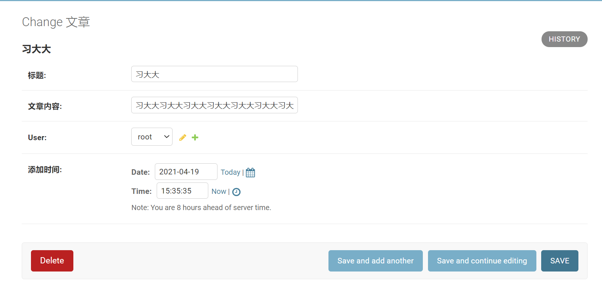
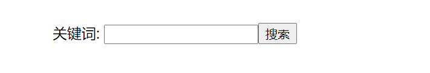
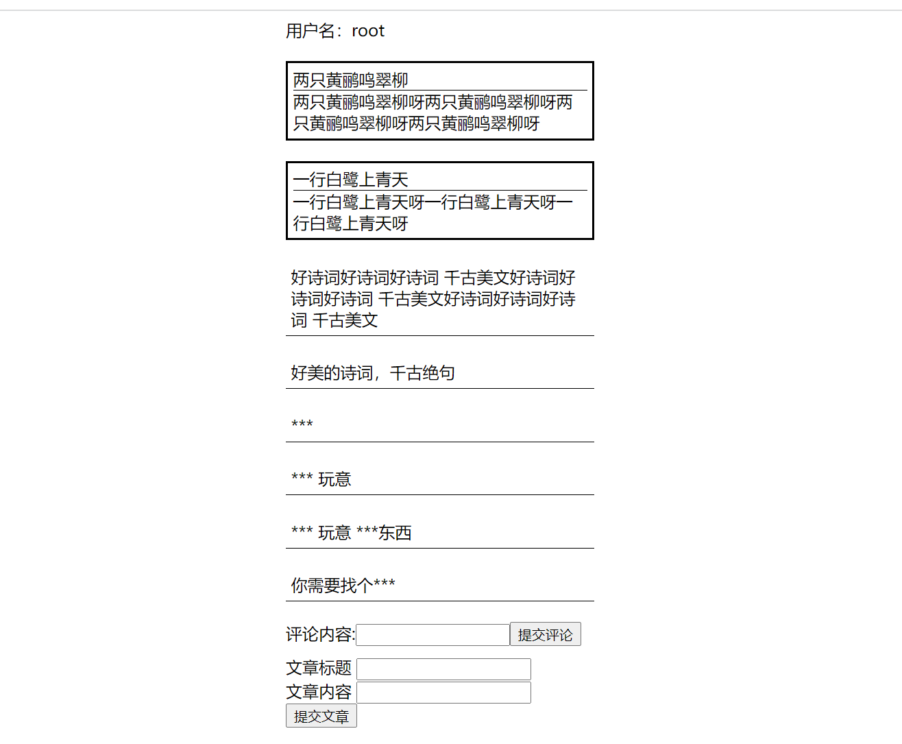

.. contents::
   :depth: 3
..

违禁词自审查功能
================

常见的违禁词自审查功能分为两种：

-  一种是用户提交发表的内容，在经过网站的违禁词自审查检验时，发现内容中包含了一些违禁词之后，提示用户发表失败，并且提示用户内容中有哪些违禁词，要求用户修改内容，或者放弃发表。这种违禁词自审查功能大多用于长篇博客、影评、网络小说等篇幅较大的内容审查中。
-  另外一种则是比较适合评论、发帖子、公屏交流等内容篇幅比较小的应用场景，这种违禁词自审查功能会将检测到的违禁词自动替换为*号。

1. 违禁词自审查功能的重要性
---------------------------

1.1 违禁词的影响
~~~~~~~~~~~~~~~~

从产品角度上看，一个互联网平台一旦没有违禁词自审查功能，用户之间很容易因为一点口角，演变成性质非常恶劣的骂战，从而令整个平台的内容质量下降。内容质量降低，必将导致大批用户的流失。

而违禁词自审查功能，将用户之间因为口角而发出的一些过激词汇隐藏，可以有效地减弱用户的负面情绪，也消除了个别用户之间的矛盾对其他用户的影响。

1.2 可以避免法律风险
~~~~~~~~~~~~~~~~~~~~

众所周知，《广告法》是为了保护广大消费者不被黑心商家蒙骗的一部法律，而且《广告法》不但保护消费者，也保护守法商家不被恶意竞争所攻击。《广告法》规定，广告中不得出现有可能对消费者产生误导的词汇。互联网本身也具有媒体属性，很多文章看起来是一篇博客，其实是一篇软文广告，如果没有违禁词自审查功能，经过辛苦经营获取大量用户的网络，可就要成为某些商家打广告的地方。而广告的内容泛滥，质量参差不齐，身为平台的搭建方，如果不做好内容审查的工作，将面临巨大的法律风险。

2. Django REST framework实现模糊搜索功能
----------------------------------------

模糊搜索，顾名思义是用于网站内部的搜索。

2.1 演示实现模糊搜索的后端逻辑
~~~~~~~~~~~~~~~~~~~~~~~~~~~~~~

我们先建立一个Django项目负责实现模糊搜索功能的后端逻辑。新建Django项目，并且安装相关依赖包，编写相关基础代码，步骤如下所述。

（1）新建Django项目，命名为demo7，新建App并命名为app01。

（2）安装Django REST framework及其依赖包markdown和Django-filter。

::

   pip install djangorestframework markdown Django-filter

（3）在settings.py中添加注册代码：

::

   INSTALLED_APPS = [
       'django.contrib.admin',
       'django.contrib.auth',
       'django.contrib.contenttypes',
       'django.contrib.sessions',
       'django.contrib.messages',
       'django.contrib.staticfiles',
       'app01.apps.App01Config',
       'rest_framework',
   ]

（4）执行数据更新命令：

::

   python manage.py makemigrations

   python manage.py migrate

（5）在app01/models.py内新建表类代码

::

   from django.db import models
   from django.contrib.auth.models import AbstractUser
   from datetime import datetime

   # Create your models here.

   class UserProfile(AbstractUser):
       """
       用户表
       """

       user_type_chioces = (
           (1, "普通用户"),
           (2, "版主"),
           (3, "管理员"),
       )

       level = models.IntegerField(choices=user_type_chioces, default=1)
       add_time = models.DateTimeField(default=datetime.now, verbose_name='添加时间')

       class Meta:
           verbose_name = '用户'
           verbose_name_plural = verbose_name

           def __str__(self):
               return self.username

   class Article(models.Model):
       """
       文章表
       """

       title = models.CharField(max_length=30, verbose_name='标题')
       content = models.CharField(max_length=5000, verbose_name='文章内容')
       user = models.ForeignKey(UserProfile, on_delete=models.CASCADE)
       add_time = models.DateTimeField(default=datetime.now, verbose_name='添加时间')

       class Meta:
           verbose_name = '文章'
           verbose_name_plural = verbose_name

       def __str__(self):
           return self.title

（6）在settings中配置用户表的继承代码：

::

   AUTH_USER_MODEL='app01.UserProfile'

（7）再次执行数据更新命令：

::

   python manage.py makemigrations

   python manage.py migrate

（8）建立一个超级用户，用户名：root，密码：root1234

::

   python manage.py createsuperuser

（9）在app01/admin.py中注册表：

::

   from django.contrib import admin
   from .models import UserProfile, Article

   # Register your models here.
   admin.site.register(UserProfile)
   admin.site.register(Article)

（10）运行demo7项目，然后通过浏览器访问：
http://127.0.0.1:8080/admin/，输入用户名root，密码root1234，然后单击登录按钮，进入demo7的后台管理页面，

（11）在后台管理页面添加文章数据。在此处可多添加几篇文章记录如图

2.2 演示实现模糊搜索的前端逻辑
~~~~~~~~~~~~~~~~~~~~~~~~~~~~~~

接下来建立demo7_1来负责演示实现模糊搜索项目的前端部分。这部分同样需要安装一些依赖库，我们使用基于Vue前端框架来新建demo7_1，具体的步骤如下所述。

（1） 安装淘宝镜像：

::

   npm install –g cnpm –registry=HTTPS://registry.npm.taobao.org

..

   注意：
   在这里我们默认电脑中已经安装了Node.js。淘宝镜像是为了让下载依赖包的速度更快一些，如果网络状况好，可以忽略这一步。

(2) 使用cnpm搭建Vue框架，安装Vue的脚手架工具：

::

   cnpm install –-global vue-cli

（3）创建项目demo7_1，并安装依赖

::

   vue init webpack-simple demo7_1
   cd demo7_1
   cnpm install

（4）在demo7_1/src/App.vue内修改原本的代码，进行初始化

::

   <template>
     

       

         关键词: <input type="text" v-model="keyword">
         <button @click="GetList()">搜索</button>
       

       

         

           
{{ item.title }}

           
{{ item.content }}

         

       

     

   </template>

   
   

（8）运行demo7_1，然后浏览器访问：
http://localhost:8080/网页初始页面只有搜索关键词的输入框。

-  此时关键词输入框内容为空，单击“搜索”按钮，返回了所有文章

-  搜索关键词“冰棍”，返回了文章中包含关键词“冰棍”的文章。

.. image:: ../../../_static/drf_vue2021112302.png

3.Django REST framework开发违禁词自审查功能
-------------------------------------------

3.1 开发违禁词自审查功能后端逻辑
~~~~~~~~~~~~~~~~~~~~~~~~~~~~~~~~

(1）新建Django项目demo7_2，新建App，命名为app01。

注意： 这里新建demo7_2的流程与上一节中新建demo7的流程是一样的。

(2）安装Django REST framework及其依赖包markdown和Django-filter。

::

   pip install djangorestframework markdown Django-filter

（3）在settings.py中添加注册代码

::

   INSTALLED_APPS = [
       'django.contrib.admin',
       'django.contrib.auth',
       'django.contrib.contenttypes',
       'django.contrib.sessions',
       'django.contrib.messages',
       'django.contrib.staticfiles',
       'app01.apps.App01Config',
       'rest_framework',
       ]

（4）在demo7_2/app01/models.py中新建表类：

::

   from django.db import models
   from django.contrib.auth.models import AbstractUser
   from datetime import datetime

   # Create your models here.
   class UserProfile(AbstractUser):
       """
       用户表
       """

       user_type_chioces = (
           (1, "普通用户"),
           (2, "版主"),
           (3, "管理员"),
       )

       level = models.IntegerField(choices=user_type_chioces, default=1)
       is_frozen = models.BooleanField(default=False, verbose_name='是否被冻结')
       add_time = models.DateTimeField(default=datetime.now, verbose_name='添加时间')

       class Meta:
           verbose_name = '用户'
           verbose_name_plural = verbose_name

       def __str__(self):
           return self.username

   class Article(models.Model):
       """
       文章表
       """
       title = models.CharField(max_length=30, verbose_name='标题')
       content = models.CharField(max_length=5000, verbose_name='文章内容')
       user = models.ForeignKey(UserProfile, on_delete=models.CASCADE)
       add_time = models.DateTimeField(default=datetime.now, verbose_name='添加时间')

       class Meta:
           verbose_name = '文章'
           verbose_name_plural = verbose_name

       def __str__(self):
           return self.title

   class Comment(models.Model):
       """
       评论表
       """

       user = models.ForeignKey(UserProfile, on_delete=models.CASCADE)
       article = models.ForeignKey(Article, on_delete=models.CASCADE)
       content = models.CharField(max_length=150, verbose_name='评论内容')
       add_time = models.DateTimeField(default=datetime.now, verbose_name=' 添加时间')

       class Meta:
           verbose_name = "评论"
           verbose_name_plural = verbose_name

       def __str__(self):
           return self.content

   class Card(models.Model):
       """
       违禁词库
       """
       word = models.CharField(max_length=150, verbose_name="违禁词")
       add_time = models.DateTimeField(default=datetime.now, verbose_name="添加时间")

       class Meta:
           verbose_name = "违禁词"
           verbose_name_plural = verbose_name

       def __str__(self):
           return self.word

（5）在settings中配置用户表的继承代码：

::

   # 配置用户表的继承
   AUTH_USER_MODEL = 'app01.UserProfile'

（6）再次执行数据更新命令：

::

   python manage.py makemigrations
   python manage.py migrate

（7）建立一个超级用户，用户名：root，密码：root1234。

::

   python manage.py createsuperuser

   Username: root
   ...

（8）在app01/admin.py中注册表：

::

   from django.contrib import admin
   from .models import UserProfile, Article, Comment, Card

   # Register your models here.
   admin.site.register(UserProfile)
   admin.site.register(Article)
   admin.site.register(Comment)
   admin.site.register(Card)

3.2 创建新用户
~~~~~~~~~~~~~~

我们在上一节创建了超级用户root，下面运行demo7_2项目，然后使用浏览器访问http://127.0.0.1:8080/admin，在登录页面输入用户名root，密码root1234

新建超级用户，用户名：admin，密码：root4321。

这时，重启demo7_2项目，在浏览器端访问：
http://127.0.0.1:8080/admin,使用我们新注册的用户名和密码进行登录。显示登录成功

::

   python manage.py createsuperuser
   Username: admin

3.3 开发违禁词自审查功能前端逻辑
~~~~~~~~~~~~~~~~~~~~~~~~~~~~~~~~

接下来新建一个前端项目demo7_3，负责违禁词自审查功能的前端逻辑部分。使用Vue框架作为前端项目的开发环境，并且开发从前端向后端提交文章和提交文章评论两个功能，步骤如下所述。

（1）搭建Vue开发环境，安装Vue的脚手架工具：

::

   # 安装淘宝npm
   npm install -g cnpm --registry=https://registry.npm.taobao.org
   # vue-cli 安装依赖包
   cnpm install --g vue-cli

（2）创建项目demo7_3：

::

   vue init webpack-simple demo7_3cd demo7_3cnpm install

（3）在demo7_3/src/App.vue中初始化代码：

::

   <template>
     

       

         用户名：{{ username }}
       

       

         <input type="text" v-model.lazy="username">
         <button @click="Login()">登录</button>
       

       

         
{{ item.title }}

         
{{ item.content }}

       

       

         
{{ item.content }}

       

       

         评论内容:<input type="text" v-model="pushcommet">
         <button @click="PushComment()">提交评论</button>
       

       

         
文章标题 <input type="text" v-model="title">

         
文章内容 <input type="text" v-model="content">

         <button @click="PushArticle()">提交文章</button>
       

     

   </template>
   
   

（4）运行demo7_3：

::

   npm run dev

然后用浏览器访问 http://localhost:8081

3.4 违禁词自审查功能开发
~~~~~~~~~~~~~~~~~~~~~~~~

（1）我们先在文章表内填入两条文章记录。

（2）在demo7_2/app01/下新建序列化模块文件serializers.py

::

   from rest_framework import serializers
   # 引入用户表、文章表、评论表、关键词表
   from .models import UserProfile, Article, Comment, Card

   class UserProfileSerializer(serializers.ModelSerializer):
       """
       序列化用户表
       """

       class Meta:
           model = UserProfile
           fields = "__all__"

   class CommentSerializer(serializers.ModelSerializer):
       """
       序列化评论表
       """

       class Meta:
           model = Comment
           fields = "__all__"

   class ArticleSerializer(serializers.ModelSerializer):
       """
       序列化文章表
       """

       class Meta:
           model = Article
           fields = "__all__"

   class CardSerializer(serializers.ModelSerializer):
       """
       序列化违禁词表
       """

       class Meta:
           model = Card
           fields = "__all__"

(3) 在demo7_2/app01/views.py内编写视图逻辑

::

   from django.shortcuts import render, HttpResponse
   from rest_framework.views import APIView
   from .models import UserProfile, Article, Comment, Card
   from .serializers import UserProfileSerializer, ArticleSerializer, CommentSerializer, CardSerializer
   from rest_framework.response import Response
   from rest_framework.renderers import JSONRenderer, BrowsableAPIRenderer

   # Create your views here.
   class GetArticleView(APIView):
       """
       获取所有文章
       """
       renderer_classes = [JSONRenderer]  # 渲染器

       def get(self, request):
           article_list = Article.objects.all()
           re = ArticleSerializer(article_list, many=True)
           return Response(re.data)

   class GetCommentView(APIView):
       """
       获取所有评论
       """
       renderer_classes = [JSONRenderer]  # 渲染器

       def get(self, request):
           Comment_list = Comment.objects.all()
           re = CommentSerializer(Comment_list, many=True)
           return Response(re.data)

   # 只是演示登录视图，并非实项目中可以使用的登录逻辑
   class LoginView(APIView):
       """
       演示登录
       """
       renderer_classes = [JSONRenderer]  # 渲染器

       def get(self, request):
           username = request._request.GET.get('username')
           if username:
               user = UserProfile.objects.filter(username=username).first()
               if user:
                   re = UserProfileSerializer(user)
                   return Response(re.data)
               else:
                   return HttpResponse('404')
           else:
               return HttpResponse('404')

   class PushArticleView(APIView):
       """
       发表文章类
       """
       renderer_classes = [JSONRenderer]  # 渲染器

       def post(self, request):
           title = request._request.POST.get('title')
           content = request._request.POST.get('content')
           user_id = request._request.POST.get('id')
           # print(title,content)
           if title and content and user_id:
               all_card = Card.objects.all()
               err = []
               for i in all_card:
                   j = title.find(i.word)
                   if j != -1:
                       err.append(i)
                   k = content.find(i.word)
                   if k != -1:
                       err.append(i)
               if err:
                   re = CardSerializer(err, many=True)
                   return Response(re.data)
               article = Article()
               article.title = title
               article.content = content
               user = UserProfile.objects.filter(id=user_id).first()
               article.user = user
               article.save()
               return HttpResponse(200)
           else:
               return HttpResponse(404)

   class PushCommentView(APIView):
       """
       发表评论
       """
       renderer_classes = [JSONRenderer]  # 渲染器

       def post(self, request):
           comment = request._request.POST.get('comment')
           user_id = request._request.POST.get('id')
           # print(comment,user_id)
           if comment and user_id:
               all_card = Card.objects.all()
               for i in all_card:
                   comment = comment.replace(i.word, "***")
               newcomment = Comment()
               newcomment.content = comment
               user = UserProfile.objects.filter(id=user_id).first()
               newcomment.user = user
               # 为了简化与本节知识点无关的内容，给评论的文章一个默认值
               article = Article.objects.filter(id=1).first()
               newcomment.article = article
               newcomment.save()
               return HttpResponse(200)
           else:
               return HttpResponse(404)

(4) 在demo7_2/urls.py中配置路由代码：

::

   from django.contrib import admin
   from django.urls import path
   # 引入获取文章列表视图类，获取评论视图类
   from app01.views import GetArticleView, GetCommentView
   # 引入获取登录视图类，获取发表文章视图类，发表评论视图类
   from app01.views import LoginView, PushArticleView, PushCommentView

   urlpatterns = [
       path('admin/', admin.site.urls),
       path('login/', LoginView.as_view(), name='login'),
       path('getarticle/', GetArticleView.as_view(), name='getarticle'),
       path('getcomment/', GetCommentView.as_view(), name='getcomment'),
       path('pusharticle/', PushArticleView.as_view(), name='pusharticle'),
       path('pushcomment/', PushCommentView.as_view(), name='pushcomment')
   ]

(5) 简单处理一下跨域，安装跨域模块：

::

   pip install Django-cors-headers

在settings.py中的INSTALLED_APPS中追加注册代码：

::

   INSTALLED_APPS = [
   ........
       'rest_framework',
       'corsheaders'
   ]

在settings.py中的MIDDLEWARE_CLASSES添加中间件代码：

::

   MIDDLEWARE = [
       # 引入跨域中间件，并放到首位
       'corsheaders.middleware.CorsMiddleware',
       ......
    ]

在settings.py中新增配置项，即可解决本项目中的跨域问题。

::

   CORS_ORIGIN_ALLOW_ALL = True

( 6）因为涉及post提交，将settings.py中验证csrf_token的中间件关掉：

::

   MIDDLEWARE = [
        ........
       # 注释掉验证csrf_token的中间件
       # 'django.middleware.csrf.CsrfViewMiddleware',
       'django.contrib.auth.middleware.AuthenticationMiddleware',
   ]

（7）在demo7_3内安装axios：

::

   cnpm install axios –save

（8）编写demo7_3/src/App.vue逻辑代码：

::

   <template>
     

       

         用户名：{{ username }}
       

       

         <input type="text" v-model.lazy="username">
         <button @click="Login()">登录</button>
       

       

         
{{ item.title }}

         
{{ item.content }}

       

       

         
{{ item.content }}

       

       

         评论内容:<input type="text" v-model="pushcommet">
         <button @click="PushComment()">提交评论</button>
       

       

         
文章标题 <input type="text" v-model="title">

         
文章内容 <input type="text" v-model="content">

         <button @click="PushArticle()">提交文章</button>
       

     

   </template>
   
   

（9）运行demo7_3

::

   npm run dev

然后用浏览器访问：
http://localhost:8081/，显示如图所示的页面，是未登录的状态。

输入用户名root，然后单击“登录”按钮，在页面上方即显示用户名为root，此时提醒登录的相关标签消失，

