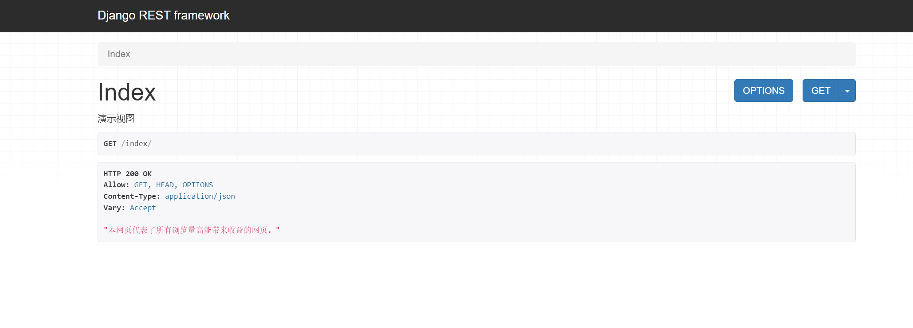
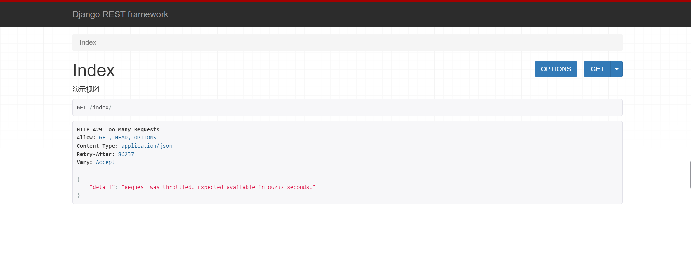

# 分析吾爱破解论坛反爬虫机制


## 1.常见的反爬虫手段


### 1.1 编写Robots协议

如果网站没有Robots协议，网站中有价值的数据被爬虫搬空，网站方想要通过法律维权，将非常艰难，因为网站中没有Robots协议，代表该网站的数据资源是共享的。只要网站对用户开放服务，网站想要通过技术手段彻底将网络爬虫挡在门外，几乎是不可能的。所以，作为一个反爬虫工程师一定要编写网站的Robots协议


### 1.2 限制协议头

限制协议头，是指网络请求在到达后端的时候，服务器程序先对网络请求的协议头内的某个键值进行验证（大多数情况是对User-Agent进行验证），如果与正常用户通过浏览器或者客户端访问所携带的协议头一致，就可以通过验证，否则，将拒绝此网络请求。


### 1.3 限制Cookie或限制Token

crsf_token机制即防止跨站攻击机制，属于网站安全的一个机制，许多通过Cookie进行防爬虫设计的手段，都是基于crsf_token机制的原理。

某平台的反爬虫机制如下：

（1）监测协议头中的User-agent，查看客户端的设备。

（2）用户进入App时，向服务器请求首页数据的同时，返回一条Cookie。

（3）当用户访问某本小说的章节时，向服务器请求章节页数据的同时，携带Cookie信息。后端对Cookie进行验证，如果与第一步set-Cookie的值匹配，则证明是用户在操作，如果不匹配，则判定为爬虫操作。

如此看来，某平台反爬虫工程师的设计，与crsf_token的原理如出一辙。只不过crsf_token是在第二步只对以post方式向后端提交数据的网络请求进行验证。

在此提醒各位开发者：代码千万条，守法第一条。刷新阅读量是不正当的竞争行为，希望大家不要去尝试。我们应将技术用于防范，而不是以侵犯他的人利益为目的而走捷径。

（4）对访问者IP的访问频率进行限制。

（5）对访问异常者弹出验证码，要求用户识别验证码。但是，从产品的角度来说，让用户识别填写验证码，已经影响到用户体验了，笔者并不推荐用在反爬虫的机制中。


## 2.吾爱破解论坛怎样反爬虫

### 2.1 注册阶段的反爬虫

吾爱破解论坛的注册，要求有注册码，如果想要获取注册码，则需要花19元人民币进行购买。当然，收费获取注册码只是一种反爬虫批量注册用户账号的一种手段，并不是必须要购买注册码才能注册成为论坛的用户。

之所以设置这种注册用户需要注册码的机制，是为了灵活地掌握开放注册的时间，从而防止恶意注册。

吾爱破解论坛会不定期地开放注册时间，在开放注册的时间段内，注册成为论坛的用户是不需要注册码的，因而大多数的论坛用户，都是在开放注册时间段内完成注册的。

编写一个网络爬虫，从抓包到分析数据的加密算法，再到编写代码，然后经过几番测试，修改代码，最后完成爬虫项目，至少需要一整天的时间。但吾爱破解论坛每一次开放注册的时间，都控制在几个小时，下一次再开放注册，就不知道是什么时候了，并且很有可能已经换了一套新的加密算法了。


### 2.2 登录阶段的反爬虫

吾爱破解论坛在登录阶段的反爬虫机制，可以分为两部分来分析，

- 提交用户名和密码之前

> 滑块验证码，需要用户通过鼠标手动将滑块按照提示，拖曳到最右边。当用户将滑块拖曳到最右边后，会显示字母验证码

一个好的验证码，应该秉持着一个原则：真人识别越容易越好，机器识别越困难越好，在机器与人的识别难度之间找到一个平衡点，最好是人一看就一目了然，机器分析却无法识别。

举一个比较优秀的图片验证码的例子。比如2017年谷歌应用商店的一组图片验证码，图片内是一张马路上的街拍照，要求用户用鼠标单击图片中的垃圾桶。这对于人来说是一目了然的，但是对于机器而言，就比较困难了。


- 提交用户名和密码之后

> 当用户输入用户名和密码，在单击“登录”按钮以后，网页端的代码逻辑并没有直接将登录相关数据发送给网站的后端服务器，而是在这之前先执行了一个给密码进行加密的步骤。

这样做的意义是什么呢？其实可以想象一下，当恶意注册的网络爬虫，批量注册了论坛的用户账号，同时对接打码平台，攻破了验证码的关卡时，那么这一道给密码加密的措施就开始起作用了。假设网络爬虫的开发者不知道加密算法是什么，即使他掌握着大量的论坛账号和密码，依然无法通过使用网络爬虫完成对这些账号的批量登录。


### 2.3 搜索阶段的反爬虫

对同一个IP的访问进行了频率限制，如果爬虫工程师想要突破这个限制，必须要进行VPS拨号换IP或者IP代理才可以。


## 3. Django REST framework实现频率限制

除了在注册阶段和登录阶段的反爬虫机制，对访问网站的频率限制也是一个主要的反爬虫机制。

### 3.1 建立演示频率限制功能的项目


（1）新建Django项目，命名为demo8，新建App命名为app01


（2）在templates目录下新建HTML文件index.html。

```
<!DOCTYPE html>
<html lang="en">
<head>
    <meta charset="UTF-8">
    <title>Title</title>
</head>
<body>
<h4>小说章节内容页、视频播放页、博客访问页、网页广告页……</h4>

<h4>本网页代表了所有浏览量高能带来收益的网页。</h4>

</body>
</html>
```


（3）安装Django REST framework及其依赖包：

```
pip install djangorestframework markdown Django-filter -i "https://pypi.doubanio.com/simple/"
```


（4）在settings.py中添加注册代码：

```
INSTALLED_APPS = [
    'django.contrib.admin',
    'django.contrib.auth',
    'django.contrib.contenttypes',
    'django.contrib.sessions',
    'django.contrib.messages',
    'django.contrib.staticfiles',
    'app01.apps.App01Config',
    'rest_framework'
]
```

（5）执行数据更新命令：

```
python manage.py makemigrations
python manage.py migrate
```

（6）在app01.views.py中编写视图代码：

```python
from django.shortcuts import render
from rest_framework.views import APIView
# Create your views here.
class IndexView(APIView):
    """
    演示视图
    """
    def get(self,request):
        return render(request,'index.html')

```

（7）在urls.py内设置路由代码：

```python
from django.contrib import admin
from django.urls import path
from app01.views import IndexView
urlpatterns = [
    path('admin/', admin.site.urls),
    path('index/',IndexView.as_view(),name='index'),
]
```

（8）运行demo8，然后使用浏览器访问[http://127.0.0.1:8000/index/ ](http://127.0.0.1:8000/index/)


### 3.2 网页客户端向服务端提交了多少信息

用户通过网络请求所传到服务器的信息都封装在request.META中，我们可以改造一下视图类IndexView，查看这些信息。

将views.py中的IndexView类改写如下:

```python
class IndexView(APIView):
    """
    演示视图
    """
    def get(self,request):
        j=0
        for i in request.META:
            print(i,":",request.META[i])
            j+=1
        print("共",j,"条信息")
        return render(request,'index.html')
```

然后重启demo8项目，在浏览器端刷新访问http://127.0.0.1:8000/index/

在Pycharm中可以直接查看到后端打印的内容


### 3.3 频率限制功能开发

（1）在settings.py中增加频率限制的配置代码：

```
REST_FRAMEWORK = {
    'DEFAULT_THROTTLE_CLASSES': (
        # AnonRateThrottle是对未登录用户的网络访问进行频率限制，判断是否为同一个用户的依据是访问用户的IP地址
        'rest_framework.throttling.AnonRateThrottle',
        # UserRateThrottle是对已登录用户的网络访问进行频率限制，判断是否为同一个用户的依据是用户的身份验证
        'rest_framework.throttling.UserRateThrottle'
    ),
    'DEFAULT_THROTTLE_RATES': {
        'anon': '2/day',
        'user': '1000/day'
    }
}
```


可以看到代码中有两种频率限制的配置AnonRateThrottle和UserRateThrottle。

- AnonRateThrottle是对未登录用户的网络访问进行频率限制，判断是否为同一个用户的依据是访问用户的IP地址。

- UserRateThrottle是对已登录用户的网络访问进行频率限制，判断是否为同一个用户的依据是用户的身份验证。


我们选择使用的是对未登录用户的网络访问进行频率限制的

AnonRateThrottle。在DEFAULT_THROTTLE_RATES中，配置的是对频率限制的具体限制要求，其中，anon代表的是对未登录用户的频率限制，限制为每天最多访问两次（当然，这是为测试才如此设置）。


对于频率限制的单位，Django REST framework给出了`second`、`minute`、`hour`和`day`4个选择。


（2）改造views.py中的IndexView，引入频率限制模块：

```
from django.shortcuts import render
from rest_framework.views import APIView
from rest_framework.response import Response
from rest_framework.throttling import AnonRateThrottle


# Create your views here.

class IndexView(APIView):
    """
    演示视图
    """

    throttle_classes = (AnonRateThrottle,)

    def get(self, request):
        return Response('本网页代表了所有浏览量高能带来收益的网页。')
```

（3）重启demo8，浏览器访问http://127.0.0.1:8000/index/

然后刷新浏览器两次



连续刷新10次之后



提示访问被限制，需要86369秒以后才可以再次访问。至此，我们的频率限制功能开发成功了。


### 3.4 频率限制该怎样确定

以一个小说网站为例，假设一个用户看小说的速度极限为2秒钟看一章，那么设置访问频率为：

```
'anon': '30/ minute ',
```

对未登录用户的频率限制，是以用户的IP地址来判断用户身份的，所以网站程序默认一个IP地址代表一个用户。但事实并非如此，如果一个WiFi环境下有10个用户，那么这10个用户是同一个IP地址，如图8-27所示。我们可以假设最多每30个客户端连接同一个路由器的WiFi网络，所以，将小说网站的访问频率设置为900/minute更加合理。所以，我们在设定未登录用户的访问频率时，一定要考虑到同一网络下的用户数量。

