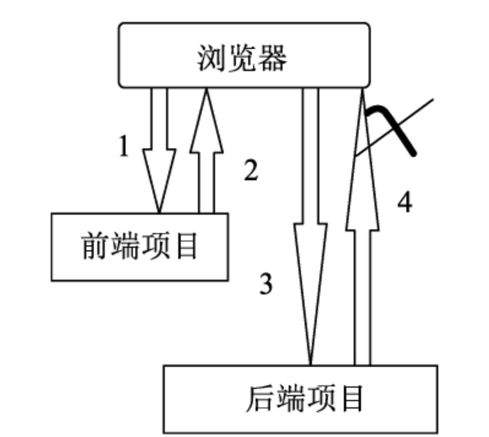
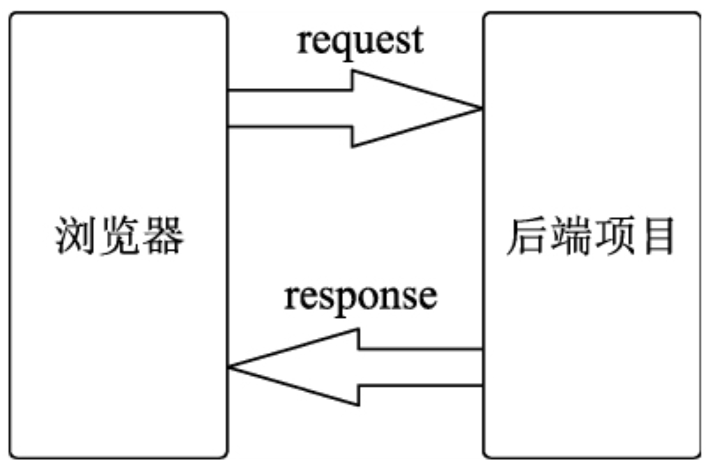
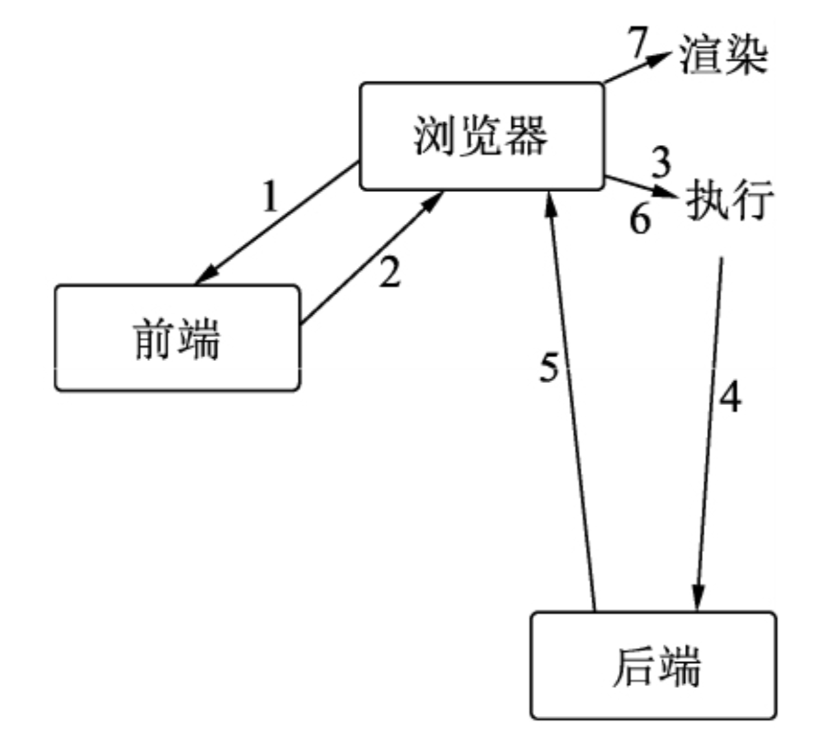
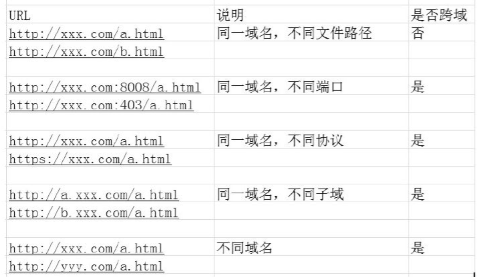
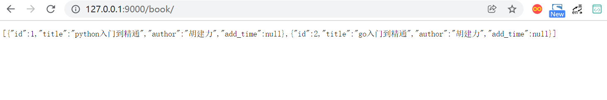

# 关于跨域问题的解决办法


## 1.什么是跨域

### 1.1 浏览器的同源策略

- 同源策略问题的出现原理



- 传统网络请求模型




- 前后端分离项目之后的网络传输流程。



（1）在浏览器端通过URL访问前端项目。

（2）前端项目返回数据。

（3）浏览器开始对前端返回的数据进行解析，对数据中包含的样式进行渲染，对数据中包含的逻辑代码进行执行。

（4）这时，在这些逻辑代码中，有一条命令，让浏览器端向后端项目的URL地址发送数据请求。

（5）浏览器执行这条命令，向后端发起了数据请求。

（6）后端项目向浏览器端返回请求的数据。

（7）浏览器端会对此数据进行解析，发现这些数据的来源与第（1）步中的URL不一样，于是拒绝对这些数据做进一步的执行与渲染，然后报出跨域问题的错误提示。

如果没有同源策略，会存在安全问题。假如用户的电脑遭遇病毒攻击，病毒的功能是用户只要通过浏览器访问网站A，就会在浏览器解析从网站A返回的数据之前，将让浏览器访问其他的非法网站B的命令塞进这些数据里，这样非法网站B就会获取用户在网站A的Cookie。

这个时候，非法网站B只要带着用户的Cookie访问网站A，就可以用户的身份，在网站A中进行操作了。如果网站A是购物网站，相对比较安全，毕竟在完成支付的时候，还需要进行手机验证码操作；假如网站A是一家网络借贷公司的网站后果不堪设想。所以，浏览器的同源策略非常重要。


### 1.2 什么情况下会发生跨域问题




## 2.跨域问题的几种解决思路

### 2.1 通过jsonp跨域

原理：<srcipt>标签不受浏览器同源策略限制。比如在线引用jQuery，其实也是一种跨域的实现：

```
<script src="http://code.jquery.com/jquery-latest.js"></script>
```


将src对应的网址替换为后端项目的网址，即可实现前后端分离项目开发者想要达到的效果。

注意： jsonp有很大的一个局限性，就是只能实现get请求。


### 2.2 document.domain+iframe跨域

原理：不同域指向的两个页面，都通过JS强制设置document.domain为基础主域，就可以实现同域。


### 2.3 CORS（跨域资源共享）

通过在服务端设置Access-Control-Allow-Origin即可解决跨域问题，前端无需设置。此方案目前是主流的跨域问题解决方案。

CORS（Cross-origin resource sharing跨域资源共享），是一个W3C标准。

CORS的原理是只需要向响应头header中注入Access-Control-Allow-Origin，浏览器检测到header中的Access-Control-Allow-Origin，就可以跨域操作了。

CORS允许浏览器向跨源服务器发出XMLHttpRequest请求，从而克服AJAX只能同源使用的限制。


### 2.4 Nginx代理跨域

（1）Nginx配置解决iconfont跨域。

浏览器跨域访问JS、CSS和Img等常规静态资源被同源策略许可，但iconfont字体文件（eot/otf/ttf/woff/svg）例外，此时可在Nginx的静态资源服务器中加入以下配置：

```
location / {
  add_header Access-Control-Allow-Origin *;
  }
```

（2）Nginx反向代理。

原理：通过Nginx配置一个代理服务器（域名与domain1相同，端口不同）做跳板机，反向代理访问domain2接口。

服务器端调用HTTP接口只是使用HTTP协议，不会执行JS脚本，因为不需要同源策略，也就不存在跨越问题。


通过这些解决方案可以总结出一个规律，那就是所有的解决方案，基本上都在绕开一件事儿，那就是尽量绕开JS脚本中与网络请求有关的命令。

浏览器对于JS脚本做网络请求的限制非常大，在浏览器中运行的JS脚本也因此不可以作为网络爬虫来运行，因为浏览器中运行的JS脚本在发送网络请求时，是不允许自定义协议头的。


## 3.创建后端项目

（1）我们新建Django项目命名为demo9，同时新建App，命名为app01。

（2）在app01/models.py中新建一个书籍类：

```python
from django.db import models
from datetime import datetime
# Create your models here.


class Book(models.Model):
    """
    书籍
    """
    title = models.CharField(max_length=32, verbose_name='书名')
    author = models.CharField(max_length=10, verbose_name='作者名')
    add_time = models.DateTimeField(default=datetime.now, verbose_name='添加时间')

    class Meta:
        verbose_name = '书籍表'
        db_table = "book"
        verbose_name_plural = verbose_name

    def __str__(self):
        return self.title
```

（3）执行数据更新命令：

```
python manage.py makemigrations
python manage.py migrate
```

（4）在书籍表格内输入两条书籍记录。


（5）安装Django REST framework及其依赖包markdown和django-filter。

```
pip install djangorestframework markdown Django-filter -i "https://pypi.doubanio.com/simple/"
```


（6）在settings.py中添加注册app01和rest_framework的代码：

```
INSTALLED_APPS = [
    'django.contrib.admin',
    'django.contrib.auth',
    'django.contrib.contenttypes',
    'django.contrib.sessions',
    'django.contrib.messages',
    'django.contrib.staticfiles',
    'app01.apps.App01Config',
    'rest_framework'
]
```


（7）在demo9/app01/views.py中编写视图函数：

```
from django.shortcuts import render
from .models import Book
from .serializers import BookSerializer
from rest_framework.views import APIView
from rest_framework.response import Response
from rest_framework.renderers import JSONRenderer, BrowsableAPIRenderer


# Create your views here.

class BookView(APIView):
    """
    书籍列表
    """

    renderer_classes = [JSONRenderer]  # 渲染器

    def get(self, request):
        book_list = Book.objects.all()
        re = BookSerializer(book_list, many=True)
        return Response(re.data)
```

在demo9/app01/serializers.py中编写序列化器：

```
from rest_framework import serializers
from .models import Book


class BookSerializer(serializers.ModelSerializer):
    class Meta:
        model = Book
        fields = "__all__"
```


（8）在demo9/urls.py中配置路由代码：

```
from django.contrib import admin
from django.urls import path
from app01.views import BookView

urlpatterns = [
    path('admin/', admin.site.urls),
    path('book/', BookView.as_view(), name='book'),
]
```

（9）运行项目demo9，然后通过浏览器访问 http://127.0.0.1:9000/book/.获得了书籍列表的数据。





## 4.前端项目解决跨域问题

### 4.1 webpack与webpack-simple的区别

如果涉及的前后端分离项目业务需求比较简单，可以选择使用webpack-simple建立前端项目。

**一般情况下，在实际生产项目中，大多数的情况，如果前端项目是基于Vue的，那么会选择使用webpack建立前端项目。**


（1）新建时，Webpack和Webpack-Simple安装依赖库的方式不同。

```
#设置淘宝镜像源
npm config set registry https://registry.npm.taobao.org

# 查看npm源
npm config get registry

#需要换回时改为官方的镜像源
npm config set registry https://registry.npmjs.org


# 安装淘宝npm
npm install -g cnpm --registry=https://registry.npm.taobao.org
# vue-cli 安装依赖包
cnpm install --g vue-cli
```


使用webpack-simple新建Vue项目demo9_1：

```
cnpm install –global vue-cli
vue init webpack-simple demo9_1
cd demo9_1
cnpm install
```

> 注意： 我们默认电脑里已经安装了Node.js和淘宝镜像。


使用webpack新建Vue项目demo9_2：

```
cnpm install –global vue-cli
vue init webpack demo9_2
? Project name demo9_2
? Project description A Vue.js project
? Author 建力 <1879324764@qq.com>
? Vue build standalone
? Install vue-router? Yes
? Use ESLint to lint your code? No
? Set up unit tests Yes
? Pick a test runner jest
? Setup e2e tests with Nightwatch? Yes
? Should we run `npm install` for you after the project has been created? (recommended) yarn

   vue-cli · Generated "demo9_2".
   
cd demo9_2
cnpm install
```


（2）目录结构不同。

Webpack-Simple目录结构

```
 D:\Django_drf\demo9_1 的目录

2022/02/22  14:08    <DIR>          .
2022/02/22  14:08    <DIR>          ..
2022/02/22  13:56                72 .babelrc
2022/02/22  13:56               147 .editorconfig
2022/02/22  13:56               127 .gitignore
2022/02/22  13:56               201 index.html
2022/02/22  14:00    <DIR>          node_modules
2022/02/22  13:56               837 package.json
2022/02/22  13:56               322 README.md
2022/02/22  13:56    <DIR>          src
2022/02/22  13:56             1,600 webpack.config.js
```


Webpack目录结构

```
 D:\Django_drf\demo9_2 的目录

2022/02/22  14:16    <DIR>          .
2022/02/22  14:16    <DIR>          ..
2022/02/22  14:13               402 .babelrc
2022/02/22  14:13               147 .editorconfig
2022/02/22  14:13               213 .gitignore
2022/02/22  14:13               246 .postcssrc.js
2022/02/22  14:13    <DIR>          build
2022/02/22  14:13    <DIR>          config
2022/02/22  14:13               269 index.html
2022/02/22  14:16    <DIR>          node_modules
2022/02/22  14:13             2,292 package.json
2022/02/22  14:13               550 README.md
2022/02/22  14:13    <DIR>          src
2022/02/22  14:13    <DIR>          static
2022/02/22  14:13    <DIR>          test
2022/02/22  14:16           437,517 yarn.lock
```


如果在实际操作中就能感受到，这个执行过程是非常慢的。这是因为webpack与webpack-simple安装依赖包的顺序是不一样的，

webpack-simple是先新建项目，然后由用户手动进入项目目录，可以选择是使用npm还是使用cnpm安装依赖包，我们选择了cnpm。

而webpack则是在新建项目的时候，就开始安装依赖包，并且默认是以npm安装依赖包，速度极慢。


（3）解决跨域的难易程度不同。

解决跨域的难易程度不同，是webpack和webpack-simple的主要区别。

在webpack的项目中，有config目录，该目录下有index.js文件，在这个文件内，进行简单的配置就可以解决跨域问题；而使用webpack-simple新建的项目，则没有这个目录，也没有这个文件。


> 注意： 虽然使用webpack新建的项目可以通过修改index.js文件中的一些配置代码轻松地解决跨域问题，而使用webpack-simple新建的项目没有这个文件，
>
> 这并不是说，使用webpack-simple新建的项目就不可以在前端项目内解决跨域问题，只是解决方法的操作更麻烦一些。


### 4.2 在前端项目中解决跨域问题

从前端项目中解决跨域问题，首先在index.js中做相关配置，然后向后端发送数据请求，这样获取到的数据就可以避免跨域问题了。具体的操作步骤如下：


vue2中配置：

（1）打开demo9_2/config/index.js，然后在proxyTable中添加代码：

```
    proxyTable: {
      '/api': { //替换代理地址名称
        target: 'http://127.0.0.1:9000/', //代理地址
        changeOrigin: true, //可否跨域
        pathRewrite: {
          '^/api': '' //重写接口，去掉/api
        }
      }
    },
```


vue3中配置：

`vue.config.js`

```
module.exports = {
    devServer: {
        open: true,
        host: 'localhost',
        port: 8080,
        https: false,
        //以上的ip和端口是我们本机的;下面为需要跨域的
        proxy: {  //配置跨域
            '/api': {
                target: 'http://127.0.0.1:8088/api',  //这里后台的地址模拟的;应该填写你们真实的后台接口
                ws: true,
                changOrigin: true,  //允许跨域
                pathRewrite: {
                    '^/api': ''  //请求的时候使用这个api就可以
                }
            }
        }
    }
}
```

（2）在demo9_2中安装axios模块：

```
cnpm install axios --save
```

（3）在demo9_2/src/App.vue中编写向后端请求数据的代码：

```
<template>
  <div id="app">
    
    <router-view/>
  </div>
</template>
<script>
//引入axios模块
import axios from 'axios'
export default {
  name: 'App',
  data(){
    return{
      msg:''
    }
  },
  methods:{
//向后端项目请求数据方法
    getData(){
      axios({
        url:'api/book/'
      }).then(res=>{
        console.log(res)
      })
    }
  },
  mounted(){
    this.getData()
  }
}
</script>
<style>
#app {
  font-family: 'Avenir', Helvetica, Arial, sans-serif;
  -webkit-font-smoothing: antialiased;
  -moz-osx-font-smoothing: grayscale;
  text-align: center;
  color: #2c3e50;
  margin-top: 60px;
}
</style>

```

启动demo9_2项目：

```
npm run dev
```


（4）至此，我们在前端就已经将跨域问题解决了。接下来验证是否已解决跨域问题。

然后使用浏览器访问：[http://127.0.0.1:8080/ ](http://127.0.0.1:8080/)。

（5）运行我们在本章新建的后端项目demo9。

（6）如下所示，在浏览器中按F12键，打开开发者模式。

在浏览器的Console面板中，收到了来自后端项目的数据：

```
{data: Array(2), status: 200, statusText: 'OK', headers: {…}, config: {…}, …}
config: {transitional: {…}, transformRequest: Array(1), transformResponse: Array(1), timeout: 0, adapter: ƒ, …}
data: Array(2)
0: {id: 1, title: 'python入门到精通', author: '胡建力', add_time: null}
1: {id: 2, title: 'go入门到精通', author: '胡建力', add_time: null}
length: 2
[[Prototype]]: Array(0)
headers: {allow: 'GET, HEAD, OPTIONS', connection: 'keep-alive', content-length: '153', content-type: 'application/json', cross-origin-opener-policy: 'same-origin', …}
request: XMLHttpRequest {onreadystatechange: null, readyState: 4, timeout: 0, withCredentials: false, upload: XMLHttpRequestUpload, …}
status: 200
statusText: "OK"
[[Prototype]]: Object
```


### 4.3 在后端项目中解决跨域问题

环境准备：

新建的另一个前端项目demo9_2，以及后端项目demo9

**在Django项目中，使用CORS（跨域资源共享）解决跨域问题非常方便。**


接下来就通过一个实例来演示如何使用CORS解决跨域问题。具体步骤如下：

（1）安装跨域模块：

```
pip install django-cors-headers -i "https://pypi.doubanio.com/simple/"
```

（2）在settings.py中注册模块：

```
INSTALLED_APPS = [
    'django.contrib.admin',
    'django.contrib.auth',
    'django.contrib.contenttypes',
    'django.contrib.sessions',
    'django.contrib.messages',
    'django.contrib.staticfiles',
    'app01.apps.App01Config',
    'rest_framework',
    'corsheaders'
]
```

（3）在settings.py中增加中间件的配置代码：

```
MIDDLEWARE = [
    'corsheaders.middleware.CorsMiddleware',                    # 放到中间件顶部
    'django.middleware.security.SecurityMiddleware',
    'django.contrib.sessions.middleware.SessionMiddleware',
    'django.middleware.common.CommonMiddleware',
    'django.middleware.csrf.CsrfViewMiddleware',
    'django.contrib.auth.middleware.AuthenticationMiddleware',
    'django.contrib.messages.middleware.MessageMiddleware',
    'django.middleware.clickjacking.XFrameOptionsMiddleware',
]
```

（4）在settings.py中新增配置项，即可解决本项目中的跨域问题。

```
CORS_ORIGIN_ALLOW_ALL = True
```

（5）重新运行demo9项目。

（6）在demo9_1中安装axios模块：

```
cnpm install axios --save
```

（7）在demo9_1/src/App.vue中编写向后端请求数据的代码：

```
<template>
  
  <HelloWorld msg="Welcome to Your Vue.js App"/>
</template>

<script>
//引入axios模块
import axios from 'axios'

export default {
  name: 'App',
  data() {
    return {
      msg: ''
    }
  },
  methods: {
//向后端发送数据请求
    getData() {
      axios({
        url: "http://127.0.0.1:9000/book/"
      }).then(res => {
        console.log(res)
      })
    }
  },
  mounted() {
    this.getData()
  }
}
</script>

<style>
#app {
  font-family: Avenir, Helvetica, Arial, sans-serif;
  -webkit-font-smoothing: antialiased;
  -moz-osx-font-smoothing: grayscale;
  text-align: center;
  color: #2c3e50;
  margin-top: 60px;
}
</style>
```

> 注意： `<script>`标签中的URL却是不同的，大家要注意不要与demo9_2混淆。

（8）运行demo9_1项目：

``` 
npm run dev
```

（9）使用浏览器访问：http://127.0.0.1:8080。


（10）如图9-24所示，按F12键，打开浏览器的开发者模式。可以看到Console控制台没有报错，而且获得了后端传来的数据：

```
{data: Array(2), status: 200, statusText: 'OK', headers: {…}, config: {…}, …}
config: {transitional: {…}, transformRequest: Array(1), transformResponse: Array(1), timeout: 0, adapter: ƒ, …}
data: Array(2)
0: {id: 1, title: 'python入门到精通', author: '胡建力', add_time: null}
1: {id: 2, title: 'go入门到精通', author: '胡建力', add_time: null}
length: 2
[[Prototype]]: Array(0)
headers: {content-length: '153', content-type: 'application/json'}
request: XMLHttpRequest {onreadystatechange: null, readyState: 4, timeout: 0, withCredentials: false, upload: XMLHttpRequestUpload, …}
status: 200
statusText: "OK"
[[Prototype]]: Object
```

至此，我们在后端项目中实现了解决跨域问题的功能。


