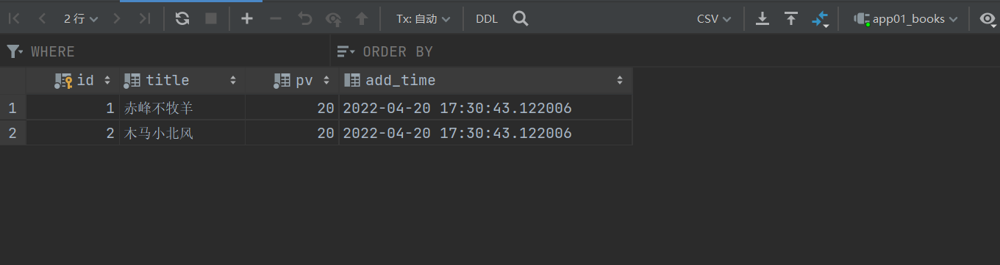
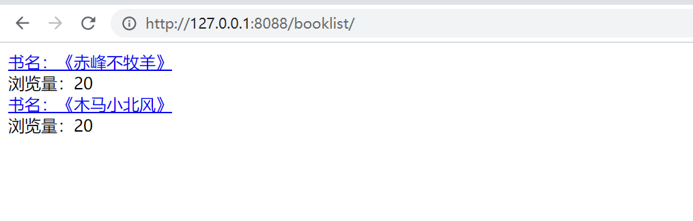
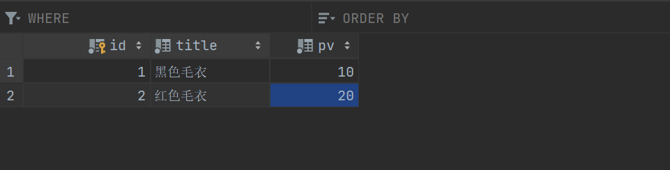
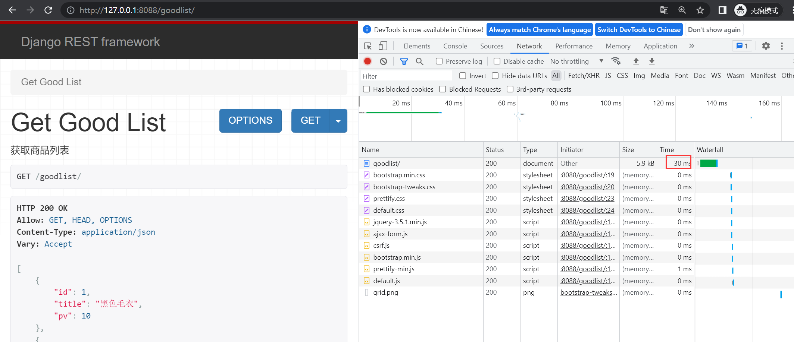
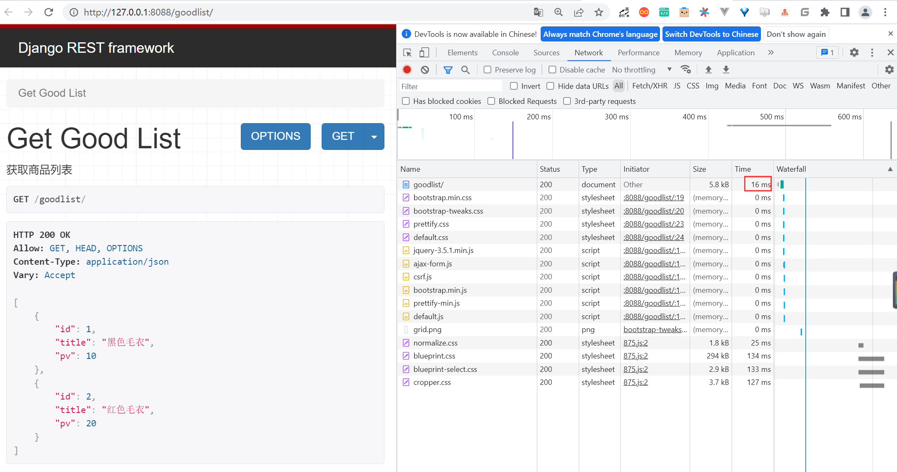

# Django实现缓存机制


## 1. 缓存的介绍

在网站上线后，用户在客户端向服务器端发送的所有数据请求，服务器都会在数据库中进行相应的管理操作，然后经过渲染模板，执行业务逻辑，最后生成用户看到的页面。

当一个网站的用户访问量很大的时候，服务器端的数据操作量也会很大，这会消耗很多服务端资源。所以必须使用缓存来减轻后端服务器的压力。

缓存是将一些常用的数据保存在内存或者Memcache中，在一定的时间内再次访问这些数据时，不用执行数据库及渲染等操作，而是直接从缓存中取得数据，返回给客户端。


## 2. Django提供的6种缓存方式

Django提供的6种缓存方式如下：

（1）开发调试缓存；

（2）内存缓存；

（3）文件缓存；

（4）数据库缓存；

（5）Memcache缓存（使用Python-memcached模块）；

（6）Memcache缓存（使用pylibmc模块）。


常用的缓存方式是文件缓存和Mencache缓存。

注意： 其中开发调试缓存，只用于开发调试期间，在正式应用时并不执行任何操作。Memcache相关的缓存，属于比较早期的解决方案，所以在本节中不做过多的分析。


## 3. 演示Django缓存机制项目

（1）新建Django项目，命名demo11，新建App，命名为app01

（2）在app01/models.py内新建数据表类：

```python
from django.db import models
from datetime import datetime


# Create your models here.

class Books(models.Model):
    """
    图书表
    """
    title = models.CharField(max_length=64, verbose_name='书名')
    pv = models.IntegerField(default=0, verbose_name='浏览量')
    add_time = models.DateTimeField(default=datetime.now, verbose_name='添加时间')

    class Meta:
        verbose_name = '图书表'
        verbose_name_plural = verbose_name

    def __str__(self):
        return self.title

```

（3）执行数据更新命令：

```
$ python manage.py makemigrations
$ python manage.py migrate
```

（4）在图书表内手动添加两条实验数据：




（5）在Templates目录下新建文件：

```html
<!DOCTYPE html>
<html lang="en">
<head>
    <meta charset="UTF-8">
    <title>Title</title>
</head>
<body>

    <div>
    <a href="/book/{{ t.id }}/">
        书名：《{{ t.title }}》
        </a>
    </div>
    <div>
        浏览量：{{ t.pv }}
    </div>

</body>
</html>
```


（6）在Templates目录下新建文件book.html：

```html
<head>
    <meta charset="UTF-8">
    <title>Title</title>
</head>
<body>
    <div>
       书名：《{{ t.title }}》
    </div>
    <div>
        浏览量：{{ t.pv }}
    </div>
</body>
</html>
```


（7）在app01/views.py中编写逻辑代码：

```python
from django.shortcuts import render
from django.views.generic.base import View
from .models import Books


# Create your views here.

class BookListView(View):
    """
    获取读书列表
    """

    def get(self, request):
        list = Books.objects.all()
        return render(request, 'booklist.html', {'list': list})


class GetBookView(View):
    """
    获取单个图书
    """

    def get(self, request, id):
        book = Books.objects.filter(id=id).first()
        print(book.pv)
        book.pv += 1
        book.save()
        return render(request, 'book.html', {'t': book})
```

（8）在demo11/urls.py内配置路由代码：

```
from django.contrib import admin
from django.urls import path
from app01.views import BookListView, GetBookView

urlpatterns = [
    path('admin/', admin.site.urls),
    path('booklist/', BookListView.as_view(), name='booklist'),
    path('book/<id>/', GetBookView.as_view(), name='book')
]
```


（9）启动demo11，然后使用浏览器访问： http://127.0.0.1:8088/booklist/ 

我们可以通过单击书名，跳转到单本图书的页面。



（10）如图所示，通过单击书名链接，进入：http://127.0.0.1:8088/book/1/ 页面，《赤峰不放羊》的浏览量就增加了1，然后刷新一次，浏览量又增加了1。


### 1 Django开发缓存功能

（1）在app01/views.py中对GetBookView进行改写：

```
from django.views.decorators.cache import cache_page
from django.utils.decorators import method_decorator

class GetBookView(View):
    """
    获取单个图书
    """

    @method_decorator(cache_page(3))
    def get(self, request, id):
        book = Books.objects.filter(id=id).first()
        print(book.pv)
        book.pv += 1
        book.save()
        return render(request, 'book.html', {'t': book})
```

（2）重新启动项目demo11，然后使用浏览器直接访问：http://127.0.0.1:8088/book/1/

此时，我们立刻刷新网页，发现浏览量并没有像上一节介绍的那样增加，依然是28

等待3秒以后，再次刷新网页，发现浏览量变成了30


> 注意： 虽然我们已经在开发测试阶段实现了缓存的功能，但是这种效果其实只能存在于开发测试阶段，一旦项目上线，这种缓存的功能就会消失。原因是，Django默认的缓存配置是开发调试模式，如果想要在项目上线以后还能继续使用缓存的功能，需要在settings.py中添加配置代码，用来指定缓存的存储方式。


### 2 各种缓存配置

缓存的存储位置，可以通过在项目的settings中配置，指定存储的位置。开发者可以根据项目的大小和业务模型的不同来决定将缓存具体存储在哪里。下面就来介绍将缓存存储在不同位置所需要做的配置。

（1）开发调试（此模式为开发调试时使用，在项目上线后不再执行任何操作）settings.py中的文件配置：

```
CACHES = {
 'default': {
  'BACKEND': 'django.core.cache.backends.dummy.DummyCache',  # 缓存后台使用的引擎
  'TIMEOUT': 300,            # 缓存超时时间（默认300秒，None表示永不过期，0表示立即过期）
  'OPTIONS':{
   'MAX_ENTRIES': 300,          # 最大缓存记录的数量（默认300）
   'CULL_FREQUENCY': 3,          # 缓存到达最大个数之后，剔除缓存个数的比例，即：1/CULL_FREQUENCY（默认3）
  },
 }
}
```

（2）内存缓存（将缓存内容保存至内存区域中），settings.py中的文件配置：

```
CACHES = {
 'default': {
  'BACKEND': 'django.core.cache.backends.locmem.LocMemCache',  # 指定缓存使用的引擎
  'LOCATION': 'unique-snowflake',         # 写在内存中的变量的唯一值 
  'TIMEOUT':300,             # 缓存超时时间(默认为300秒,None表示永不过期)
  'OPTIONS':{
   'MAX_ENTRIES': 300,           # 最大缓存记录的数量（默认300）
   'CULL_FREQUENCY': 3,          # 缓存到达最大个数之后，剔除缓存个数的比例，即：1/CULL_FREQUENCY（默认3）
  }  
 }
}

```

（3）文件缓存（把缓存数据存储在文件中），settings.py中的文件配置：

```
CACHES = {
 'default': {
  'BACKEND': 'django.core.cache.backends.filebased.FileBasedCache', #指定缓存使用的引擎
  'LOCATION': '/var/tmp/django_cache',        #指定缓存的路径
  'TIMEOUT':300,              #缓存超时时间(默认为300秒,None表示永不过期)
  'OPTIONS':{
   'MAX_ENTRIES': 300,            # 最大缓存记录的数量（默认300）
   'CULL_FREQUENCY': 3,           # 缓存到达最大个数之后，剔除缓存个数的比例，即：1/CULL_FREQUENCY（默认3）
  }
 }   
}

```

（4）数据库缓存（把缓存数据存储在数据库中），settings.py中的文件配置：

```
CACHES = {
 'default': {
  'BACKEND': 'django.core.cache.backends.db.DatabaseCache',  # 指定缓存使用的引擎
  'LOCATION': 'cache_table',          # 数据库表    
  'OPTIONS':{
   'MAX_ENTRIES': 300,           # 最大缓存记录的数量（默认300）
   'CULL_FREQUENCY': 3,          # 缓存到达最大个数之后，剔除缓存个数的比例，即：1/CULL_FREQUENCY（默认3）
  }  
 }   
}

```

创建缓存的数据库表使用语句：

```shell
$ python manage.py createcachetable
```

（5）Memcache缓存（使用Python-memcached模块连接Memcache）。

Memcached是Django原生支持的缓存系统。要使用Memcached，需要下载Memcached的支持库Python-memcached或pylibmc，settings.py中的文件配置：

```
CACHES = {
 'default': {
  'BACKEND': 'django.core.cache.backends.memcached.MemcachedCache', # 指定缓存使用的引擎
  'LOCATION': '222.169.10.100:11211',         # 指定Memcache缓存服务器的IP地址和端口
  'OPTIONS':{
   'MAX_ENTRIES': 300,            # 最大缓存记录的数量（默认300）
   'CULL_FREQUENCY': 3,           # 缓存到达最大个数之后，剔除缓存个数的比例，即：1/CULL_FREQUENCY（默认3）
  }
 }
}
```

LOCATION也可以配置成如下：

```
'LOCATION': 'unix:/tmp/memcached.sock',   # 指定局域网内的主机名加socket套接字为Memcache缓存服务器
'LOCATION': [         # 指定一台或多台其他主机ip地址加端口为Memcache缓存服务器
 '222.169.10.100:11211',
 '222.169.10.101:11211',
 '222.169.10.102:11211',
]

```

（6）Memcache缓存（使用pylibmc模块连接Memcache），settings.py中的文件配置：

```
CACHES = {
  'default': {
   'BACKEND': 'django.core.cache.backends.memcached.PyLibMCCache',  # 指定缓存使用的引擎
   'LOCATION':'192.168.10.100:11211',         # 指定本机的11211端口为Memcache缓存服务器
   'OPTIONS':{
    'MAX_ENTRIES': 300,            # 最大缓存记录的数量（默认300）
    'CULL_FREQUENCY': 3,           # 缓存到达最大个数之后，剔除缓存个数的比例，即：1/CULL_FREQUENCY（默认3）
   },  
  }
 }

```

LOCATION也可以配置成如下：

```
'LOCATION': '/tmp/memcached.sock',  # 指定某个路径为缓存目录
'LOCATION': [       # 分布式缓存,在多台服务器上运行Memcached进程,程序会把多台服务器当作一个单独的缓存,而不会在每台服务器上复制缓存值
 '192.168.10.100:11211',
 '192.168.10.101:11211',
 '192.168.10.102:11211',
]
```

注意： Memcached是基于内存的缓存，数据存储在内存中，如果服务器死机，数据就会丢失，所以Memcached一般与其他缓存配合使用。


## 4. Django REST framework实现缓存机制

Django REST framework的缓存机制，是在Django的缓存机制的基础之上开发的。从用户体验角度上来说，缓存机制可以提升用户访问网站的响应速度。我们在这一节中，通过一个实例项目，向大家介绍如何使用Django REST framework来实现缓存机制。


#### 4.1 新建演示Django REST framework实现缓存机制的项目

Django REST framework的缓存机制是Django REST framework比较经典的一个功能。在这一节中新建一个Django项目demo11_drf，然后安装和配置Django REST framework及其依赖库。具体步骤如下：

（1）新建Django项目demo11_drf，新建App，命名为app01。

（2）安装Django REST framework及其依赖包markdown和django-filter。

```shell
$ pip install djangorestframework markdown Django-filter
```

（3）在settings中注册如下：

```
INSTALLED_APPS = [
    'django.contrib.admin',
    'django.contrib.auth',
    'django.contrib.contenttypes',
    'django.contrib.sessions',
    'django.contrib.messages',
    'django.contrib.staticfiles',
    'app01.apps.App01Config',
    'rest_framework'
]
```

（4）在app01/models.py中构建商品表类：

```python
from django.db import models

# Create your models here.
class Goods(models.Model):
    """
    商品表
    """
    title = models.CharField(max_length=64, verbose_name='商品名')
    pv = models.IntegerField(default=0, verbose_name='浏览量')

    class Meta:
        verbose_name = '商品表'
        verbose_name_plural = verbose_name

    def __str__(self):
        return self.title

```

（5）执行数据更新命令：

```shell
$ python manage.py makemigrations
$ python manage.py migrate
```

（6）在app01目录下新建序列化文件serializers.py：

```python
from rest_framework import serializers
from .models import Goods


class GoodsModelSerializer(serializers.ModelSerializer):
    class Meta:
        model = Goods
        fields = "__all__"
```

（7）如图所示，手动向商品表内添加两条实验数据。




#### 4.2 Django REST framework开发缓存机制

（1）安装依赖drf-extensions：

```shell
$ pip install drf-extensions
```

（2）在app01/views.py中，在不加入缓存机制的情况下，查看商品列表的逻辑：

```python
from django.shortcuts import render
from .models import Goods
from .serializers import GoodsModelSerializer
from rest_framework.views import APIView
from rest_framework.response import Response
from rest_framework_extensions.cache.mixins import CacheResponseMixin


# Create your views here.
class GetGoodListView(APIView):
    """
    获取商品列表
    """

    def get(self, request):
        good_list = Goods.objects.all()
        re = GoodsModelSerializer(good_list, many=True)
        return Response(re.data)
```

（3）在demo11_drf/urls.py中配置路由： 

```python
from django.contrib import admin
from django.urls import path
from app01.views import GetGoodListView
urlpatterns = [
    path('admin/', admin.site.urls),
    path('goodlist/',GetGoodListView.as_view(),name='goodlist')
]
```

（4）在settings.py中配置：

```
# DRF扩展
REST_FRAMEWORK_EXTENSIONS = {
    # 缓存时间
    'DEFAULT_CACHE_RESPONSE_TIMEOUT': 6,
    # 缓存存储
    'DEFAULT_USE_CACHE': 'default',
}
```

在上述代码中，DEFAULT_CACHE_RESPONSE_TIMEOUT为缓存有效期，单位为秒。

DEFAULT_USE_CACHE为缓存的存储方式，与配置文件中的CACHES的键对应。

（5）运行项目demo11_drf，然后用浏览器访问：http://127.0.0.1:8088/goodlist/

如图所示，在没有加入缓存机制的情况下，每次刷新网页，访问获取商品列表所使用的时间，都在30~40ms。



（6）在app01/views.py中，给GetGoodListView添加缓存机制。

```python
from django.shortcuts import render
from .models import Goods
from .serializers import GoodsModelSerializer
from rest_framework.views import APIView
from rest_framework.response import Response
from rest_framework_extensions.cache.mixins import CacheResponseMixin


# Create your views here.
class GetGoodListView(CacheResponseMixin, APIView):
    """
    获取商品列表
    """

    def get(self, request):
        good_list = Goods.objects.all()
        re = GoodsModelSerializer(good_list, many=True)
        return Response(re.data)
```

（7）还有另外一种给GetGoodListView添加缓存机制的写法：

```python
from django.shortcuts import render
from .models import Goods
from .serializers import GoodsModelSerializer
from rest_framework.views import APIView
from rest_framework.response import Response
from rest_framework_extensions.cache.mixins import CacheResponseMixin
from rest_framework_extensions.cache.decorators import cache_response


# Create your views here.
class GetGoodListView(APIView):
    """
    获取商品列表
    """

    @cache_response()
    def get(self, request):
        good_list = Goods.objects.all()
        re = GoodsModelSerializer(good_list, many=True)
        return Response(re.data)

```

cache_response装饰器可以接收两个参数： 

```
@cache_response(timeout=60*60, cache='default')
```

（8）再次运行demo11_demo11_drf，然后使用浏览器访问：http://127.0.0.1:8088/goodlist/ 



使用缓存机制以后，多次刷新网页，每次访问数据所需时间都在10~20ms之间。

> 注意： 本例中通过增加缓存的机制，让我们访问网页的速度提升了一倍。其实缓存能够提升的访问速度远不止这些，随着网页所获取的数据量越来越大，同时向网站服务器发送网络请求的数量越来越多，有缓存机制的网页访问速度可能会比没有缓存机制的网页快几百上千倍。


## 5. 缓存配置使用Redis

Redis是一种非关系型数据库。如果对Redis有所了解就会知道，因为本身代码逻辑的不同，非关系型数据库的运行速度要比关系型数据库快，所以如果想要让缓存更快，建议使用Redis来储存缓存。

（1）确保Redis的server运行。

（2）安装django-redis依赖。

```shell
$ pip install django-redis
```

（3）在settings.py中增加配置代码：

```
# 上面是django项目settings中的其他配置....
CACHES = {
    'default': {
        'BACKEND': 'django_redis.cache.RedisCache',
        'LOCATION': 'redis://192.168.1.107:6379/2',
        "OPTIONS": {
            "CLIENT_CLASS": "django_redis.client.DefaultClient",
            # socket 建立连接超时设置
            "SOCKET_CONNECT_TIMEOUT": 5,
            # 连接建立后的读写操作超时设置
            "SOCKET_TIMEOUT": 5,
            "CONNECTION_POOL_KWARGS": {
                # 连接池最大数量
                "max_connections": 100,
                "encoding": 'utf-8'
            },
             "PASSWORD": "123456",
        },
    },
}
```

至此，我们实现了Django REST framework缓存机制。


> 参考文献：
>
> https://www.yuque.com/keep_running/python/oyp0cx
>
> https://django-redis-chs.readthedocs.io/zh_CN/latest/
>
> https://www.cnblogs.com/Edmondhui/p/15952817.html

