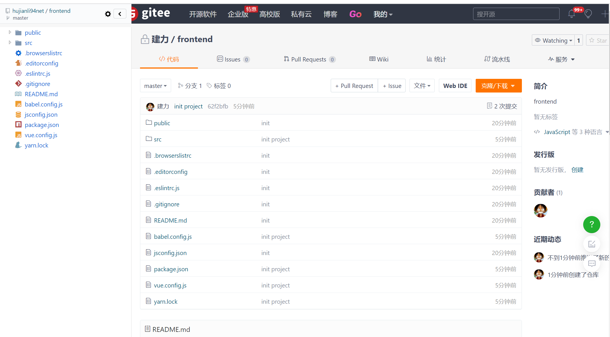
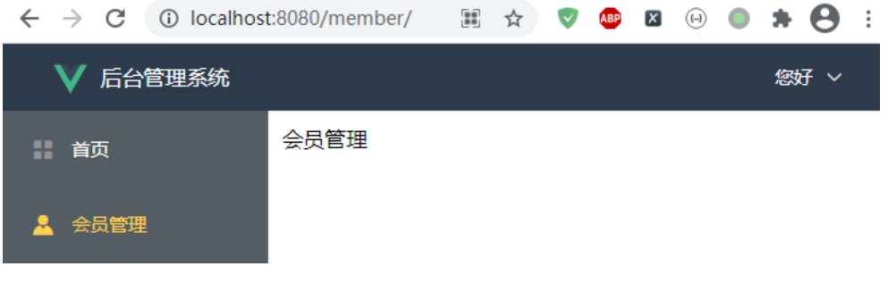
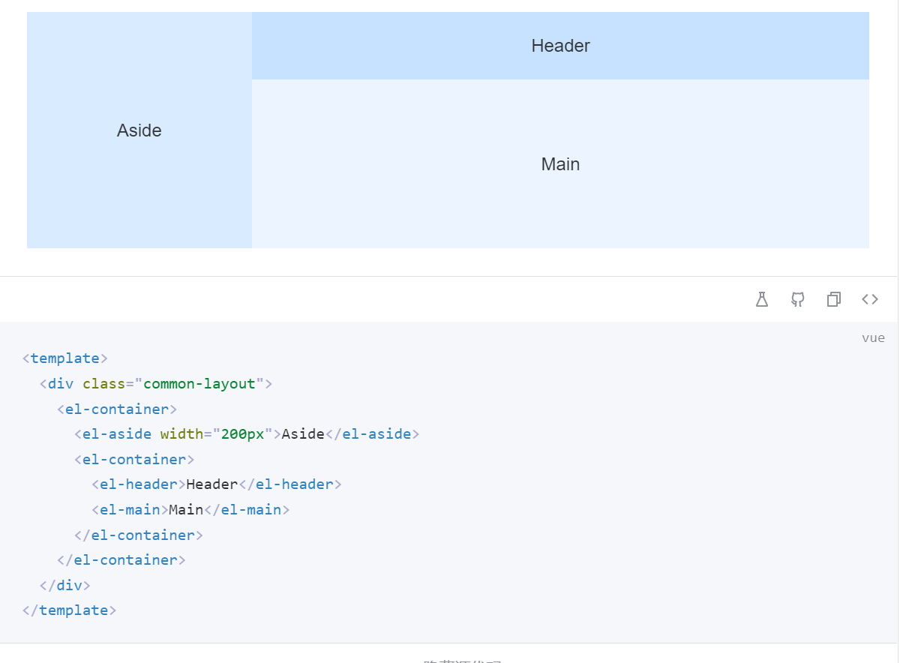
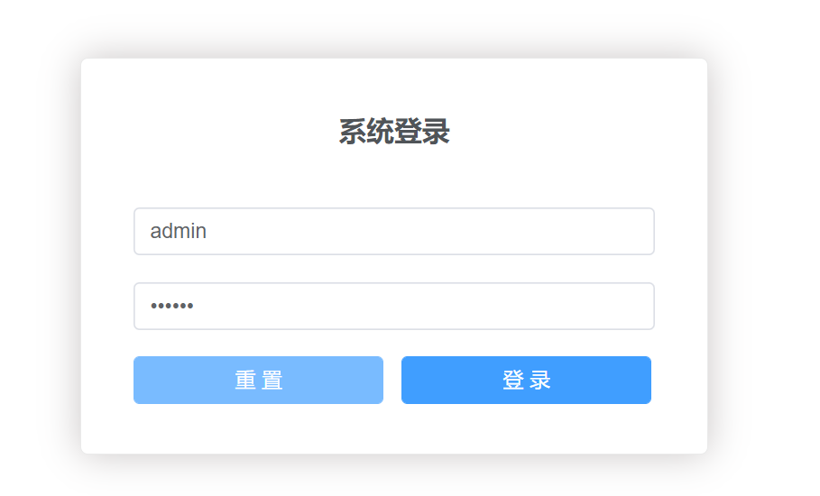
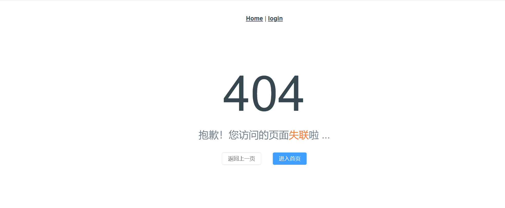
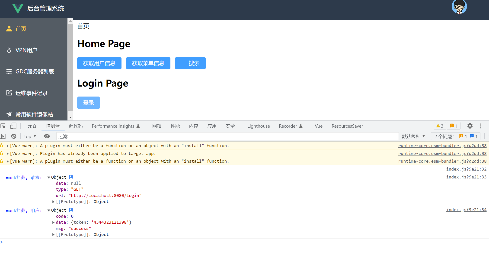
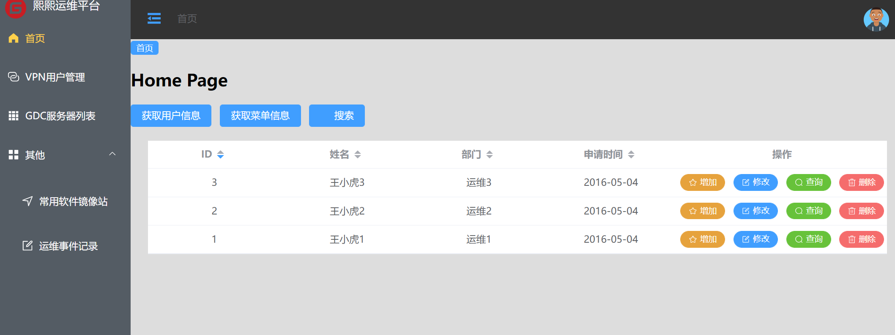
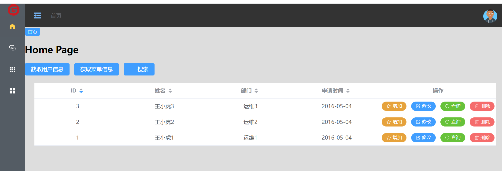

# 附1.Vue前端项目

## 1. 搭建开发环境

>Vue.js官网：https://cn.vuejs.org/
>
>Vue.js教程：http://www.runoob.com/vue2/vue-tutorial.html
>
>Vue-router教程：https://router.vuejs.org/zh/
>
>Vuex教程：https://vuex.vuejs.org/zh/guide/
>
>Element教程: http://element-cn.eleme.io/#/zh-CN


### 1.1 安装webpack

安装好 npm 之后，就可以通过 npm 命令来下载各种工具了。

安装打包工具 webpack，-g 表示全局安装。

```
npm install webpack -g
```

更多webpack教程可以参考以下资料

> 菜鸟学堂：http://www.runoob.com/w3cnote/webpack-tutorial.html

### 1.2 安装vue-cli

新版本的脚手架包名称由vue-cli改成了@vue/cli。

如果已经全局安装了旧版本的vue-cli（1.x或2.x),

需要先通过如下命令进行卸载

```
$ npm uninstall vue-cli -g
#或
$ yarn global remove vue-cli
```

Vue CLI需要安装Node.js 8.9或更高版本（推荐8.11.0+）。

安装node

```
$ node -v
v16.14.0
```

可以使用下列其中一个命令来安装脚手架：

```
$ npm install -g @vue/cli
或者
$ yarn global add @vue/cli
```

这里使用`npm install -g @vue/cli`命令来安装。在窗口中输入命令，并按下回车键，即可进行安装。

环境搭建简易流程

```
#1、安装node （node -v查询版本号）
node 安装 

#2、安装淘宝镜像
npm install -g cnpm --registry=https://registry.npm.taobao.org

#3、安装 webpack，以全局的方式安装
npm install webpack -g

#4、全局安装vue以及脚手架vue-cli
npm install @vue/cli -g --unsafe-perm

#5、创建vue项目 mall-manage-system是你起的项目名称
vue create mall-manage-system

#6、运行当前项目 这个整个项目就搭建好了
npm run serve
```


### 1.3 淘宝镜像

因为 npm 使用的是国外中央仓库，有时候下载速度比较“喜人”，就像 Maven 有国内镜像一样，npm 在国内也有镜像可用。这里建议使用淘宝镜像。

安装淘宝镜像，安装成功后 用 cnpm 替代 npm 命令即可，如： cnpm install webpack -g 。

```
# 先切换为淘宝镜像，cnpm命令
$ npm install -g cnpm --registry=https://registry.npm.taobao.org
$ cnpm install -g @vue/cli
```

### 1.4 安装yarn

Yarn 是 Facebook 发布的 node.js 包管理器，它比 npm 更快、更高效，可以使用 Yarn 替代 npm 。

如果你安装了node，就安装了npm，可以使用下面的命令来安装：

```
npm i yarn -g --verbose
```

npm官方源访问速度实在不敢恭维，建议使用之前切换为淘宝镜像，在yarn安装完毕之后执行如下指令：

```
yarn config set registry https://registry.npm.taobao.org
```

到此为止我们就可以在项目中像使用npm一样使用yarn了。

使用 Yarn 跟 npm 差别不大，具体命令关系如下：

```
npm install  => yarn install
npm install --save [package] => yarn add [package]
npm install --save-dev [package] => yarn add [package] --dev
npm install --global [package] => yarn global add [package]
npm uninstall --save [package] => yarn remove [package]
npm uninstall --save-dev [package] => yarn remove [package]
```

> 参考文献：
>
> https://www.cnblogs.com/xifengxiaoma/p/9533018.html


Yarn创建vite错误

https://blog.csdn.net/sgrrmswtvt/article/details/122942406


npm/yarn修改全局安装路径和缓存路径

https://blog.csdn.net/zimeng303/article/details/109741322


### 1.5 创建项目

#### 1. 可视化创建


```
# 安装淘宝npm
npm install -g cnpm --registry=https://registry.npm.taobao.org

# vue-cli 安装依赖包
cnpm install --g vue-cli
```

打开图形化，命令行输入：

```bash
vue ui
```


详细步骤参考

- http://vue.ezops.cn/#/src/01/%E8%84%9A%E6%89%8B%E6%9E%B6
- https://www.cnblogs.com/you-men/p/14015406.html


#### 2. 命令行脚手架创建

我们通过 vue-cli 来生成一个项目，名称为 kitty-ui。

```
vue init webpack kitty-ui
```

一路根据提示输入项目信息，等待项目生成。

进入到项目根目录，执行 yarn install (也可以用 npm install，或淘宝 cnpm install，我们这里用 yarn 会快一点) 安装依赖包。

```
cd kitty -ui
yarn install
```


#### 3.vue3 + vite

```
yarn create vite xixi-ops-frontend --template vue
cd xixi-ops-frontend
yarn
yarn dev
```


### 1.6 导入项目

打开webstorm，导入我们的项目。


## 2.vue3+vite+element-plus创建后台管理系统

### 2.1 自定义配置

1、配置启动端口和自动打开浏览器，新增配置文件修改 `vue.config.js`：

```javascript
const { defineConfig } = require('@vue/cli-service')
module.exports = defineConfig({
  transpileDependencies: true,
  devServer: {
    port: 10000,
    open: true
  }
})
```


**修改eslintrc.js文件**

我们并不想要格式化成这样的格式，而是希望eslint能够忽略这种语法规范，如何解决呢？只需要修改一下eslint语法规则即可。

```
module.exports = {
  root: true,
  env: {
    node: true
  },
  extends: [
    'plugin:vue/vue3-essential'
    // '@vue/standard'
  ],
  parserOptions: {
    parser: '@babel/eslint-parser'
  },
  rules: {
    'no-console': process.env.NODE_ENV === 'production' ? 'warn' : 'off',
    'no-debugger': process.env.NODE_ENV === 'production' ? 'warn' : 'off',
    // 关闭驼峰命名规则
    'vue/multi-word-component-names': 0,
    // 去掉函数()前面的空格
    'space-before-function-paren': 'off'
  }
}
```


### 2.2 安装插件

- vue-cli-plugin-element-plus插件，选择导入方式为按需导入

参考文献

https://www.jianshu.com/p/23f4d57d15c9

### 2.3 安装依赖

安装相应的依赖如下：

```
yarn add element-plus --save				// element-plus是UI框架
yarn add @element-plus/icons-vue --save		 //element-plus/icons-vue是UI框架的图标相关的支撑库
yarn add axios --save					   // axios是HTTP请求库
yarn add sass --save					   // sass是用于编写样式的CSS超集语言
yarn add vue-router@next --save			    // vue-router用于实现单页面路由

yarn add vuex@next --save				    // vuex用于实现状态存储
或者
yarn add pinia --save					    // pinia 是一款新的vue3的状态管理库，完整的typescript支持。

yarn add particles.vue3 --save				// 粒子背景插件
```

Vue 动态粒子特效(vue-particles)

https://juejin.cn/post/6844903937502347278

https://blog.csdn.net/qq_43353619/article/details/107078318


github地址： https://github.com/creotip/vue-particles


可选依赖如下

- less-loader
- less
- sass-loader
- node-sass
- url-loader
- file-loader
- font-awesome    // Font Awesome 提供了675个可缩放的矢量图标
- axios

安装 axios 插件：

```bash
npm install axios -S
// 或者
yarn add axios
```

#### 手动安装Element UI

**安装依赖**

Element 是国内饿了么公司提供的一套开源前端框架，简洁优雅，提供了 vue、react、angular 等多个版本，我们这里使用 vue 版本来搭建我们的界面。

访问：http://element-cn.eleme.io/#/zh-CN/component/installation ，官方指南，包含框架的安装，组件的使用等的全方位的教程。

选择一个你喜欢的包管理器

```
# NPM
$ npm install element-plus --save

# Yarn
$ yarn add element-plus

# pnpm
$ pnpm install element-plus
```

安装 babel-plugin-component 插件，按需加载，已达到减小项目体积的目的。

```
npm install babel-plugin-component -D
// or
yarn add babel-plugin-component 
```


**项目导入**

按照安装指南，在 main.js 中引入 element，引入之后，main.js 内容如下：

##### 1.完全导入

1. 在项目目录下运行命令：

```
npm install element-plus --save
```

2. 在 main.js 中写入以下内容：(全局配置)

```
import { createApp } from 'vue'
import App from './App.vue'
import router from './router'
import store from './store'
import ElementUI from 'element-plus'
import 'element-plus/theme-chalk/index.css'

createApp(App).use(store).use(router).use(ElementUI).mount('#app')
```

项目引入之后，我们在原有的 HelloWorld.vue 页面中加入一个 element 的按钮，测试一下。

```
<template>
  <div class="hello">
    <h1>{{ msg }}</h1>
    <el-row>
      <el-button>默认按钮</el-button>
      <el-button type="primary">主要按钮</el-button>
      <el-button type="success">成功按钮</el-button>
    </el-row>
  </div>
</template>
```


##### 2.按需导入

首先你需要安装`unplugin-vue-components` 和 `unplugin-auto-import`这两款插件

```
npm install -D unplugin-vue-components unplugin-auto-import
```

然后把下列代码插入到你的 `Vite` 配置文件中

Vite

```
import { defineConfig } from 'vite'
import vue from '@vitejs/plugin-vue'
import AutoImport from 'unplugin-auto-import/vite'
import Components from 'unplugin-vue-components/vite'
import { ElementPlusResolver } from 'unplugin-vue-components/resolvers'

// https://vitejs.dev/config/
export default defineConfig({
  plugins: [
    vue(),
    AutoImport({
      resolvers: [ElementPlusResolver()],
    }),
    Components({
      resolvers: [ElementPlusResolver()],
    }),
  ]
})
```


参考文献

- https://blog.csdn.net/qq_44827865/article/details/115457445
- https://blog.csdn.net/m0_60206780/article/details/121752639
- https://blog.csdn.net/qq_33957967/article/details/122769713
- https://www.jb51.net/article/206823.htm
- https://element.eleme.cn/#/zh-CN/component/quickstart


**Vue3中element-plus全局使用Icon图标**

- https://blog.csdn.net/yuliwen0418/article/details/121493937


**vue3 中使用el-dropdown时，slot报错**

`slot` attributes are deprecated

- https://blog.csdn.net/boomm18/article/details/118600568 


网站快速成型工具-Element UI

- https://blog.csdn.net/weixin_48143996/article/details/121748515 


### 2.4 清理不需要的代码

清理 `src/App.vue`

```
<template>
  <div id="app">
    项目根组件
  </div>
</template>

<script>
export default {}
</script>

<style>
</style>
```


清空路由 `src/router/index.js`：

```
import { createRouter, createWebHistory } from 'vue-router'

const routes = [
]

const router = createRouter({
  history: createWebHistory(process.env.BASE_URL),
  routes
})

export default router
```

清除模板目录和文件：

`src/views`  

`src/components/HelloWorld.vue`


### 2.5 git版本管理

```
cd frontend
git init .
git add .

此时可能出现告警：
warning: LF will be replaced by CRLF in babel.config.js. The file will have its original line endings in your working directory

解决办法：
git config --global core.autocrlf false

# 再次添加
git add .

# 查看提交状态
git status
```

绿色则为正常提交，提交代码到本地主干并添加提交信息。

```bash
git commit -m "init project"
git status
```

可以看到代码都已经提交了。

### 2.6 gitee配置公钥

为本地电脑创建 SSH 码云的公钥和私钥。

```bash
ssh-keygen -t rsa -C "1879324764@qq.com"
```

默认一直 enter 就行。可以参考文档：

> https://gitee.com/help/articles/4181#article-header0

此时在 `C:\Users\你电脑用户名\.ssh` 的地方会生成三个文件：

```
$ ll /c/Users/18793/.ssh/
total 14
-rw-r--r-- 1 18793 197609   76 Jun  9 09:50 config
-rw-r--r-- 1 18793 197609 2602 Apr 21 14:56 id_rsa
-rw-r--r-- 1 18793 197609  571 Apr 21 14:56 id_rsa.pub
-rw-r--r-- 1 18793 197609 1238 Jun 28 14:59 known_hosts
-rw-r--r-- 1 18793 197609  584 Jun 23 17:20 known_hosts.old
```

其中 `id_rsa.pub` 的内容需要粘贴到码云中：

验证自己的密码添加成功。


### 2.7 gitee提交代码

在码云中创建同名的仓库，并将本地代码仓库推到码云仓库：

创建 git 仓库:

```
mkdir frontend
cd frontend
git init 
touch README.md
git add README.md
git commit -m "first commit"
git remote add origin https://gitee.com/hujianli94net/frontend.git
git push -u origin "master"
```

已有仓库?

```
cd existing_git_repo
git remote add origin https://gitee.com/hujianli94net/frontend.git
git push -u origin "master"
```

仓库中也有了代码：




### 2.8 git 分支管理

在开发新功能之前需要创建一个分支，专门用于开发：

```bash
git checkout -b login
```

可以创建分支和查看本地的分支：

```
git branch
* login
  master
```

### 2.9 拉取远程分支到本地及本地切换分支

```
# 前本地及远程所有分支
git branch -a

# 切换一下远程分并在本地创建远程分支
git checkout -b 本地分支名 origin/远程分支名

# 本地分支切换
git checkout 分支名

# 代码记录
git log -n 3


# 本地合并其它分支代码
git status //查看代码状态

# 这里可以看到用执行了  git status 命令后 ，下面  On branch dev ,表示在  dev 分支上
确认之后合并如下：
git merge  合并分支名


# 本地代码提交到远程指定仓库
git pull 


# 推送上远程指定仓库
git push origin 远程仓库名
```


## 3.Element Plus整体页面布局


一般后台页面的顶部导航栏和左侧导航栏一般是固定的，我们可以布局成下面的样式


### 3.1 整体项目布局

因为我们的首页是个公共的组件，点击首页，会员管理，都不会变，所以我们可以放在一个单独文件夹里面。

需要分别对头部，左侧区域，主区域拆分成不同的文件。

#### 1 创建项目

创建一个全新的ElementUI 项目，请参考链接：

https://www.cnblogs.com/xiao987334176/p/14187889.html

在src目录下，创建views文件夹，在里面再创建Layout文件夹，最后创建index.vue

最终src目录结构如下：

```
./
├── App.vue
├── assets
│   └── logo.png
├── components
│   └── HelloWorld.vue
├── main.js
├── router
│   └── index.js
└── views
    └── Layout
        └── index.vue
```


修改`views/Layout/index.vue`，完整内容如下：

```
<template>
  <div>
    <app-header class="header"></app-header>
    <app-navbar class="navbar"></app-navbar>
    <app-main class="main"></app-main>
  </div>
</template>

<script>
import AppHeader from '@/views/Layout/components/AppHeader'
import AppNavbar from '@/views/Layout/components/AppNavbar'
import AppMain from '@/views/Layout/components/AppMain'

// 导入子组件，缩写格式 AppHeader: AppHeader
export default {
  components: { AppHeader, AppNavbar, AppMain }
}

</script>

<style scoped>
/* 头部样式 */
.header {
  position: absolute;
  line-height: 50px;
  top: 0px;
  left: 0px;
  right: 0px;
  background-color: #2d3a4b;
}

/* 左侧样式 */
.navbar {
  position: absolute;
  width: 200px;
  top: 55px;  /* 距离上面55像素 */
  left: 0px;
  bottom: 0px;
  overflow-y: auto; /* 当内容过多时y轴出现滚动条 */
  background-color: #545c64;
}

/* 主区域 */
.main {
  position: absolute;
  top: 50px;
  left: 200px;
  bottom: 0px;
  right: 0px;  /* 距离右边0像素 */
  padding: 10px;
  overflow-y: auto; /* 当内容过多时y轴出现滚动条 */
  /* background-color: red; */
}
</style>
```

修改`router/index.js`

```
import { createRouter, createWebHistory } from 'vue-router'
// import HomeView from '@/components/HomeView'
import Layout from '@/views/Layout'
import Home from '@/views/Home'
import Member from '@/views/Member'
import Login from '@/views/Login'
import ServerList from '@/views/ServerList'
import Record from '@/views/Record'
import SoftwareImage from '@/views/SoftwareImage'

const routes = [
  {
    path: '/',
    name: 'layout',
    redirect: '/home',
    component: Layout,
]
const router = createRouter({
  history: createWebHistory(process.env.BASE_URL),
  routes
})


export default router

```

修改`App.vue`，注释多余的代码

```
<template>
  <div id="app">
<!--    -->
    <router-view/>
  </div>
</template>

<script>
export default {
  name: 'App'
}
</script>

<style>
/*#app {*/
/*  font-family: 'Avenir', Helvetica, Arial, sans-serif;*/
/*  -webkit-font-smoothing: antialiased;*/
/*  -moz-osx-font-smoothing: grayscale;*/
/*  text-align: center;*/
/*  color: #2c3e50;*/
/*  margin-top: 60px;*/
/*}*/
</style>

```

运行vue项目，访问首页，效果如下：


#### 2 布局拆分

上面已经实现了3个区域的布局，现在需要将3个区域拆分成不同的vue文件，方便后续的维护。

在src/views/Layout目录下，创建文件夹components，并在此文件夹创建3个文件AppHeader.vue，Appmain.vue，Appnavbar.vue

最终，src目录结构如下：

```
./
├── App.vue
├── assets
│   └── logo.png
├── components
│   └── HelloWorld.vue
├── main.js
├── router
│   └── index.js
└── views
    └── Layout
        ├── components
        │   ├── AppHeader.vue
        │   ├── Appmain.vue
        │   └── Appnavbar.vue
        └── index.vue
```


views/Layout/components/`AppHeader.vue`

```
<template>
  <div class="header">头部</div>
</template>

<script>
  export default {
    name: "AppHeader"
  }
</script>

<style scoped>

</style>
```

views/Layout/components/`Appmain.vue`

```
<template>
  <div class="main">主区域</div>
</template>

<script>
    export default {
        name: "AppMain"
    }
</script>

<style scoped>

</style>
```

views/Layout/components/`Appnavbar.vue`

```
<template>
  <div class="navbar">左侧区域</div>
</template>

<script>
  export default {
    name: "AppNavbar"
  }
</script>

<style scoped>

</style>
```

views/Layout/`index.vue`

```
<template>
  <div>
    <app-header></app-header>
    <app-navbar></app-navbar>
    <app-main></app-main>
  </div>
</template>

<script>
  import AppHeader from "./components/AppHeader"
  import AppNavbar from "./components/AppNavbar"
  import AppMain from "./components/AppMain"

  // 导入子组件，缩写格式 AppHeader: AppHeader
  export default {
    components: { AppHeader, AppNavbar, AppMain }  // 有s
  };

</script>

<style scoped>
  /* 头部样式 */
  .header {
    position: absolute;
    line-height: 50px;
    top: 0px;
    left: 0px;
    right: 0px;
    background-color: #2d3a4b;
  }

  /* 左侧样式 */
  .navbar {
    position: absolute;
    width: 200px;
    top: 50px;  /* 距离上面50像素 */
    left: 0px;
    bottom: 0px;
    overflow-y: auto; /* 当内容过多时y轴出现滚动条 */
    background-color: #545c64;
  }

  /* 主区域 */
  .main {
    position: absolute;
    top: 50px;
    left: 200px;
    bottom: 0px;
    right: 0px;  /* 距离右边0像素 */
    padding: 10px;
    overflow-y: auto; /* 当内容过多时y轴出现滚动条 */
    /* background-color: red; */
  }
</style>
```

刷新我们的页面，页面还是之前的样式，则我们的抽取没有问题

本文参考链接：

https://www.cnblogs.com/xiao987334176/p/14434383.html


参考文献

vue+element-ui搭建简易的后台管理系统页面布局

https://blog.csdn.net/weixin_41614732/article/details/105495539


vue+element 实现后台管理系统（登录+侧边菜单栏）

https://www.cnblogs.com/lyt0207/p/12730308.html


保姆级别的vue + ElementUI 搭建后台管理系统教程

https://www.cnblogs.com/songzxblog/p/15578523.html


## 4.ElementUI头部和左侧效果

 现在我们就来使用ElementUI搭建头部组件，最终效果如下：


### 4.1 头部组件

注意：项目代码参考上一篇的，修改 views/Layout/components/`AppHeader.vue`

```
<template>
  <!-- logo和文字 -->
  <div class="header">
    <a href="/home">   <!-- 点击进入首页 -->
      
      <span class="company">后台管理系统</span>
    </a>
    <!-- logo和文字结束 -->

    <!--  下拉菜单-->
    <el-dropdown @command="handleCommand"><!--  绑定指令,在methods里定义-->
      <span class="el-dropdown-link">
      <div class="r-content">
        <el-dropdown trigger="click" szie="mini">
          <span>
              
          </span>
        </el-dropdown>

      </div>
      <i class="el-icon-arrow-down el-icon--right"></i>
    </span>
      <template v-slot:dropdown>
        <el-dropdown-menu>
          <!-- icon是修改图标 ，command是点击后传给方法的值-->
          <el-dropdown-item icon="EditPen" command="edit">修改密码</el-dropdown-item>
          <el-dropdown-item icon="Operation" @click="logout">退出登录</el-dropdown-item>
        </el-dropdown-menu>
      </template>
    </el-dropdown>
    <!--  下拉菜单结束-->
  </div>
</template>

<script>
export default {
  name: 'AppHeader',
  data () {
    return {
      username: 'hujianli',
      logoImg: require('../../../assets/logo.png'),
      userImg: require('../../../assets/images/user.png')
    }
  },
  methods: {
    handleCommand (command) {
      this.$message(`点击了${command}`)
    },
    deletelocalStorage (name) {
      localStorage.removeItem(name)
    },
    logout () {
      // sessionStorage.removeItem("user")
      // this.deleteCookie("token")
      this.deletelocalStorage("token")
      this.$router.push("/login")
      // this.$api.logout().then((res) => {
      //     console.log(res)
      //   }).catch(function(res) {
      // })
    },
  }
}
</script>

<style lang="less" scoped>
/* logo */
.logo {
  vertical-align: middle; /* 居中 */
  padding: 0px 10px 0px 40px; /* 上右下左 */
}

/* 文字 */
.company {
  position: absolute;
  color: white;
}

/* 下拉菜单 */
.el-dropdown {
  float: right; /* 浮动在右边 */
  margin-right: 40px; /* 靠右40px */
}

/* 系统管理 */
.el-dropdown-link {
  color: white;
  cursor: pointer; /* 鼠标放上去是手的形状 */
}

.r-content
{
  .user
  {
    width: 40px;
    height: 40px;
    border-radius:50%;
  }
}

/* 头部样式 */
.header {
  position: absolute;
  line-height: 50px;
  top: 0px;
  left: 0px;
  right: 0px;
  background-color: #2d3a4b;
}
</style>

```


刷新页面，效果如下：


### 4.2 左侧区域

修改 views/Layout/components/`Appnavbar.vue`

```
<template>
  <!-- 使用element的导航菜单 -->
  <div class="navbar">
    <!--default-active默认选中的菜单，选中后颜色是 active-text-color  -->
    <!--  :router='true',true表示开启路由模式，开启之后，index值代表的就是路由地址-->
    <!--  :router='true'开启之后点击就会跳转到对应的路由，默认为false -->
    <!-- text-color 文字的颜色 -->
    <el-menu :router='true' default-active="/home" class="el-menu-vertical-demo" background-color="#545c64"
             text-color="#fff" active-text-color="#ffd04b">

      <!-- 首页  class就是对应的icon -->
      <el-menu-item index="/home">
        <el-icon><Avatar /></el-icon>
        <template v-slot:title>
          <span>首页</span>
        </template>

      </el-menu-item>

      <!-- VPN用户 index下的左右 / 别忘记-->
      <el-menu-item index="/member/">
        <el-icon><Key /></el-icon>
        <template v-slot:title>
          <span>VPN用户</span>
        </template>
      </el-menu-item>

      <!-- GDC内部服务器管理 -->
      <el-menu-item index="/server-list/">
        <el-icon><Operation /></el-icon>
        <template v-slot:title>
          <span>GDC服务器列表</span>
        </template>
      </el-menu-item>

      <!-- 运维事件记录 -->
      <el-menu-item index="/record/">
        <el-icon><Edit /></el-icon>
        <template v-slot:title>
          <span>运维事件记录</span>
        </template>
      </el-menu-item>

      <!-- 常用软件镜像站 -->
      <el-menu-item index="/softwareImage/">
        <el-icon><Promotion /></el-icon>
        <template v-slot:title>
          <span>常用软件镜像站</span>
        </template>
      </el-menu-item>
      <!--      &lt;!&ndash; 员工管理 &ndash;&gt;-->
      <!--      <el-menu-item index="/staff/">-->
      <!--        <i class="el-icon-user"></i>-->
      <!--        <span slot="title">员工管理</span>-->
      <!--      </el-menu-item>-->

    </el-menu>
  </div>
</template>

<script>
export default {
  name: 'AppNavbar'
}
</script>

<style scoped>
/* 去掉右边框 */
.el-menu {
  border-right: none;
}

/* 左侧样式 */
.navbar {
  position: absolute;
  width: 200px;
  top: 55px;  /* 距离上面50像素 */
  left: 0px;
  bottom: 0px;
  overflow-y: auto; /* 当内容过多时y轴出现滚动条 */
  background-color: #545c64;
}
</style>
```

### 4.3 主区域

修改views/Layout/components/`AppMain.vue`

```
<template>
  <div class="main">
    <!-- 组件的出口 -->
    <router-view> </router-view>
  </div>
</template>

<script>
export default {
  name: 'AppMain'
}
</script>

<style scoped>

/* 主区域 */
.main {
  position: absolute;
  top: 50px;
  left: 200px;
  bottom: 0px;
  right: 0px;  /* 距离右边0像素 */
  padding: 10px;
  overflow-y: auto; /* 当内容过多时y轴出现滚动条 */
  /* background-color: red; */
}
</style>
```

主界面文件

修改views/Layout/`index.vue`

```
<template>
  <div>
    <app-header/>
    <app-main/>
    <app-navbar/>
  </div>
</template>

<script>
import AppHeader from '@/views/Layout/components/AppHeader'
import AppNavbar from '@/views/Layout/components/AppNavbar'
import AppMain from '@/views/Layout/components/AppMain'

// 导入子组件，缩写格式 AppHeader: AppHeader
export default {
  components: { AppHeader, AppNavbar, AppMain }
}

</script>

<style scoped>
</style>
```


刷新页面，左边的菜单栏就出来了，效果如下：


这样左侧我们也做好了，但是点击左边的菜单会进入一个空白页面，因为我们开启了路由但是没有配置


### 4.3 其他组件

上面我们已经写好了左侧导航，并且点击能跳转到对应的路由，接下来我们来写对应的组件，我们把组件都放在src下的views下面。

分别是首页，会员管理。如果还有其他的，请根据实际情况修改。

在src/views目录下创建2个文件夹，分别是Home，Member。并在新目录下创建index.vue

最终src目录结构如下：

```
./
├── App.vue
├── assets
│   └── logo.png
├── components
│   └── HelloWorld.vue
├── main.js
├── router
│   └── index.js
└── views
    ├── Home
    │   └── index.vue
    ├── Layout
    │   ├── components
    │   │   ├── AppHeader.vue
    │   │   ├── Appmain.vue
    │   │   └── Appnavbar.vue
    │   └── index.vue
    └── Member
        └── index.vue

```

 views/ Layout


修改 views/Home/`index.vue`

```
<template>
    <div>
      首页
    </div>
</template>

<script>
    export default {
        name: "index"
    }
</script>

<style scoped>

</style>
```

修改 views/Member/`index.vue`

```
<template>
    <div>
      会员管理
    </div>
</template>

<script>
    export default {
        name: "index"
    }
</script>

<style scoped>

</style>
```


### 4.4 首页路由配置

上面我们点击左侧的首页会跳转到空白页面，我们已经写好了首页，会员的组件（views下的）。我们期望的是当我们点击左侧对应的导航，对应的组件渲染在Layout的中间区域。

首页，会员的组件都是Layout的一个子组件，我们可以放在children下面，在 router/index.js 里配置首页的路由，代码如下

```
import Vue from 'vue'
import Router from 'vue-router'
import HelloWorld from '@/components/HelloWorld'
import Layout from '@/views/Layout'  // 默认加载index.vue
import Home from '@/views/home'
import Member from '@/views/member'

Vue.use(Router)

export default new Router({
  mode: 'history',  //去掉url中的#
  routes: [
    {
      path: '/',
      name: 'layout', // 路由名称
      redirect: '/home', // 当访问 / 时重定向到 home
      component: Layout , // 组件对象
      // 因为首页，会员都是 Layout 下的 main 里的，所以要将这些组件作为 Layout 组件的子组件，使用children，里面是一个数组，接收一个个对象
      // meta 是
      children: [
        {
          path: '/home',
          component: Home,
          meta: {title: '首页'}
        }
      ]
    },
  ]
})
```

修改 `views/Layout/components/Appmain.vue`，增加组件出口

```

<template>
  <div class="main">
    <router-view> </router-view> <!-- 组件的出口 -->
  </div>
</template>

<script>
    export default {
        name: "AppMain"
    }
</script>

<style scoped>

</style>
```

这样当我们点击首页的时候会把views/home/index.vue里的内容渲染到views/Layout/components/Appmain.vue


### 4.5 走通所有导航

上面我们已经写了个首页的导航，我们是在 Layout组件下写了个children，还有一种其他的方法，是和Layout组件同级

修改 `router/index.js `

```
import Vue from 'vue'
import Router from 'vue-router'
import HelloWorld from '@/components/HelloWorld'
import Layout from '@/views/Layout'  // 默认加载index.vue
import Home from '@/views/home'
import Member from '@/views/member'

Vue.use(Router)

export default new Router({
  mode: 'history',  //去掉url中的#
  routes: [
    {
      path: '/',
      name: 'layout', // 路由名称
      redirect: '/home', // 当访问 / 时重定向到 home
      component: Layout , // 组件对象
      // 因为首页，会员都是 Layout 下的 main 里的，所以要将这些组件作为 Layout 组件的子组件，使用children，里面是一个数组，接收一个个对象
      // meta 是
      children: [
        {
          path: '/home',
          component: Home,
          meta: {title: '首页'}
        },
        // {
        //   path: '/member',
        //   component: Member,
        //   meta: {title: '会员管理'}
        // },
      ]
    },
    // 上面的是一种写法，可以放在children下面，还有一种方法是下面的这种
    // 当访问 /member 时，渲染的是 Layout 组件，
    {
      path: '/member',
      component: Layout,
      children: [
        {
          path: '/', // 等价于 /member/,请求 /member 时会在后面拼接个 / 因为AppNavbar下的index.vue写的是/member/
          component: Member,
          meta: {title: '会员管理'}
        }
      ]
    },
  ]
})
```

这样当我们点击左侧导航栏的时候，右边都会加载对应的组件




### 4.6 使用Element Container布局容器



目录结构

```
$ tree src/views/Layout/
src/views/Layout/
├── components
│   ├── CommonAside.vue
│   └── CommonHeader.vue
└── index.vue

```

`index.vue`

```
<template>
  <div class="common-layout">
  <el-container style="hight: 100%">
    <el-aside width="auto">
      <CommonAside/>
    </el-aside>
    <el-container>
      <el-header>
        <CommonHeader/>
      </el-header>
      <el-main>
        <router-view></router-view>
      </el-main>
    </el-container>
  </el-container>
  </div>
</template>

<script>
import CommonAside from '@/views/Layout/components/CommonAside'
import CommonHeader from '@/views/Layout/components/CommonHeader'

// 导入子组件，缩写格式 CommonAside: CommonHeader
export default {
  components:{ CommonTab, CommonAside,CommonHeader }
}

</script>


<style lang="less" scoped>
.el-header {
  background-color: #333;
}
.el-main {
  padding: 0;
}
</style>
```

`components/CommonHeader.vue`

```
<template>
  <header>
    <div class="l-content">
      <el-button type="text" @click="handleMenu" title="侧边栏折叠/展开"><el-icon  :size="25"><fold /></el-icon></el-button>
<!--      <el-button @click="handleMenu" plain icon="Menu" size="small"></el-button>-->
      <!-- <h3 style="color: #fff">首页</h3> -->

      <!-- separator：分隔符 -->
<!--      separator-class 图标分隔符 class-->
      <!--        <el-breadcrumb separator="/">-->
      <el-breadcrumb separator-class="el-icon-arrow-right">
        <!--很明显 首页 一定是存在的 所以这里直接写死-->
        <el-breadcrumb-item :to="{ path: '/' }">首页</el-breadcrumb-item>
        <!--第二级菜单名称 就要看左侧组件有没有点击指定菜单，没有那就只显示首页 点击就显示当前菜单名称-->
        <el-breadcrumb-item :to="current.path" v-if="current" >{{current.label}}</el-breadcrumb-item>
      </el-breadcrumb>

    </div>

    <div class="r-content">
      <el-dropdown size="mini" @command="handleCommand">
        <span>
          
        </span>
         <template v-slot:dropdown>
           <el-dropdown-menu>
             <el-dropdown-item icon="Avatar" command="PersonalCenter">个人中心</el-dropdown-item>
             <el-dropdown-item icon="EditPen" command="edit">修改密码</el-dropdown-item>
             <el-dropdown-item icon="Operation" @click="logout">退出</el-dropdown-item>
           </el-dropdown-menu>
         </template>
    </el-dropdown>
    </div>
  </header>
</template>

<script>
import {mapState} from 'vuex'
export default {
  name: "CommonHeader",
  data() {
    return {
      userImg: require("../../../assets/images/user.png"),
    };
  },
  methods:{
    handleCommand(command){
      this.$message(`点击了${command}`)
    },
    handleMenu() {
      this.$store.commit('collapseMenu')
    },
    logout() {
      this.$store.commit('clearToken')  //清除token
      this.$store.commit('clearMenu')  //清除menu
      this.$router.push("/login")
    }
  },
  computed: {
    // ...mapState({
    //   // 面包屑数据
    //   tags: state => state.tab.tabsList
    // })

    // 获取vuex数据的另一种写法
    ...mapState({
      current: state => state.tab.currentMenu
    })
  }
};
</script>

<style lang="less" scoped>
header {
  display: flex;
  height: 100%;
  justify-content: space-between;
  align-items: center;
}
.l-content{
  display: flex;
  align-items: center;
  .el-button {
    margin-right: 20px;
  }
}
.r-content {
  .user{
    width: 40px;
    height: 40px;
    border-radius: 50%;
  }
}

.toggle-button {
  background-color: #4a5064;
  font-size: 10px;
  line-height: 24px;
  color: #fff;
  text-align: center;
  letter-spacing: 0.2em;
  cursor: pointer;
}

</style>
```

`components/CommonAside.vue`

```
<template>
      <el-menu
        class="el-menu-vertical-demo"
        :default-active="this.$route.path"
        router
        active-text-color="#ffd04b"
        background-color="#545c64"
        text-color="#fff"
        :unique-opened = "true"
        @open="handleOpen"
        @close="handleClose"
        :collapse="isCollapse"
      >
        <!-- logo和文字 -->
        <div>
          <a href="/home">   <!-- 点击进入首页 -->
            
            <span class="company">{{ isCollapse ? "" : "熙熙运维平台" }}</span>
            <!--        <h3>{{ isCollapse ? "熙熙运维" : "OSC-熙熙运维" }}</h3>-->
          </a>
        </div>


        <el-menu-item @click="clickMenu(item)" v-for="item in noChildren" :index="item.path" :key="item.path">
<!--     <i :class="'el-icon-' + item.icon"></i>      vue2图标方式 -->
<!--          方式1-->
<!--          <component :is="item.icon" style="width: 16px;height: 16px;"></component>-->
<!--          方式2-->
          <el-icon><component :is="item.icon"/></el-icon>
          <template v-slot:title>
          <span>{{item.label}}</span>
          </template>
        </el-menu-item>

        <el-sub-menu  v-for="item in hasChildren" :index="item.path" :key="item.path">
          <template v-slot:title>
            <el-icon><component :is="item.icon"/></el-icon>
            <span >{{ item.label }}</span>
          </template>
          <!-- 二级菜单 -->
          <el-menu-item-group v-for="subItem in item.children" :key="subItem.path">
            <el-menu-item @click="clickMenu(subItem)" :index="subItem.path">
<!--              <component :is="subItem.icon" style="width: 16px; height: 16px;"></component>-->
              <el-icon><component :is="item.icon"/></el-icon>
              {{subItem.label}}
            </el-menu-item>
          </el-menu-item-group>
        </el-sub-menu>


        <!--        <el-sub-menu index="1">-->
<!--          <template #title>-->
<!--            <el-icon><location /></el-icon>-->
<!--            <span>导航一</span>-->
<!--          </template>-->
<!--          <el-menu-item-group title="分组一">-->
<!--            <el-menu-item index="1-1">选项1</el-menu-item>-->
<!--            <el-menu-item index="1-2">选项2</el-menu-item>-->
<!--          </el-menu-item-group>-->
<!--          <el-menu-item-group title="分组二">-->
<!--            <el-menu-item index="1-3">选项3</el-menu-item>-->
<!--          </el-menu-item-group>-->
<!--          <el-sub-menu index="1-4">-->
<!--            <template #title>选项4</template>-->
<!--            <el-menu-item index="1-4-1">选项1</el-menu-item>-->
<!--          </el-sub-menu>-->
<!--        </el-sub-menu>-->
<!--        <el-menu-item index="2">-->
<!--          <el-icon><icon-menu /></el-icon>-->
<!--          <span>导航二</span>-->
<!--        </el-menu-item>-->
      </el-menu>
</template>

<script>
export default {
  data() {
    return {
      // isCollapse: false,
      logoImg: require('../../../assets/gitee.png'),
      menu: [
        {
          path: "/home",
          name: "home",
          label: "首页",
          icon: "HomeFilled",
          url: "/home",
        },
        {
          path: "/vpnuser-list",
          name: "VpnList",
          label: "VPN用户管理",
          icon: "Connection",
          url: "/vpnuser-list",
        },
        {
          path: "/server-list",
          name: "ServerList",
          label: "GDC服务器列表",
          icon: "Grid",
          url: "/server-list",
        },
        {
          label: "其他",
          icon: "Menu",
          children: [
            {
              path: "/softwareImage",
              name: 'record',
              label: "常用软件镜像站",
              icon: "Position",
              url: "/softwareImage",
            },
            {
              path: "/record",
              name: 'softwareImage',
              label: "运维事件记录",
              icon: "Edit",
              url: "/record",
            },
          ],
        },
      ],
    };
  },
  methods: {
    handleOpen(key, keyPath) {
      console.log(key, keyPath);
    },
    handleClose(key, keyPath) {
      console.log(key, keyPath);
    },
    clickMenu(item) {
      console.log(item)
      //调用vuex的selectMenu方法存储数据
      this.$store.commit('selectMenu', item)
      this.$router.push({name: item.name,});
    },
  },
  computed: {
    noChildren() {
      //过滤出来没有子项目的数据
      return this.menu.filter((item) => !item.children);
    },
    hasChildren() {
      //过滤出来有子项目的数据
      return this.menu.filter((item) => item.children);
    },
    isCollapse() {
      return this.$store.state.tab.isCollapse;
    },
  }
}
</script>

<style lang="less" scoped>
/* logo */
.logo {
  vertical-align: middle; /* 居中 */
  padding: 0px 10px 0px 20px; /* 上右下左 */
}

/* 文字 */
.company {
  position: absolute;
  color: white;
}

.el-menu-vertical-demo:not(.el-menu--collapse) {
  width: 200px;
  min-height: 400px;
}

.el-menu {
  height: 100vh;
  border: none;
  border-right: none;

  h3 {
    color: white;
    text-align: center;
    line-height: 48px;
  }
}
</style>
```

最终实现效果如下：


### 4.7 附录-demo

vue3+ElementPlus后台管理搭建-基础布局+侧边栏

https://blog.csdn.net/citadel1/article/details/122455297


Vue + Element-ui实现后台管理系统(2)---项目搭建 + ⾸⻚布局实现

https://www.cnblogs.com/qdhxhz/p/12586292.html


**参考文献**


Vue--整体页面布局

https://www.cnblogs.com/zouzou-busy/p/13080665.html

https://juejin.cn/post/6844904070356942862


ElementUI 实现头部组件和左侧组件效果

https://www.cnblogs.com/xiao987334176/p/14434863.html


vue3 + elemenplus实现导航栏

https://juejin.cn/post/7084871748608327687


## 5.登录页面

### 5.1 用户登录

登录页面是独立的，不需要加载Layout，怎么做到呢？

其实在路由上面，处理一下即可。

在views下面创建Login，并创建index.vue，此时src目录结构如下：

```
./
├── App.vue
├── assets
│   └── logo.png
├── components
│   └── HelloWorld.vue
├── main.js
├── router
│   └── index.js
└── views
    ├── Home
    │   └── index.vue
    ├── Layout
    │   ├── components
    │   │   ├── AppHeader.vue
    │   │   ├── Appmain.vue
    │   │   └── Appnavbar.vue
    │   └── index.vue
    ├── Login
    │   └── index.vue
    └── Member
        └── index.vue
```


修改`views/Login/index.vue`

从 Element 指南中选择组件模板丰富登录界面，放置一个登录界面表单，包含账号密码输入框和登录重置按钮。

```
<template>
  <div>
    <!-- 在使用表单验证时，需要注意：
    1.必须给表单对象绑定一个对象：:model="loginForm"，而且不能写成：v-model="loginForm"
    2.所有的子控件的绑定对象必须是表单对象的内部对象，比如：v-model="loginForm.username"，否则总是验证失败
     -->
    <el-form class="login-container" :model="loginForm" ref="loginForm"
             :rules="rules" label-position="left">
      <h3 class="title">系统登录</h3>
      <el-form-item prop="username">
        <el-input type="text" v-model="loginForm.username" auto-complete="off" placeholder="用户名"></el-input>
      </el-form-item>
      <el-form-item prop="password">
        <el-input type="password" v-model="loginForm.password" auto-complete="off" placeholder="密码"></el-input>
      </el-form-item>
      <el-checkbox class="login-remember" v-model="checked">记住密码</el-checkbox>
      <el-form-item style="width:100%;">
        <el-button type="primary" style="width:48%;" @click="reset">重 置</el-button>
        <el-button type="primary" style="width:48%;" @click="login" :loading="logining">登 录</el-button>
      </el-form-item>
    </el-form>
  </div>
</template>

```

稍微调整一下界面样式

```
<style lang="scss" scoped>
.login-container {
  -webkit-border-radius: 5px;
  border-radius: 5px;
  -moz-border-radius: 5px;
  background-clip: padding-box;
  margin: 180px auto;
  width: 350px;
  padding: 35px 35px 15px 35px;
  background: #fff;
  border: 1px solid #eaeaea;
  box-shadow: 0 0 25px #cac6c6;

  .title {
    margin: 0px auto 40px auto;
    text-align: center;
    color: #505458;
  }

  .remember {
    margin: 0px 0px 35px 0px;
  }
}
</style>
```

js部分

```
<script>
import Cookies from 'js-cookie'
export default {
  name: 'Login',
  data () {
    return {
      loginForm: {
        username: 'admin',
        password: '123456'
      },
      rules: {
        username: [
          {
            required: true,
            message: '请输入用户名',
            trigger: 'blur'
          },
          {
            min: 5,
            max: 12,
            message: '长度在 5 到 12 个字符',
            trigger: 'blur'
          }
        ],
        password: [
          {
            required: true,
            message: '请输入密码',
            trigger: 'blur'
          },
          {
            min: 6,
            max: 15,
            message: '长度在 6 到 15 个字符',
            trigger: 'blur'
          }
        ]
      },
      checked: true
    }
  },
  methods: {
    login () {
      const userInfo = {
        account: this.loginForm.account,
        password: this.loginForm.password
      }
      this.$api.login(JSON.stringify(userInfo)).then((res) => {
        Cookies.set('token', res.data.token) // 放置token到Cookie
        sessionStorage.setItem('user', userInfo.account) // 保存用户到本地会话
        this.$router.push('/') // 登录成功，跳转到主页
      }).catch(function (res) {
        alert(res)
      })
    },
    submitClick (formName) {
      // 表单验证
      this.$refs[formName].validate(valid => {
        if (valid) {
          alert('提交成功！')
        } else {
          console.log('error submit！')
          return false
        }
      })
    },
    reset () {
      this.$refs.loginForm.resetFields()
    }
  }
}
</script>
```

修改 `router/index.js `增加登录路由

```
import Vue from 'vue'
import Router from 'vue-router'
import HelloWorld from '@/components/HelloWorld'
import Layout from '@/views/Layout'  // 默认加载index.vue
import Home from '@/views/home'
import Member from '@/views/member'
import Login from '@/views/login'

Vue.use(Router)

export default new Router({
  mode: 'history',  //去掉url中的#
  routes: [
    {
      path: '/login',
      name: 'login', // 路由名称
      component: Login // 组件对象
    },
    {
      path: '/',
      name: 'layout', // 路由名称
      redirect: '/home', // 当访问 / 时重定向到 home
      component: Layout , // 组件对象
      // 因为首页，会员都是 Layout 下的 main 里的，所以要将这些组件作为 Layout 组件的子组件，使用children，里面是一个数组，接收一个个对象
      // meta 是
      children: [
        {
          path: '/home',
          component: Home,
          meta: {title: '首页'}
        },
        // {
        //   path: '/member',
        //   component: Member,
        //   meta: {title: '会员管理'}
        // },
      ]
    },
    // 上面的是一种写法，可以放在children下面，还有一种方法是下面的这种
    // 当访问 /member 时，渲染的是 Layout 组件，
    {
      path: '/member',
      component: Layout,
      children: [
        {
          path: '/', // 等价于 /member/,请求 /member 时会在后面拼接个 / 因为AppNavbar下的index.vue写的是/member/
          component: Member,
          meta: {title: '会员管理'}
        }
      ]
    },
  ]
})

```


访问登录url   `http://localhost:8080/login/`

效果如下：




### 5.2 vue滑块登录页面模板

https://zhushenxiu.site/2022/06/01/vue/login-page/


参考文献：

- https://www.cnblogs.com/levywang/p/13537717.html
- https://www.cnblogs.com/xiao987334176/p/14434863.html


## 6. 定义错误页面路由

在views下面创建Common，新目录下创建401.vue、404.vue、500.vue

丰富一下 404 页面内容，加入 scss 样式，以`404.vue`举例

```
<template>
  <div class="site-wrapper site-page--not-found">
    <div class="site-content__wrapper">
      <div class="site-content">
        <h2 class="not-found-title">404</h2>
        <p class="not-found-desc">抱歉！您访问的页面<em>失联</em>啦 ...</p>
        <el-button @click="$router.go(-1)">返回上一页</el-button>
        <el-button type="primary" class="not-found-btn-gohome" @click="$router.push('/')">进入首页</el-button>
      </div>
    </div>
  </div>
</template>

<script>
export default {
  name: '404'
}
</script>

<style lang="scss">
.site-wrapper.site-page--not-found {
  position: absolute;
  top: 60px;
  right: 0;
  bottom: 0;
  left: 0;
  overflow: hidden;
  .site-content__wrapper {
    padding: 0;
    margin: 0;
    background-color: #fff;
  }
  .site-content {
    position: fixed;
    top: 15%;
    left: 50%;
    z-index: 2;
    padding: 30px;
    text-align: center;
    transform: translate(-50%, 0);
  }
  .not-found-title {
    margin: 20px 0 15px;
    font-size: 8em;
    font-weight: 500;
    color: rgb(55, 71, 79);
  }
  .not-found-desc {
    margin: 0 0 30px;
    font-size: 26px;
    text-transform: uppercase;
    color: rgb(118, 131, 143);
    > em {
      font-style: normal;
      color: #ee8145;
    }
  }
  .not-found-btn-gohome {
    margin-left: 30px;
  }
}
</style>
```


打开 router/index.js，添加404页面。

```
import { createRouter, createWebHistory } from 'vue-router'
// import HomeView from '@/components/HomeView'
import Layout from '@/views/Layout'
import Home from '@/views/Home'
import Member from '@/views/Member'
import Login from '@/views/Login'
import ServerList from '@/views/ServerList'
import Record from '@/views/Record'
import SoftwareImage from '@/views/SoftwareImage'
import NotFound404 from '@/views/Common/404'

const routes = [
.......
  {
    path: '/404',
    name: 'notfound404',
    component: NotFound404
  },
.......
]
const router = createRouter({
  history: createWebHistory(process.env.BASE_URL),
  routes
})

export default router
```

访问：http://localhost:8080/#/404， 正确显示修改后的 404 页面效果。




## 7.安装 Mock.js

为了模拟后台接口提供页面需要的数据，我们引入 Mock.js 为我们提供模拟数据，而不用依赖于后台接口的完成。

### 1. 安装依赖

执行如下命令，安装依赖包。

```
yarn add mockjs --dev
```

安装完成之后，我们写个例子测试一下。

在 src 目录下新建一个 mock 目录，创建 index.js，在里面我们模拟了两个接口，分别拦截用户和菜单的请求，并返回相应的数据。

```
import Mock from 'mockjs'

Mock.mock('http://localhost:10000/user', {
  name: '@name',
  email: '@emaol',
  'age|1-10': 5
})
Mock.mock('http://localhost:10000/menu', {
  id: '@increment',
  name: 'menu',
  'order|10-20': 12
})
```

修改 `src/views/Home/index.vue`，在页面放置两个按钮，分别触发用户和菜单的处理请求，成功后弹出获取结果。

```
<template>
  <div>首页</div>
  <h2>Home Page</h2>
  <el-button type="primary" @click="getUser">获取用户信息</el-button>
  <el-button type="primary" @click="getMenu">获取菜单信息</el-button>
</template>

<script>
import axios from 'axios'
export default {
  name: 'index',
  components: {},
  methods: {
    getUser () {
      axios.get('http://localhost:10000/user').then(function (res) {
        alert(JSON.stringify(res.data))
      }).catch(function (res) {
        alert(res)
      })
    },
    getMenu () {
      axios.get('http://localhost:10000/menu').then(function (res) {
        alert(JSON.stringify(res.data))
      }).catch(function (res) {
        alert(res)
      })
    }
  }
}
</script>

<style scoped>

</style>
```

`main.js`

```
import { createApp } from 'vue'
import App from './App.vue'
import router from './router'
import store from './store'
import ElementUI from 'element-plus'
import 'element-plus/theme-chalk/index.css'
// 导入mock
import './mock/index'
createApp(App).use(store).use(router).use(ElementUI).mount('#app')
```


>  Mock 线上平台支持

- FastMock： https://www.fastmock.site/
- EasyMock：https://mock.mengxuegu.com/

## 8.vue拦截器qs

### 1. 什么是qs

qs是一个流行的查询参数序列化和解析库。

可以将一个普通的object序列化成一个查询字符串，或者反过来将一个查询字符串解析成一个object,帮助我们查询字符串解析和序列化字符串。

### 2. vue中qs安装使用

打开控制台输入：

```
npm install qs
// 或者
yarn add qs
```


在main.js中导入qs插件：

```
import qs from 'qs'
```


在main.js中配置全局属性：

```
const app = createApp(App)
app.config.globalProperties.$qs = qs
```

### 3. 方法

**qs.parse()**

qs.parse()是将URL解析成对象的形式

```
const str = "username='admin'&password='admin'" 
console.log(qs.parse(str)) 				// Object { username: "admin", password: "admin" }
```

**qs.stringify()**

qs.stringify()是将对象 序列化成URL的形式，以&进行拼接

```
qs.stringify({username:'admin', password:'admin'})
//username=admin&password=admin
```

### 4. 参数处理

**一般参数**

```
await this.$axios({
          method: 'post',
          url: url,
          data: this.$qs.stringify(params),  // 将js对象转换成字符串格式
        })
```

数组参数

注意：对于数组参数，不能使用一般参数的形式。

比如原参数

```
{"id":3,"title":"python 开发实战","price":"98.60","pub_date":"2020-05-05","publish":"中国青年出版社","authors":[2]}
```

传给后端接收时，会变成

```
{'id': ['3'], 'title': ['python 开发实战'], 'price': ['98.60'], 'pub_date': ['2020-05-05'], 'publish': ['中国青年出版社'], 'authors[0]': ['2']}
```

**发现问题没有，后端接收authors时，变成了authors[0]，显然是不能接受的。**

怎么解决呢？

```
await this.$axios({
          method: 'post',
          url: url,
          data: this.$qs.stringify(params,{arrayFormat: 'repeat', allowDots: true})
        })
```

说明：

arrayFormat 可以格式化数组参数，有3种形式，这里选择repeat就可以了。

allowDots 启用点表是法

例如：

```
let data = 'a.b=c';
qs.parse(data,{allowDots:true});//{a:{b:'c'}}
```

增加2个参数后，后端接收，就正常了，比如：

```
{'id': ['3'], 'title': ['python 开发实战'], 'price': ['98.60'], 'pub_date': ['2020-05-05'], 'publish': ['中国青年出版社'], 'authors': ['2']}
```

参考文献：

https://www.cnblogs.com/xiao987334176/p/14419877.html


## 8.封装axios模块

### 1. 封装背景

使用axios发起一个请求是比较简单的事情，但是axios没有进行封装复用，项目越来越大，会引起越来越多的代码冗余，让代码变得越来越难维护。所以我们在这里先对 axios 进行二次封装，使项目中各个组件能够复用请求，让代码变得更容易维护。

### 2. 封装要点

- 统一 url 配置
- 统一 api 请求
- request (请求) 拦截器，例如：带上token等，设置请求头
- response (响应) 拦截器，例如：统一错误处理，页面重定向等
- 根据需要，结合 Vuex 做全局的 loading 动画，或者错误处理
- 将 axios 封装成 Vue 插件使用

### 3. 文件结构

在 src 目录下，新建一个 http 文件夹，用来存放 http交互 api 代码。

```
http/
    moudules/
	axios.js
	config.js
	index.js
	api.js
```

1. config.js： axios 默认配置，包含基础路径等信息。
2. axios.js：二次封装 axios 模块，包含拦截器等信息。
3. api.js：请求接口汇总模块，聚合模块 API。
4. index.js：将 axios 封装成插件，按插件方式引入。
5. moudules: 子模块API

`config.js`

```
export default {
  method: 'get',
  // 基础url前缀
  baseURL: 'http://localhost:8080/',
  // 请求头信息
  headers: {
    'Content-Type': 'application/json;charset=UTF-8'
  },
  // 参数
  data: {},
  // 设置超时时间
  timeout: 10000,
  // 携带凭证
  withCredentials: true,
  // 返回数据类型
  responseType: 'json'
}
```

`axios.js`

```
import axios from 'axios';
import config from './config';
import qs from 'qs';
import Cookies from "js-cookie";
import router from '@/router'

// 使用vuex做全局loading时使用
// import store from '@/store'

export default function $axios(options) {
  return new Promise((resolve, reject) => {
    const instance = axios.create({
      baseURL: config.baseURL,
      headers: {},
      transformResponse: [function (data) {
      }]
    })

    // request 拦截器
    instance.interceptors.request.use(
      config => {
        let token = Cookies.get('token')
        // 1. 请求开始的时候可以结合 vuex 开启全屏 loading 动画
        // console.log(store.state.loading)
        // console.log('准备发送请求...')
        // 2. 带上token
        if (token) {
          config.headers.accessToken = token
        } else {
          // 重定向到登录页面
          router.push('/login')
        }
        // 3. 根据请求方法，序列化传来的参数，根据后端需求是否序列化
        if (config.method === 'post') {
          if (config.data.__proto__ === FormData.prototype
            || config.url.endsWith('path')
            || config.url.endsWith('mark')
            || config.url.endsWith('patchs')
          ) {

          } else {
            config.data = qs.stringify(config.data)
          }
        }
        return config
      },

      error => {
        // 请求错误时
        console.log('request:', error)
        // 1. 判断请求超时
        if (error.code === 'ECONNABORTED' && error.message.indexOf('timeout') !== -1) {
          console.log('timeout请求超时')
          // return service.request(originalRequest);// 再重复请求一次
        }
        // 2. 需要重定向到错误页面
        const errorInfo = error.response
        console.log(errorInfo)
        if (errorInfo) {
          error = errorInfo.data  // 页面那边catch的时候就能拿到详细的错误信息,看最下边的Promise.reject
          const errorStatus = errorInfo.status; // 404 403 500 ...
          router.push({
            path: `/error/${errorStatus}`
          })
        }
        return Promise.reject(error) // 在调用的那边可以拿到(catch)你想返回的错误信息
      }
    )

    // response 拦截器
    instance.interceptors.response.use(
      response => {
        let data;
        // IE9时response.data是undefined，因此需要使用response.request.responseText(Stringify后的字符串)
        if (response.data == undefined) {
          data = JSON.parse(response.request.responseText)
        } else {
          data = response.data
        }

        // 根据返回的code值来做不同的处理
        switch (data.rc) {
          case 1:
            console.log(data.desc)
            break;
          case 0:
            store.commit('changeState')
          // console.log('登录成功')
          default:
        }
        // 若不是正确的返回code，且已经登录，就抛出错误
        // const err = new Error(data.desc)
        // err.data = data
        // err.response = response
        // throw err

        return data
      },
      err => {
        if (err && err.response) {
          switch (err.response.status) {
            case 400:
              err.message = '请求错误'
              break
            case 401:
              err.message = '未授权，请登录'
              break
            case 403:
              err.message = '拒绝访问'
              break
            case 404:
              err.message = `请求地址出错: ${err.response.config.url}`
              break
            case 408:
              err.message = '请求超时'
              break
            case 500:
              err.message = '服务器内部错误'
              break
            case 501:
              err.message = '服务未实现'
              break
            case 502:
              err.message = '网关错误'
              break
            case 503:
              err.message = '服务不可用'
              break
            case 504:
              err.message = '网关超时'
              break
            case 505:
              err.message = 'HTTP版本不受支持'
              break
            default:
          }
        }
        console.error(err)
        return Promise.reject(err) // 返回接口返回的错误信息
      }
    )

    // 请求处理
    instance(options).then(res => {
      resolve(res)
      return false
    }).catch(error => {
      reject(error)
    })
  })
}
```


`api.js`

```
/*
 * 接口统一集成模块
 */
import { login } from './moudules/login'
import { user }  from './moudules/user'
import { menu } from './moudules/menu'


// 默认全部导出
export default {
  login,
  user,
  menu
}
```


`index.js`

```
// 导入所有接口
import apis from './api'

const install = Vue => {
  if (install.installed)
    return;

  install.installed = true;
  Object.defineProperties(Vue.config.globalProperties, {
    // 注意，此处挂载在 Vue 原型的 $api 对象上
    $api: {
      get() {
        return apis
      }
    }
  })
}

export default install
```

moudules下面为子API模块

`login.js`

```
import axios from '../axios'

/*
 * 系统登录模块
 */


// 登录
export const login = data => {
  return axios({
    url: 'login',
    method: 'post',
    data
  })
}


// 登出
export const logout = () => {
  return axios({
    url: 'logout',
    method: 'get'
  })
}

```

其他的编写模式差不多。

> 可参文献
>
> https://www.cnblogs.com/wtsx-2019/p/12546049.html
>
> https://blog.csdn.net/qq_49900295/article/details/125860946
>
> https://www.cnblogs.com/lyt0207/p/12017930.html


## 9.安装 js-cookie

上面 axios.js 中，会用到 Cookie 获取 token，所以需要把相关依赖安装一下。

执行以下命令，安装依赖包。

```
yarn add js-cookie
```

### 代码实例

#### 1.引入插件

在 main.js 中以 vue 插件的形式引入 axios，这样在其他地方就可通过 this.$api 调用相关的接口了。

```
import { createApp } from 'vue'
import App from './App.vue'
import router from './router'
import store from './store'
import initElement from '@/element-plus'
import 'element-plus/dist/index.css'
import 'font-awesome/css/font-awesome.min.css'
import * as ElementPlusIconsVue from '@element-plus/icons-vue'

import api from './http/index'			// 导入封装的api组件
import './mock/index'

const app = createApp(App)
initElement(app)

for (const [key, component] of Object.entries(ElementPlusIconsVue)) {
  app.component(key, component)
}

app.use(store).use(router).use(api).mount('#app')		// 注册组件
```


#### 2.编写接口

在 interface.js 中添加 login 接口。

```
import axios from './axios'

/*
 * 将所有接口统一起来便于维护
 * 如果项目很大可以将 url 独立成文件，接口分成不同的模块
 */

// 单独导出
export const login = () => {
  return axios({
    url: '/login',
    method: 'get'
  })
}
```


#### 3.调用接口

`src/views/Home/index.vue`

```
<template>
  <div>首页</div>
  <h2>Home Page</h2>
  <el-button type="primary" @click="getUser">获取用户信息</el-button>
  <el-button type="primary" @click="getMenu">获取菜单信息</el-button>
  <el-button type="primary" icon="el-icon-search">搜索</el-button>
  <h2>Login Page</h2>
  <el-button type="primary" @click="login">登录</el-button>
</template>

<script>
import axios from 'axios'
import Cookies from "js-cookie";
import router from '@/router'
export default {
  name: 'index',
  components: {},
  methods: {
    getUser () {
      axios.get('http://localhost:10000/user').then(function (res) {
        alert(JSON.stringify(res.data))
      }).catch(function (res) {
        alert(res)
      })
    },
    getMenu () {
      axios.get('http://localhost:10000/menu').then(function (res) {
        alert(JSON.stringify(res.data))
      }).catch(function (res) {
        alert(res)
      })
    },
    login() {
      this.$api.login().then(function(res) {
        alert(res.data.token)
        Cookies.set('token', res.data.token) // 放置token到Cookie
        router.push('/home')                    // 登录成功，跳转到主页
      }).catch(function(res) {
        alert(res);
      });
    }
  }
}
</script>

<style scoped>

</style>
```


#### 4.mock 接口

在 mock/index.js中添加 login 接口进行拦截，返回一个 token。

```
import Mock from 'mockjs'
.....
import * as login from './modules/login'

// 设置全局延时
Mock.setup({
  timeout: '300-600'
})

// 1. 开启/关闭[业务模块]拦截, 通过调用fnCreate方法[isOpen参数]设置.
// 2. 开启/关闭[业务模块中某个请求]拦截, 通过函数返回对象中的[isOpen属性]设置.
// fnCreate(login, true)
.....
fnCreate(login, true)
```


#### 5.启动测试

mock数据请求和拦截都能正确获取到。



## 10.封装 mock 模块

为了统一可以统一管理和集中控制数据模拟接口，我们对 mock 模块进行了封装，可以方便的定制模拟接口的统一开关和个体开关。

### 1.文件结构

在 mock 目录下新建一个 index.js ，创建 modules 目录并在里面创建三个模块 *.js 文件。

- **index.js**：模拟接口模块聚合文件

- **login.js**：登录相关的接口模拟

- **user.js**：用户相关的接口模拟

- **menu.js**：菜单相关的接口模拟

`index.js`

```
import Mock from 'mockjs'
import * as user from './modules/user'
import * as menu from './modules/menu'
import * as login from './modules/login'

// 设置全局延时
Mock.setup({
  timeout: '300-600'
})

// 1. 开启/关闭[业务模块]拦截, 通过调用fnCreate方法[isOpen参数]设置.
// 2. 开启/关闭[业务模块中某个请求]拦截, 通过函数返回对象中的[isOpen属性]设置.
// fnCreate(login, true)
fnCreate(user, true)
fnCreate(menu, true)
fnCreate(login, true)


/**
 * 创建mock模拟数据
 * @param {*} mod 模块
 * @param {*} isOpen 是否开启?
 */
function fnCreate (mod, isOpen = true) {
  if (isOpen) {
    for (const key in mod) {
      ((res) => {
        if (res.isOpen !== false) {
          Mock.mock(new RegExp(res.url), res.type, (opts) => {
            opts.data = opts.body ? JSON.parse(opts.body) : null
            delete opts.body
            console.log('\n')
            console.log('%cmock拦截, 请求: ', 'color:blue', opts)
            console.log('%cmock拦截, 响应: ', 'color:blue', res.data)
            return res.data
          })
        }
      })(mod[key]() || {})
    }
  }
}


// Mock.mock('http://localhost:10000/user', {
//   name: '@name',
//   email: '@emaol',
//   'age|1-10': 5
// })
//
// Mock.mock('http://localhost:10000/menu', {
//   id: '@increment',
//   name: 'menu',
//   'order|10-20': 12
// })
```

`login.js`

```
// 登录接口
export function login () {
  return {
    // isOpen: false,
    url: 'http://localhost:10000/login',
    type: 'get',
    data: {
      msg: 'success',
      code: 0,
      data: {
        token: '4344323121398'
        // 其他数据
      }
    }
  }
}
```

`user.js`

```
// 用户按钮测试接口
export function user () {
  return {
    // isOpen: false,
    url: 'http://localhost:10000/user',
    type: 'get',
    data: {
      msg: 'success',
      code: 0,
      data: {
        id: '@increment',
        name: '@name', // 随机生成姓名
        email: '@email', // 随机生成姓名
        'age|10-20': 12
        // 其他数据
      }
    }
  }
}

```

`menu.js`

```
// 用户按钮测试接口
export function menu () {
  return {
    // isOpen: false,
    url: 'http://localhost:10000/menu',
    type: 'get',
    data: {
      msg: 'success',
      code: 0,
      data: {
        id: '@increment',
        name: 'menu',
        'order|10-20': 12
        // 其他数据
      }
    }
  }
}
```

### 2. 修改引入

```
import { createApp } from 'vue'
import App from './App.vue'
import router from './router'
import store from './store'
import ElementUI from 'element-plus'
import 'element-plus/theme-chalk/index.css'
import api from './http/index'

import './mock/index'
createApp(App).use(store).use(router).use(ElementUI).use(api).mount('#app')
```

测试mock接口状态如下图


获取到的mock数据正常，联调成功。


## 11. 使用localStorage存储信息

### 1 什么是localStorage

对浏览器来说，使用 Web Storage 存储键值对比存储 Cookie 方式更直观，而且容量更大，它包含两种：localStorage 和 sessionStorage

1. sessionStorage（临时存储） ：为每一个数据源维持一个存储区域，在浏览器打开期间存在，包括页面重新加载
2. localStorage（长期存储） ：与 sessionStorage 一样，但是浏览器关闭后，数据依然会一直存在

所以上次使用cookie的时候就遇到了一个坑,设置后马上访问session会获取不到,蛋疼,还需要刷新一下,原因是:

当我们首次访问设置Cookie的页面时，服务器会把设置的Cookie值通过响应头发送过来，告诉浏览器将cookie存储的本地相应文件夹中（注意:第一次访问时本地还没有存储Cookie,所以此时获取不到值）;

当第二次访问(或在进行cookie设置后,过期前所有的访问)时，请求头信息你中都会把Cookie值携带。(百度到的,暂时还没理解透彻,先搬过来).


### 2 使用方法

注意:sessionStorage 和 localStorage 的用法基本一致，引用类型的值要转换成JSON,所以这里就只列举localStorage


**保存**

```
//对象
const info = { name: 'hou', age: 24, id: '001' };
 
//字符串
const str="haha";
 

localStorage.setItem('hou', JSON.stringify(info));
 
localStorage.setItem('zheng', str);
```


**获取**

```
var data1 = JSON.parse(localStorage.getItem('hou'));
 
var data2 = localStorage.getItem('zheng');
```


**删除**

```
//删除某个
localStorage.removeItem('hou');

//删除所有
localStorage.clear();
```

**监听**

```
Storage 发生变化（增加、更新、删除）时的 触发，同一个页面发生的改变不会触发，只会监听同一域名下其他页面改变 Storage
window.addEventListener('storage', function (e) {
　　console.log('key', e.key); console.log('oldValue', e.oldValue);
　　console.log('newValue', e.newValue); console.log('url', e.url);
})
```


### 3 vue中实践

根据我的需求来的一个默认记住上次选择的,很简单

添加数据的时候,下次添加默认记住我上次的选择

所以,在添加或者提交的时候存储值即可,

```
localStorage.setItem('projectId',me.workhourData.projectId+","+me.workhourData.projectManager);
```

在打开新建页面的时候获取一下就好了,只需要判断非空就行

```
//记住上次选中的审核人
if(localStorage.length>0){
    var mydata = localStorage.getItem('projectId');
    if(mydata!=null){
        var arr3=mydata.split(",");
        if(arr3[0]==me.workhourData.projectId){
            me.workhourData.projectManager=arr3[1];
        }
    }
}
```

### 4. 注意点

localStorage有效期是永久的。一般的浏览器能存储的是5MB左右。sessionStorage api与localStorage相同。
sessionStorage默认的有效期是浏览器的会话时间（也就是说标签页关闭后就消失了）。
localStorage作用域是协议、主机名、端口。（理论上，不人为的删除，一直存在设备中）
sessionStorage作用域是窗口、协议、主机名、端口。

知道了这些知识点后，你的问题就很好解决了。
localStorage是window上的。所以不需要写this.localStorage，vue中如果写this，是指vue实例。会报错


登录中使用localStorage

```
         signin() {
                const that = this;
                axios
                    .post('/api/token/', {
                        username: that.signinName,
                        password: that.signinPwd,
                    })
                    .then(function (response) {
                        const storage = localStorage;
                        // Date.parse(...) 返回1970年1月1日UTC以来的毫秒数
                        // Token 被设置为1分钟，因此这里加上60000毫秒
                        const expiredTime = Date.parse(response.headers.date) + 60000;
                          // 设置 localStorage
                        storage.setItem('access.myblog', response.data.access);
                        storage.setItem('refresh.myblog', response.data.refresh);
                        storage.setItem('expiredTime.myblog', expiredTime);
                        storage.setItem('username.myblog', that.signinName);
                        // 路由跳转
                        // 登录成功后回到博客首页
                        that.$router.push({name: 'Home'});
                    })
                    // 读者自行补充错误处理
                    // .catch(...)
            },
```


登出中使用localStorage

```
    deletelocalStorage (name) {
    	localStorage.removeItem(name)
    },
    logout () {
        // sessionStorage.removeItem("user")
        // this.deleteCookie("token")
        this.deletelocalStorage("token")
        this.$router.push("/login")
        // this.$api.logout().then((res) => {
        //     console.log(res)
        //   }).catch(function(res) {
        // })
    },
```

> 参考文献
>
> https://www.cnblogs.com/xiao987334176/p/14422087.html


## 12.左侧aside菜单栏样式和路由跳转

**menu 样式和路由跳转**

1. `CommonAside.vue` 中设置样式：对侧边栏进行样式设置

```
      <el-menu
        class="el-menu-vertical-demo"
        :default-active="this.$route.path"
        router
        active-text-color="#ffd04b"
        background-color="#545c64"
        text-color="#fff"
        :unique-opened = "true"
        @open="handleOpen"
        @close="handleClose"
        :collapse="isCollapse"
      >
      

<style lang="less" scoped>
/* logo */
.logo {
  vertical-align: middle; /* 居中 */
  padding: 0px 10px 0px 20px; /* 上右下左 */
}

/* 文字 */
.company {
  position: absolute;
  color: white;
}

.el-menu-vertical-demo:not(.el-menu--collapse) {
  width: 200px;
  min-height: 400px;
}

.el-menu {
  height: 100vh;
  border: none;
  border-right: none;

  h3 {
    color: white;
    text-align: center;
    line-height: 48px;
  }
}
</style>
```

2. 路由配置：添加点击事件，进行路由的跳转

```
        <el-menu-item @click="clickMenu(item)" v-for="item in noChildren" :index="item.path" :key="item.path">
<!--     <i :class="'el-icon-' + item.icon"></i>      vue2图标方式 -->
<!--          方式1-->
<!--          <component :is="item.icon" style="width: 16px;height: 16px;"></component>-->
<!--          方式2-->
          <el-icon><component :is="item.icon"/></el-icon>
          <template v-slot:title>
          <span>{{item.label}}</span>
          </template>
        </el-menu-item>
```

```
    clickMenu(item) {
      console.log(item)
      //调用vuex的selectMenu方法存储数据
      this.$store.commit('selectMenu', item)
      this.$router.push({name: item.name,});
    },
```

### 12.1 一级菜单实现

1. 在 CommonAside.vue 的 data 中添加数据（用来做动态组件）

【添加数据】

```
 data() {
    return {
      // isCollapse: false,
      logoImg: require('../../../assets/gitee.png'),
      menu: [
        {
          path: "/home",
          name: "home",
          label: "首页",
          icon: "HomeFilled",
          url: "/home",
        },
        {
          path: "/vpnuser-list",
          name: "VpnList",
          label: "VPN用户管理",
          icon: "Connection",
          url: "/vpnuser-list",
        },
        {
          path: "/server-list",
          name: "ServerList",
          label: "GDC服务器列表",
          icon: "Grid",
          url: "/server-list",
        },
        {
          label: "其他",
          icon: "Menu",
          children: [
            {
              path: "/softwareImage",
              name: 'record',
              label: "常用软件镜像站",
              icon: "Position",
              url: "/softwareImage",
            },
            {
              path: "/record",
              name: 'softwareImage',
              label: "运维事件记录",
              icon: "Edit",
              url: "/record",
            },
          ],
        },
      ],
    };
  },
```

【渲染组件（分为一级菜单和二级菜单）】

1. 在计算属性 computed 中定义函数 `noChildren()`，过滤出没有子级的一级菜单

```
  computed: {
    noChildren() {
      //过滤出来没有子项目的数据
      return this.menu.filter((item) => !item.children);
    }
  }
```

v-for 遍历过滤出来的一级菜单，并在相应位置做出呈现

```
<!--        一级菜单-->
        <el-menu-item @click="clickMenu(item)" v-for="item in noChildren" :index="item.path" :key="item.path">
<!--     <i :class="'el-icon-' + item.icon"></i>      vue2图标方式 -->
<!--          方式1-->
<!--          <component :is="item.icon" style="width: 16px;height: 16px;"></component>-->
<!--          方式2-->
          <el-icon><component :is="item.icon"/></el-icon>
            <template v-slot:title>
              <span>{{item.label}}</span>
            </template>
        </el-menu-item>
```


### 12.2 二级菜单实现

1. 在计算属性 computed 中定义函数 `hasChildren()`，过滤出有子级的菜单

```
  computed: {
    hasChildren() {
      //过滤出来有子项目的数据
      return this.menu.filter((item) => item.children);
    }
  }
```


2. v-for 遍历过滤出来的二级菜单，并在相应位置做出呈现

```
<!--        二级菜单-->
        <el-sub-menu  v-for="item in hasChildren" :index="item.path" :key="item.path">
          <template v-slot:title>
            <el-icon><component :is="item.icon"/></el-icon>
            <span >{{ item.label }}</span>
          </template>
          <!-- 二级菜单 -->
          <el-menu-item-group v-for="subItem in item.children" :key="subItem.path">
            <el-menu-item @click="clickMenu(subItem)" :index="subItem.path">
<!--              <component :is="subItem.icon" style="width: 16px; height: 16px;"></component>-->
              <el-icon><component :is="subItem.icon"/></el-icon>
              {{subItem.label}}
            </el-menu-item>
          </el-menu-item-group>
        </el-sub-menu>
```

实现效果图如下：



## 13.vuex实现左侧折叠

配置和使用 vuex

1. 创建 store 文件夹，在该文件夹下创建 index.js 文件，用来管理 vuex 的相关配置

```
import { createStore } from 'vuex'
import tab from './tab'
import user from './user'


export default createStore({
  state: {
  },
  getters: {
  },
  mutations: {
  },
  actions: {
  },
  modules:{
      tab,
      user
  }
})

```

2. 在 store 文件夹下，定义 tab.js 文件

```
	export default {
	  // 用于存储具体的数据
	  state: {
	    // menu是否展开，默认为展开
	    isCollapse: false,
	  },
	  // 用来修改state中的数据
	  mutations: {
	    collapseMenu(state){
	        state.isCollapse = !state.isCollapse //进行取反操作
	    }
	  }
	}
```

3. 在 CommonHeader.vue 中添加 `handleMenu()` 方法

```
      <el-button type="text" @click="handleMenu" title="侧边栏折叠/展开"><el-icon  :size="25"><fold /></el-icon></el-button>
      
  methods:{
    handleMenu() {
      this.$store.commit('collapseMenu')
    },
 }
```





## 14. 用户管理界面-表格增删改查

`index.vue`

```
<template>
  <div>首页</div>
  <h2>Home Page</h2>
  <el-button type="primary" @click="getUser">获取用户信息</el-button>
  <el-button type="primary" @click="getMenu">获取菜单信息</el-button>
  <el-button type="primary" icon="el-icon-search">搜索</el-button>
  <div class="root">

    <el-table
      :data="tableData"
      class="table"
      style="width: 100%"
      :fit='true'
      :default-sort="{prop: 'id', order: 'descending'}"
    >
      <el-table-column :prop="index" :label="item" sortable show-overflow-tooltip v-for="(item, index) in tableHeader"
                       :key="index" align="center">
      </el-table-column>
      <el-table-column label="操作" align="center" width="300">
        <template #default="scope">
          <el-button size="small" type="warning" icon="Star" round @click="add(scope.$index, scope.row)" >增加</el-button>
          <el-button size="small" type="primary" icon="Edit" round @click="edit(scope.$index, scope.row)" >修改</el-button>
          <el-button size="small" type="success" icon="Search" round @click="search(scope.$index, scope.row)" >查询</el-button>
          <el-button size="small" type="danger" icon="Delete" round @click="del(scope.$index, scope.row)" >删除</el-button>
<!--                    <el-button size="small" type="danger" @click="handleDelete(scope.$index, scope.row)">Delete</el-button>-->
<!--                    <el-button size="small" type="primary" @click="handleDelete(scope.$index, scope.row)">Delete</el-button>-->
        </template>
      </el-table-column>
    </el-table>
  </div>
</template>

<script>
import axios from 'axios'
import Cookies from "js-cookie";
import router from '@/router'
export default {
  name: 'index',
  components: {},
  data() {
    return {
      tableHeader: {
        id: "ID",
        username: "姓名",
        job: "部门",
        date:"申请时间"
      },
      tableData: []
    }
  },
  methods: {
    formatter(row, column) {
      return row.address;
    },
    add (index, row) {
      console.log(index, row.username)
    },
    edit (index, row) {
      console.log(index, row.username)
    },
    search (index, row) {
      console.log(index, row.username)
    },
    del (index, row) {
      console.log(index, row.username)
    },
    // handleDelete (index, row) {
    //   console.log(index, row.username)
    // }
    async getData() {
      const vpnuserData = await this.$api.vpnuserlist()
      this.tableData = vpnuserData.data
    },
    getUser () {
      axios.get('http://localhost:10000/user').then(function (res) {
        alert(JSON.stringify(res.data))
      }).catch(function (res) {
        alert(res)
      })
    },
    getMenu () {
      axios.get('http://localhost:10000/menu').then(function (res) {
        alert(JSON.stringify(res.data))
      }).catch(function (res) {
        alert(res)
      })
    }
  },
  mounted() {
    this.getData()
  }
}
</script>

<style scoped>
.root {
  margin: 20px 25px 0px 25px;
}

/deep/.el-table .cell{
  display: flex;
  justify-content: center;
}
</style>
```


使用element-ui 中表格中操作按钮错位 不在一行显示

https://www.wxmblog.com/archives/shi-yong-element-uizhong-biao-ge-zhong-cao-zuo-an-niu-cuo-wei-bu-zai-yi-xing-xian-shi


参考文献

> vue+Element UI table表格动态渲染(包括操作按钮列)、按钮动态绑定点击事件
>
> https://blog.csdn.net/qq_37899622/article/details/112823006


## 15. Element-Plus实现全局请求loading

Vue3 + Axios + Element-Plus 实现全局的合并请求loading。

使用 Element-Plus的Loading 加载组件实现

https://element-plus.org/zh-CN/component/loading.html


`utils/loading.js`

```js
/**
 * 全局loading效果：合并多次loading请求，避免重复请求
 * 当调用一次showLoading，则次数+1；当次数为0时，则显示loading
 * 当调用一次hideLoading，则次数-1; 当次数为0时，则结束loading
 */
import { ElLoading } from 'element-plus';

// 定义一个请求次数的变量，用来记录当前页面总共请求的次数
let loadingRequestCount = 0;
// 初始化loading
let loadingInstance;

// 编写一个显示loading的函数 并且记录请求次数 ++
const showLoading = (target) => {
  if (loadingRequestCount === 0) {
    // element的服务方式 target 我这边取的是表格class
    // 类似整个表格loading和在表格配置v-loading一样的效果，这么做是全局实现了，不用每个页面单独去v-loading
    loadingInstance = ElLoading.service({
      lock: true,
      text: '努力加载中...',
      background: 'rgba(255,255,255,.4)',
      target: document.querySelector('.main')
    })
  }
  loadingRequestCount++
}

// 编写一个隐藏loading的函数，并且记录请求次数 --
const hideLoading = () => {
  if (loadingRequestCount <= 0) return
  loadingRequestCount--
  if (loadingRequestCount === 0) {
    loadingInstance.close();
  }
}

export {
  showLoading,
  hideLoading
}
```

`utils/request.js`

```js
import axios from 'axios'
import config from './config';
import qs from 'qs';
import Cookies from "js-cookie";
import router from '@/router'

import { ElMessage, ElMessageBox } from 'element-plus'
import { showLoading, hideLoading } from '@/utils/loading'

// 使用vuex做全局loading时使用
import store from '@/store'

export default function $axios(options) {
  return new Promise((resolve, reject) => {
    const instance = axios.create({
      baseURL: config.baseURL,
      headers: {},
      transformResponse: [function (data) {
      }]
    })

    // request 拦截器
    instance.interceptors.request.use(
      config => {
        // 请求拦截进来调用显示loading效果
        showLoading()

        // 断网提示
        if (!navigator.onLine) {
          ElMessageBox.alert(
            '您的网络故障，请检查!',
            '温馨提示',
            {
              confirmButtonText: '好的',
              type: 'warning'
            }
          )
        }
        let token = Cookies.get('token')
        // 1. 请求开始的时候可以结合 vuex 开启全屏 loading 动画
        // console.log(store.state.loading)
        // console.log('准备发送请求...')
        // 2. 带上token
        if (token) {
          config.headers.accessToken = token
        } else {
          // 重定向到登录页面
          router.push('/login')
        }
        // 3. 根据请求方法，序列化传来的参数，根据后端需求是否序列化
        if (config.method === 'post') {
          if (config.data.__proto__ === FormData.prototype
            || config.url.endsWith('path')
            || config.url.endsWith('mark')
            || config.url.endsWith('patchs')
          ) {

          } else {
            config.data = qs.stringify(config.data)
          }
        }
        return config
      },

      error => {
        // 请求错误时
        console.log('request:', error)
        // 1. 判断请求超时
        if (error.code === 'ECONNABORTED' && error.message.indexOf('timeout') !== -1) {
          console.log('timeout请求超时')
          // return service.request(originalRequest);// 再重复请求一次
        }
        // 2. 需要重定向到错误页面
        const errorInfo = error.response
        console.log(errorInfo)
        if (errorInfo) {
          error = errorInfo.data  // 页面那边catch的时候就能拿到详细的错误信息,看最下边的Promise.reject
          const errorStatus = errorInfo.status; // 404 403 500 ...
          router.push({
            path: `/error/${errorStatus}`
          })
        }
        return Promise.reject(error) // 在调用的那边可以拿到(catch)你想返回的错误信息
      }
    )

    // response 拦截器
    instance.interceptors.response.use(
      response => {
        // 响应拦截进来隐藏loading效果，此处采用延时处理是合并loading请求效果，避免多次请求loading关闭又开启
        setTimeout(() => {
          hideLoading()
        }, 200)

        let data;
        // IE9时response.data是undefined，因此需要使用response.request.responseText(Stringify后的字符串)
        if (response.data == undefined) {
          data = JSON.parse(response.request.responseText)
        } else {
          data = response.data
        }

        // 根据返回的code值来做不同的处理
        switch (data.rc) {
          case 1:
            console.log(data.desc)
            break;
          case 0:
            store.commit('changeState')
          // console.log('登录成功')
          default:
        }
        // 若不是正确的返回code，且已经登录，就抛出错误
        // const err = new Error(data.desc)
        // err.data = data
        // err.response = response
        // throw err

        return data
      },
      err => {
        // 响应拦截进来隐藏loading效果，此处采用延时处理是合并loading请求效果，避免多次请求loading关闭又开启
        setTimeout(() => {
          hideLoading()
        }, 200)
        console.log('http response - err', error)
        ElMessage({
          message: '服务器异常，请稍后再试',
          type: 'error',
          duration: 5 * 1000
        })
        if (err && err.response) {
          switch (err.response.status) {
            case 400:
              err.message = '请求错误'
              break
            case 401:
              err.message = '未授权，请登录'
              break
            case 403:
              err.message = '拒绝访问'
              break
            case 404:
              err.message = `请求地址出错: ${err.response.config.url}`
              break
            case 408:
              err.message = '请求超时'
              break
            case 500:
              err.message = '服务器内部错误'
              break
            case 501:
              err.message = '服务未实现'
              break
            case 502:
              err.message = '网关错误'
              break
            case 503:
              err.message = '服务不可用'
              break
            case 504:
              err.message = '网关超时'
              break
            case 505:
              err.message = 'HTTP版本不受支持'
              break
            default:
          }
        }
        console.error(err)
        return Promise.reject(err) // 返回接口返回的错误信息
      }
    )

    // 请求处理
    instance(options).then(res => {
      resolve(res)
      return false
    }).catch(error => {
      reject(error)
    })
  })
}

```


实现效果如下：


参考文献

https://blog.csdn.net/qq_38290251/article/details/111992577


## 16. 面包屑 + Tag标签切换功能


参考文献

https://www.cnblogs.com/qdhxhz/p/12590324.html


实现效果如下：


## 17.DateTimePicker设置当前日期之前的时间禁止选择

`test.vuie`

```
  <div>
    <el-date-picker
      v-model="value1"
      type="date"
      :disabled-date="disabledDate"
      placeholder="选择日期"
      value-format="yyyy-MM-dd">
    </el-date-picker>
  </div>
```

```
methods: {
 	disabledDate(time) {
      return time.getTime() < Date.now() - 8.64e7;
    }
}
```

参考文献

https://www.cnblogs.com/xiao987334176/p/14845681.html


## 18.ElementUI 分页

参考文献

https://www.cnblogs.com/xiao987334176/p/14313471.html


## 19. vue3使用pinia管理状态

vue3使用pinia管理状态

https://www.cnblogs.com/zhaord/p/16187429.html


pinia-vue3教程

https://zhushenxiu.site/2022/08/10/vue/pinia/


pinia中文官网

https://pinia.web3doc.top/


## 附1-vue3后台管理系统（模板）

https://www.cnblogs.com/zxk5211/p/vue3_vite.html

https://juejin.cn/post/6970960569985663013


## 附2-vue3-element-admin 后台管理系统模板

https://blog.csdn.net/Hua929323125/article/details/115249327


## 附3-vue3.0结合element-plus实现后台管理系统

https://blog.csdn.net/Govern66/article/details/124443118


