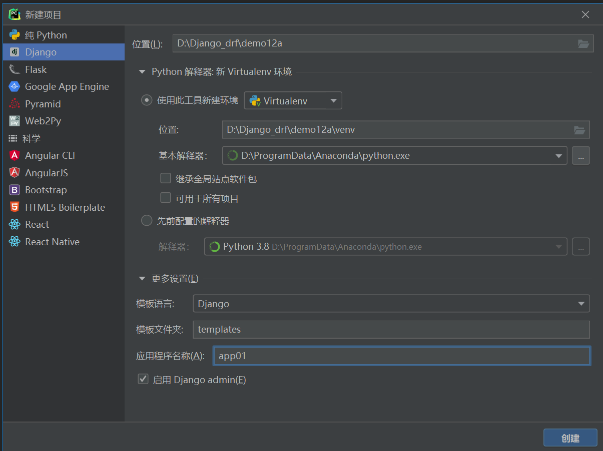
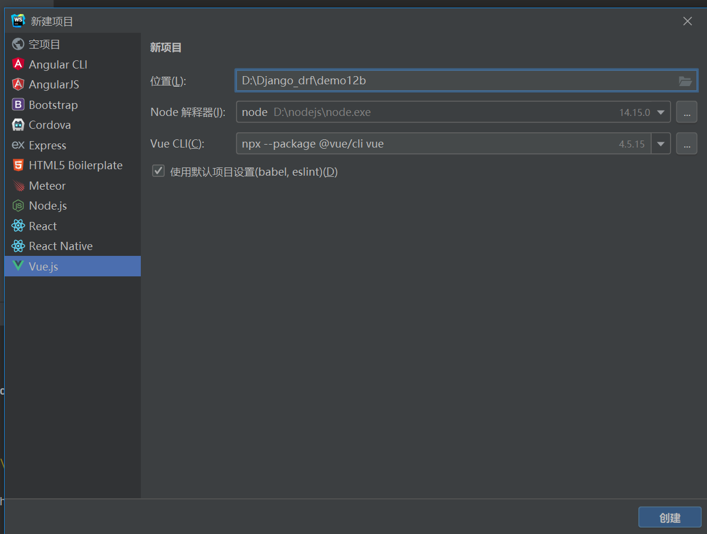
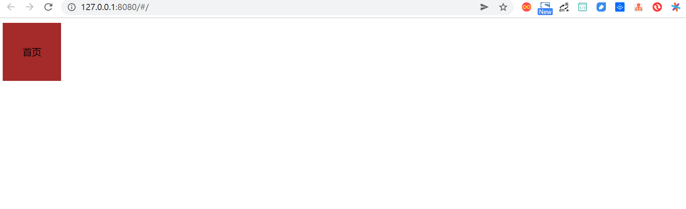
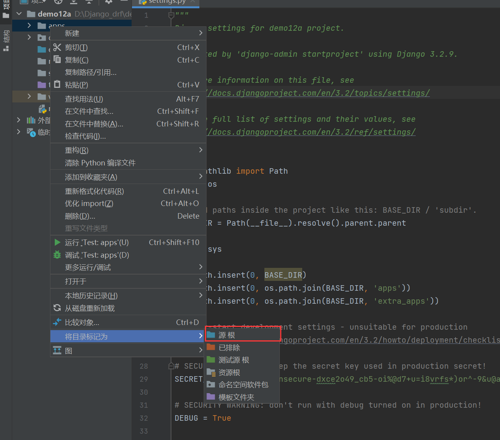
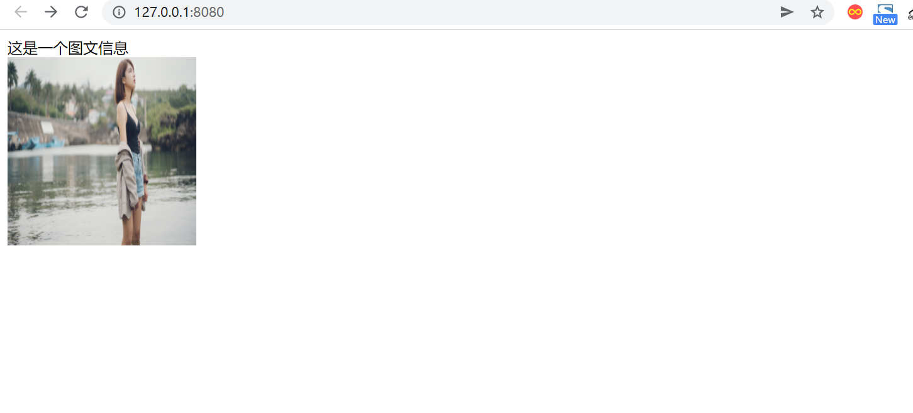

# 附2.前后端分离项目上线部署到云服务器

当一个项目开发完成后，接下来要做的事情就是将项目上线部署到云服务器上。国内的网站部署到云服务器上，一般都会选择两个比较主流的系统:

- Ubuntu系统
- CentOS系统。


这两个系统都是基于Linux的系统，交互方式也都是基于Linux命令行的形式。

我们新建一个前后端分离的项目实例，然后部署到Ubuntu系统上，以此分析Django项目上线部署到云服务器相关的知识点。


## 1.准备一个前后端分离项目


### 1.1 准备一个最基础的前后端分离项目

一个前后端分离项目，其实是由两个相对独立的项目组成。不论是前端项目，还是后端项目，如果独立运行，理论上都可以完成一个网站所需的一切功能。所以，新建一个最基础的前后端分离项目，其本质就是分别建立一个后端项目和一个前端项目。具体步骤如下：

（1）使用PyCharm新建Django项目，命名为demo12a，新建App并名为app01



（2）安装Django REST framework及其依赖包markdown和Django-filter。

```
pip install djangorestframework markdown Django-filter
```

（3）在settings中注册rest_framework，如下：

```
INSTALLED_APPS = [
    'django.contrib.admin',
    'django.contrib.auth',
    'django.contrib.contenttypes',
    'django.contrib.sessions',
    'django.contrib.messages',
    'django.contrib.staticfiles',
    'app01.apps.App01Config',
    'rest_framework'
]
```

注意： 目前为止，Ubuntu系统18.04版本内置了Python 2.7和Python 3.6。为了方便起见，我们在新建Django项目的时候，可以把Python环境切换成Python 3.6，这样在部署的时候可以方便很多。当然，也可以在Ubuntu系统上安装Python 3.7，只是多了一些步骤

（4）如图所示，新建Vue项目demo12b：

```
cnpm install –global vue-cli

vue init webpack demo12b

cd demo12b

cnpm install
```



（5）在demo12中安装axios：

```
# 更换npm的源
npm config set registry https://registry.npm.taobao.org/
cnpm install axios --save
```

（6）初始化demo12项目，将src/App.vue内的代码修改为：

```
<template>
  <div id="app">
    <div class="t">{{ title }}</div>
  </div>
</template>

<script>
import Axios from 'axios';


export default {
  name: 'App',
  data() {
    return {
      title: '首页'
    }
  },
  methods: {
    GetData() {
      const host = 'http://127.0.0.1:8000'
      var api = host + '/getgoodlist/';
      Axios.get(api)
          .then(function (response) {
            console.log(response)
          })
          .catch(function (error) {
            console.log(error);
          });
    }
  },
  mounted() {
    // this.GetData
  }
}
</script>

<style>
.t {
  width: 100px;
  height: 100px;
  background-color: brown;
  line-height: 100px;
  text-align: center;
}
</style>
```

（7）启动项目demo12b：

```
vue-cli-service serve
或者
vue-cli-service serve
```

使用浏览器访问 [http://127.0.0.1:8080/#/ ](http://127.0.0.1:8080/#/)，即显示我们所初始化的前端首页。



### 1.2 对前后端分离项目进行改造

实际上，一个公司开发一款用于商业的前后端分离项目，前端部分要从后端获取数据和媒体文件，后端项目也极少只有一个App的情况，而且使用的数据库也不会是Django自带的SQLite3，大多为MySQL。我们对新建的前后端分离项目进行完善和改造，让这个项目更贴近实际项目的需求，步骤如下所述。

（1）下载和安装MySQL5.7

下载地址为[https://dev.mysql.com/downloads/mysql/5.7.html#downloads ](https://dev.mysql.com/downloads/mysql/5.7.html#downloads)，对于MySQL的安装，网上有很多教程各不相同，笔者建议采用最方便的方法进行安装，即双击安装包以后，所有的选项都选择默认的，提示设置密码的时候自行设置密码。

2）新建MySQL数据库12a，如下：

```
show databases;

create database 12a default character set utf8 collate utf8_general_ci;

show databases;
```

（3）demo12a连接MySQL数据库，在settings中将数据库配置代码修改为：

将原本的数据库配置代码注释掉，然后填入新的配置代码，否则后面填入的配置代码是不起作用的。

```
# DATABASES = {
#     'default': {
#         'ENGINE': 'django.db.backends.sqlite3',
#         'NAME': BASE_DIR / 'db.sqlite3',
#     }
# }


DATABASES = {
    'default': {
        'ENGINE': 'django.db.backends.mysql',
        'NAME': '12a',
        'USER': 'root',
        'PASSWORD': 'OSChina@2020',
        'HOST': '127.0.0.1',
        # 第三方登录功能必须加上
        "OPTIONS": {"init_command": "SET default_storage_engine=INNODB;"}
    }
}
```

然后，安装PyMYSQL：

```
pip install PyMYSQL
```

在demo12a/demo12a/\_\_init\_\_.py中加入代码：

```
import pymysql

pymysql.install_as_MySQLdb()
```

> 提示pychrm支持mysql的数据连接驱动
>
> PyCharm的Database面板中可以打开与MySQL管理连接的面板。
>
> 输入要连接的MySQL数据库信息，然后单击Test Connection按钮，如果出现：Successful Detail，则证明项目demo12a已经成功与MySQL数据库

（4）因为在实际项目中，很少有一个后端项目中只有一个App的情况，所以我们要新建一个App命名为goods，作为实验使用。

```
python manage.py startapp goods
```

（5）整理demo12a项目的目录。

- 新建目录apps，然后将app01和goods目录都导入apps目录下；

- 新建extra_apps目录，用来存放第三方应用文件；

- 新建static目录，用来存放静态文件；

- 新建media目录，用来存放媒体文件。


（6）配置demo12a相关的目录。

首先，在settings文件中追加代码，配置静态文件和媒体文件路径：

```
STATIC_ROOT=os.path.join(BASE_DIR,'static')
STATICFILES_DIR=[os.path.join(BASE_DIR,'static'),]

MEDIA_URL='/media/'
MEDIA_ROOT=os.path.join(BASE_DIR,'media')
```

在settings文件中插入路径配置代码：

```
import sys

sys.path.insert(0,BASE_DIR)
sys.path.insert(0,os.path.join(BASE_DIR,'apps'))
sys.path.insert(0,os.path.join(BASE_DIR,'extra_apps'))
```

分别Mark一下apps和extra_apps目录。



（7）在apps/goods/models.py内新建一个图文的数据类，代码如下：

```
from django.db import models
from datetime import datetime


# Create your models here.

class TuWen(models.Model):
    """
    图文表
    """
    image = models.ImageField(max_length=200, upload_to='images/', verbose_name='图片')
    title = models.CharField(max_length=200, blank=True, null=True, verbose_name='文本')
    add_time = models.DateTimeField(default=datetime.now, verbose_name='添加时间')

    class Meta:
        verbose_name = "图文信息"
        verbose_name_plural = verbose_name

    def __str__(self):
        return self.title

```

修改setting.py文件,新增goods应用

```
INSTALLED_APPS = [
    'django.contrib.admin',
    'django.contrib.auth',
    'django.contrib.contenttypes',
    'django.contrib.sessions',
    'django.contrib.messages',
    'django.contrib.staticfiles',
    'apps.app01.apps.App01Config',
    'rest_framework',
    'goods'
]
```


安装处理图片的依赖包Pillow，如下：

```
pip install Pillow
```

执行数据更新命令：

```
# 生成数据建库文件
python manage.py makemigrations

#迁移文件到数据库
python manage.py migrate
```

（8）加入实验数据。建立超级用户，用户名root，密码root1234：

```
python manage.py createsuperuser
```

运行demo12a，然后使用浏览器访问 [http://127.0.0.1:8888/admin ](http://127.0.0.1:8000/admin)，使用超级用户的用户名和密码登录。


在apps/goods/admin.py中加入models的注册信息：

```python
from django.contrib import admin
from .models import TuWen

# Register your models here.

admin.site.register(TuWen)
```

然后刷新浏览器，即可看到图文信息。


添加一条图文信息记录作为实验数据。


（9）在apps/app01目录下新建序列化文件serializers.py，序列化图文表，代码如下：

```python
from rest_framework import serializers
from apps.goods.models import TuWen


class TuWenModelSerializer(serializers.ModelSerializer):
    class Meta:
        model = TuWen
        fields = "__all__"
```

（10）在apps/app01/views.py中编写获取图文列表的视图类，代码如下：

```python
from django.shortcuts import render
from apps.goods.models import TuWen  # 引入图文
from .serializers import TuWenModelSerializer  # 引入图文表的序列化类

# 引入drf的功能组件
from rest_framework.views import APIView
from rest_framework.response import Response
from rest_framework.renderers import JSONRenderer


# Create your views here.
class GetTuWenView(APIView):
    """
    获取图文列表
    """
    renderer_classes = [JSONRenderer]  # 渲染器

    def get(self, request):
        t_list = TuWen.objects.all()
        re = TuWenModelSerializer(t_list, many=True)
        return Response(re.data)
```

（11）在urls.py内配置路由代码如下：

```python
from django.contrib import admin
from django.urls import path

# 配置媒体文件路径
from django.views.static import serve
from demo12a.settings import MEDIA_ROOT

# 获取图文信息的视图类
from app01.views import GetTuWenView

urlpatterns = [
    path('admin/', admin.site.urls),
    path('media/<path:path>', serve, {'document_root': MEDIA_ROOT}),
    path('getdata/', GetTuWenView.as_view())
]
```

（12）测试。启动项目，访问：http://127.0.0.1:8000/getdata/，即可获取图文数据

```
[{"id":1,"image":"/media/images/96440.jpg","title":"这是一个图文信息","add_time":"2021-11-22T16:39:07Z"}]
```

（13）解决跨域。安装跨域模块：

```
pip install django-cors-headers
```

在settings中注册跨域模块：

```
# Application definition
INSTALLED_APPS = [
    'django.contrib.admin',
    'django.contrib.auth',
    'django.contrib.contenttypes',
    'django.contrib.sessions',
    'django.contrib.messages',
    'django.contrib.staticfiles',
    'apps.app01.apps.App01Config',
    'rest_framework',
    'goods',
    'corsheaders'
]
```

在settings.py增加中间件的配置代码：

```
MIDDLEWARE = [
    'corsheaders.middleware.CorsMiddleware',  # 放到中间件顶部
    'django.middleware.security.SecurityMiddleware',
    'django.contrib.sessions.middleware.SessionMiddleware',
    'django.middleware.common.CommonMiddleware',
    'django.middleware.csrf.CsrfViewMiddleware',
    'django.contrib.auth.middleware.AuthenticationMiddleware',
    'django.contrib.messages.middleware.MessageMiddleware',
    'django.middleware.clickjacking.XFrameOptionsMiddleware',
]
```

在settings.py中新增配置项，即可解决本项目中的跨域问题。

```
CORS_ORIGIN_ALLOW_ALL = True
```

(14）修改前端项目demo12b/src/App.vue中的代码，让其访问后端API：

```
<template>
  <div id="app">
    <div v-for="(item,index) in twdata" :key="index">
      <div>{{ item.title }}</div>
      
    </div>
  </div>
</template>

<script>
import Axios from 'axios';


export default {
  name: 'App',
  data() {
    return {
      title: '首页',
      twdata: []
    }
  },
  methods: {
    GetData() {
      var that = this
      const host = 'http://127.0.0.1:8888'
      var api = host + '/getdata/';
      Axios.get(api)
          .then(function (response) {
            for (var i = 0; i < response.data.length; i++) {
              response.data[i].image = host + response.data[i].image
              // console.log(response.data)
              that.twdata = response.data
            }
          })
          .catch(function (error) {
            console.log(error);
          });
    }
  },
  mounted() {
    this.GetData()
  }
}
</script>

<style>
.t {
  width: 100px;
  height: 100px;
  background-color: brown;
  line-height: 100px;
  text-align: center;
}

img {
  width: 200px;
  height: 200px;
}
</style>
```

（15）测试。运行demo12b，访问 [http://127.0.0.1:8080/#/ ](http://127.0.0.1:8080/#/)，可以看到从后端传过来的图文信息



## 2.云服务器的准备

### 2.1 购买云服务器(阿里云、腾讯云)

任意选择其中一个厂商的云服务器。

规格为1GB内存，系统盘为40GB的硬盘，系统选择Ubuntu20.04，带宽为5Mbit/s。

### 2.2 服务器端安装MySQL 5.7

（1）服务器安装MySQL代码如下：

```
apt-get install mysql-server -y

apt-get install mysql-client -y

apt-get install libmysqlclient-dev -y
```

(2) 配置MySQL密码。安装MySQL 5.7的过程中是没有让用户输入初始密码这一步骤的，成功安装MySQL 5.7之后，以root的身份，输入命令：

````
mysql
show databases;

use mysql;

update user set authentication_string=PASSWORD("与本地数据库密码一致") where user='root';

update user set plugin="mysql_native_password";

flush privileges;

quit;
````

重新启动MySQL服务：

```
/etc/init.d/mysql restart
```

使用修改后的密码登录MySQL，然后退出：

``` 
mysql -u root -p
//输入设置的密码+回车quit;
```


### 2.3 压缩项目

通过文件夹的形式将项目从本地迁移到服务器端并不是不可以的，但是会很麻烦。所以我们需要将项目压缩为zip包，方便从本地传输到服务器端。在这之前，还需要对demo12a进行一些操作。

（1）在demo12a/settings中配置：

```
DEBUG = False
ALLOWED_HOSTS = ["公网IP"]
```


（2）将项目的所有依赖库导出为文本文件，执行命令：

``` 
pip freeze >requirements.txt
```

在项目目录下会生成一个文件名为requirements.txt的文本文件，内容为：

```
asgiref==3.4.1
Django==3.2.9
django-cors-headers==3.10.0
django-filter==21.1
djangorestframework==3.12.4
importlib-metadata==4.8.2
Markdown==3.3.6
Pillow==8.4.0
PyMySQL==1.0.2
pytz==2021.3
sqlparse==0.4.2
zipp==3.6.0
```

（3）将demo12a压缩为一个zip包。

（4）将demo12b目录下的node_modules目录删除，然后将demo12b压缩为一个zip包。


### 2.4 上传部署包到服务器端

使用FileZilla将demo12a.zip和demo12b.zip传到服务器端


### 2.5 远程同步数据库

 (1) 修改MySQL的配置文件，注释掉绑定本地IP的语句：

```
vim /etc/mysql/mysql.conf.d/mysqld.cnf
注释掉 bind-address = 127.0.0.1
```

（2）设置远程密码：

```
mysql -u root -p #输入密码（不显示），登录MySQL

GRANT ALL PRIVILEGES ON *.* TO 'root'@'%' IDENTIFIED BY '123456' WITH GRANT OPTION;
flush privileges;quit;
```


（3）打开云控制台中的“安全组”页面，查看入口的端口,开启相应的端口。

（4）使用Navicat新建MySQL连接，连接远程数据库。进行数据的同步，或者导出数据sql文件，导入到云平台中。*使用mysqldump*

（5）关闭远程访问权限：

```
vim /etc/mysql/mysql.conf.d/mysqld.cnf
#去掉 bind-address = 127.0.0.1这行的注释
```


## 3. 正式开始部署

### 3.1 部署前端项目demo12b

（1）安装node、npm、cnpm代码如下：

```
apt install nodejs
apt-get install npm

node –v
npm –v
npm install cnpm -g --registry=HTTPS://registry.npm.taobao.org;
cnpm -v
```

（2）解压demo12b.zip文件：

```
cd /home
apt install unzip
unzip demo12b.zip
```

（3）安装demo12b的依赖包：

```
cd demo12b
cnpm install demo12b
```

（4）将路由模式改成history模式：

```
vim src/router/index.js
#加入mode: 'history'
```

（5）执行命令：

``` 
vim src/App.vue
```

将host中的回环地址改为公网IP地址。

（6）打包：

```
npm run build
```

如果打包成功，会生成一个dist目录，dist目录下有index.html和static目录。


（7）安装Nginx如下：

``` 
apt-get install -y  nginx
```

（8）删除default，代码如下：

```
#防止错误，先把default文件删除
cd /etc/nginx/sites-available/
rm default 

cd /etc/nginx/sites-enabled/
rm default 
```

（9）新建配置文件如下：

cd /etc/nginx/sites-available/

vim demo12.conf

```
server {
        listen       80;
        server_name  公网IP;
        
        location / {
            root /home/demo12b/dist;
            index index.html;
        }
   }
```

然后按Esc键，输入:wq保存并退出。

（10）建立软连接如下：

```
cd /etc/nginx/
ln -s /etc/nginx/sites-available/demo12.conf /etc/nginx/sites-enabled/ demo12.conf

ls sites-enabled/

nginx -t                                                                
#查看Nginx运行情况

service nginx restart                                   
#重启Nginx
```

（11）通过浏览器访问公网IP地址，通过按F12键，打开开发者模式，可以看到因为没有启动后端项目，所以报出了错误，没显示图片资源


### 3.2 部署后端项目demo12a

接下来就是部署后端项目demo12a，部署完demo12a以后，前后端分离项目才算正式完成了上线部署。部署后端项目，*首先要配置虚拟环境，安装配置uwsgi，配置Nginx*，具体步骤如下：

（1）解压demo12a.zip文件：

```
cd /home
unzip demo12a.zip
```

（2）安装配置虚拟环境如下：

```
#安装虚拟环境
apt-get install -y Python3-venv

#在当前目录下，创建一个Python3.6的虚拟环境，命名为env36
Python3 -m venv env36
. env36/bin/activate

#进入虚拟环境
#退出虚拟环境 
deactivate

cd demo12a
pip3 install -r requirements.txt
```

（3）运行测试。执行运行项目命令：

```
Python manage.py runserver 0.0.0.0:8888
```

通过浏览器访问公网IP，即可看到完整的项目首页，同时控制台也不报错。


（4）安装uwsgi到系统环境下：

```
#退出虚拟环境
deactivate
cd ..
apt install -y Python3-pip

pip3 install uwsgi

#使用uwsgi启动项目
uwsgi --chdir /home/demo12a --home /home/env36 --http :8000 --module demo12a.wsgi

#/home/demo12a 代表项目路径
#/home/env36 代表虚拟环境路径
```

（5）配置uwsgi如下：

```
cd /home
mkdir demo12_uwsgi              #创建一个目录，专门存放uwsgi的相关文件
cd demo12_uwsgi/
```

vim demo12.ini                 

```
[uwsgi]
#项目目录
chdir= /home/demo12a

#wsgi目录
module = demo12a.wsgi:application

#虚拟环境
home = /home/env36
master = true
processes = 1
socket= 0.0.0.0:9000
vacuum= true

#后台运行uwsgi
daemonize=yes
```

（6）执行通过ini启动项目命令：

```
uwsgi --ini /home/demo12_uwsgi/demo12.ini
```

（7）执行检验是否启动了多线程的命令，显示有多条线程运行，代表成功启动了多线程。

```
ps -aux | grep uwsgi
```

（8）修改Nginx配置文件，在原本的配置代码后增加如下代码：

```
server {
        listen       80;
        server_name  公网IP;
        
        location / {
            root /home/demo12b/dist;
            index index.html;
        }
   }

--------------------------------------------------------
如下为新增的代码

server{
  listen 8000;
  server_name 114.115.163.50;
  charset utf-8;
  client_max_body_size 75M;

      location /static {
          alias /home/demo12a/static;
      }

  location /media {
        alias /home/demo12a/media;
  }
  
  location / {
      uwsgi_pass 127.0.0.1:9000;
      include /etc/nginx/uwsgi_params;
  }
}
```

然后重启Nginx服务：

```
service nginx restart #重启Nginx
```

（9）为了显示后台管理页面的样式，还需要收集静态文件：

```
cd /home
. env36/bin/activate
cd chaoyuecun
python manage.py collectstatic
```

至此，我们前后端分离项目上线部署成功。

## 4. 使用Docker部署

> 参考文献：
>
> http://www.liuqingzheng.top/python/%E8%B7%AF%E9%A3%9E%E9%A1%B9%E7%9B%AE/9-%E4%B8%8A%E7%BA%BF/1-docker/