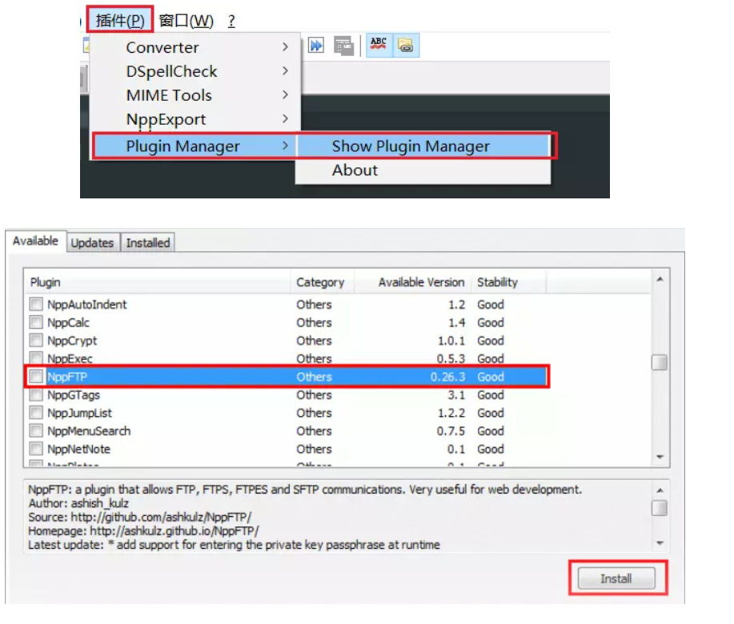

# Notpad++和Python实现远程开发

## 安装 Python 3.6.2

	CentOS 7.2 操作系统自带的 Python 版本为 2.7.5，
	。即安装完 Python 3.6.2 后，系统上同时存在 Python 2.7.5 和 Python 3.6.2 两个版本。

	#安装依赖包
	yum -y groupinstall "Development tools"
	yum -y install zlib-devel bzip2-devel openssl-devel ncurses-devel sqlite-devel readline-devel tk-devel gdbm-devel db4-devel libpcap-devel xz-devel


	#下载 Python 3.6.2
	wget https://www.python.org/ftp/python/3.6.2/Python-3.6.2.tar.xz


	#创建安装目录
	mkdir /usr/local/python3

	#安装 gcc
	yum -y install gcc


	#安装 Python 3.6.2
	解压 Python 3.6.2 并安装在 /usr/local/python3 目录下。

	tar -xvJf  Python-3.6.2.tar.xz
	cd Python-3.6.2
	./configure --prefix=/usr/local/python3
	make && make install

	
	#创建软连
	ln -s /usr/local/python3/bin/python3 /usr/bin/python3
	ln -s /usr/local/python3/bin/pip3 /usr/bin/pip3
	
	# 测试python3
	[root@iZuf699cacb5huocqld4j2Z ~]# python3 --version
	Python 3.6.2
	
	
	[root@iZuf699cacb5huocqld4j2Z ~]# python3
	Python 3.6.2 (default, Mar  9 2019, 10:49:19) 
	[GCC 4.8.5 20150623 (Red Hat 4.8.5-36)] on linux
	Type "help", "copyright", "credits" or "license" for more information.
	>>> 


## 安装 MySQL
    yum install mysql-devel
    wget http://dev.mysql.com/get/mysql-community-release-el7-5.noarch.rpm
    rpm -ivh mysql-community-release-el7-5.noarch.rpm
    yum -y install mysql-community-server
    pip3 install mysqlclient
    service mysqld restart


**安装 MySQL 会比较久，大概 10 分钟左右，当看到 “Complete!” 后，表示安装成功。**

__测试 MySQL 安装是否成功：__

    systemctl status mysqld.service


## 安装 Tornado 

    升级pip版本
    pip3 install --upgrade pip  
    
    CentOS 下还无法直接使用 yum install tornado，但可以使用 pip 安装 Tornado。
    先执行 pip3 install --upgrade pip 命令升级 pip，再执行 pip3 install tornado 命令安装 Tornado。
    pip3 install tornado
    
    #检测是否安装完成
    [root@iZuf699cacb5huocqld4j2Z ~]# python3
    Python 3.6.2 (default, Mar  9 2019, 10:49:19) 
    [GCC 4.8.5 20150623 (Red Hat 4.8.5-36)] on linux
    Type "help", "copyright", "credits" or "license" for more information.
    >>> import tornado
    >>> 
    执行 import tornado 没有报错，表示 Tornado 已安装成功。


## 安装 SQLAlchemy

    使用 pip3 安装 SQLAlchemy：
    pip3 install SQLAlchemy
    
    #测试 SQLAlchemy 是否安装成功，服务器端依次输入如下命令。
    
    python3
    import sqlalchemy


## 配置 Notepad++


    安装远程编辑功能插件 NppFTP
    打开 Notepad++，依次选择“插件” -> “Plugin Manager” -> “Show Plugin Manager”，找到NppFTP。
    即可进行上传、下载文件文件的编辑。

    
    配置远程远端服务器
    打开 NppFTP 插件面板

## 上传下载远端目录文件

```
yum -y install lrzsz 
#安装 lrzsz，lrzsz 包的
rz 命令能支持从本地 Windows 上传小文件到远端服务器，
sz 命令支持从远端服务器下载小文件到本地 Windows 上。

常用参数
-b：以二进制方式，默认为文本方式（Binary (tell it like it is) file transfer override.）
-e：对所有控制字符转义（Force sender to escape all control characters; normally XON, XOFF, DLE, CR-@-CR, and Ctrl-X are escaped.）

#如果要保证上传的文件内容在服务器端保存之后与原始文件一致，最好同时设置这两个标志，如下所示方式使用：
rz -be
```


