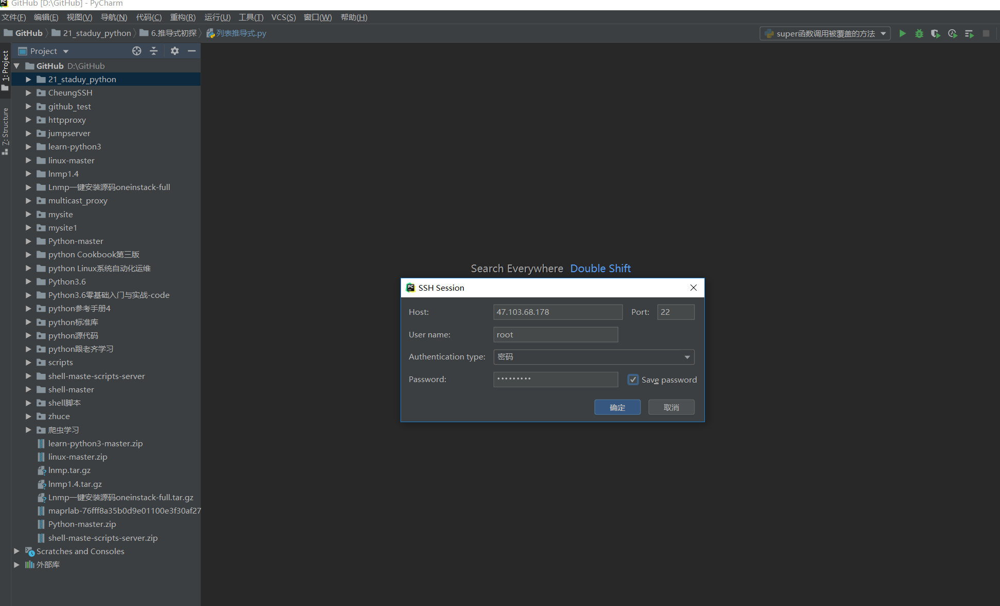
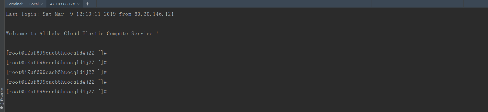
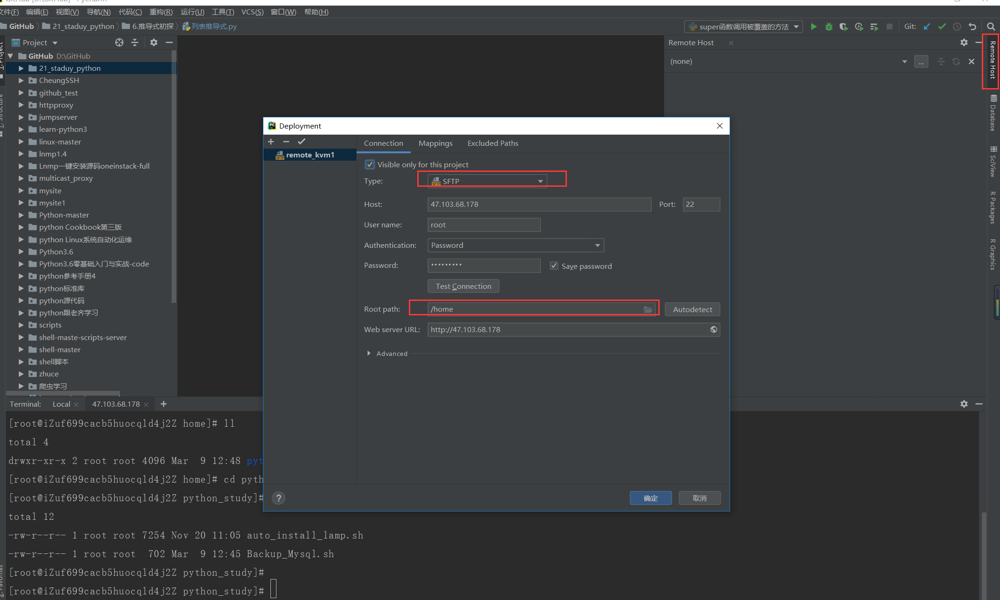
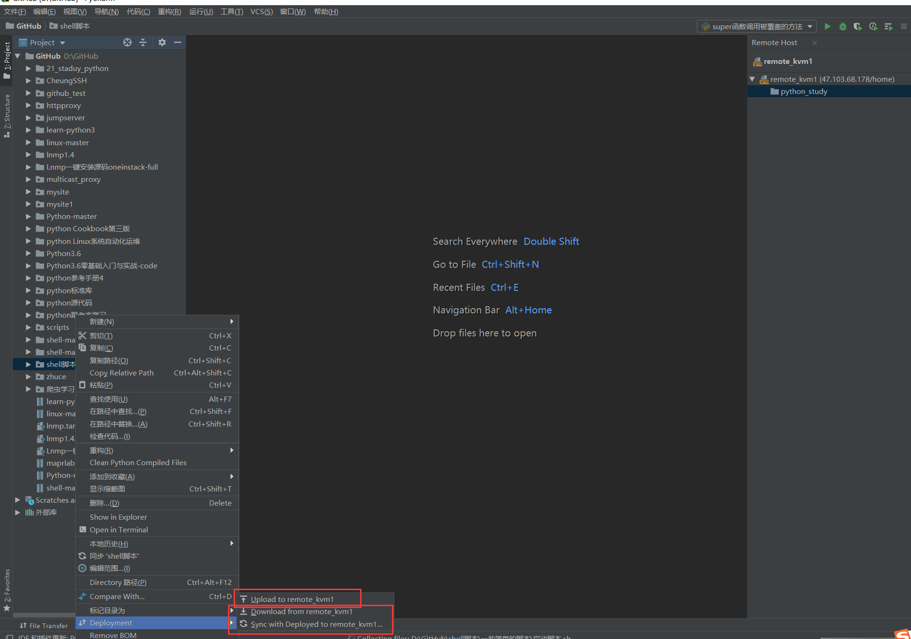
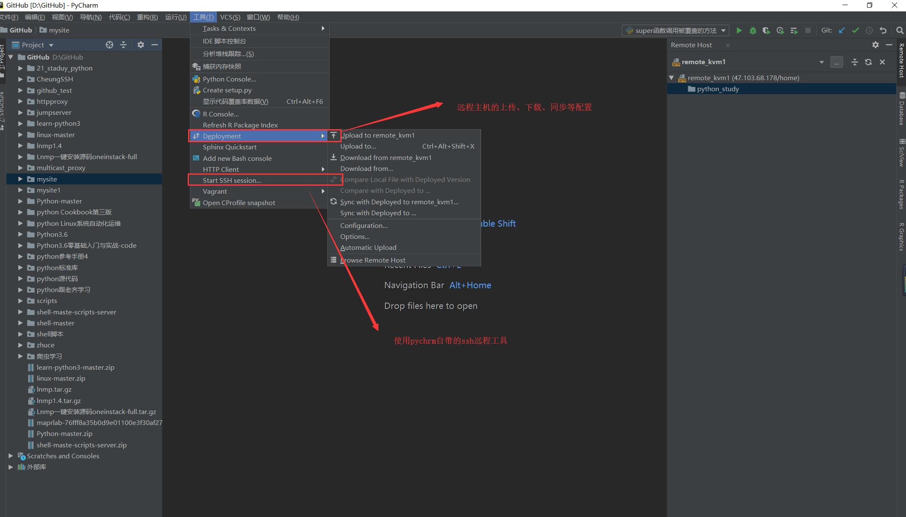

# PyCharm+python远程云主机调试开发

**1.开启SSH。**

**2.配置SFTP远程上传下载**

## 开启SSH远程云主机   
**配置相关信息**

## 开启SFTP远程上传、下载

[参考博客：如何远程调试Python代码](https://blog.51cto.com/nolinux/1768708)

Pycharm专业版配置远程服务器并自动同步代码

https://www.cnblogs.com/xiao987334176/p/11091528.html
