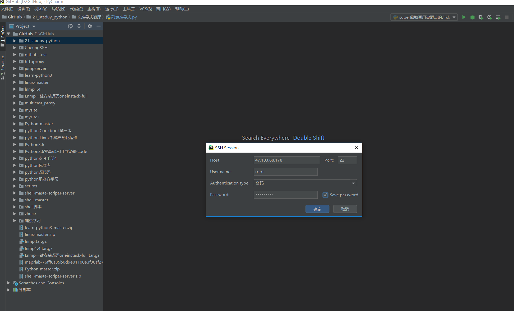
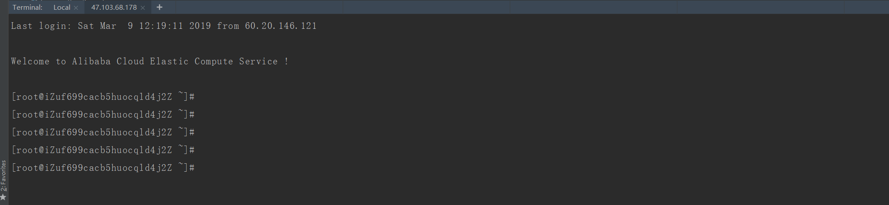
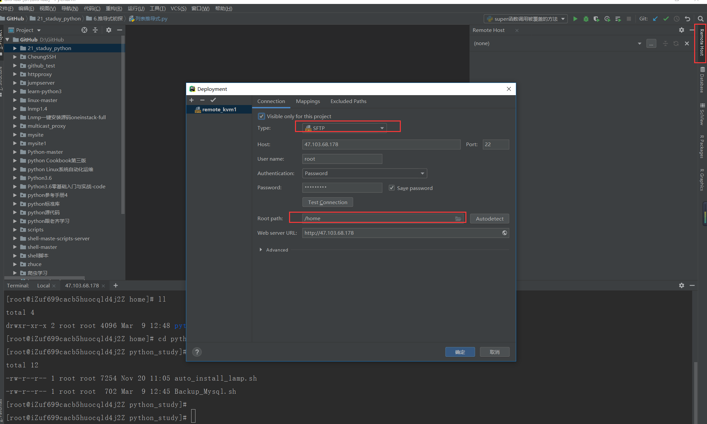
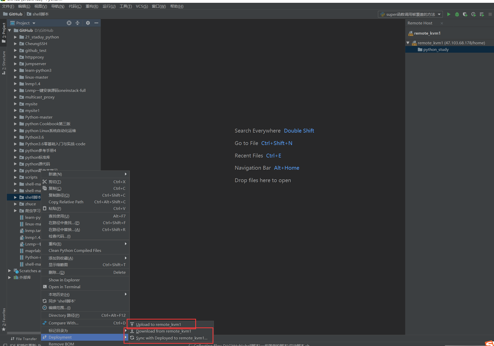
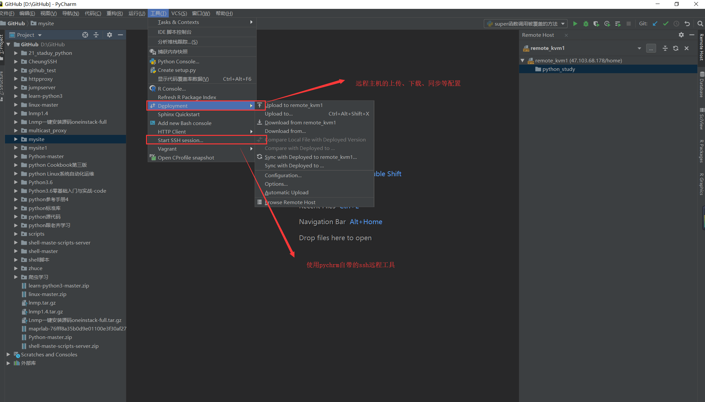

.. contents::
   :depth: 3
..

PyCharm+python远程云主机调试开发
================================

**1.开启SSH。**

**2.配置SFTP远程上传下载**

开启SSH远程云主机
-----------------

**配置相关信息** |image1| |image2|

开启SFTP远程上传、下载
----------------------

|image3| |image4| |image5|

`参考博客：如何远程调试Python代码 <https://blog.51cto.com/nolinux/1768708>`__

Pycharm专业版配置远程服务器并自动同步代码

https://www.cnblogs.com/xiao987334176/p/11091528.html

