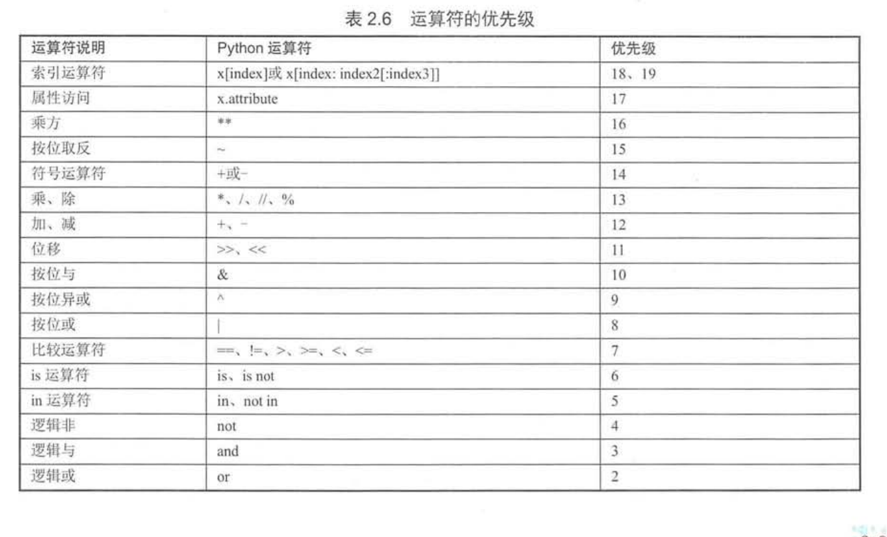

# 02.变量和简单类型

## 1.单行注释和多行注释

·单行注释

·多行注释

``` 
# 这是一行简单的注释
print("Hello World!")
'''
这里面的内容全部是多行注释
Python语言真的很简单
'''
# print("这行代码被注释了，将不会被编译、执行!")
"""
这是用三个双引号括起来的多行注释
Python同样是允许的。
"""
```

## 2.Python是弱类型语言
``` 
print(value, ···, sep=' ', end='\n', file=sys.stdout, flush=False)
# sep 改变默认分隔符
# end 完成后是否换行
# file 函数输出目标
# flush 控制输出缓存
```

``` 
# coding: utf-8
user_name = 'Charlie'
user_age = 8
# 同时输出多个变量和字符串
print("读者名:" , user_name, "年龄:", user_age)
# 同时输出多个变量和字符串，指定分隔符
print("读者名:" , user_name, "年龄:", user_age, sep='|')
# 指定end参数，指定输出之后不再换行
print(40, '\t', end="")
print(50, '\t', end="")
print(60, '\t', end="")
f = open("poem.txt", "w") # 打开文件以便写入
print('沧海月明珠有泪', file=f)
print('蓝田日暖玉生烟', file=f)
f.close()
```

## 3.Python变量的特征
·无需声明，即可使用

·类型随时可变

``` 
# 定义一个数值类型变量
a = 5
print(a)
# 重新将字符串值赋值给a变量
a = 'Hello, Charlie'
print(a)
print(type(a))
```

## 4.Python变量的命名规则
·标识符由字母、数字、下划线构成

·可由字母、下划线开头

·标识符不能是关键字，但可包含关键字

·标识符不能包含空格

## 5.Python的关键字和内置函数
·关键字：
``` 
>>> import keyword
>>> keyword.kwlist
['False', 'None', 'True', 'and', 'as', 'assert', 'break', 'class', 'continue', 'def', 'del', 'elif', 'else', 'except', 'finally', 'for', 'from', 'global', 'if', 'import', 'in', 'is', 'lambda', 'nonlocal', 'not', 'or', 'pass', 'raise', 'return', 'try', 'while', 'with', 'yield']
```

·内置函数
``` 
>>> dir(__builtins__)
['ArithmeticError', 'AssertionError', 'AttributeError', 'BaseException', 'BlockingIOError', 'BrokenPipeError', 'BufferError', 'BytesWarning', 'ChildProcessError', 'ConnectionAbortedError', 'Connection Error', 'ConnectionRefusedError', 'ConnectionResetError', 'DeprecationWarning', 'EOFError', 'Ellipsis', 'EnvironmentError', 'Exception', 'False', 'FileExistsError', 'FileNotFoundError', 'FloatingPoint Error', 'FutureWarning', 'GeneratorExit', 'IOError', 'ImportError', 'ImportWarning', 'IndentationError', 'IndexError', 'InterruptedError', 'IsADirectoryError', 'KeyError', 'KeyboardInterrupt', 'Lookup Error', 'MemoryError', 'ModuleNotFoundError', 'NameError', 'None', 'NotADirectoryError', 'NotImplemented', 'NotImplementedError', 'OSError', 'OverflowError', 'PendingDeprecationWarning', 'PermissionError', 'ProcessLookupError', 'RecursionError', 'ReferenceError', 'ResourceWarning', 'RuntimeError', 'RuntimeWarning', 'StopAsyncIteration', 'StopIteration', 'SyntaxError', 'SyntaxWarning', 'SystemError', 'SystemExit', 'TabError', 'TimeoutError', 'True', 'TypeError', 'UnboundLocalError', 'UnicodeDecodeError', 'UnicodeEncodeError', 'UnicodeError', 'UnicodeTranslateError', 'UnicodeWarning', 'UserWarning', 'ValueError', 'Warning', 'WindowsError', 'ZeroDivisionError', '__build_class__', '__debug__', '__doc__', '__import__', '__loader__', '__name__', '__package__', '__spec__', 'abs', 'all', 'any', 'ascii', 'bin', 'bool', 'bytearray', 'bytes', 'callable', 'chr', 'classmethod', 'compile', 'complex', 'copyright', 'credits', 'delattr', 'dict', 'dir', 'divmod', 'enumerate', 'eval', 'exec', 'exit', 'filter', 'float', 'format', 'frozenset', 'getattr', 'globals', 'hasattr', 'hash', 'help', 'hex', 'id', 'input', 'int', 'isinstance', 'issubclass', 'iter', 'len', 'license', 'list', 'locals', 'map', 'max', 'memoryview', 'min', 'next', 'object', 'oct', 'open', 'ord', 'pow', 'print', 'property', 'quit', 'range', 'repr', 'reversed', 'round', 'set', 'setattr', 'slice', 'sorted', 'staticmethod', 'str', 'sum', 'super', 'tuple', 'type', 'vars', 'zip']
```
## 6. Python支持的各种数值类型
·整型

·浮点型

·复数（j J）

·字符串


## 7.Python字符串入门

## 8.拼接字符串的方法
·紧挨自动拼接，一般使用 +

## 9.repr和字符串
· 函数repr() 数值转字符串


## 10.使用input和raw_input获得用户输入
``` 
msg = input("请输入你的值：")
# raw_input用于python2.x
# Python3将raw_input和input进行整合成了input....去除了raw_input()函数....
# 其接受任意输入, 将所有输入默认为字符串处理,并返回字符串类型
```

## 11.长字符串和原始字符串

·表示长字符串 \ 长字符串不会换行

``` 
s = '''"Let's go fishing", said Mary.
"OK, Let's go", said her brother.
they walked to a lake'''
print(s)
s2 = 'The quick brown fox \
jumps over the lazy dog'
print(s2)
num = 20 + 3 / 4 + \
    2 * 3
print(num)
```

·原始字符串（字节为单位）bytes
``` 
# 创建一个空的bytes
b1 = bytes()
# 创建一个空的bytes值
b2 = b''
# 通过b前缀指定hello是bytes类型的值
b3 = b'hello'
print(b3)
print(b3[0])
print(b3[2:4])
# 调用bytes方法将字符串转成bytes对象
b4 = bytes('我爱Python编程',encoding='utf-8')
print(b4)
# 利用字符串的encode()方法编码成bytes，默认使用utf-8字符集
b5 = "学习Python很有趣".encode('utf-8')
print(b5)


# 将bytes对象解码成字符串，默认使用utf-8进行解码。
st = b5.decode('utf-8')
print(st) # 学习Python很有趣
```

## 12.字符串的相关方法
·in

·len()

·dir()

·help()

### 12.1 转义字符


### 12.3 字符串格式化
``` 
# coding: utf-8
#########################################################################
# 网站: <a href="http://www.crazyit.org">疯狂Java联盟</a>               #
# author yeeku.H.lee kongyeeku@163.com                                  #
#                                                                       #
# version 1.0                                                           #
#                                                                       #
# Copyright (C), 2001-2018, yeeku.H.Lee                                 #
#                                                                       #
# This program is protected by copyright laws.                          #
#                                                                       #
# Program Name:                                                         #
#                                                                       #
# <br>Date:                                                             #
#########################################################################
price = 108
print("the book's price is %x" % price)
user = "Charli"
age = 8
# 格式化字符串有两个占位符，第三部分提供2个变量
print("%s is a %s years old boy" % (user , age))
num = -28
print("num is: %6i" % num)
print("num is: %6d" % num)
print("num is: %6o" % num)
print("num is: %6x" % num)
print("num is: %6X" % num)
print("num is: %6s" % num)
num2 = 30
# 最小宽度为0，左边补0
print("num2 is: %06d" % num2)
# 最小宽度为6，左边补0，总带上符号
print("num2 is: %+06d" % num2)
# 最小宽度为6，右对齐
print("num2 is: %-6d" % num2)
my_value = 3.001415926535
# 最小宽度为8，小数点后保留3位
print("my_value is: %8.3f" % my_value)
# 最小宽度为8，小数点后保留3位，左边补0
print("my_value is: %08.3f" % my_value)
# 最小宽度为8，小数点后保留3位，左边补0，始终带符号
print("my_value is: %+08.3f" % my_value)
the_name = "Charlie"
# 只保留3个字符
print("the name is: %.3s" % the_name) # 输出Cha
# 只保留2个字符，最小宽度10
print("the name is: %10.2s" % the_name)
```

### 12.3 序列相关方法
``` 
s = 'crazyit.org is very good'
# 获取s中索引2处的字符
print(s[2]) # 输出a
# 获取s中从右边开始，索引4处的字符
print(s[-4]) # 输出g
# 获取s中从索引3处到索引5处（不包含）的子串
print(s[3: 5]) # 输出zy
# 获取s中从索引3处到倒数第5个字符的子串
print(s[3: -5]) # 输出zyit.org is very
# 获取s中从倒数第6个字符到倒数第3个字符的子串
print(s[-6: -3]) # 输出y g
# 获取s中从索引5处到结束的子串
print(s[5: ]) # 输出it.org is very good
# 获取s中从倒数第6个字符到结束的子串
print(s[-6: ]) # 输出y good
# 获取s中从开始到索引5处的子串
print(s[: 5]) # 输出crazy
# 获取s中从开始到倒数第6个字符的子串
print(s[: -6]) #输出crazyit.org is ver
# 判断s是否包含'very'子串
print('very' in s) # True
print('fkit' in s) # False
# 输出s的长度
print(len(s)) # 24
# 输出'test'的长度
print(len('test')) # 4
# 输出s字符串中最大的字符
print(max(s)) # z
# 输出s字符串中最大的字符
print(min(s)) # 空格
```

### 12.4 大小写相关方法
``` 
a = 'our domain is crazyit.org'
# 每个单词首字母大写
print(a.title())
# 每个单词首字母小写
print(a.lower())
# 每个单词首字母大写
print(a.upper())
```

### 12.5 删除空白
``` 
s = '  this is a puppy  '
# 删除左边的空白
print(s.lstrip())
# 删除右边的空白
print(s.rstrip())
# 删除两边的空白
print(s.strip())
# 再次输出s，将会看到s并没有改变
print(s)
s2 = 'i think it is a scarecrow'
# 删除左边的i、t、o、w字符
print(s2.lstrip('itow'))
# 删除右边的i、t、o、w字符
print(s2.rstrip('itow'))
# 删除两边的i、t、o、w字符
print(s2.strip('itow'))
```

### 12.6 查找、替换相关方法
``` 
# coding: utf-8
s = 'crazyit.org is a good site'
# 判断s是否以crazyit开头
print(s.startswith('crazyit'))
# 判断s是否以site结尾
print(s.endswith('site'))
# 查找s中'org'的出现位置
print(s.find('org')) # 8
# 查找s中'org'的出现位置
print(s.index('org')) # 8
# 从索引为9处开始查找'org'的出现位置
#print(s.find('org', 9)) # -1
# 从索引为9处开始查找'org'的出现位置
print(s.index('org', 9)) # 引发错误
# 将字符串中所有it替换成xxxx
print(s.replace('it', 'xxxx'))
# 将字符串中1个it替换成xxxx
print(s.replace('it', 'xxxx', 1))
# 定义替换表：97（a）->945（α）,98（b）->945（β）,116（t）->964（τ）,
table = {97: 945, 98: 946, 116: 964}
print(s.translate(table)) # crαzyit.org is α good site
```

### 12.7 分割、连接方法
``` 
s = 'crazyit.org is a good site'
# 使用空白对字符串进行分割
print(s.split()) # 输出 ['crazyit.org', 'is', 'a', 'good', 'site']
# 使用空白对字符串进行分割,最多只分割前2个单词
print(s.split(None, 2)) # 输出 ['crazyit.org', 'is', 'a good site']
# 使用点进行分割
print(s.split('.')) # 输出 ['crazyit', 'org is a good site']
mylist = s.split()
# 使用'/'为分割符，将mylist连接成字符串
print('/'.join(mylist)) # 输出 crazyit.org/is/a/good/site
# 使用','为分割符，将mylist连接成字符串
print(','.join(mylist)) # 输出 crazyit.org,is,a,good,site
```

## 13.Python的赋值运算符
`=`

## 14.Python的算术运算符
`+ - * / // % **`

`arithmetic.py`
``` 
a = 5.2
b = 3.1
the_sum = a + b
# sum的值为8.3
print("the_sum的值为：", the_sum)

s1 = 'Hello, '
s2 = 'Charlie'
# 使用+连接两个字符串
print(s1 + s2)

c = 5.2
d = 3.1
sub = c - d
# sub的值为2.1
print("sub的值为：", sub)

e = 5.2
f = 3.1
multiply = e * f
# multiply的值为16.12
print("multiply的值为：", multiply)

s3 = 'crazyit '
# 使用*将5个字符串连接起来
print(s3 * 5)

print("19/4的结果是:", 19/4)
print("19//4的结果是:", 19//4)
aa = 5.2
bb = 3.1
# aa / bb的值将是1.67741935483871
print("aa/bb的值是:", aa / bb)
# aa // bb值将是1.0
print("aa//bb的值是:", aa // bb)

print('5的2次方：', 5 ** 2) # 25
print('4的3次方：', 4 ** 3) # 64
print('4的开平方：', 4 ** 0.5) # 2.0
print('27的开3次方：', 27 ** (1 / 3)) # 3.0
```

`signed.py`

``` 
# 定义变量x，其值为-5.0
x = -5.0
# 将x求负，其值变成5.0
x = -x
print(x)
# 定义变量y，其值为-5.0
y = -5.0
# y值依然是-5.0
y = +y
print(y)
```

`mode_test.py`
``` 
print("5%3的值为：", 5 % 3) # 输出2
print("5.2%3.1的值为：", 5.2 % 3.1) # 输出2.1
print("-5.2%-3.1的值为：", -5.2 % -3.1) # 输出-2.1
print("5.2%-2.9的值为：", 5.2 % -2.9) # 输出-0.6
print("5.2%-1.5的值为：", 5.2 % -1.5) # 输出-0.8
print("-5.2%1.5的值为：", -5.2 % 1.5) # 输出0.8
#print("5对0.0求余的结果是:", 5 % 0.0) # 导致错误
```

## 15.Python的位运算符
`& ! ^ ~ << >>`

``` 
# 将输出1
print(5 & 9)
# 将输出13
print(5 | 9)

a = -5
# 将输出4
print( ~a)
# 将输出12
print(5 ^ 9)

# 输出20
print(5 << 2)
# 输出-20
print(-5 << 2)

b = -5
# 输出-2
print(b >> 2)
```


## 16.Python的扩展后的赋值运算符
`+= -= = /= //= %= *= &= ^= <<= >>=`

## 17.Python的索引运算符
`a[start : end : step]`

``` 
a = 'abcdefghijklmn'
# 获取索引2到索引8的子串，步长为3
print(a[2:8:3]) # 输出cf
# 获取索引2到索引8的子串，步长为2
print(a[2:8:2]) # 输出ceg
```

## 18.比较运算符与bool类型
`> >= < <= == != True False`
``` 
# 输出True
print("5是否大于 4：", 5 > 4)
# 输出False
print("3的4次方是否大于等于90.0：", 3 ** 4 >= 90)
# 输出True
print("20是否大于等于20.0：", 20 >= 20.0)
# 输出True
print("5和5.0是否相等：", 5 == 5.0)
# 输出False
print("True和False是否相等：", True == False)


# 输出True
print("1和True是否相等：", 1 == True)
# 输出True
print("0和False是否相等：", 0 == False)
print(True + False) # 输出1
print(False - True)  # 输出-1
```

## 19.Python的逻辑运算符
`and or not`

``` 
# coding: utf-8
# 直接对False求非运算，将返回True
print(not False)
# 5>3返回True，20.0大于10，因此结果返回True
print(5 > 3 and 20.0 > 10)
# 4>=5返回False，"c">"a"返回True。求或后返回True
print(4 >= 5 or "c" > "a")
```


## 20.Python的三目运算符
``` 
a = 5
b = 3
st = "a大于b" if a > b else  "a不大于b" 
# 输出"a大于b"
print(st)

# 输出"a大于b"
print("a大于b") if a > b else print("a不大于b")

# 第一个返回值部分使用两条语句，逗号隔开
st = print("crazyit"), 'a大于b' if a > b else  "a不大于b" 
print(st)

# 第一个返回值部分使用两条语句，分号隔开
st = print("crazyit"); x = 20 if a > b else  "a不大于b" 
print(st)
print(x)

c = 5
d = 5
# 下面将输出c等于d
print("c大于d") if c > d else (print("c小于d") if c < d else print("c等于d"))
```

## 21.Python的in运算符

``` 
s = 'crazyit.org'
print('it' in s) # True
print('it' not in s) # False
print('fkit' in s) # False
print('fkit' not in s) # True
```


## 运算符的结合性优先级

数学运算符从左向右进行，乘法和加法结合，这两个运算符左右两边的操作数可以互换位置，而不会影响结果。

运算符有不同的优先级，优先级就是在表达式中的运算位置。
如下图：



