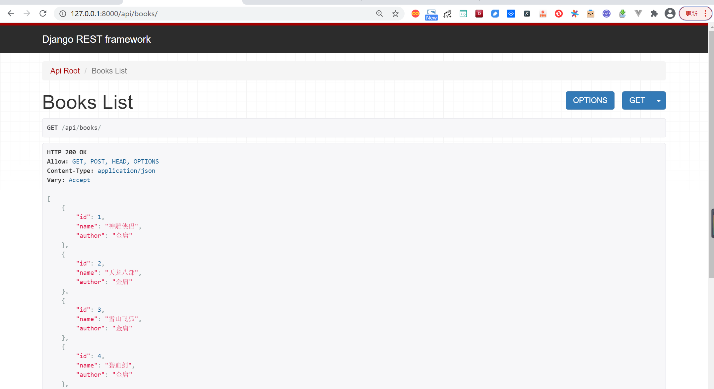
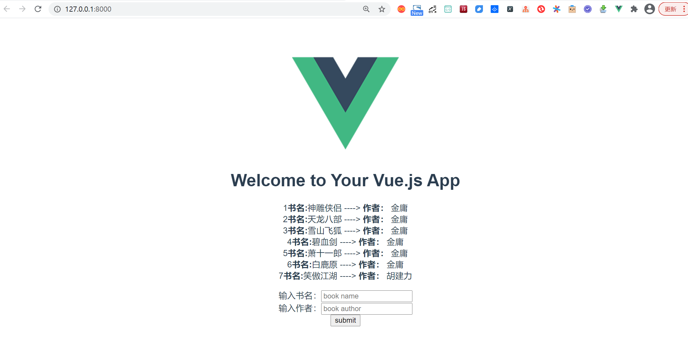

# Django+Vue.js快速构建项目示例


## 1.项目准备

```
$ python -V
Python 3.7.0

18793@DESKTOP-PMJTNGI MINGW64 /d/0项目/book_demo
$ python -m django --version
3.1.7
```


## 2.Django部分

为了方便后端的实现，作为django做后端api服务的一种常用插件，django-rest-framework(DRF)提供了许多好用的特性，所以本文demo中也应用一下，命令行输入命令安装：

```
pip install Djangorestframework markdown Django-filter pillow Django-guardian coreapi -i "https://pypi.doubanio.com/simple/"
```

下面开始做一些简单的配置：

将DRF和books配置到django项目中，打开项目中的settings.py文件，添加：

```
INSTALLED_APPS = [
    'django.contrib.admin',
    'django.contrib.auth',
    'django.contrib.contenttypes',
    'django.contrib.sessions',
    'django.contrib.messages',
    'django.contrib.staticfiles',
    'books.apps.BooksConfig',
    'rest_framework',
    'corsheaders'
]
```

对整个项目的路由进行配置，让访问api/路径时候转到books应用中的urls.py文件配置进行处理。

```
from django.contrib import admin
from django.urls import path, include
from django.views.generic.base import TemplateView

urlpatterns = [
    path('admin/', admin.site.urls),
    path('api/', include('books.urls')),  # demo add
    path('', TemplateView.as_view(template_name='index.html'))
]
```

在models.py文件中写简单数据类Books：

```
# books/models.py
from django.db import models


class Books(models.Model):
    name = models.CharField(max_length=30)
    author = models.CharField(max_length=30, blank=True, null=True)
```

在books文件夹中创建`serializer.py`文件，并写对应序列化器BooksSerializer：

```
#!/usr/bin/env python
# -*- coding: utf-8 -*-
from rest_framework import serializers

from books.models import Books


class BooksSerializer(serializers.ModelSerializer):
    class Meta:
        model = Books
        fields = '__all__'

```

在views.py文件中写对应的视图集BooksViewSet来处理请求：

```
from rest_framework import viewsets

from books.models import Books
from books.serializer import BooksSerializer


class BooksViewSet(viewsets.ModelViewSet):
    queryset = Books.objects.all()
    serializer_class = BooksSerializer

```

在urls.py文件中写对应的路由映射：

```
from django.urls import path, include
from rest_framework.routers import DefaultRouter

from books import views

router = DefaultRouter()
router.register('books', views.BooksViewSet)

urlpatterns = [
    path('', include(router.urls)),
]
```

到这里，可以运行一下后端项目看看效果，命令行运行：

```
python manage.py makemigrations
python manage.py migrate
python manage.py runserver
```

得益于DRF提供的api可视化界面，浏览器访问127.0.0.1:8000/api/books/，如果出现了以下界面并添加数据正常，则说明后端的基本逻辑已经ok了~



## 3.前端部分

前端实现

这里直接用HelloWorld.vue进行修改，只求功能不追求页面了~

```
<template>
  <div class="hello">
    <h1>{{ msg }}</h1>
    <!-- show books list -->
    <ul>
      <li v-for="(book, index) in books" :key="index" style="display:block">
        {{index+1}}<b>书名:</b>{{book.name}} ----> <b>作者：</b> {{book.author}}
      </li>
    </ul>
    <!-- form to add a book -->
    <form action="">
      输入书名：<input type="text" placeholder="book name" v-model="inputBook.name"><br>
      输入作者：<input type="text" placeholder="book author" v-model="inputBook.author"><br>
    </form>
    <button type="submit" @click="bookSubmit()">submit</button>
  </div>
</template>

<script>
import {getBooks, postBook} from '../api/api.js'
export default {
  name: 'HelloWorld',
  data () {
    return {
      msg: 'Welcome to Your Vue.js App',
      // books list data
      books: [
        {name: 'test', author: 't'},
        {name: 'test2', author: 't2'}
      ],
      // book data in the form
      inputBook: {
        "name": "",
        "author": "",
      }
    }
  },
  methods: {
    loadBooks () {
      getBooks().then(response => {
      this.books = response.data
    })},

    bookSubmit () {
      postBook(this.inputBook.name, this.inputBook.author).then(response => {
        console.log(response)
        this.loadBooks()})}
  },
  created: function () {
    this.loadBooks()
  }
}
</script>

<!-- Add "scoped" attribute to limit CSS to this component only -->
<style scoped>
h3 {
  margin: 40px 0 0;
}
ul {
  list-style-type: none;
  padding: 0;
}
li {
  display: inline-block;
  margin: 0 10px;
}
a {
  color: #42b983;
}
</style>

```

启动前端项目，浏览器访问127.0.0.1:8080


## 4.前后端联调

后端部分，对于django的跨域问题，网上比较常用的做法就是利用django-cors-headers模块来解决，这里也不能免俗，操作如下。

先在命令行中进行对应模块的安装：

```
pip install Django-cors-headers -i "https://pypi.doubanio.com/simple/"
```


然后在项目中添加该模块：

```
INSTALLED_APPS = [
    'django.contrib.admin',
    'django.contrib.auth',
    'django.contrib.contenttypes',
    'django.contrib.sessions',
    'django.contrib.messages',
    'django.contrib.staticfiles',
    'books.apps.BooksConfig',
    'rest_framework',
    'corsheaders'
]

MIDDLEWARE = [
    'corsheaders.middleware.CorsMiddleware',  # 需注意与其他中间件顺序，这里放在最前面即可
    'django.middleware.security.SecurityMiddleware',
    'django.contrib.sessions.middleware.SessionMiddleware',
    'django.middleware.common.CommonMiddleware',
    'django.middleware.csrf.CsrfViewMiddleware',
    'django.contrib.auth.middleware.AuthenticationMiddleware',
    'django.contrib.messages.middleware.MessageMiddleware',
    'django.middleware.clickjacking.XFrameOptionsMiddleware',
]
# 支持跨域配置开始
CORS_ORIGIN_ALLOW_ALL = True
CORS_ALLOW_CREDENTIALS = True
```

前端的逻辑，Vue框架现在一般都用axios模块进行网络请求，这里沿用这种方式，下面是在前端项目中操作：

首先命令行安装axios模块，如果没有安装cnpm就还是用npm安装：

```bash
cnpm install axios
```

为了方便管理api请求的各种逻辑，在前端项目的src目录下创建api目录，然后创建api.js和index.js文件。index.js文件是对axios做配置：

```
import Vue from 'vue'
import Axios from 'axios'

const axiosInstance = Axios.create({
    withCredentials: true
})

// 通过拦截器处理csrf问题，这里的正则和匹配下标可能需要根据实际情况小改动
axiosInstance.interceptors.request.use((config) => {
    config.headers['X-Requested-With'] = 'XMLHttpRequest'
    const regex = /.*csrftoken=([^;.]*).*$/
    config.headers['X-CSRFToken'] = document.cookie.match(regex) === null ? null : document.cookie.match(regex)[1]
    return config
})

axiosInstance.interceptors.response.use(
    response => {
        return response
    },
    error => {
        return Promise.reject(error)
    }
)

Vue.prototype.axios = axiosInstance

export default axiosInstance
```

api.js文件是对后端进行请求，可以看到，获取books列表和添加一本book各对应于一个请求：

```
import axiosInstance from './index'

const axios = axiosInstance

export const getBooks = () => {
    return axios.get(`http://localhost:8000/api/books/`)
}

export const postBook = (bookName, bookAuthor) => {
    return axios.post(`http://localhost:8000/api/books/`, {'name': bookName, 'author': bookAuthor})
}
```

然后更新HelloWorld.vue中的处理逻辑：

```
<script>
import {getBooks, postBook} from '../api/api.js'
export default {
  name: 'HelloWorld',
  data () {
    return {
      msg: 'Welcome to Your Vue.js App',
      // books list data
      books: [
        {name: 'test', author: 't'},
        {name: 'test2', author: 't2'}
      ],
      // book data in the form
      inputBook: {
        "name": "",
        "author": "",
      }
    }
  },
  methods: {
    loadBooks () {
      getBooks().then(response => {
      this.books = response.data
    })},

    bookSubmit () {
      postBook(this.inputBook.name, this.inputBook.author).then(response => {
        console.log(response)
        this.loadBooks()})}
  },
  created: function () {
    this.loadBooks()
  }
}
</script>
```

至此，一个极其简陋的查询和添加书籍的功能算是完成了~如下图：



可以看到，列表里面的数据是从后端读取到的，同时前端的提交数据库也能有对应的操作，所以前后端至此是打通了。

## 5.打包

`vue.config.js`

```
module.exports = {
    publicPath: "./",
    assetsDir: "static",
    outputDir: "dist",
}
```

现阶段是前后端分开开发，但是当最后要用的时候，还需要把代码合在一起。

首先对前端项目进行打包，这里用Vue的自动打包：

```bash
npm run build
```

可以看到前端项目中多出了一个dist文件夹，这个就是前端文件的打包结果。需要把dist文件夹复制到books_demo项目文件夹中。

然后对settings.py文件进行相应的修改，其实就是帮django指定模版文件和静态文件的搜索地址：

```
TEMPLATES = [
    {
        'BACKEND': 'django.template.backends.django.DjangoTemplates',
        # 'DIRS': [BASE_DIR / 'templates'],
        'DIRS': [os.path.join(BASE_DIR, 'dist')],
        'APP_DIRS': True,
        'OPTIONS': {
            'context_processors': [
                'django.template.context_processors.debug',
                'django.template.context_processors.request',
                'django.contrib.auth.context_processors.auth',
                'django.contrib.messages.context_processors.messages',
            ],
        },
    },
]
STATICFILES_DIRS = [
    os.path.join(BASE_DIR, 'dist/static'),
]
```

最后在根urls.py文件中配置一下入口html文件的对应路由：

```
from django.contrib import admin
from django.urls import path, include
from django.views.generic.base import TemplateView

urlpatterns = [
    path('admin/', admin.site.urls),
    path('api/', include('books.urls')),  # demo add
    path('', TemplateView.as_view(template_name='index.html'))
]
```

重新启动项目，这次用浏览器访问127.0.0.1:8000，即django服务的对应端口即可。

可以看到，项目的交互是正常的，符合我们的预期。