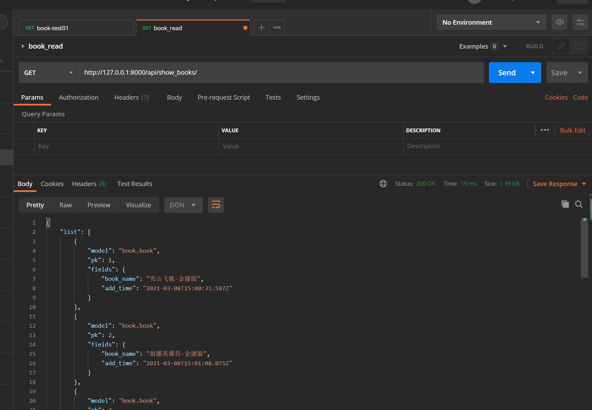
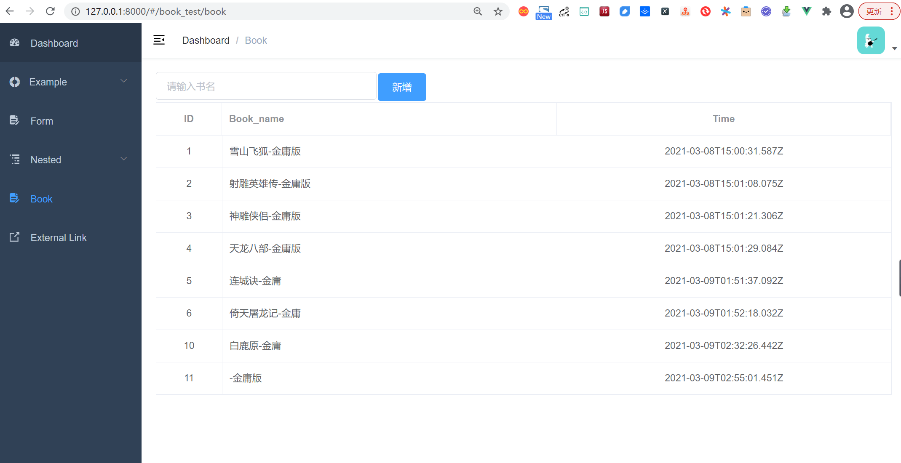

# Django+vue前后端分离Demo


从零开始搭建Django+vue前后端分离项目


## Django部分

### 1.环境准备

```
$ python --version
Python 3.7.0

18793@DESKTOP-PMJTNGI MINGW64 /d/0项目/book_project
$ python -m django --version
3.1.7
```


### 2.创建项目

```
## 方法1:
1.创建项目：django-admin startproject book_project
2.再新建app：
进入项目根目录：
cd book_project
python3 manage.py startapp book


## 方法2: 
pycharm---推荐
```

### 3.后端准备

#### 3.1 更改settings配置

##### 3.1.1 更改数据库配置

在book_project下的settings.py配置文件中，把默认的sqllite3数据库换成我们的mysql数据库 

```
DATABASES = {
    'default': {
        'ENGINE': 'django.db.backends.mysql',
        'NAME': 'book_demo',
        'HOST': '127.0.0.1',
        'USER': 'root',
        'PASSWORD': 'admin#123',
        'PORT': '3306',
    }
}
```

##### 3.1.2 导入pymysql包

在项目setting文件同级__init__.py文件下加入

```
import pymysql

pymysql.version_info = (1, 4, 13, "final", 0)
pymysql.install_as_MySQLdb()
```


```
pip install -i https://pypi.doubanio.com/simple/ --trusted-host pypi.doutsnio.com pymysql
```


##### 3.1.3 更改installed_apps

将创建的app加入到installed_apps里面

```
INSTALLED_APPS = [
    'django.contrib.admin',
    'django.contrib.auth',
    'django.contrib.contenttypes',
    'django.contrib.sessions',
    'django.contrib.messages',
    'django.contrib.staticfiles',
    'book.apps.BookConfig',
    'book'
]
```


#### 3.2 创建model

`models.py`

```
from django.db import models


# Create your models here.

class Book(models.Model):
    book_name = models.CharField(max_length=64)
    add_time = models.DateTimeField(auto_now_add=True)

    class Meta:
        verbose_name = '书名'
        verbose_name_plural = verbose_name

    def __str__(self):
        return self.book_name
```


#### 3.3 新增接口

在app目录下的views里我们新增两个接口，

+ show_books: 返回所有的书籍列表（通过JsonResponse返回能被前端识别的json格式数据）
+ add_book: 接受一个get请求，往数据库里添加一条book数据 

```python
# Create your views here.
from book.models import Book
from django.views.decorators.http import require_http_methods
from django.http import JsonResponse
from django.core import serializers
import json


# Create your views here.
@require_http_methods(["GET"])
def add_book(request):
    response = {}
    try:
        book = Book(book_name=request.GET.get('book_name'))
        response['msg'] = 'success'
        response['error_num'] = 0
        response['code'] = 20000
        book.save()
    except Exception as e:
        response['msg'] = str(e)
        response['error_num'] = 1

    return JsonResponse(response)


@require_http_methods(["GET"])
def show_books(request):
    response = {}
    try:
        books = Book.objects.filter()
        response['list'] = json.loads(serializers.serialize("json", books))
        response['msg'] = 'success'
        response['error_num'] = 0
        response['code'] = 20000
    except Exception as e:
        response['msg'] = str(e)
        response['error_num'] = 1

    return JsonResponse(response)
```


#### 3.4 创建app路由

##### 3.4.1  将新接口加入到app的路由下

在app目录下，新增一个urls.py文件，把我们新增的两个接口添加到路由里

```
#!/usr/bin/env python
# -*- coding: utf-8 -*-

from django.urls import path, re_path
from book import views

urlpatterns = [
    re_path('add_book$', views.add_book),
    re_path('show_books/', views.show_books),
]
```

##### 3.4.2 将app的路由，导入到项目路由

把app下的urls添加到项目book_project下的urls中，才能完成路由

```
from django.urls import include, re_path
from django.contrib import admin
from django.views.generic import TemplateView

from book import urls

urlpatterns = [
    re_path('admin/', admin.site.urls),
    re_path('api/', include(urls)),
]
```


#### 3.5 初始化数据库

进入项目根目录，输入

```
python manage.py makemigrations
python manage.py migrate
```

### 4.启动服务测试接口

#### 4.1 启动服务

进入项目根目录，输入：

```
$ python manage.py runserver
Watching for file changes with StatReloader
Performing system checks...

System check identified no issues (0 silenced).
March 08, 2021 - 22:57:29
Django version 3.1.7, using settings 'book_project.settings'
Starting development server at http://127.0.0.1:8000/
Quit the server with CTRL-BREAK.
```


#### 4.2 验证接口

postman调用：

插入书籍接口：

````
http://127.0.0.1:8000/api/add_book?book_name=雪山飞狐-金庸版
````

查询书籍接口：

```
http://127.0.0.1:8000/api/show_books/
```



至此后端接口准备完毕，下面开始前端


## 前端部分

前端用的是vue-admin-template是vue-element-admin的基础模版


使用规则见：https://panjiachen.github.io/vue-element-admin-site/zh/guide/#%E7%9B%AE%E5%BD%95%E7%BB%93%E6%9E%84


### 5.前端准备

#### 5.1 下载模版

```
# 克隆项目
git clone https://github.com/PanJiaChen/vue-admin-template.git
# 也可以多下载个完整的模版，用到组件时，copy过来
# git clone https://github.com/PanJiaChen/vue-element-admin.git

# 进入项目目录
cd vue-admin-template

# 安装依赖， 建议不要用 cnpm 安装 会有各种诡异的bug 可以通过如下操作解决 npm 下载速度慢的问题
npm install --registry=https://registry.npm.taobao.org

# 本地开发 启动项目
npm run dev
# ps：启动的时候报错了，提示提示vue-cli-service: command not found
# 进入到项目目录下，执行：rm –rf node_modules and npm install
```

#### 5.2 项目目录结构，启动效果

#### 5.3 与服务端交互，添加api

`src/api/book.js`

```
import request from '@/utils/request'

export function getList() {
  return request({
    url: '/api/show_books/',
    method: 'get'
  })
}

export function addbook(book_name) {
  return request({
    url: '/api/add_book',
    method: 'get',
    params: { book_name }
  })
}
```

#### 5.4 加侧边栏-book

##### 5.4.1 添加views的vue文件

在src->views->创建book文件夹->index.vue

```
<template>
  <div class="app-container">
    <el-row display="margin-top:10px">
      <el-input v-model="input_bookname" placeholder="请输入书名" style="display:inline-table; width: 30%; float:left"></el-input>
      <el-button type="primary" @click="addBook()" style="float:left; margin: 2px;">新增</el-button>
    </el-row>
    <el-row>
      <el-table :data="list_book" element-loading-text="Loading" border fit highlight-current-row>
        <el-table-column align="center" label="ID" width="95">
          <template slot-scope="scope">
            {{ scope.row.pk }}
          </template>
        </el-table-column>
        <el-table-column label="Book_name">
          <template slot-scope="scope">
            {{ scope.row.fields.book_name }}
          </template>
        </el-table-column>
        <el-table-column label="Time" align="center">
          <template slot-scope="scope">
            <span>{{ scope.row.fields.add_time }}</span>
          </template>
        </el-table-column>
      </el-table>
    </el-row>
  </div>
</template>

<script>
import {
  getList,
  addbook
} from '@/api/book'

export default {
  filters: {
    statusFilter(status) {
      const statusMap = {
        published: 'success',
        draft: 'gray',
        deleted: 'danger'
      }
      return statusMap[status]
    }
  },
  data() {
    return {
      list_book: null,
      listLoading: true,
      input_bookname: ''
    }
  },
  created() {
    this.getList()
  },
  methods: {
    getList() {
      this.listLoading = true
      getList().then(response => {
        if (response.error_num === 0) {
          this.list_book = response['list']
          this.listLoading = false
        } else {
          this.$message.error('查询书籍失败')
          console.log(response['msg'])
        }
      })
    },
    addBook() {
      addbook(this.input_bookname).then(response => {
        if (response.error_num === 0) {
          this.getList()
          this.input_bookname = ''
        } else {
          this.$message.error('新增书籍失败，请重试')
          console.log(response['msg'])
        }
      })
    }
  }
}
</script>
```

##### 5.4.2 给菜单加路由，就完成了新增一个侧边栏

修改src->router->index.js文件

```
  {
    path: '/book_test',
    component: Layout,
    children: [
      {
        path: 'book',
        name: 'Book',
        component: () => import('@/views/book/index'),
        meta: { title: 'Book', icon: 'form' }
      }
    ]
  },
```


#### 5.5 启动前端项目

启动命令：

````
npm run dev
````

启动后会出现异常，异常情况很多。404/500/403等等情况

先解决跨域


### 6. 解决跨域


#### 6.1 后端django修改

```
pip install django-cors-headers -i "https://pypi.doubanio.com/simple/"
```

在book_project->settings文件夹下，修改如下内容，注意顺序

```
MIDDLEWARE = [
    'django.middleware.security.SecurityMiddleware',
    'django.contrib.sessions.middleware.SessionMiddleware',
    'corsheaders.middleware.CorsMiddleware',
    'django.middleware.common.CommonMiddleware',
    'django.middleware.csrf.CsrfViewMiddleware',
    'django.contrib.auth.middleware.AuthenticationMiddleware',
    'django.contrib.messages.middleware.MessageMiddleware',
    'django.middleware.clickjacking.XFrameOptionsMiddleware',
]
CORS_ORIGIN_ALLOW_ALL = True
```


#### 6.2 前端添加跨域相关

添加proxy

ps:  不同版本可能位置不一样。我下载的这个模版是下面的路径
主目录的vue.config.js文件

```
  devServer: {
    port: port,
    open: true,
    overlay: {
      warnings: false,
      errors: true
    },
    proxy: {
      '/api': {
        target: 'http://127.0.0.1:8000',
        changeOrigin: true
      }
    },
```


.env.development文件修改

```
# just a flag
ENV = 'development'

# base api
# VUE_APP_BASE_API = '/dev-api'
VUE_APP_BASE_API = ''
```


### 7.启动项目

##### 7.1 启动后端项目 

```
python manage.py runserver
```

##### 7.2 启动前端项目

```
npm run dev
```

##### 7.3 查看效果


### 8.整合项目

目前我们已经分别完成了Django后端和Vue.js前端工程的创建和编写，但实际上它们是运行在各自的服务器上，和我们的要求是不一致的。
因此我们须要把Django的TemplateView指向我们刚才生成的前端dist文件


#### 8.1 前端打包，生成dist文件

```
## 打包vue项目，会将所有东西打包成一个dist文件夹 
npm run build:prod
```

#### 8.2 配置django

##### 8.2.1 创建appfront文件夹，将vue打包的dist复制过来

##### 8.2.2 修改入口urls文件

```
from django.urls import include, re_path
from django.contrib import admin
from django.views.generic import TemplateView

from book import urls

urlpatterns = [
    re_path('admin/', admin.site.urls),
    re_path('api/', include(urls)),
    re_path(r'^$', TemplateView.as_view(template_name='index.html')),
]
```

##### 8.2.3 修改settings文件，让代码能找到index.html

TEMPLATES更改DIRS，配置下模版

```
TEMPLATES = [
    {
        'BACKEND': 'django.template.backends.django.DjangoTemplates',
        # 'DIRS': [BASE_DIR / 'templates'],
        'DIRS': ['appfront/dist'],
        'APP_DIRS': True,
        'OPTIONS': {
            'context_processors': [
                'django.template.context_processors.debug',
                'django.template.context_processors.request',
                'django.contrib.auth.context_processors.auth',
                'django.contrib.messages.context_processors.messages',
            ],
        },
    },
]
```

##### 8.2.4 修改settings文件，配置一下静态文件的搜索路径

```
STATICFILES_DIRS = [
    os.path.join(BASE_DIR, 'appfront/dist/static')
]
```

### 9. 再次启动项目

此次不用专门启动前端了,直接

```
python manage.py runserver
```

然后访问`http://127.0.0.1:8000/`就到了入口页面




### 10.环境搭建与部署

CentOS 系统可以使用 yum 安装必要的包

```
# 如果你使用git来托管代码的话
yum install git

# 如果你要在服务器上构建前端
yum install nodejs
yum install npm

yum install nginx
```

> 我们使用 uwsgi 来处理 Django 请求，使用 nginx 处理 static 文件（即之前 build 之后 dist 里面的static，这里默认前端已经打包好了，如果在服务端打包前端需要安装nodejs，npm等）

安装uWsgi

```
yum install uwsgi
# 或者
pip install uwsgi
```

我们使用配置文件启动uwsgi，比较清楚

uwsgi配置文件：

```text
[uwsgi]
socket = 127.0.0.1:9292
stats = 127.0.0.1:9293
workers = 4
# 项目根目录
chdir = /opt/inner_ulb_manager
touch-reload = /opt/inner_ulb_manager
py-auto-reload = 1
# 在项目跟目录和项目同名的文件夹里面的一个文件
module= inner_ulb_manager.wsgi
pidfile = /var/run/inner_ulb_manager.pid
daemonize = /var/log/inner_ulb_manager.log
```

nginx 配置文件：

```text
server {
    listen 8888;
    server_name 120.132.**.75;
    root /opt/inner_ulb_manager;
    access_log /var/log/nginx/access_narwhals.log;
    error_log /var/log/nginx/error_narwhals.log;

    location / {
            uwsgi_pass 127.0.0.1:9292;
            include /etc/nginx/uwsgi_params;
    }
    location /static/ {
            root  /opt/inner_ulb_manager/;
            access_log off;
    }
    location ^~ /admin/ {
            uwsgi_pass 127.0.0.1:9292;
            include /etc/nginx/uwsgi_params;
    }
}
```

/opt/inner_ulb_manager/static 即为静态文件目录，那么现在我们静态文件还在 frontend/dist 怎么办，不怕，Django给我们提供了命令：

先去settings里面配置：

```text
STATIC_ROOT = os.path.join(BASE_DIR, "static")
```

然后在存在manage.py的目录，即项目跟目录执行：

```text
python manage.py collectstatic
```

这样frontend/dist/static里面的东西就到了项目根目录的static文件夹里面了

那么为什么不直接手动把构建好的dist/static拷过来呢，因为开始提过Django自带的App：admin  也有一些静态文件（css,js等），它会一并collect过来，毕竟nginx只认项目跟目录的静态文件，它不知道django把它自己的需求文件放到哪了

开头说过Django配置灵活，那么我们专门为Django创建一个生产环境的配置 prod.py

prod.py 与 默认 settings.py 同目录

```text
# 导入公共配置
from .settings import *

# 生产环境关闭DEBUG模式
DEBUG = False

# 生产环境开启跨域
CORS_ORIGIN_ALLOW_ALL = False

# 特别说明，下面这个不需要，因为前端是VueJS构建的，它默认使用static作为静态文件入口，我们nginx配置static为入口即可，保持一致，没Django什么事
STATIC_URL = '/static/'
```


如何使用这个配置呢，进入 wisg.py 即uwsgi配置里面的module配置修改为：

```text
import os

from django.core.wsgi import get_wsgi_application

os.environ.setdefault("DJANGO_SETTINGS_MODULE", "**inner_ulb_manager.prod**")

application = get_wsgi_application()
```

启动uwsgi

```text
uwsgi --ini inner_ulb_manager.ini
```


启动ngingx

```text
service nginx start
```

至此，部署就完成了。


## 参考文献

https://www.cnblogs.com/zhangxue521/p/12957816.html

https://zhuanlan.zhihu.com/p/24893786