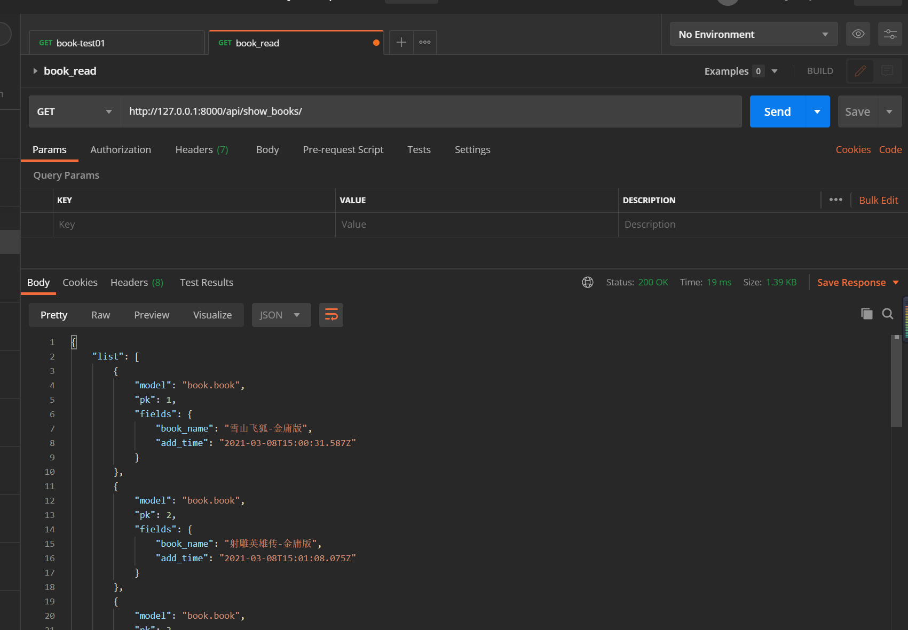
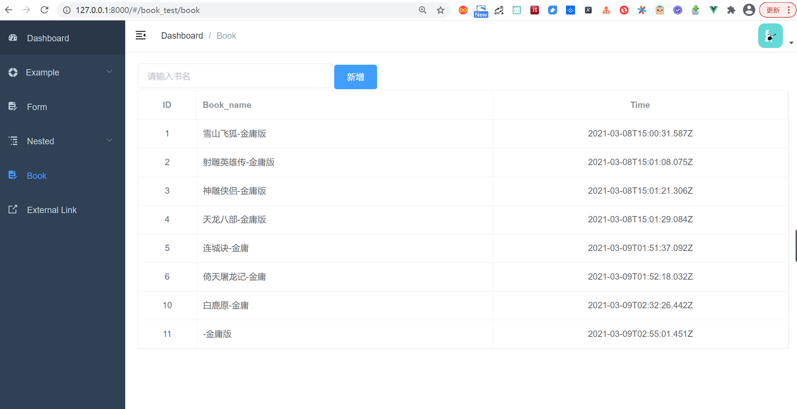

.. contents::
   :depth: 3
..

Django+vue前后端分离Demo
========================

从零开始搭建Django+vue前后端分离项目

Django部分
----------

1.环境准备
~~~~~~~~~~

::

   $ python --version
   Python 3.7.0

   18793@DESKTOP-PMJTNGI MINGW64 /d/0项目/book_project
   $ python -m django --version
   3.1.7

2.创建项目
~~~~~~~~~~

::

   ## 方法1:
   1.创建项目：django-admin startproject book_project
   2.再新建app：
   进入项目根目录：
   cd book_project
   python3 manage.py startapp book

   ## 方法2: 
   pycharm---推荐

3.后端准备
~~~~~~~~~~

3.1 更改settings配置
^^^^^^^^^^^^^^^^^^^^

3.1.1 更改数据库配置
''''''''''''''''''''

在book_project下的settings.py配置文件中，把默认的sqllite3数据库换成我们的mysql数据库

::

   DATABASES = {
       'default': {
           'ENGINE': 'django.db.backends.mysql',
           'NAME': 'book_demo',
           'HOST': '127.0.0.1',
           'USER': 'root',
           'PASSWORD': 'admin#123',
           'PORT': '3306',
       }
   }

3.1.2 导入pymysql包
'''''''''''''''''''

在项目setting文件同级__init__.py文件下加入

::

   import pymysql

   pymysql.version_info = (1, 4, 13, "final", 0)
   pymysql.install_as_MySQLdb()

::

   pip install -i https://pypi.doubanio.com/simple/ --trusted-host pypi.doutsnio.com pymysql

3.1.3 更改installed_apps
''''''''''''''''''''''''

将创建的app加入到installed_apps里面

::

   INSTALLED_APPS = [
       'django.contrib.admin',
       'django.contrib.auth',
       'django.contrib.contenttypes',
       'django.contrib.sessions',
       'django.contrib.messages',
       'django.contrib.staticfiles',
       'book.apps.BookConfig',
       'book'
   ]

3.2 创建model
^^^^^^^^^^^^^

``models.py``

::

   from django.db import models

   # Create your models here.

   class Book(models.Model):
       book_name = models.CharField(max_length=64)
       add_time = models.DateTimeField(auto_now_add=True)

       class Meta:
           verbose_name = '书名'
           verbose_name_plural = verbose_name

       def __str__(self):
           return self.book_name

3.3 新增接口
^^^^^^^^^^^^

在app目录下的views里我们新增两个接口，

-  show_books:
   返回所有的书籍列表（通过JsonResponse返回能被前端识别的json格式数据）
-  add_book: 接受一个get请求，往数据库里添加一条book数据

.. code:: python

   # Create your views here.
   from book.models import Book
   from django.views.decorators.http import require_http_methods
   from django.http import JsonResponse
   from django.core import serializers
   import json

   # Create your views here.
   @require_http_methods(["GET"])
   def add_book(request):
       response = {}
       try:
           book = Book(book_name=request.GET.get('book_name'))
           response['msg'] = 'success'
           response['error_num'] = 0
           response['code'] = 20000
           book.save()
       except Exception as e:
           response['msg'] = str(e)
           response['error_num'] = 1

       return JsonResponse(response)

   @require_http_methods(["GET"])
   def show_books(request):
       response = {}
       try:
           books = Book.objects.filter()
           response['list'] = json.loads(serializers.serialize("json", books))
           response['msg'] = 'success'
           response['error_num'] = 0
           response['code'] = 20000
       except Exception as e:
           response['msg'] = str(e)
           response['error_num'] = 1

       return JsonResponse(response)

3.4 创建app路由
^^^^^^^^^^^^^^^

3.4.1 将新接口加入到app的路由下
'''''''''''''''''''''''''''''''

在app目录下，新增一个urls.py文件，把我们新增的两个接口添加到路由里

::

   #!/usr/bin/env python
   # -*- coding: utf-8 -*-

   from django.urls import path, re_path
   from book import views

   urlpatterns = [
       re_path('add_book$', views.add_book),
       re_path('show_books/', views.show_books),
   ]

3.4.2 将app的路由，导入到项目路由
'''''''''''''''''''''''''''''''''

把app下的urls添加到项目book_project下的urls中，才能完成路由

::

   from django.urls import include, re_path
   from django.contrib import admin
   from django.views.generic import TemplateView

   from book import urls

   urlpatterns = [
       re_path('admin/', admin.site.urls),
       re_path('api/', include(urls)),
   ]

3.5 初始化数据库
^^^^^^^^^^^^^^^^

进入项目根目录，输入

::

   python manage.py makemigrations
   python manage.py migrate

4.启动服务测试接口
~~~~~~~~~~~~~~~~~~

4.1 启动服务
^^^^^^^^^^^^

进入项目根目录，输入：

::

   $ python manage.py runserver
   Watching for file changes with StatReloader
   Performing system checks...

   System check identified no issues (0 silenced).
   March 08, 2021 - 22:57:29
   Django version 3.1.7, using settings 'book_project.settings'
   Starting development server at http://127.0.0.1:8000/
   Quit the server with CTRL-BREAK.

4.2 验证接口
^^^^^^^^^^^^

postman调用：

插入书籍接口：

::

   http://127.0.0.1:8000/api/add_book?book_name=雪山飞狐-金庸版

查询书籍接口：

::

   http://127.0.0.1:8000/api/show_books/

至此后端接口准备完毕，下面开始前端

前端部分
--------

前端用的是vue-admin-template是vue-element-admin的基础模版

使用规则见：https://panjiachen.github.io/vue-element-admin-site/zh/guide/#%E7%9B%AE%E5%BD%95%E7%BB%93%E6%9E%84

5.前端准备
~~~~~~~~~~

5.1 下载模版
^^^^^^^^^^^^

::

   # 克隆项目
   git clone https://github.com/PanJiaChen/vue-admin-template.git
   # 也可以多下载个完整的模版，用到组件时，copy过来
   # git clone https://github.com/PanJiaChen/vue-element-admin.git

   # 进入项目目录
   cd vue-admin-template

   # 安装依赖， 建议不要用 cnpm 安装 会有各种诡异的bug 可以通过如下操作解决 npm 下载速度慢的问题
   npm install --registry=https://registry.npm.taobao.org

   # 本地开发 启动项目
   npm run dev
   # ps：启动的时候报错了，提示提示vue-cli-service: command not found
   # 进入到项目目录下，执行：rm –rf node_modules and npm install

5.2 项目目录结构，启动效果
^^^^^^^^^^^^^^^^^^^^^^^^^^

5.3 与服务端交互，添加api
^^^^^^^^^^^^^^^^^^^^^^^^^

``src/api/book.js``

::

   import request from '@/utils/request'

   export function getList() {
     return request({
       url: '/api/show_books/',
       method: 'get'
     })
   }

   export function addbook(book_name) {
     return request({
       url: '/api/add_book',
       method: 'get',
       params: { book_name }
     })
   }

5.4 加侧边栏-book
^^^^^^^^^^^^^^^^^

5.4.1 添加views的vue文件
''''''''''''''''''''''''

在src->views->创建book文件夹->index.vue

::

   <template>
     

       <el-row display="margin-top:10px">
         <el-input v-model="input_bookname" placeholder="请输入书名" style="display:inline-table; width: 30%; float:left"></el-input>
         <el-button type="primary" @click="addBook()" style="float:left; margin: 2px;">新增</el-button>
       </el-row>
       <el-row>
         <el-table :data="list_book" element-loading-text="Loading" border fit highlight-current-row>
           <el-table-column align="center" label="ID" width="95">
             <template slot-scope="scope">
               {{ scope.row.pk }}
             </template>
           </el-table-column>
           <el-table-column label="Book_name">
             <template slot-scope="scope">
               {{ scope.row.fields.book_name }}
             </template>
           </el-table-column>
           <el-table-column label="Time" align="center">
             <template slot-scope="scope">
               {{ scope.row.fields.add_time }}
             </template>
           </el-table-column>
         </el-table>
       </el-row>
     

   </template>

   

5.4.2 给菜单加路由，就完成了新增一个侧边栏
''''''''''''''''''''''''''''''''''''''''''

修改src->router->index.js文件

::

     {
       path: '/book_test',
       component: Layout,
       children: [
         {
           path: 'book',
           name: 'Book',
           component: () => import('@/views/book/index'),
           meta: { title: 'Book', icon: 'form' }
         }
       ]
     },

5.5 启动前端项目
^^^^^^^^^^^^^^^^

启动命令：

::

   npm run dev

启动后会出现异常，异常情况很多。404/500/403等等情况

先解决跨域

6. 解决跨域
~~~~~~~~~~~

6.1 后端django修改
^^^^^^^^^^^^^^^^^^

::

   pip install django-cors-headers -i "https://pypi.doubanio.com/simple/"

在book_project->settings文件夹下，修改如下内容，注意顺序

::

   MIDDLEWARE = [
       'django.middleware.security.SecurityMiddleware',
       'django.contrib.sessions.middleware.SessionMiddleware',
       'corsheaders.middleware.CorsMiddleware',
       'django.middleware.common.CommonMiddleware',
       'django.middleware.csrf.CsrfViewMiddleware',
       'django.contrib.auth.middleware.AuthenticationMiddleware',
       'django.contrib.messages.middleware.MessageMiddleware',
       'django.middleware.clickjacking.XFrameOptionsMiddleware',
   ]
   CORS_ORIGIN_ALLOW_ALL = True

6.2 前端添加跨域相关
^^^^^^^^^^^^^^^^^^^^

添加proxy

ps: 不同版本可能位置不一样。我下载的这个模版是下面的路径
主目录的vue.config.js文件

::

     devServer: {
       port: port,
       open: true,
       overlay: {
         warnings: false,
         errors: true
       },
       proxy: {
         '/api': {
           target: 'http://127.0.0.1:8000',
           changeOrigin: true
         }
       },

.env.development文件修改

::

   # just a flag
   ENV = 'development'

   # base api
   # VUE_APP_BASE_API = '/dev-api'
   VUE_APP_BASE_API = ''

7.启动项目
~~~~~~~~~~

7.1 启动后端项目
^^^^^^^^^^^^^^^^

::

   python manage.py runserver

.. _启动前端项目-1:

7.2 启动前端项目
^^^^^^^^^^^^^^^^

::

   npm run dev

7.3 查看效果
^^^^^^^^^^^^

8.整合项目
~~~~~~~~~~

目前我们已经分别完成了Django后端和Vue.js前端工程的创建和编写，但实际上它们是运行在各自的服务器上，和我们的要求是不一致的。
因此我们须要把Django的TemplateView指向我们刚才生成的前端dist文件

8.1 前端打包，生成dist文件
^^^^^^^^^^^^^^^^^^^^^^^^^^

::

   ## 打包vue项目，会将所有东西打包成一个dist文件夹 
   npm run build:prod

8.2 配置django
^^^^^^^^^^^^^^

8.2.1 创建appfront文件夹，将vue打包的dist复制过来
'''''''''''''''''''''''''''''''''''''''''''''''''

8.2.2 修改入口urls文件
''''''''''''''''''''''

::

   from django.urls import include, re_path
   from django.contrib import admin
   from django.views.generic import TemplateView

   from book import urls

   urlpatterns = [
       re_path('admin/', admin.site.urls),
       re_path('api/', include(urls)),
       re_path(r'^$', TemplateView.as_view(template_name='index.html')),
   ]

8.2.3 修改settings文件，让代码能找到index.html
''''''''''''''''''''''''''''''''''''''''''''''

TEMPLATES更改DIRS，配置下模版

::

   TEMPLATES = [
       {
           'BACKEND': 'django.template.backends.django.DjangoTemplates',
           # 'DIRS': [BASE_DIR / 'templates'],
           'DIRS': ['appfront/dist'],
           'APP_DIRS': True,
           'OPTIONS': {
               'context_processors': [
                   'django.template.context_processors.debug',
                   'django.template.context_processors.request',
                   'django.contrib.auth.context_processors.auth',
                   'django.contrib.messages.context_processors.messages',
               ],
           },
       },
   ]

8.2.4 修改settings文件，配置一下静态文件的搜索路径
''''''''''''''''''''''''''''''''''''''''''''''''''

::

   STATICFILES_DIRS = [
       os.path.join(BASE_DIR, 'appfront/dist/static')
   ]

9. 再次启动项目
~~~~~~~~~~~~~~~

此次不用专门启动前端了,直接

::

   python manage.py runserver

然后访问\ ``http://127.0.0.1:8000/``\ 就到了入口页面

10.环境搭建与部署
~~~~~~~~~~~~~~~~~

CentOS 系统可以使用 yum 安装必要的包

::

   # 如果你使用git来托管代码的话
   yum install git

   # 如果你要在服务器上构建前端
   yum install nodejs
   yum install npm

   yum install nginx

..

   我们使用 uwsgi 来处理 Django 请求，使用 nginx 处理 static
   文件（即之前 build 之后 dist
   里面的static，这里默认前端已经打包好了，如果在服务端打包前端需要安装nodejs，npm等）

安装uWsgi

::

   yum install uwsgi
   # 或者
   pip install uwsgi

我们使用配置文件启动uwsgi，比较清楚

uwsgi配置文件：

.. code:: text

   [uwsgi]
   socket = 127.0.0.1:9292
   stats = 127.0.0.1:9293
   workers = 4
   # 项目根目录
   chdir = /opt/inner_ulb_manager
   touch-reload = /opt/inner_ulb_manager
   py-auto-reload = 1
   # 在项目跟目录和项目同名的文件夹里面的一个文件
   module= inner_ulb_manager.wsgi
   pidfile = /var/run/inner_ulb_manager.pid
   daemonize = /var/log/inner_ulb_manager.log

nginx 配置文件：

.. code:: text

   server {
       listen 8888;
       server_name 120.132.**.75;
       root /opt/inner_ulb_manager;
       access_log /var/log/nginx/access_narwhals.log;
       error_log /var/log/nginx/error_narwhals.log;

       location / {
               uwsgi_pass 127.0.0.1:9292;
               include /etc/nginx/uwsgi_params;
       }
       location /static/ {
               root  /opt/inner_ulb_manager/;
               access_log off;
       }
       location ^~ /admin/ {
               uwsgi_pass 127.0.0.1:9292;
               include /etc/nginx/uwsgi_params;
       }
   }

/opt/inner_ulb_manager/static 即为静态文件目录，那么现在我们静态文件还在
frontend/dist 怎么办，不怕，Django给我们提供了命令：

先去settings里面配置：

.. code:: text

   STATIC_ROOT = os.path.join(BASE_DIR, "static")

然后在存在manage.py的目录，即项目跟目录执行：

.. code:: text

   python manage.py collectstatic

这样frontend/dist/static里面的东西就到了项目根目录的static文件夹里面了

那么为什么不直接手动把构建好的dist/static拷过来呢，因为开始提过Django自带的App：admin
也有一些静态文件（css,js等），它会一并collect过来，毕竟nginx只认项目跟目录的静态文件，它不知道django把它自己的需求文件放到哪了

开头说过Django配置灵活，那么我们专门为Django创建一个生产环境的配置
prod.py

prod.py 与 默认 settings.py 同目录

.. code:: text

   # 导入公共配置
   from .settings import *

   # 生产环境关闭DEBUG模式
   DEBUG = False

   # 生产环境开启跨域
   CORS_ORIGIN_ALLOW_ALL = False

   # 特别说明，下面这个不需要，因为前端是VueJS构建的，它默认使用static作为静态文件入口，我们nginx配置static为入口即可，保持一致，没Django什么事
   STATIC_URL = '/static/'

如何使用这个配置呢，进入 wisg.py 即uwsgi配置里面的module配置修改为：

.. code:: text

   import os

   from django.core.wsgi import get_wsgi_application

   os.environ.setdefault("DJANGO_SETTINGS_MODULE", "**inner_ulb_manager.prod**")

   application = get_wsgi_application()

启动uwsgi

.. code:: text

   uwsgi --ini inner_ulb_manager.ini

启动ngingx

.. code:: text

   service nginx start

至此，部署就完成了。

参考文献
--------

https://www.cnblogs.com/zhangxue521/p/12957816.html

https://zhuanlan.zhihu.com/p/24893786
