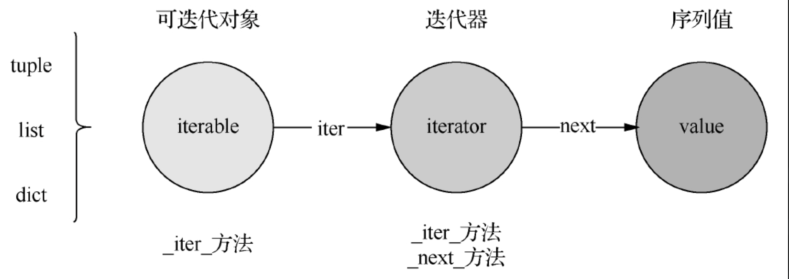
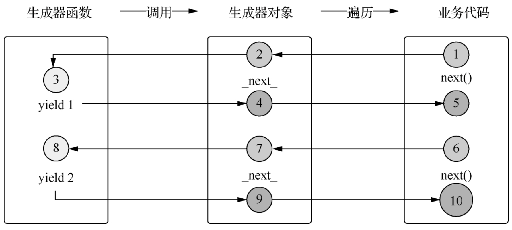
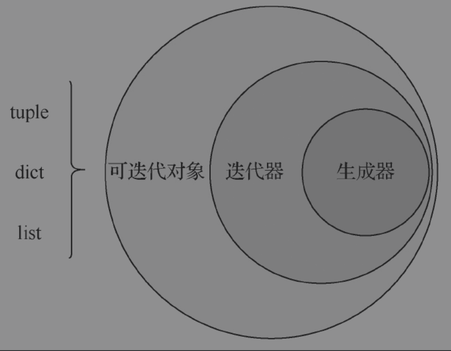
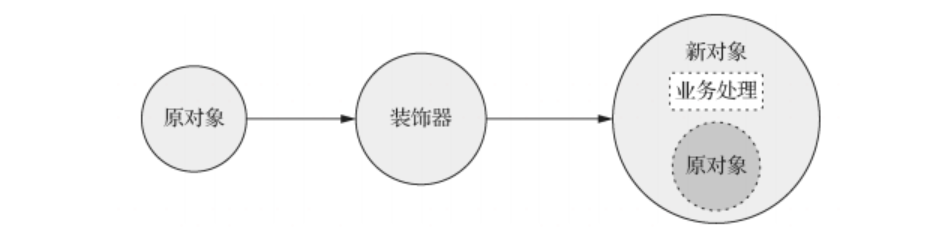
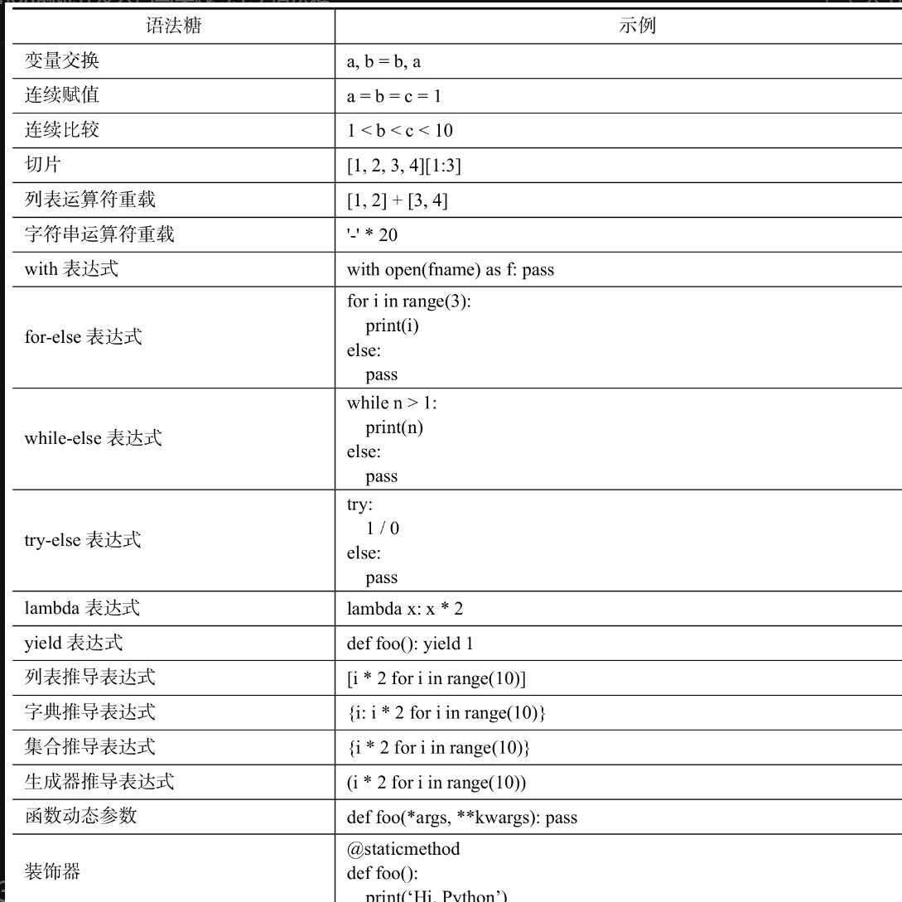

.. contents::
   :depth: 3
..

特性语法
========

1.Pythonic编程
--------------

Pythonic是相对优雅的方式写python代码。

Pythonic并没有官方的规范和手册，但是坊间却收集了众多符合Pythonic编程的实践；学习这些实践，可以了解Python的编程美学。

1.1 变量值交换
~~~~~~~~~~~~~~

.. code:: python

   a = 3
   b = 8

   # 普通实现
   c = a
   a = b
   b = c

   # Pythonic实现
   a, b = b, a

1.2 连续赋值表达式
~~~~~~~~~~~~~~~~~~

连续赋值表达式支持同时给多个变量赋同一个值，需要统一赋值的变量越多，使用连续赋值表达式就会越简捷。具体的对比示例如下所示：

.. code:: python

   # 普通实现
   a = None
   b = None
   c =None

   # Pythonic实现
   a = b = c = None

1.3 连续比较表达式
~~~~~~~~~~~~~~~~~~

连续比较表达式与连续赋值表达式类似，只不过它是用来进行比较判断的。普通的实现方式通常比较晦涩难懂，而Pythonic的实现方式则“见码识意”。具体对比示例如下所示：

.. code:: python

   a = 1
   b = 3
   # 普通实现
   if 0 < a and a < b and b < 10:    
       print('pass')
       
   # Pythonic实现
   if 0 < a < b < 10:
       print('pass')

1.4 装包与解包
~~~~~~~~~~~~~~

装包与解包又称装箱与拆箱。把多个元素组装成一个序列对象的过程叫装包；把一个序列对象拆成多个元素的过程叫解包。装包的具体对比示例如下所示：

.. code:: python

   l = (1, 2, 3)
   # 普通实现
   a = l[0]
   b = l[1]
   c = l[2]

   # Pythonic实现
   a, b, c = l

此外，装包和解包还有更加高级的用法，可以装包和解包子序列。具体的示例代码如下所示：

.. code:: python

   a = 1
   b = [2, 3]
   c = 4
   l = a, *b, c    # 装包

   print(l) # =＞ (1, 2, 3, 4)

   k, m, *n = l    # 解包
   print(f'{k},{m},{n}') # =＞ 1, 2, [3, 4]

示例中的变量b是一个列表对象，通过\ *b的方式被显式解包并装包到l对象中，最终l的结果为(1,2,3,4)；其后的*\ n则表示接收l对象中的剩余解包元素，最终结果为[3,4]。

1.5 布尔值判断
~~~~~~~~~~~~~~

.. code:: python

   s = ""
   l = []

   # 普通实现
   if s == "":    
       print('it is empty string')
   if len(l) > 0:    
       print('it is not empty list')
       
   # Pythonic实现
   if not s:    
       print('it is empty string')
   if l:    
       print('it is not empty list')

..

   提示

   Pythonic是一种推荐的Python编程风格和实践，虽然没有官方的加持，但已经得到了事实上的认同。

   如果想更多地了解Python的官方编程规范，可以仔细阅读PEP
   8[1]文档，通常符合官方规范的都会符合Pythonic。

2.推导表达式
------------

Python中的推导表达式主要有以下4种：

1. 列表推导表达式
2. 字典推导表达式
3. 集合推导表达式
4. 生成器推导表达式

2.1 列表推导表达式
~~~~~~~~~~~~~~~~~~

其语法格式如下：

::

   [表达式 for 变量 in 序列[ if 条件]]

其中，if语句是可选的，如果if语句不存在则返回全部成员，如果if语句存在则仅返回满足if条件的成员。具体的示例代码如下：

.. code:: python

   l = [1, 2, 3, 4, 5, 6]
   print(l)

   l1 = [i for i in l if i % 2]    # 过滤出奇数元素
   print(type(l1), l1)

   l2 = [i * 2 for i in l]         # 对全部元素进行乘2处理
   print(type(l2), l2)

这里假设有一个编程需求：给定一个班级的全部学生名单，要求把这个班级里所有名字是3个字的学生查出来。这是典型的数据序列过滤的问题，所以可以直接使用列表推导式来完成，其实现示例如下所示：

.. code:: python

   names = ["张三", "李四", "王麻子"]
   print([name for name in names if len(name) == 3])
   # 输出 =＞ ['王麻子']

2.2 字典推导表达式
~~~~~~~~~~~~~~~~~~

其语法格式如下：

::

   { 键:值 for 键,值 in 序列[ if 条件]}

if语句是可选的，如果存在，则会过滤出符合条件的子项。与列表推导式不同的是，字典推导式使用花括号，并且需要返回键值对形式的子项，具体示例代码如下：

.. code:: python

   d = {'k1': 1, 'k2': 2, 'k3': 3}
   print({k: v for k, v in d.items() if v % 2}) # 过滤值是奇数的子项
   # 输出 =＞ {'k1': 1, 'k3': 3}

   print({k: v * 2 for k, v in d.items()})  # 给所有子项的值乘2
   # 输出 =＞ {'k1': 2, 'k2': 4, 'k3': 6}

这里假设有另外一个编程需求：给定一个班级学生的语文成绩表，要求输出分数在80分及以上的学生姓名和分数。具体实现的示例如下：

.. code:: python

   chinese = {"张三": 60, "李四": 80, "王麻子": 82}
   print({name: scores for name, scores in chinese.items() if scores >= 80})
   # 输出 =＞ {'李四': 80, '王麻子': 82}

2.3 集合推导表达式
~~~~~~~~~~~~~~~~~~

集合推导表达式生成的序列是一个集合对象，它的语法形式如下：

::

   { 表达式 for 变量 in 序列[ if 条件] }

可以看到，集合推导表达式和字典推导表达式很相似，都是使用花括号括起来的，区别仅仅在于返回的是表达式，而不是键值对形式。具体的示例代码如下：

.. code:: python

   l = [1, 2, 3, 4, 3, 5]
   print({i for i in l if i % 2})
   # 输出 =＞ {1, 3, 5}

   print({i for i in l})
   # 输出 =＞ {1, 2, 3, 4, 5}

从输出结果可以看到，原序列中的重复成员都只保留了一个，这也是集合推导表达式和列表推导表达式的不同之处。例如，给定一个班级的学生名单，要求统计出不重名的学生有多少个。其实现的示例代码如下：

.. code:: python

   names = ["张三", "李四", "王麻子", "李四"]
   print(len({name for name in names}))
   # 输出 =＞ 3

2.4 推导表达式嵌套
~~~~~~~~~~~~~~~~~~

推导表达式除了上面的常规使用方式之外，还支持嵌套使用，即在推导表达式中支持多次的for循环嵌套。

对于这个特性，3种推导表达式都支持，这里仅以列表推导表达式为例来进行介绍。其语法形式如下：

::

   [表达式 for 变量1 in 序列1 for 变量2 in 序列2 for …]

理论上来讲，推导表达式支持的for循环嵌套和普通的for循环嵌套一样，没有具体的层数限制。但由于循环嵌套太多会增加推导表达式的复杂程度，因此在推导表达式中通常也就使用两层循环。

假设有一个编程需求：给定两个序列，要求输出它们的笛卡儿积。那么通过推导表达式循环嵌套的方式实现的示例如下：

::

   m = [1, 3, 5]
   n = [2, 6]
   print([(i, j) for i in m for j in n])
   # 输出 =＞ [(1, 2), (1, 6), (3, 2), (3, 6), (5, 2), (5, 6)]

2.5 生成器推导表达式
~~~~~~~~~~~~~~~~~~~~

生成器推导表达式与生成器函数一样，可以创建生成器，只是使用的是表达式的方式创建。可以把生成器推导表达式理解成快捷版的生成器函数，对于业务场景简单的需求，可以直接使用生成器推导表达式；而对于复杂业务的情况，还是需要通过生成器函数才能实现。生成器推导表达式的语法格式如下：

::

   (表达式 for 变量 in 序列[ if 条件])

生成器推导表达式的语法与前面介绍过的列表推导表达式一脉相承，只是把外面的方括号换成了圆括号。使用生成器推导表达式来实现数值列表生成器的示例代码如下：

.. code:: python

   num_iter = (i for i in range(2))
   for i in num_iter:    
       print(i)

示例中仅使用一行代码就实现了生成器的创建，表达式语法的优点体现得非常明显，

所以在可以实现功能的条件下，应尽可能地使用生成器推导表达式来创建生成器。

3.上下文管理器
--------------

上下文管理器是Python中一个很优雅的特性，它可以帮助我们优雅地完成上下文环境的初始化和清理，使得编程人员无须关注这些细节，把主要精力放在上下文的业务编程上，同时也能提高代码的复用性。

从功能实现上而言，上下文管理器是指拥有__enter__和__exit__方法的对象，并且通常需要和with语句配合进行使用。上下文管理器的使用示例语法如下：

::

   with 上下文管理器[ as 变量|元组]：
       语句体

其中，后面的as语句是可选的，如果使用了as语句，则会把上下文管理器的资源对象赋给后面的变量，而通常就是上下文管理器本身。

在Python中使用上下文管理器主要有两个作用：\ **管理资源**\ 和\ **处理异常**\ 。

3.1 管理资源
~~~~~~~~~~~~

首先来看一个Python中经典的上下文管理器使用场景——文件操作。其具体的示例代码如下：

.. code:: python

   with open('foo.txt', 'r', encoding='utf-8') as f:   
       print(f.read())

这是一个读文件的操作，其中open函数返回的对象就是一个上下文管理器，它会被赋值为as后面的变量f，而在with语句块中则可以直接使用上下文管理器对象。

如果不使用上下文管理器的方式，编程人员通常需要使用如下的代码来完成相同的事情：

.. code:: python

   f = open('foo.txt', 'r', encoding='utf-8')
   try:    
       print(f.read())
   finally:    
       if f:       
           f.close()

通过对比可以发现，使用上下文管理器之后，实现相同的功能由原本的5行代码缩减到了2行代码，而这正是上下文管理器的优雅之处。

3.2 处理异常
~~~~~~~~~~~~

Python的异常处理在前面的章节已经介绍过，通常都是通过try-except语句来捕获异常，而实际上Python中还可以通过上下文管理器来处理异常。下面是一个捕获除零异常的具体示例：

.. code:: python

   from contextlib import suppress

   with suppress(ZeroDivisionError):    
       1 / 0

这段代码在执行时不会抛出ZeroDivisionError异常，因为suppress上下文管理器会捕获到指定的异常，并且直接忽略该异常。同等效果的try-except语句实现代码如下：

.. code:: python

   try:    
       1 / 0
   except ZeroDivisionError:    
       pass

3.3 自定义上下文管理器
~~~~~~~~~~~~~~~~~~~~~~

除了上面提到的用于读写文件的open上下文管理器，Python中还有很多自带的上下文管理器，如decimal.Context、threading.Lock等。

它们的使用流程都是先申请资源，再通过资源对象进行操作，最后释放掉申请的资源。

日常工作中也会经常遇到这样的场景，例如，进行数据库操作时，需要先连接数据库，然后通过连接对象进行数据库读写操作，完成任务后释放掉连接对象。此时如果也希望使用with语句来管理，那么就需要定义自己的上下文管理器。

想要实现一个上下文管理器，只要定义一个带有__enter__和__exit__方法的类即可。下面是一个最基本的上下文管理器示例：

.. code:: python

   # -*- coding:utf8 -*-
   # 定义自定义管理器

   class MyContext:
       def __init__(self):
           print('初始化上下文管理器')

       def __enter__(self):
           print('进入管理器')

       def __exit__(self, exc_type, exc_val, exc_tb):
           print('退出管理器')

   # 使用自定义管理器

   with MyContext():
       print('管理器操作')

从示例可以看出，该上下文管理器本质上是一个普通的类，只是需要实现两个特殊方法，其中__exit__方法必须带上指定的参数，以用于接收发生异常时的错误信息，exc_type是异常对象类型，exc_val是异常的描述内容，exc_tb是异常发生的堆栈对象。上述代码执行后的效果如下：

::

   初始化上下文管理器
   进入管理器
   管理器操作
   退出管理器

在前面的open上下文管理器示例中使用到了as关键字，它主要用来返回上下文管理器的资源对象，而这个资源对象需要在__enter__方法中返回，默认返回的是None对象。下面是一个具体的示例：

.. code:: python

   # -*- coding:utf8 -*-
   # auther; 18793
   # Date：2022/8/31 10:28
   # filename: withenter.py
   # 定义自定义管理器

   class MyContext:
       def __init__(self):
           print('初始化上下文管理器')

       def __enter__(self):
           print('进入管理器')
           return self

       def __exit__(self, exc_type, exc_val, exc_tb):
           print('退出管理器')

       def print(self):
           print("管理器操作")

   # 使用自定义管理器
   with MyContext() as c:
       c.print()

这里返回的c对象就是上下文管理器本身，通过c对象就可以访问上下文管理器的成员。

此外，__exit__方法的返回值也是有特殊意义的，默认情况下with语句块中如果发生了异常会直接抛出；而如果__exit__方法返回True，则with语句块中即使发生异常也不会抛出。具体的示例如下：

.. code:: python

   # -*- coding:utf8 -*-
   # auther; 18793
   # Date：2022/8/31 10:28
   # filename: withenter.py
   # 定义自定义管理器

   class MyContext:
       def __init__(self):
           print('初始化上下文管理器')

       def __enter__(self):
           print('进入管理器')
           return self

       def __exit__(self, exc_type, exc_val, exc_tb):
           print('退出管理器')
           return True

       def print(self):
           print("管理器操作")

   # 使用自定义管理器
   with MyContext() as c:
       raise ValueError("值错误")
       c.print()

上述示例执行的效果如下：

::

   初始化上下文管理器
   进入管理器
   退出管理器

执行结果没有抛出任何异常，只是没有执行异常后的语句块内容。如果去掉__exit__方法中的return
True语句，那么将会正常抛出异常。

3.4 contextlib库
~~~~~~~~~~~~~~~~

contextlib库是与Python上下文管理器相关的库，前面介绍的suppress上下文管理器就包含在该库下。

此外，contextlib库还包含可以方便定义上下文管理器的装饰器，通过上下文管理器装饰器可以很方便地实现一个上下文管理器，而不必再定义一个类。具体代码示例如下：

.. code:: python

   from contextlib import contextmanager

   @contextmanager
   def connection(db_str):
       # 类似__enter__作用的语句块
       print(f'连接数据库[{db_str}]')
       yield None  # 类似__enter__返回语句
       # 类似__exit__作用的语句块
       print(f'关闭数据库连接')
       return True  # 类似__exit__返回语句

   with connection('mysql://localhost:3306/dbname') as conn:
       print(f'通过[conn]对象进行操作')

示例中模拟了一个数据库资源的上下文管理器，把其中的伪代码替换成实际的数据库相关操作即可实现相关功能。

这种方式定义的上下文管理器与类方式定义的上下文管理器效果相同，只是这里不再需要定义一个完整的类而已。

具体使用哪种方式来定义上下文管理器，可以根据自己的实际情况来确定。

对于只处理简单逻辑的上下文管理器，那么就可以使用装饰器方式定义；如果需要处理复杂的逻辑，那么通过类的方式来定义可能会更加合适。

上面两种上下文管理器的实现方式都需要自己定义，contextlib库还提供了一种不需要定义就可以实现定制上下文管理器的方法——contextlib.closing上下文管理器。

该管理器接收一个支持close方法的资源对象作为参数，然后在内部接管该资源对象，并在资源对象使用完之后调用其close方法来自动释放资源。其具体使用示例如下：

.. code:: python

   from contextlib import closing

   class Resource:

       def __init__(self):
           print('初始化资源对象')

       def close(self):
           print('关闭资源对象')

   with closing(Resource()) as conn:
       print(conn)

示例中首先定义了一个带有close方法的类，并把该类的实例作为参数传递给closing上下文管理器，这样就实现了一个定制的上下文管理器。换句话说，任意一个带有close方法的对象都可以通过contextlib.closing上下文管理器进行定制。上述示例代码的执行效果如下：

::

   初始化资源对象
   <__main__.Resource object at 0x00000264F0F6C850>
   关闭资源对象

其中，＜Resource
object＞就是传递给contextlib.closing的自定义Resource类的实例对象。

通过这种方式，不需要额外的代码就可以快速拥有一个针对特定资源对象的上下文管理器。

4.迭代器
--------

Python中迭代器是一个可以进行顺序遍历的序列对象。

而从对象特征的角度来看，

-  迭代器必须包含__next__、__iter__方法。

与迭代器相似的一个概念叫可迭代对象，它表示该对象支持遍历，但是自身没有接口，需要通过iter内置函数转换成迭代器才能进行遍历操作，可迭代对象的特征是都包含__iter__方法。

通过iter转换后的对象既是一个可迭代对象，也是一个迭代器。对迭代器的遍历操作非常简单，只需调用next内置函数进行获取，直到序列成员被遍历完。具体的迭代器遍历细节示例如下：

.. code:: python

   lst = [1,2]  # 可迭代对象
   it = iter(lst)        # 迭代器
   print(next(it))       # =＞ 1
   print(next(it))       # =＞ 2
   # print(next(it))     # 抛出StopIteration异常

通过示例可以了解到，看似简单的list成员遍历，其实内部还有很多实现细节；只不过当通过for语句进行遍历时，它会帮助编程人员很好地处理这些细节，并且会捕获StopIteration异常，从而优雅地终止遍历。

下面是模拟for语句实现遍历的完整示例：

.. code:: python

   lst = [1, 2]  # for语句方式遍历
   for i in lst:
       print(i)  # 模拟for语句遍历

   it = iter(lst)
   while True:
       try:
           print(next(it))
       except StopIteration:
           break

想要实现迭代器，除了要包含__next__、__iter__方法之外，还需要实现具体的迭代协议。即__next__方法每次顺序地返回一个结果，并且在所有结果获取结束后，抛出一个StopIteration异常。

下面是一个自定义迭代器的示例，模拟一个数值列表迭代器：

.. code:: python

   class NumIterator:
       def __init__(self, num=0):
           self.num = num
           self.index = 0

       def __iter__(self):
           return self

       def __next__(self):
           if self.index < self.num:
               val = self.index
               self.index += 1
               return val
           else:
               raise StopIteration()

   num_iter = NumIterator(2)
   for i in num_iter:
       print(i)

上述示例中定义了一个NumIterator类，它接收一个数值参数num并返回一个迭代器，该迭代器可以依次迭代0～num-1之间的数值，其功能与range内置函数的默认使用方式相似。

最后总结一下，可迭代对象支持遍历，但本身没有遍历接口；通过iter内置函数转换后可得到迭代器，迭代器可通过next内置函数获取序列成员，从而实现遍历的效果。可迭代对象和迭代器的关系示意如图

可迭代对象和迭代器

5.生成器
--------

Python中生成器也是典型的迭代器。换句话说，生成器是生成迭代器的另一种方式。生成器实现迭代器有以下两种方式：

-  生成器函数；
-  生成器推导表达式。

5.1 生成器函数
~~~~~~~~~~~~~~

首先，生成器函数是指包含yield保留字的函数。其中yield的作用与return类似，用于返回函数结果；与return不同的是，yield在返回结果后不会直接退出函数，而是会保留当时的函数上下文堆栈信息并进入挂起状态。

当外部环境接收到生成器返回的结果后，会进行后续处理操作；并在完成处理之后再次调用生成器对象，此时之前的生成器函数会被唤醒，并恢复之前的上下文场景来继续向下执行函数体内容，直到再次通过yield返回或者函数退出。

下面是一个模拟数字列表的生成器示例：

.. code:: python

   # 模拟只能返回2个数字的列表

   def num_list_gen():
       print('进入生成器')
       print('返回1')
       yield 1
       print('返回2')
       yield 2
       print('退出生成器')

   gen = num_list_gen()  # 创建生成器
   print(gen)  # 输出 =＞ ＜generator object num_list_gen at 0x01179F70＞
   print(dir(gen))  # 输出 =＞ [..., '__iter__', '__next__', ...]

   for i in gen:
       print(f'获取到{i}')

该示例中定义了一个num_list_gen函数，其函数体内两次通过yield来返回结果值，并通过调用该函数来创建一个名为gen的对象；示例中输出的信息显示gen是一个生成器，并且其成员中包含了__iter__、__next__方法，表明生成器同时也是迭代器。最后通过for语句来遍历该生成器对象，得到的执行结果如下：

::

   进入生成器    # 生成器内部
   返回1        # 生成器内部
   获取到1      # 生成器外部
   返回2        # 生成器内部
   获取到2      # 生成器外部
   退出生成器    # 生成器内部

示例运行的结果表明，通过yield返回结果后生成器函数会进入挂起状态；之后会执行函数外部代码，直到下次调用生成器；

再次被唤醒的生成器函数会继续向下执行代码，并在下一次yield语句处返回结果值并再次进入挂起状态；

如此反复，直到生成器函数执行结束。具体的生成器遍历交互流程如图

生成器遍历

虽然生成器函数和可迭代对象都可以得到迭代器，但是它们在迭代机制上有所区别。具体而言，生成器属于懒计算方式，即每次迭代时才会去计算当次迭代需要的结果值；而大部分的可迭代对象通常都是把所有可能的结果值一次性计算完成，每次迭代时只是按索引顺序取下一个值而已。

Python 2中很多的迭代器，如range、zip、map等，在Python
3中都被替换成了生成器，\ *这正是由于生成器独特的懒计算迭代方式。*\ 这对于大数据量的迭代场景非常有用，由于懒计算迭代不会事先生成大量的中间结果并保存在内存中，从而\ **避免了迭代大数据量时出现内存不足的情况。**

最后，再使用生成器的方式实现一次数值列表迭代器，具体示例代码如下：

.. code:: python

   def num_iterator(num=0):
       index = 0
       while True:
           if index < num:
               val = index
               index += 1
               yield val
           else:
               break

   num_iter = num_iterator(2)

   for i in num_iter:
       print(i)

上述示例同样实现了类似range内置函数的功能，相比于自定义迭代器的方式，使用生成器的方式代码会更加简洁明了。

生成器、迭代器与可迭代对象

6.闭包
------

闭包（Closure）是Python支持的一种特殊语法形式。你很难用文字来对它进行抽象的定义，但是想要理解它也不是很困难的事情，闭包必须同时满足以下几种语法构成。

-  同时拥有外函数和内函数。
-  外函数包含内函数。
-  内函数引用外函数的局部变量。
-  外函数返回内函数的引用。

总之一句话：你中有我，我中有你

上述是形成一个闭包的充要条件，缺一不可。从闭包形成的条件可以知道，闭包其实是描述一种内外函数互相包含、引用的形态：外函数中有内函数、内函数中有外函数的变量，从整个形态上来看形成了一种闭合的效果，因此叫作闭包。

作用
~~~~

1. 保存外部函数计算的中间结果

下面看一个典型的闭包结构的示例代码：

.. code:: python

   def outer(multiplier=1):
       def inner(num):
           return num * multiplier

       return inner

   double = outer(2)  # 二倍数闭包
   treble = outer(3)  # 三倍数闭包
   print(double(3))  # =＞ 3 * 2 = 6
   print(treble(3))  # =＞ 3 * 3 = 9

示例中定义了一个外函数outer、内函数inner，内函数inner中引用了外函数outer中的局部变量multiplier，外函数outer把内函数inner作为返回值，满足了形成闭包的全部条件。

闭包设计本质上也是一种封装，如果把外函数换成类，就会发现这原来是一个标准的类定义，只不过闭包只能包含一个方法，而类可以包含多个方法。下面是用类替换外函数的对比示例代码：

.. code:: python

   class Outer:
       def __init__(self, multiplier=1):
           self.multiplier = multiplier
       def inner(self, num):
           return num  * self.multiplier

   double = Outer(2)   # 二倍数实例
   treble = Outer(3)   # 三倍数实例
   print(double.inner(3)) # =＞ 3 * 2 = 6
   print(treble.inner(3)) # =＞ 3 * 3 = 9

通过对比可以看出，闭包其实是一种比类更加简洁的对象封装的形式，但是闭包和类方法的接口调用形式不一样，所以不可以直接混用。虽然闭包是通过函数定义的形式来实现的，但是闭包和普通函数还是有区别的。

普通函数在调用结束后局部变量就会被回收，而定义闭包函数的被引用变量却不会被回收，这使得闭包中的内函数可以继续使用外函数的局部变量。

闭包之所以能实现这样的功能，是因为闭包比普通函数对象多了一个__closure__属性，该属性保存了一个tuple，闭包外函数中被引用的局部变量都作为一个成员保存在该tuple队列中。在闭包外函数调用结束后，本质上外函数的局部变量随外函数一同被回收了，但是由于闭包对象保存了引用的外函数局部变量，因此可以继续正常使用。查看__closure__属性内容的代码示例如下：

.. code:: python

   def outer(multiplier=1):
       def inner(num):
           return num * multiplier

       return inner

   double = outer(2)  # 创建闭包
   print(dir(double))
   print(type(double.__closure__), len(double.__closure__))        # <class 'tuple'> 1
   print(type(double.__closure__[0]))                              # <class 'cell'>
   print(double.__closure__[0].cell_contents)                      # 2

从示例中可以看到，闭包对象是调用外函数返回的结果，通过dir可以查看到闭包对象拥有__closure__属性，且____closure_\_\ **指向一个元组对象。示例中由于只引用了外函数的一个局部变量，所以**\ \__closure_\_\ **的长度为1；**\ \__closure____元组的成员是一个cell对象，可以通过cell对象的cell_contents属性来访问具体的引用变量值。

闭包实际上是对连续两次函数调用的封装，并且以第一次函数的中间结果作为第二次函数执行的必要条件之一。
不使用闭包也可以达到相同的目的，使用闭包则无需显式的传递关联变量，让编程代码更加简洁。

7.装饰器
--------

7.1 定义
~~~~~~~~

Python 中装饰器是一个可以对被装饰对象进行修饰的函数。

7.2 要素
~~~~~~~~

1. 一个函数
2. 用于装饰特定对象
3. 特定对象作为参数
4. 在原对象基础上进行业务封装

总之一句话：出于封装，但胜于封装。（套娃）

.. _作用-1:

7.3 作用
~~~~~~~~

1. 封装不针对固定对象的逻辑（重点是封装逻辑）
2. 可动态作用于指定对象

7.4 应用
~~~~~~~~

1. AOP（面向切面编程）

.. code:: python

   def tag_decorator(obj): 
       obj.tag_name = 'test' 

       return obj
       
   @tag_decorator 
   def foo(): 
       pass 
   print(foo.tag_name) # => test

.. code:: python

   def logger(obj):
       def wrapper(*args, **kwargs):
           print(f'执行函数： {obj.__name__}, 执行参数： {args}, {kwargs}')
           ret = obj(*args, **kwargs)
           print(f'执行函数： {obj.__name__}, 执行结果：{ret}')

           return ret

       return wrapper

   @logger
   def foo():
       pass

   @logger
   def bar(x, y):
       return (x + y)

   @logger
   def zoo(x=1, y=2):
       return (x + y)

   if __name__ == '__main__':
       foo()
       bar(1, 2)
       zoo()

8.内省
------

.. _定义-1:

定义
~~~~

Python 中内省（introspection）是一种在运行时进行对象检测的机制。

内省工具
~~~~~~~~

1. 信息查询工具
2. 反射工具
3. inspect 模块

信息查询工具
~~~~~~~~~~~~

信息查询工具主要包括的函数如下。

-  dir——以列表形式返回对象所拥有的成员名称。
-  type——返回对象类型名称。
-  help——返回对象的帮助文档信息。
-  isinstance——检查对象是否为指定类型及其子类型的实例。
-  issubclass——检查对象是否为指定类及其子类。
-  callable——检查对象是否可调用。
-  id——返回对象的内存地址。

反射工具
~~~~~~~~

反射类的内省工具与查询类不同，这类工具主要用来获取和修改对象成员，如获取、设置、删除对象的成员。

反射工具主要包括的内置函数如下。

-  getattr——获取对象的指定成员的引用。
-  setattr——给对象设置指定的成员和引用。
-  delattr——删除对象的指定成员。

这里的成员包括对象属性、方法，并且不区分是否为私有方法。下面的示例具体演示了如何使用上述内省工具函数：

.. code:: python

   class Foo:
       name = 'Python'

       def say(self):
           print('Hello Python')

   class Bar:
       pass

   attrs = ['name', 'say']

   for attr in attrs:
       prop = getattr(Foo, attr)  # 获取Foo的指定成员
       setattr(Bar, attr, prop)  # 给Bar设置指定成员

   print(dir(Bar))  # 输出 =＞ [...'name', 'say'...]

   # 删除Bar的name成员
   delattr(Bar, 'name')
   print(dir(Bar))  # 输出 =＞ [... 'say'...]

示例中定义了Foo和Bar两个类，然后通过getattr来获取Foo指定成员的引用，并通过setattr把对应的成员引用设置为Bar的成员；通过一系列的操作之后，相当于把Foo类指定成员的引用设置到了Bar类；最后通过delattr删除了Bar类的name成员和引用。

inspect模块
~~~~~~~~~~~

Python为了更充分地使用内省机制，还专门提供了inspect内省模块。该模块集合更丰富的内省函数，通过这些函数可以获取到更多有用的内省信息。

Inspect包含的工具主要分为以下四大类：

-  类型检查
-  获取源码
-  类和函数内省
-  堆栈内省

内省应用
~~~~~~~~

1. 查询对象信息（dir、help、type、id、str、repr、isinstance）
2. 动态更新对象行为（加载一个源码文件、执行指定函数）

``/path/to/dir/foo.py``

.. code:: python

   def say():
       print("hello world")

   def say_something(s):
       print(s)

``main.py``

.. code:: python

   import sys
   from importlib import reload
   import importlib

   # 动态添加python模块加载路径
   sys.path.append("/path/to/dir")
   print(sys.path)

   # 动态导入模块
   m = importlib.import_module('foo')
   print(sys.modules)
   print(m)

   # 动态查看模块成员信息
   print(dir(m))

   # 动态调用模块函数
   m.say()
   m.say_something("hello python")

   # 当代码文件有变更时，可以重载更新的代码
   reload(m)

9.语法糖
--------

任何一门计算机语言想要实现完整的功能，首先都要实现一套基本的语法规则，如变量定义与赋值、表达式计算、控制语句、循环语句、函数、注释等。而现代计算机语言除了包含这些基本语法之外，通常还会提供一些额外的高级语法，这些语法就是所谓的语法糖。

语法糖对语言本身的功能不会有影响，但是更便于程序员使用。通常来说，使用语法糖能够增加程序的可读性和提高编程效率，并减少程序代码出错的机会。

Python作为现代编程语言，并且一贯以优雅著称，因此也包含了很多的语法糖。

Python语法糖清单

10.魔法属性的理解与使用
-----------------------

说明
~~~~

Python 魔法属性特指系统保留的，以双下划线开头、结尾的对象属性或方法。

.. _要素-1:

要素
~~~~

1. 以双下划线开头、结尾
2. 有对应的内建函数实现
3. 通常无需显式调用
4. 对应实现了某一类魔法能力

总结：一种标准形式，类似接口定义。当对象实现了某一个魔法方法，其实就是实现了一种标准接口。
当对象实现了某种标准接口，就可以通过对应的内建函数进行调用。

.. _应用-1:

应用
~~~~

.. code:: python

   class TestStr:
       def __str__(self):
           return "测试__str__魔法属性方法"

   ts = TestStr()
   print(ts)           # print(ts)  -> str(ts)  -> ts.__str__()
   class Num: 
       def __init__(self, val): 
           self.val = val 
       def __add__(self, other): 
           self.val += other.val 
           return self 
           
       def __str__(self): 
           return str(self.val) 
           
   m = Num(1) 
   n = Num(3) 
   k = m + n 
   print(k) # => 4
