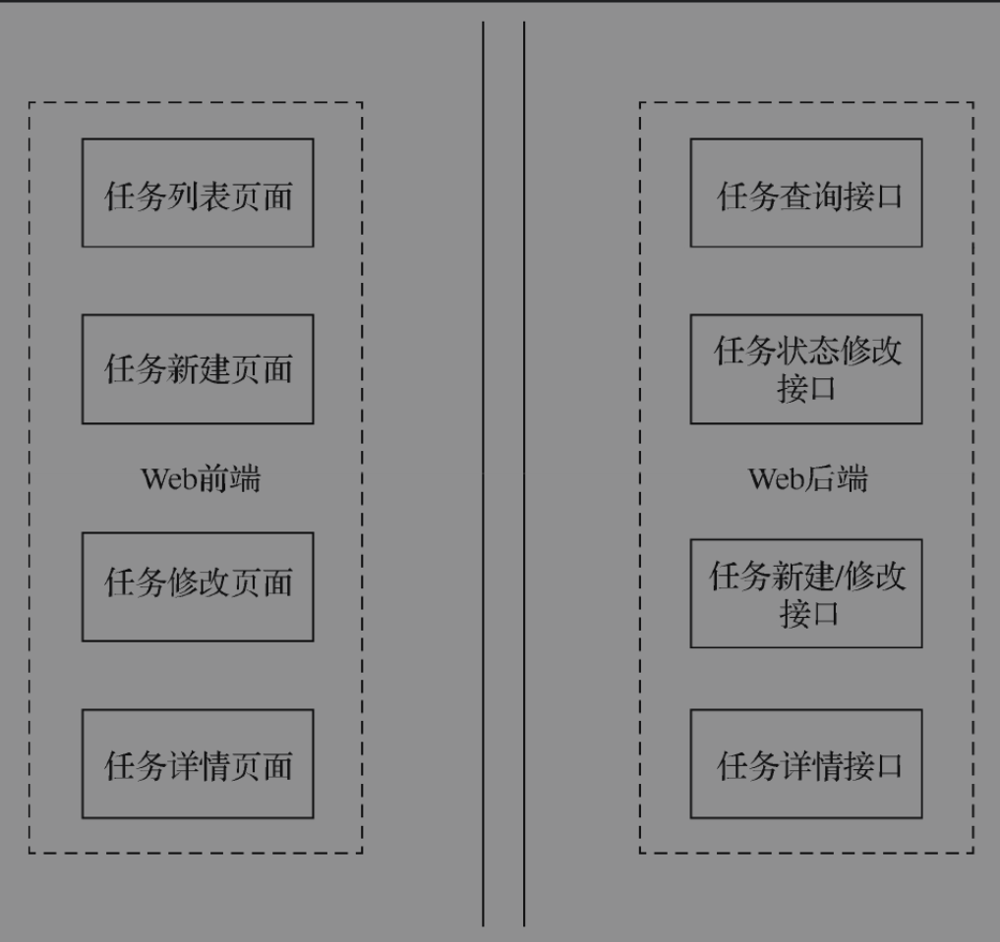
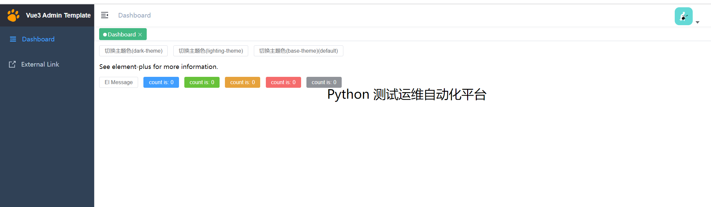
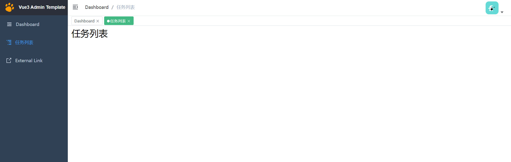
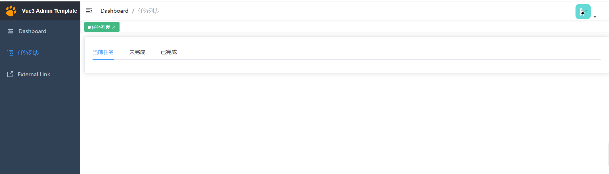

# 案例实战-任务列表

本节是对Vue框架知识的一个复习与演练，以一个较简单的需求来练习之前学习过的知识点，包括Python基础语法及Vue、Flask、records等库。

通过任务列表这个简单的项目，读者可以更容易地理解Web开发中前后端分离的形式，并且能熟悉Web开发的基本流程和开发方式。


## 1.需求说明及分析

为了把之前介绍的前后端知识完整地结合起来，本小节将以一个简单的示例项目来串联知识点。

开发一个任务列表项目，该项目实现的功能主要为任务列表的维护，包括任务的新建、修改、删除、查询等功能。


本项目中一个任务可以代表一个事项，即描述一个准备完成的事情。任务可以是需求评审、用例开发、测试执行、项目上线等。

每一个任务都有待执行、进行中、已完成、已废弃4种状态。

当用户首次新建任务时，其状态默认为待执行，此阶段用户可以修改任务状态为进行中、已废弃；

当任务状态为进行中时，用户可以修改任务状态为已完成、已废弃；

任务为已完成、已废弃状态时，表示当前任务已结束，不再支持任务状态的修改。

用户新建任务时，需要填写任务名称、执行时间、任务描述、执行人等信息。

任务新建完成后，只有状态为待执行、进行中时，才可以修改任务的具体内容，

当任务状态为已完成、已废弃时，不再支持对任务内容进行修改。

创建的任务默认以列表的形式展示，列表的标题字段包括任务ID、任务名称、执行时间、执行人、创建时间、操作。

其中操作字段包括查看、编辑、修改状态3个操作。

任务列表默认以创建时间倒序排列，且默认只展示10条任务记录。


## 2.模块及设计

本项目为前后端分离开发模式，

- 前端主要模块为任务列表页面、任务新建/修改页面、任务详情页面；

- 后端主要模块为任务查询接口、任务新建/修改接口、任务详情接口、任务状态修改接口。

任务列表项目模块设计




## 3.数据库设计

本项目主要围绕任务的信息进行增、删、改、查等操作，因此只需要维护一张任务表即可。表中的字段需要包括需求分析中提到的所有字段。

这里以MySQL数据库作为数据存储库，任务表的名称为task。具体表结构创建信息如下：

```sql
CREATE TABLE task ( 
 `id` int(11) NOT NULL AUTO_INCREMENT, 
 `name` varchar(100) NOT NULL COMMENT '任务名称', 
 `desc` varchar(255) DEFAULT NULL COMMENT '任务描述', 
 `start_time` timestamp NULL DEFAULT NULL COMMENT '执行开始时间', 
 `end_time` timestamp NULL DEFAULT NULL COMMENT '执行结束时间', 
 `assign` varchar(50) NOT NULL COMMENT '执行人', 
 `status` enum('DISCARD','FINISHED','INPROCESS','INIT') NOT NULL DEFAULT 'INIT' 
COMMENT '状态', 
 `created_time` timestamp NOT NULL DEFAULT CURRENT_TIMESTAMP, 
 `is_del` tinyint(1) DEFAULT '0' COMMENT '逻辑删除标识。0：未删除，1：已删除', 
 PRIMARY KEY (`id`) 
) ENGINE=InnoDB DEFAULT CHARSET=utf8;
```


## 4.前端开发

为了便于读者理解本书内容，这里将以一个搭建好的Vue开源框架为基础来完成本小节内容的Web前端开发；后续的Web项目都会基于这个模板框架进行开发。该模板框架的本地搭建方式如下：

```bash
# 复制项目
git clone -b study https://github.com/hujianli94/vue3-admin-template

# enter the project directory
cd vue3-admin-template

# pnpm address https://pnpm.io/zh/motivation
# install dependency(Recommend use pnpm)
# you can  use "npm -g i pnpm@6.32.3" to install pnpm
pnpm i

# develop
pnpm run dev
```

在安装过程正常的情况下，可以通过本地浏览器访问http://localhost:9527/进行页面查看。其默认的效果如图




选择开源框架的好处是减少了很多框架搭建的基础工作，同时可以拥有功能模块丰富的样例代码。

此外，平时工作中通常也会选取一个开源框架作为基础模板，之后在开源框架的基础上完成实际的项目开发。

因此，直接基于开源框架来学习，可能会更加贴近真实的实践场景。vue3-admin-template框架使用起来非常简单，并且已经集成了element-ui和发送ajax的axios模块，同时还提供了完整的使用文档，非常适合作为搭建测试平台的项目基础模板。


下面将详细介绍如何基于vue3-admin-template框架来开发任务列表的前端页面。

### 4.1 添加路由

在vue3-admin-template框架中添加路由的方式非常简单，只需要编辑src/router/index.js文件，并在constantRoutes列表中追加一个路由子项即可。具体追加的路由内容如下：

```
 {
    path: '/todo',
    component: Layout,
    redirect: '/todo/index',
    hidden: false,
    children: [
      {
        path: 'index',
        component: () => import('@/views/todo/index'),
        name: 'Profile',
        meta: { title: '任务列表', icon: 'nested', noCache: true }
      }
    ]
  },
```


上面的路由信息中，只需要关注加粗的内容即可。顶层的path指定了当前路由的主路径为/todo，

children列表成员中的path指定了该子菜单的路由为index，而子菜单的全路径则为/todo/index。

子菜单中的component节点指定了具体要展示的内容页面的路径，后面会为这个路径添加对应的页面。

**子菜单中的meta节点则用于配置子菜单的相关属性，title用于配置菜单名称，icon用于配置菜单图标。**

**主菜单中的redirect则表示当访问主菜单时，会直接跳转到指定的子菜单页面。**


> 说明
>
> 上述路由配置是一个常规的配置，在此基础之上还可以继续添加更多的子菜单。
>
> 如果需要新增其他的主菜单，只需要复制上述内容并修改加粗字体为相应内容即可。

### 4.2 添加页面

前面添加路由时，在子菜单的component节点指定要展示的页面路径，接下来就要为该路径添加具体的页面内容。

示例中设置的路径为@/views/todo/index，这是一个相对于src主目录的路径，因此该页面路径的具体位置为src/views/todo/index。

为此需要创建一个路径为src/views/todo的目录，同时在该目录下创建一个名为index.vue的文件，其初始内容如下：

```
<template>
  <div class="app-container">
    <h1>{{ title }} </h1>
  </div>
</template>

<script>
export default {
  setup () {
    const title = ref("任务列表")

    return {
      title
    }
  }
}
</script>

<style lang="scss" scoped>

</style>
```

该页面就是任务列表的展示页面，后面将基于该页面添加任务列表的页面元素及元素操作事件。保存好相关修改的文件后，刷新浏览器页面，会发现左侧菜单栏多出一个名为任务列表的菜单，单击该菜单会跳转到上述初始页面。

其具体效果如图



任务列表初始页面

### 4.3 添加元素

基础页面配置完成后，需要为任务列表设计具体的页面元素。

具体而言，需要把任务拆分为当前任务、未完成任务、已完成任务。其中当前任务为当天有效的任务，未完成任务为状态为没有完成的任务，已完成任务为状态为已完成的任务。为此需要替换为如下代码：

```
<template>
  <div>
    <el-row :gutter="20">
      <el-col :span="24" :xs="24">
        <el-card>
          <el-tabs v-model="activeTab" @tab-click="handleClick">
            <el-tab-pane label="当前任务" name="current"></el-tab-pane>
            <el-tab-pane label="未完成" name="unfinish"></el-tab-pane>
            <el-tab-pane label="已完成" name="finished"></el-tab-pane>
          </el-tabs>
        </el-card>
      </el-col>
    </el-row>
  </div>
</template>

<script>
export default {
  setup() {
    const activeTab = ref('current')

    return {
      activeTab
    }
  }
}
</script>

<style lang="scss" scoped></style>
```

示例中的＜el-row＞、＜el-col＞、＜el-card＞、＜el-tabs＞等都是element-ui组件库中提供的标准组件，使用这些组件可以快速地搭建所需的页面元素。关于如何获取不同组件的代码样例和使用说明，请自行查阅element-ui的官方中文文档。

此处示例中通过＜el-row＞和＜el-col＞来进行格局布置，具体就是创建一个单行单列的布局格式；在这个布局格式中通过＜el-tabs＞组件创建任务分类，其下的＜el-tab-pane＞子元素则是用于对任务进行分类展示的具体标签页。

具体的代码效果如图




接下来，需要添加创建任务的按钮，通过单击该按钮来弹出一个任务信息输入弹层；

在弹层中输入新建任务的内容，单击“提交”按钮后保存数据到后台的数据库中，以完成新建任务的功能。

添加“创建”按钮的界面代码见加粗字体：

```
<el-card> 
<el-button type="primary" @click="createTask">创建任务</el-button> 
<el-tabs v-model="activeTab"> 
…
```

之后，还需要给页面添加一个任务列表，该任务列表在不同的任务Tab下会展示不同的任务内容。任务列表的界面代码如下：

```
<template>
  <div>
    <el-row :gutter="20">
      <el-col :span="24" :xs="24">
        <el-card>
          <el-button type="primary" @click="createTask">创建任务</el-button>
          <el-tabs v-model="activeTab">
            <el-tab-pane label="当前任务" name="current"></el-tab-pane>
            <el-tab-pane label="未完成" name="unfinish"></el-tab-pane>
            <el-tab-pane label="已完成" name="finished"></el-tab-pane>
          </el-tabs>
        </el-card>
      </el-col>
    </el-row>
    <el-table :data="tableData" border style="width: 100%">
      <el-table-column fixed prop="name" label="任务名称" width="100"></el-table-column>
      <el-table-column prop="desc" label="任务描述" width="300"></el-table-column>
      <el-table-column prop="start_time" label="开始时间" width="150"></el-table-column>
      <el-table-column prop="end_time" label="结束时间" width="150"></el-table-column>
      <el-table-column prop="assign" label="执行人" width="120"></el-table-column>
      <el-table-column prop="status" label="任务状态" width="120"></el-table-column>
      <el-table-column fixed="right" label="操作" width="100">
        <template v-slot="scope">
          <el-button type="text" size="small" @click="editTask(scope.row)">编 辑</el-button>
        </template>
      </el-table-column>
    </el-table>
  </div>
</template>

<script>
import { reactive } from 'vue'
export default {
  setup() {
    const activeTab = ref('current')
    const tableData = reactive([{
      // 创建响应式数据
      name: '测试任务',
      desc: '任务描述',
      start_time: '2020-06-21',
      end_time: '2020-07-01',
      assign: '张三',
      status: '进行中'
    }])
    return {
      activeTab,
      tableData
    }
  }
}
</script>

<style lang="scss" scoped></style>
```

### 4.4  添加事件处理

完成页面展示代码之后，为了能够正常地处理用户的单击操作，还需要为各事件元素添加相应的事件处理函数。

例如，创建任务的click事件注册了名为createTask的处理函数，编辑任务的click事件注册了名为editTask的处理函数。

为此，除了在页面代码中通过@click属性来绑定事件处理函数。

具体示例代码如下：

```

    const createTask = () => {
      console.log('createTask');
    }

    const editTask = (row) => {
      console.log(row);
    }

    return {
      activeTab,
      tableData,
      createTask,
      editTask
    }
```


完成上述代码的修改之后，单击界面上的“创建任务”按钮会在浏览器的控制台输出“createTask”字符；

同样，如果单击任务列表中的“编辑”按钮，则会在浏览器的控制台输出当前行任务的具体信息内容。


在上述代码测试通过之后，就需要把事件处理函数的内容替换为真正的业务逻辑代码。

即createTask函数会弹出一个新建任务弹层，editTask任务会弹出一个编辑任务的弹层。为此，还需要添加额外的弹层界面代码，其内容如下：

```
<template>
  <div>
    <el-row :gutter="20">
      <el-col :span="24" :xs="24">
        <el-card>
          <el-button type="primary" @click="createTask">创建任务</el-button>
          <el-tabs v-model="activeTab">
            <el-tab-pane label="当前任务" name="current"></el-tab-pane>
            <el-tab-pane label="未完成" name="unfinish"></el-tab-pane>
            <el-tab-pane label="已完成" name="finished"></el-tab-pane>
          </el-tabs>
        </el-card>
      </el-col>
    </el-row>
    <el-table :data="tableData" border style="width: 100%">
      <el-table-column fixed prop="name" label="任务名称" width="100"></el-table-column>
      <el-table-column prop="desc" label="任务描述" width="300"></el-table-column>
      <el-table-column prop="start_time" label="开始时间" width="150"></el-table-column>
      <el-table-column prop="end_time" label="结束时间" width="150"></el-table-column>
      <el-table-column prop="assign" label="执行人" width="120"></el-table-column>
      <el-table-column prop="status" label="任务状态" width="120"></el-table-column>
      <el-table-column fixed="right" label="操作" width="100">
        <template #default="scope">
          <el-button type="text" size="small" @click="editTask(scope.row)">编 辑</el-button>
        </template>
      </el-table-column>
    </el-table>
    <el-row :gutter="20">
      <el-col :span="24" :xs="24">
        <el-drawer
          v-model="drawer"
          title=""
          :with-header="false">
          <div style="padding: 10px">
            <h3>{{ title }}</h3>
            <br/>
            <el-form ref="form" :model="form" label-width="80px">
              <el-form-item label="任务名称">
                <el-input v-model="form.name"></el-input>
              </el-form-item>
              <el-form-item label="任务描述">
                <el-input v-model="form.desc"></el-input>
              </el-form-item>
              <el-form-item label="开始时间">
                <el-input v-model="form.start_time"></el-input>
              </el-form-item>
              <el-form-item label="结束时间">
                <el-input v-model="form.end_time"></el-input>
              </el-form-item>
              <el-form-item label="执行人">
                <el-input v-model="form.assign"></el-input>
              </el-form-item>
              <el-form-item label="任务状态">
                <el-select v-model="form.status" placeholder="请选择任务状态">
                  <el-option label="待执行" value="INIT"></el-option>
                  <el-option label="进行中" value="INPROCESS"></el-option>
                  <el-option label="已完成" value="FINISHED"></el-option>
                  <el-option label="已废弃" value="DISCARD"></el-option>
                </el-select>
              </el-form-item>
              <el-form-item>
                <el-button type="primary" @click="onSubmit">保存</el-button>
                <el-button @click="drawer = false">取消</el-button>
              </el-form-item>
            </el-form>
          </div>
        </el-drawer>
      </el-col>
    </el-row>
  </div>
</template>

<script>
export default {
  setup() {
    const title =  ref('')
    const drawer = ref(false)
    const activeTab = ref('current')
    // const tableData =  ref([])
    const loading = ref(false)

    const tableData = reactive([
      {
        // 创建响应式数据
        name: '测试任务',
        desc: '任务描述',
        start_time: '2020-06-21',
        end_time: '2020-07-01',
        assign: '张三',
        status: '进行中'
      }
    ])
    const form = [
      {
        name: '',
        desc: '',
        start_time: '',
        end_time: '',
        assign: '',
        status: ''
      }
    ]

    const createTask = () => {
      title.value = '创建任务'
      drawer.value = true
      form.values = {}
    }

    const editTask = (row) => {
      title.value = '编辑任务'
      drawer.value = true
      form.values = row
    }


    const onSubmit = () => {
      console.log('submit!')
    }

    return {
      title,
      drawer,
      activeTab,
      tableData,
      form,
      createTask,
      editTask,
      onSubmit
    }
  }
}
</script>

<style lang="scss" scoped></style>
```

单击“保存”按钮则会在浏览器的控制台输出“submit!”字符串，而单击“取消”按钮则会自动关闭弹层。


### 4.5  提交表单数据

在之前的内容中已经完成了页面的设计和交互，这里需要做的是把表单的内容提交到服务器端。Vue中发送ajax请求到服务器端推荐使用axios组件，而vue-element-admin框架已经集成并封装了该组件。

首先，在src/api目录下新建一个todo.js的文件，其内容如下：

```
import request from '@/utils/axiosReq'

export function submit(data) {
  return request({
    url: '/api/todo',
    data,
    method: 'post',
    bfLoading: false,
    isParams: true,
    isAlertErrorMsg: false
  })
}
```

这里定义了一个发送ajax请求的submit函数，该函数实际上调用了封装好axios组件的request函数，并将请求相关的url、method、headers、data数据传递给该底层函数。

之后，在src/views/todo/index.vue页面中引入定义好的submit函数，并将onSubmit处理函数中的内容进行替换。具体更新的代码内容如下：

```
<template>
  <div>
	.......

    <el-row :gutter="20">
      <el-col :span="24" :xs="24">
        <el-drawer
          v-model="dialog"
          title=""
          :before-close="handleClose"
          direction="rtl"
          custom-class="demo-drawer"
          :with-header="false"
        >
          <h3>{{ title }}</h3>
          <br />
          <div class="demo-drawer__content">
            <el-form
            :model="ruleForm"
            :rules="rules"
            label-width="80px">
              <el-form-item label="任务名称" prop="name" :label-width="formLabelWidth">
                <el-input v-model="ruleForm.name" autocomplete="off" />
              </el-form-item>
              <el-form-item label="任务描述" :label-width="formLabelWidth">
                <el-input v-model="ruleForm.desc" autocomplete="off" />
              </el-form-item>
              <el-form-item label="开始时间">
                <el-date-picker
                  v-model="ruleForm.start_time"
                  align="right"
                  type="date"
                  value-format="yyyy-MM-dd"
                  placeholder="选择日期"
                />
              </el-form-item>
              <el-form-item label="结束时间">
                <el-date-picker
                  v-model="ruleForm.end_time"
                  align="right"
                  type="date"
                  value-format="yyyy-MM-dd"
                  placeholder="选择日期"
                />
              </el-form-item>
              <el-form-item label="执行人" prop="assign" :label-width="formLabelWidth">
                <el-input v-model="ruleForm.assign" autocomplete="off" />
              </el-form-item>

              <el-form-item label="任务状态" :label-width="formLabelWidth">
                <el-select v-model="ruleForm.status" placeholder="请选择任务状态">
                  <el-option label="待执行" value="INIT" />
                  <el-option label="进行中" value="INPROCESS" />
                  <el-option label="已完成" value="FINISHED" />
                  <el-option label="已废弃" value="DISCARD" />
                </el-select>
              </el-form-item>
            </el-form>
            <el-form-item>
              <el-button type="primary" :loading="loading" @click="onSubmit">
                {{ loading ? '提交中 ...' : '提交' }}
              </el-button>
              <el-button @click="cancelForm">取消</el-button>
            </el-form-item>
          </div>
        </el-drawer>
      </el-col>
    </el-row>
  </div>
</template>

<script>
import { reactive, ref } from 'vue'
import { submit } from '@/api/todo'
import { ElDrawer, ElMessageBox, ElMessage } from 'element-plus'
import { validateHan } from '@/utils/validate'

export default {
  setup() {
    const title = ref('')
    const activeTab = ref('current')
    const dialog = ref(false)
	.......
    const onSubmit = () => {
      loading.value = true
      submit(ruleForm.values).then((response) => {
        console.log(ruleForm.values)
        if (response.code === 0) {
          ElMessage.success('保存成功！')
          loading.value = false
        }
      })
    }
    return {
      .......
      onSubmit,

    }
  }
}
</script>

<style lang="scss" scoped></style>
```


### 4.6 获取任务列表

任务内容提交到服务器之后，还需要再次从服务器拉取下来以便于查看。与提交数据到服务器类似，从服务器获取数据同样需要通过ajax方式来发送HTTP请求。具体要做的是在src/api/todo.js文件中新建一个名为pullData的函数。具体内容如下：

```
export function pullData(params) {
  return request({
    url: '/api/todo',
    method: 'get',
    data: params
  })
}
```

然后，在src/views/todo/index.vue文件中引入该函数：

```
import { submit, pullData } from '@/api/todo'
```

同时定义一个调用该函数的新函数getTaskData。其代码内容如下：

```
  const getTaskList = (tab) => {
      pullData({ tab: tab }).then((response) => {
        if (response.code === 0) {
          tableData.value = response.data
        }
      })
    }
```

最后，在需要获取任务列表的场景中调用该函数，如初始化页面、单击tab标签、提交数据成功之后刷新页面内容等场景。

> 说明
>
> 任务列表项目的前端完整代码已提交至GitHub中，获取完整代码的分支路径为：
>
> https://github.com/five3/vue-element-admin/tree/todo。


## 5. Vue+Flask 接口跨域解决方法

参考文献：

https://blog.csdn.net/m0_56699208/article/details/125597260

https://blog.csdn.net/djl13420502002/article/details/123791881


