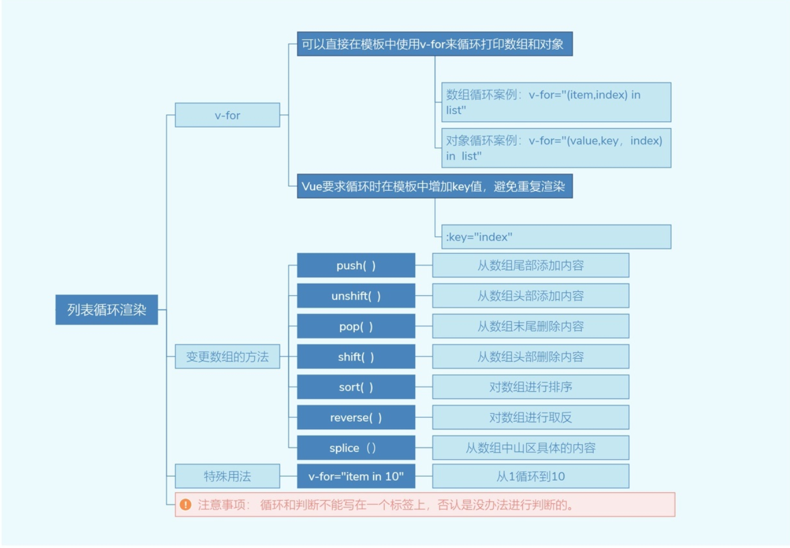
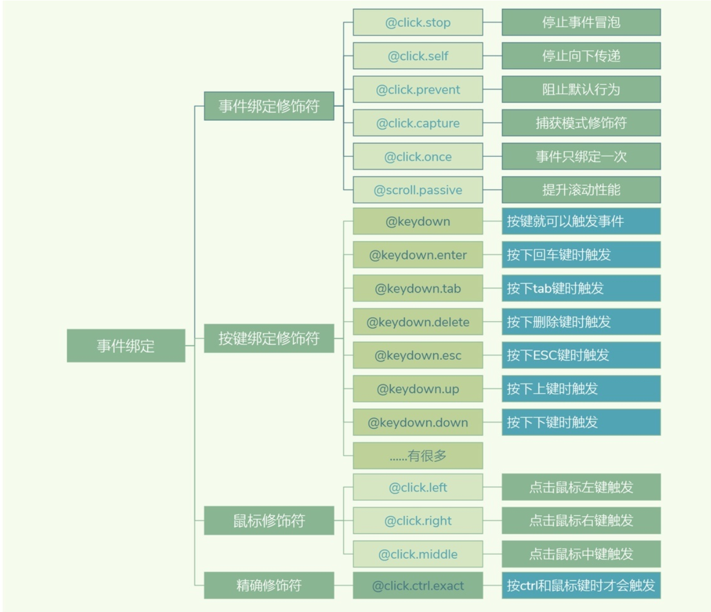

#  Vue内置指令

## 1.基本指令

### 1.1 v-text与v-html

v-text与v-html指令都可以用来更新页面元素的内容，但是二者也有不同点，v-text输出的数据是以字符串形式显示的，而v-html不仅可以输出字符串形式的数据，而且可以渲染字符串中的HTML标签。

```html
<!DOCTYPE html>
<html>
	<head>
		<meta charset="utf-8" />
		<title></title>
		<script src="js/vue.js" type="text/javascript" charset="utf-8"></script>
	</head>
	<body>
		<div id="app">
			<!-- 基础指令 -->
			<div v-text="message">{{message}}</div>
			<div v-html="message"></div>
		</div>
		<script type="text/javascript">
			new Vue({
				el: '#app',
				data: {
					message: '<a href="http://cn.vuejs.org">vue.js官网</a>'
				}
			})
		</script>
	</body>
</html>

```

### 1.2 v-bind

v-bind可以用来绑定标签的属性，例如：标签的srcs属性，<a>标签的title属性等。使用v-bind绑定的属性值应该为一个JavaScript的变量，或者是JavaScript表达式。

```html
<!DOCTYPE html>
<html>
	<head>
		<meta charset="utf-8" />
		<title></title>
		<script src="js/vue.js" type="text/javascript" charset="utf-8"></script>
	</head>
	<body>
		<div id="app">
			<!-- v-bind指令 -->
			<div>
				<!-- <a href="https://cn.vuejs.org/" v-bind:title="titleText">Vue.js官网</a> -->
				<!-- 缩写 -->
				<a href="https://cn.vuejs.org/" :title="titleText">Vue.js官网</a>
			<!-- </div> -->
			</div>
		</div>
		<script type="text/javascript">
			new Vue({
				el: '#app',
				data: {
					titleText: "Vue.js是目前最流行的前端框架之一"
				}
			})
		</script>
	</body>
</html>
```


### 1.3 v-once

v-once指令只渲染元素和组件一次，随后的渲染，如果使用了此指令的元素、组件及其所有子节点，则都会当作静态内容并跳过。这个特性可以用于优化更新性能。index.html文件代码如下：

```html
<!DOCTYPE html>
<html>
	<head>
		<meta charset="utf-8" />
		<title></title>
		<script src="js/vue.js" type="text/javascript" charset="utf-8"></script>
	</head>
	<body>
		<div id="app">
			<!-- v-once指令 -->
			<p><input type="type" v-model="message" /></p>
			<p v-once>只渲染一次：{{message}}</p>
			<p>可以改变：{{message}}</p>
		</div>
		<script type="text/javascript">
			new Vue({
				el: '#app',
				data: {
					message: "hello"
				}
			})
		</script>
	</body>
</html>

```

### 1.4 v-cloak

v-cloak指令将会保持在DOM元素上，直到关联实例结束编译后自动移除。v-cloak指令的使用场景非常有限，常用于解决网络较慢时数据的加载问题。用户在访问Vue.js实现的网站时，如果网络延迟，网页还在加载Vue.js，便会导致Vue来不及渲染，这时页面就会显示出Vue源代码，我们就可以使用v-cloak指令来解决这一问题。

```html
<!DOCTYPE html>
<html>
	<head>
		<meta charset="utf-8" />
		<title></title>
		<script src="js/vue.js" type="text/javascript" charset="utf-8"></script>
		<style>
			[v-cloak] {
			    display: none;
			}
		</style>
	</head>
	<body>
		<div id="app" v-cloak>
			{{message}}
		</div>
		<script>
			new Vue({
			    el: "#app",
			    data: {
			        message: "hello world"
			    }
			})
		</script>
	</body>
</html>

```

### 1.5 v-pre

v-pre指令会跳过这个元素和它的子元素的编译过程，所以可以用来显示原始Mustache标签。跳过大量没有指令的节点会加快编译，代码如下：

```html
<!DOCTYPE html>
<html>
	<head>
		<meta charset="utf-8" />
		<title></title>
		<script src="js/vue.js" type="text/javascript" charset="utf-8"></script>
	</head>
	<body>
		<div id="app">
			<span v-pre>{{ this will not be compiled }}</span>
		</div>
		<script type="text/javascript">
			new Vue({
				el: '#app',
				data: {
				}
			})
		</script>
	</body>
</html>

```


## 2 条件渲染

### 2.1 v-show

v-show指令可以根据条件展示元素，带有v-show的元素始终会被渲染并保留在DOM中，v-show只是通过简单地切换元素CSS属性display：none实现的。例如，将上面的代码v-show的值设置为false，代码如下：

```html
<!DOCTYPE html>
<html>
	<head>
		<meta charset="utf-8" />
		<title></title>
		<script src="js/vue.js" type="text/javascript" charset="utf-8"></script>
	</head>
	<body>
		<div id="app">
			<h1 v-show="true">Hello!</h1>
			<h1 v-show="false">Hello!</h1>
		</div>
		<script type="text/javascript">
			new Vue({
				el: '#app',
				data: {
				}
			})
		</script>
	</body>
</html>
```


### 2.2 v-if与v-else-if

v-if和v-show都可以实现条件渲染，但是v-if与v-show不同的是，v-if不是通过切换CSS属性实现显示与隐藏的，当v-if的值为false时，**带有v-if的DOM元素就不会被渲染出来。**

v-if和v-show最大的不同就是，v-if不仅可以单独使用，还可以和v-else-if、v-else指令配合使用，类似于JavaScript中的if-else、if-else-if语句。

```html
<!DOCTYPE html>
<html>
	<head>
		<meta charset="utf-8" />
		<title></title>
		<script src="js/vue.js" type="text/javascript" charset="utf-8"></script>
	</head>
	<body>
		<div id="app">
			<!-- v-if -->
			<h2 v-if="ok">Vue.js</h2>
			<h2 v-if="!ok">React.js</h2>
			
			<!-- v-else-if -->
			<p v-if="value === 'A'">A</p>
			<p v-else-if="value === 'B'">B</p>
			<p v-else>Not A/B</p>
		</div>
		<script>
			new Vue({
			    el: "#app",
			    data: {
			        ok: true,
					value: "B"
			    }
			})
		</script>
	</body>
</html>

```

### 2.3 v-if和v-show的区别

v-if与v-show指令都可以根据表达式的值来控制元素的显示与隐藏状态。

v-if相比于v-show，更“真实”地实现了元素的渲染与移除，但是在频繁的切换过程中，使DOM元素不断地在内存中重建与销毁，这样便增加了内存的开销。

v-show是更简单的一种切换显示与隐藏状态的操作，只是修改了CSS属性中display的值，无论显示与隐藏，DOM元素始终被渲染。

**综上所述，如果需要在页面中频繁地切换某个元素的显示状态，推荐使用v-show指令；如果在运行时条件很少改变，则推荐使用v-if指令。**


在\<template\>元素上使用v-if条件渲染分组

因为v-if是一个指令，所以必须将它添加到一个元素上。但是如果想切换多个元素应该如何操作呢？此时可以把一个<template>元素当作不可见的包裹元素，并在上面使用v-if。最终的渲染结果将不包含<template>元素。

```html
<!DOCTYPE html>
<html>
	<head>
		<meta charset="utf-8" />
		<title></title>
		<script src="js/vue.js" type="text/javascript" charset="utf-8"></script>
	</head>
	<body>
		<div id="app">
			<template v-if="value">
				<h2>Vue教程</h2>
				<h2>Vue教程11111</h2>
				<h2>Vue教程2222</h2>
			</template>

		</div>
		<script>
			new Vue({
			    el: "#app",
			    data: {
					value: true
			    }
			})
		</script>
	</body>
</html>
```

## 3 列表渲染

遍历元素

当遍历一个数组或枚举一个对象进行迭代循环展示时，会用到列表渲染的指令v-for。v-for指令类似于JavaScript中的for循环，在Vue中提供了v-for指令用来循环数组。

### 3.1 遍历数组

```
<!-- 遍历数组 -->
<p v-for="(item,index) in list">
{{index}}. {{item}}
</p>
```

### 3.2 遍历对象

```
<!-- 遍历对象 -->
<p v-for="(value,key) in student">
{{key}}：{{value}}
</p>
```

### 3.3 遍历整数

```
<!-- 遍历整数 -->
<p v-for="i in 5">{{i}}</p>
```

完整示例

```html
<!DOCTYPE html>
<html>
	<head>
		<meta charset="utf-8" />
		<title></title>
		<script src="js/vue.js" type="text/javascript" charset="utf-8"></script>
	</head>
	<body>
		<div id="app">
			<!-- 遍历数组 -->
			<p v-for="(item,index) in list">
				{{index}}. {{item}}
			</p>

			<!-- 遍历对象 -->
			<p v-for="(value,key) in student">
				{{key}}：{{value}}
			</p>
			
			<!-- 遍历整数 -->
			<p v-for="i in 5">{{i}}</p>
		</div>
		<script>
			new Vue({
				el: "#app",
				data: {
					list: ['html', 'css', 'javascript', 'vue'],
					student: {
						id: 1,
						name: '韩梅梅',
						age: 18
					}
				}
			})
		</script>
	</body>
</html>
```





## 4 维护状态

当Vue正在更新使用v-for渲染的元素列表时，它默认使用“就地更新”的策略。

如果数据项的顺序被改变，Vue将不会移动DOM元素来匹配数据项的顺序，而是就地更新每个元素，并且确保它们在每个索引位置被正确渲染。

这个默认的模式是高效的，但是只适用于不依赖子组件状态或临时DOM状态（例如：表单输入值）的列表渲染输出。

为了给Vue一个提示，以便它能跟踪每个节点的身份，从而重用和重新排序现有元素，需要为每项提供一个唯一key属性，代码如下：

```
<p v-for="item in ltems" v-bind:key="item.id"></p>
```

> 注意: 不要使用对象或数组之类的非基本类型值作为v-for的key，而要使用字符串或数值类型的值。

示例

不使用key属性示例

```html
<!DOCTYPE html>
<html>
<head>
    <meta charset="UTF-8">
    <title>不使用key属性</title>
</head>
<body>

<div id="app">
    <div>名称:<input type="text" v-model="names"></div>
    <div>产地:<input type="text" v-model="citys"></div>
    <div>价格:<input type="text" v-model="prices"><button v-on:click="add()">添加</button></div>
    <hr>
    <p v-for="item in nameList">
    <input type="checkbox">
    <span>名称:{{item.name}}—产地:{{item.city}}—价格:{{item.price}}</span>
</p>

</div>
<!--引入vue文件-->
<script src="https://unpkg.com/vue@next"></script>
<script>
    //创建一个应用程序实例
    const vm= Vue.createApp({
        data(){
          return{
            names:"",
            citys:"",
            prices:"",
            nameList:[
                {name:'洗衣机',city:'北京',price:'6800元'},
                {name:'冰箱',city:'上海',price:'8900元'},
                {name:'空调',city:'广州',price:'6800元'}
            ]
           }
         },
        methods:{
            add:function(){
                this.nameList.unshift({
                    name:this.names,
                    city:this.citys,
                    price:this.pricees
                })
            }
        }
     }).mount('#app');
</script>
</body>
</html>
```

为了给Vue一个提示，以便它能跟踪每个节点的身份，从而重用和重新排序现有元素，需要为每项提供一个唯一key属性。 修改上面示例，在v-for指令的后面添加key属性。代码如下：

```
<div id="app">
    <div>名称:<input type="text" v-model="names"></div>
    <div>产地:<input type="text" v-model="citys"></div>
    <div>价格:<input type="text" v-model="prices"><button v-on:click="add()">添加</button></div>
    <hr>
    <p v-for="item in nameList" v-bind:key="item.name">
    <input type="checkbox">
    <span>名称:{{item.name}}—产地:{{item.city}}—价格:{{item.price}}</span>
</p>

</div>
```


## 5 数组更新检测

### 1.变更方法

Vue将被侦听的数组的变更方法进行了包裹，所以它们也会触发视图更新。这些被包裹过的方法如下。

1. push()：接收任意数量的参数并逐个追加到原数组末尾，返回新数组的长度。
2. pop()：移除数组最后一项，返回被移除的元素。
3. shift()：移除数组的第一项，返回被移除的元素。
4. unshift()：在数组前追加新元素，返回新数组长度。
5. splice()：删除指定索引的元素，并且可以在该索引处添加新元素。
6. sort()：对数组进行排序，默认按字典升序排序，返回排序后的数组。
7. reverse()：用于反转数组的顺序，返回反转后的数组。这些方法类似于JavaScript中操作数组的方法。

这些方法类似于JavaScript中操作数组的方法。index.html文件代码如下：

```html
<!DOCTYPE html>
<html>
	<head>
		<meta charset="utf-8" />
		<title></title>
		<script src="js/vue.js" type="text/javascript" charset="utf-8"></script>
	</head>
	<body>
		<div id="app">
			<!-- 遍历数组 -->
			<p v-for="item in list">{{item}}</p>

		</div>
		<script>
		var vm =new Vue({
				el: "#app",
				data: {
					list: ['html', 'css', 'javascript', 'vue'],
				}
			})
			vm.list.push('jquery');
		</script>
	</body>
</html>

```

### 2.替换数组

变更方法，顾名思义，会变更调用这些方法的原始数组。相比之下，也有非变更方法，例如filter()、concat()和slice()。

它们不会变更原始数组，而是返回一个新数组。当使用非变更方法时，可以用新数组替换旧数组。

非变更方法如下。

1. concat():创建当前数组的副本，然后拼接参数中的数组，返回拼接后的新数组。
2. slice():将数组的索引作为参数，可从已有的数组中返回选定的元素，返回新数组。
3. map():对数组的每一项运行给定函数，返回每次函数调用的结果所组成的数组。
4. filter():对数组的每一项运行给定函数，该函数会返回值为true的项所组成的数组。非变更方法也和JavaScript中的方法类似。

index.html文件代码如下：

```html
<!DOCTYPE html>
<html>
	<head>
		<meta charset="utf-8" />
		<title></title>
		<script src="js/vue.js" type="text/javascript" charset="utf-8"></script>
	</head>
	<body>
		<div id="app">
			<li v-for="n in evenNumbers" :key="n">{{ n }}</li>
		</div>
		<script>
		 new Vue({
				el: "#app",
				data() {
					return {
						numbers: [ 1, 2, 3, 4, 5 ]
				}
				},
				computed: {
					evenNumbers() {
						// return this.numbers.filter(number => number % 2 === 0)
						return this.numbers.filter(number => number < 4)
				}
				}

			})
		</script>
	</body>
</html>
```

### 3.对象变更检测注意事项

对于已经创建的实例，Vue不允许动态添加根级别的响应式属性。但是，可以使用Vue.set（object，propertyName，value）方法向嵌套对象添加响应式属性，代码如下：

```html
<!DOCTYPE html>
<html>
	<head>
		<meta charset="utf-8" />
		<title></title>
		<script src="js/vue.js" type="text/javascript" charset="utf-8"></script>
	</head>
	<body>
		<div id="app">
			<!-- 遍历数组 -->
			{{ studnet.name }} {{ studnet.age }}

		</div>
		<script>
		var vm =new Vue({
				el: "#app",
				data: {
					studnet: {
						name: '胡建力'
					}
				}
			})
			Vue.set(vm.studnet,'age',18)
		</script>
	</body>
</html>

```

除了上面的方法，还可以使用`vm.$set`实例方法添加响应式属性，它只是全局Vue.set的别名，代码如下：

### 4.在`<template>`上使用v-for

```
<!-- Vue 2.x -->
<template v-for="item in list">
  <div v-if="item.isVisible" :key="item.id">...</div>
  <span v-else :key="item.id">...</span>
</template>

<!-- Vue 3.x -->
<template v-for="item in list" :key="item.id">
  <div v-if="item.isVisible">...</div>
  <span v-else>...</span>
</template>
```

### 5. `v-for` 与 `v-if` 一同使用

当它们处于同一节点，`v-if` 的优先级比 `v-for` 更高，这意味着 `v-if` 将没有权限访问 `v-for` 里的变量：

```html
<!-- 这将抛出一个错误，因为“todo” property 没有在实例上定义 -->
<li v-for="todo in todos" v-if="!todo.isComplete">
  {{ todo.name }}
</li>
```

可以把 `v-for` 移动到 `<template>` 标签中来修正：

```html
<template v-for="todo in todos" :key="todo.name">
  <li v-if="!todo.isComplete">
    {{ todo.name }}
  </li>
</template>
```

## 6 事件处理

### 6.1 监听事件

事件是指在浏览器中通过内置的处理器监视特定的条件或用户行为，例如鼠标单击浏览器窗口中的按钮。

浏览器中内置了大量的事件处理器，当这些事件处理器被触发时，会执行一个绑定在该处理器上的函数，然后执行相应的内容。在Vue中可以使用v-on指令来完成事件函数的绑定。

`v-on` 指令 (通常缩写为 `@` 符号) 来监听DOM事件

```
<div id="basic-event">
  <button @click="counter += 1">Add 1</button>
  <p>The button above has been clicked {{ counter }} times.</p>
</div>
```

```js
Vue.createApp({
  data() {
    return {
      counter: 0
    }
  }
}).mount('#basic-event')
```

在调用事件函数时，我们还可以为事件函数传入参数。

```html
<!DOCTYPE html>
<html>
	<head>
		<meta charset="utf-8" />
		<title></title>
		<script src="js/vue.js" type="text/javascript" charset="utf-8"></script>
	</head>
	<body>
		<div id="app">
			<button v-on:click="reduct(5)">-</button>
			{{ num }}
			<button v-on:click="add(10)">+</button>
		</div>

		<script>
			var vm = new Vue({
			    el: "#app",
			    data: {
			        num: 0
			    },
			    methods: {
					add: function (i) {
						this.num +=i
					},
					reduct: function(i){
						this.num -=i
					}
			    }
			})
		</script>
	</body>
</html>
```


### 6.2 事件修饰符

在事件处理程序中调用event.preventDefault()或event.stopPropagation()是非常常见的需求。

尽管我们可以在方法中轻松实现这点，但更好的方式是：方法只有纯粹的数据逻辑，而不是去处理DOM事件细节。


为了解决这个问题，Vue.js为v-on提供了事件修饰符。使用修饰符可以节省很多代码和时间，这样便可以把更多的精力专注于处理程序的业务逻辑。v-on的修饰符是由点开头的指令后缀来表示的，在Vue中事件的修饰符主要有以下几个。

- `.stop`	等同于JavaScript中的event.stopPropagation()，阻止事件冒泡。
- `.prevent` 等 同 于 JavaScript 中 的event.preventDefault()，阻止默认事件的发生。
- `.capture`    与事件冒泡的方向相反，事件捕获由外到内。

- `.self`   只会触发自己范围内的事件。

**self修饰符可以理解为跳过冒泡事件和捕获事件**，只有直接作用在该元素上的事件才可以执行。self修饰符会监视事件是否是直接作用在元素上，若不是，则冒泡跳过该元素。

- `.once`  只会触发一次。

有时我们需要对元素只执行一次操作，例如社交软件上的点赞操作，可以使用once修饰符来完成。

- `.passive`  执行默认行为。

prevent修饰符用于阻止默认行为，例如标签，当单击标签时，默认行为会跳转到对应的链接，如果添加上prevent修饰符，将不会跳转到对应的链接。

而passive修饰符尤其能够提升移动端的性能。


```
<!-- 阻止单击事件继续冒泡 -->
<a @click.stop="doThis"></a>

<!-- 提交事件不再重载页面 -->
<form @submit.prevent="onSubmit"></form>

<!-- 修饰符可以串联 -->
<a @click.stop.prevent="doThat"></a>

<!-- 只有修饰符 -->
<form @submit.prevent></form>

<!-- 添加事件监听器时使用事件捕获模式 -->
<!-- 即内部元素触发的事件先在此处理，然后才交由内部元素进行处理 -->
<div @click.capture="doThis">...</div>

<!-- 只当在 event.target 是当前元素自身时触发处理函数 -->
<!-- 即事件不是从内部元素触发的 -->
```

示例代码

```
<!DOCTYPE html>
<html>
	<head>
		<meta charset="utf-8" />
		<title></title>
		<script src="js/vue.js" type="text/javascript" charset="utf-8"></script>
		<style type="text/css">
			/* 设置评论区的样式 */
			.comment {
				width: 200px;
				height: 100px;
				border: 1px solid #000;
			}

			/* 设置头像的样式 */
			.avatar {
				width: 50px;
				height: 50px;
				border: 1px solid #000;
				border-radius: 50%;
			}
		</style>
	</head>
	<body>
		<div id="app">
			<!-- 评论内容区 -->
			<div class="comment" @click="clickComment">
				<!-- 用户头像 -->
				<div class="avatar" @click.stop="clickAvatar"></div>
			</div>
		</div>
		<script>
			var vm = new Vue({
				el: "#app",
				methods: {
					clickComment() {
						alert('评论区被点击了')
					},
					clickAvatar() {
						alert('头像被点击了')
					}
				}
			})
		</script>
	</body>
</html>

```

### 6.3 按键修饰符

在Vue中可以使用以下3种键盘事件：

- keydown：键盘按键按下时触发。
- keyup：键盘按键抬起时触发。
- keypress：键盘按键按下抬起间隔期间触发。

在日常的页面交互中，经常会遇到这种需求。例如，用户输入账号密码后按Enter键，以及一个多选筛选条件，通过单击多选框后自动加载符合选中条件的数据。

在传统的前端开发中，碰到这种类似的需求时，往往需要知道JavaScript中需要监听的按键所对应的keyCode，然后通过判断keyCode得知用户按下了哪个按键，继而执行后续的操作。

> 提示 keyCode返回keypress事件触发的键值的字符代码或keydown、keyup事件的键的代码。

下面来看一个示例，当触发键盘事件时，调用一个方法。在这个示例中，为两个input输入框绑定keyup事件，用键盘在输入框输入内容时触发，每次输入内容都会触发并调用name或password方法。

触发键盘事件

```
<!DOCTYPE html>
<html>
<head>
    <meta charset="UTF-8">
    <title>触发键盘事件</title>
</head>
<body>
<div id="app">
    <label for="name">姓名：</label>
    <input v-on:keyup="name" type="text" id="name">
    <label for="pass">密码：</label>
    <input v-on:keyup="password" type="password" id="pass">
</div>
<!--引入vue文件-->
<script src="https://unpkg.com/vue@next"></script>
<script>
    //创建一个应用程序实例
    const vm= Vue.createApp({
        methods: {
            name:function(){
                console.log("正在输入姓名...")
            },
            password:function(){
                console.log("正在输入密码...")
            }
        }
     //在指定的DOM元素上装载应用程序实例的根组件
     }).mount('#app');
</script>
</body>
</html>
```

Vue提供了一种便利的方式来实现监听按键事件。

在监听键盘事件时，经常需要查找常见的按键所对应的keyCode，而Vue为最常用的按键提供了绝大多数常用的按键码的别名：

```
.enter
.tab
.delete(捕获"删除"和"退格"键)
.esc
.space
.up
.down
.left
.right
```

对于上面示例，每次输入都会触发keyup事件，有时候不需要每次输入都会触发，例如发QQ消息，希望所有的内容都输入完成再发送。 这时可以为keyup事件添加enter按键码，当Enter键抬起时，才会触发keyup事件。

例如，修改上面的示例，在keyup事件后添加enter按键码。

```
<!DOCTYPE html>
<html>
<head>
    <meta charset="UTF-8">
    <title>添加enter按键码</title>
</head>
<body>
<div id="app">
    <label for="name">商品名称：</label>
    <input v-on:keyup.enter="name" type="text" id="name">
</div>

<!--引入vue文件-->
<script src="https://unpkg.com/vue@next"></script>
<script>
    //创建一个应用程序实例
    const vm= Vue.createApp({
        methods: {
            name:function(){
                console.log("正在输入商品名称...")
            }
        }
     //在指定的DOM元素上装载应用程序实例的根组件
     }).mount('#app');
</script>
</body>
</html>
```


```
<!DOCTYPE html>
<html>
	<head>
		<meta charset="utf-8" />
		<title></title>
		<script src="js/vue.js" type="text/javascript" charset="utf-8"></script>
	</head>
	<body>
		<div id="app">
			<input type="text" v-model="value" @keydown.enter="handleInput" />
		</div>
		<script>
			var vm = new Vue({
			    el: "#app",
			    data: {
			        value: ''
			    },
			    methods: {
			        handleInput(){
			            console.log('值：',this.value)
			        }
			    }
			})
		</script>
	</body>
</html>
```

### 6.4 系统修饰键

可以用如下修饰符来实现仅在按下相应按键时才触发鼠标或键盘事件的监听器。

```
.ctrl
.alt
.shift
.meta
```

> 提示 系统修饰键与常规按键不同，在和keyup事件一起使用时，事件触发时修饰键必须处于按下状态。换句话说，只有在按住Ctrl的情况下释放其他按键，才能触发keyup.ctrl。而单单释放Ctrl键也不会触发事件。

系统修饰键

```
<!DOCTYPE html>
<html>
<head>
    <meta charset="UTF-8">
    <title>系统修饰键</title>
</head>
<body>
<div id="app">
    <label for="name">姓名：</label>
    <!--添加shift按键码-->
    <input v-on:keyup.shift.enter="name" type="text" id="name">
</div>
<!--引入vue文件-->
<script src="https://unpkg.com/vue@next"></script>
<script>
    //创建一个应用程序实例
    const vm= Vue.createApp({
        methods: {
            name:function(){
                console.log("正在输入姓名...")
            }
        }
     //在指定的DOM元素上装载应用程序实例的根组件
     }).mount('#app');
</script>
</body>
</html>
```

在浏览器中运行程序，在input中输入内容后，按Enter键是无法激活keyup事件的，首先需要按Shift，再按Enter键才可以触发。

### 6.5 综合案例-处理用户注册信息

本案例主要在按钮、下拉列表、复选框上添加事件处理，从而实现注册用户时的信息处理。在选择“同意本站协议”复选框之前，“注册”按钮是不可用的。

```
<!DOCTYPE html>
<html>
<head>
    <meta charset="UTF-8">
    <title>处理用户注册信息</title>
</head>
<body>
 <div id="app">
        <p>{{msg}}</p>
        <button v-on:click="handleClick">单击按钮</button>
        <button @click="handleClick">单击按钮</button>
        <h5>选择感兴趣技术</h5>
        <select v-on:change="handleChange">
            <option value="red">网站前端技术</option>
            <option value="green">Python编程技术</option>
            <option value="pink">Java编程技术</option>
        </select>
        <h5>表单提交</h5>
        <form v-on:submit.prevent="handleSubmit">
            <input type="checkbox"  v-on:click="handleDisabled"/>
            同意本站协议
            <br><br>
            <button :disabled="isDisabled">注册</button>
        </form>
 </div>
<!--引入vue文件-->
<script src="https://unpkg.com/vue@next"></script>
<script>
    //创建一个应用程序实例
    const vm= Vue.createApp({
        //该函数返回数据对象
        data(){
          return{
                msg:"注册账户",
                isDisabled:true
           }
        },
            //methods对象
            methods:{
                //通过methods来定义需要的方法
                handleClick:function(){
                    console.log("btn is clicked");
                },
                handleChange:function(event){
                    console.log("选择了某选项"+event.target.value);
                },
                handleSubmit:function(){
                    console.log("触发事件");
                },
                handleDisabled:function(event){
                    console.log(event.target.checked);
                    if(event.target.checked==true){
                        this.isDisabled =  false;
                    }
                    else {
                        this.isDisabled =  true;
                    }
                }
            }
     //在指定的DOM元素上装载应用程序实例的根组件
     }).mount('#app');
</script>
</body>
</html>
```


为什么在HTML中监听事件？

读者可能注意到这种事件监听的方式违背了关注点分离（separation of concern）的传统理念。不必担心，因为所有的 Vue.js事件处理方法和表达式都严格绑定在当前视图的ViewModel上，它不会导致任何维护上的困难。

实际上，使用v-on有几个好处： 

```
（1）通过HTML模板便能轻松定位在JavaScript代码里对应的方法。 
（2）因为无须在JavaScript里手动绑定事件，ViewModel代码可以是非常纯粹的逻辑，和DOM完全解耦，更易于测试。 
（3）当一个ViewModel被销毁时，所有的事件处理器都会自动被删除。无须担心如何清理它们。
```


## 7.表单输入绑定

### 7.1 修饰符

`lazy`

在输入框中，v-model默认是同步数据，使用lazy会转变为在change事件中同步，也就是在失去焦点或者按下回车键时才更新。

```
<!-- 在“change”时而非“input”时更新 -->
<input v-model.lazy="msg" />
```

`number`

如果想自动将用户的输入值转为数值类型，可以给 `v-model` 添加 `number` 修饰符：

```
<!DOCTYPE html>
<html>
<head>
    <meta charset="UTF-8">
    <title>number修饰符</title>
</head>
<body>
<div id="app">
        <p>.number修饰符</p>
        <input type="number" v-model.number="val">
        <p>数据类型是：{{ typeof(val) }}</p>
</div>
<!--引入vue文件-->
<script src="https://unpkg.com/vue@next"></script>
<script>
    //创建一个应用程序实例
    const vm= Vue.createApp({
        //该函数返回数据对象
        data(){
          return{
            val:''
           }
        }
        //在指定的DOM元素上装载应用程序实例的根组件
     }).mount('#app');
</script>
</body>
</html>
```

当输入类型为 `text` 时这通常很有用。如果输入类型是 `number`，Vue 能够自动将原始字符串转换为数字，无需为 `v-model` 添加 `.number` 修饰符。如果这个值无法被 `parseFloat()` 解析，则返回原始的值。

`trim`

如果要自动过滤用户输入的首尾空白字符，可以给 `v-model` 添加 `trim` 修饰符：

```
<!DOCTYPE html>
<html>
<head>
    <meta charset="UTF-8">
    <title>trim修饰符</title>
</head>
<body>
<div id="app">
    <p>.trim修饰符</p>
    <input type="text" v-model.trim="val">
    <p>val的长度是：{{ val.length }}</p>
</div>
<!--引入vue文件-->
<script src="https://unpkg.com/vue@next"></script>
<script>
    //创建一个应用程序实例
    const vm= Vue.createApp({
        //该函数返回数据对象
        data(){
          return{
            val:''
           }
        }
        //在指定的DOM元素上装载应用程序实例的根组件
     }).mount('#app');
</script>
</body>
</html>
```


示例代码

```
<!DOCTYPE html>
<html>
	<head>
		<meta charset="utf-8" />
		<title></title>
		<script src="js/vue.js" type="text/javascript" charset="utf-8"></script>
	</head>
	<body>
		<div id="app">
			<!-- 文本输入框 -->
			<input type="text" v-model="value" />
			<p>value的值：{{value}}</p>
			
			<!-- 文本输入框，修饰符 -->
			<input type="text" v-model.lazy="value" />
			<span>{{message}}</span>

			<!-- 文本域 -->
			<textarea rows="2" cols="15" v-model="message"></textarea>
			<p>文本域的值：{{message}}</p>

			<!-- 复选框 -->
			<input type="checkbox" v-model="hobby" value="篮球">篮球
			<input type="checkbox" v-model="hobby" value="足球">足球
			<input type="checkbox" v-model="hobby" value="排球">排球
			<p>爱好：{{hobby}}</p>

			<!-- 单选按钮 -->
			单选题：
			<input type="radio" v-model="selected" value="A">A
			<input type="radio" v-model="selected" value="B">B
			<input type="radio" v-model="selected" value="C">C
			<input type="radio" v-model="selected" value="D">D
			<p>选择：{{selected}}</p>

			<!-- 下拉框 -->
			年级：
			<select v-model="grade">
				<option value="一年级">一年级</option>
				<option value="二年级">二年级</option>
				<option value="三年级">三年级</option>
			</select>
			<p>选择：{{grade}}</p>
		</div>
		<script>
			var vm = new Vue({
				el: "#app",
				data: {
					value: '',
					message: '',
					hobby: [],
					selected: '',
					grade: ''
				}
			})
		</script>
	</body>
</html>
```





### 7.2 参考

https://v3.cn.vuejs.org/guide/forms.html#

