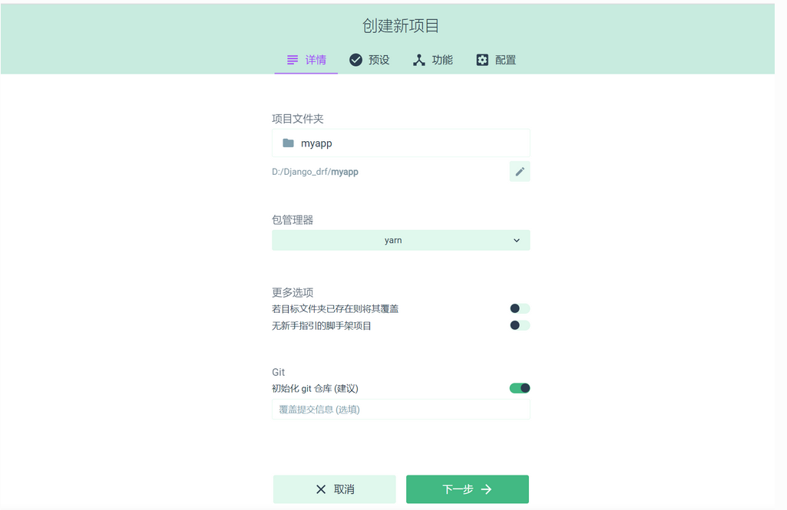
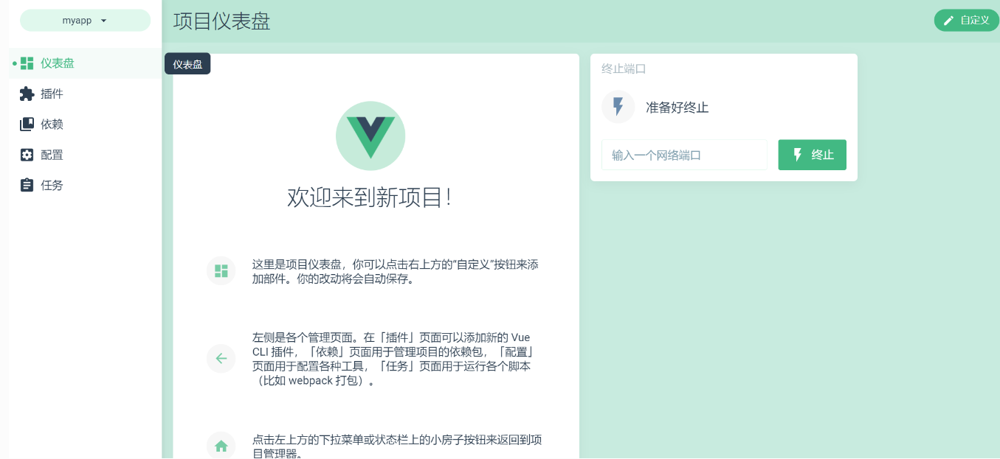
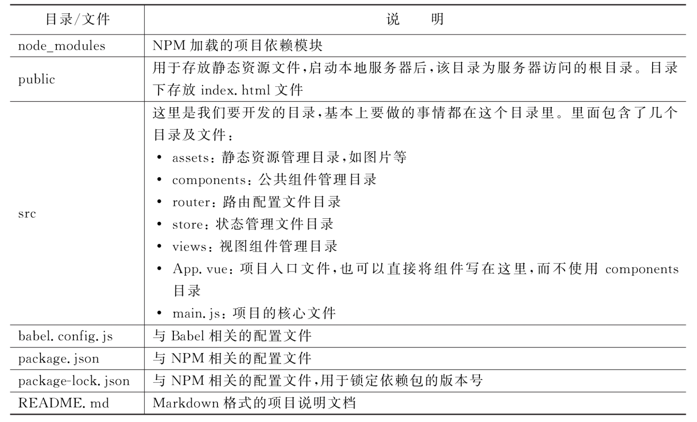
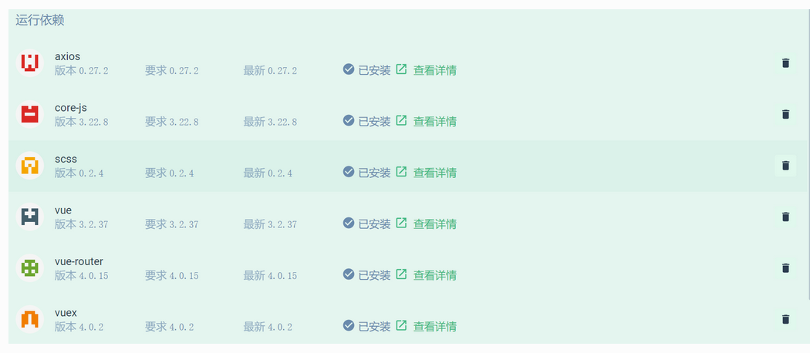

# Vue工程化项目

## 1.脚手架的组件

Vue CLI是一个基于Vue.js进行快速开发的完整系统，提供以下功能：

1. 通过@vue/cli搭建交互式的项目脚手架。
2. 通过@vue/cli+@vue/cli-service-global快速开始零配置原型开发。
3. 一个运行时的依赖（@vue/cli-service），该依赖基于webpack构建，并带有合理的默认配置，该依赖可升级，也可以通过项目内的配置文件进行配置，还可以通过插件进行扩展。
4. 一个丰富的官方插件集合，集成了前端生态中最好的工具。
5. 一套完全图形化的创建和管理Vue.js项目的用户界面。

Vue CLI有几个独立的部分——如果了解过Vue的源代码，会发现这个仓库里同时管理了多个单独发布的包。下面我们分别讲解这些包。


### 1.1 CLI

CLI（@vue/cli）是一个全局安装的NPM包，提供了终端里使用的Vue命令。它可以通过vue create命令快速创建一个新项目的脚手架，或者直接通过vue serve命令构建新想法的原型。也可以使用vue ui命令，通过一套图形化界面管理你的所有项目。


### 1.2 CLI服务

CLI服务（@vue/cli-service）是一个开发环境依赖。它是一个NPM包，局部安装在每个@vue/cli创建的项目中。

CLI服务构建于webpack和webpack-dev-server之上，它包含了以下内容：

1. 加载其他CLI插件的核心服务。
2. 一个针对绝大部分应用优化过的内部的webpack配置。
3. 项目内部的vue-cli-service命令，提供serve、build和inspect命令。
4. 熟悉create-react-app的话，@vue/cli-service实际上大致等价于react-scripts，尽管功能集合不一样。


### 1.3 CLI插件

CLI 插 件 是 向 Vue 项 目 提 供 可 选 功 能 的 NPM 包 ， 例 如Babel/TypeScript转译、ESLint集成、单元测试和end-to-end测试等。

Vue CLI插件的名字以@vue/cli-plugin-（内建插件）或vue-cli-plugin-（社区插件）开头，非常容易使用。在项目内部运行vue-cli-service命令时，它会自动解析并加载package.json中列出的所有CLI插件。

插件可以作为项目创建过程的一部分，或在后期加入到项目中。

它们也可以被归成一组可复用的preset。


## 2.脚手架环境搭建

新版本的脚手架包名称由vue-cli改成了@vue/cli。

如果已经全局安装了旧版本的vue-cli（1.x或2.x),

需要先通过如下命令进行卸载

```bash
$ npm uninstall vue-cli -g

#或

$ yarn global remove vue-cli
```


Vue CLI需要安装Node.js 8.9或更高版本（推荐8.11.0+）。


### 2.1 安装node

```
$ node -v
v16.14.0
```

### 2.2 安装脚手架工具

可以使用下列其中一个命令来安装脚手架：

```bash
$ npm install -g @vue/cli
或者
$ yarn global add @vue/cli
```

这里使用`npm  install -g @vue/cli`命令来安装。在窗口中输入命令，并按下回车键，即可进行安装。

安装淘宝镜像，安装成功后 用 cnpm 替代 npm 命令即可，如： `cnpm install webpack -g` 。

```bash
# 先切换为淘宝镜像，cnpm命令
$ npm install -g cnpm --registry=https://registry.npm.taobao.org
$ cnpm install -g @vue/cli
```


## 3.创建项目

参考文献

https://www.kancloud.cn/wangjiachong/vue_notes/1964087

[http://vue.ezops.cn/#/src/01/%E8%84%9A%E6%89%8B%E6%9E%B6](http://vue.ezops.cn/#/src/01/脚手架)


### 3.1 使用命令

```
$ vue create mydemo
  Default ([Vue 3] babel, eslint)
  Default ([Vue 2] babel, eslint)
> Manually select features

? Please pick a preset: Manually select features
? Check the features needed for your project: Babel, Router, Linter
? Choose a version of Vue.js that you want to start the project with 3.x

// 下一步选择是否使用history路由模式，这里输入y
? Use history mode for router? (Requires proper server setup for index fallback in production) yes
? Pick a linter / formatter config: Standard
? Pick additional lint features: Lint on save
? Where do you prefer placing config for Babel, ESLint, etc.? In dedicated config files
? Save this as a preset for future projects? No
⚓  Running completion hooks...

📄  Generating README.md...

🎉  Successfully created project mydemo.
👉  Get started with the following commands:

 $ cd mydemo
 $ yarn serve

   App running at:
  - Local:   http://localhost:8080/
  - Network: http://172.16.3.134:8080/

  Note that the development build is not optimized.
  To create a production build, run yarn build.
```

1. 在  `D:\WebProject\webStudy` 目录下打开命令行窗口，输入以下命令进行新建项目，项目名是 mydemo
2. 选择  Manually select features 手动选择自定义配置进行创建项目
3. 根据项目要求，选择如下配置选项, 常用的需要选择上

```
Bable, 解决兼容性问题,支持 ES6 的代码转译成浏览器能识别的代码（常用）
TypeScript, 是一种给 JavaScript 添加特性的语言扩展,增加了很多功能,微软开发的
Progressive Web App (PWA) Support, 渐进式的Web应用程序支持
Router, 是 vue-router 路由。（常用）
Vuex, 是Vue.js应用程序的状态管理模式+库 （常用）。
CSS Pre-processors, 支持 CSS 预处理器, Sass/Less预处理器。（常用）
Linter / Formatter, 支持代码风格检查和格式化。（常用）
Unit Testing, 支持单元测试。
E2E Testing, 支持 E2E 测试。
```

4. 选择后按回车键, 会提示: 是否使用 history 模式的路由, 按Y回车即可。
5. 选择CSS预处理器
6. 选择ESLint + Prettier (检查与格式化代码)
7. 选择语法检查方式，这里我选择: Lint on save (保存就检测)
8. 会提示: 把babel,postcss,eslint这些配置放哪，我选择:  in dedicated config files (放在独立文件中), 然后回来即可
9. 会提示: 是否将当前项目设置的配置保存为预配置, 方便后面创建项目时, 继续使用这套配置?  不保存配置


### 3.2 使用图形化界面

我们还可以通过“vue ui”命令，以图形化界面创建和管理项目。比如，这里创建项目名称为“myapp”。具体步骤如下：

1. 打开“命令提示符”窗口，在窗口中输入“d:”命令，按回车键进入D盘根目录下。然后在窗口中输入“vue ui”命令，按回车键。
2. 在图形化界面选择安装的目录后，单击“在此创建新项目”按钮




选择下一步，然后选择手动

选择下一步，勾选如下配置


点击创建项目。

是否保存模板：选择不保存。

3.安装完成可以图形化查看和管理。




启动项目


4.自定义配置

配置启动端口和自动打开浏览器，新增配置文件修改 `vue.config.js`：

```js
const { defineConfig } = require('@vue/cli-service')
module.exports = defineConfig({
  devServer: {
    port: 10000,
    open: true
  },
  transpileDependencies: true
})
```

这样重新启动就能够自动打开浏览器和使用定义的端口。


### 3.3 分析脚手架项目结构

项目目录下的文件夹和文件的用途说明如下： 

```
|-- node_modules: 存放下载依赖的文件夹
|-- public: 存放不会变动静态的文件，它与src/assets的区别在于，public目录中的文件不被webpack打包处理，会原
样拷贝到dist目录下
|-- index.html: 主页面文件
|-- favicon.ico: 在浏览器上显示的图标
|-- src: 源码文件夹
|-- assets: 存放组件中的静态资源
|-- components: 存放一些公共组件
|-- views: 存放所有的路由组件
|-- App.vue: 应用根主组件
|-- main.js: 应用入口 js
|-- .browserslistrc: 指定了项目可兼容的目标浏览器范围, 对应是package.json 的 browserslist选项
|-- .eslintrc.js: eslint相关配置
|-- .gitignore: git 版本管制忽略的配置
|-- babel.config.js: babel 的配置,即ES6语法编译配置
|-- package-lock.json: 用于记录当前状态下实际安装的各个包的具体来源和版本号等, 保证其他人在 npm install 项
目时大家的依赖能保证一致.
|-- package.json: 项目基本信息,包依赖配置信息等
|-- postcss.config.js: postcss一种对css编译的工具，类似babel对js的处理
|-- README.md: 项目描述说明的 readme 文件
```


Vue CLI 4.0版本脚手架工具创建的项目目录结构如图




### 3.4 配置Scss、Less和Stuly

现在流行的CSS预处理器有Less、Sass和Stylus等，如果想要在 Vue cli创建的项目中使用这些预处理器，可以在创建项目的时候进行配置。下面以配置scss为例进行讲解

**1.安装插件**

- cli-plugin-babel

安装element-plus插件,  设置按需导入模块

```
# NPM
$ npm install element-plus --save

# Yarn
$ yarn add element-plus

# pnpm
$ pnpm install element-plus
```


完整引入

```
import { createApp } from 'vue'
import App from './App.vue'
import router from './router'
import store from './store'
import ElementPlus from 'element-plus'
import 'element-plus/dist/index.css'

const app = createApp(App)

app.use(store).use(router).use(ElementPlus).mount('#app')
```

部分引入内容

参考如下文章：

https://element-plus.gitee.io/zh-CN/guide/quickstart.html


**2.安装运行依赖**

安装运行依赖 axios、vuex

```
# Yarn
$ yarn add axios
$ yarn add vuex
```




**3.安装开发依赖**

现在流行的CSS预处理器有Less、Sass和Stylus等，如果想要在Vue cli创建的项目中使用这些预处理器，可以在创建项目的时候进行配置。

安装开发依赖 less-loader、less、sass-loader、node-sass、url-loader、file-loader。

```
# Yarn
$ yarn add less-loader
$ yarn add less
$ yarn add sass-loader
$ yarn add node-sass
$ yarn add url-loader
$ yarn add file-loader
```


### 3.5 配置文件package.json

package.json是JSON格式的npm配置文件，定义了项目所需要的各种模块，以及项目的配置信息。在项目开发中经常需要修改该文件的配置内容。package.json的代码和注释如下：

```
{
  "name": "myapp",              //项目文件的名称
  "version": "0.1.0",           //项目版本
  "private": true,              //是否私有项目
  "scripts": {
    "serve": "vue-cli-service serve",   // 执行 npm run server，运行项目
    "build": "vue-cli-service build",   // 执行 npm run build，构建项目
    "lint": "vue-cli-service lint"      // 执行 npm run lint，运行ESLint验证并格式化代码
  },
  "dependencies": {
    "axios": "^0.27.2",
    "core-js": "^3.8.3",
    "element-ui": "^2.4.5",
    "scss": "^0.2.4",
    "vue": "^3.2.13",
    "vue-router": "^4.0.3",
    "vuex": "^4.0.2"
  },
  "devDependencies": {          // 这里的依赖是用于开发环境的，不发布到生产环境
    "@babel/core": "^7.12.16",
    "@babel/eslint-parser": "^7.12.16",
    "@vue/cli-plugin-babel": "~5.0.0",
    "@vue/cli-plugin-eslint": "~5.0.0",
    "@vue/cli-plugin-router": "~5.0.0",
    "@vue/cli-service": "~5.0.0",
    "@vue/eslint-config-standard": "^6.1.0",
    "babel-plugin-component": "^1.1.1",
    "eslint": "^7.32.0",
    "eslint-plugin-import": "^2.25.3",
    "eslint-plugin-node": "^11.1.0",
    "eslint-plugin-promise": "^5.1.0",
    "eslint-plugin-vue": "^8.0.3",
    "file-loader": "^6.2.0",
    "less": "^4.1.3",
    "less-loader": "^11.0.0",
    "sass-loader": "^13.0.0",
    "url-loader": "^4.1.1",
    "vue-cli-plugin-element": "^1.0.1"
  }
}
```

在使用NPM安装依赖的模块时，可以根据模块是否需要在生产环境下使用而选择附加-S或者-D参数。例如以下命令：

```
npm install element-ui -S
或者
npm install element-ui -save
```

安装后会在dependencies中写入依赖性，在项目打包发布时，dependencies中写入的依赖性也会一起打包。


## 4. Vue脚手架使用自定义配置和Element-UI导入使用

> 参考文献
>
> https://www.cnblogs.com/you-men/p/14015406.html


## 5.Vue项目上线环境部署


参考文献

[Vue项目上线环境部署,项目优化策略,生成打包报告,及上线相关配置](https://www.cnblogs.com/you-men/p/14121262.html)


