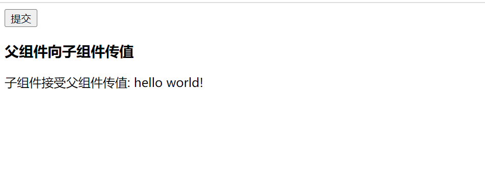

# 深入了解Vue组件


## 1.什么是组件化开发

组件化开发是Vue.js框架的核心特性之一，也是目前前端技术框架中最常见的一种开发模式。

在Vue.js中，组件就是一个可以复用的Vue实例，拥有独一无二的组件名称，可以扩展HTML元素，使用组件名称作为自定义的HTML标签。

在Vue.js项目中，每个组件都是一个Vue实例，所以组件内的属性选项都是相同的，例如data、computed、watch、methods及生命周期钩子等。

仅有的例外是像el这样实例特有的选项。在很多场景下，网页中的某些部分是可以复用的，例如头部导航、猜你喜欢、热点信息等。我们可以将网站中能够重复使用的部分设计成一个个组件，当需要的时候，直接引用这个组件即可。Vue组件化开发有别于前端传统的模块化开发。模块化是为了实现每个模块、方法的单一功能，一般通过代码逻辑进行划分，而组件化开发，更多的是实现前端UI的重复使用。

## 2.Vue自定义组件

在使用Vue CLI工具创建的项目中，src目录是用来存放项目源码的，在src目录下会自动创建两个子目录，一个是src/views目录，另一个是src/components目录。

这两个子目录都是用来创建组件的，但是为了区分组件的功能，一般在src/views目录下创建的是视图组件，而在src/components目录下创建的是公共UI组件。

### 2.1 组件的封装

在src/components目录下新建一个Button.vue文件，代码如下：

```
<template>
  <el-row class="mb-4">
    <el-button type="primary">Primary</el-button>
  </el-row>
</template>
```

自定义Button.vue组件创建成功后，在App.vue根组件中引入，代码如下：

```
<template>
  <nav>
    <router-link to="/">Home</router-link> |
    <router-link to="/about">About</router-link>
  </nav>
  <ButtonView/>
  <router-view/>
</template>

<script>
import ButtonView from './components/ButtonView'
export default {
  // 注册组件
  components: { ButtonView }
}
</script>

<style>
</style>

```

在上面的代码中，components选项内使用自定义组件

### 2.2 自定义组件上的属性

```
<template>
  <el-row class="mb-4">
    <el-button type="primary">{{text}}</el-button>
  </el-row>
</template>

<script>

export default {
  props: {
    text: String
  }
}
</script>
```


```
<template>
  <nav>
    <router-link to="/">Home</router-link> |
    <router-link to="/about">About</router-link>
  </nav>
  <ButtonView text="提交"/>
  <router-view/>
</template>

<script>
import ButtonView from './components/ButtonView'
export default {
  // 注册组件
  components: { ButtonView }
}
</script>
```

在上面的示例代码中，通过为ButtonView标签设置text属性的方式设置按钮显示的文本内容。

### 2.3 自定义组件上的事件

```
<template>
  <button @click="handleClick">{{text}}</button>
</template>

<script>
export default {
  props: {
    text: String
  },
  methods: {
    handleClick () {
      this.$emit('click')
    }
  }
}
</script>

<style>
</style>
```

上面的示例代码为原生的\<button\>标签添加了单击事件，并在单击事件的触发函数中调用了$ emit（）方法，触发该自定义组件定义的名为click的事件。

```
<template>
  <nav>
    <router-link to="/">Home</router-link> |
    <router-link to="/about">About</router-link>
  </nav>
  <ButtonView text="提交" @click="submit"/>
  <router-view/>
</template>

<script>
import ButtonView from './components/ButtonView'
export default {
  // 注册组件
  components: { ButtonView },
  methods: {
    submit () {
      console.log('提交的按钮被单击')
    }
  }
}
</script>

<style>
</style>
```

### 2.4 组件属性校验

我们可以为组件的 prop 指定验证要求，例如你知道的这些类型。如果有一个要求没有被满足，则 Vue 会在浏览器控制台中警告你。这在开发一个会被别人用到的组件时尤其有帮助。

为了定制 prop 的验证方式，你可以为 `props` 中的值提供一个带有验证要求的对象，而不是一个字符串数组。例如：

```
app.component('my-component', {
  props: {
    // 基础的类型检查 (`null` 和 `undefined` 值会通过任何类型验证)
    propA: Number,
    // 多个可能的类型
    propB: [String, Number],
    // 必填的字符串
    propC: {
      type: String,
      required: true
    },
    // 带有默认值的数字
    propD: {
      type: Number,
      default: 100
    },
    // 带有默认值的对象
    propE: {
      type: Object,
      // 对象或数组的默认值必须从一个工厂函数返回
      default() {
        return { message: 'hello' }
      }
    },
    // 自定义验证函数
    propF: {
      validator(value) {
        // 这个值必须与下列字符串中的其中一个相匹配
        return ['success', 'warning', 'danger'].includes(value)
      }
    },
    // 具有默认值的函数
    propG: {
      type: Function,
      // 与对象或数组的默认值不同，这不是一个工厂函数——这是一个用作默认值的函数
      default() {
        return 'Default function'
      }
    }
  }
})
```


### 2.5 组件通信

组件化开发是Vue中的核心概念之一，通过设计具有各自状态的UI组件，然后由这些组件拼成更加复杂的UI页面，使代码更加简洁、容易维护。创建自定义组件在Vue开发中是非常常见的，在这种开发场景下必定会涉及组件之间的通信。在本节中将要学习的是如何实现组件之间的数据交互。


#### 1.父组件向子组件通信

`SonView.vue`

```
<template>
  <div>
    子组件接受父组件传值: {{text}}
  </div>
</template>

<script>
export default {
  name: 'SonView',
  props: {
    text: String
  }
}
</script>

<style scoped>

</style>
```

`FatherView.vue`

```
<template>
<div>
  <h3>父组件向子组件传值</h3>
  <son v-bind:text="msg"></son>
</div>
</template>

<script>
import SonView from '@/components/SonView'
export default {
  name: 'FatherView',
  components: {
    son: SonView
  },
  data () {
    return {
      msg: 'hello world!'
    }
  }
}
</script>

<style scoped></style>
```

`App.vue`

```
<template>
  <ButtonView text="提交" @click="submit"/>
  <FatherView/>
</template>

<script>
import ButtonView from './components/ButtonView'
import FatherView from '@/components/FatherView'
export default {
  // 注册组件
  components: { ButtonView, FatherView },
  methods: {
    submit () {
      console.log('提交的按钮被单击')
    }
  }
}
</script>

<style></style>
```



#### 2.子组件向父组件通信

单向数据流决定了父组件可以影响子组件的数据，但是反之不行。子组件内数据发生更新后，在父组件中无法直接获取更新后的数据。要想实现子组件向父组件传递数据，可以在子组件数据发生变化后，触发一个事件方法，然后由这个事件方法告诉父组件数据更新了。

在父组件中只需对这个事件进行监听，当捕获到这个事件运行后，再对父组件的数据进行同步更新。

子组件SonView.vue文件代码如下：

```
<template>
<div>
  子组件输入新值：
  <input type="text" v-model="value">
  <button @click="submit">提交</button>
</div>
</template>

<script>
export default {
  name: 'SonView',
  data () {
    return {
      value: ''
    }
  },
  methods: {
    submit () {
      this.$emit('show', this.value)
    }
  }
}
</script>

<style scoped>

</style>

```

父组件FatherView.vue文件代码如下：

```
<template>
<div>
  <h3>父组件监听了子组件的更新： {{msg}}</h3>
  <vv-son v-on:show="showMsg"></vv-son>
</div>
</template>

<script>
import SonView from '@/views/SonView'
export default {
  name: 'FatherView',
  components: {
    'vv-son': SonView
  },
  data () {
    return {
      msg: ''
    }
  },
  methods: {
    showMsg (msg) {
      this.msg = msg
    }
  }
}
</script>

<style scoped>

</style>
```

父组件中使用v-on事件监听器来监听子组件的事件，在子组件中使用$ emit（）触发当前实例上的事件。

### 2.6 插槽

#### 1.什么是插槽

Vue为了实现组件的内容分发，在组件的相关内容中提供了一套用于组件内容分发的API，也就是插槽。这套API使用\<slot\>内置组件作为承载分发内容的出口，代码如下：

创建父组件DemoView.vue，代码如下：

```
<template>
<div>
  <h3>在父组件中使用插槽</h3>
  <my-slot>
    <p>这是父组件中添加的元素</p>
  </my-slot>
</div>
</template>

<script>
import MyslotView from '@/views/MyslotView'
export default {
  name: 'DemoView',
  components: {
    'my-slot': MyslotView
  }
}
</script>
<style scoped>

</style>
```

创建子组件MyslotView.vue，代码如下：

```
<template>
<div>
  <p>这是子组件内容</p>
  <slot></slot>
</div>
</template>

<script>
export default {
  name: 'MyslotView'
}
</script>

<style scoped>

</style>
```

#### 2.具名插槽

在实际的开发过程中，组件中的插槽不止一个，有时需要多个插槽，代码如下：

`HeaderView.vue`

```
<template>
  <div>
    <slot></slot>
  </div>
</template>

<script>
export default {
  name: 'HeaderView'
}
</script>

<style scoped>

</style>
```

`FooterView.vue`

```
<template>
  <div>
    <slot name="one"></slot>
    <hr>
    <slot name="two"></slot>
  </div>
</template>

<script>
export default {
  name: 'FooterView'
}
</script>

<style scoped>

</style>
```

`MainView.vue`

```
<template>
  <div>
    <!-- 插槽 -->
    <myheader>
      <div>这是头部</div>
    </myheader>

    <!-- 具名插槽 -->
    <myfooter>
      <template v-slot:one>
        <div>这是第一部分</div>
      </template>
      <template v-slot:two>
        <div>这是第二部分</div>
      </template>
    </myfooter>
  </div>
</template>

<script>
import HeaderView from '@/views/HeaderView'
import FooterView from '@/views/FooterView'
export default {
  name: 'MainView',
  components: {
    myheader: HeaderView,
    myfooter: FooterView
  }
}
</script>

<style scoped>

</style>

```

v-slot指令与v-on、v-bind类似，也有自己的缩写形式，把v-slot替换为字符#即可，代码如下：

```
    <!-- 具名插槽 -->
    <myfooter>
      <template #one>
        <div>这是第一部分</div>
      </template>
      <template #two>
        <div>这是第二部分</div>
      </template>
    </myfooter>
```

#### 3.作用域插槽

**应用场景: 父组件对子组件的内容进行加工处理**

大白话解释作用域插槽：父组件可以通过插槽读到子组件对应插槽所带的数据

子组件`fruitList.vue`

```
<template>
  <div>
    <li :key='item.id' v-for='item in list'>
      <slot :info='item'>{{ item.name }}</slot>
    </li>
  </div>
</template>

<script>
export default {
  name: 'fruitList',
  props: ['list']
}
</script>

<style scoped>

</style>
```

父组件`FatherFruitList.vue`

```
<template>
  <fruit-list :list='list'>
    <template v-slot="slotProps">
      <strong v-if='slotProps.info.id==3' class="current">{{ slotProps.info.name }}</strong>
      <span v-else>{{ slotProps.info.name }}</span>
    </template>
  </fruit-list>
</template>

<script>
import fruitList from '@/components/fruitList'
export default {
  name: 'FatherFruitList',
  components: {
    'fruit-list': fruitList
  },
  data: function () {
    return {
      list: [{
        id: 1,
        name: 'apple'
      }, {
        id: 2,
        name: 'orange'
      }, {
        id: 3,
        name: 'banana'
      }
      ]
    }
  },
  methods: {}
}
</script>

<style scoped>
.current{
  color: orange;
}
</style>
```


