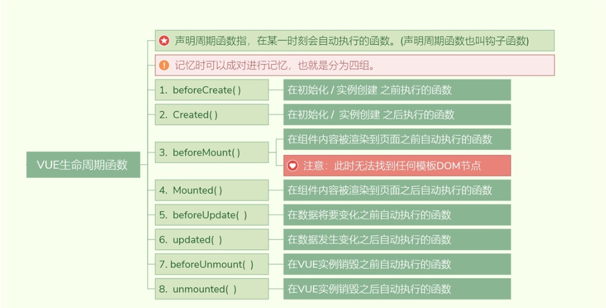
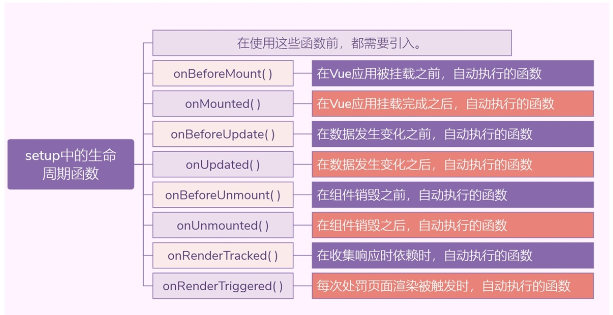
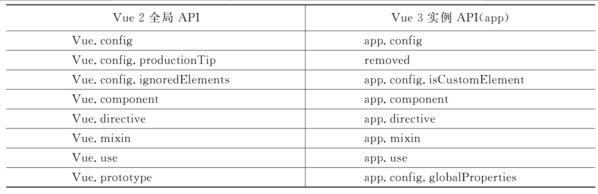

# Vue3新特性详讲

## 1.为什么要用Vue3

在学习Vue 3的新特性之前，先来看一下Vue 3设计的目的是什么，为什么要对Vue 2做出很大的改变，以及Vue 3到底解决了什么问题。

像Vue这样全球闻名的前端框架，在任何一次改动时，设计者都是经过深思熟虑的权衡，所以，Vue 3的出现肯定是解决了某些棘手的问题。下面介绍一下Vue 2中遇到的问题。


### 1.1 Vue2对复杂功能的处理不友好

在使用Vue 2开发项目的过程中，随着更加复杂的业务逻辑的增加，复杂组件的代码变得难以维护。尤其是一个开发人员从别的开发人员手中接过一个新项目时，这个问题更突出。究其根本原因，Vue 2中的API是通过选项来组织代码的，但是大部分情况下，通过逻辑来组织代码会更有意义。


Vue 2中缺少多个组件之间提取和复用逻辑的机制，现有的重用机制都有很多缺点。


### 1.2 Vue2中mixin存在缺陷


### 1.3 Vue2对TypeScript的支持有限

Vue框架的开发者都清楚，Vue 2对TypeScript的支持并不友好，这是因为在Vue中是依赖this上下文对象向外暴露属性，但是在组件中的this与普通的JavaScript中的Object对象处理的方式不同。

其实，在Vue 2设计时就没有考虑对TypeScript的集成和强制类型的相关问题，所以才导致在Vue 2中使用TypeScript有很多阻碍。


## 2.Vue3简介

众所周知，前端技术一直更新得很快，特别是前端框架，更新速度更是极快的。

在2020年4月21日晚上，Vue的作者尤雨溪在B站上直播分享了Vue 3 Beta的最新进展，直到9月19日，Vue 3正式版才发布。

这个耗时两年，历经99位代码贡献者，2600多次代码提交的大版本更新终于和众多开发者见面了。

为了减少前端开发者的学习成本，Vue 2的大部分特性保留到了Vue 3中，开发者可以像使用Vue 2一样，原封不动地使用Vue 3，这是遵循了渐进式的准则。如果你是一个保守派，只想使用Vue 2的写法，也是完全没有问题的。


### 2.1 Vue3增加了以下新特性


#### 1. Vue3在性能上有很大提升

但没有哪一位开发者不想要更快、更轻的框架。Vue 3给开发者带来了极致的开发体验。整个Vue 3的代码库被重新编写成了一系列独立的、可实现不同功能的模块。

据官方介绍，Vue 3的代码打包大小减少了41%，初次渲染速度提升了55%，更新效率提升了33%，内存使用率减少了54%。这些数据都得益于Vue 3中重构了虚拟DOM的写法，提升渲染速度。


#### 2.Vue3推出了新的API

在Vue 2中遇到了一些问题，例如，复杂组件的代码变得越来越难以维护，缺少一种纯粹的多组件之间提取和复用逻辑的机制。

虽然Vue 2中也提供了相关的解决方案，但是在Vue 2中对于重用机制这一部分也存在一些弊端。

所以，Vue 3中设计了Composition API，这也是本章重点介绍和使用的Vue 3的新特性。

Composition这个单词是“组合”的意思，是Vue 3新推出的一系列API的合集，主要包括了以下API。

（1）ref。

（2）reactive。

（3）computed。

（4）watch。

（5）新的生命周期函数。

（6）支持自定义Hooks函数。

（7）Teleport。

（8）Suspense。

（9）全局API的修改和优化。


#### 3.更好地支持TypeScript

有在Vue 2中集成TypeScript的开发者应该都体会过其中的痛苦，因为Vue 2在推出的时候没有把TypeScript作为一个考量范围，所以在设计Vue 3的时候，设计者们就痛定思痛，考虑了这方面的问题。

Vue 3的源代码全部都是使用TypeScript语法编写的，提供了非常完备的类型定义，在使用Vue 3开发项目时，可以把TypeScript语法深入到各个大型项目中，让开发者更加方便地享受类型推论等一系列TypeScript的红利。

同时，还可以在VSCode等编辑器中安装相关的插件，完美地使用TypeScript的各种功能。


## 3.Vue3项目搭建

Vue CLI脚手架简介

参考Vue工程化项目。

## 4.Vue3项目的目录结构

```
目录/文件				    说明
build				   项目构建(webpack)相关代码
config				   配置目录，包括端口号等。我们初学可以使用默认的。
node_modules		    npm 加载的项目依赖模块
src					   这里是我们要开发的目录，基本上要做的事情都在这个目录里。里面包含了几个目录及文件：
    assets: 		    放置一些图片，如logo等。
    components: 		目录里面放了一个组件文件，可以不用。
    App.vue: 			项目入口文件，我们也可以直接将组件写这里，而不使用 components 目录。
    main.js: 			项目的核心文件。
    index.css: 			样式文件。
        
static					静态资源目录，如图片、字体等。
public					公共资源目录。
test					初始测试目录，可删除
.xxxx文件				   这些是一些配置文件，包括语法配置，git配置等。
index.html				首页入口文件，你可以添加一些 meta 信息或统计代码啥的。
package.json			项目配置文件。
README.md				项目的说明文档，markdown 格式
dist					使用 npm run build 命令打包后会生成该目录。
```


Vue 3的项目目录结构与Vue 2的类似，唯一不同的是很多.js文件改为了.ts文件。

其中，src目录下的shims-vue.d.ts是用来定义Vue类型的TypeScript配置文件。

因为.vue结尾的Vue组件文件在TypeScript中是不能被直接识别的，所以需要使用该配置文件来讲明.vue的类型，便于TypeScript进行解析。

在Vue 2中使用new关键字实例化Vue对象，然后通过构造函数将选项属性传入Vue实例中。而Vue 3对main.js做了修改，在Vue 3中使用的是.ts类型的文件编写的入口文件，示例代码如下：

```
import { createApp } from 'vue'
import App from './App.vue'
import router from './router'
import store from './store'
import ElementPlus from 'element-plus'
import 'element-plus/dist/index.css'
import axios from 'axios'

createApp(App).prototype.$axios = axios

createApp(App).use(store).use(router).use(ElementPlus).mount('#app')
```

Vue3的main.ts文件中引入了createApp函数，然后引入App.vue组件，调用createApp函数来创建Vue实例，

将所有的模块使用Vue实例对象进行调用，而不是像Vue 2中直接传入Vue对象的构造方法中，这是Vue 3做的很大改进。


## 5.Vue.js 3.0的新变化1—组合API

Composition API是Vue的下一代主要版本中最常用的语法，它是一种全新的逻辑重用和代码组织的方法。在Vue 2中使用的是Options API的方式构建组件，如果要向Vue组件中添加业务逻辑，则需要先填充选项属性，例如data、methods、computed等。

这种方式最大的缺点是，它本身并不是有效的JavaScript代码，需要先了解模板中可以访问哪些属性，然后使用Vue的编译器将这些属性转换成可以执行的代码，这样做既消耗了性能，又无法做更好的类型检查。


Composition API设计的目的是通过将当前可用组件属性作为JavaScript函数暴露出来，这种机制可以基于功能的附加API灵活地组合组件逻辑，使Composition API编写的代码更易读。


### 5.1 setup()函数

setup()函数是一个新的组件选项，它是组件内部使用组合API的入口点。

#### 1. setup使用注意点

1. 执行时机

```
beforeCreate——setup——Create
```

2. 注意点

```
- setup函数中无法使用this.data和this.methods(因为他们还没创建出来)
- setup函数无法执行异步操作（async）
```


Composition API的主要思想是，将Vue组件的选项属性定义为setup()函数返回的JavaScript变量，而不是将组件的功能（例如state、method、computed等）定义为对象属性。

setup()函数的执行时机是在beforeCreate之后，created之前。setup()函数有两个参数，第1个参数用于接收props数据。示例代码如下：

```
<template>
<p> VUE3 新特性学习！！</p>
</template>

<script>
export default {
  props: {
    msg: {
      type: String,
      default: () => {}
    }
  },
  setup(props){
    console.log(props);
  }
}
</script>

<style scoped>

</style>
```


setup()函数的第2个参数是一个上下文对象，这个上下文对象大致包含了一些属性，示例代码如下：

```
	export default {
		name: 'Demo',
		props:['msg','school'],
		emits:['hello'],
		setup(props,context){
			console.log('---setup---',context.attrs) //相当与Vue2中的$attrs
			console.log('---setup---',context.emit) //触发自定义事件的。
			console.log('---setup---',context.slots) //插槽
			//数据
			let person = reactive({
				name:'张三',
				age:18
			})
 
			//方法
			function test(){
				context.emit('hello',666)
			}
 
			//返回一个对象（常用）
			return {
				person,
				test
			}
		}
	}
```

这里需要注意，在setup()函数中是无法访问this的。

### 5.2 reactive()函数

- ref 模块是用来声明简单数据类型的，例如,string , number ,boolean 等

- reactive 模块是用来声明复杂数据类型的，例如，数组，对象等

#### 1. reactive使用注意点

```
1. reactive参数必须是对象、json、arr
2. 如果给reactive传递其他对象，默认情况下修改对象，界面不会自动更新，想要更新，需要重新赋值的方式。
```


reactive()用来创建一个响应式对象，等价于2.x的Vue.observable，示例代码如下：

```
<template>
<p> VUE3 新特性学习！！</p>
  <div>
    <button @click="incment()">cliek Me!</button>
    <p>
            一：{{state.count}}  二：{{state.addCount}}
    </p>
  </div>
</template>

<script>
import {reactive} from "vue";

export default {
  setup() {
    const state = reactive({
      // 创建响应式数据
      count: 0,
      addCount: 0
    });

    function incment() {
      state.count++;
      state.addCount = state.count * 2;
    }

    return {
      state,
      incment
    }
  }
}
</script>

<style scoped>

</style>
```

### 5.3 ref()函数

ref()函数用来给给定的值创建一个响应式的数据对象，ref()函数的返回值是一个对象，**这个对象上只包含一个.value属性。**

#### 1. ref使用注意点

```
1. ref只能实现对简单值的监听
2. template中使用ref的值不用通过value获取
3. js中使用ref的值必须通过value获取
```


使用ref()函数定义的响应式属性，在template中访问的方法和Vue 2一样，可以直接使用模板语法的形式访问，示例代码如下：

```
<template>
<p> VUE3 新特性学习！！</p>
  <li>{{valueNumber}}</li>
  <li>{{valueString}}</li>
  <li>{{valueBoolean}}</li>
  <li>{{valueNull}}</li>
  <li>{{valueUndefined}}</li>
</template>

<script>
import {ref} from "vue";

export default {
  setup() {
    const  valueNumber = ref(0)
    const  valueString = ref('hell world')
    const  valueBoolean = ref('true')
    const  valueNull = ref(null)
    const  valueUndefined = ref(undefined)
    return {
      valueNumber,
      valueString,
      valueBoolean,
      valueNull,
      valueUndefined
    }
  }
}
</script>

<style scoped>

</style>
```

在template使用模板语法直接访问响应式属性，示例代码如下：

```
<template>
<p> VUE3 新特性学习！！</p>
  <p>
    {{value}}
    {{message}}
  </p>

</template>

<script>
import {ref} from "vue";

export default {
  setup() {
    const  value = ref(1)

    return {
      value,
      message: "hello world"
    }
  }
}
</script>

<style scoped>
</style>
```

Vue 3中的ref()函数与Vue 2中data()的区别:

先使用Vue 2的语法编写一个计算器的案例，示例代码如下：

```
<template>
<p> VUE3 新特性学习！！</p>

<p>{{count}}</p>
  <button @click="increment">Add 1</button>
  <p>The button above has been clicked {{ count }} times.</p>
  <p>The computed info {{double}}</p>
</template>

<script>

export default {
  data: () => ({
    count: 1
  }),
  methods: {
    increment() {
      this.count++;
    }
  },
  computed: {
    double () {
      return this.count *2
    }
  }
}
</script>

<style scoped></style>
```

再使用Composition API定义一个完全相同功能的组件，示例代码如下：

```
<template>
<p> VUE3 新特性学习！！</p>

<p>{{count}}</p>
  <button @click="increment">Add 1</button>
  <p>The button above has been clicked {{ count }} times.</p>
  <p>The computed info {{double}}</p>
</template>

<script>
import {ref,computed } from 'vue';
export default {
  setup() {
    const count = ref(1);
    const double = computed(() => count.value *2);
    function increment() {
      count.value++
    }
    return {
      count,
      double,
      increment
    }
  }
}
</script>

<style scoped>
</style>
```

在上面的示例中，使用Composition API提供的ref()函数定义了一个响应式变量，其作用与Vue 2的data变量几乎相同。

在Vue 3的示例代码中，increment方法是一个普通的JavaScript函数，需要更改子属性count的value才能更改响应式变量，这是因为使用ref()函数创建的响应式变量必须是对象，以便于在传递的时候保持一致。

Composition API提供了更方便的逻辑提取方式，还是以上面的代码为例，使用Composition提取Counter.vue组件的代码，创建useCounter.js文件，示例代码如下：

```
import {ref, computed} from 'vue';

export default {
  setup() {
    const count = ref(1);
    const double = computed(() => count.value * 2);

    function increment() {
      count.value++
    }

    return {
      count,
      double,
      increment
    }
  }
}

```

如果要在其他组件中使用该函数，只需将模块导入组件文件并调用它，导入的模块是一个函数，该函数将从setup()函数中返回定义的变量。示例代码如下：

```
<template>
<p> VUE3 新特性学习！！</p>

<p>{{count}}</p>
  <button @click="increment">Add 1</button>
  <p>The button above has been clicked {{ count }} times.</p>
  <p>The computed info {{double}}</p>
</template>

<script>
import useCounter from "./useCounter.js"
export default {
  setup() {
    const { count, increment, double} = useCounter.setup();
    return {
      count,
      increment,
      double
    }

  }
}
</script>

<style scoped>

</style>
```

这种操作还可以解决Vue 2中mixins命名冲突的问题，示例代码如下：

```
export default {
  setup() {
    const { count1, increment1} = useCounter1.setup();
    const { count2, increment2} = useCounter2.setup();

    return {
      count1,
      increment1,
      count2,
      increment2
    }
  }
}

```

### 3.4 ref辅助操作的函数。

Composition API也提供了一些其他的ref辅助操作的函数。

#### 1.isRef()

用来判断某个值是否为ref创建出来的对象，在需要展开某个值可能是ref创建出来的对象时使用。示例代码如下：

```
<template>
  <p> VUE3 新特性学习！！</p>

  <p>{{count}}</p>
  <p>isRef(count) ?{{ unwrappend }} .</p>
</template>

<script>
import {ref,isRef } from 'vue';
export default {
  setup() {
    const count = ref(1)
    const unwrappend = isRef(count) ? count.value: count
    return {
      count,
      unwrappend
    }
  }

}
</script>

<style scoped>
</style>
```


#### 2.toRefs()

toRefs()函数可以将reactive创建出来的响应式对象转换为普通的对象，只不过这个对象上的每个属性节点都是ref类型的响应式数据。示例代码如下：

```
<template>
  <p> VUE3 新特性学习！！</p>

  <p>
    {{ count }}
    {{ value }}
  </p>
</template>

<script>
import {ref,reactive,toRefs } from 'vue';
export default {
  setup() {
    const state = reactive({
      count: 0,
      value: 'hello'
    })
    return {
      ...toRefs(state)
    }
  }

}
</script>

<style scoped>
</style>
```


#### 3.toRef()

toRef()函数为源响应式对象上的某个属性创建一个ref对象，二者内部操作的是同一个数据值，更新时二者同步。

与ref的区别是，使用toRef()函数复制的是一份新的数据单 独操作，更新时相互不影响，相当于深复制。

当要将某个prop的ref传递给某个复合函数时，toRef()很有用。

示例代码如下：

```
<template>
  <p> VUE3 新特性学习！！</p>

  <p>
    m1: {{ m1.a }}<br>
    m2 toRef: {{ m2 }}<br>
    m3 ref: {{ m3 }}<br>
  </p>
  <button @click="update1">m1 change</button>
  <button @click="update2">m2 toRef change</button>
  <button @click="update3">m3 ref change</button>
</template>

<script>
import {ref,reactive,toRef } from 'vue';
export default {
  setup() {
    const m1 = reactive({
      a:1,
      b:2
    })
    const m2 = toRef(m1,'a')
    const m3 = ref(m1.a)

    const update1 = () => {
      m1.a++   // m1改变时 m2也会改变
    }
    const update2 = () => {
      m2.value++  //  m2改变时 m1也会改变
    }
    const update3 = () => {
      // m1.a++   // m1改变时 m2也会改变
      // m2.value++  //  m2 改变时 m1也会改变
      m3.value++  // m3改变时 m1不会变
    }
    return {
      m1,
      m2,
      m3,
      update1,
      update2,
      update3
    }
  }

}
</script>

<style scoped>
</style>

```

#### 4.computed()计算属性

computed()函数用来创建计算属性，返回值是一个ref的实例。创建只读的计算属性，示例代码如下：

```
<template>
  <p> VUE3 新特性学习！！</p>
  <p>
    {{count}}
    {{double}}
  </p>

</template>

<script>
import {ref,computed} from 'vue';

export default {
  setup() {
    const count = ref(0)
    const double = computed(() => count.value + 1)  //1
    // double ++ // 报错,只读
    return {
      count,
      double
    }

  }
}
</script>

<style scoped>
</style>
```

在使用computed（）函数期间，传入一个包含get()和set()函数的对象，可以得到一个可读可写的计算属性。示例代码如下：

```
<template>
  <p> VUE3 新特性学习！！</p>
  <p> computed 取值赋值 {{ count }}</p>

</template>

<script>
import {ref,computed} from 'vue';

export default {
  setup() {
    // 创建一个ref响应式数据
    const count = ref(1)
    // 创建一个computed()计算属性
    const plusOne = computed({
      // 取值函数
      get: () => count.value +1,

      // 赋值函数
      set: val => {
        count.value = val -1
      }
    })

    // 计算属性赋值，触发set函数
    plusOne.value = 9
    console.log(count.value)

    return {
      count
    }
    }

  }
</script>

<style scoped>
</style>
```


### 3.5 Vue3中的响应式对象

Vue 2中的data和Vue 3中的ref一样，都可以返回一个响应式对象，但是Vue 2中使用的是object.defineProperty()实现响应式的，这就导致Vue 2的响应式出现一些限制。

在Vue 2中新增一个响应式属性会变得很困难。

在Vue 2中，无法检测property的添加或者移除，对于已经创建的实例，Vue是不允许动态添加根级别的响应式属性的。如果要动态添加响应式对象的属性，可以使用Vue.set(object，propertyName，value)方法向嵌套对象中添加响应式属性，还可以使用vm. $ set实例方法动态添加响应式属性，这也是全局Vue.set()方法的别名。


这种操作对于一个Vue的初学者来讲，很多时候需要小心翼翼地去判断到底什么情况下需要用$ set，什么情况下可以直接触发响应式。

这给初学者带来了很多困扰。在Vue 3中，这些问题都将成为过去式。

Vue 3采用了ES6的一个新特性，使用Proxy实现响应式。

Proxy对象用于定义基本操作的一个自定义行为，简单来讲，Proxy对象就是可以让开发者对一个JavaScript中一切合法对象的基本操作进行自定义，然后用自定义的操作去覆盖对象的一些基本操作。我们可以通过下面的两段代码来学习Vue 3中是如何使用Proxy进行优化的。

Vue 2中的响应式处理，示例代码如下：

```
Object.defineProperty(data,'count',{
	get() {},
	set() {}
})
```

Vue 3中对于响应式的优化，示例代码如下：

```
new Proxy(data,{
	get(key) {},
	set(key,value) {}
})
```

通过上面两段代码可以看出，Proxy是在更高维度上进行一个属性拦截修改的，先来看一下Vue 2的代码示例。

对于给定的data对象，date对象中有一个count属性，需要根据具体的count去修改set()函数。

所以，Vue 2对于对象上的新增属性是无能为力的。

而Vue 3中使用Proxy进行拦截，这里无须知道具体的key是什么，拦截的是修改data上任意的key和读取data上任意的key的操作。所以，无论是已有的key还是新增的key都可以被拦截。

Proxy更加强大之处在于，除了getter和setter对属性的拦截外，还可以拦截更多的操作符。


### 3.6 生命周期的改变

在Vue 3中的生命周期和在Vue 2中的生命周期的用法是一样的。所谓生命周期，就是一个组件从创建到销毁的全过程，会暴露出一系列的钩子函数供开发者在对应阶段进行相关的操作。


除了Vue 2中已有的一部分生命周期钩子，Vue 3还增加了一些新的生命周期，可以直接导入on×××一族的函数来注册生命周期钩子。示例代码如下：

```
<template>
  <div id="app"></div>
</template>

<script>
// 1. 从 vue 中引入 多个生命周期函数
import {onBeforeMount, onMounted, onBeforeUpdate, onUpdated, onBeforeUnmount, unMounted} from 'vue'
export default {
  name: 'App',
  setup() {
      onBeforeMount(() => {
          // 在挂载前执行某些代码
      })

      onMounted(() => {
          // 在挂载后执行某些代码
      })

      onBeforeUpdate(() => {
          // 在更新前前执行某些代码
      })

      onUpdated(() => {
          // 在更新后执行某些代码
      })

      onBeforeUnmount(() => {
          // 在组件销毁前执行某些代码
      })

      unMounted(() => {
          // 在组件销毁后执行某些代码
      })

      return {}
  }
  
}
</script>
```

Vue 3的生命周期钩子函数只能在setup()期间同步使用，因为它们依赖于内部的全局状态来定位当前组件实例，不在当前组件下调用这些函数会抛出一个错误。

组件实例上下文也是在生命周期钩子同步执行期间设置的，因此，在卸载组件时，在生命周期钩子内部同步创建的侦听器和计算状态也将自动删除。

Vue 3中与Vue 2的生命周期相对应的组合式API如下。

下面放上一张变化图来简单了解一下

| Vue2          | Vue3            |
| ------------- | --------------- |
| beforeCreate  | setup           |
| created       | setup           |
| beforeMount   | onBeforeMount   |
| mounted       | onMounted       |
| beforeUpdate  | onBeforeUpdate  |
| updated       | onUpdated       |
| beforeDestory | onBeforeUnmount |
| destoryed     | onUnmounted     |
| errorCaptured | onErrorCaptured |

```
setup 包含的生命周期
onBeforeMount——挂载开始前调用
onMounted——挂载后调用
onBeforeUpdate——当响应数据改变，且重新渲染前调用
onUpdated——重新渲染后调用
onBeforeUnmount——Vue实例销毁前调用
onUnmounted——实例销毁后调用
onActivated——当keep-alive组件被激活时调用
onDeactivated——当keep-alive组件取消激活时调用
onErrorCaptured——从子组件中捕获错误时调用
```


vue2的生命周期函数如下：



vue3的生命周期函数




Vue 2生命周期的初创期钩子beforeCreate和created，在Vue 3中用setup()替代了。

除了和2.x生命周期等效项之外，组合式API还提供了以下调试钩子函数。

（1）onRenderTracked()。

（2）onRenderTriggered()。

两个钩子函数都接收一个DebuggerEvent，与watchEffect参数选项中的onTrack和onTrigger类似。示例代码如下：

```
export default {
  onRenderTracked(e){
    debugger
  },
  setup() {
  }
}
</script>
```


### 3.7 watch()侦测变化

watch()函数用来监视某些数据项的变化，从而触发某些特定的操作，下面这个案例会实时监听count值的变化。

示例代码如下：

```
<script>
import {ref, watch} from "vue";
export default {
    setup() {
      const count = ref(1)
      watch(() =>{
        console.log(count.value,'value')
      })
      // 每隔1s执行一次
      setInterval(() =>{
        count.value++
      },100)

      return {
        count
      }
    }
}
</script>
```

watch()还可以监听指定的数据源，例如监听reactive()的数据变化。

示例代码如下：

```
<template>
  <p> VUE3 新特性学习！！</p>
  <p>生命周期的改变</p>
</template>

<script>
import {reactive, ref, watch} from "vue";

export default {
  setup() {
    const state = reactive({
      count: 0
    })

    watch(() => state.count,(count,prevCount) =>{
      console.log(count,prevCount)      // 变化后的值及变化前的值
    })
    // 每隔1s执行一次
    setInterval(() => {
      state.count++
    }, 100)

    return {
      state
    }
  }
}
</script>

<style scoped>
</style>
```


watch()用于监听ref类型的数据变化，示例代码如下：

```
<script>
import {ref, watch} from "vue";

export default {
  setup() {
    const count = ref(1)
    watch(count,(count,prevCount) =>{
      console.log(count,prevCount)
    })
    // 每隔1s执行一次
    setInterval(() =>{
      count.value++
    },100)

    return {
      count
    }
  }
}
</script>
```

在setup()函数内创建的watch()监视，会在当前组件被销毁的时候自动停止。如果想要明确停止某个监视，可以调用watch()函数的返回值。示例代码如下：

```
<script>
import {ref, watch} from "vue";
export default {
  setup() {
    const count = ref(1)
    const stop = watch(() =>{
      /* ...   */
    })

	// 调用停止函数，清除对应的监视	
    stop()
    return {
      count
    }
  }
}
</script>
```


### 3.8 Vue3更好地支持TypeScript

Vue 2依赖于this上下文对象向外暴露属性，但是在设计Vue 2的API时，并没有考虑到与TypeScript集成。如果在Vue 2中想要使用TypeScript语法，需要使用vueclass或者vue extends的方式来集成对TypeScript的支持。

到了Vue 3，Vue官方团队推出了一个新的方式定义component，这个方式称为defineComponent。示例代码如下：

```
<template>
  <p> VUE3 新特性学习！！</p>
</template>

<script>
import {defineComponent} from "vue";
export default defineComponent({
  setup(){
    function demo(str) {
      console.log(str)
    }
    return {
      demo
    }

  }

})
</script>

<style scoped>
</style>
```

### 3.9 Teleport传送门

https://cn.vuejs.org/guide/built-ins/teleport.html


### 3.10 Suspense异步请求

https://cn.vuejs.org/guide/built-ins/suspense.html


### 3.11 全局API修改

Vue 3中增加了createApp这个新的全局API，调用createApp返回一个应用实例。示例代码如下：

```
import { createApp } from 'vue'
import App from './App.vue'
import router from './router'
import store from './store'
import ElementPlus from 'element-plus'
import 'element-plus/dist/index.css'
import axios from 'axios'

const app = createApp({})
app.config.globalProperties.$axios = axios

createApp(App).use(store).use(router).use(ElementPlus).mount('#app')
```


Vue 2全局API与Vue 3实例API对照表



所有其他不全局改变行为的全局API现在被命名为exports。


vue2与vue3常用操作映射关系

https://blog.csdn.net/yifangshikong/article/details/124355335


应用实例 API参考如下文档

https://cn.vuejs.org/api/application.html

快速使用Vue3最新的15个常用API（1W5+字详解，建议收藏）

https://blog.csdn.net/l_ppp/article/details/109718767


## 7 vue3实战笔记 | 快速入门

https://juejin.cn/post/6909632635665039367

- [【Vue3 官方教程】🎄 万字笔记 | 同步导学视频](https://juejin.cn/post/6909247394904702984)
- [vue3-study](https://github.com/su37josephxia/vue3-study)
- [Vue-Mastery 学习笔记](https://www.yuque.com/nxtt7g/kompdt)
- [@vue/composition-api - 用于提供组合式 API 的 Vue 2 插件](https://github.com/vuejs/composition-api/blob/master/README.zh-CN.md)
- [@vue/composition-api 速成课](https://blog.csdn.net/frontend_frank/article/details/108786784)
- [Vue Class Component v8 - The next Vue Class Component for Vue v3.](https://github.com/vuejs/vue-class-component/tree/next)
- [Vue3 实战笔记](https://juejin.cn/post/6909632635665039367)
- [快速使用 Vue3 最新的 15 个常用 API](https://juejin.cn/post/6897030228867022856)


## 8.全面总结Vue3.0 的新特性

https://blog.csdn.net/qq_22182989/article/details/126094572


