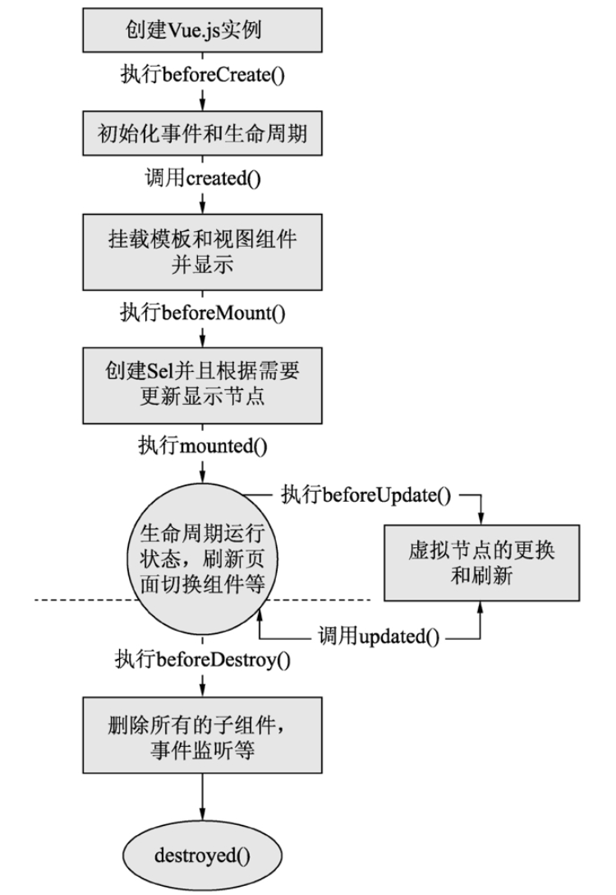

# Vue的生命周期


在Vue.js中，单文件的生命周期是所有方法的调用过程，即从实例的初始化开始，直到页面关闭。


## 1.生命周期与钩子函数

Vue.js为开发者提供了生命周期钩子函数，方便用户在不同阶段添加自己的代码。生命周期和钩子函数的执行过程如图:




Vue.js的生命周期是从一个组件或一个项目本身的初始化开始（new Vue()），之后调用beforeCreate()钩子函数初始化Vue.js实例，

然后调用created()钩子函数，该函数包含组件或Vue.js项目初始化需要执行的内容。接下来挂载实例，执行beforeMount()钩子函数，

并且在实例挂载后执行mounted()钩子函数。当页面数据更新时，调用beforeUpdate()钩子函数进行处理，数据更新完成后调用updated()钩子函数显示更新后的数据。

整个Vue.js实例被销毁时调用beforeDestroy()钩子函数来完成，实例被销毁后调用destroyed()钩子函数。


简单来说，生命周期中的钩子函数主要有以下8个：

- beforeCreate()（组件创建之前）；
- created()（组件创建完成）；
- beforeMount()（组件挂载之前）；
- mounted()（组件挂载完成）；
- beforeUpdate()（组件更新之前）；
- updated()（组件更新完成）；
- beforeDestroy()（组件销毁之前）；
- destroyed()（组件销毁完成）。


> 注意：生命周期中的钩子函数不只上述8个，读者可查看官网中的钩子函数了解更多内容。


## 2.演示Vue.js的生命周期

编写生命周期不同状态的钩子函数，通过命令行的打印效果可以查看本例的生命周期执行情况。代码如下：

```
<template>
  <div id="app">
    
    <h1>{{ msg }}</h1>
  </div>
</template>

<script>
export default {
  name: 'app',
  data () {
    return {
      msg: 'Welcome to Your Vue.js App hujianli',
      showItem: true,
      noShowItem: false
    }
  },
  beforeCreate() {
    console.log("Vue beforeCreate")
  },
  created() {
    console.log("Vue created")
  },
  beforeMount() {
    console.log("Vue beforeMount")
  },
  mounted() {
    console.log("Vue mounted")
  },
  beforeUpdate() {
    console.log("Vue beforeUpdate")
  },
  updated() {
    console.log("Vue updated")
  },
  beforeDestroy() {
    console.log("Vue beforeDestroy")
  },
  destroyed() {
    console.log("Vue destroyed")
  }
}
</script>

<style>
#app {
  font-family: 'Avenir', Helvetica, Arial, sans-serif;
  -webkit-font-smoothing: antialiased;
  -moz-osx-font-smoothing: grayscale;
  text-align: center;
  color: #2c3e50;
  margin-top: 60px;
}

h1, h2 {
  font-weight: normal;
}

ul {
  list-style-type: none;
  padding: 0;
}

li {
  display: inline-block;
  margin: 0 10px;
}

a {
  color: #42b983;
}
</style>
```

需要注意的是，命令行的输入代码，即console.log()本身需要被浏览器（宿主环境）控制。

在一些浏览器环境中这是一个异步方法。也就是说，在实例生命周期非常紧密的情况下，打印顺序可能会不同。

上面的这段代码没有出现此类问题，如果将示例5-10修改为调用destroyed()和before- Destroy()这两个钩子函数，此时Vue.js实例将自动发送热更新，该过程会调用destroyed()钩子函数。页面销毁时才执行的destroyed()和beforeDestroy()这两个钩子函数，其输出可能和下一页面的created()或beforeCreated()等函数输出顺序不一致。

```
[HMR] Waiting for update signal from WDS...
App.vue?ea99:19 Vue beforeCreate
App.vue?ea99:22 Vue created
App.vue?ea99:25 Vue beforeMount
App.vue?ea99:28 Vue mounted
vue.esm.js?efeb:9132 You are running Vue in development mode.
Make sure to turn on production mode when deploying for production.
See more tips at https://vuejs.org/guide/deployment.html
client?cd17:77 [WDS] Hot Module Replacement enabled.
```


