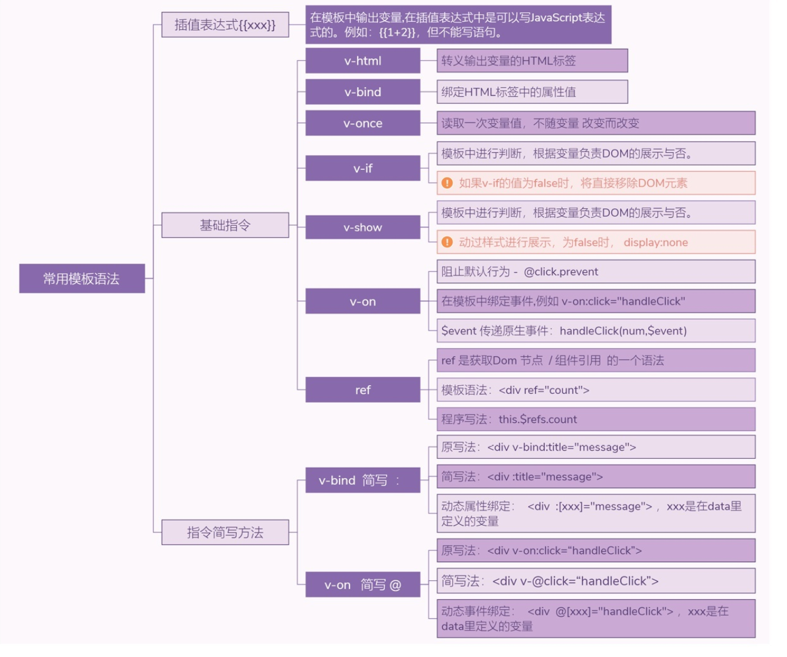

# Vue.js的模板语法

Vue.js的模板语法用来在页面中显示一些内容，还能完成简单的控制和计算。

## 1 文本

Vue.js使用基于HTML的模板标签，允许开发者声明式地将DOM绑定至Vue.js的实例中。不同于React.js，Vue.js提供的模板标签都是标准的HTML标签，可以直接被浏览器解析。

文本标签最基本的语法是两层花括号{{}}（Mustache模板语法），如示例所示。该例通过两层花括号取得对象的值。


Vue.js文本显示

```
<template>
  <div id="app">
    
    <h1>{{ msg }}</h1>
    <div v-for="item in items">
      <h3>{{ item.title }}</h3>
      <p>{{ item.context }}</p>
    </div>
  </div>
</template>

<script>
export default {
  name: 'app',
  data() {
    return {
      msg: 'Welcome to Your Vue.js App hujianli',
      showItem: true,
      noShowItem: false,
      items: [
        {title: '文章1',context: '第一条数据'},
        {title: '文章2',context: '第二条数据'},
        {title: '文章3',context: '第三条数据'},
      ]
    }
  }
}
</script>
```

需要注意的是，上述{{}}形式只获取文本或JavaScript支持的对象。

如果输出一段HTML代码，并且希望被浏览器渲染成可以显示的HTML标签，采用上述形式就无法满足要求了。例如以下代码：

```
<template>
  <div id="app">
    
    <h1>{{ msg }}</h1>
    {{ htmlText }}
  </div>
</template>

<script>
export default {
  name: 'app',
  data() {
    return {
      msg: 'Welcome to Your Vue.js App hujianli',
      showItem: true,
      noShowItem: false,
      htmlText: '<h1 style="color:red">Hello vue.js</h1>'
    }
  }
}
</script>
```

为了保证数据的安全，默认输出文字字符串。

实际上，Vue.js支持输出HTML标签，这就要用到v-html了，代码如下：

```
<template>
  <div id="app">
    
    <h1>{{ msg }}</h1>
    <p v-html="htmlText"></p>
  </div>
</template>

<script>
export default {
  name: 'app',
  data() {
    return {
      msg: 'Welcome to Your Vue.js App hujianli',
      showItem: true,
      noShowItem: false,
      htmlText: '<h1 style="color:red">Hello vue.js</h1>'
    }
  }
}
</script>
```


以上程序的运行效果，显示了一个`<h1>`标签，文字的颜色为红色，此时浏览器正确解析出了HTML标签。

>  注意：显示在页面中的HTML代码应当明确不包含恶意代码，对于不信任的内容进行HTML解析很可能会造成XSS攻击。


## 2 JavaScript表达式

Vue.js模板支持原生JavaScript表达式来完成一些简单的操作或匿名函数，只需要在{{}}中编写相应的JavaScript代码即可。

【示例】Vue.js使用JavaScript表达式。

```
<template>
  <div id="app">
    
    <p>您单击的次数为{{ num }}</p>
    <p>您单击的次数+1为{{ num + 1 }}</p>
    <button v-on:click="clickBtn">单击按钮</button>
  </div>
</template>

<script>
export default {
  name: 'app',
  data() {
    return {
      msg: 'Welcome to Your Vue.js App hujianli',
      num: 0
    }
  },
  methods: {
    clickBtn: function () {
      this.num = this.num + 1
    }
  }
}
</script>


<style>
#app {
  font-family: 'Avenir', Helvetica, Arial, sans-serif;
  -webkit-font-smoothing: antialiased;
  -moz-osx-font-smoothing: grayscale;
  text-align: center;
  color: #2c3e50;
  margin-top: 60px;
}

h1, h2 {
  font-weight: normal;
}

ul {
  list-style-type: none;
  padding: 0;
}

li {
  display: inline-block;
  margin: 0 10px;
}

a {
  color: #42b983;
}
</style>
```

每次单击按钮，num变量都会执行+1操作。

Vue.js支持的JavaScript表达式并不只是数值的计算这么简单，还支持三元表达式或简单的字符串处理。但需要注意的是，每个绑定只能包含单个表达式，多个表达式的情况不被支持。


## 3 v-bind绑定动态属性

Vue.js支持对所有的标签进行动态数据绑定。也就是说，可以通过v-bind指令控制DOM。

data中的值不仅可以用于数据的输出或显示，而且还可以用于节点属性的增加或修改。

【示例】通过简单地控制display属性，可以隐藏或显示节点，完成类似于v-if指令的效果，代码如下：

```
<template>
  <div id="app">
    
    <p :style="isShow">显示第一条</p>
    <p :style="i2Show">显示第二条</p>
    <button v-on:click="clickBtn">单击按钮</button>
  </div>
</template>

<script>
export default {
  name: 'app',
  data() {
    return {
      msg: 'Welcome to Your Vue.js App hujianli',
      isShow: 'display:none',
      i2Show: 'display'
    }
  },
  methods: {
    clickBtn: function () {
      if (this.isShow == "display:none") {
        // 两者交换
        this.i2Show = "display:none"
        this.isShow = "display"
      }else {
        // 两者交换
        this.isShow = "display:none"
        this.i2Show = "display"
      }
    }
  }
}
</script>


<style>
#app {
  font-family: 'Avenir', Helvetica, Arial, sans-serif;
  -webkit-font-smoothing: antialiased;
  -moz-osx-font-smoothing: grayscale;
  text-align: center;
  color: #2c3e50;
  margin-top: 60px;
}

h1, h2 {
  font-weight: normal;
}

ul {
  list-style-type: none;
  padding: 0;
}

li {
  display: inline-block;
  margin: 0 10px;
}

a {
  color: #42b983;
}
</style>
```

需要注意的是，上述代码使用v-bind指令才能将值绑定在HTML标签中。v-bind指令可以写为如下3种形式：

```
<!--    完整语法-->
    <a v-bind:href="url">百度</a>
<!--    缩写-->
    <a :href="url">百度</a>
<!--    动态参数缩写-->
    <a :[key]="url">百度</a>
```

```
<template>
  <div id="app">
    <a v-bind:href="url">百度</a>
    
  </div>
</template>

<script>
export default {
  name: 'app',
  data() {
    return {
      style: "imgStyle",
      url: "https://www.baidu.com/",
      imgSrc: "https://www.baidu.com/img/PCfb_5bf082d29588c07f842ccde3f97243ea.png",
    }
  },
  methods: {
    doThis: function () {
      console.log(111);
    },
  },
}
</script>
```


## 4.常用模板语法总结

