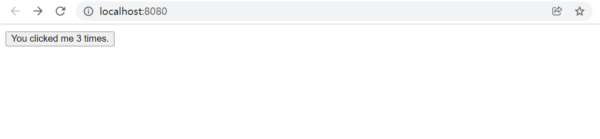
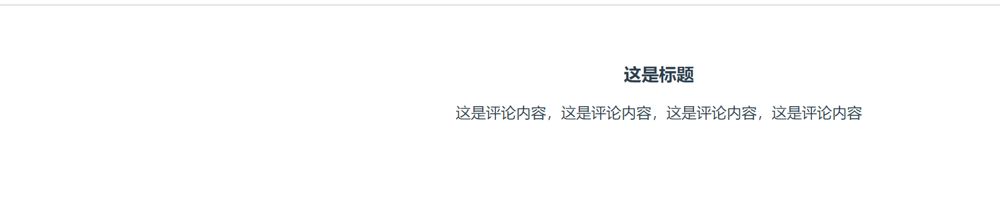
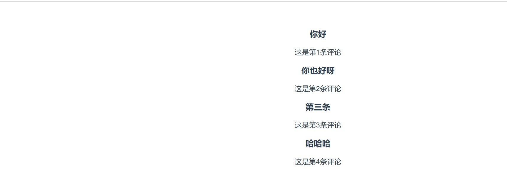

# Vue.js的组件化

在Vue.js实现的单页面应用中，最重要的就是组件，因为单一页面实现的关键就是通过切换引入的组件来达到“页面切换”的效果。


## 1.组件化简介

组件本身是一个可以被复用的Vue.js实例，带有name属性。

在前面介绍的所有单页面实例代码中，Vue.js实例本质上也是一个“组件”，不同的是页面只有一个组件，并且被挂载到了根节点上，没有实现复用。

**在一个复杂的站点中，将能复用的部分提取出来单独写成.vue文件，这就是Vue.js的组件化。**

前面说.vue文件，后面说组件，读者可能会被“绕晕”。

简单来说，一个Vue.js实现的页面可能因为功能不同被划分为很多不同的模块，尤其是一些被重复使用的模块，这类模块就可以被编写成组件，通过全局注册，这些组件在所有的页面中都能被随时使用。


例如，在同一个网站中，一个页面的头部（header）、底部（footer）或主菜单的样式与其他页面中基本雷同，那么头部、底部、主菜单也都是被复用的模块。

这些被复用的模块都可以写成组件。在Vue.js中，每个自定义组件都需要继承Vue.component。

Vue.component本身也拥有Vue.js实例的所有属性，包括完整的生命周期、v-bind的传值形式，以及v-if、v-on等指令的模板支持。


## 2.组件的创建

Vue.js创建一个新的组件应当基于Vue.component进行相应的实例化，该组件不一定在一个独立的.vue文件中。

【示例】创建一个名为button-counter、功能为单击按钮显示单击次数的组件。

代码如下（编写在main.js文件中）：

```
import Vue from 'vue';
import App from './5-4-2';

import './common.css';

Vue.component('button-counter', {
    name: 'button-counter',
    data: function () {
        return {
            count: 0
        }
    },
    template: '<button v-on:click="count++">You clicked me {{ count }} times.</button>'
})
new Vue({
  render: h => h(App)
}).$mount("#app")
```

上述代码来自Vue.js官方文档，目的是创建一个名为button-counter的组件。


## 3.组件的注册

组件创建后还需要注册。Vue.js支持两种形式的注册：全局注册和局部注册。


### 3.1 全局注册

如果是全局注册，组件可以在所有的页面和组件中使用，类似于自行建立了一个内置的HTML标签。

编辑webpack.config.js，增加测试环境中对Vue.js运行版本的支持，更改resolve参数，代码如下：

```
  resolve: {
    alias: {
      'vue$': 'vue/dist/vue.esm.js'
    },
    extensions: ['*', '.js', '.vue', '.json']
  },
```

编写一个页面，内容如下，无须任何引入，直接使用之前示例在main.js中定义的组件。

```
<template>
  <div id="app">
    <button-counter></button-counter>
  </div>
</template>

<script>
export default {
  name: 'app',
  data() {
  },
  methods: {}
}
</script>
```


重新运行dev服务器，页面如图所示。每单击一次按钮，次数就加1。



### 3.2 局部注册

以全局方式注册的组件，虽然可以在任何地方使用，但大量注册可能会出现启动缓慢的情况，并且很多组件（类似于只在文章页面出现的评论组件）并不需要全局注册。

Vue.js提供了第2种注册方式：局部注册，只在进入需要该组件的页面时才注册组件。


【示例】创建一个名为text-show.vue的文件，并将该文件写成一个单独的组件，代码如下：

```
<template>
  <div>
    <h3>这是标题</h3>
    <p>这是评论内容，这是评论内容，这是评论内容，这是评论内容</p>
  </div>
</template>

<script>
export default {
  name: "text-show",
  data() {
    return {}
  },
  created: function () {
    // 实例化组件的提示
    console.log("组件被创建")
  }
}
</script>

<style scoped>

</style>
```

新建一个项目，引入该组件，代码如下，在组件注册后可以正常使用。

```
<template>
  <div id="app">
    <text-show></text-show>
  </div>
</template>

<script>
import TextShow from "./text-show";
export default {
  name: 'app',
  components: {TextShow},
  data() {
  },
  methods: {}
}
</script>
<style>
....
</style>
```

显示效果如图




## 4.组件间的数据传递

组件中数据的传递最常见的是父组件传值给子组件，常用于可循环类数据的显示，如列表、评论等内容的展示。

例如评论组件，可以通过v-bind传输数据。


> **需要注意的是，子组件中必须声明props接收数据的变量。**


【示例】父子组件的传值。

```
<template>
  <div>
    <h3>{{ title }}</h3>
    <p>{{ context }}</p>
  </div>
</template>

<script>
export default {
  name: "text-show",
  data() {
    return {}
  },
  created: function () {
    // 实例化组件的提示
    console.log("组件被创建")
  },
  props: ['title', 'context'],
}
</script>

<style scoped>

</style>
```

在父组件中需要定义和传递数据，这里结合v-for指令循环输出组件，同时将数据传入子组件，代码如下：

```
<template>
  <div id="app">
    <div v-for="item in contexts">
      <text-show :title="item.title" :context="item.context"></text-show>
    </div>
  </div>
</template>

<script>
import TextShow from "./text-show";
export default {
  name: 'app',
  components: {TextShow},
  data() {
      return {
        contexts: [
          {title: '你好',context:'这是第1条评论'},
          {title: '你也好呀',context:'这是第2条评论'},
          {title: '第三条',context:'这是第3条评论'},
          {title: '哈哈哈',context:'这是第4条评论'},
        ]
      }
  },
  methods: {}
}
</script>


<style>
#app {
  font-family: 'Avenir', Helvetica, Arial, sans-serif;
  -webkit-font-smoothing: antialiased;
  -moz-osx-font-smoothing: grayscale;
  text-align: center;
  color: #2c3e50;
  margin-top: 60px;
}

h1, h2 {
  font-weight: normal;
}

ul {
  list-style-type: none;
  padding: 0;
}

li {
  display: inline-block;
  margin: 0 10px;
}

a {
  color: #42b983;
}
</style>
```

所有评论内容都出现在页面中,如下所示。




### 5.监听子组件事件

虽然子组件可以通过父组件传递值，但是子组件并不能更改来自父组件的数组。例如，如果需要为每一条评论设置删除按钮，应该如何处理呢？

为每条评论设置删除按钮，代码如下：

```
<template>
  <div>
    <h3>{{ title }}</h3>
    <p>{{ context }}</p>
<!-- 单击该按钮后会调用del()方法并且传递一个title参数，该参数是当前评论中默认传入的title。-->
    <button v-on:click="del(title)">删除该评论</button>
  </div>
</template>

<script>
export default {
  name: "text-show",
  data() {
    return {}
  },
  methods: {
    del: function (title) {
      console.log(title)

      // $emit对象，作用就是子组件向父组件暴露方法.
      this.$emit('del', title)

    }
  },
  props: ['title', 'context'],
}
</script>

<style scoped>

</style>
```

这里使用v-on属性绑定了两个方法，其中delItem()是父组件中定义的方法，用来删除数组，完整的业务逻辑代码如下：

```
<template>
  <div id="app">
    <div v-for="item in contexts">
<!--      父组件拿到暴露的del()方法，并且传递title参数，-->
<!--      该方法需要在父组件调用子组件时进行v-on属性的绑定声明，循环使用子组件时该父组件代码如下：-->
      <text-show v-on:del="delItem" :title="item.title" :context="item.context"></text-show>
    </div>
  </div>
</template>

<script>
import TextShow from "./text-show";

export default {
  name: 'app',
  components: {TextShow},
  data() {
    return {
      contexts: [
        {title: '你好', context: '这是第1条评论'},
        {title: '你也好呀', context: '这是第2条评论'},
        {title: '第三条', context: '这是第3条评论'},
        {title: '哈哈哈', context: '这是第4条评论'},
        {title: '呵呵呵', context: '这是第5条评论'},
      ]
    }
  },
  methods: {
    delItem: function (title) {
      let that = this
      this.contexts.map(function (item, index, arr) {
        if (item.title == title) {
          arr.splice(index, 1);
          that.context = arr
        }
      })
    }
  }
}
</script>


<style>
#app {
  font-family: 'Avenir', Helvetica, Arial, sans-serif;
  -webkit-font-smoothing: antialiased;
  -moz-osx-font-smoothing: grayscale;
  text-align: center;
  color: #2c3e50;
  margin-top: 60px;
}

h1, h2 {
  font-weight: normal;
}

ul {
  list-style-type: none;
  padding: 0;
}

li {
  display: inline-block;
  margin: 0 10px;
}

a {
  color: #42b983;
}
</style>
```

最终的代码执行效果,点击删除会删除对应的评论信息。


> 注意：Vue.js提供了很多以$开头的对象，尤其是实例部分，这些对象可以完成很多不同的功能，阅读官方的API文档可以查看具体的实例与介绍。


## 5.通过插槽分发内容

Vue.js不仅提供了组件，还提供了内容分发的API，这套API实现了组件的插槽功能。

那么什么是插槽呢？插槽其实就是一组`<slot></slot>`元素，该元素可以被放置在任何组件中，渲染组件时，它可以被替换成任何包含模板的代码，包括HTML、文本或其他自定义组件。

使用插槽，可以实现一些需要全局显示的警告、通知或消息提示等内容。


【示例】在子组件中增加一组`<slot></slot>`元素作为插槽，并且在父组件调用子组件时进行传值。代码如下：

slot-test.vue

```
<template>
  <div>
    <p>这是子组件的插槽</p>
    <slot>这是子组件的默认值</slot>
  </div>
</template>

<script>
export default {
  name: "slot-test",
  data() {
    return {}
  },
  created() {
    // 实例化组件的提示
    console.log("组件被创建")
  }
}
</script>

<style scoped>

</style>

```


子组件在`<slot></slot>`元素中的内容是默认值，即当该插槽没有被定义时，其本身会显示的内容。

如果插槽中显示的内容被定义，则默认内容不会显示。引入该组件的父组件代码如下：

```
<template>
  <div id="app">
    <slot-test name="text"><h1>父组件显示内容</h1></slot-test>
  </div>
</template>

<script>

import SlotTest from "./slot-test";

export default {
  name: 'app',
  components: {SlotTest},
  data() {
    return {}
  },

  methods: {}
}
</script>
```

上述代码中引入了子组件slot-test.vue，并且对其中的插槽进行了内容填充，页面最终效果如图:


## 小结

我们介绍了大量Vue.js的基础知识，包括渲染、生命周期、模板语法、组件的创建和注册等。

通过这些学习，我们可以了解什么是Vue.js的组件化、如何创建组件，以及组件的整个生命周期都有哪些函数。

