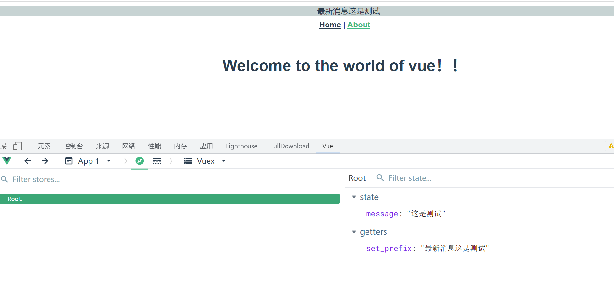
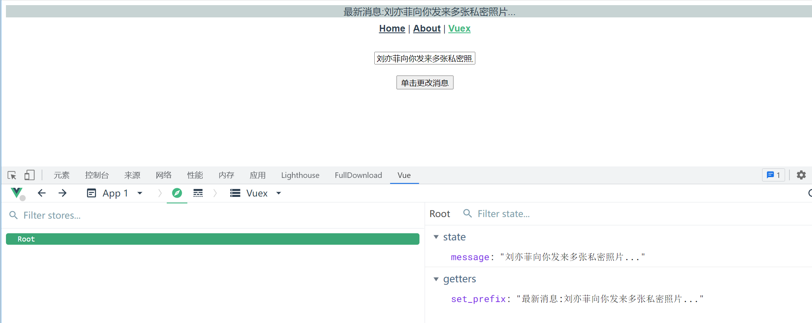
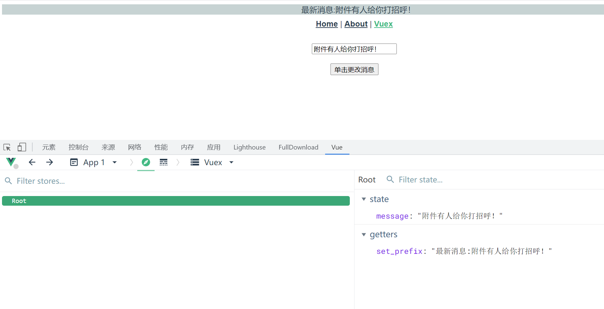

# Vue.js的状态管理库Vuex和Pinia

当下的前端技术（尤其是单页面开发）会经常提到状态管理这个概念，Vue.js和React.js都提供了很好的状态管理解决方案，分别是Vuex和Pinia。


## 1. Vuex

### 1.1 状态管理与store模式

对于一个基本的Vue.js组件，其所有的数据都存放在data对象中，而该对象拥有自己的作用域，想要在其他的组件或路由中访问这些数据并不是一件容易的事情。


如果这些数据内容需要被多个实例共享，使用缓存或路径参数的方式传输数据过于烦琐且容易出错，所以单页面应用提供了状态管理这个概念。

Vue.js中的状态管理提供了两种方案：

* store模式
* Vuex。

本节只介绍store模式，后面会详细介绍Vuex。

store模式无须安装模块，理解起来非常简单，相当于将数据挂载在根节点中（类似全局变量），然后在每个实例中声明data。

这样在一处更新数据时，所有的内容都会更新，因为其本身指向的是同一个对象。这样做的缺点是：数据的改变不会留下变更记录，并且调试困难。


### 1.2 使用Vuex的情形

并不是所有的情况都适合使用Vuex，或者说大量的业务需求并不需要对数据进行状态管理。

数据在单组件环境中可以完成大部分的业务需求，并非要必须使用状态管理，读者不需要为了使用状态管理而使用Vuex。


一些小项目如果引入Vuex进行状态管理，不仅会使原本逻辑清晰的代码和结构变得复杂，甚至会增加开发难度，造成代码冗余。

所以官方认为，如果不是大中型单页应用，不需要引入Vuex，即使需要同步数据，自带的store模式也足够使用。


如果需要构建大中型单页引用，那么Vuex是必然的选择。


采用一个新的Vue.js工程实现Vuex。

（1）使用如下命令创建并成功启动一个Vue.js项目。在配置工程时，添加Vuex和vue- router的支持

```
vue create vuex-test
```

（2）等待项目初始化成功，所有的依赖包会自动安装好，其中package.json的代码如下：

```
{
  "name": "vuex-test",
  "version": "0.1.0",
  "private": true,
  "scripts": {
    "serve": "vue-cli-service serve",
    "build": "vue-cli-service build",
    "lint": "vue-cli-service lint"
  },
  "dependencies": {
    "core-js": "^3.8.3",
    "vue": "^3.2.13",
    "vue-router": "^4.0.3",
    "vuex": "^4.0.0"
  },
  "devDependencies": {
    "@babel/core": "^7.12.16",
    "@babel/eslint-parser": "^7.12.16",
    "@vue/cli-plugin-babel": "~5.0.0",
    "@vue/cli-plugin-eslint": "~5.0.0",
    "@vue/cli-plugin-router": "~5.0.0",
    "@vue/cli-plugin-vuex": "~5.0.0",
    "@vue/cli-service": "~5.0.0",
    "@vue/eslint-config-standard": "^6.1.0",
    "eslint": "^7.32.0",
    "eslint-plugin-import": "^2.25.3",
    "eslint-plugin-node": "^11.1.0",
    "eslint-plugin-promise": "^5.1.0",
    "eslint-plugin-vue": "^8.0.3"
  }
}
```

这样就初始化了一个自带Vuex的状态管理项目。通过代码可以对所有页面中的状态进行控制。

（3）使用Vuex管理，需要先进行配置。基本的配置方式和vue-router类似，需要实例化一个Vuex.Store，并使用Vue.use在全局注册该组件，代码如下：

```
import { createStore } from 'vuex'

export default createStore({
  state: {
  },
  getters: {
  },
  mutations: {
  },
  actions: {
  },
  modules: {
  }
})
```

（4）最终获得的store对象和自定义的存储数据的对象一样，需要在main.js中引入，并在实例化Vue对象时作为参数传入，代码如下：

```
createApp(App).use(store).use(router).mount('#app')
```


### 1.3 在Vue.js组件中Getter对象

Vuex被注册成一个store之后，可以在全局的组件中使用，如果只需要其中的值，调用$store这个全局对象就可以。

【示例】编写一个基本的全局消息显示程序。

（1）定义一个基本的store，通过页面上方的一个共同组件显示信息，并且在子组件中更改该内容时此处的内容会自动更新。

```
import { createStore } from 'vuex'

export default createStore({
  state: {
    message: '这是测试'
  },
  getters: {
  },
  mutations: {
  },
  actions: {
  },
  modules: {
  }
})

```


（2）store需要在main.js中引入和注册，代码如下：

```
import { createApp } from 'vue'
import App from './App.vue'
import router from './router'
import store from './store'

createApp(App).use(store).use(router).mount('#app')
```


（3）编辑App.vue的模板部分和样式部分，增加一个新的路由路径和显示信息的\<div\>元素，代码如下：


```
<template>
  <div id="app">
    <div class="show-message">
      {{ $store.state.message }}
    </div>
    <div id="nav">
      <router-link to="/">Home</router-link>
      |
      <router-link to="/about">About</router-link>
    </div>
    <router-view/>
  </div>
</template>
```

store中的Getter对象用于获取实例中的state属性，然后对数据进行操作（并非改变数据本身）。这些操作也可以在组件获取store的值后再执行，但使用Getter对象可以增加代码的复用性，提高页面的响应性能。

在store中编写一个Getter对象用于获取states中的数据，并对该数据进行操作，代码如下：

```
import { createStore } from 'vuex'

export default createStore({
  state: {
    message: '这是测试'
  },
  getters: {
    set_prefix: state => {
      return '最新消息' + state.message
    }
  },
  mutations: {
  },
  actions: {
  },
  modules: {
  }
})
```

在Getter对象中定义了一个方法，为原本的数据增加一个字符串前缀。在App.vue中通过该Getter对象获取数据，修改后的模板代码如下：

```
<template>
  <div id="app">
    <div class="show-message">
      {{ $store.getters.set_prefix }}
    </div>
    <div id="nav">
      <router-link to="/">Home</router-link>
      |
      <router-link to="/about">About</router-link>
    </div>
    <router-view/>
  </div>
</template>
```

显示效果如图

通过Getter对象获取数据




### 1.4 更新Vuex中的store

因为Vue.js中所有的数据绑定都采用单向传输方式，直接对数据进行改写根本不会通知组件，所以组件自然无法获取变化后的数据，此时页面不发生任何变化。这也是Vuex出现的原因。Vuex提供了一个Mutation对象，所有对数据的修改都必须通过该对象进行操作。

修改store中message对象的值。

```
import { createStore } from 'vuex'

export default createStore({
  state: {
    message: '这是测试'
  },
  mutations: {
    // set()方法，但是不能直接调用，类似于事件注册
    setMessage (state, msg) {
      state.message = msg
    }
  },
  getters: {
    set_prefix: state => {
      return '最新消息:' + state.message
    }
  },
  actions: {},
  modules: {}
})
```

上述代码中定义了一个setMessage()方法，该方法接收两个参数：第一个参数是state本身，

第二个参数用来确定显示的内容。通过调用set_prefix()方法可以修改state中的message对象的值。

> 注意：如果直接修改state中的数据，则无法通知所有使用该数据的位置实现更新，所以需要使用定义的setMessage()方法修改数据，
>
> 即必须使用this.$store.commit()进行“提交”式地调用。


编辑`router/index.js`文件,编写路由

```
import { createRouter, createWebHistory } from 'vue-router'
import HomeView from '../views/HomeView.vue'
import VuexTest from '@/views/VuexTest'

const routes = [
  {
    path: '/',
    name: 'home',
    component: HomeView
  },
  {
    path: '/about',
    name: 'about',
    // route level code-splitting
    // this generates a separate chunk (about.[hash].js) for this route
    // which is lazy-loaded when the route is visited.
    component: () => import(/* webpackChunkName: "about" */ '../views/AboutView.vue')
  },
  {
    path: '/vuex-test',
    component: VuexTest
  }
]

const router = createRouter({
  history: createWebHistory(process.env.BASE_URL),
  routes
})

export default router
```


上述代码在路由代码中引入了`view/VuexTest.vue`文件，该文件用于提供一个按钮和监听事件来更改store对象，

代码如下：

```
<template>
  <div>
    <input v-model="text"/>
    <br> <br>
    <button v-on:click="changeMsg">单击更改消息</button>
  </div>
</template>

<script>
export default {
  name: 'VuexTest',
  data () {
    return {
      text: ''
    }
  },
  methods: {
    // 定义修改方法
    changeMsg: function () {
      // 该方法必须同步执行
      this.$store.commit('setMessage', this.text)
    }
  }
}
</script>

<style scoped>

</style>
```


上述代码定义一个文本框并且绑定相应的值，同时绑定按钮的单击事件。单击该按钮，调用store中的mutation对象指定方法名为setMessage()，同时传入一个输入数据的变量。


为了方便使用，可以在App.vue中添加一条跳转标签，代码如下：

```
<template>
  <div id="app">
    <div class="show-message">
      {{ $store.getters.set_prefix }}
    </div>
    <div id="nav">
      <router-link to="/">Home</router-link>
      |
      <router-link to="/about">About</router-link>
      |
      <router-link to="/vuex-test">Vuex</router-link>
    </div>
    <router-view/>
  </div>
</template>
```

最终显示效果如图



使用store.commit()进行修改当然没有任何问题，如果在组件中直接对其调用，**则需要注意mutation对象必须同步执行。**


也就是说，该代码下方的所有代码都会在commit()方法执行完成后才会执行。


如果需要异步处理所有的修改，则需要使用Action对象。该对象本质上是在Action中使用mutation，也就是在actions对象中编写commit()方法，代码如下：

```
import { createStore } from 'vuex'

export default createStore({
  state: {
    message: '这是测试'
  },
  mutations: {
    // set()方法，但是不能直接调用，类似于事件注册
    setMessage (state, msg) {
      state.message = msg
    }
  },
  getters: {
    set_prefix: state => {
      return '最新消息:' + state.message
    }
  },
  // Action的特性是可以异步执行代码。
  actions: {
    setMessage (context, msg) {
      context.commit('setMessage', msg)
    }
  },
  modules: {}
})

```


Action对象中的方法接收一个和store实例相同的对象（但并不是store实例本身），通过store.dispath()方法指定方法名称和参数，触发对象。修改VuexTest.vue中的代码如下：

```
<template>
  <div>
    <input v-model="text"/>
    <br> <br>
    <button v-on:click="changeMsg">单击更改消息</button>
  </div>
</template>

<script>
export default {
  name: 'VuexTest',
  data () {
    return {
      text: ''
    }
  },
  methods: {
    // 定义修改方法
    changeMsg: function () {
      // 异步处理
      this.$store.dispatch('setMessage', this.text)
    }
  }
}
</script>

<style scoped>

</style>
```


Action的特性是可以异步执行代码。




### 1.5 Vuex模块的划分

大型项目中会产生大量的数据需要通过store管理，每条数据本身至少拥有一个Mutation及更多的Getter对象，这让整个State变得异常庞大。Module对象就是为了解决对象过大的问题而生。


Vuex允许将store分割为模块，每个模块可以拥有自身的state、Mutation和Action，甚至是更小的细分模块。

只需要在Modules对象中添加需要使用的模块，并将所有的子模块注册在全局中，这样就可以将所有的数据对象进行模块化地分类，使整个逻辑代码更加简洁。例如：

```
import { createStore } from 'vuex'

export default createStore({
  state: {
    message: '这是测试'
  },
  mutations: {
    // set()方法，但是不能直接调用，类似于事件注册
    setMessage (state, msg) {
      state.message = msg
    }
  },
  getters: {
    set_prefix: state => {
      return '最新消息:' + state.message
    }
  },
  actions: {
    setMessage (context, msg) {
      context.commit('setMessage', msg)
    }
  },
  modules: {
    a: moduleA,
    b: moduleB
  }
})
```

参考文献：

https://www.e-learn.cn/topic/1805138


> 注意：默认情况下，模块内部的Action、Mutation和Getter是注册在全局命名空间内的，可以直接使用，也可以通过添加namespaced:true的方式使模块内部的action、mutation和getter成为带命名空间的模块，通过命名空间的不同进行区分和调用。

## 2. Pinia

### 1.安装

> 使用你喜欢的包管理工具安装pinia

```
yarn add pinia
# 或者使用 npm
npm install pinia
```

>引入到mian.js中
>
>vue3

```
// createPinia 是一个函数
import { createPinia } from 'pinia'

app.use(createPinia())
```

### 2.创建store

`store`简单来说就是一个公共数据仓库， 我们把数据放在`store`中， 其他所有组件都可以访问和修改。

创建一个用户store

> /src/store/user.ts

```
import { defineStore } from 'pinia'

// 第一个参数是应用程序中 store 的唯一 id
// 第二参数是options (配置项)
// 命名规范 use + 相关名词 + Store
export const useUserStore = defineStore('main', {
  // other options...
})
```

创建`defineStore`很简单， 接收命名为 `use + 相关名词 + Store`, 第一参数为唯一id， 第二个参数为配置项。

### 3.添加store

> /src/store/user.ts

```
import { defineStore } from 'pinia'

export const useUserStore = defineStore('main', {
  //state是一个函数， 返回的是对应数据
  state: () => ({
    name: 'shenxiu',
    age: 20,
    sex: 'male',
    qSkill: '斩钢闪'
  }),
  getters: {
    // 箭头函数 推荐
    getAddAge: (state) => {
      return state.age * 2 + 10
    },
    getIsAge: (state) => {
      return (num, number) => {
        return state.age = num
      }
    },
    // 箭头函数写法--不接收参数
    getYasuoInfoNoParams: state => `${state.name}，q技能叫做${state.qSkill}`,

    // 箭头函数写法--接收参数
    getYasuoInfoHaveParams: state => {
      // console.log(this)  //使用箭头函数的话，这个地方的this是无效的 可以通过state.其他getters的名称 来访问别的getters
      return (params) => `${state.name}，q技能叫做${state.qSkill}，${params}`
    },

    // 普通函数写法--不接收参数
    getYasuoInfoNoParams1(state) {
      // console.log(this)  //在此处this 和 state的值是一样的  可以通过this/state.其他getters的名称 来访问别的getters
      // console.log(state)
      return `${this.name}，q技能叫做${this.qSkill}`
    },
    // 普通函数写法--接收参数
    getYasuoInfoHaveParams1(state) {
      return function (params) {
        return `${state.name}，q技能叫做${state.qSkill}，${params}`
      }
    },
  },
  actions: {
    // 比如发送token 请求token的应用场景
    changeName(name,string) {
      this.name = name
    }
  }
})

```

### 4.使用store、Getters、Action 属性

> /src/App.vue

```
<template>
<p>这是pinia-vue3教程界面!</p>

  <div class="content">
    <p>store简单来说就是一个公共数据仓库， 我们把数据放在store中， 其他所有组件都可以访问和修改。</p>
    <p>{{ name }}</p>
    <p>{{ age }}</p>
    <p>{{ sex }}</p>
    <el-button size="small" @click="changeName">修改姓名</el-button>
    <el-button size="small" @click="patchStore">批量修改</el-button>
    <el-button size="small" @click="resetStore">重置状态</el-button>

    <!--    使用getters-->
    <p>Getter 完全等同于 Store 状态的 计算值。 它们可以用 defineStore() 中的 getters 属性定义。</p>
    <p>---------------------使用getters------------------</p>
    <p>{{ store.getAddAge }}</p>
    <p>---------------------getter传参--------------------</p>
    <p>{{ modifyage }}</p>
    <div>
      {{ yasuoInfoNoParams }}
    </div>
    <div>
      {{ yasuoInfoHaveParams }}
    </div>
    <div>
      {{ yasuoInfoNoParams1 }}
    </div>
    <div>
      {{ yasuoInfoHaveParams1 }}
    </div>
    <p>Actions 相当于组件中的 methods。 它们可以使用 defineStore() 中的 actions 属性定义，并且它们非常适合定义业务逻辑。</p>
    <p>比如发送token 请求token的应用场景</p>
    <p>使用 actions</p>
    <el-button @click="setToken">发送token修改name的值</el-button>
  </div>

</template>

<script>
import { storeToRefs } from "pinia";
import { useUserStore } from "@/store/pinia";
import {computed} from "vue";
export default {
  setup() {
    const store = useUserStore();
    const yasuoInfoNoParams = computed(() => store.getYasuoInfoNoParams)
    const yasuoInfoHaveParams = computed(() => store.getYasuoInfoHaveParams('r技能叫做狂风绝息斩'))
    const yasuoInfoNoParams1 = computed(() => store.getYasuoInfoNoParams1)
    const yasuoInfoHaveParams1 = computed(() => store.getYasuoInfoHaveParams1('r技能叫做狂风绝息斩'))
    const modifyage = computed(() => store.getIsAge(2))

    //storeToRefs 将store里面的值转化为响应式
    const { name, age, sex } = storeToRefs(store);

    const setToken = () => {
      store.changeName("zhangsan");
    }

    //直接修改
    const changeName = () => {
      store.name = "zhangsan";
    }
    //批量修改
    const patchStore = () => {
      store.$patch({
        name: "lihua",
        age: 18,
        sex: "female",
      });
    }
    // 重置到原始状态
    const resetStore = () => {
      const store = useUserStore()
      store.$reset()
    }
    return {
      name,
      age,
      sex,
      store,
      changeName,
      patchStore,
      resetStore,
      modifyage,
      yasuoInfoNoParams,
      yasuoInfoHaveParams,
      yasuoInfoNoParams1,
      yasuoInfoHaveParams1,
      setToken
    }
  }
}
</script>

<style scoped>

</style>
```


在Vue3项目中使用pinia代替Vuex进行数据存储

https://www.cnblogs.com/wuhuacong/archive/2022/04/08/16117968.html


pinia-vue3教程

https://zhushenxiu.site/2022/08/10/vue/pinia/

https://www.cnblogs.com/zhaord/p/16187429.html


Pinia 中文文档

https://pinia.web3doc.top/


## 3.Vuex VS Pinia

开发大中型项目的时候，需要用到状态管理器。Vuex 专门为 Vue.js 打造，易学易用。


那么 Pinia🍍 对比 Vuex 有什么优势呢？

1. 更好的 TS 支持
2. 更加轻量，压缩后只有 1KB
3. 去除了 mutation。使用  async + await  处理同步问题
4. 无需手动添加 store，创建的 store 会在使用时自动添加

缺点就是**还很新**，处于起步阶段，社区还有待加强。


🍍的开发者是 vuex 的核心成员，所以 vue官方也推荐用 🍍 作为未来状态管理器的首选。


🏷️**结论**：选用 Pinia 作为状态管理器。


