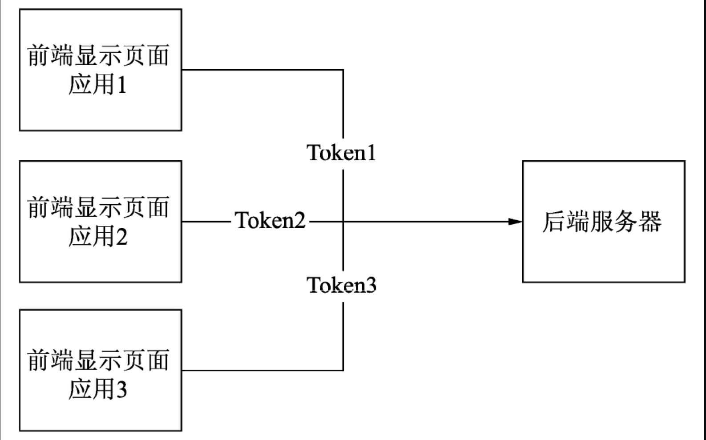
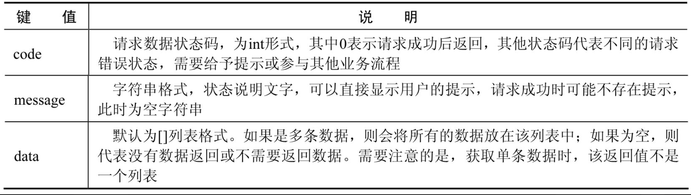
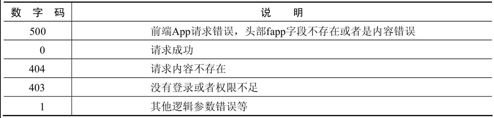

# 项目需求分析和功能说明


## 1.内容发布网站的需求分析

一个项目的实际需求设计需要花费长时间准备，不管是自行开发系统，还是根据客户的需求开发系统，都应当在着手编写代码之前确定详细的系统功能设计与功能说明书，以及其他的相关文档。


## 2.系统设计需求和技术说明

本节将开发一个简单的内容发布系统，也就是常说的CMS（Content Management System）。虽然网络中存在大量成熟的CMS，但开发一个适合自己的CMS也很重要。本章的实例是一个基本的CMS系统，最主要的功能就是文章的发布和展示。


需要明确以下几点：

（1）开发架构：本实例采用前后端分离的方式进行开发，这样前端的展示更加灵活，而独立的前端也无须一对一地对应后端。

也就是说，前后端分离的方式可以通过一套后端系统和多套前端展示，实现跨应用和跨平台，提高接口的复用性。

前后端分离设计



（2）技术选择：本例全部采用JavaScript系列技术，后端选择Express框架进行开发，前端使用Vue.js技术进行开发，尽可能实现页面的组件化，以方便对不同产品的UI进行替换。


（3）数据的持久化：本例采用Redis存储所有数据，在保证性能的基础上，尽可能减轻内存和服务器的压力。

当然也可以采用多种数据库联合存储的形式，例如使用Redis存储热点数据，而使用MySQL或MongoDB作为二级储存。

对于非海量数据和非高并发的情况，无论采用什么样的数据库，都不会有性能瓶颈。


> 注意：Redis与MongoDB和其他关系型数据库并没有严格的优劣之分，可以考虑具体的业务情况来选择数据库。
>
> 本例选择Redis数据库的原因在于它的数据结构非常容易理解，性能也非常优秀。当然，Redis由于受到存储量和服务器的要求等条件限制，将其作为数据库可能并不是最好的选择。


## 3.后端接口需求

后端接口将会通过不同的应用参数（App ID）进行区分，也就是说，不同的前端请求通过相同的URL（URL携的App参数不同）请求后端数据。

这样设计的好处是，一个后端服务可以对应多个功能相同的前端请求，并且能保证每个前端请求的数据独立性。后端接口使用JSON字符串返回数据，支持GET/POST等方式请求数据，格式如下：

```
{
	"code": 0,
	"message": "请求成功",
	"data": []
}
```

后端接口返回内容说明



项目中的部分页面可能需要用户登录，如果用户没有登录，也就是没有用户对应的Token发起请求，则返回如下提示：

```
{
	"code": 100,
	"message": "请登录进行工作",
	"data": []
}
```

当code不为1时，需要提示用户或直接跳转至登录页面要求用户登录。

本例中出现的其他请求状态码和说明参见表

JSON请求的状态码



注意：所有的JSON请求状态码都是由后端服务返回的。也就是说，只有后端服务器接收到的正确的请求并成功执行全部的逻辑代码后（即网站服务器的HTTP状态码返回值为200时），才会返回JSON请求状态码。


## 4.前端页面需求

使用Vue.js开发前端页面，可以采用组件化的方式提取一些个性化的内容编写成组件的形式，以提高复用率及更简单的替换服务。

前端页面是一个基本的展示页面，包括轮播、文章展示、导航、底部介绍等，这些都通过后端接口获取，以实现动态菜单导航功能。

不仅是菜单，而且对于页面下方的说明和版权等内容，也采用后端接口获取的方式实现直接配置就可以完成的效果。下一节将会划分具体的API路径，分析其具体功能，并且规划相应的页面，为编写代码做好最后的准备工作。


