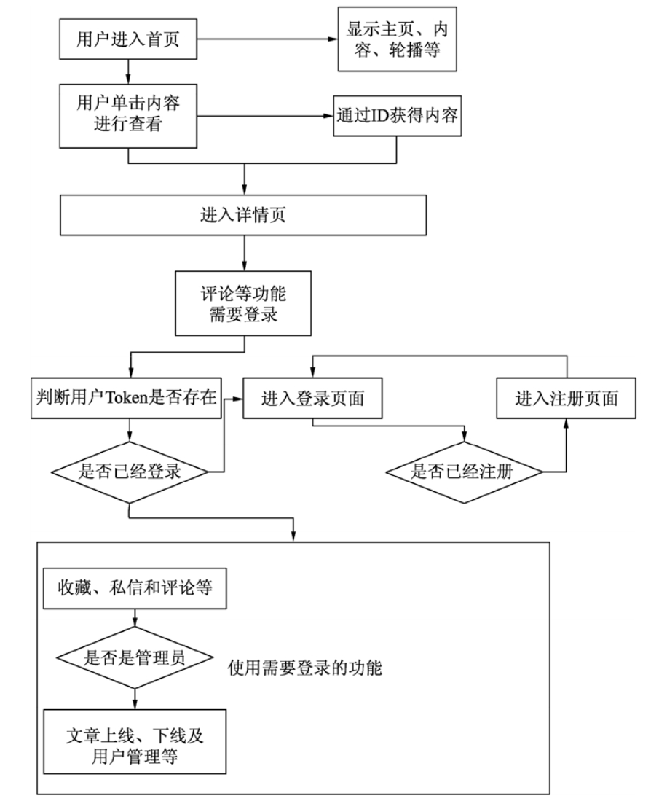

# 项目策划和功能设计

本节分析项目的具体需求，通过项目策划，完成基本项目蓝图的设计和功能设计，同时确定编写代码的范围。


## 1.项目功能策划

本项目实现的主要功能包括：

- 主页或其他页面需要显示的内容，如顶部导航菜单、轮播图、底部内容、友情链接和联系方式（footer）等；
- 热点文章列表显示（浏览量排序）；
- 文章的发布、管理和显示等功能，包括浏览量、点赞和踩的数量；
- 对文章的评论（登录用户可以发起评论）；
- 文章的基本分类和小标签（对文章进行分类）；
- 用户模块，用户的相应权限，用户的个人信息管理、显示和修改，以及用户状态配置（删除和停用）等；
- 用户的注册和登录，以及管理自己编写的评论；
- 用户之间的私信聊天；
- 后台管理员的权限（文章的发布、管理、页面修改）和用户的管理等。


## 2.项目模块划分

项目主要划分为3个模块：文章和评论模块、用户模块、后台管理模块。

（1）文章和评论模块是本项目最基本的功能模块，它与用户模块及后台管理模块有一定的耦合度，例如，用户登录后才能评论文章。文章和评论模块的功能包括：

- 每当用户浏览该文章时，浏览量自动加1（采用前端控制的方式，提供浏览量+1接口）；
- 文章返回采用时间排序的方式；
- 所有的用户都可以查看主页，也可以查看文章的内容，但是不能评论文章，也不能查看其他用户信息；
- 评论文章需要用户登录。


（2）用户模块的功能包括：

- 配置用户的权限，其中，管理员是特殊的用户；
- 验证不同路由的权限；
- 用户只能更改自身的资料，可以查看其他用户的非隐私资料，也可以给其他用户发送私信；
- 用户的注册采用传统方式，通过Token判定登录状态，条件允许的话，会根据登录IP或使用情况提示安全问题。


（3）后台管理模块的功能包括： 

- 暂时只允许超级管理员管理相关权限以及文章的发布和编写；
- 设计一个具有超级管理员特权的普通用户，也就是说，所有的用户都可以成为超级管理员；
- 所有的文章和用户都由超级管理员管理，他可以上线文章（即发布文章，让客户端可以查看）和下线文章（客户端不可查看，但文章仍然在数据库中，并没有被删除），也可以封停用户。

注意：不要信任用户输入的内容，因为用户可能会输入一些非法字符或代码，所以所有的输入需要转义显示。


## 3.项目后端API路由定义

后端实现的API路由，根据其权限进行以下划分。

（1）无须后端权限就能配置的API包括：

```
获取页面导航栏的API地址：http://localhost:3000/getNavMenu；
获取底部详细内容的API地址：http://localhost:3000/getFooter；
获取友情链接的API地址：http://localhost:3000/getLinks；
获取首页轮播图的API地址：http://localhost:3000/getIndexPic；
获取热点文章列表内容的API地址：http://localhost:3000/getHotArticle；
获取最新文章列表的API地址（需要判断用户权限，超级用户显示所有文章）：http://localhost:3000/getNewArticle；
获取文章详情的API地址：http://localhost:3000/getArticle/:id；
获取文章评论的API地址：http://localhost:3000/getArticleTalk/:id；
单击小标签和获取分类内容的API地址：http://localhost:3000/getArticles；
文章查看数+1的API地址：http://localhost:3000/viewArticle/:id。
```


（2）需要用户登录的API包括：

```
用户评论文章的API地址：http://localhost:3000/users/user/article/talk；
获取用户资料的API地址：http://localhost:3000/users/user/info/:username；
修改用户资料的API地址：http://localhost:3000/users/user/changeInfo；
发送私信的API地址：http://localhost:3000/users/user/mail/:username；
获取私信列表的API地址：http://localhost:3000/users/user/mailsGet；
获取用户私信的API地址：http://localhost:3000/users/user/mailGetter/:id；
用户注册的API地址：http://localhost:3000/users/register；
用户登录的API地址：http://localhost:3000/users/login；
文章分类列表的API地址：http://localhost:3000/users/user/articleType；
文章“点赞”和“踩”功能的API地址：http://localhost:3000/users/user/like/:id/:like；
文章收藏功能的API地址：http://localhost:3000/users/user/save/:id；
获取收藏文章列表的API地址：http://localhost:3000/users/user/saveList。
```


（3）需要超级用户才能配置的API包括：

```
文章添加和修改的API地址：http://localhost:3000/setArticle；
文章发布和删除的API地址：http://localhost:3000/admin/showArticle；

添加和修改分类的API地址：http://localhost:3000/admin/setArticleType；
获取全部用户列表的API地址：http://localhost:3000/admin/getAllUser；
封停用户的API地址：http://localhost:3000/admin/stopLogin/:id；
修改主页轮播内容的API地址：http://localhost:3000/admin/setIndexPic；
修改导航内容的API地址：http://localhost:3000/admin/changeNav；
修改底部内容的API地址：http://localhost:3000/admin/setFooter；
修改友情链接内容的API地址：http://localhost:3000/admin/setLinks。
```


## 4.项目前端页面路由定义

使用Vue.js开发的前端项目页面采用vue-router作为基本的路由分类，它需要的页面和路由地址如下：

```
主页（包括轮播图、最新列表和最热列表）：http://localhost:8080/；

文章结果页（包括搜索、单击分类和小标签）：http://localhost:8080/articleType？参数；
文章详情页（显示文章及其评论，同时提供评论功能）：http://localhost:8080/article/文章id；

登录页面：http://localhost:8080/login；
注册页面：http://localhost:8080/register；

用户信息页面（显示自己的信息和他人信息）：http://localhost:8080/userInfo/用户名称；

私信查看页面：http://localhost:8080/mail；

文章编辑页面（管理员）：http://localhost:8080/admin/article；
文章管理页面（管理员）：http://localhost:8080/admin/articles；
用户管理页面（管理员）：http://localhost:8080/admin/users。
```


## 5.项目原型图和流程图

项目中的API虽然可以独立发送请求，但其本质上也受到整个项目流程的制约。项目的生命周期如图

项目流程




## 6.小结

本章分析了一个完整的CMS项目，并设计了相应的API请求路由和页面，虽然没有涉及技术细节，但相信读者已经对前端和后端的代码有了初步的想法。

在实际开发中，一份明确的需求文档非常重要，它应该详细到每个页面的设计、功能的划分、功能的迭代说明等，只有所有的功能都有相应的文档说明，才能在最短的时间内开发出可行的产品。


