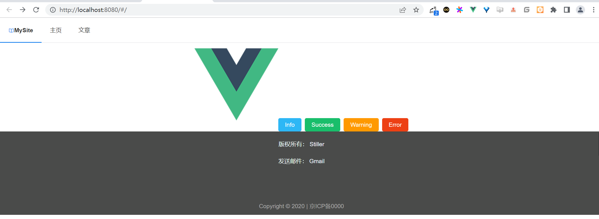

# 主要页面的开发

本节编辑一些简单的页面，包括具体的文章分类页面、文章展示页面和主页展示页面等。

## 1.主页

主页应当显示轮播图、导航菜单、位置列表和footer等内容，导航菜单、footer和文章列表属于可以被复用的内容，所以将其编写为组件。


首先设计代码结构，本项目所有的页面文件都放置在views文件夹中，所有的组件文件都放置在src/components文件夹中。

改造App.vue这个Vue.js的入口文件，将所有的路由页面都挂载在该页面中。

本项目的所有页面都包含顶部的导航和尾部的footer，将这两部分编写为组件。

在src/components文件夹中创建这两个组件，一个命名为NavView.vue，作为导航组件；

另一个命名为FooterView.vue，作为尾部组件。

导航组件获取服务器API中的NavMenu组件，该请求会在Created()生命周期发起，代码如下：

```
<script>
    export default {
        name: "NavView",
        data() {
            return {
                menu: [],
                index: 'MySite',
                theme1: 'light',
                userBtn: false,
                username: ''
            }
        },
        created() {
            //获取导航菜单
            this.$api.get('getNavMenu').then((res) => {
                //写数据
                this.menu = res.data
            })
        },
        updated() {},
    }
</script>
```

在页面中调用iView的Menu组件，使用v-for循环输出API获取数据，使用router-link组件设定超链接，代码如下：

```
<template>
    <div>
        <Menu mode="horizontal" :theme="theme1" active-name="1">
            <MenuItem name="1">
                <div class="main">
                    <Icon type="md-book"/>
                    <router-link to="/">
                        {{index}}
                    </router-link>
                </div>
            </MenuItem>
            <MenuItem v-for="item in menu" :name="item.name" :key="item.name">
                <router-link :to="item.src">
                    {{item.name}}
                </router-link>
            </MenuItem>
        </Menu>
    </div>
</template>
<style scoped>
    .main {
        font-weight: 600;
    }

    a {
        color: #2f2f2f;
    }
</style>
```

接着编写Footer.vue组件，和导航组件类似，获取API提供的数据并且循环输出，完整的代码如下：

```
<script>
    export default {
        name: "FooterView",
        data() {
            return {
                footer: [],
                icp:"Copyright © 2020 | 京ICP备0000"
            }
        },
        created() {
            //获取footer菜单
            this.$api.get('getFooter').then((res) => {
                this.footer = res.data
            })
        }
    }
</script>
```

这里没有使用动态的ICP备案信息，如果读者有兴趣，也可以从API中获取，接着编写页面。

获取的后台数据存在3个属性，其中，name表示显示，src表示连接，text表示显示在name后方的具体描述。

```
<template>
    <div class="footer">
        <div v-for="item in footer" :key="item.name" class="footer-div">
            {{item.name}}：
            <router-link :to="item.src">
                {{item.text}}
            </router-link>
        </div>
        <div class="icp">
            {{icp}}
        </div>
    </div>
</template>

<style scoped>
    .footer {
        background: #4a4b4a;
        color: azure;
        min-height: 200px;
        position: relative;
    }
    .footer a{
        color: aliceblue;
    }
    .footer-div{
        padding-top: 20px;
    }
    .icp{
        position: absolute;
        bottom: 10px;
        color: darkgrey;
        width: 100vw;
    }
</style>
```

编写好两个组件后，接着修改App.vue文件引入这两个组件，修改后的代码如下：

```
<template>
  <div id="app">
    <div class="nav">
      <NavView></NavView>
    </div>
    <router-view/>
    <div>
      <FooterView></FooterView>
    </div>
  </div>
</template>

<script>
import NavView from '@/components/NavView'
import FooterView from '@/components/FooterView'
export default {
  components: { FooterView, NavView}
}
</script>
```

这样所有的页面都可以显示这两个组件了，页面路径切换时这两个组件也不变，显示效果如图




接着编写主页。在views文件夹下新建IndexView.vue文件用来编写主页面代码。页面路由文件router/index.js代码如下：

```
import { createRouter, createWebHashHistory } from 'vue-router'
import IndexView from "@/views/IndexView"; IndexView

const routes = [
  {
    path: '/',
    name: 'Index',
    component: IndexView
  },
......
]

const router = createRouter({
  history: createWebHashHistory(),
  routes
})

export default router
```

主页面应当包含两个文章列表，文章列表本身也是一个可被复用的组件，所以提取为一个组件，在components文件夹中新建articleList.vue文件。

文章组件本身不需要通过接口获取任何数据，只需要显示上级组件中传递的数据。这里采用props方式传输数据，需要指定单击后跳转的链接，代码如下：

```
<template>
  <Card>
    <template #title>{{title}}</template>
<!--    <p slot="title">{{title}}</p>-->
    <p v-for="item in list" :key="item.id" class="item">
      <router-link :to="'/article/'+item.id">
        {{item.title}}
      </router-link>
    </p>
  </Card>
</template>

<script>
export default {
  name: 'ArticleList',
  data () {
    return {}
  },
  created () {

  },
  props: {
    title: String,
    list: Array
  }
}
</script>

<style scoped>
.item{
  border-bottom: 1px solid #eee;
  padding: 10px;
}
</style>

```

编写好该组件后，在IndexView.vue文件中引入。首页需要3个数据：热点文章、最新文章列表和轮播图。获取的列表数据中不显示后台没有上线的内容，代码如下：

```
<script>
import ArticleList from '../components/ArticleList'

export default {
  name: 'Home',
  components: {
    ArticleList
  },
  data() {
    return {
      value2: 0,
      pic: [],
      list: [],
      listTitle: '最新文章',
      hotList: [],
      hotListTitle: "最热文章"
    }
  },
  created: function () {
    //获取主页轮播图
    this.$api.get('getIndexPic').then((res) => {
      console.log(res.data)
      this.pic = res.data
    })
    //获取所有文章
    this.$api.get('getNewArticle').then((res) => {
      let rData = res.data.slice(0, 5)
      let tData = []
      rData.map((item) => {
        if (item.id !== 0) {
          tData.push(item)
        }
      })
      this.list = tData
    })
    //获得热点文章
    this.$api.get('getHotArticle').then((res) => {
      let rData = res.data.slice(0, 5)
      let tData = []
      rData.map((item) => {
        if (item.id !== 0) {
          tData.push(item)
        }
      })
      this.hotList = tData
    })
  }
}
</script>
```

接着编写相关的页面，主页使用iView中的走马灯插件完成轮播图，对两个应当出现的文章列表采用栅格式布局。完整的代码如下：

```
<template>
  <div>
    <!--轮播图-->
    <Carousel v-model="value2" loop>
      <CarouselItem :key="item.title" v-for="item in pic">
        <div class="demo-carousel">
          <router-link :to="item.src">
            
            <div>
              {{item.title}}
            </div>
          </router-link>
        </div>
      </CarouselItem>
    </Carousel>
    <!--文章列表-->
    <div class="article-list">
      <row type="flex" justify="space-around" class="code-row-bg">
        <i-col span="11">
          <article-list :list="list" :title="listTitle"></article-list>
        </i-col>
        <i-col span="11">
          <article-list :list="hotList" :title="hotListTitle"></article-list>
        </i-col>
      </row>
    </div>
  </div>
</template>

<script>
import ArticleList from '../components/ArticleList'

export default {
  name: 'HomeView',
  components: {
    ArticleList
  },
  data () {
    return {
      value2: 0,
      pic: [],
      list: [],
      listTitle: '最新文章',
      hotList: [],
      hotListTitle: '最热文章'
    }
  },
  created: function () {
    // 获取主页轮播图
    this.$api.get('getIndexPic').then((res) => {
      console.log(res.data)
      this.pic = res.data
    })
    // 获取所有文章
    this.$api.get('getNewArticle').then((res) => {
      const rData = res.data.slice(0, 5)
      const tData = []
      rData.forEach((item) => {
        if (item.id !== 0) {
          tData.push(item)
        }
      })
      this.list = tData
    })
    // 获得热点文章
    this.$api.get('getHotArticle').then((res) => {
      const rData = res.data.slice(0, 5)
      const tData = []
      rData.forEach((item) => {
        if (item.id !== 0) {
          tData.push(item)
        }
      })
      this.hotList = tData
    })
  }
}
</script>
<style>
.demo-carousel {
  width: 98vw;
  height: 30vw;
}

.demo-carousel img {
  width: 100%;
  position: relative;
}

.demo-carousel div {
  padding: 30px;
  background: RGBA(0, 0, 0, 0.5);
  position: absolute;
  z-index: 1;
  color: white;
  font-size: 60px;
  width: 70%;
  top: 10vw;
  text-align: center;
  margin-left: 15%;
}
.article-list{
  padding: 20px 0 20px 0;
}
</style>
```


